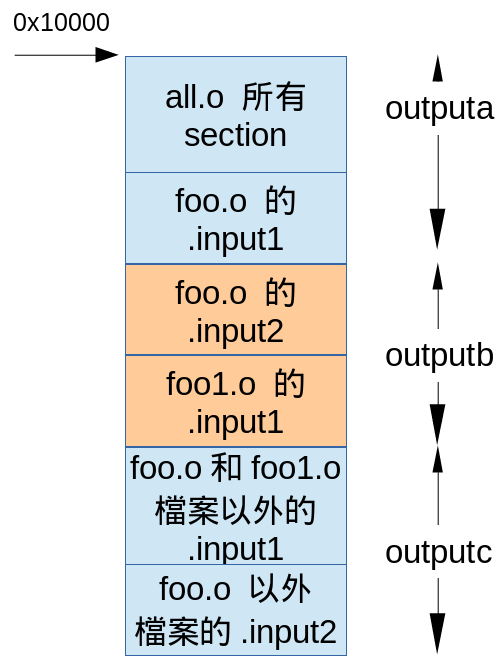

# GNU LD 手冊略讀 (2): Chapter 3.6 SETCIONS

[上一篇](http://wen00072.github.io/blog/2014/12/14/study-on-the-linker-script-1)
[下一篇](http://wen00072.github.io/blog/2014/12/15/study-on-the-linker-script-3)
[回總目錄](http://wen00072.github.io/blog/2014/12/14/study-on-the-linker-script-0-table-of-contents)

## 本篇目錄

* [SECTIONS命令](#sec)
* [輸出object檔案的section描述](#sec-output-desc)
	* [輸入object檔案的section 基礎概念](#sec-input-desc-basic)
	* [輸入object檔案的section 語法的萬用字元](#sec-input-desc-wildcard)
	* [輸入object檔案的COMMOM section](#sec-input-desc-comm)
	* [KEEP指令](#sec-input-desc-keep)
	* [輸入object檔案放到輸出object檔案範例](#sec-input-desc-ex)
* [輸出object檔案section 命名](#sec-output-name)
* [輸出object檔案section 命令: address欄位](#sec-output-addr)
* [輸入object檔案的section描述](#sec-input-desc)
* [輸出object檔案內指定固定資料長度](#sec-output-data)
* [輸出object檔案捨棄的section](#sec-output-discard)
* [輸出object檔案section其他屬性](#sec-output-attr)
	* [輸出object檔案 Section Type](#sec-output-attr-type)
	* [輸出object檔案 Section LMA](#sec-output-attr-lma)
	* [強制輸出object檔案的 Alignment](#sec-output-attr-output-align)
	* [強制輸入object檔案的 Alignment](#sec-output-attr-input-align)
	* [輸出object檔案 Section 限制](#sec-output-attr-limit)
	* [輸出object檔案 Section Region](#sec-output-attr-region)
	* [輸出object檔案 Section Phdr](#sec-output-attr-output-phdr)
	* [指定輸出object檔案 Section 填空的資料](#sec-output-attr-output-fill)
* [OVERLAY命令](#sec-overlay)


<a name="sec"></a>
## SETCIONS命令
其實一開始是為了看懂這個命令才會想看linker script的。如果接觸過很小型的Embedded OS就會發現很多都是自幹linker script；而這些scripts主要的描述命令就是`SETCIONS`命令。

好了，廢話少說，進入主題。SETCIONS命令命令的功用是

* 告訴linker怎麼把輸入object檔案中的SETCIONS命令對應到輸出object檔案中的sections
* 告訴loader object檔案中的sections要放到記憶體那些地方

SECTIONS命令長這樣子：

```c
SECTIONS
{
	sections-command
	sections-command
	...
}
```

望文生義地猜測可以這樣理解：
輸出object有一些大方向的規範，並且分為不同的section，每個section有他自己的規範。

而`sections-command`可以分為下面幾種功能

* [ENTRY命令](#cmd)
* [設定symbol的值](#assign)
* [描述輸出object檔案的setcion](#sec-output-desc)
* Overlay描述 (不知道是三小)

要注意的事，如果你自幹的linker script沒有描述輸出object檔案的setcion的話，linker會

* 讀輸入object檔案section時，如果該section第一次出現，就在輸出object檔案中加入同樣名稱的section，直到處理完所有的輸入object檔案
* 第一個吃到的輸入object檔案section將當作位址0的起始點

<a name="sec-output-desc"></a>
## 輸出object檔案的section描述


```c
section [address] [(type)] :
	[AT(lma)]
	[ALIGN(section_align) | ALIGN_WITH_INPUT]
	[SUBALIGN(subsection_align)]
	[constraint]
	{
		output-section-command
		output-section-command
		...
	} [>region] [AT>lma_region] [:phdr :phdr ...] [=fillexp]
```

其中`output-section-command`的功能有

* [設定symbol的值](#assign)
* 描述輸入object檔案中的section要怎麼放到輸出object檔案的setcion
* 輸出object檔案的setcion的資料存放格式如alignment等
* 其他

這邊很多術語需要先搞清楚，先列出來，希望之後可以看到解答

* type
* region
* AT(lma)
* lma_region

<a name="sec-output-name"></a>
## 輸出object檔案的section 命名

* 必須符合你要輸出object檔案binary format規定。

<a name="sec-output-addr"></a>
## 輸出object檔案section 命令: address欄位

address是[section](#sec-output-desc)的一個optional欄位，使用的記憶體空間為[VMA](#bkg-layout)。如果沒有指定的話，linker會依下面的方式設定輸出object檔案section 的VMA。該VMA會遵循section 的alignment規範。

* 有設定`region`的話就從region內剩餘空間開始位址
* 有使用`MEMORY`命令定義硬體記憶區塊的話，從定義的區塊中挑**第一個**符合SECTION的區塊。再將address設成該區塊內剩餘空間開始位址
* 以上皆非的情況下，位址設成locale counter

address欄位因為可以使用exression所以可能有下面的陷阱

* `.text . : { *(.text) }`
* `.text : { *(.text) }`
這兩個差一個`.`，意義就差很多。沒有`.`那個，表示沒有設定address，所以就是設成locale counter，並且linker會保證alignment。而有`.`的就表示hardcode成locale counter，所以有可能會有alignment的問題。

另外一點要注意的設定後locale counter也會跟著改變。

<a name="sec-input-desc"></a>
## 輸入object檔案的section描述

這部份可以說是整個`output-section-command`的重點，目的是告訴linker讀取輸入object檔案後，怎麼把這些檔案裏面的section複製到輸出object檔案裏面**適當地**section。

輸入object檔案的section描述可以被分為下面幾個部份

* [輸入object檔案的section 基礎概念](#sec-input-desc-basic)
* [輸入object檔案的section 語法的萬用字元](#sec-input-desc-wildcard)
* [輸入object檔案的COMMOM section](#sec-input-desc-comm)
* [KEEP指令](#sec-input-desc-keep)
* [輸入object檔案放到輸出object檔案範例](#sec-input-desc-ex)

<a name="sec-input-desc-basic"></a>
## 輸入object檔案的section 基礎概念

格式為`檔案(section1  section2 ...)`，檔案支援[萬用字元](https://sourceware.org/binutils/docs/ld/Input-Section-Wildcards.html#Input-Section-Wildcards)。

所以常看到的`*(.text)`的意思是：所有輸入object檔案裏面的`.text` section。

指定多個section的方式有兩種

* `*(.sec1 .sec2)`：如果輸入object有兩個檔案的話，輸出object檔案裏面section會變成


* `*(.sec1) *(.sec2)`: 如果輸入object有兩個檔案的話，輸出object檔案裏面section會變成


你也可以根據flag區分object檔案的section，範例如下

```c
SECTIONS {
	.text : { INPUT_SECTION_FLAGS (SHF_MERGE & SHF_STRINGS) *(.text) }
	.text2 :  { INPUT_SECTION_FLAGS (!SHF_WRITE) *(.text) }
}
```

望文生義可以看到上面的規範就是

* **所有**輸入object檔案的`.text`section flag有SHF_MERGE 和 SHF_STRINGS的，請放在輸出object檔案的`.text` section
* **所有**輸入object檔案的`.text`section flag沒有SHF_WRITE的，請放在輸出object檔案的`.text2` section

你如果對於範例中的flag有興趣，可以看[這邊](http://refspecs.linuxfoundation.org/elf/gabi4+/ch4.sheader.html), [這邊](http://refspecs.linuxfoundation.org/LSB_4.1.0/LSB-Core-generic/LSB-Core-generic/sections.html)，還有[這邊](http://refspecs.linuxfoundation.org/LSB_4.1.0/LSB-Core-generic/LSB-Core-generic/specialsections.html)。我目前還不想看就是了。

另外指定輸入object檔案部份，除了指定單獨的輸入object檔案，還可以指定archieve (如libwen.a, libc.a)裏面的object檔案，用法如下
`archive:file`，隨便猜一個範例`libc.a:fprintf.o`

<a name="sec-input-desc-wildcard"></a>
## 輸入object檔案的section 語法的萬用字元

支援
`*`：任何長度的任何字元
`?`：單一任何字元
`[]`：單一字元有效的範圍如`[a-z]`指小寫英文字母
`\`：接下來的字元**不是**萬用字元，如`\*`

由於linker複製section的方式是多個條件滿足的話，選第一個條件滿足就處理，所以配合萬用字元可能會產生意想不到的錯誤，範例如下

```c
.data : { *(.data) }
.data1 : { data.o(.data) }
```

由於複製section的方式是第一個條件滿足就處理，所以會造成data.o的`.data` section放字輸出object檔案的`.data` section而不是`.data1` section。手冊提供了建議處理方式，有興趣的可以[參考](https://sourceware.org/binutils/docs/ld/Input-Section-Wildcards.html#Input-Section-Wildcards)。

<a name="sec-input-desc-comm"></a>
## 輸入object檔案的COMMOM section

* [這邊](http://wen00072-blog.logdown.com/posts/245647-global-variables-from-common-symbol-on-the-c-programming-language#elf-concl)有提到common symbol存在的原因。手冊中更進一步的提到在輸出object檔案時的命令大概是這樣：

```c
.bss { *(.bss) *(COMMON) }
```

也就是說，最後沒特別狀況，就把輸入object 檔案的COMMON section放在`.bss` section。

<a name="sec-input-desc-keep"></a>
## KEEP指令

* `KEEP(要保留的section)`：因為linker有garbage collection，如果要保證section不會被回收，可以用該指令。

<a name="sec-input-desc-ex"></a>
## 輸入object檔案放到輸出object檔案範例


```c
SECTIONS {
	outputa 0x10000 :
	{
		all.o
		foo.o (.input1)
	}
	outputb :
	{
		foo.o (.input2)
		foo1.o (.input1)
	}
	outputc :
	{
		*(.input1)
		*(.input2)
	}
}
```

以圖示就是


<a name="sec-output-data"></a>

## 輸出object檔案內指定固定資料長度

* `長度單位命令(expression)`
	* 長度單位命令
		* `BYTE`：1 byte
    * `SHORT`：2 bytes
    * `LONG`：4 bytes
    * `QUAD`：8 byte

以下的命令將會佔 5 bytes，第一個byte後面4個bytes將用來存放addr (如果我英文沒看錯的話，原文是store the byte 1 followed by the four byte value of the symbol `addr':)。
`BYTE(1)`
`LONG(addr)`

關於64-bit的目前沒心情看，跳過。

至於endian的部份，如果輸出的object檔案有規範，則依該規範存放，否則則遵守第一個讀入的輸入object檔案。

* `FILL(expression)`：section內沒使用的空間將被填入expression計算後的數字。同樣效果的命令是`[=fillexp]`，忘記這是啥嗎?我也忘了，所以回去[找了一下](#sec-output-desc)


## 3.6.6看不懂，跳過。


<a name="sec-output-discard"></a>

## 輸出object檔案捨棄的section
為什麼要丟掉？原因是在設定輸出section的script有提到特定的section，但是link完畢後發現所有輸入object檔案都沒有該section的symbol。最後就是把這些section丟掉。

另外一個情況是輸入object檔案有`/DISCARD/`既然就說要丟了就恭敬不如從命了。

<a name="sec-output-attr"></a>

## 輸出object檔案section其他屬性

還記得前面的格式嘛？再複習一下:

```c
section [address] [(type)] :
	[AT(lma)]
	[ALIGN(section_align) | ALIGN_WITH_INPUT]
	[SUBALIGN(subsection_align)]
	[constraint]
	{
		output-section-command
		output-section-command
		...
	} [>region] [AT>lma_region] [:phdr :phdr ...] [=fillexp]
```

前面篇幅已經說明了`section`，`address`，以及`output-section-command`等語法和命令，我們接著要介紹其他部份如下

* [輸出object檔案 Section Type](#sec-output-attr-type)
* [輸出object檔案 Section LMA](#sec-output-attr-lma)
* [強制輸出的 Alignment](#sec-output-attr-output-align)
* [強制輸入的 Alignment](#sec-output-attr-input-align)
* [輸出object檔案 Section 限制](#sec-output-attr-limit)
* [輸出object檔案 Section Region](#sec-output-attr-region)
* [輸出object檔案 Section Phdr](#sec-output-attr-output-phdr)
* [指定輸出object檔案 Section 填空的資料](#sec-output-attr-output-fill)


<a name="sec-output-attr-type"></a>
## 輸出object檔案 Section Type
有支援

* `NOLOAD`
	* 當程式執行的時候不載入到記憶體（想像ROM或是NOR FLASH）
* `DSECT`
* `COPY`
* `INFO`
* `OVERLAY`
	* 上面四個是為了往前相容保留的type，基本上很少用了。用途都相同，指定該區段不可以分配記憶體。不過我本身不懂什麼情況下不要分配記憶體就是了。

基本上type繼承輸入object中的type，不過你要硬上就是在輸出object檔案描述，範例如下。該範例顯示ROM 區段起始位址為0，並且在該section執行程式不要載入到記憶體。

```c
SECTIONS {
	ROM 0 (NOLOAD) : { ... }
	...
}
```


<a name="sec-output-attr-lma"></a>
## 輸出object檔案 Section LMA
前情回顧

* [VMA](http://wen00072-blog.logdown.com/posts/246069-study-on-the-linker-script-1#bkg-layout)
* [LMA](http://wen00072-blog.logdown.com/posts/246069-study-on-the-linker-script-1#bkg-layout)

設定輸出object檔案的[VMA](http://wen00072-blog.logdown.com/posts/246069-study-on-the-linker-script-1#bkg-layout)是在[`address欄位`](#sec-output-addr)中指定。請比對[section描述格式](#sec-output-attr)的`address`。

而[LMA](http://wen00072-blog.logdown.com/posts/246069-study-on-the-linker-script-1#bkg-layout)就是[section描述格式](#sec-output-attr)的`AT(lma)`和`AT>lma_region`這兩個部份了。這兩個指令是optional的。他們的差別是：

* `AT(lma)`中間的lma是透過expression算出來的lma位址
* `AT>lma_region`是指定`MEMORY`裏面描述的region

如果你的section沒有指定[LMA](http://wen00072-blog.logdown.com/posts/246069-study-on-the-linker-script-1#bkg-layout)的話，linker會使用下面的規則決定[LMA](http://wen00072-blog.logdown.com/posts/246069-study-on-the-linker-script-1#bkg-layout)

* [`address欄位`](#sec-output-addr)中指定VMA，則LMA = VMA
* section為[allocatable](http://wen00072-blog.logdown.com/posts/246069-study-on-the-linker-script-1#fmt)，則LMA = VMA
* 有設定region的情況在滿足下面的條件下，把VMA和LMA的差距會被設成該region裏面最後一個section中VMA和LMA的差距。
  * section滿足region條件(三小條件?)
  * 該region已經有最少一個section
* 沒有設定region的情況在找不到相容的region，linker會指令預設包含所有memory space的region，從裏面挑一個section，把VMA和LMA的差距會被設成該region裏面最後一個section中VMA和LMA的差距。 (三小？為什麼要這樣做？）
* 找不到合適的region放section的話，就閉著眼睛把LMA = VMA吧。

來點範例，這是一個嵌入式系統，假設所有的資料都放在唯讀記憶體中。那麼會發生什麼事呢？那就是你的`i++`就GG了，所以要把變數部份還有其他需要寫入的部份放在RAM中，所以這個script顯示了

* VMA的0x1000的位址放程式碼
* VMA的0x2000放有初始化的全域變數，而這些初始值從那邊搬到記憶體呢來呢？就是LMA描述的東西，望文生義可以知道是接在.text之後的資料。
* VMA的0x3000就是放未初始化的全域變數

```c
SECTIONS
{
		.text 0x1000 : { *(.text) _etext = . ; }
		.mdata 0x2000 :
			AT ( ADDR (.text) + SIZEOF (.text) )
			{ _data = . ; *(.data); _edata = . ;  }
		.bss 0x3000 :
			{ _bstart = . ;  *(.bss) *(COMMON) ; _bend = . ;}
}
```

當然事情沒那麼簡單，這邊只有講layout。在沒有OS幫你搞定的時候什麼事都要自己來，所以你還要自己把有初始化的全域變數一個一個搬到RAM裏面如下。請仔細比對變數和script的symbol。另外如果有興趣看[CMSIS(Cortex Microcontroller Software Interface Standard)](http://www.arm.com/products/processors/cortex-m/cortex-microcontroller-software-interface-standard.php)的source code也可以看到類似的行為。

```c
extern char _etext, _data, _edata, _bstart, _bend;
char *src = &_etext;
char *dst = &_data;

/* ROM has data at end of text; copy it.  */
while (dst < &_edata)
	*dst++ = *src++;

/* Zero bss.  */
for (dst = &_bstart; dst< &_bend; dst++)
	*dst = 0;
```


<a name="sec-output-attr-output-align"></a>
## 強制輸出object檔案的 Alignment
請使用`ALIGN`，或是使用`ALIGN_WITH_INPUT`將讀入的object檔案中的section設定成你要的alignment。


<a name="sec-output-attr-input-align"></a>
## 強制輸入object檔案的 Alignment
請使用`SUBALIGN` 去指定輸入object檔案單一個section的alignment。


<a name="sec-output-attr-limit"></a>
## 輸出object檔案 Section 限制

* `ONLY_IF_RO`
	* 當輸入object檔案符合條件的section為唯讀才產生你要的輸出object檔案section
* `ONLY_IF_RW`
	* 當輸入object檔案符合條件的section為可讀寫才產生你要的輸出object檔案section


<a name="sec-output-attr-region"></a>
### 輸出object檔案 Section Region
使用`>MEMORY_指令_宣告的region`

範例，把`.text`放ROM section，該section位址是在硬體rom記憶體區塊。
```c
MEMORY { rom : ORIGIN = 0x1000, LENGTH = 0x1000 }
SECTIONS { ROM : { *(.text) } >rom }
```


<a name="sec-output-attr-output-phdr"></a>
## 輸出object檔案 Section Phdr
PHDR 是[ELF](http://en.wikipedia.org/wiki/Executable_and_Linkable_Format)的program header縮寫，又稱為segment。當ELF loader載入ELF執行檔的時候，會看這些segment決定要如何把讀入的檔案放在記憶體中，這部份和[ABI](http://en.wikipedia.org/wiki/Application_binary_interface)有關係，按下不表，等我那天心情好再來看ELF和ABI。

[section描述格式](#sec-output-attr)中`phdr`的用法是

* 宣告一個phdr
* 指令特定的section屬於該phdr

範例如下
```c
PHDRS { text PT_LOAD ; }
SECTIONS { .text : { *(.text) } :text }
```


<a name="sec-output-attr-output-fill"></a>
## 指定輸出object檔案 Section 填空的資料
[前面FILL](#sec-output-data)講到指令填空的資料。而[section描述格式](#sec-output-attr)中`=fillexp`也有相同效果，範例如下

```c
SECTIONS { .text : { *(.text) } =0x90909090 }
```


<a name="sec-overlay"></a>
## OVERLAY命令
[Overlay](http://en.wikipedia.org/wiki/Overlay_%28programming%29)是一種在記憶體小於執行檔案時的技巧。其基本概念就是

* 把程式切成不同模組
* 載入單個模組到記憶體並執行，當程式行為Z要另外一個模組的話，就釋放目前模組，再載入新的模組到記憶體並執行。

對應到linker script就會格式這樣

```c
OVERLAY [start] : [NOCROSSREFS] [AT ( ldaddr )]
{
	secname1
	{
		output-section-command
		output-section-command
	...
	} [:phdr...] [=fill]
	secname2
	{
		output-section-command
		output-section-command
		...
	} [:phdr...] [=fill]
...
} [>region] [:phdr...] [=fill]
```

OVERLAY命令中除了`OVERLAY`和`section 名稱`以外其他都是optional。另外要注意的是`OVERLAY`命令不允許region和address的描述。而在`OVERLAY`最後面的資料固定為`OVERLAY起始位址` + `最大section的size`

由於OVERLAY就是動態切換並執行不同section，所以在VMA的位址會固定。這表示所有的section的VMA會相同。為了方便，linker會把所有`OVERLAY`中的section串接成連續的空間。

OVERLAY用法如下

* linker script設定OVERLAY
* 程式語言視情況需要切換時「人肉」搬移OVERLAY裏面的section到記憶體

「人肉」搬移表示我們需要

* section 起始位址
* section 結束位址

這部份linker會自動幫我們加入symbol，規則如下，很容易望文生義所以就不解釋了。

* `__load_start_section_名稱`
* `__load_stop_section_名稱`

那麼現在看一下手冊上面的範例
```c
OVERLAY 0x1000 : AT (0x4000)
{
	.text0 { o1/*.o(.text) }
	.text1 { o2/*.o(.text) }
}
```

還記得[address](#sec-output-addr)和[AT](#sec-output-attr-lma)命令嗎？一個是指定VMA另外一個是指定LMA。所以上面的設定白話文就是

* 我要一個overlay，從0x4000載入到0x1000的記憶體內
* 這個overlay有`.text0`和`.text1`兩個section
* `.text0`裏面放的是o1目錄下所有object檔案中的`.text`
* `.text1`裏面放的是o2目錄下所有object檔案中的`.text`

那麼人肉搬移要怎麼處理呢？手冊列出如下

```c
	extern char __load_start_text1, __load_stop_text1;
	memcpy ((char *) 0x1000, &__load_start_text1,
	      	&__load_stop_text1 - &__load_start_text1);
```

可以看到，我們說要從LMA搬到VMA，LMA的位址就由symbol內容提供。

另外手冊這個[section](https://sourceware.org/binutils/docs/ld/Overlay-Description.html#Overlay-Description)我跳過一些東西，有興趣的朋友可以去超級比一比。

[上一篇](http://wen00072.github.io/blog/2014/12/14/study-on-the-linker-script-1)
[下一篇](http://wen00072.github.io/blog/2014/12/15/study-on-the-linker-script-3)
[回總目錄](http://wen00072.github.io/blog/2014/12/14/study-on-the-linker-script-0-table-of-contents)
