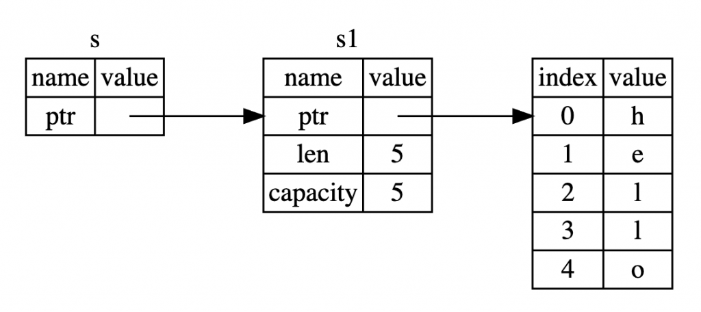

## Rust語法速查表

```rust
let a = 1;  							// 定義變量，默認不可變
let b: bool = true;				// 明確指定變量類型
let mut x = 5;						// 定義可變變量
const MAX_POINTS: u32 = 100_000;   // 定義常量
let i:i32 = _f as i32;		// 轉數據類型
type Int = i32;  					// 用關鍵字 type 為i32類型創建別名Int

// Rust 的 never 類型（ ! ）用於表示永遠不可能有返回值的計算類型。
#![feature(never_type)] 	
let x:! = {
    return 123
};

// 對整行進行注釋
/* ..  對區塊注釋  */
/// 生成庫文檔，一般用於函數或者結構體的說明，置於說明對象的上方
//! 也生成庫文檔，一般用於說明整個模塊的功能，置於模塊文件的頭部

let tup: (i32, f64, u8) = (500, 6.4, 1);			// 元組（tuple）
let (x, y, z) = tup;													// 模式匹配（pattern matching）來解構元組值
(1,)   // 當元組中只有一個元素時，需要加逗號，即 
｀()｀  // 空元組，
let arr: [i32; 3] = [1, 2, 3];  // 數組
assert_eq!((1..5), Range{ start: 1, end: 5 }); // 范圍類型，左閉右開
assert_eq!((1..=5), RangeInclusive::new(1, 5)); // 范圍類型，全閉
let arr: [i32; 5] = [1, 2, 3, 4, 5];						// 固定大小數組的切片
let arr = &mut [1, 2, 3];												// 可變數組的切片
let vec = vec![1, 2, 3];												// 使用 vec! 宏定義的動態數組的切片
let str_slice: &[&str] = &["one", "two", "three"];		// 字符串數組的切片
pub struct People {															// Named-Field Struct
    name: &'static str,
    gender: u32,
} // 注意這裡沒有分號
let alex = People::new("Alex", 1); // 用 :: 來調用new方法，默認不可變
struct Color(i32, i32, i32); // 注意這裡要有分號！ Tuple-Like Struct，字段沒有名字，只有類型
let color = Color(0, 1, 2);		// 直接構造，不用new方法
struct Integer(u32); // 當元組結構體只有一個字段的時候，稱為 New Type 模式
struct Empty;					// 等價於  struct Empty {}，單元結構體是沒有任何字段的結構體。

enum Number {		// 無參數枚舉
    Zero,
    One,
    Two,
}
enum Color {		// 類C枚舉
    Red = 0xff0000,
    Green = 0x00ff00,
    Blue = 0x0000ff,
}
enum IpAddr {		// 帶參數枚舉
    V4(u8, u8, u8, u8),
    V6(String),
}
let mut v1 = vec![]; 					// 用宏創建可變向量
let v2 = vec![0; 10];					// 用宏創建不可變向量
let mut v3 = Vec::new();			// 用 new 方法創建向量

let a = [1,2,3]; 
let b = &a;										// 引用操作符 &，不可變，本質上是一種非空指針
let mut c = vec![1,2,3];			// 要獲取可變引用，必須先聲明可變綁定
let d = &mut c;								// 通過 &mut 得到可變引用

let mut x = 10;
let ptr_x = &mut x as *mut i32;			// 可變原始指針 *&mut T
let y = Box::new(20);
let ptr_y = &*y as *const i32;			// 不可變原始指針 *const T


pub fn math(op: fn(i32, i32) -> i32, a: i32, b: i32) -> i32{			// 將函數作為參數傳遞
    op(a, b)				/// 通過函數指針調用函數
}
fn true_maker() -> fn() -> bool { is_true }				// 函數的返回值是另外一個函數

let box_point = Box::new(Point { x: 0.0, y: 0.0 });		// 智能指針
```


## 流程處理

```rust
let big_n = if n < 10 && n > -10 { // if 不帶括號，真不適應
    10 * n
} else {
    n / 2
};

for n in 1..101 {} 	// for … in 循環
while n < 101 {}	// while 循環
loop { }	// loop 循環，相當於一個 while true，需要程序自己 break
```


## 函數回傳一個函數

```rust
fn func_exit() -> bool {
    println!("hi");
    true
}

fn locate_func() -> fn() -> bool {
    func_exit
}

fn main() {
    let f = locate_func();
    f();
}
```


## 如何在Rust中打印变量的类型？

```rust
fn print_type_of<T>(_: &T) {
    println!("{}", std::any::type_name::<T>())
}

fn main() {
   // Reference to str
   let s: &str = "Hello";
   print_type_of(&s);
 
   // String object
   let s_obj: String = String::from("Hello");
   print_type_of(&s_obj);

   let s = "Hello";
   let i = 42;

   print_type_of(&s); // &str
   print_type_of(&i); // i32
   print_type_of(&main); // playground::main
   print_type_of(&print_type_of::<i32>); // playground::print_type_of<i32>
   print_type_of(&{ || "Hi!" }); // playground::main::{{closure}}
}
```

### Rust 的字串有以下兩種：

- String 類別是以 UTF8 編碼、可伸縮的字串
- str 是基礎型別，通常是使用 &str，即指向 str 的參考

另外，Rust 還有字元 (char) 型別，同樣也是以 UTF8 編碼。

建立字串常數時，預設型別是 &str，即指向 str 的參考，但是，若想要使用 String 類別的方法時，可以轉為 String 物件。

```rust
fn main () {
    // Reference to str, str 是基礎型別，通常是使用 &str，即指向 str 的參考
    let x = "hello world";
    let y = x;
    println!("{:p}", x.as_ptr());
    println!("{:p}", y.as_ptr());


    // String object, str 是基礎型別，通常是使用 &str，即指向 str 的參考
    let s_obj: String = String::from("Hello");
    let s1_obj = s_obj;
                 ^^^^^^^^^^^^^^ value borrowed here after move
    println!("{:p}", s_obj.as_ptr());
    println!("{:p}", s1_obj.as_ptr());
}
```

### Move, Borrow & Ownership

Rust 中可說是最複雜，卻也是最重要的一個觀念，變數的所有權 (ownership) ，在 Rust 中每個變數都有其所屬的範圍 (scope) ，在變數的有效的範圍中，可以選擇將變數「借 (borrow)」給其它的 scope ，也可以將所有權整個轉移 (move) 出去，送給別人喔，當然，送出去的東西如果別人不還你的話是拿不回來的，但借出去的就只是暫時的給別人使用而已。

```rust
fn main()
{
    let message = String::from("Hello");
    {
        message;
    }
    println!("{}", message);
                   ^^^^^^^ value borrowed here after move 
}
```

### Ownership 的規則還有 copy 跟 move 的差異。

```rust
// https://ithelp.ithome.com.tw/articles/10222382

fn print_type_of<T>(_: &T)
{
    println!("{}", std::any::type_name::<T>())
}

fn move_vs_copy()
{
    // 這邊的 y 在記憶體中複製了一整份完整的資料
    let x = 5;
    let y = x;
    println!("{}", x);
    // s1 的指標和長度等資訊轉移給 s2
    let s1 = String::from("hello");
    let s2 = s1;
    println!("{}", s1);
                   ^^ value borrowed here after move
}

fn main()
{
    move_vs_copy();
}
```

各位可以看到這個例子在印出 x 時沒有問題但是怎麼卻沒辦法印出 s1 呢？因為 x 跟 y 用的是 copy 的方式但是 s1 跟 s2 用的是 move 的方式。


### Clone

如果需要完整地複製 heap 的資料 Rust 也有提供 clone 的方法如下，

```rust
let s1 = String::from("hello");
let s2 = s1.clone();

println!("s1 = {}, s2 = {}", s1, s2);
```


### Ownership and Functions

傳遞值給函式(function)時其實跟我們把值 assign 給變數時是類似的方式，也就是說當把值傳給函式時同樣會用 move 或是 copy 的方法處理，那麼我們就直接看個例子，

```rust
fn ownership_and_functions()
{
    let s = String::from("hello"); // s 現在在 scope 裡面

    takes_ownership(s); // 由於 s 是用 heap 法處理所以 move
    // 因此 s 的所有權已經被轉移了

    println!("s = {}", s); // 這時已經取得不了 s 編譯會報錯
    ^ value borrowed here after move

    let x = 5; // 反之如果是 stack 法處理

    makes_copy(x); // x 就會 copy 一份後進到函式裡面
    // 所以還是可以印得出 x 不會報錯
    println!("x = {}", x);
}

fn takes_ownership(some_string: String)
{
    println!("{}", some_string);
}

fn makes_copy(some_integer: i32)
{
    println!("{}", some_integer);
}
```

如果我們試著取得 s 在他 move 所有權之後編譯器就會報錯反之如果是用 copy 的方式處理的就不會。

### Return Values and Scope

而同樣當函式返回值的時候也會轉移所有權，例如下面的例子，

```rust
fn ownership_and_return_values()
{
    let s1 = gives_ownership(); // s1 的所有權是從 gives_ownership 來的, 其值為 "hello"

    let s2 = String::from("hello"); // 宣告一個新的變數 s2

    let s3 = takes_and_gives_back(s2); // s2 move 進 takes_and_gives_back
    // takes_and_gives_back, 同時也返回所有權, 現在 s3 擁有所有權

    println!("{}", s2); // 報錯因為 s2 的所有權已經轉移給 s3
    println!("{}", s3); // 不會報錯 s3 擁有所有權
}

fn gives_ownership() -> String {
    // gives_ownership 這支程式將會把 some_string 的擁有權
    // 傳出去給呼叫他的另外一個擁有者

    let some_string = String::from("hello"); // 宣告一個新的變數 some_string
    some_string // 返回 some_string, move 出去給呼叫他的擁有者
}

// 直接返回傳入的值
fn takes_and_gives_back(a_string: String) -> String {
    a_string
}
```

也就是說 ownership (所有權)會在函式之中被傳來傳去，但是同時也造成麻煩例如，

```rust
fn main()
{
    let s1 = String::from("hello");
    let(s2, len) = calculate_length(s1);
    println!("The length of '{}' is {}.", s2, len);
}

// 如果我們還需要使用 s 時必須再把他回傳
fn calculate_length(s: String) -> (String, usize)
{
    let length = s.len(); // 算出 String 的長度
    (s, length)
}
```

這樣的方式太攏長會造成寫程式時的不便，因此接下來會介紹 Rust `reference` 的概念。

### References

首先我們來稍微改寫一下上一篇的例子，

```rust
fn main()
{
    let s1 = String::from("hello");
    let len = calculate_length(&s1); // 傳遞 reference 但是沒有 ownership
    println!("The length of '{}' is {}.", s1, len);
}

fn calculate_length(s: &String) -> usize {
    s.len()
} // 因為沒有任何 ownership 所以 drop 也不會怎樣
```

各位注意到有什麼變化了嗎？

1. 函式的參數多了個 & 的符號
2. s1 還是可以使用 ownership 沒有被轉移

首先

- 第一點 & 的符號就代表這個參數是 reference
- 第二點 reference 讓你可以指到你要的值但是不需要轉移 ownership

我們借官網的圖來看比較好懂，




因此 references(參照) 字面上來說就跟實際行為蠻像的，感覺就是請你參照他就好但我不必擁有他。

那麼如果我們想要修改 borrowing(借)來的 references 的呢？舉個例子，

```rust
fn main() {
    let s = String::from("hello");
    unchangeable(&s);
}

fn unchangeable(some_string: &String) {
    some_string.push_str(", world");
    ^^^^^^^^^^^ `some_string` is a `&` reference, so the data it refers to cannot be borrowed as mutable
}
```


在編譯時就會報錯，因為這個 reference 指向的是 immutable 的變數所以我們並不能修改他。

## Mutable References

前面的例子除非改成 mutable 才可以修改，例如，

```rust
fn changeable(some_string: &mut String)
{
    some_string.push_str(", world");
}

fn main()
{
    let mut s = String::from("hello");
    changeable(&mut s);
    println!("s = {}", s); // s = hello, world
}
```

這樣就可以編輯，但是 Rust 對這樣的寫法有很大的限制，在同一個 scope 不能同時宣告 2 個以上的 mutable reference 因此像是這個例子就會報錯，

```rust
fn cause_error()
{
    let mut s = String::from("hello");
    let r1 = &mut s;
    let r2 = &mut s;
    ^^^^^^ second mutable borrow occurs here
    println!("{}, {}", r1, r2);
}
```

而主要的原因是 Rust 要避免在編譯期間造成 data race， data race 類似於 race condition 他通常發生於下列三種情況，

- 2 個以上的 mutable reference 同時取得同一個值
- 至少一個 pointer 被用來寫入資料
- 沒有同步訪問數據的機制

[這裡](https://en.wikipedia.org/wiki/Race_condition)有 wiki 的補充資料可以更了解 race condition，簡單來說就是處理資料時的先後順序沒處理好而導致資料錯誤的情況。

基本上 data race 會造成 undefined 而且不容易找出 bug，而這也是 Rust 希望可以幫助工程師避免的情況，所以才會有這樣的限制，基本上就算沒有限制筆者也會避免這樣的設計方式，除非有非常不得已的理由。

同樣的錯誤也會出現在同時擁有 immutable 跟 mutable reference 的 scope 裡面例如，

```rust
let mut s = String::from("hello");

let r1 = &s; // no problem
let r2 = &s; // no problem
let r3 = &mut s; // BIG PROBLEM
         ^^^^^^ mutable borrow occurs here

println!("{}, {}, and {}", r1, r2, r3);
```

這個錯的情況很容易理解，我們不能給了 immutable 的 reference 之後又他給 mutable 的 reference 你到底是要我變還是不變呢？

另外是 reference 的 scope 從被宣告開始到最後一次被使用之後就結束了所以像是這個例子是可以的，

```rust
fn this_work()
{
    let mut s = String::from("hello");

    let r1 = &s; // no problem
    let r2 = &s; // no problem
    println!("{} and {}", r1, r2);
    // 在這之後不再使用 r1 和 r2

    let r3 = &mut s; // no problem
    println!("{}", r3);
}
```

同要的道理我先 mutable 再 immutable 也是可以的例如，

```rust
fn this_still_work()
{
    let mut s = String::from("hello");
    let r1 = &mut s;
    // 在這之後不再使用 r1
    let r2 = &s;
    let r3 = &s;
    println!("{} {}", r2, r3);
}
```

還有如果在不同 scope 例如這樣也是可以的，

```rust
fn this_work_too()
{
    let mut s = String::from("hello");

    {
        let r1 = &mut s;

    } // r1 goes out of scope here, so we can make a new reference with no problems.

    let r2 = &mut s;
}
```

## Dangling References

[迷途指標](https://zh.wikipedia.org/wiki/迷途指针)，筆者我比較喜歡這個翻法比較直覺，簡單來說就是值已經被釋放了但是 reference 沒有收回來。

不過完全不用擔心因為 Rust 說保證不會發生這個情況他會在編譯時幫我們做檢查，來看這個例子，

```rust
fn main() {
    let reference_to_nothing = dangling_references();
}

// help: this function's return type contains a borrowed value, but there is no value for it to be borrowed from
fn dangling_references() -> &String {
                            ^ help: consider giving it a 'static lifetime: `&'static`
  let s = String::from("hello");
  &s
} // s 在這邊已經離開 scope 了但是卻回傳了他的 reference，因此就會造成迷途指標。
```

這邊要這樣改才會正常

```rust
fn main()
{
    let reference_to_nothing = no_dangling_references();
}

fn no_dangling_references() -> String {
    let s = String::from("hello");
    s
}
```


### 裸指標使用需配合unsafe

```rust
fn print_type_of<T>(_: &T) {
    println!("{}", std::any::type_name::<T>())
}

fn main() {
    let mut num = 5;
    let mut n = 5;

    let r1 = &num as *const i32;
    print_type_of(&n);
    print_type_of(&r1);
    let mut r2 = &mut num as *mut i32;
    print_type_of(&r2);

    unsafe {
        *r2 = 44;
        println!("r1 is: {}", *r1);
        println!("r2 is: {}", *r2);
        r2 = &mut n as *mut i32;
        print_type_of(&r2);
        println!("r2 is: {}", *r2);
    }
}
```

---

```rust
fn print_type_of<T>(_: &T) {
    println!("{}", std::any::type_name::<T>())
}

fn main() {
    let mut n = 42;
    let mut c = 55;
    {
        let mut a = &mut n as &mut i32;
        print_type_of(&a);
        *a += 5;
        println!("{}", a); 
        a = &mut c;
        *a += 100;
        println!("{}", a);
    }
    println!("{}", c); 
    println!("{}", n); 
}
```


# 裸指针

**Rust**通过限制智能指针的行为保障了编译时安全，不过仍需要对指针做一些额外的操作。

`*const T`和`*mut T`在**Rust**中被称为“裸指针”。它允许别名，允许用来写共享所有权的类型，甚至是内存安全的共享内存类型如：`Rc<T>`和`Arc<T>`，但是赋予你更多权利的同时意味着你需要担当更多的责任：

- 不能保证指向有效的内存，甚至不能保证是非空的
- 没有任何自动清除，所以需要手动管理资源
- 是普通旧式类型，也就是说，它不移动所有权，因此**Rust**编译器不能保证不出像释放后使用这种bug
- 缺少任何形式的生命周期，不像`&`，因此编译器不能判断出悬垂指针
- 除了不允许直接通过`*const T`改变外，没有别名或可变性的保障

```rust

fn main() {
    let a = 1;
    let b = &a as *const i32;
    let c = unsafe { *b };
    println!("{}", c);

    let mut x = 2;
    let y = &mut x as *mut i32;
    let d = unsafe {
        *y = 9;
        *y
    };
    println!("{}", d);

    let a: Box<i32> = Box::new(10);
    // 我们需要先解引用a，再隐式把 & 转换成 *
    let b: *const i32 = &*a;
    // 使用 into_raw 方法
    let c: *const i32 = Box::into_raw(a);

    unsafe {
        println!("{}", *c);
    }
} // a 與 m 會在這邊消失
```


##  所有权（Ownership）

### 绑定（Binding）

**重要**：首先必须强调下，准确地说Rust中并没有变量这一概念，而应该称为`标识符`，目标`资源`(内存，存放value)`绑定`到这个`标识符`：

```rust
{
    let x: i32;       // 标识符x, 没有绑定任何资源
    let y: i32 = 100; // 标识符y，绑定资源100
}
```

好了，我们继续看下以下一段Rust代码：

```rust
{
    let a: i32;
    println!("{}", a);
}
```

上面定义了一个i32类型的标识符`a`，如果你直接`println!`，你会收到一个error报错：

> error: use of possibly uninitialized variable: `a`

这是**因为Rust并不会像其他语言一样可以为变量默认初始化值，Rust明确规定变量的初始值必须由程序员自己决定**。

正确的做法：

```rust
{
    let a: i32;
    a = 100; //必须初始化a
    println!("{}", a);
}
```

其实，**`let`**关键字并不只是声明变量的意思，它还有一层特殊且重要的概念-**绑定**。通俗的讲，`let`关键字可以把一个标识符和一段内存区域做“绑定”，绑定后，这段内存就被这个标识符所拥有，这个标识符也成为这段内存的唯一**所有者**。 所以，`a = 100`发生了这么几个动作，首先在栈内存上分配一个`i32`的资源，并填充值`100`，随后，把这个资源与`a`做绑定，让`a`成为资源的所有者(Owner)。


### **作用域**

像C语言一样，Rust通过`{}`大括号定义作用域：

```rust
{
    {
        let a: i32 = 100;
    }
    println!("{}", a);
}
```

编译后会得到如下`error`错误：

> b.rs:3:20: 3:21 error: unresolved name `a` [E0425] b.rs:3 println!("{}", a);

像C语言一样，在局部变量离开作用域后，变量随即会被销毁；**但不同是，Rust会连同变量绑定的内存，不管是否为常量字符串，连同所有者变量一起被销毁释放**。所以上面的例子，a销毁后再次访问a就会提示无法找到变量`a`的错误。这些所有的一切都是在编译过程中完成的。

### **移动语义（move）**

先看如下代码：

```rust
{
    let a: String = String::from("xyz");
    let b = a;
    println!("{}", a);
}
```

编译后会得到如下的报错：

> c.rs:4:20: 4:21 error: use of moved value: `a` [E0382] c.rs:4 println!("{}", a);

错误的意思是在`println`中访问了被`moved`的变量`a`。那为什么会有这种报错呢？具体含义是什么？ 在Rust中，和“绑定”概念相辅相成的另一个机制就是“转移move所有权”，意思是，**可以把资源的所有权(ownership)从一个绑定转移（move）成另一个绑定**，这个操作同样通过`let`关键字完成，和绑定不同的是，`=`两边的左值和右值均为两个标识符：

```rust
语法：
    let 标识符A = 标识符B;  // 把“B”绑定资源的所有权转移给“A”
```

move前后的内存示意如下：

> **Before move:**
> a <=> 内存(地址：**A**，内容："xyz")
> **After move:**
> a
> b <=> 内存(地址：**A**，内容："xyz")

被move的变量不可以继续被使用。否则提示错误`error: use of moved value`。

这里有些人可能会疑问，move后，如果变量A和变量B离开作用域，所对应的内存会不会造成“Double Free”的问题？答案是否定的，**Rust规定，只有资源的所有者销毁后才释放内存，而无论这个资源是否被多次`move`，同一时刻只有一个`owner`，所以该资源的内存也只会被`free`一次**。 通过这个机制，就保证了内存安全。是不是觉得很强大？

### **Copy特性**

有读者仿照“move”小节中的例子写了下面一个例子，然后说“a被move后是可以访问的”：

```rust
    let a: i32 = 100;
    let b = a;
    println!("{}", a);
```

编译确实可以通过，输出为`100`。这是为什么呢，是不是跟move小节里的结论相悖了？ 其实不然，这其实是根据变量类型是否实现`Copy`特性决定的。对于实现`Copy`特性的变量，在move时会拷贝资源到新内存区域，并把新内存区域的资源`binding`为`b`。

> **Before move:**
> a <=> 内存(地址：**A**，内容：100)
> **After move:**
> a <=> 内存(地址：**A**，内容：100)
> b <=> 内存(地址：**B**，内容：100)

move前后的`a`和`b`对应资源内存的地址不同。

在Rust中，基本数据类型(Primitive Types)均实现了Copy特性，包括i8, i16, i32, i64, usize, u8, u16, u32, u64, f32, f64, (), bool, char等等。其他支持Copy的数据类型可以参考官方文档的[Copy章节](https://doc.rust-lang.org/std/marker/trait.Copy.html)。

### **浅拷贝与深拷贝**

前面例子中move String和i32用法的差异，其实和很多面向对象编程语言中“浅拷贝”和“深拷贝”的区别类似。对于基本数据类型来说，“深拷贝”和“浅拷贝“产生的效果相同。对于引用对象类型来说，”浅拷贝“更像仅仅拷贝了对象的内存地址。 如果我们想实现对`String`的”深拷贝“怎么办？ 可以直接调用`String`的Clone特性实现对内存的值拷贝而不是简单的地址拷贝。

```rust
{
    let a: String = String::from("xyz");
    let b = a.clone();  // <-注意此处的clone
    println!("{}", a);
}
```

这个时候可以编译通过，并且成功打印"xyz"。

clone后的效果等同如下：

> **Before move:**
> a <=> 内存(地址：**A**，内容："xyz")
> **After move:**
> a <=> 内存(地址：**A**，内容："xyz")
> b <=> 内存(地址：**B**，内容："xyz")
> 注意，然后a和b对应的资源值相同，但是内存地址并不一样。

### **可变性**

通过上面，我们已经已经了解了变量声明、值绑定、以及移动move语义等等相关知识，但是还没有进行过修改变量值这么简单的操作，在其他语言中看似简单到不值得一提的事却在Rust中暗藏玄机。 按照其他编程语言思维，修改一个变量的值：

```rust
let a: i32 = 100;
a = 200;
```

很抱歉，这么简单的操作依然还会报错：

> error: re-assignment of immutable variable `a` [E0384]
>
> :3 a = 200;

不能对**不可变绑定**赋值。如果要修改值，必须用关键字mut声明绑定为可变的：

```rust
let mut a: i32 = 100;  // 通过关键字mut声明a是可变的
a = 200;
```

**想到“不可变”我们第一时间想到了`const`常量，但不可变绑定与`const`常量是完全不同的两种概念；首先，“不可变”准确地应该称为“不可变绑定”，是用来约束绑定行为的，“不可变绑定”后不能通过原“所有者”更改资源内容。**

**例如：**

```rust
let a = vec![1, 2, 3];  //不可变绑定, a <=> 内存区域A(1,2,3)
let mut a = a;  //可变绑定， a <=> 内存区域A(1,2,3), 注意此a已非上句a，只是名字一样而已
a.push(4);
println!("{:?}", a);  //打印：[1, 2, 3, 4]
```

“可变绑定”后，目标内存还是同一块，只不过，可以通过新绑定的a去修改这片内存了。

```rust
let mut a: &str = "abc";  //可变绑定, a <=> 内存区域A("abc")
a = "xyz";    //绑定到另一内存区域, a <=> 内存区域B("xyz")
println!("{:?}", a);  //打印："xyz"
```

上面这种情况不要混淆了，`a = "xyz"`表示`a`绑定目标资源发生了变化。

其实，Rust中也有const常量，常量不存在“绑定”之说，和其他语言的常量含义相同：

```rust
const PI:f32 = 3.14;
```

可变性的目的就是严格区分绑定的可变性，以便编译器可以更好的优化，也提高了内存安全性。

### **高级Copy特性**

在前面的小节有简单了解Copy特性，接下来我们来深入了解下这个特性。 Copy特性定义在标准库[std::marker::Copy](https://doc.rust-lang.org/std/marker/trait.Copy.html)中：

```rust
pub trait Copy: Clone { }
```

一旦一种类型实现了Copy特性，这就意味着这种类型可以通过的简单的位(bits)拷贝实现拷贝。从前面知识我们知道“绑定”存在move语义（所有权转移），但是，一旦这种类型实现了Copy特性，会先拷贝内容到新内存区域，然后把新内存区域和这个标识符做绑定。

**哪些情况下我们自定义的类型（如某个Struct等）可以实现Copy特性？** 只要这种类型的属性类型都实现了Copy特性，那么这个类型就可以实现Copy特性。 例如：

```rust
struct Foo {  //可实现Copy特性
    a: i32,
    b: bool,
}

struct Bar {  //不可实现Copy特性
    l: Vec<i32>,
}
```

因为`Foo`的属性`a`和`b`的类型`i32`和`bool`均实现了`Copy`特性，所以`Foo`也是可以实现Copy特性的。但对于`Bar`来说，它的属性`l`是`Vec<T>`类型，这种类型并没有实现`Copy`特性，所以`Bar`也是无法实现`Copy`特性的。

**那么我们如何来实现`Copy`特性呢？** 有两种方式可以实现。

1. **通过`derive`让Rust编译器自动实现**

    ```rust
     #[derive(Copy, Clone)]
     struct Foo {
         a: i32,
         b: bool,
     }
    ```

    编译器会自动检查`Foo`的所有属性是否实现了`Copy`特性，一旦检查通过，便会为`Foo`自动实现`Copy`特性。

2. **手动实现`Clone`和`Copy` trait**

    ```rust
     #[derive(Debug)]
     struct Foo {
         a: i32,
         b: bool,
     }
     impl Copy for Foo {}
     impl Clone for Foo {
         fn clone(&self) -> Foo {
             Foo{a: self.a, b: self.b}
         }
     }
     fn main() {
         let x = Foo{ a: 100, b: true};
         let mut y = x;
         y.b = false;
    
         println!("{:?}", x);  //打印：Foo { a: 100, b: true }
         println!("{:?}", y);  //打印：Foo { a: 100, b: false }
     }
    ```

    从结果我们发现`let mut y = x`后，`x`并没有因为所有权`move`而出现不可访问错误。 因为`Foo`继承了`Copy`特性和`Clone`特性，所以例子中我们实现了这两个特性。

### **高级move**

我们从前面的小节了解到，`let`绑定会发生所有权转移的情况，但`ownership`转移却因为资源类型是否实现`Copy`特性而行为不同：

```rust
let x: T = something;
let y = x;
```

- 类型`T`没有实现`Copy`特性：`x`所有权转移到`y`。
- 类型`T`实现了`Copy`特性：拷贝`x`所绑定的`资源`为`新资源`，并把`新资源`的所有权绑定给`y`，`x`依然拥有原资源的所有权。

##### **move关键字**

move关键字常用在闭包中，强制闭包获取所有权。

**例子1：**

```rust
fn main() {
    let x: i32 = 100;
    let some_closure = move |i: i32| i + x;
    let y = some_closure(2);
    println!("x={}, y={}", x, y);
}
```

> 结果： x=100, y=102

注意: 例子1是比较特别的，使不使用 move 对结果都没什么影响，因为`x`绑定的资源是`i32`类型，属于 `primitive type`，实现了 `Copy trait`，所以在闭包使用 `move` 的时候，是先 copy 了`x` ，在 move 的时候是 move 了这份 clone 的 `x`，所以后面的 `println!`引用 `x` 的时候没有报错。

**例子2：**

```rust
fn main() {
    let mut x: String = String::from("abc");
    let mut some_closure = move |c: char| x.push(c);
    let y = some_closure('d');
    println!("x={:?}", x);
}
```

> **报错：** error: use of moved value: `x` [E0382]
>
> :5 println!("x={:?}", x);

这是因为move关键字，会把闭包中的外部变量的所有权move到包体内，发生了所有权转移的问题，所以`println`访问`x`会如上错误。如果我们去掉`println`就可以编译通过。

那么，如果我们想在包体外依然访问x，即x不失去所有权，怎么办？

```rust
fn main() {
    let mut x: String = String::from("abc");
    {
        let mut some_closure = |c: char| x.push(c);
        some_closure('d');
    }
    println!("x={:?}", x);  //成功打印：x="abcd"
}
```

我们只是去掉了move，去掉move后，包体内就会对`x`进行了**可变借用**，而不是“剥夺”`x`的所有权，细心的同学还注意到我们在前后还加了`{}`大括号作用域，是为了作用域结束后让**可变借用**失效，这样`println`才可以成功访问并打印我们期待的内容。


## 解構賦值 (Destructuring)

Rust 中的複合的型態 (陣列、元組、結構) 都可以做解構：

```rust
struct Point {
  x: i32,
  y: i32,
}

let [a, b] = [1, 2];
let (num, msg) = (123, "foo");
let Point { x, y } = Point { x: 10, y: 10 };
```

需要注意的是，解構是轉移所有權的操作，也就是說如果使用到了無法複製的型態，則它的值就會被移動，所以這邊要再來介紹一個關鍵字 `ref`：

```rust
let msg = "Hello world".to_string();

// 底下這兩句的意思是一樣的
let borrowed_msg = &msg;
let ref borrowed_msg = msg;
```

簡單來說 `ref` 代表要使用 borrow 來取得在右邊的變數，這在解構時非常有用，你可以這樣寫：

```rust
#[derive(Debug)]
struct Person {
    name: String,
}

fn main() {
    let person = Person {
        name: "John".to_string(),
    };
    let Person { ref name } = person;
    println!("{:?}", person);
    println!("{:?}", name);
}
```

