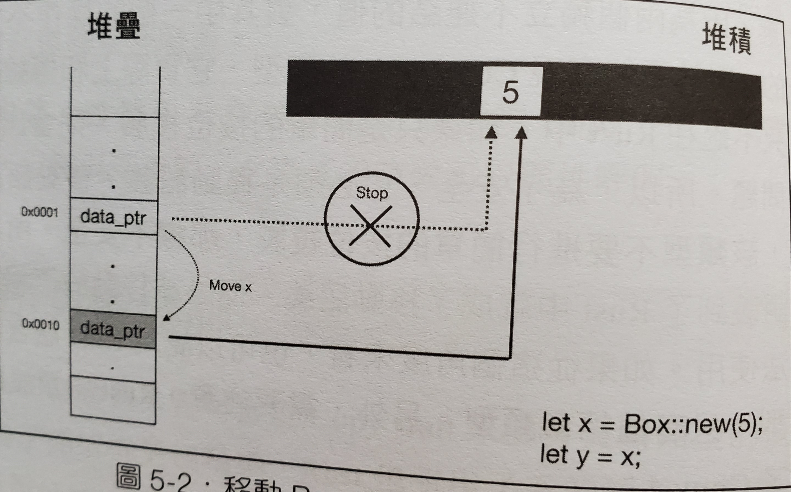
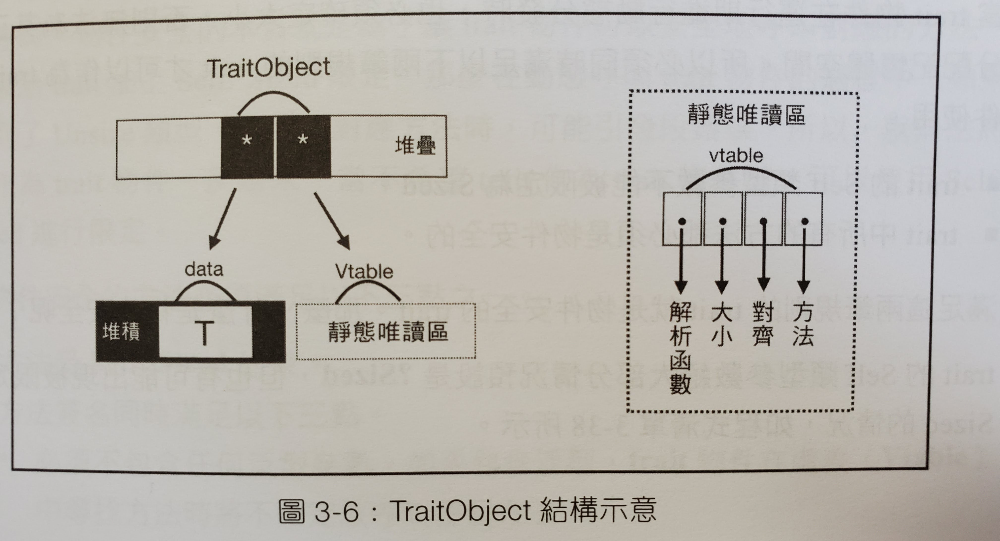

# Rust 基本教學


## Hello World!

### 不使用管理工具編寫程式

1. 建立副檔名為 `.rs` 的檔案 ex: `main.rs`
2. 寫 main function，程式碼編譯過後，會以 main function 作為進入點
```rust
fn main () {
    
}
```
3. 印出 `Hello World!`
```rust
fn main () {
    println!("Hello World");
}
```
4. 編譯程式碼
```shell
rustc main.rs
```
5. 編譯完後會產生 `main`/`main.exe` 檔，執行 `main`/`main.exe` 檔
```shell=
./main
```

### 使用 Cargo 管理專案

1. 建立專案
```shell=
cargo new hello_world
```
2. 編輯 `src/main.rs` 的檔案
```rust
fn main() {
    println!("Hello, world!");
}
```
3. 檢查專案是否可以編譯得過
```shell=
cargo check
```
4. 編譯
```shell=
cargo build
```
5. 執行
```shell=
cargo run
```
6. 優化編譯
```shell=
cargo build --release
```

### Hello World 的程式碼解析
```rust
fn main () {} // fn 是 function 的關鍵字
```

```rust=
println!("Hello World!") // println 是印出資料的語法，! 是 macro 的寫法， println!  是官方的 macro ，會在編譯時期根據目標平台轉換成相應的程式碼
```

## 宣告變數

- 在 rust 中，可以不用宣告型別，也會由編譯器自行推定
```rust
fn main () {
    let x = 5; // 會被自行推定為 i32
    let y: i32 = 10; // 也可以宣告變數型別
}
```
- 預設所有變數都是不可變的
```rust
fn main () {
    let x = 5;
    x = 10; // 不可以改變 x 的值
}
```
- 若要改變變數，必須宣告 `mut`
```rust
fn main () {
    let mut x = 5;
    x = 10; // OK
}
```
- 可以用 tuple 或 struct 的方式宣告多個變數並同時賦值
```rust
fn main () {
    let (a, b) = (1, 2);
    let (mut x, mut y) = (1, 2); // 或宣告可變的變數
}
```
- 可以事先宣告變數，但若變數被宣告後沒有初始化，同時在之後被使用到，會編譯不過
```rust
fn main () {
    let x: i32;
    println!("{}", x); // use of possibly-uninitialized `x`
}
```
```rust
fn main () {
    let x: i32;
    let condition = true;
    if condition {
        x = 1; // 因為在這裡被初始化了
        println!("{}", x); // 所以可以使用
    }
    // 但在這裡沒有被初始化
    println!("{}", x); // 在這裡會出錯
}
```
- 有的時候會在接別人的 API 時，遇到用不到，但必須寫出來的變數，可以用`底線` 帶過，就可以讓編譯器~~閉嘴~~，讓編譯器忽略沒有使用到這個變數，但同時`底線`變數也被視為不能被使用的變數，所以不可以在後面的程式碼中使用到
```rust
fn main () {
    let _ = "hello";
    println!("{}", _); // expected expression
}
```

- 如果在寫程式的途中，想要命名一個跟前面名稱一模一樣的變數是可以的
```rust
fn main () {
    let x = "Hello";
    println!("{}", x);
    
    let x = 5; // 前面的變數會被 shadowing
    println!("{}", x);
}
```

- 可以用 `type` 為一個型別取新的名字
```rust
type Age = u32;
fn grow (age: Age, year: u32) -> Age {
    age + year
}
```
- 宣告靜態變數
```rust=
static GLOBAL: i32 = 0;
```

- 宣告常數
```rust=
const GLOBAL: i32 = 0;
```

## 型別種類
- bool
- char
- 數字
- array
```rust
let a = [1, 2, 3];
let first = a[0];
let second = a[1];
```
- tuple
```rust
let a = ("hello", 1)
```
- struct
```rust
struct Person {
    age: u32,
    weight: u32,
}

fn main () {
    let ballfish = Person { age: 18, weight: 40 };
    println!("{}, {}", age, weight);
}
```
- tuple struct
```rust
struct Color (i32, i32, i32);
```
- enum
```rust
enum Food {
    Noodle,
    Rice
}

enum Message {
    Quit,
    ChangeColor(i32, i32, i32),
    Move { x: i32, y: i32 },
}
```

## if/else、loop、function
- 用大括號括起來的區塊，可以放在等號後面，最後一行不寫分號，會被視為回傳直傳出去
```rust
fn main () {
    let x = { println!("喵喵喵喵"); 5 };
    println!("{}", x);
}
```
- if/else
```rust
fn main () {
    let n = 4;
    if n < 0 {
        println!("Wow");
    } else if n == 0 {
        println!("owo");
    } else {
        println!("Orz");
    }
    // Orz
}
```

- Rust 並沒有三元運算子（ex: n < 0 ? "owo" : "OAO"），但可以把 if/else 寫成下面這樣
```rust
fn main () {
    let n = 4;
    let x = if n < 4 { "owo" } else { "OAO" };
    println!("{}", x);
    // OAO
}
```

- Rust 中，若 else 沒有寫出來，視為回傳 `()`，以剛剛的例子而言，由於 `x` 必須在編譯時期就確定型態，所以 if/else 回傳的值必須一致。也因此，通常 if 會伴隨 else，除非 if 沒有回傳值
```rust
fn main () {
    let n = 4;
    let x = if n < 4 { "owo" } else { 5 }; // expected `&str`, found integer
    println!("{}", x);
}
```

```rust
fn main () {
    let n = 4;
    let x = if n < 4 { "owo" }; // expected `()`, found `&str`
}
```

```rust
fn main () {
    let n = 4;
    let x = if n < 5 { println!("OAO") };
    // OAO
}
```

- loop，是一個不帶條件的無限迴圈
```rust
fn main () {
    loop {
        print!("喵喵喵喵");
    }
}
```

- 跟其他的程式語言一樣，Rust 有 `continue` 與 `break`
```rust
fn main () {
    loop {
        print!("汪汪");
        break;
    }
    
    loop {
        print!("喵喵喵喵");
        continue;
        print!("噗伊");
    }
}
```

- 你可以在 `break` 後面接值，這個值會被作為回傳值
```rust
fn main () {
    let a = loop {
        println!("噗伊");
        break 5;
    };
    println!("{}", a);
    // 噗伊
    // 5
}
```
- while，帶有條件的迴圈
```rust
fn main () {
    let mut n = 0;
    while n < 10 {
        println!("喵喵喵喵");
        n += 1;
    }
}
```

- while 也可以接在等號後面，但因為 `break` 在 `while` 中不能接值，所以永遠會回傳 `()`
```rust
fn main () {
    let mut n = 0;
    let x = while n < 10 {
        n += 1;
        break 5; // can only break with a value inside `loop` or breakable block
    };
}
```

```rust
fn main () {
    let mut n = 0;
    // OK，但 x = ()
    let x = while n < 10 {
        n += 1;
        break;
    };
}
```

- loop 與 while 的差異
    - loop 是不帶條件一定會執行的迴圈
    - while 是帶有條件，不一定會被執行的迴圈
    - 對於編義器來說，while block 裡的程式碼不一定會被執行到，無論 while 後面接的是不是 true
    - 也是因為這個差異，`break` 在 `while` 裏面才會不能接值，因為 while 沒有被執行的情況下，回傳直永遠是 `()`，所以在 while block 裡的回傳值一定要是 `()`
```rust
fn main () {
    let x;
    loop { x = 1; break; }
    println!("{}", x); // x 一定會在 loop 中被初始化，所以編譯會過
}
```

```rust
fn main () {
    let x;
    while true { x = 1; break; }
    // 因為編譯器無法保證 while block 裡的程式碼一定會被執行到，所以無法保證 x 一定會被初始化，因此編譯不會過
    println!("{}", x); // use of possibly-uninitialized `x`
}
```

- for loop，Rust 中沒有其他語言常有的 `for (i = 0;i < 10;i++)`，Rust 中的 for loop形式跟其他語言的 for-each 視同義的
```rust
fn main () {
    let array = [1, 2, 3];
    for i in array.iter() {
        println!("{}", i);
    }
}
```
- for loop 跟 while 的特性一樣，block 中的 `break` 後不可以接值， for loop 可以接在等號後面

- function
```rust
fn add (t: (i32, i32)) -> i32 {
    t.0 + t.1
}
```

- function 的 parameter 還可以直接解構
```rust
fn add ((x, y): (i32, i32)) -> i32 {
    x + y
}
```

- function 可以作為一個普通的變數
```rust
fn add ((x, y): (i32, i32)) -> i32 {
    x + y
}
fn main () {
    let func = add;
    println!("{}", func((1, 2))); // 3
}
```

- 不會正常回傳的 function
```rust
fn amazing () -> ! {
    panic!("crash the application~~");
}
```

- const fn，加上 const 關鍵字的 function 可以在編譯時期被執行，執行完的值也可以作為常數使用
```rust
const fn add ((x, y): (i32, i32)) -> i32 {
    x + y
}

fn main () {
    const CONSTANT: i32 = add((1, 2));
    println!("{}", CONSTANT);
}
```

- Rust 的 function 可以遞迴，但跟其他語言一樣過多層的遞迴會 stack overflow


---

# Rust 所有權系統


## 所有權的機制 (Ownership)

1. 所有的 Value 與 記憶體位置 只會有一個 變數 管理他們，意思是不會有兩個變數同時紀錄同一個記憶體位置
2. 所有的 Value 與 記憶體位置 都必須要有個一個 變數 管理他們，所以當變數因為生命周期結束時，代表Value會被銷毀、記憶體位置會被釋放

## 所有權轉移 (Move)





```rust
#[derive(Debug)]
struct Person {
    age: i32
}
fn main () {
    let x = Person { age: 16 };
    let y = x;
    // borrow of moved value: `x`
    // 所有權被轉移了，所以你不能再使用 x
    println!("{:?}", x);
    println!("{:?}", y);
}
```

## 按位複製 (Copy)


- 記憶體位置是不能被 Copy 的
- struct 在沒有實現 Copy 前，是不會進行 Copy，而會進行 Move
- 但 array、tuple、Option 本身就有實現 Copy，所以在所有的值都可以實現 Copy 的情況，會進行 Copy，如果有一個值不能實現 Copy 則會進行 Move
- 實現 Copy、Clone trait (因為 Copy 繼承 Clone，所以必須同時實現 Copy 與 Clone trait) (關於 trait 會在之後的章節提到)
```rust
#[derive(Debug)]
struct Person {
    age: i32
}
// Clone trait 用來實現 deep clone
// 任何類型都可以實作 Clone
impl Clone for Person {
    fn clone (&self) -> Person {
        Person { age: self.age }
    }
}
// Copy trait 像是一個標籤
// 他裏面沒有任何可以實現的 function
// 但實作 Copy 的 struct 可以進行 Copy
// 不過可以實作 Copy 的 struct，成員必須不包含指標類型
impl Copy for Person {}
fn main () {
    let x = Person { age: 16 };
    let y = x;
    println!("{:p}", &x);
    println!("{:?}", x);
    println!("{:p}", &y);
    println!("{:?}", y);
}
```
- 快速實現 Copy 與 Clone

```rust
#[derive(Debug, Copy, Clone)]
struct Person {
    age: i32
}
fn main () {
    let x = Person { age: 16 };
    let y = x;
    println!("{:p}", &x);
    println!("{:?}", x);
    println!("{:p}", &y);
    println!("{:?}", y);
}
```

## 所有權借用 (Borrow)
### 介紹
- 借用分成==不可變借用==(&)跟==可變借用==(&mut)
- 用 & 來借用
```rust
#[derive(Debug)]
struct Person {
    age: i32
}
fn birthday (y: &mut Person) {
    y.age = y.age + 1;
}
fn main () {
    let mut x = Person { age: 16 };
    birthday(&mut x);
    println!("{:?}", x);
}
```

- 沒有借用的情況，所有權會被轉移
```rust
#[derive(Debug)]
struct Person {
    age: i32
}
fn birthday (mut y: Person) {
    y.age = y.age + 1;
}
fn main () {
    let x = Person { age: 16 };
    birthday(x);
    println!("{:?}", x);
}
```
output
```
   |
9  |     let x = Person { age: 16 };
   |         - move occurs because `x` has type `Person`, which does not implement the `Copy` trait
10 |     birthday(x);
   |              - value moved here
11 |     println!("{:?}", x);
   |                      ^ value borrowed here after move
```

### 借用的規則 (Rust 核心原則之一：共享不可變，可變不共享)
- 在==不可變借用==期間 (共享)，擁有者不能修改 Value，也不能進行==可變借用== (不可變)，但可以再進行==不可變借用==
```rust
#[derive(Debug)]
struct Person {
    age: i32
}
#[allow(dead_code)]
fn birthday (y: &mut Person) {
    y.age = y.age + 1;
}
#[allow(unused_mut)]
fn main () {
    let mut x = Person { age: 16 };
    let y = &x; // 不可變借用，擁有者是 x，借用者是 y
    println!("{:p}", &x); // x 可以再進行不可變借用
    // cannot borrow `x` as mutable because it is also borrowed as immutable
    // 但不可以再進行可變借用
    birthday(&mut x);
    println!("{:?}", y); // 借用者 y 可以使用 x，印出值
}
```

- 在==可變借用==期間 (可變)，擁有者不能存取 Value，也不能進行==不可變借用== (不共享)
```rust
#[derive(Debug)]
struct Person {
    age: i32
}
#[allow(dead_code)]
fn birthday (y: &mut Person) {
    y.age = y.age + 1;
}
#[allow(unused_mut)]
fn main () {
    let mut x = Person { age: 16 };
    let y = &mut x; // 可變借用，擁有者是 x，借用者是 y
    y.age = 1;
    // cannot borrow `x` as immutable because it is also borrowed as mutable
    // x 不可以再進行不可變借用
    println!("{:p}", &x);
    // cannot borrow `x` as mutable more than once at a time
    // 當然也不可以再進行可變借用
    birthday(&mut x);
    // cannot use `x.age` because it was mutably borrowed
    // 同時你也不可以存取 x
    y.age = x.age + 1;
    println!("{:?}", y); // 借用者 y 可以使用 x，印出值
}
```
- 借用者的==生命周期==不能夠長於擁有者
    - 範例在==生命周期==的章節再寫

---

# Rust 生命周期 (Lifetime)


## 介紹(幹話)
- ==變數== 從出生到死亡的時間段

```rust
fn main () {
    let x = Box::new(5); // x 出生
    println!("{:?}", x);
    {
        let y = Box::new(1); // y 出生
        println!("{:?}", y);
    } // y 死亡
    // cannot find value `y` in this scope
    // y 死掉了，所以你存取不到他
    println!("{:?}", y);
} // x 死亡
```

## Borrow checker
- 編譯器的機制
- 會檢查借用者的生命周期會不會活的比擁有者久
- 為了避免 null pointer 發生，就是擁有者已經死了，Value 已經被銷毀了，但借用者還活著，就會存取到不存在的東西

```rust
#[allow(unused_variables, unused_assignments)]
fn main () {
    let x; // x 出生
    {
        let y = Box::new(1); // y 出生
        x = &y; // x 借用 y 的所有權
        println!("{:?}", y);
    } // y 死亡
    // `y` does not live long enough
    // y 死掉了，所以 x 存取不到他 (1編譯器：可憐的 y 他活的不夠久 owo)
    println!("{:?}", x);
} // x 死亡
```

## 生命周期標示
- 在名字前面加個 `'` ，就是生命周期的標示
- 以剛剛的例子來說
```rust
fn main () {
    test();
}

// 生命周期標示，必須像泛型一樣，在 function 簽名中先被宣告
fn test<'a, 'b> () {
    let x: &'a i32 = &5; // 'a 開始
    println!("{:?}", x);
    {
        let y: &'b i32 = &2; // 'b 開始
        println!("{:?}", y);
    } // 'b 結束
} // 'a 結束
```

- 不必要標生命周期的情況
```rust
#[derive(Debug)]
struct Person {
    age: i32
}
// 因為 傳入值 與 回傳值 只有一個
// 不會造成編譯器需要檢查生命周期的問題
// 所以沒有必要標示生命周期
fn life_again_gun (y: &mut Person) -> &mut Person {
    y.age = 0;
    y
}
fn main () {
    let mut x = Person { age: 16 };
    let y = life_again_gun(&mut x);
    println!("{:?}", y);
}
```

- 必須要標生命周期的情況
```rust
#[derive(Debug)]
struct Person {
    age: i32
}
// missing lifetime specifier
// 因為編譯器看不出回傳的 借用者 是不是會超過 擁有者 的 lifetime
// 所以要求你編上 lifetime
fn the_older (x: &Person, y: &Person) -> &Person {
    if x.age > y.age { x } else { y }
}
fn main () {
    
}
```

```rust
#[derive(Debug)]
struct Person {
    age: i32
}
// 我們預期這裡只會有一種生命周期
fn the_older<'a> (x: &'a Person, y: &'a Person) -> &'a Person {
    if x.age > y.age { x } else { y }
}
fn main () {
    let x = Person { age: 16 };
    let y = Person { age: 17 };
    let res = the_older(&x, &y);
    println!("{:?}", res)
}
```

- 指定多個生命周期，並標示哪個生命周期比較長
```rust
#[derive(Debug)]
struct Person {
    age: i32
}
// 我們有兩個生命周期 'a 與 'b，其中 'b 活的比 'a 久
fn the_older<'a, 'b: 'a> (x: &'a Person, y: &'b Person) -> &'a Person {
    if x.age > y.age { x } else { y }
}
fn main () {
    let x = Person { age: 16 };
    let res;
    {
        let y = Person { age: 17 };
        res = the_older(&x, &y);
        println!("{:?}", res);
    }
}
```

## NLL (Non-Lexical-Lifetime)

### Lexical-Lifetime
- 是指說生命周期與變數的作用域是綁定在一起的
- 舉個例子
```rust
#[derive(Debug)]
struct Person {
    age: i32
}
fn birthday (y: &mut Person) {
    y.age = y.age + 1;
}
fn life_again_gun (y: &mut Person) -> &mut Person {
    y.age = 0;
    y
}
fn main () {
    let mut x = Person { age: 16 };
    let y = life_again_gun(&mut x);
    // 在 Lexical-Lifetime 的情況，y 的生命周期沒有結束
    // 所以 y 還在進行可變借用
    // 那理論上 x 就不可以再度可變出借
    // (NLL 好像已經是標準了，所以我無法實現 LL 的編譯錯誤)
    birthday(&mut x);
    println!("{:?}", x);
}
```

### Non-Lexical-Lifetime
- borrow checker 的分析結構方式從 AST 轉向 MIR
    - AST 是抽象語法樹，它會以樹狀的形式表現程式語言的語法結構，因為舊的 borrow checker 用 AST 做分析，所以會造成生命周期與作用域掛鉤
    - MIR 是中間表達式，他在編譯器內部會有像是流程圖的資料結構，用流程控制的方式去分析生命周期
    - 只要變數在後面的程式碼中，沒有機會被使用到，就會提早被結束生命周期
- NLL 將作用域與生命周期拆開來看了
- NLL 縮短了過長的生命周期 (縮減了變數的生命)，讓程式不會充滿一堆 block 去迴避 LL 造成的問題
- 舉例來說
```rust
#[derive(Debug)]
struct Person {
    age: i32
}
fn birthday (y: &mut Person) {
    y.age = y.age + 1;
}
fn life_again_gun (y: &mut Person) -> &mut Person {
    y.age = 0;
    y
}
fn main () {
    let mut x = Person { age: 16 };
    let y = life_again_gun(&mut x);
    // 在 Non-Lexical-Lifetime 的情況
    // y 在這段程式碼的後面都沒有被使用到
    // y 的生命周期就結束了
    // 那這裡就不會有問題
    birthday(&mut x);
    println!("{:?}", x);
}
```

```rust
#[derive(Debug)]
struct Person {
    age: i32
}
fn birthday (y: &mut Person) {
    y.age = y.age + 1;
}
fn life_again_gun (y: &mut Person) -> &mut Person {
    y.age = 0;
    y
}
fn main () {
    let mut x = Person { age: 16 };
    let y = life_again_gun(&mut x);
    // cannot borrow `x` as mutable more than once at a time
    // 但如果 y 在後面有機會被使用到
    // 就代表 y 的生命周期還沒有結束
    // 所以 x 不可以再度進行可變出借
    birthday(&mut x);
    y.age = 16;
    println!("{:?}", x);
}
```

---


# Rust 型別系統

[TOC]

## 型別大小
- Sized Tyep
    - 大部分的類型都是 Sized Type，就是可以在編譯時期就知道大小的
    - 例如：u32, i64
- Dynamic Sized Type
    - 無法在編譯時期知道大小的型別則叫作「DST (Dynamic Sized Type)」
    - 例如：[T], Box
    - 
- Zero Sized Type
    - 另外還有一種類型叫「ZST (Zero Sized Type)」，在執行時期，不佔用空間大小的型別
    - 你可以用 ZST 來做一些反覆運算，Rust 編譯器有對 ZST 做最佳化
```rust
fn main() {
    let v: Vec<()> = vec![(); 10];
    // 像是你可以這樣寫
    for _i in v {
        println!("{:?}", 1);
    }
    
    // 雖然你有更簡單的寫法
    for _i in 1..10 {
        println!("{:?}", 1);
    }
}
```

- Bottom Type
    - 只的是 never 類型
    - 程式碼中用 `!` 表示
    - 特點
        - 沒有值
        - 是任意類型的子類型
    - Bottom Type 的用處
        - Diverging Function (發散函數)
        - loop 迴圈
        - 空列舉 `enum Void{}`
    - ex:
```rust
fn print_meow_forever () -> ! {
    loop { println!("meow"); }
}

fn main () {
    let i = if false {
        print_meow_forever();
    } else {
        100
    };
    println!("{}", i);
}
```

- `turbofish` 運算子
    - 用來做顯示的型別宣告
    ex:
```rust
fn main () {
    let x = "1";
    println!("{}", x.parse::<i32>().unwrap());
}
```

## 泛型
- 用這樣的語法`<T>`宣告泛型
ex:
```rust
struct Point<T> { x: T, y: T } 
```

## trait 用法
### 宣告 interface
- interface 裡可以定義 function 或 type
- interface 裡不能實作另一個 interface，但 interface 之間可以繼承
- 使用 `impl` 實作 interface
- 使用 `trait` 宣告 interface
- 孤兒原則 (Orphan Rule)
    - 要實現某個 trait，這個 trait 必須要在當前的 crate 中被定義
    - 用來避免標準函式庫，或在其他地方被定義好的 trait 被修改到，而難以追查


實作自己的 Add:

```rust
trait Add<RHS, Output> {
    fn my_add (self, rhs: RHS) -> Output;
}

impl Add<i32, i32> for i32 {
    fn my_add (self, rhs: i32) -> i32 {
        self + rhs
    }
}

impl Add<u32, i32> for u32 {
    fn my_add (self, rhs: u32) -> i32 {
        (self + rhs) as i32
    }
}

fn main () {
    let (a, b, c, d) = (1i32, 2i32, 3u32, 4u32);
    let x: i32 = a.my_add(b);
    let y: i32 = c.my_add(d);
    println!("{}", x);
    println!("{}", y);
}
```

標準函式庫裡的 Add trait

```rust
pub trait Add<RHS = Self> {
    type Output;
    fn add (self, rhs: RHS) -> Self::Output;
}
```

標準函式庫 u32 的加法實作

```rust
impl Add for u32 {
    type Output = u32;
    fn add (self, rhs: u32) -> u32 { self + rhs }
}
```

標準函式庫 String 的加法實作

```rust
impl Add for String {
    type Output = String;
    fn add (mut self, rhs: &str) -> String {
        self.push_str(rhs);
        self
    }
}
```

trait 裡的 function 可以有一個 default 的實作

```rust
trait Top {
    fn wear_top (&mut self, _clothes: String) {
        println!("Default: coat");
    }
}

trait Bottom {
    fn wear_bottom (&mut self, _clothes: String) {
        println!("Default: pants");
    } 
}

struct PersonLikeCoat {
    top: String,
    bottom: String,
}

impl Top for PersonLikeCoat {}

impl Bottom for PersonLikeCoat {
    fn wear_bottom (&mut self, clothes: String) {
        self.bottom = clothes;
        println!("Changed: {}", self.bottom);
    }
}

fn main () {
    let mut ballfish = PersonLikeCoat { top: String::from("coat"), bottom: String::from("pants") };
    ballfish.wear_top(String::from("sweater"));
    ballfish.wear_bottom(String::from("skirt"));
}
```

trait 的繼承

```rust
trait Top {
    fn wear_top (&mut self, _clothes: String) {
        println!("Default: coat");
    }
}

trait Bottom {
    fn wear_bottom (&mut self, _clothes: String) {
        println!("Default: pants");
    } 
}

struct Person {
    top: String,
    bottom: String,
}

impl Top for Person {}

impl Bottom for Person {
    fn wear_bottom (&mut self, clothes: String) {
        self.bottom = clothes;
        println!("Changed: {}", self.bottom);
    }
}

trait WholeBody: Top + Bottom {
    fn wear_whole_body (&mut self, top: String, bottom: String) {
        self.wear_top(top);
        self.wear_bottom(bottom);
    }
}

impl WholeBody for Person {}

fn main () {
    let mut ballfish = Person { top: String::from("coat"), bottom: String::from("pants") };
    ballfish.wear_whole_body(String::from("sweater"), String::from("skirt"));
}
```

### 用 trait 對泛型做限定 (trait Bound)

- 

語法 `fn generic<T: FirstTrait + SecondTrait>(t: T) {}`
或 `fn generice<T> (t: T) where T: FirstTrait + SecondTrait {}`

ex:

```rust
trait Top {
    fn wear_top (&mut self, _clothes: String) {
        println!("Default: coat");
    }
}

trait Bottom {
    fn wear_bottom (&mut self, _clothes: String) {
        println!("Default: pants");
    } 
}

struct Person {
    top: String,
    bottom: String,
}

impl Top for Person {}

impl Bottom for Person {
    fn wear_bottom (&mut self, clothes: String) {
        self.bottom = clothes;
        println!("Changed: {}", self.bottom);
    }
}

fn go_routin1<P: Top + Bottom> (p: &mut P) {
    p.wear_top(String::from("sweater"));
    p.wear_bottom(String::from("skirt"));
}

fn go_routin2<P> (p: &mut P) where P: Top + Bottom {
    p.wear_top(String::from("sweater"));
    p.wear_bottom(String::from("skirt"));
}

fn main () {
    let mut ballfish = Person { top: String::from("coat"), bottom: String::from("pants") };
    go_routin1::<Person>(&mut ballfish); // ::<Person> 可省
    go_routin2::<Person>(&mut ballfish); // ::<Person> 可省
}
```

### 宣告抽象型別 (Abstract Type)
- Abstract Type 是無法產生實體的型別
- rust 有兩種方式處理抽象型別：trait Object、impl Trait
- trait Object
    - 將 trait 當作一種型別使用
    - 與 trait bound 有點像，但 trait bound 是靜態分配，而 trait Object 是動態分配
    - trait Object 在編譯時期無法知道其記憶體大小，所以他本身是一種指標



```rust
pub struct TraitObject {
    pub data: *mut (),
    pub vtable: *mut (),
}
```

- 上面的 struct 來自標準函式庫，但不是真的 trait 物件
- data指標指向trait物件儲存的類型資料T
- vtable指標指向包含為T實作的virtual table (虛表）
- 虛表本身是一種struct，包含解構函數、大小、方法等
- 編譯器只知道trait object的指標，但不知道要呼叫哪個方法
- 運行期， 會從虛表中查出正確的指標• 再進行動態呼叫
- Trait物件的限制
    - Trait的Self有一個隱式的trait bound `?Sized`如`<Self: ?Sized>`，包含所有可確定大小的類型，也就是`<T: Sized>`
    - 但trait物件的Self不能被限定是Sized，因為trait物件一定是動態分配，所以不可能滿足Sized的條件
    - 但Trait物件在運行期進行動態分發時必須確定大小，否則無法為其正確分配記憶體空間
    - 因此trait中的方法必定是物件安全，物件安全即為必受到`Self: Sized`的約束，且為沒有額外Self類型參數的非泛型方法

    ```rust
    // 物件不安全的 trait
    trait Foo {
        fn bad<T> (&self, x: T);
        fn new() -> Self;
    }
    
    // 方法一：將不安全的部份拆出去
    trait Bar {
        fn bad<T> (&self, x: T);
    }
    trait Foo: Bar {
        fn new() -> Self;
    }
    
    // 方法二：使用 where
    trait Foo {
        fn bad<T>(&self, x: T);
        fn new() -> Self where self: Sized; // 但這個 trait 作為物件時， new 會無法被呼叫
    }
    ```


### 動態分配與靜態分配的比較
```rust
trait Top {
    fn wear_top (&mut self, _clothes: String) {
        println!("Default: coat");
    }
}

trait Bottom {
    fn wear_bottom (&mut self, _clothes: String) {
        println!("Default: pants");
    } 
}

struct Person {
    top: String,
    bottom: String,
}

impl Top for Person {}

impl Bottom for Person {
    fn wear_bottom (&mut self, clothes: String) {
        self.bottom = clothes;
        println!("Changed: {}", self.bottom);
    }
}

trait WholeBody: Top + Bottom {
    fn wear_whole_body (&mut self, top: String, bottom: String) {
        self.wear_top(top);
        self.wear_bottom(bottom);
    }
}

impl WholeBody for Person {}

fn static_dispatch<P: WholeBody> (p: &mut P) {
    p.wear_top(String::from("sweater"));
    p.wear_bottom(String::from("skirt"));
}

fn dynamic_dispatch (p: &mut WholeBody) {
    p.wear_top(String::from("sweater"));
    p.wear_bottom(String::from("skirt"));
}

fn main () {
    let mut ballfish = Person { top: String::from("coat"), bottom: String::from("pants") };
    static_dispatch::<Person>(&mut ballfish); // ::<Person> 可省
    dynamic_dispatch(&mut ballfish);
}
```

### impl Trait

- 是靜態分配的抽象類型

```rust
trait Fly {
    fn fly(&self) -> bool;
}

struct Duck;

impl Fly for Duck {
    fn fly(&self) -> bool {
        return true;
    }
}

fn fly_static (s: impl Fly) -> bool {
    s.fly()
}

fn can_fly (s: impl Fly) -> impl Fly {
    if s.fly() {
        println!("fly!");
    } else {
        println!("fell!")
    }
    s // return s
}

fn main () {
    let duck = can_fly(Duck);
}
```

- 雖然這個語法很有趣，但有些情況編譯器會誤判，例如下面的例子，`a` 跟 `b`，被編譯器認定為不同的 type，所以 `sum` 會報錯

```rust
use std::ops::Add;
fn sum<T>(a: impl Add<Output=T>, b: impl Add<Output=T>) -> T {
    a + b
}
```

- 與靜態分配型態相對的是 `dyn Trait` 動態分配的型態

```rust
fn dyn_can_fly (s: impl Fly+'static) -> Box<dyn Fly> {
    if s.fly() {
        println!("fly!");
    } else {
        println!("fell!");
    }
    Box::new(s)
}
```

### 標籖

- Rust一共提供5個常用的標籖• 被定義在 `std::marker` 裡e
    - `Sized` 用來標識編譯期可確定大小的類型，大部份類型都預設定義實作 Sized
    - `Unsize` 用來標識動態大小類型
    - `Copy` 用來標識可安全按位複製類型
    - `Send` 用來標識可跨執行緒安全傳遞值的類型，也就是可以跨執行緒傳遞所有權
    - `Sync` 用來標識可在執行緒間安全共用參考的類型
- 標籤類 trait，都是用下面這種寫法標示他的標籤性質

```rust
#[lang = "sized"] // lang 表示 Sized trait 供 Rust 語言本身使用
pub trait Sized {} // 此程式為空，無實作方法
```

# 類型轉換

## Deref

- 參考使用`&`
- 設定值使用`*`
- 可以實作Deref的trait來自訂設定值的操作
- Deref是強制轉型的，如果某個類型`T`實作`Deref<Target=U>`，則使用`T`的參考時，參考會被轉型成`U`

```rust
fn foo (s: &[i32]) {
    println!("{:?}", s[0]);
}

fn main () {
    let a = "hello".to_string();
    let b = " world".to_string();
    // b 被自動 deref
    let c = a + &b;
    println!("{:?}", c);

    /// &Vec<T> -> &[T]
    let v = vec![1, 2, 3];
    foo(&v);

    let x = Rc::new("hello");
    let y = x.clone(); // Rc<&str>
    // 如果想要呼叫 &str 的 clone，必須要自己 deref
    let z = (*x).clone(); // &str
}
```

## as 運算符號

### 類型轉換（含生命週期）

```rust
fn main () {
    let a = 1u32;
    let b = a as u64;
    println!("{:?}", a);
    println!("{:?}", b);
    let c = std::u32::MAX;
    let d = c as u16;
    println!("{:?}", c);
    println!("{:?}", d);
    let e = -1i32;
    let f = e as u32;
    println!("{:?}", e);
    println!("{:?}", f);
    let a: &'static str = "hello"; // &'static str
    let b: &str = a as &str;
    let c: &'static str = b as &'static str;
}
```

### 限定用法

```rust
struct S(i32);
trait A {
    fn test(&self, i: i32);
}

trait B {
    fn test(&self, i: i32);
}

impl A for S {
    fn test(&self, i: i32) {
        println!("From A: {:?}", i);
    }
}

impl B for S {
    fn test(&self, i: i32) {
        println!("From B: {:?}", i)
    }
}

fn main () {
    let s = S(1);
    A::test(&s, 2);
    B::test(&s, 3);
    <S as A>::test(&s, 4);
    <S as B>::test(&s, 5);
}
```

### From與Into

- 定義於`std::convert`
- 互為反向操作

```rust
#[derive(Debug)]
struct Person { name: String }
impl Person {
    fn new<T: Into<String>>(name: T) -> Person {
        Person { name: name.into() }
    }
}

fn main () {
    let person = Person::new("Alex");
    let person = Person::new("Alex".to_string());
    println!("{:?}", person);

    // String from 的方法
    let to_string = "hello".to_string();
    let from_string = String::from("hello");
    assert_eq!(to_string, from_string);

    // 如果 U 實現了 From<T>，則 T 類型的實例，都可以呼叫 into 方法轉換為 U
    let a = "hello";
    let b: String = a.into();
    // 所以一般情況只要實作 From 即可，除非 From 很難實作，才需要實作 Into
}
```

# Trait系統的不足

## 孤兒原則

- [孤兒原則解說](https://www.notion.so/Rust-e160ff83074d4a6585e4281297687a34)
- 若下游程式想要使用擴充某些 crate，就必須包裝成新的 type，以迴避孤兒原則
- 而對一些本地端的類型，在被 Option，或是 Rc 等 interface 包裝後，就會被認定為非本地端類型，擴充時就會發生問題

```rust
use std::ops::Add;
#[derive(PartialEq)]
struct Int(i32);
impl Add<i32> for Int {
    type Output = i32;
    fn add (self, other: i32) -> Self::Output {
        (self.0) + other
    }
}

impl Add<i32> for Option<Int> {} // (X)

// 因為 Rust 裡 Box 有 #[fundamental] 標籤
impl Add<i32> for Box<Int> {
    type Output = i32;
    fn add (self, other: i32) -> Self::Output {
        (self.0) + other
    }
}

fn main () {
    assert_eq!(Int(3) + 3, 6);
    assert_eq!(Box::new(Int(3)) + 3, 6);
}
```

## 程式複用率不高

- 重複原則
    - 規定不可以為重疊的類型實作同一個 trait

    ```rust
    impl<T> AnyTrait for T {}
    impl<T> AnyTrait for T where T: Copy {}
    impl<T> AnyTrait for i32 {}
    ```

```rust
//  效能問題
// 這裡實作了 += 的對應方法
impl<R, T: Add<R> + Clone> AddAssign<R> for T {
    fn add_assign(&mut self, rhs: R) {
        // clone 會造成效能的負擔，有些類型不需要用 clone 這個方法
        // 但因為重複原則，無法限縮實作對象，所以為了效能，很多作法是位每個類型實作 trait
        // 造成程式複用度不高
        let tmp = self.clone() + rhs;
        *self = tmp;
    }
}
```