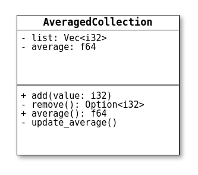
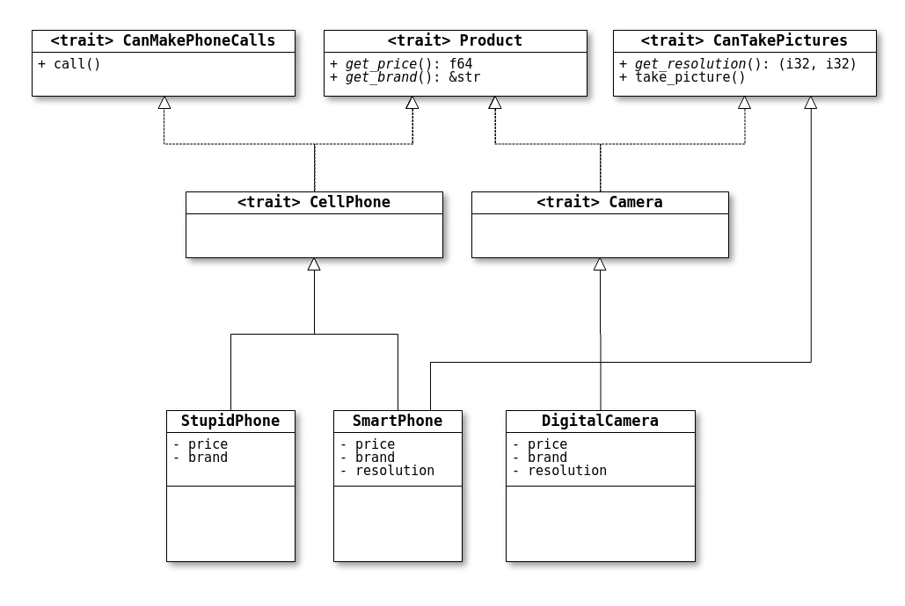

# [物件導向程式設計](https://magiclen.org/rust-object-oriented)


許多人會想問：Rust是物件導向的程式語言嗎？答案可以為是，也可以為不是，端看問這個問題的人對於「物件導向程式語言」定義的嚴格程度。Rust程式語言有結構體，而且可以使用`impl`關鍵字來替結構體實作特性和方法，甚至可以使用`pub`關鍵字來設定成員的存取權限，這難道不就是物件導向程式語言嗎？也許吧！但別忘了，Rust程式語言本身也提供了基本資料型態，我們先不論程式的難易度，其實可以只使用基本資料型態來完成一個可以執行的程式，讓這個程式完全沒有任何「物件」的概念，可是這樣的話，Rust還是屬於物件導向程式語言嗎？

精確一點來說的話，Rust是以指令式程式設計(imperative programming)為主，支援函數式程式設計(functional programming)和物件導向程式設計(object-oriented programming)的語言。

物件導向程式有封裝(encapsulation)、繼承(inheritance)以及多型(polymorphism)的概念，這些當然也存在於Rust程式語言中，而我們在之前的章節也早就已經學過這些了，來整理並複習一下吧！

### 封裝

物件導向的封裝可以將每個物件的屬性、函數、方法、型別等等項目區分存取權限。Rust程式語言的存取權限只有分為公開的(public)和私有的(private)。有加`pub`關鍵字的項目就是公開的項目；沒有加`pub`關鍵字的項目就是私有的項目。

舉例來說：

```rust
pub struct AveragedCollection {
    list: Vec<i32>,
    average: f64,
}

impl AveragedCollection {
    pub fn add(&mut self, value: i32) {
        self.list.push(value);
        self.update_average();
    }

    pub fn remove(&mut self) -> Option<i32> {
        let result = self.list.pop();
        match result {
            Some(value) => {
                self.update_average();
                Some(value)
            }
            None => None,
        }
    }

    pub fn average(&self) -> f64 {
        self.average
    }

    fn update_average(&mut self) {
        let total: i32 = self.list.iter().sum();
        self.average = total as f64 / self.list.len() as f64;
    }
}
```

`AveragedCollection`結構體可以作為一個物件的「類別」(class)來看，其UML類別圖表如下：



單純只加上`pub`關鍵字的項目可以一直被向上公開，如果只是要將項目公開到模組外，但還是限制在同一個crate內使用的話，需使用`pub(crate)`關鍵字。其它還有限制在父模組下公開，要使用`pub(super)`；限制在指定路徑下公開，要使用`pub(in 路徑)`。

### 繼承

物件導向的繼承，可以讓一個物件類別`A`去繼承某個物件類別`B`的定義，如此一來物件類別`A`可以在不重新實作程式的情況下直接使用物件類別`B`的定義好的功能，甚至也可以使用不同的程式來實作物件類別`B`的定義，也能讓物件類別`A`定義出新的物件類別`B`所沒有的項目。

Rust的結構體不能直接繼承另一個結構體，只能使用特性(trait)，來完成類似繼承的動作。

舉例來說：

```rust
// TODO -----Traits-----

trait CanTakePictures {
    fn get_resolution(&self) -> (i32, i32);

    fn take_picture(&self) {
        let resolution = self.get_resolution();
        // do something
    }
}

trait CanMakePhoneCalls {
    fn call(&self) {
        // do something
    }
}

trait Product {
    fn get_price(&self) -> f64;
    fn get_brand(&self) -> &str;
}

// TODO -----Combined Traits-----

trait CellPhone: Product + CanMakePhoneCalls {}

trait Camera: Product + CanTakePictures {}

// TODO -----Structs-----

struct StupidPhone {
    price: f64,
    brand: String,
}

struct SmartPhone {
    price: f64,
    brand: String,
    resolution: (i32, i32),
}

struct DigitalCamera {
    price: f64,
    brand: String,
    resolution: (i32, i32),
}

// TODO -----StupidPhone-----

impl CellPhone for StupidPhone {}

impl Product for StupidPhone {
    fn get_price(&self) -> f64 {
        self.price
    }
    fn get_brand(&self) -> &str {
        &self.brand
    }
}

impl CanMakePhoneCalls for StupidPhone {}

// TODO -----SmartPhone-----

impl CellPhone for SmartPhone {}

impl Product for SmartPhone {
    fn get_price(&self) -> f64 {
        self.price
    }
    fn get_brand(&self) -> &str {
        &self.brand
    }
}

impl CanMakePhoneCalls for SmartPhone {}

impl CanTakePictures for SmartPhone {
    fn get_resolution(&self) -> (i32, i32) {
        self.resolution
    }
}

// TODO -----DigitalCamera-----

impl Camera for DigitalCamera {}

impl Product for DigitalCamera {
    fn get_price(&self) -> f64 {
        self.price
    }
    fn get_brand(&self) -> &str {
        &self.brand
    }
}

impl CanTakePictures for DigitalCamera {
    fn get_resolution(&self) -> (i32, i32) {
        self.resolution
    }
}
```

UML類別圖表如下：

[](https://img.magiclen.org/albums/rust-object-oriented/shot-06.png)

在使用`trait`關鍵字定義特性時，我們可以在定義好的特性名稱後面加上冒號`:`和其它多個特性名稱(以加號`+`分隔)，即可決定該特性要繼承哪些特性。

### 多型

物件導向的多型，可以將某類別的父類別作為該類別物件的型別。繼續使用以上繼承的例子，`SmartPhone`結構實體的型別可以是`SmartPhone`，也可以是`CellPhone`、`Product`、`CanMakePhoneCalls`或是`CanTakePictures`。

舉例來說，如果我們替繼承的例子加上`main`函數：

```rust
fn main() {
    let asus_zf5z = SmartPhone {
        price: 16990f64,
        brand: String::from("ASUS"),
        resolution: (4000, 3000),
    };
    print_price(&asus_zf5z);
}

fn print_price(product: &SmartPhone) {
    println!("{}", product.get_price());
}
```

`print_price`函數使用了`Product`特性所定義的`get_price`方法。我們也可以將`print_price`函數的`product`參數的型別`&SmartPhone`改為`&CellPhone`或是`&Product`，程式也還是能夠成功編譯並執行，這就是多型的概念。

#### 動態調度(Dynamic dispatch)

特性型別無法直接以一般非參考型別來進行傳遞，這是因為編譯器並不能知道該特性的實體實際在記憶體中會佔用多少大小。舉例來說：

```rust
fn main() {
    let asus_zf5z = SmartPhone {
        price: 16990f64,
        brand: String::from("ASUS"),
        resolution: (4000, 3000),
    };
    print_price(asus_zf5z);
}

fn print_price_smartphone(product: SmartPhone) {
    println!("{}", product.get_price());
}

fn print_price_product(product: Product) {
    println!("{}", product.get_price());
}
```

`print_price_smartphone`函數可以編譯成功，因為`product`參數為`SmartPhone`結構體型別，在編譯階段即可知道`SmartPhone`結構實體的大小有多少。而`print_price_product`函數會編譯失敗，因為`Product`特性只是一個抽象的型別，在目前這個程式中，`SmartPhone`、`StupidPhone`、`DigitalCamera`都有實作`Product`特性，編譯器無法確定究竟要分配多大的記憶體空間給`product`參數，也不知道該值究竟是哪個結構體的實體，無法決定在呼叫方法時要跳去執行哪邊的程式。

為了要解決這個問題，我們將特性實體的參考，以及指著該特性實體的智慧型指標實體，稱為「特性物件」(Trait Object)。舉例來說：

```rust
fn main() {
    let asus_zf5z = &(SmartPhone {
        price: 16990f64,
        brand: String::from("ASUS"),
        resolution: (4000, 3000),
    });
    let lg_kx300 = Box::new(StupidPhone {
        price: 3000f64,
        brand: String::from("LG"),
    });
}
```

以上程式，`asus_zf5z`變數和`lg_kx300`變數都是特性物件。

特性物件非常方便，不會讓編譯器不知道要分配多少空間給變數使用，而且也支援多型。舉例來說：

```rust
fn main() {
    let asus_zf5z = &(SmartPhone {
        price: 16990f64,
        brand: String::from("ASUS"),
        resolution: (4000, 3000),
    });
    let lg_kx300 = Box::new(StupidPhone {
        price: 3000f64,
        brand: String::from("LG"),
    });

    print_price_reference(asus_zf5z);
    print_price_box(lg_kx300);
}

fn print_price_reference(product: &dyn Product) {
    println!("{}", product.get_price());
}

fn print_price_box(product: Box<dyn Product>) {
    println!("{}", product.get_price());
}
```

以上程式`print_price_reference`函數直接使用`&dyn Product`來接受`asus_zf5z`這個特性物件，`print_price_box`函數直接使用`Box<dyn Product>`來接受`asus_zf5z`這個特性物件來接受`lg_kx300`這個特性物件，程式在編譯階段只會去檢查傳入這兩個函數的特性物件是否有實作`Product`特性，在程式執行階段才去查詢特性物件參考所指到的值究竟是哪個結構體的實體，這就是「動態調度」。

#### 靜態調度(Static dispatch)

除了使用特性的參考型別來傳遞結構實體之外，我們也可以使用泛型來做「靜態調度」。「靜態調度」相對於「動態調度」，在先前的章節有提到過，編譯器在編譯程式時會自動把有泛型定義的項目解開。舉例來說：

```rust
fn main() {
    let asus_zf5z = SmartPhone {
        price: 16990f64,
        brand: String::from("ASUS"),
        resolution: (4000, 3000),
    };
    let lg_kx300 = StupidPhone {
        price: 3000f64,
        brand: String::from("LG"),
    };
    print_price(asus_zf5z);
    print_price(lg_kx300);
}

fn print_price<T: Product>(product: T) {
    println!("{}", product.get_price());
}
```

編譯器會將`print_price`函數的泛型定義解開為：

```rust
fn main() {
    let asus_zf5z = SmartPhone {
        price: 16990f64,
        brand: String::from("ASUS"),
        resolution: (4000, 3000),
    };
    let lg_kx300 = StupidPhone {
        price: 3000f64,
        brand: String::from("LG"),
    };
    print_price_smartphone(asus_zf5z);
    print_price_stupidphone(lg_kx300);
}
 
fn print_price_smartphone(product: SmartPhone) {
    println!("{}", product.get_price());
}
 
fn print_price_stupidphone(product: StupidPhone) {
    println!("{}", product.get_price());
}
```

如此一來，我們依然是使用結構體型別來傳遞結構體實體，因此程式在編譯階段就可以確定`product`參數要被分配的記憶體大小。

另外，相對於用於動態調度的`dyn`關鍵字，我們也可以使用`impl`關鍵字搭配特性型別來表示靜態調度，代替泛型的語法。舉例來說：

```rust
fn main() {
    let asus_zf5z = SmartPhone {
        price: 16990f64,
        brand: String::from("ASUS"),
        resolution: (4000, 3000),
    };
    let lg_kx300 = StupidPhone {
        price: 3000f64,
        brand: String::from("LG"),
    };
    print_price(asus_zf5z);
    print_price(lg_kx300);
}
 
fn print_price(product: impl Product) {
    println!("{}", product.get_price());
}
```

### 不能作為特性物件使用的特性

只要特性或特性的父特性有符合下列情事之一的話，該特性就無法作為特性物件使用：

> \1. 方法的回傳值型別為自身型別(`Self`)。
> \2. 方法有泛型型別的參數。

Rust程式語言的標準函式庫內建的`Clone`特性，正是一個擁有回傳值的型別為自身型別(`Self`)的函數的特性。因此，如果將程式修改如下：

```rust
trait MyTrait: Clone {}
 
struct MyStructA {}
 
struct MyStructB {}
 
impl MyTrait for MyStructA {}
 
impl Clone for MyStructA {
    fn clone(&self) -> MyStructA {
        MyStructA {}
    }
}
 
impl MyTrait for MyStructB {}
 
impl Clone for MyStructB {
    fn clone(&self) -> MyStructB {
        MyStructB {}
    }
}
 
struct MyTraitVec {
    vec: Vec<Box<dyn MyTrait>>
}
```

程式就會編譯失敗。

以下程式也會編譯失敗：

```rust
trait MyTrait {
    fn generic_method<T>(&self, a: T) {
        println!("{:?}", a);
    }
}
 
struct MyStructA {}
 
struct MyStructB {}
 
impl MyTrait for MyStructA {}
 
impl MyTrait for MyStructB {}
 
struct MyTraitVec {
    vec: Vec<Box<dyn MyTrait>>
}
```

### 究竟該不該物件導向？

Rust雖然支援物件導向程式設計，但我們真的要堅持使用物件導向嗎？我們用一個實際的應用來舉例好了。現在我們要利用Rust程式語言實作一個部落格發文系統，每篇文章在一開始建立的時候都是草稿，當草稿完成之後，在同意發佈之前，必須要先進行檢查的動作，且只有已發佈的文章，才可以取得其文章內容。

我們可以用Cargo建立出一個新的`blog`程式專案，撰寫出以下程式：

```rust
pub struct Post {
    state: Option<Box<dyn State>>,
    content: String,
}
 
impl Post {
    pub fn new() -> Post {
        Post {
            state: Some(Box::new(Draft {})),
            content: String::new(),
        }
    }
 
    pub fn add_text(&mut self, text: &str) {
        self.content.push_str(text);
    }
 
    pub fn content(&self) -> &str {
        self.state.as_ref().unwrap().content(&self)
    }
 
    pub fn request_review(&mut self) {
        if let Some(s) = self.state.take() {
            self.state = Some(s.request_review())
        }
    }
 
    pub fn approve(&mut self) {
        if let Some(s) = self.state.take() {
            self.state = Some(s.approve())
        }
    }
}
 
trait State {
    fn request_review(self: Box<Self>) -> Box<dyn State>;
    fn approve(self: Box<Self>) -> Box<dyn State>;
    fn content<'a>(&self, _post: &'a Post) -> &'a str {
        ""
    }
}
 
struct Draft {}
 
impl State for Draft {
    fn request_review(self: Box<Self>) -> Box<dyn State> {
        Box::new(PendingReview {})
    }
 
    fn approve(self: Box<Self>) -> Box<dyn State> {
        self
    }
}
 
struct PendingReview {}
 
impl State for PendingReview {
    fn request_review(self: Box<Self>) -> Box<dyn State> {
        self
    }
 
    fn approve(self: Box<Self>) -> Box<dyn State> {
        Box::new(Published {})
    }
}
 
 
struct Published {}
 
impl State for Published {
    fn request_review(self: Box<Self>) -> Box<dyn State> {
        self
    }
 
    fn approve(self: Box<Self>) -> Box<dyn State> {
        self
    }
 
    fn content<'a>(&self, post: &'a Post) -> &'a str {
        &(post.content)
    }
}
```

我們使用`Post`結構體來表示文章，`content`欄位為其文章內容，`state`欄位為其目前的狀態。每個狀態都是實作`State`特性的結構體，共有`Draft`(草稿)、`PendingReview`(檢查時期)、`Published`(已發佈)這三種結構體。

這裡比較需要注意到的地方是，程式第19行，使用`Option`列舉實體的`as_ref`方法，來將`Option<T>`轉為`Option<&T>`，如此一來就不會嘗試奪取`Post`結構實體的`state`欄位對於其值的擁有權，而造成編譯失敗。程式第23行和第29行，使用了`Option`列舉實體的`take`方法，就會轉移這個`Option`列舉實體的擁有者，並將該`Option`列舉實體回傳，原先`Option`列舉實體擁有者擁有的值會被改為`None`。程式第36行和第37行，`State`特性所定義的抽象`request_review`和`approve`方法，其第一個參數不是使用`&self`，而是`self: Box<Self>`，表示這個方法只能被用在當實體被`Box`智慧型指標參考時，且在使用這個方法後，該實體的擁有者就會因擁有權被奪走而無法再被使用了。至於為什麼要使用`Box`結構體？那是因為我們如果讓特性定義的方法直接回傳其自身的型別，會導致這個特性無法作為特性物件使用。

主程式的程式碼如下：

```rust
extern crate blog;
 
use blog::Post;
 
fn main() {
    let mut post = Post::new();
 
    post.add_text("I ate a salad for lunch today");
    assert_eq!("", post.content());
 
    post.request_review();
    assert_eq!("", post.content());
 
    post.approve();
    assert_eq!("I ate a salad for lunch today", post.content());
}
```

主程式一開始，使用`Post`結構體的`new`關聯函數，建立出新的`Post`結構實體。此時這個`Post`結構實體的狀態為`Draft`，且文章內容為空字串。當文章狀態為`Draft`時，使用`Post`結構實體的`content`方法會永遠回傳空字串，因為在替`Draft`結構體實作`State`特性時並未去覆寫原先只會回傳空字串的`content`方法。接著，在文章狀態為`Draft`時，呼叫`Post`結構實體的`request_review`方法，會讓文章的狀態改為`PendingReview`，此時`Post`結構實體的`content`方法依然只會回傳空字串。再來，在文章狀態為`PendingReview`時，呼叫`Post`結構實體的`approve`方法，會讓文章的狀態改為`Published`，此時`Post`結構實體的`content`方法就會回傳`content`欄位的字串參考了！

以上這樣的程式實作方式，即為物件導向的「狀態模式」(State Pattern)。程式雖然有很好的擴充性，但也因此多了好幾個重複且不應該被使用到的程式碼，例如當文章狀態為`Draft`時，`approve`方法雖然沒有什麼用處，但它應該根本就不能存在才對，同理，`content`方法也是一樣。但如果我們跳脫出物件導向思考的模式，將程式改寫成：

```rust
pub struct Post {
    content: String,
}
 
pub struct DraftPost {
    content: String,
}
 
impl Post {
    pub fn new() -> DraftPost {
        DraftPost {
            content: String::new(),
        }
    }
    pub fn content(&self) -> &str {
        &(self.content)
    }
}
 
impl DraftPost {
    pub fn add_text(&mut self, text: &str) {
        self.content.push_str(text);
    }
 
    pub fn request_review(self) -> PendingReviewPost {
        PendingReviewPost {
            content: self.content,
        }
    }
}
 
pub struct PendingReviewPost {
    content: String,
}
 
impl PendingReviewPost {
    pub fn approve(self) -> Post {
        Post {
            content: self.content,
        }
    }
}
extern crate blog;
 
use blog::Post;
 
fn main() {
    let mut post = Post::new();
 
    post.add_text("I ate a salad for lunch today");
 
    let post = post.request_review();
 
    let post = post.approve();
 
    assert_eq!("I ate a salad for lunch today", post.content());
}
```

一開始使用`Post`結構體的`new`關聯函數，會實體化`DraftPost`結構體。這個`DraftPost`結構實體只提供`add_text`和`request_review`方法，使用`request_review`方法後，會建立出並回傳新的`PendingReviewPost`結構實體。`PendingReviewPost`結構只提供`approve`方法，使用`approve`方法後，會建立出並回傳新的`Post`結構實體。`Post`結構實體只提供`content`方法，會將`content`欄位的字串參考回傳。

跳脫物件導向程式的設計模式的程式，顯然要比原先使用物件導向設計模式的程式還要精簡許多。但這只是一個不使用物件導向程式設計會比較好的案例，而不能代表所有案例不使用物件導向程式設計都會比較好。開發者需要自行判斷，要用怎麼樣的方式來設計程式會比較好！

### 結論

在這個章節中，我們了解到如何使用Rust程式語言開發物件導向程式，也了解到物件導向程式設計並非永遠都是最好的選擇。因此Rust程式語言保留了讓開發者選擇要用哪種方式或是設計模式來實作程式的空間，讓開發者可以更有效地透過自身的知識和經驗，寫出更好的程式。

下一個章節我們要來學習Rust程式語言提供的字串格式化功能，也就是`println!`、`format!`等等巨集的進階用法啦！