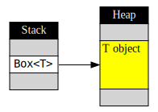
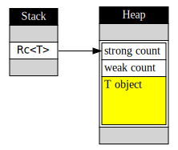
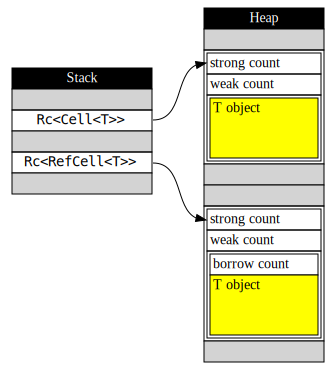

# 給 C++ 使用者的 Rust 簡介：智慧指標


在絕大多數的程式語言中，在 heap 上配置記憶體都是一項不可或缺的功能。由於存在 stack 上的物件有固定的生命週期，若要建立出像是二元樹 (binary tree) 或連結串列 (linked list) 之類的資料結構，就勢必要把物件配置在 heap 上。

在 Rust 中當然也可以在 heap 上配置物件，但為了正確管理記憶體資源，Rust 不允許你直接取得物件在 heap 上的裸指標 (raw pointer)。相反地，只要直接產生智慧指標 (smart pointer)，Rust 就會在 heap 上配置適當的空間、初始化物件、並且把記憶體位址包裝在智慧指標內。

在這篇文章中，我將會介紹在 Rust 中不同的智慧指標，以及它們使用上與 C++ 的相同與相異之處。


## 最單純的智慧指標 Box

在 Rust 中最簡單的智慧指標是 `Box`，它相當於 C++ 中的 `std::unique_ptr`。不同的地方在於你不需要傳遞裸指標來初始化，而是直接傳遞要放在 heap 上的物件內容。

```rust
let p = Box::new(10); // 即 C++14 的 auto p = make_unique<int>(10);
                      // 或 C++11 的 auto p = unique_ptr<int>(new int(10));
```

產生 `Box` 指標後，你可以用星號來存取這個物件的內容，就像直接操作該物件一樣：

```rust
let mut p = Box::new(10);
println!("{}", *p); // 10
*p += 20;
println!("{}", *p); // 30
```

注意第一行的 `mut`，若要改變指標指向的物件內容，我們也必需把指標本身宣告為 `mut`。這個特性稱之為可變繼承 (inherited mutability)，在之後介紹 OOP 的文章中，我會解釋為什麼有這樣的規定。

`Box` 既然是個智慧指標，自然符合 C++ 使用者習慣的 RAII (Resource Acquisition Is Initialization) 模式：在建構式中取得資源，並在解構式中釋放資源。

```rust
fn foo() {
    let p = Box::new(10); // p 配置了一個 i32 的記憶體空間存放 10
    // ...
    // ...
    return; // 離開函式時自動呼叫 p 的解構式，並釋放記憶體
}
```

`Box` 指標具有和 C++ 的 `unique_ptr` 相同的特性：對任何配置在 heap 上、使用 `Box` 管理的物件，只會有一個獨一無二的 `Box` 指標指向它們。因此 `Box` 具備了 move semantics，當你使用等號賦值時，該物件的所有權會被轉移到另一個 `Box` 指標上，這樣才能避免重覆釋放同一個指標。

```rust
{
    let p = Box::new(10);
    let q = p; // p 所控制的物件已轉移到 q 上
    println!("{}", *p); // 錯誤：p 已回到未初始化的狀態
} // 離開區塊，q 被釋放
```

上面的範例中，由於 `p` 的所有權轉移到 `q` 身上，因此負責釋放記憶體的責任也轉移到 `q` 身上。`p` 不再擁有內容，也不需要在離開區塊時釋放記憶體。

最後，如果 `Box` 指向某個基本型別，或是任何可以使用 `clone()` 進行複製的物件，那麼對 `Box` 指標使用 `clone()` 將會進行深層複製，新的 `Box` 指標將會指向原本物件的複本。

```rust
let mut p = Box::new("hello".to_string());
let q = p.clone();
*p += " world";
println!("p = {}", *p); // p = hello world
println!("q = {}", *q); // q = hello
```

## 空指標與泛型容器 `Option`

在 Rust 中，不管是參考或智慧指標，都必然指向一個合法存在的物件。那麼我們要用什麼型別來表達一個可能存在、也可能不存在的物件呢？答案是使用 `Option` 這個泛形類別：

```rust
fn check_exist(x: Option<i32>) {
    if x.is_none() {
        println!("x is empty!");
    } else {
        println!("x has value {}", x.unwrap());
    }
}

fn main() {
    check_exist(Some(10)); // x has value 10
    check_exist(None);     // x is empty!
}
```

`Option<T>` 是個可以容納零個或剛好一個 `T` 物件的容器。我們可以用 `Some(...)` 或 `None` 來初始化，並使用 `is_some()` 或 `is_none()` 來判斷內部是否有值。

`unwrap()` 可以取出 `Option` 中的值，然而若在內容為空的時候取值是執行時期錯誤，並導致程式立刻中止。雖然我們可以在呼叫 `unwrap()` 前使用 `is_some()` 來確認內部狀態，但 `unwrap()` 本身仍然會多做一次檢查，因此這樣的寫法並不是 Rust 的慣例 (idiom)。比較好的寫法是使用 pattern matching：

```rust
fn check_exist(x: Option<i32>) {
    match x {
        Some(value) => println!("x has value {}", value),
        None => println!("x is empty!"),
    }
}
```

這邊的 `match` 區塊很像 C++ 中的 `switch case`，不同的地方在於 `Some(value)` 這個寫法，我們可以在 `x` 內部確實有值的時候，將這個值指定到 `value` 上。而當 `x` 內部空空如也時，則執行 `None` 後面的程式碼。這樣的寫法不但安全，又可以避免在呼叫 `unwrap()` 時重覆檢查物件內容。

上述的範例中，由於 `i32` 是可複製的型別，因此 `Some(value)` 會是 `x` 的複本。如果我們想要修改 `x` 的內容，可以用 `Some(ref mut value)` 取得內容物的參考，表示 `value` 以 mutable borrow 的方式指向 `Option` 的內容物。

```rust
let x: Option<i32> = Some(10);
match x {
    Some(ref mut value) => *value += 1, // 當 x 含有某個 i32 時，value 是指向該 i32 的參考
    None => (), // 不做任何事
}
// x 成為 Some(11)
```

`Option` 與 `match` 其實就是函數程式語言中的 tagged union 及 pattern matching。這部份我會在後續的文章中介紹，現在我們只需要知道用 `Option` 來表達「有可能為 null 的型別」即可。

## 二元樹

有了 `Box` 與 `Option`，我們終於可以做出一個簡單的二元樹 (binary tree)：

```rust
struct Node {
    data: i32,
    left: Option<Box<Node>>,
    right: Option<Box<Node>>,
}
```

`left` 與 `right` 的型別看起來有點令人眼花，但這是有原因的：

1. `left` 或 `right` 可能指向子節點，也可能不指向任何東西。因此我們要使用 `Option` 來表達這些可能存在也可能為空的欄位。
2. `Option<T>` 會直接儲存 `T` 物件的內容，加上一個額外欄位來區分 `Some(T)` 亦或是 `None`，因此 `Option<T>` 這個物件的大小會略大於 `T` 的大小。如果我們直接用 `Option<Node>` 當作 `left` 或 `right` 的欄位形別，就會出現「自己包含自己」的矛盾情況。因此，我們要使用 `Box` 來表達 `Option` 的內容型別其實是指向下一層節點的指標，而不是節點本身。

有了定義後，我們可以試著進行操作：

```rust
fn traverse(root: &Node) {
    print!("({} ", root.data);
    match root.left {
        Some(ref child) => traverse(child),
        None => (),
    }
    match root.right {
        Some(ref child) => traverse(child),
        None => (),
    }
    print!(")");
}
```

`traverse` 示範了使用前序 (prefix) 印出所有元素的方法：首先我們把自己的資料印出來，接著遞迴尋訪左子樹及右子樹。因為尋訪子樹時不需要修改節點的內容，但仍需要指向節點的參考，因此我們用 `Some(ref child)` 表達這個參考是個 immutable borrow。

接著我們簡單實作加入元素的操作：

```rust
// 產生一個 leaf node
fn new_leaf(data: i32) -> Option<Box<Node>> {
    Some( Box::new(
        Node {
            data: data,
            left: None,
            right: None,
        }
    ))
}

fn insert(root: &mut Node, data: i32) {
    if data > root.data {
        match root.right {
            Some(ref mut child) => insert(child, data),
            None => root.right = new_leaf(data),
        }
    } else {
        match root.left {
            Some(ref mut child) => insert(child, data),
            None => root.left = new_leaf(data),
        }
    }
}
```

這是不考慮二元樹平衡、用最單純的方式實作元素插入。

```rust
fn main() {
    let mut root = Node { data: 10, left: None, right: None };
    insert(&mut root, 1);
    insert(&mut root, 20);
    insert(&mut root, 5);
    insert(&mut root, 15);
    traverse(&root); // 印出 (10 (1 (5 ))(20 (15 )))
}
```

在後續文章中，我會介紹 Rust 的 OOP 功能，讓這個二元樹的界面更接近 C++ 使用者所習慣的物件操作方式。

## 參考計數指標 Rc

`Box` 限制了只有一個指標能指向 heap 上的物件。如果你希望能在多個不同地方分享同一個物件，就得改用參考計數指標 `Rc`，它相當於 C++ 的 `shared_ptr`。

```rust
use std::rc::Rc; // Rc 不在預設的命名空間中，因此需要用 use 引入符號
                 // 相當於 C++ 的 using std::shared_ptr;
fn main() {
    let x = Rc::new(10);
    let y = x.clone();
    let z = y.clone();

    println!("{}", *y); // 10
    println!("{}", *z); // 10
}
```

建立 `Rc` 指標的方法和 `Box` 非常接近，然而當你呼叫 `clone()` 時，`Rc` 會增加參考計數並產生另一個指向相同物件的指標。注意對 C++ 的 `shared_ptr` 來說，只要用等號賦值就會增加參考計數，但等號在 Rust 中是轉移所有權的意思，你要明確呼叫 `clone()` 才會增加參考計數。

```rust
use std::rc::Rc;
fn main() {              // // C++ 對照
    let x = Rc::new(10); // auto x = make_shared<int>(10);
    let y = x;           // auto y = move(x);
    println!("{}", *x);  // cout << *x << endl; // 錯誤：x 所有權已轉移
    let z = y.clone();   // auto z = y;
    println!("{}", *y);  // cout << *y << endl; // OK：z 和 y 指向同一物件
}
```

相較於垃圾回收 (garbage collection)，使用參考計數指標管理記憶體的優點在於回收記憶體時不會暫停整支程式，同時也容易控制物件解構的時間點。然而若遇到循環參考 (circular reference)，因為每個參考計數都無法歸零，就無法正確釋放所有物件。因此參考計數指標通常還需要搭配弱指標 (weak pointer) 一起使用。

Rust 也提供了弱指標，但因為篇幅有限，我們先跳過這部份，把焦點放在 Rust 遇到的另一個問題上：要如何修改 `Rc` 指向的物件內容呢？

## 引入修改能力的 `Cell` 與 `RefCell`

`Rc` 不提供任何修改內容的操作界面，即使你宣告為 `mut` 也無法寫入新值：

```rust
let mut p = Rc::new(10);
*p = 20; // 錯誤
```

為什麼不能改變 `Rc` 指向的內容呢？我們回想一下 Rust 對參考設下的限制，可以了解它背後的設計思維：

> Rust 在編譯時會保證，任何變數經過取址後，要嘛同時有許多個 immutable borrow，或是只存在唯一一個 mutable borrow，不允許兩種取址方法同時存在，也不允許有多個 mutable borrow。

`Rc` 是指向某物件的智慧指標，因此廣義上也屬於參考型別。同時 `Rc` 允許多個指標指向同一個物件，因此它必需是 immutable borrow，否則就違反了 Rust 對參考型別所設下的原則。如果你對這個概念還有點模糊，不妨考慮以下的例子：

```rust
use std::rc::Rc;
fn foo(v1: Rc<Vec<i32>>, mut v2: Rc<Vec<i32>>) {
    let it = v1.iter(); // 取得 v1 的 iterator
    v2.clear();         // 修改 v2 的內容
}

fn main() {
    let v = Rc::new(vec![1,2,3]);
    foo(v.clone(), v.clone()); // 故意讓 foo() 中的 v1 與 v2 指向同一物件
}
```

在 `foo()` 函式中，我們對 `v2` 的內容做了更動，會導致所有指向 `v2` 的迭代器失效。然而 `v1` 與 `v2` 在執行時可能會指向同一個物件，因此繼續使用指向 `v1` 的迭代器可能會造成記憶體存取錯誤。不幸的是，在編譯這段程式碼時，Rust 無從判斷 `v1` 與 `v2` 是否指向同一個 `Vec` 物件，因此 Rust 採用最保守的做法：禁止第四行中對 `Rc` 內容物的修改行為，來避免可能的記憶體錯誤。

當然，如果共享某塊資料就無法修改其內容，這樣的智慧指標並不是很實用。因此 Rust 提供兩個中介容器，讓你可以透過它們來修改 `Rc` 指向的物件內容，同時又能維持記憶體安全。我們先來看看適合用在內建型別的 `Cell`：

```rust
use std::rc::Rc;
use std::cell::Cell;
fn main(){
    let p = Rc::new(Cell::new(10));
    println!("{}", p.get()); // 10
    p.set(20);
    println!("{}", p.get()); // 20
}
```

`Cell` 是一個只容納單一元素的簡單容器，你可以透過 `get()` 與 `set()` 來存取，同時具備內部可變 (interior mutability) 的特性，因此就算包在 `Rc` 內部，仍然可以修改它的內容。`Cell` 內部只能容納可複製的類別，比如說 `i32`、`f32` 之類的基本型別[[1\]](https://electronic.blue/blog/2017/04/09-rust-an-introduction-smart-pointer/#fn1)，而且你只能透過 `set()` 來修改 `Cell` 的內容，而無法取得內容物的參考，因此在同一個執行緒內，`Cell` 可以保證在 `set()` 修改內容時，不會破壞任何指向內容物的參考。

許多型別具有 move semantics，像是 `Vec` 或 `String`。這類型別不能放在 `Cell` 當中，因此 Rust 提供了 `RefCell`，它提供了 `borrow()` 與 `borrow_mut()` 讓你取得內容物的參考，並且在執行時期動態檢查這些參考是否符合 borrow checker 的規則。馬上來看一個範例：

```rust
use std::rc::Rc;
use std::cell::RefCell;

fn foo(c1: Rc<RefCell<Vec<i32>>>, c2: Rc<RefCell<Vec<i32>>>) {
    let v1 = c1.borrow();   // 取得 c1 內部的 Vec 參考
    let it = v1.iter();

    let mut v2 = c2.borrow_mut(); // 取得 c2 內部的 Vec 參考，並標明我們要修改內容
    v2.clear();
}
```

這段程式碼**可以**通過編譯，然而如果我們傳入指向同一個 `RefCell` 的指標，將會造成執行時期錯誤：

```rust
fn main() {
    let c = Rc::new(RefCell::new(vec![1,2,3]));
    foo(c.clone(), c.clone()); // thread 'main' panicked at 'already borrowed: BorrowMutError'
}
```

執行時的錯誤訊息會清楚告訴你：在呼叫 `c2.borrow_mut()` 時，還存在另一個未消滅的 borrow，因此違反了 borrow checker 的規則。

### 常見問題

`RefCell` 的使用對 Rust 初學者而言可說是一大挑戰。它使得型別變得很複雜，同時又需要額外操作才能接觸到真正的內容物件。另一個初學者常見的問題是這樣：

```rust
fn foo(c: Rc<RefCell<Vec<i32>>>) {
    let it = c.borrow().iter(); // 取得內容物的 iterator
    // ...
}
```

這段程式碼無法通過編譯。如果你使用 1.16 或更新版本的編譯器，可以看到 Rust 很努力地畫圖解釋：

```rust
error: borrowed value does not live long enough
 --> <anon>:5:31
  |
5 |     let it = c.borrow().iter(); // 取得內容物的 iterator
  |              ----------       ^ temporary value dropped here while still borrowed
  |              |
  |              temporary value created here
...
9 | }
  | - temporary value needs to live until here
  |
  = note: consider using a `let` binding to increase its lifetime
```

錯誤的原因在於 `RefCell` 使用 RAII 的方式來管理 borrow 狀態。當你呼叫 `borrow()` 或 `borrow_mut()` 時，`RefCell` 會創造出一個代理物件 (proxy object)，讓你用這個代理物件存取其內容物。而當這個代理物件的生命周期結束時，其解構式會恢復 `RefCell` 內的 borrow 狀態，讓你下次可以繼續對 `RefCell` 呼叫 `borrow()` 或 `borrow_mut()`。

然而，在上述的範例中，我們直接對 `borrow()` 的回傳值呼叫 `iter()`，而沒有把代理物件存在某個變數中。因此代理物件會被放在暫時變數中，並在這個運算式結束時解構，恢復 `RefCell` 的 borrow 狀態。然而，`iter()` 的結果卻還存在 `it` 這個變數內，並且指向內容物，這超出了 `RefCell` 所設下的保護傘。

正確的作法是把 `borrow()` 的結果存在變數中：

```rust
fn foo(c: Rc<RefCell<Vec<i32>>>) {
    let r = c.borrow(); // r 的生命週期比 it 長，確保 borrow 存在
    let it = r.iter();
    // ...
}
```

## 適合多執行緒的 `Arc`

使用智慧指標會遇到的另一個問題是執行緒安全 (thread safety)。在多執行緒的環境下，同時操作同一個智慧指標的參考計數可能會導致 race condition。因此，Rust 提供了另一個適用於多緒處理的智彗指標 `Arc`。它的使用方法大致上與 `Rc` 相同，但在操作參考計數時會使用原子操作 (atomic operation)，確保在多執行緒的環境中可以正確管理資源。

`Arc` 和 `Rc` 同樣限制了修改內容物的能力。然而 `Cell` 或 `RefCell` 也不適合在多緒環境中使用，因此若你要在多緒環境中共享一塊可修改內容的資料，必需搭配 `Mutex` 或 `RwLock` 這兩個中介容器。

多緒安全已經超出了本文的討論範圍，有興趣的讀者可以自行參考 Rust 官方文件。幸運的是，borrow checker 的規則有助於你避免許多在多緒環境中的常見錯誤，若你已經習慣了 `RefCell` 的操作方式，對於 `Mutex` 或 `RwLock` 也能駕輕就熟。

## 智慧指標的成本

`Box` 限制只有一個指標能操作 heap 上的物件，而這項限制在編譯時期就能完成檢查，因此 `Box` 的大小和裸指標大小相同，操作時的效能也完全相同。

[](https://electronic.blue/blog/2017/04/09-rust-an-introduction-smart-pointer/box.svg)Box 與裸指標的成本完全相同

`Rc` 除了配置物件外，還會額外配置空間給來儲存兩個數字：強參考計數及弱參考計數。這兩個數字與物件指標形成一塊結構一起儲存在 heap 上，而 `Rc` 內部只儲存這個結構的指標。因此 `Rc` 的大小與裸指標相同，但是在複製及消滅時需要額外增減參考計數。

[](https://electronic.blue/blog/2017/04/09-rust-an-introduction-smart-pointer/rc.svg)Rc 額外配置了兩個數字的空間

`Arc` 的結構與 `Rc` 相同，但在增減參考計數時使用原子操作，因此複製或消減時的時間成本會比 `Rc` 更高。

另外，`Cell<T>` 占用的空間與 `T` 完全相同，而 `RefCell<T>` 則需要額外一個空間記錄 borrow 狀態。

[](https://electronic.blue/blog/2017/04/09-rust-an-introduction-smart-pointer/cell.svg)Cell 不會占用額外空間，RefCell 額外占用一個數字的空間

## 結語

這篇文章介紹了如何在 Rust 中配置 heap 上的記憶體，並且使用智慧指標以確保程式正確回收資源。相較於其它語言，Rust 在這部份的學習曲線很陡峭：只是要分享資料而已，為什麼搞得這麼複雜呢？

其原因在於 Rust 儘可能提供你選擇。C++ 發明人 Bjarne Stroustrup 曾說明過 C++ 的零成本抽象化原則 (zero-overhead rule)：若你沒用到某個功能，就不需要為它付出時間或空間上的成本；若你確實用了某個抽象化的功能，那麼編譯器幫你產生的程式碼至少要和你手寫的最佳化程式碼表現得一樣好。在這個設計原則之下，追求執行效率的程式設計師才能安心使用語言提供的高階抽象功能，讓程式容易維護，又能保有良好的效能。

Rust 同樣遵循零成本抽象化原則，這也是它提供各種智慧指標的原因：如果物件不需要共享，就不需要付出參考計數的成本；如果只有單執行緒，就不需要付出原子操作的額外成本；如果不修改分享的資料，就不需要負擔 `RefCell` 或 `Mutex` 的額外成本。

在下一篇文章中，我會介紹 Rust 的物件導向功能。

------

1. 所謂的可複製是指實作 `Copy` trait 的型別，未實作的類別預設都有 move semantics，之後進入到 OOP 時我會再詳細介紹。 [↩](https://electronic.blue/blog/2017/04/09-rust-an-introduction-smart-pointer/#fnref1)