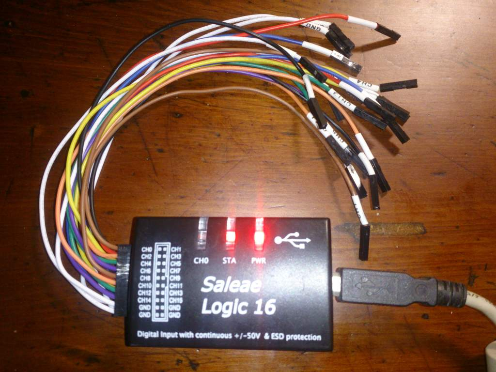
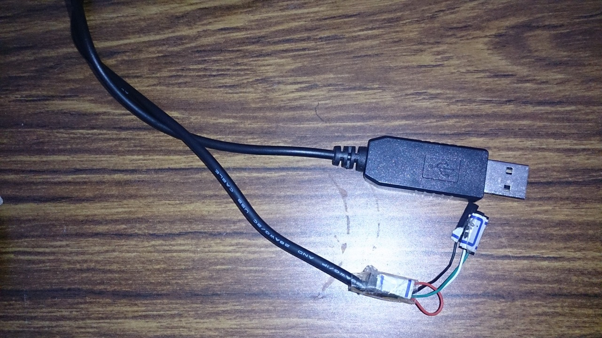
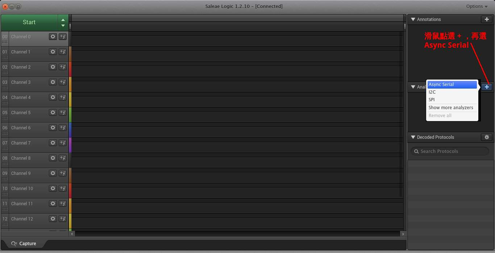
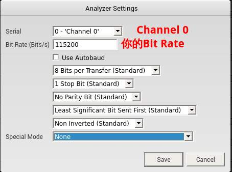
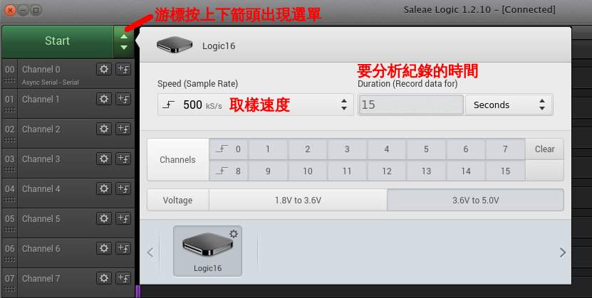
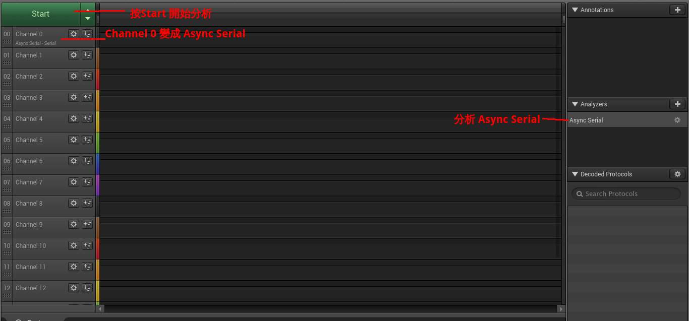
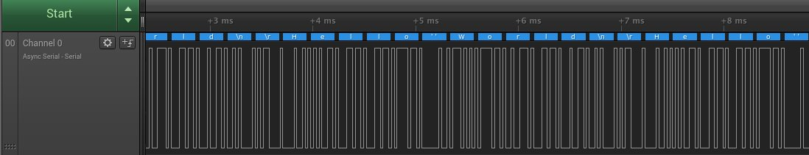
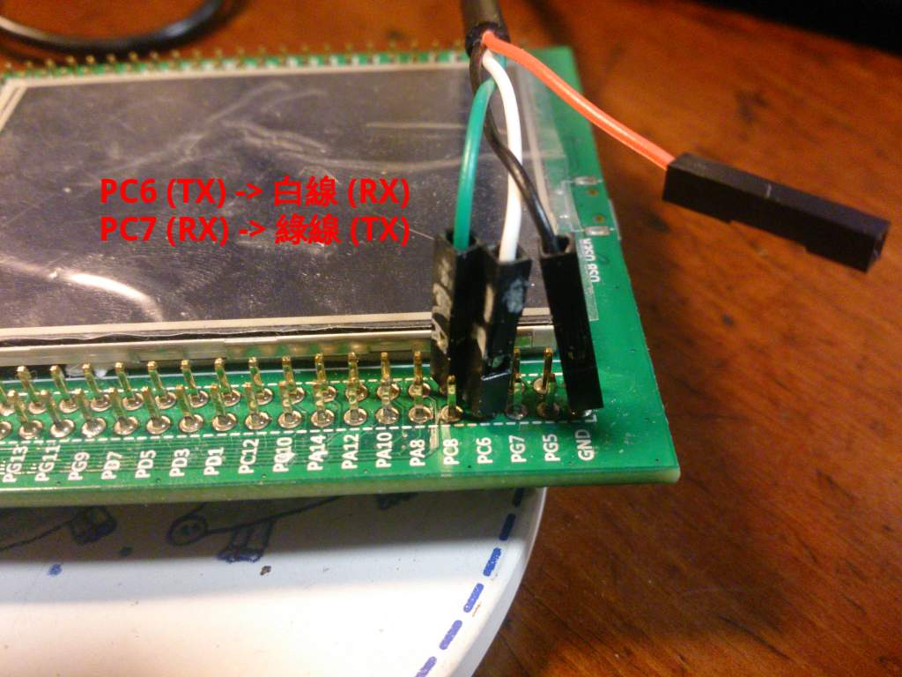

# ARM CM4 Pratice (3): USART 初探


##致謝

感謝網友Zack，Villar，學弟Joe Ho，還有其他大大的幫忙，不然這次應該是撞牆撞到死吧。

##前言

這次實驗有卡關，不然其實不算難。卡關的點如下：

- 一開始使用USART1，可是USART1接到STLink 接腳，最後用USART6代替。(STM32F4 Discovry Disco 開發版手冊，p19, SB11那段)

- SPL的HSE 設定和版子不合，造成Baud rate計算錯誤。

這次的實驗是一個ECHO程式，透過版子上的USART6和電腦連線，電腦送出什麼字元，版子就傳回什麼字元。

##目錄

- 事前準備
- 測試環境
- USART 控制
- 程式碼
    - 完整程式碼
    - Makefile
- 功能驗證
- 參考資料

##事前準備

- Saleae 邏輯分析儀 (一千新台幣有找）
    - 需要自行到Saleae官方網站下載安裝Linux版軟體




- USB 轉 RS232 TTL 轉接線 





## 測試環境

```sh
$ lsb_release -a
No LSB modules are available.
Distributor ID:   Ubuntu
Description:  Ubuntu 14.04.4 LTS
Release:  14.04
Codename: trusty

$ arm-none-eabi-gcc --version
arm-none-eabi-gcc (GNU Tools for ARM Embedded Processors) 5.4.1 20160609 (release) [ARM/embedded-5-branch revision 237715]
...
```


- SPL版本： STM32F4xx_DSP_StdPeriph_Lib_V1.6.1
- 開發板： STM32F4 Dicovery, STM32F429-Disco

##USART 控制

對於組裝工來說，我想要理解的不是電位差之這些電器信號。甚至在組裝時我也不在意暫存器設定等東西和背後的原理（好孩子不要學）。我關心的是

- 我們要用哪些資源？
- 這些資源對應的實體腳位是？
- 軟體中怎麼樣設定和啟動設備？
- 軟體中怎麼樣傳輸資料？

我們針對這四個問題一一處理

##我們要用哪些資源？

從手冊可以看到有八個USART可以用。我原本是挑USART1來用，不過後來卡關經過網友提醒發現要避開USART1。後來發現APB2上面除了USART1外另外一個USART是USART6。懶得太多程式碼的情況下就挑了USART6。

##這些資源對應的實體腳位是？
一樣要翻手冊。

- PC6: UASRT6 TX
- PC7: USART6 RX


##軟體中怎麼樣設定和啟動設備？

要分兩個部份討論

###a. GPIOC 設定

要設定

- 開啟GPIOC的clock
- 設定Pin腳，設定PC6和PC7這兩個腳位。為什麼是這兩個腳位請查手冊

    - PC6: 設成Alternate function，也就是USART6 TX
    - PC7: 設成Alternate function，也就是USART6 RX
    - 其他
        - 設定為Pull UP，這和USART通訊協定有關，在IDLE時維持高電位
        - 設定Push-Pull輸出模式，這個我完全不懂只是閉著眼睛抄的

來看大家最討厭看的程式碼片斷吧


```c
GPIO_InitTypeDef GPIO_InitStructure;

/* Enable GPIOC clock */
RCC_AHB1PeriphClockCmd(RCC_AHB1Periph_GPIOC, ENABLE);

/* Connect USART6_Tx instead of PC6 */
GPIO_PinAFConfig(GPIOC, GPIO_PinSource6, GPIO_AF_USART6);

/* Connect USART6_Rx instead of PC7 */
GPIO_PinAFConfig(GPIOC, GPIO_PinSource7, GPIO_AF_USART6);

/* Configure USART Tx (PC6) and Rx (PC7) as alternate function  */
GPIO_InitStructure.GPIO_Mode  = GPIO_Mode_AF;
GPIO_InitStructure.GPIO_Pin   = GPIO_Pin_6 | GPIO_Pin_7;
GPIO_InitStructure.GPIO_Speed = GPIO_Speed_100MHz;

GPIO_InitStructure.GPIO_OType = GPIO_OType_PP;
GPIO_InitStructure.GPIO_PuPd  = GPIO_PuPd_UP;

GPIO_Init(GPIOC, &GPIO_InitStructure);
```

###b. USART6 設定

依下列步驟

- 開啟USART6的clock
- 設定USART6
    - 115200 BPS
    - No parity bit
    - 8-bit 資料
    - 1 Stop bit
    - 關閉硬體流量控制
    - TX/RX模式都打開
- 啟動UASRT6

一樣來看大家最討厭看的程式碼片斷吧


```c
USART_InitTypeDef USART_InitStruct;

/* Enable USART6 clock */
RCC_APB2PeriphClockCmd(RCC_APB2Periph_USART6, ENABLE);

/* 115200, N81  */
USART_InitStruct.USART_BaudRate = 115200;
USART_InitStruct.USART_WordLength = USART_WordLength_8b;
USART_InitStruct.USART_StopBits = USART_StopBits_1;
USART_InitStruct.USART_Parity = USART_Parity_No;
USART_InitStruct.USART_HardwareFlowControl = USART_HardwareFlowControl_None;
USART_InitStruct.USART_Mode = USART_Mode_Rx | USART_Mode_Tx;

/* Apply USART settings */
USART_Init(USART6, &USART_InitStruct);

/* Enable USART */
USART_Cmd(USART6, ENABLE);
```

##軟體中怎麼樣傳輸資料？

這部份還蠻直覺的，就是檢查狀態。可以送的時候就寫資料到暫存器去；有資料時從暫存器讀出資料。程式碼夠短應該不會那麼討厭吧？另外SPL也有提供USART傳輸接收的函數，請自行查詢。

```c
char getchar(void)
{
    while(USART_GetFlagStatus(USART6, USART_FLAG_RXNE) == RESET);
    return USART6->DR & 0xff;
}

void putchar(char c)
{
    /* Wait until data was tranferred */
    while(USART_GetFlagStatus(USART6, USART_FLAG_TXE) == RESET);

    USART6->DR = (c & 0xff);
}
```

## 程式碼

前面有提到HSE設定需要更動為8MHz。我是在stm32f4xx_conf.h加入以下片斷。

```c
#if defined  (HSE_VALUE)
/* Redefine the HSE value; it's equal to 8 MHz on the STM32F4-DISCOVERY Kit */
 #undef HSE_VALUE
 #define HSE_VALUE    ((uint32_t)8000000) 
#endif /* HSE_VALUE */
```

##完整程式碼

就是把前面的設定合體再加上一些helper就是了。這個程式也不難，就是印出你打的字。當你按enter後會自動塞入\r並且印出提示符號。

- usart.c

```c
#include "stm32f4xx_conf.h"
#include <stm32f4xx.h>
#include <stm32f4xx_gpio.h>
#include <stm32f4xx_usart.h>

void setupUSART(void);

/* helper functions */
void print(char *str);
char getchar(void);
void putchar(char c);

int main(int argc, char **argv)
{
    /* Setup USART */
    setupUSART();

    /* Greeting */
    print("Hello World\n");
    print("\r> ");
    while(1) {
        /* Echo a character */
        char c = getchar();
        putchar(c);

        /* Show prompt with enter */
        if (c == '\n') {
            print("\r> ");
        }
    }

    return 0;
}

void setupUSART(void)
{
    GPIO_InitTypeDef GPIO_InitStructure;

    /* Enable GPIOC clock */
    RCC_AHB1PeriphClockCmd(RCC_AHB1Periph_GPIOC, ENABLE);

    /* Connect USART6_Tx instead of PC6 */
    GPIO_PinAFConfig(GPIOC, GPIO_PinSource6, GPIO_AF_USART6);

    /* Connect USART6_Rx instead of PC7 */
    GPIO_PinAFConfig(GPIOC, GPIO_PinSource7, GPIO_AF_USART6);

    /* Configure USART Tx (PC6) and Rx (PC7) as alternate function  */
    GPIO_InitStructure.GPIO_Mode  = GPIO_Mode_AF;
    GPIO_InitStructure.GPIO_Pin   = GPIO_Pin_6 | GPIO_Pin_7;
    GPIO_InitStructure.GPIO_Speed = GPIO_Speed_100MHz;

    GPIO_InitStructure.GPIO_OType = GPIO_OType_PP;
    GPIO_InitStructure.GPIO_PuPd  = GPIO_PuPd_UP;

    GPIO_Init(GPIOC, &GPIO_InitStructure);

    /********************************************
     * USART set started here
     ********************************************/
    USART_InitTypeDef USART_InitStruct;

    /* Enable USART6 clock */
    RCC_APB2PeriphClockCmd(RCC_APB2Periph_USART6, ENABLE);

    /* 115200, N81  */
    USART_InitStruct.USART_BaudRate = 115200;
    USART_InitStruct.USART_WordLength = USART_WordLength_8b;
    USART_InitStruct.USART_StopBits = USART_StopBits_1;
    USART_InitStruct.USART_Parity = USART_Parity_No;
    USART_InitStruct.USART_HardwareFlowControl = USART_HardwareFlowControl_None;
    USART_InitStruct.USART_Mode = USART_Mode_Rx | USART_Mode_Tx;

    /* Apply USART settings */
    USART_Init(USART6, &USART_InitStruct);

    /* Enable USART */
    USART_Cmd(USART6, ENABLE);
}

char getchar(void)
{
    while(USART_GetFlagStatus(USART6, USART_FLAG_RXNE) == RESET);
    return USART6->DR & 0xff;
}

void putchar(char c)
{
    /* Wait until data was tranferred */
    while(USART_GetFlagStatus(USART6, USART_FLAG_TXE) == RESET);

    USART6->DR = (c & 0xff);
}

void print(char *str)
{
    assert_param(str != 0);
    while(*str) {
        putchar(*str);
        str++;
    }
}

/* Trap here for gdb if asserted */
void assert_failed(uint8_t* file, uint32_t line)
{
    while(1);
}
```

- Makefile

有兩點要說明

- 加入stm32f4xx_usart.c
- 加入make flash自動燒錄
    - 目前發現使用st-flash燒錄有時候顯示燒錄完成，但是實際上測試還是燒錄前的行為，換成openocd測試中


```sh
#----------------------------------------------------------------------------------
# Commom settings
#----------------------------------------------------------------------------------
TARGET=usart
PRJ_ROOT=$(shell cd ../../ ; pwd)
include $(PRJ_ROOT)/conf/build.def

#----------------------------------------------------------------------------------
# Files to build
#----------------------------------------------------------------------------------
SRCS  = $(CMSIS_STARTUP_SRC) $(CMSIS_SYSTEM_SRC)
SRCS += $(STM_DIR)/src/stm32f4xx_gpio.c
SRCS += $(STM_DIR)/src/stm32f4xx_rcc.c
SRCS += $(STM_DIR)/src/stm32f4xx_usart.c
SRCS += usart.c

C_OBJS = $(patsubst %.c, %.o, $(SRCS))   # translate *.c to *.o
OBJS   = $(patsubst %.s, %.o, $(C_OBJS)) # also *.s to *.o files

OUT_OBJS = $(addprefix $(OUT_DIR)/, $(OBJS))

#----------------------------------------------------------------------------------
# Build here
#----------------------------------------------------------------------------------
$(OUT_DIR)/$(TARGET).bin: $(OUT_OBJS)
  $(TOOL_CHAIN_PREFIX)-gcc -Wl,-Map=$(OUT_DIR)/$(TARGET).map,-T$(TARGET).ld -nostartfiles \
      $(CFLAGS) $(OUT_OBJS) -o $(OUT_DIR)/$(TARGET).elf
  $(TOOL_CHAIN_PREFIX)-objcopy -Obinary $(OUT_DIR)/$(TARGET).elf $@
  $(TOOL_CHAIN_PREFIX)-objdump -S $(OUT_DIR)/$(TARGET).elf > $(OUT_DIR)/$(TARGET).list

$(OUT_DIR)/%.o: %.s
  mkdir -p $(dir $@)
  $(TOOL_CHAIN_PREFIX)-gcc -c $(CFLAGS) $< -o $@

$(OUT_DIR)/%.o: %.c
  mkdir -p $(dir $@)
  $(TOOL_CHAIN_PREFIX)-gcc -c $(CFLAGS) $< -o $@

flash: $(OUT_DIR)/$(TARGET).bin
  openocd -f interface/stlink-v2.cfg  \
            -f target/stm32f4x.cfg      \
            -c "init"                   \
            -c "reset init"             \
            -c "stm32f2x unlock 0"      \
            -c "flash probe 0"          \
            -c "flash info 0"           \
            -c "flash write_image erase $< 0x8000000" \
            -c "reset run" -c shutdown

clean:
    rm -fr $(OUT_DIR) gdb.txt
```

## 功能驗證

###邏輯分析儀驗證


現在邏輯分析儀已經可以自動幫你抓波形分析了。當你下載並解壓縮檔案後，記得更新udev的Rule讓電腦可以認得邏輯分析儀。

接下來你要設定邏輯分析儀的分析通訊協定為Async Serial 如下圖 



選了Async Serial會有選單出現，你需要設定用第幾個Channel以及USART通訊參數如




如果需要的話，你可以進一步設定取樣速度、取樣時間如下圖 




假設你的邏輯分析儀接腳都接好了就可以按開始分析訊號了 





這是一個成功的Hello World波形分析，圖可能有點小，全圖在這邊。 



##實際驗證

你需要先把USB 轉 RS232 TTL 轉接線接到版子上如下圖 




我是使用mintern，執行畫面如下

```sh
$ miniterm.py -b 115200 -p /dev/ttyUSB0
--- Miniterm on /dev/ttyUSB0: 115200,8,N,1 ---
--- Quit: Ctrl+]  |  Menu: Ctrl+T | Help: Ctrl+T followed by Ctrl+H ---
test
> test
> test
> test
> testast
> teadsatdsasd
```

##參考資料

- Geoffrey Brown: Teaching 
    - 請找 Lab Manual 裏面的link, 書名是Discovering the STM32 Microcontroller

- STM32F4 Discovry Disco 開發版手冊
- STM32F4 DSP and standard peripherals library
