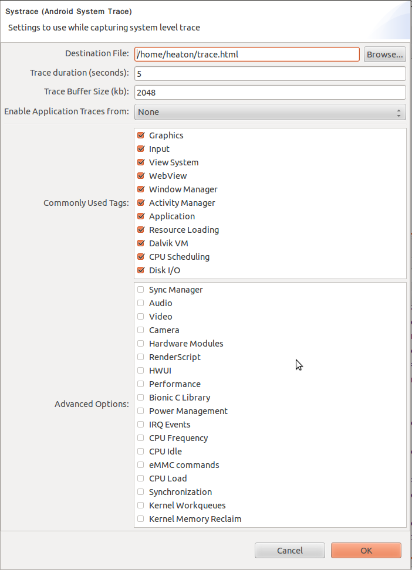
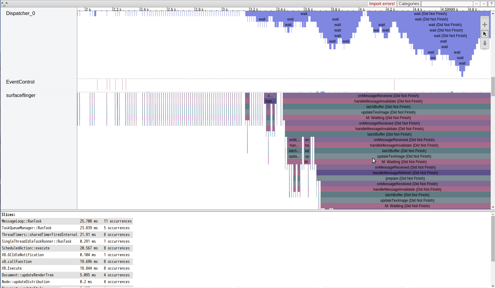
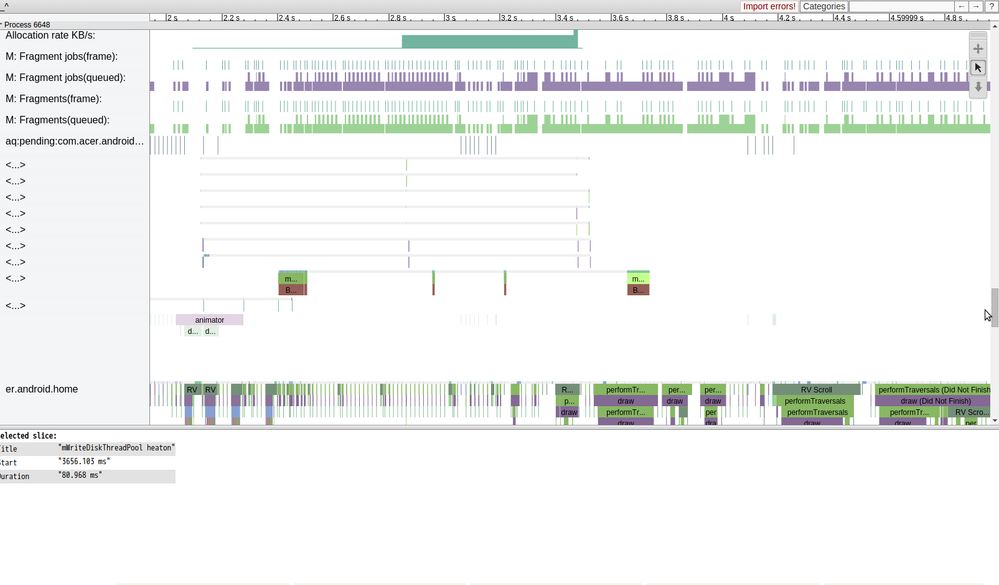
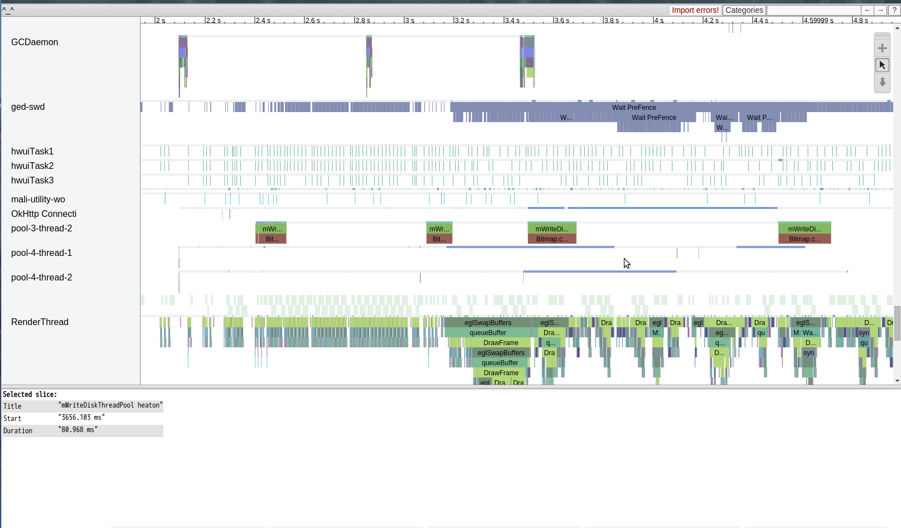
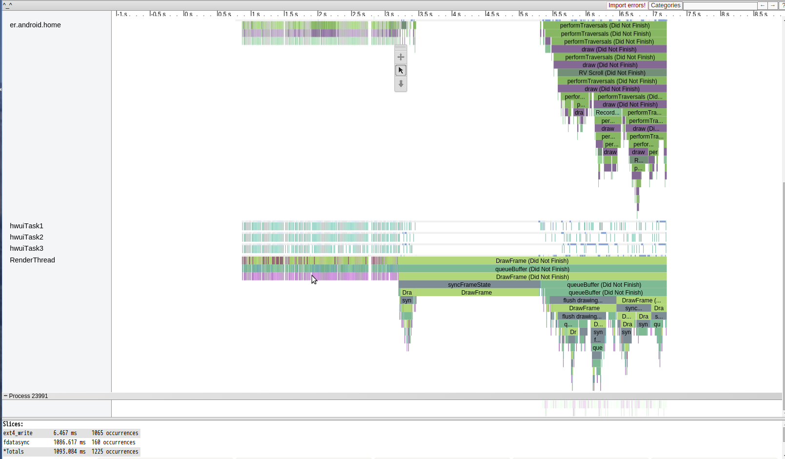

# Analyzing UI Performance with Systrace

在你身為anddroid 工程師的生涯中，一定曾經有人會拿者手機，邊滑邊告訴你，這個怎某看起來好卡
然後請你修好。
『好卡』一個很主觀的敘述，畢竟卡的定義大家都不一樣，但是其實這有很詳細的定義
『 you should check that user interactions are buttery smooth, running at a consistent 60 frames per second.』
一秒60frames，這樣是人們能接受的更新速度，也就是處理一個frame必須壓在16ms以下。


因此RD首先要確定就是view的draw time 是否大於16ms，當確定這樣的事實之後，接下來才必須要需要去分析造成此問題的原因，原因的可能性太多了，可以是cpu , memory , disk access, emmc 各式各樣的問題，android 內的幾個重要關鍵元件，或者寫view的是個大癡。

而分析此類問題最好是一個統合各種資訊的工具，而google大神也在android 4.1 之後推出


### Systrace


（這圖片看起來很鬼扯，但是真的很適合用來出報告給主管看）

目前主要有兩種方式啟動這神武

####1. Command Line Usage（[官網](http://developer.android.com/tools/help/systrace.html#options)）

```
python systrace.py [options] [category1] [category2] … [categoryN]
```
Tip: If you want to see the names of tasks in the trace output, you must include the sched category in your command parameters.

The table below lists the Systrace command line options for devices running Android 4.3 (API level 18) and higher.
```
OPTION	DESCRIPTION
-h, --help	Show the help message.
-o <FILE>	Write the HTML trace report to the specified file.
-t N, --time=N	Trace activity for N seconds. The default value is 5 seconds.
-b N, --buf-size=N	Use a trace buffer size of N kilobytes. This option lets you limit the total size of the data collected during a trace.
-k <KFUNCS>
--ktrace=<KFUNCS>	Trace the activity of specific kernel functions, specified in a comma-separated list.
-l, --list-categories	List the available tracing category tags. The available tags are:
gfx – Graphics
input – Input
view – View
webview – WebView
wm – Window Manager
am – Activity Manager
audio – Audio
video – Video
camera – Camera
hal – Hardware Modules
res – Resource Loading
dalvik – Dalvik VM
rs – RenderScript
sched – CPU Scheduling
freq – CPU Frequency
membus – Memory Bus Utilization
idle – CPU Idle
disk – Disk input and output
load – CPU Load
sync – Synchronization Manager
workq – Kernel Workqueues
Note: Some trace categories are not supported on all devices.

Tip: If you want to see the names of tasks in the trace output, you must include the sched category in your command parameters.

-a <APP_NAME>
--app=<APP_NAME>	Enable tracing for applications, specified as a comma-separated list of package names. The apps must contain tracing instrumentation calls from the Traceclass. For more information, see Analyzing UI Performance with Systrace.
--from-file=<FROM_FILE>	Create the interactive Systrace report from a file, instead of running a live trace.
-e <DEVICE_SERIAL>
--serial=<DEVICE_SERIAL>	Conduct the trace on a specific connected device, identified by its device serial number.
```
這種官網就可以查到的東西，我就不多加介紹了
####2. 如果有command 恐懼症的人可以考慮使用圖形界面版




這上面兩張圖都是systrace的選單界面，並不是要大家玩大家來找碴
而是可以發現下面這一張圖，多了disk i/o tag  以及底下許多kernel 相關的進階選項
這主要差在 device 有沒有root
另外要注意的是 systrace 是建立再linux 的 `ftrace` 機制，所以device不啟用這相關module 的話
是不能用的（windows 不能用）

以上都成功完成後，可以得到一份 html檔，只要把他用chrome開啟就可以看到底下的分析畫面全tag開啟收集五秒device的畫面，設定觀測app 為 home launcher

vsync , status bar(因為畫面上有) ，binder 等component


dispatcher , surfaceflinger , event control (每一個關鍵component想要了解的話，應該可以再老羅的blog找到)




allocation , fragment 配置，以及 android launcher的view週期



設定的主要觀測對象 android home launcher 的 thread , http , 以及ondraw任務推到 render thread 的資訊

###Tracing Application Code
除了偵測主要關鍵元件的tag，自己也可以加一些trace點進去，幫助自己trace code performance.
但是Trace.beginSection(“mWriteDiskThreadPool heaton") 和 Trace.endSection()
時間點要抓好（begin,end pair），不然會長長一條，不會完結（請在同一條thread執行）
example.各位應該有發現上面selected slice 有一個  mWriteDiskThreadPool heaton 花費88.968ms
這是我用來測試自己的write disk time.




##案例分析
###CASE 1:
要知道再開發android app的過程中，有兩件令人感到愉悅的事情

1. 就是神一般的PM,UI,UX想出一個有如神一般的UI,複雜到不可思議的神奇view，然後實做的老兄就是你

2. 承上，然後當你花了通天的力量完成了以上的view,這時PM拿出一台有者爛倒不可思議規格的手機
然後指者那個view說，這個怎某跑那慢，然後要你fine tune。

第一件愉悅的事情就不談，畢竟光是做出來就值得開心了
所以要談的事情是第二件，如何告訴PM這件事情請去找開出這spec的人


上圖是一般所謂的smooth的case , draw time should smaller than 16ms
底下這是 recycle list view 的 scroll 行為分析Systrace.
render thread 很漂亮的排列緊接在一起，且時間都在16ms以下

接者來看本次的故事，同一支 ap 一樣的行為，神一般的device


一樣很整齊的排列，但是drawframe time 很漂亮的大於 16 ms ，來到了31 ms
當然滑起來卡卡的，而這樣的情況我們也只能哀悼 ，然後請pm 仔細想想
，這樣的卡頓是 application 層能解決的嗎？
通常我會建議轉到graphic team去trace 為何draw frame 打點速度會維持在31ms，且排列整齊
(請搭配 UICompThread_0 and VSyncThread_0)
這問題並非在30ms 內打出去打出去一次15ms的一偵draw frame，然後另外15ms為idle
（雖然這樣也很有問題，但是比較常見），而是完整的30ms draw frame 一偵，接者觀測其他ap發現也是這樣
搞成這樣的話，這樣不管怎某玩，全機子都不可能順暢的，因為一個draw frame 被定義是 30ms.

###CASE 2:
###disk access issue.




最後面的draw()花費時間足足超過2s，根本就是準備anr的節奏，不過搭配disk i/o analyze分析就很明顯，在那draw的時候居然出現1065 次ext4 write ，加上 fdatasync 也跑了160次，這樣大概可以推估是multithread在進行disk i/o 造成cpu 資源無法完整用在main thread ondraw上。
這個問題可以搭配之前提過的 lsof 指令，用來確定到底是對那個檔案在存取，再配合利用Tracing Application Code 的 trace.beginTraction 去追蹤這段時間的那個thread 存取 disk，進而改善程式。

完結，謝謝收看

#reference:
http://my.oschina.net/innost/blog/135174
http://www.cnblogs.com/tianzhijiexian/p/4264794.html

http://developer.android.com/tools/help/systrace.html
