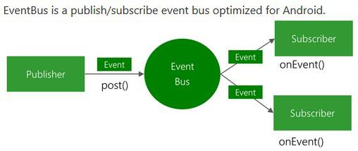

## EventBus 套件的基本用法


**《簡單介紹》**

Eventbus 是一個針對 Android 端優化的事件管理平台，它以事件驅動的方式來簡化事件傳遞的邏輯，一般 Android 開發是以callback、handler、[broadcast](https://xnfood.com.tw/android-broadcastreceiver/)、Listener 等來達到資訊傳遞效果，而透過 EventBus，我們可以將以上所有資料傳遞的方式以簡單的方法達成。

 

**《用法介紹》**

在使用 EventBus 之前，首先我們必須在 build.gradle 中加入依賴庫 –

```
apply plugin: 'com.android.application'
 
android {
    ...
 
    defaultConfig {
        ...
    }
 
    buildTypes {
        release {
        ....   
        }
    }
}
 
dependencies {
     compile 'org.greenrobot:eventbus:3.0.0'
}
```

接著設定需要透過 EventBus 傳遞的參數，我們需宣告一個自訂類別來當作參數傳遞，這邊我們宣告了一個名為 MyEvent 的自訂類別，程式碼如下 –

- **MyEvent.java**

```java
public class MyEvent {

    //此類別用來當作 EventBus 中傳遞的參數物件型別，可在這裡面定義要傳遞的資料。
    private String message;

    public String getMessage() {
        return message;
    }

    public void setMessage(String message) {
        this.message = message;
    }
}
```

第三個步驟，我們在要接收資料的地方(以 broadcast 來說，就是我們註冊識別碼的地方)，註冊 EventBus，程式碼如下 –

- **MainActivity.java**

```java
public class MainActivity extends Activity {
    private EventBus eventBus;
    private TextView textView;
 
    @Override
    protected void onCreate(Bundle savedInstanceState) {
        super.onCreate(savedInstanceState);
        setContentView(R.layout.activity_main);
        .
        .
        .
        //註冊 Eventbus
        eventBus = EventBus.getDefault();
        eventBus.register(this);
    }
 
    //Thread mode 有 ASYN, MAIN, POSTING, BACKGROUND 三種選擇，主線程才能修改UI，因此這裡選 MAIN
    //這 onEvent 方法，當有人呼叫 EventBus.getDefault().post(Object event)方法時，就會觸發，並把附帶的資料傳入
    @Subscribe(threadMode = ThreadMode.MAIN)
    public void onEvent(MyEvent event){
        textView.setText(event.getMyEventString());
    }
 
    @Override
    protected void onDestroy() {
        super.onDestroy();
        //一定要記得取消註冊釋放資源
        eventBus.unregister(this);
    }
}
```

我們在 MainActivity 中註冊了 EventBus，並定義好 onEvent(Object event) 方法，如此一來當在同一支程式其他地方呼叫 EventBus.getDefault().post(Object event) 方法時，就會觸發 onEvent(Object event)，並取得所傳遞來的參數。

其中要注意的是 onEvent(Object event) 方法有四種 Thread Mode，分別說明如下 –

**ThreadMode.MAIN :**

表示無論事件是從哪個執行緒 post 出來的，onEvent() 都會在主執行緒執行。

**ThreadMode.POSTING :**

表示事件是從哪個執行緒 post 出來的，onEvent() 就會在哪個執行緒執行。

**ThreadMode.BACKGROUND :**

表示如果事件是從主執行緒 post 出來的，onEvent() 就會創建新的子執行緒執行，如果事件是從子執行緒 post 出來的，onEvent() 就會在該子執行中緒執行。

**ThreadMode.AYSNC :**

表示無論事件是從哪個執行緒 post 出來的，onEvent() 都會創建新的子執行緒執行。

以上就是 EventBus 的基本用法，這種寫法十分方便，在同一隻程式裡幾乎可以取代所有資料之間傳遞的方式。


# Android EventBus技能點梳理


疑問：1. 現在都是Android Studio建立的專案，如何匯入這些專案（對工具不熟悉）；2. 如何得到這些開源專案的.jar包？

EventBus概念分析（獲取感性認識）：



所述publisher為釋出者，subscriber為訂閱者；Event的Publisher為事件的所有者，而各個Subscriber會收到對應的Event。

其主要功能是替代Intent、Handler、BroadCast在Fragment、Activity、Service以及執行緒之間傳遞訊息。

優點在於：開銷小（jar包小~50KB）、程式碼優雅、程式碼執行高效、經過多個APK測試...

EventBus使用基本流程：

例項分析:在EventBusActivity中點選按鍵，跳轉到ActivitySecond介面；並在上述介面中點選按鍵，跳轉到ActivityThird介面；並在上述介面中輸入使用者名稱和密碼，點選跳轉，返回到EventBusActivity中並顯示傳遞過來的使用者名稱和密碼。

```java
package com.demo;
import android.app.Activity;
import android.content.Intent;
import android.os.Bundle;
import android.view.View;
import android.widget.TextView;
import de.greenrobot.event.EventBus;
public class EventBusActivity extends Activity {
    private TextView mTextView;
    @Override
    protected void onCreate(Bundle savedInstanceState) {
        super.onCreate(savedInstanceState);
        setContentView(R.layout.activity_main);
        mTextView = (TextView) findViewById(R.id.text);
        // 判斷是否已經註冊了，避免重複註冊
        if (!EventBus.getDefault().isRegistered(this)) {
            // 註冊監聽，儘量寫在各變數初始化之後，避免造成空指標異常
            EventBus.getDefault().register(this);
        }
    }
    public void btnClick(View view) {
        startActivity(new Intent(EventBusActivity.this, ActivitySecond.class));
    }
    /**
     * <功能描述> 訂閱者接收事件
     * 
     * @param event [引數說明]
     * @return void [返回型別說明]
     */
    public void onEventMainThread(MessageEvent event) {
        if (event.getUser() != null) {
            mTextView.setText("使用者名稱:" + event.getUser().getUsername() + "; 密碼:"
                    + event.getUser().getPassword());
        }
    }
    @Override
    protected void onDestroy() {
        super.onDestroy();
        // 取消註冊需要寫在onDestory()，寫在onStop()中可能會引發異常
        EventBus.getDefault().unregister(this);
    }
}
```

ActivitySecond.java程式碼例項：

```java
package com.demo;
import android.app.Activity;
import android.content.Intent;
import android.os.Bundle;
import android.view.View;
public class ActivitySecond extends Activity {
    @Override
    protected void onCreate(Bundle savedInstanceState) {
        super.onCreate(savedInstanceState);
        setContentView(R.layout.activity_main2);
    }
    public void btnClick2(View view) {
        startActivity(new Intent(ActivitySecond.this, ActivityThird.class));
        finish();
    }
}
```

ActivityThird.java程式碼例項：

```java
package com.demo;
import android.app.Activity;
import android.os.Bundle;
import android.view.View;
import android.widget.EditText;
import de.greenrobot.event.EventBus;
public class ActivityThird extends Activity {
    private EditText mEditUsername;
    private EditText mEditPwd;
    @Override
    protected void onCreate(Bundle savedInstanceState) {
        super.onCreate(savedInstanceState);
        setContentView(R.layout.activity_main3);
        mEditUsername = (EditText) findViewById(R.id.edit_username);
        mEditPwd = (EditText) findViewById(R.id.edit_pwd);
    }
    public void btnClick3(View view) {
        String userName = mEditUsername.getText().toString().trim();
        String password = mEditPwd.getText().toString().trim();
        // 傳送訊息
        EventBus.getDefault().post(
                new MessageEvent(new User(userName, password)));
        finish();
    }
}
```

EventBus注意事項：

接收訊息時涉及到的四個方法，以及區分：

1. onEvent()：該事件在哪個執行緒釋出的，onEvent()就會在這個執行緒中執行。也就是說，釋出事件和接收事件執行緒在同一個執行緒。使用這個方法時，在onEvent()中不能執行耗時操作，如果執行耗時操作容易導致事件分發延遲。

2. onEventMainThread()：不論事件在哪個執行緒中釋出出來，onEventMainThread都會在UI執行緒中執行，接收事件都會在UI執行緒中執行。這種情況對於Android是非常有用的，因為在Android中只能在UI執行緒中更新UI，所以不能在該方法中執行耗時操作。

3. onEventBackground()：如果事件是從UI執行緒中被髮布出來，那麼onEventBackground就會在建立的子執行緒中執行，如果事件本身就是在子執行緒中釋出出來，那麼就直接在該子執行緒中執行。、

4. onEventAsync()：不論事件是在哪個執行緒中被髮布出來，都會建立新的子執行緒中執行該方法。

如果有多個地方釋出事件，有多個地方接收並處理事件，如何進行匹配和判斷？

根據上述4種接收事件的方法中涉及到的引數，並進行引數匹配；傳送訊息的引數是某一個類，接收的也必須是這個類，否則接收不到。如果有多個onEvent()的引數相同，則這些方法都將接收到這個訊息。