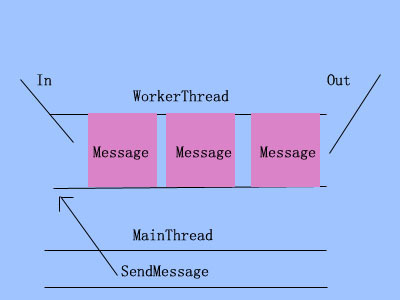

# Android 多线程编程的总结


##前言
这几天在研究Android的多线程方面的知识，阅读了许多大牛的文章，发现Android的多线程方式挺多的，关于各种方式的优缺点也都各有看法，所以这部分的知识还是很容易令人觉得混乱的，所以自己梳理了相关知识，用自己的角度去简单总结这些知识，巩固自己知识的同时也希望帮助到其他人。
首先，从两个问题入手：我们为什么需要多线程机制？什么时候需要到多线程？
答：1、因为Android官方明确声明在多线程编程时有两大原则：第一、不要阻塞UI线程（即主线程，下文两个称呼可互换）、第二、不要在UI线程之外访问UI组件。这个话题是老生常谈了，想必很多人都明白个中缘由。
2、我对多线程的使用情况归结为主要有两种情况：第一、将任务从主线程抛到工作线程，第二种情况是将任务从工作线程抛到主线程。这两种情况其实跟上面两个原则是对应的。当我们有耗时的任务，如果在UI线程中执行，那就会阻塞UI线程了，必须要抛到工作线程中去执行；而当我们要更新UI组件时，就一定得在UI线程里执行了，所以就得把在工作线程中执行的任务结果返回到UI线程中去更新组件了。

## 一、将任务从工作线程抛到主线程

```java
protected void onCreate(Bundle savedInstanceState) {
    super.onCreate(savedInstanceState);
    setContentView(R.layout.activity_main);
    button = (Button) findViewById(R.id.button);
    text = (TextView) findViewById(R.id.text);//耗时任务完成时在该TextView上显示文本

    mRunnable = new Runnable() {
        @Override
        public void run() {
            try {
                Thread.sleep(5000);//模拟耗时任务
            } catch (InterruptedException e) {
                e.printStackTrace();
            }
            text.setText("Task Done!!");//在非UI线程之外去访问UI组件
        }
    };

    button.setOnClickListener(new View.OnClickListener() {
        @Override
        public void onClick(View v) {
            Thread thread = new Thread(mRunnable);
            thread.start();
        }
    });

}
```
布局上只定义了一个Button和TextView,Button按下时会开启一个新线程执行耗时任务，任务完成后更新TextView的文本。有点基础的都能明白这段代码是有问题的，因为它在非UI线程之外去访问UI组件了。
那这个时候就得想办法让text.setText("Task Done!!");这句代码抛到UI线程中去执行了。对此，我们大概有四种方法，下面分别演示。
有如下5种方式


### 1、Handler.sendXXXMessage()等方法
首先是在上面的Activity中定义一个Handler

```java
Handler mHandler = new Handler() {
    @Override
    public void handleMessage(Message msg) {
        if(msg.what == 0x123) {
            text.setText("Task Done!!");
        }
    }
};
```

然后将工作线程的代码改为下面的样子

```java
mRunnable = new Runnable() {
    @Override
    public void run() {
        try {
            Thread.sleep(5000);//模拟耗时任务
        } catch (InterruptedException e) {
            e.printStackTrace();
        }
        mHandler.sendEmptyMessage(0x123);//关于发消息的方法有很多,比如sendMessage(Message msg),sendMessageDelayed(Message msg, long delayMills)等等，可按具体需求选择，这里不作扩展

    }
};
```

这样程序运行起来后就不会报错了。
关于Handler的底层机制网上有非常多文章作了详细的描述，比如有张鸿洋的Android 异步消息处理机制 让你深入理解
Looper、Handler、Message三者关系，这里也小小地提一下，为后面的内容做一些必要的铺垫。

一个线程只有一个Looper, 而一个Looper持有一个MessageQueue, 当调用Looper.prepare()时，Looper就与当前线程关联起来了(在Activity里没有显示调用Looper.prepare()是因为系统自动在主线程里帮我们调用了)，而Handler是与Looper的线程是绑定的，查看Handler类的源码可以发现它几个构造函数，其中有接收一个Looper参数的，也有不接收Looper参数的，从上面的代码上看，我们没有为Handler指定Looper，那么Handler就默认更当前线程（即主线程）的Looper关联起来了，之所以啰嗦那么多就是因为这决定了Handler.handlerMessage(msg)方法体里的代码到底在哪个线程里执行，我们再梳理一下，Looper.prepare调用决定了Looper与哪个线程关联，间接决定了与这个Looper相关联的Handler.handlerMessage(msg)方法体里的代码执行的线程。（太啰嗦了）
现在回到上面的代码，我们的Handler是在主线程里的定义的，所以也默认跟主线程的Looper相关联，即handlerMessage方法的代码会在UI线程执行，因此更新TextView就不会报错了。下面这张图是弄清handlerMessage(msg)方法体里的代码的执行线程的思路


###2、Handler.post(Runnable)
只要将上面代码中的

```java
mHandler.sendEmptyMessage(0x123);  
```
改成

```java
mHandler.post(new Runnable() {
    @Override
    public void run() {
        text.setText("Task Done!!");
    }
});
```

就可以了，可能有人看到new了一个Runnable就以为是又开了一个新线程，事实上并没有开启任何新线程，只是使run()方法体的代码抛到与mHandler相关联的线程中执行，经过上面的分析我们也知道mHandler是与主线程关联的，所以更新TextView组件依然发生在主线程了。


###3、Activity.runOnUIThread(Runnable)
将上面的代码改成

```java
runOnUiThread(new Runnable() {
    @Override
    public void run() {
        text.setText("Task Done!!");
    }
});
```
这个看起来跟上面的方法很像，差别就是这种方法不需要去定义Handler。

###4、View.post(Runnable)

将上面的代码改为

```java
text.post(new Runnable() {  
    @Override  
    public void run() {  
        text.setText("Task Done!!");  
    }  
});  
```

这个看起来依旧是跟上面的方法很像,依然不用定义Handler。


###5、AsyncTask
这种方法要改动上面整个开新线程的代码，具体代码在入门书籍上基本都有，这里就不附上了，思路就是在doInBackground(Params…) 方法里执行耗时逻辑，然后在onPostExecute(Result) 中将结果更新回UI组件。

使用哪种大多数情况我还是根据代码风格和习惯来决定，上面这5种方法具体在效率上是否有巨大差异，我没有深入研究，这方面有研究的兄弟希望可以在留言里交流一下

## 二、将任务从主线程抛到工作线程

正如前言所说，耗时任务不能在主线程去进行，需要另外开一个线程。分别有下面几种方法：

###1、Thread、Runnable
这个是最传统的方法了，相信每个学过Java基础的人都知道。无非就是继承Thread类覆写run()然后通过thread.start()或实现Runnable接口复写run()然后New Thread(Runnable).start()，在上面的例子中就是通过这种最普通的方法去开新线程的，不过在实际开发中，这种开新线程的方法是很不被推荐的，理由如下：1）当你有多个耗时任务时就会开多个新线程，开启新线程的以及调度多个线程的开销是非常大的，这往往会带来严重的性能问题，例如，你有100个耗时任务，那就开100个线程。2）如果在线程中执行循环任务，只能通过一个Flag来控制它的停止，如while(!iscancel){//耗时任务}。

###2、HandlerThread
在正式介绍HandlerThread前，我们先来看看以下代码：

```java
protected void onCreate(Bundle savedInstanceState) {
    super.onCreate(savedInstanceState);
    setContentView(R.layout.activity_main);
    button = (Button) findViewById(R.id.button);
    button.setOnClickListener(new View.OnClickListener() {
        @Override
        public void onClick(View v) {
            mOtherHandler.sendEmptyMessage(0x124);
        }
    });
    new Thread(new Runnable() {
        @Override
        public void run() {
            Looper.prepare();//在新线程中调用
            mOtherHandler = new Handler() { //默认关联新线程的Looper
                @Override
                public void handleMessage(Message msg) {

                    if (msg.what == 0x124) {
                        try {
                            Log.d("HandlerThread", Thread.currentThread().getName());//打印线程名
                            Thread.sleep(5000);//模拟耗时逻辑
                        } catch (InterruptedException e) {
                            e.printStackTrace();
                        }
                    }

                }
            };
            Looper.loop();
        }
    }).start();
}
```

可以看到这里用的是第一种方法开启新线程的，但是在新线程里初始化了Looper(因为不是在主线程，所以要我们自己调用Looper.prepare()和loop()),还定义了一个Handler ,前面我之所以那么啰嗦，就是为了让你明白:这个Handler的handlerMessage(msg)方法体的代码是在新线程（工作线程）中执行的，而不是主线程（忘了的话拉回去看前面的内容），所以我们只需要在Button的点击事件中调用sendXXXMessage就可以让耗时任务在新线程中执行了。

有意思的是，如果我们以非常快的速度连续点击两次Button,你会发现打印出来的两条Log是以间隔5秒相继出现的。这是因为每点一次按钮并没有开启都开启一个新线程，而只是发送了一条消息，我们在onCreate()里就已经把一个新线程开好了，然后调用Looper.loop()使这个线程一直处于循环状态了，而我们每发一条消息，消息都会在MessageQueue里排队。总而言之，不管我们点多少次按钮，都只有一个工作线程，多个耗时任务在这个工作线程的队列中排队处理。思路如下图




铺垫了这么多，可以把HandlerThread拉出来了，查看源码，你会发现HandlerThread也是Thread的子类，那岂不是还是跟第一种方法一样，说是也是，说不是也不是。其实呢，HandlerThread就是对上面的代码的一种封装，我们来看看它是怎么用的


```java
handlerThread = new HandlerThread("MyNewThread");//自定义线程名称
handlerThread.start();
mOtherHandler = new Handler(handlerThread.getLooper()) {
    @Override
    public void handleMessage(Message msg) {

        if (msg.what == 0x124) {
            try {
                Log.d("HandlerThread", Thread.currentThread().getName());
                Thread.sleep(5000);//模拟耗时任务
            } catch (InterruptedException e) {
                e.printStackTrace();
            }
        }

    }
};
```

这段代码跟前面那一段代码是完全等价的，HandlerThread的好处是代码看起来没前面的版本那么乱，相对简洁一点。还有一个好处就是通过handlerThread.quit()或者quitSafely()使线程结束自己的生命周期。

可能有人问了，那用以上方式执行完耗时任务后怎么更新UI组件了，很简单，完全照着面前所说的将任务从工作线程抛到主线程的五种方法去做就可以了。

可能又有人问了，那mOtherHandler.post(new Runnable())里的Runnable在哪个线程运行，还是工作线程，只不过这样就避开了handlerMessage的步骤而已，跟前面的分析还是一样的原理的。

##3、AsyncTask
没错，又是它。具体的使用代码就不贴上来了，到处都有。但值得一说的是，上面说过HandlerThread只开一条线程，任务都被阻塞在一个队列中，那么就会使阻塞的任务延迟了，而AsyncTask开启线程的方法asyncTask.execute()默认是也是开启一个线程和一个队列的，不过也可以通过asyncTask.executeOnExecutor(AsyncTask.THREAD_POOL_EXECUTOR, 0)开启一个含有5个新线程的线程池，也就是说有个5个队列了，假如说你执行第6个耗时任务时，除非前面5个都还没执行完，否则任务是不会阻塞的，这样就可以大大减少耗时任务延迟的可能性，这也是它的优点所在，当你想多个耗时任务并发的执行，那你更应该选择AsyncTask。

##4、IntentService
最后再小小地提一下IntentService，相信很多人也不陌生，它是Service的子类，用法跟Service也差不多，就是实现的方法名字不一样，耗时逻辑应放在onHandleIntent(Intent intent)的方法体里，它同样有着退出启动它的Activity后不会被系统杀死的特点，而且当任务执行完后会自动停止，无须手动去终止它。例如在APP里我们要实现一个下载功能，当退出页面后下载不会被中断，那么这时候IntentService就是一个不错的选择了。

笔者写技术文章经验很少，如有纰漏错误，欢迎指正交流！

