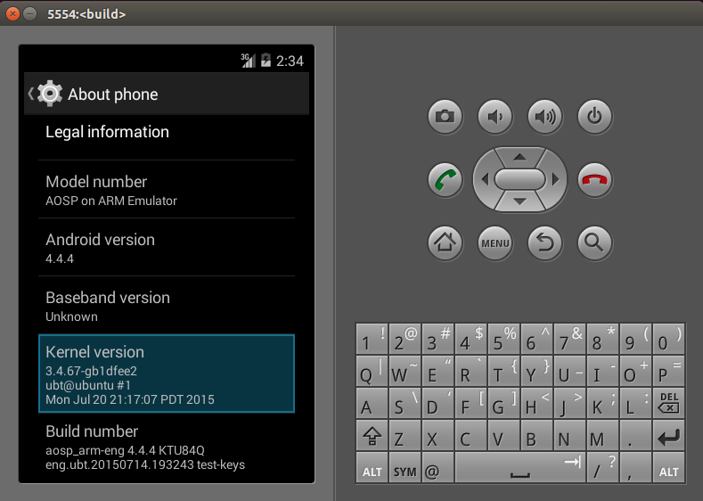

# [轉]如何下載編譯Android goldfish(Kernel)

Ref : http://coolfish.me/blog/detail/44


參考資料

[[google官方資料]](https://source.android.com/source/building-kernels.html) 官方是最權威的，但會有細節缺失。

[[如何下載編譯android內核] ](http://www.cnblogs.com/zhx831/p/3551181.html)可以參考別人的動手實踐，彌補缺失的細節。

第一步：先看看AOSP中自帶的kernel是什麼版本：
```
cd prebuilts/qemu-kernel/arm/

dd if=kernel-qemu bs=1 skip=$(LC_ALL=C grep -a -b -o $'\x1f\x8b\x08\x00\x00\x00\x00\x00' kernel-qemu | cut -d ':' -f 1) | zgrep -a 'Linux version'
```

結果為：
```
kernel-qemu | cut -d ':' -f 1) | zgrep -a 'Linux version'
Linux version 3.4.67-01422-gd3ffcc7-dirty (digit@tyrion.par.corp.google.com) (gcc version 4.8 (GCC) ) #2 PREEMPT Tue Sep 16 19:38:10 CEST 2014
2309433+0 records in
2309433+0 records out
2309433 bytes (2.3 MB) copied, 1.96164 s, 1.2 MB/s

```

和那篇文章裡的一模一樣，說明是同一次編譯出來的內核。上一篇文章的模擬器運行截圖中也看到是這個內核信息。


第二步：下載kernel源碼

上面確定linux是3.4.0的，那就用這個版本吧，在官方文檔中，有各種版本的內核源碼，其中提到：
```
The goldfish project contains the kernel sources for the emulated platforms.
```
正好我現在只是使用模擬器，那就選擇goldfish好了：

```
mkdir kernel                   //此時在android源碼根目錄
cd kernel
git clone https://android.googlesource.com/kernel/goldfish.git  //這裡要等一段時間
cd goldfish
git branch -a
git checkout remotes/origin/android-goldfish-3.4
```

第三步：配置環境並編譯
```
export PATH=~/AOSP/android-4.4.4_r2/prebuilts/gcc/linux-x86/arm/arm-eabi-4.6/bin/:$PATH
export ARCH=arm
export SUBARCH=arm
export CROSS_COMPILE=arm-eabi-
make goldfish_armv7_defconfig
make
```
最後輸出：
```
LD      arch/arm/boot/compressed/vmlinux
OBJCOPY arch/arm/boot/zImage
Kernel: arch/arm/boot/zImage is ready
```
編譯成功，內核文件zImage在kernel/goldfish/arch/arm/boot下。

查看編譯的內核信息：

```
cd kernel/goldfish/arch/arm/boot

dd if=zImage bs=1 skip=$(LC_ALL=C grep -a -b -o $'\x1f\x8b\x08\x00\x00\x00\x00\x00' zImage | cut -d ':' -f 1) | zgrep -a 'Linux version'
```
輸出為：
```
Linux version 3.4.67-gb1dfee2 (ubt@ubuntu) (gcc version 4.6.x-google 20120106 (prerelease) (GCC) ) #1 PREEMPT Mon Jul 20 21:17:07 PDT 2015
2385045+0 records in
2385045+0 records out
2385045 bytes (2.4 MB) copied, 4.07455 s, 585 kB/s
```
對比上面自帶的kernel信息可看出差異。


讓模擬器使用新編譯出來的內核
```
emulator -kernel ~/AOSP/android-4.4.4_r2/kernel/goldfish/arch/arm/boot/zImage
```
運行結果：



接下來就是在源碼中加入自己的代碼，再編譯再運行了。

