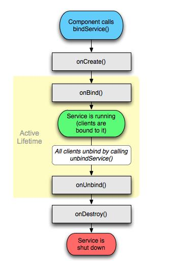
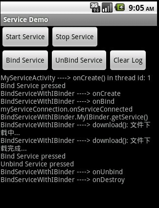

# Android Service 之三(Bind Service, 繼承自 Binder 類)

    
&nbsp;之前提及過，啟動Service有兩種方式：startService 與 bindService。前者已經說過如何使用，所以，這篇貼子主要是關於 bind service的。 這裡所討論的是僅針對那些被綁定的service的，而那些既被startService() 又被 bindService() 的 service 不在此範圍內。

① Bind Service就像是C/S架構中的服務端，其他組件（比如 Activity）綁定到它（通過 bindService()），可以向它發送請求，可以接受從它返回的響應，它甚至還提供了進程間通信（IPC）功能。

② 一個service要想能夠被其他組件綁定，那麼它的 onBind() 方法必須被實現，且必須返回一個 IBinder 對象，然後其他組件可以通過這個 IBinder 對象與該 service 進行通訊。

③ 多個client可以綁定至同一個service，但該 service 的onBind() 方法只會在第一個 client 綁定至其的時候被調用，當其他 client 再次綁定到它的時候，並不會調用&nbsp; onBind() 方法，而是直接返回第一次被調用時產生的那個 IBinder 對象。也就是說，在其生命週期內，onBind() 只會被調用一次。

④ Bind Service 的生命週期如下圖所示:

  &nbsp;

⑤ Bind Service 不會在後臺無限期的一直運行，而是當所有綁定至其的組件都調用了 unbindService() 進行解綁之後，系統就會將其停掉以回收資源。

&nbsp;

⑥ 當我們要實現一個 Bind Service 的時候，最重要的就是實現它的 onBind() 方法以返回一個 IBinder 對象

&nbsp;

要生成一個 Bound Service ，共有三種方式：繼承自 Binder 類，使用 Messenger ，使用 AIDL。下面且聽小生一一道來。

<strong>第一種：繼承自 Binder 類</strong>

需要注意的是，這種方式僅僅適用於這種場合：service 與 application 在同一個進程中。這種場合也是最最常見的。

它分以下幾個步驟：

a. 在你的 service 類中聲明一個內部類來繼承 Binder 類。在該內部類中，最好提供一個公共方法來返回你的 service 實例。

b. 在你的 service 類中需要聲明一個這個內部類的實例，以供在 onBind() 方法中返回

c.&nbsp;在 client 端，在 onServiceConnected() 方法中得到從 onBind() 方法中返回的 IBinder 對象，然後可以通過該 對象中的公共方法得到相應的 service 實例，正如 第一個步驟 所說的那樣。

d. 在 service 中提供公共方法， 這樣就可以在組件（如 Activity 中調用這些公共方法了）

&nbsp;

下面給出一例：

service 代碼

Java代碼 <embed wmode="transparent" src="/javascripts/syntaxhighlighter/clipboard_new.swf" width="14" height="15" flashvars="clipboard=public%20class%20BindServiceWithIBinder%20extends%20Service%20%7B%0A%0A%09private%20static%20final%20String%20TAG%20%3D%20%22BindServiceWithIBinder%22%3B%0A%0A%09private%20final%20MyIBinder%20myIBinder%20%3D%20new%20MyIBinder()%3B%0A%0A%09%2F**%0A%09%20*%20bindService()%20%E6%97%B6%EF%BC%8C%E8%B0%83%E7%94%A8%E7%9A%84%E6%98%AF%E8%BF%99%E4%B8%AA%E6%96%B9%E6%B3%95%EF%BC%8C%E8%80%8C%E9%9D%9E%20onStartCommnad()%20%E6%96%B9%E6%B3%95%0A%09%20*%2F%0A%09%40Override%0A%09public%20IBinder%20onBind(Intent%20intent)%20%7B%0A%09%09%2F%2F%20%E5%9C%A8%E4%B8%BB%20Activity%20%E4%B8%8A%E7%9A%84%20TextView%20%E4%B8%AD%E6%89%93%E5%8D%B0%E5%87%BA%E4%B8%80%E8%A1%8CLOG%0A%09%09MyServiceActivity.vh.sendMessage(MyServiceActivity.createMessage(%0A%09%09%09%09MyServiceActivity.UPDATE_VIEW%2C%20TAG%20%2B%20%22%20----%3E%20onBind%22))%3B%0A%09%09return%20myIBinder%3B%0A%09%7D%0A%0A%09%40Override%0A%09public%20void%20onCreate()%20%7B%0A%09%09MyServiceActivity.vh.sendMessage(MyServiceActivity.createMessage(%0A%09%09%09%09MyServiceActivity.UPDATE_VIEW%2C%20TAG%20%2B%20%22%20----%3E%20onCreate%22))%3B%0A%09%7D%0A%0A%09%40Override%0A%09public%20void%20onDestroy()%20%7B%0A%09%09MyServiceActivity.vh.sendMessage(MyServiceActivity.createMessage(%0A%09%09%09%09MyServiceActivity.UPDATE_VIEW%2C%20TAG%20%2B%20%22%20----%3E%20onDestroy%22))%3B%0A%09%7D%0A%0A%09%40Override%0A%09public%20void%20onRebind(Intent%20intent)%20%7B%0A%09%09MyServiceActivity.vh.sendMessage(MyServiceActivity.createMessage(%0A%09%09%09%09MyServiceActivity.UPDATE_VIEW%2C%20TAG%20%2B%20%22%20----%3E%20onRebind%22))%3B%0A%09%7D%0A%0A%09%40Override%0A%09public%20int%20onStartCommand(Intent%20intent%2C%20int%20flags%2C%20int%20startId)%20%7B%0A%09%09MyServiceActivity.vh.sendMessage(MyServiceActivity.createMessage(%0A%09%09%09%09MyServiceActivity.UPDATE_VIEW%2C%20TAG%20%2B%20%22%20----%3E%20onStartCommand%22))%3B%0A%09%09return%20START_STICKY%3B%0A%09%7D%0A%0A%09%40Override%0A%09public%20boolean%20onUnbind(Intent%20intent)%20%7B%0A%09%09MyServiceActivity.vh.sendMessage(MyServiceActivity.createMessage(%0A%09%09%09%09MyServiceActivity.UPDATE_VIEW%2C%20TAG%20%2B%20%22%20----%3E%20onUnbind%22))%3B%0A%09%09return%20super.onUnbind(intent)%3B%0A%09%7D%0A%0A%09%2F**%0A%09%20*%20%E5%A3%B0%E6%98%8E%E4%B8%80%E4%B8%AA%20Binder%20%E7%B1%BB%E7%9A%84%E5%AE%9E%E7%8E%B0%E7%B1%BB%EF%BC%8C%E4%BE%9B%E5%9C%A8%20onBind()%20%E6%96%B9%E6%B3%95%E4%B8%AD%E8%BF%94%E5%9B%9E%E8%AF%A5%E7%B1%BB%E7%9A%84%E4%B8%80%E4%B8%AA%E5%AE%9E%E4%BE%8B%0A%09%20*%20%40author%20001718%0A%09%20*%0A%09%20*%2F%0A%09public%20class%20MyIBinder%20extends%20Binder%20%7B%0A%09%09public%20Service%20getService()%20%7B%0A%09%09%09MyServiceActivity.vh.sendMessage(MyServiceActivity.createMessage(%0A%09%09%09%09%09MyServiceActivity.UPDATE_VIEW%2C%0A%09%09%09%09%09%22BindServiceWithIBinder.MyIBinder.getService()%22))%3B%0A%09%09%09return%20BindServiceWithIBinder.this%3B%0A%09%09%7D%0A%09%7D%0A%0A%09%2F**%0A%09%20*%20service%20%E6%8F%90%E4%BE%9B%E7%9A%84%E5%85%AC%E5%85%B1%E6%96%B9%E6%B3%95%EF%BC%8C%E5%9C%A8activity%E4%B8%AD%E5%8F%AF%E4%BB%A5%E8%B0%83%E7%94%A8%0A%09%20*%2F%0A%09public%20void%20download()%20%7B%0A%09%09try%20%7B%0A%09%09%09MyServiceActivity.vh.sendMessage(MyServiceActivity.createMessage(%0A%09%09%09%09%09MyServiceActivity.UPDATE_VIEW%2C%20TAG%0A%09%09%09%09%09%09%09%2B%20%22%20----%3E%20download()%3A%20%E6%96%87%E4%BB%B6%E4%B8%8B%E8%BD%BD%E4%B8%AD...%22))%3B%0A%09%09%09Thread.sleep(3000)%3B%0A%09%09%09MyServiceActivity.vh.sendMessage(MyServiceActivity.createMessage(%0A%09%09%09%09%09MyServiceActivity.UPDATE_VIEW%2C%20TAG%0A%09%09%09%09%09%09%09%2B%20%22%20----%3E%20download()%3A%20%E6%96%87%E4%BB%B6%E4%B8%8B%E8%BD%BD%E5%AE%8C%E6%88%90...%22))%3B%0A%09%09%7D%20catch%20(InterruptedException%20e)%20%7B%0A%09%09%09e.printStackTrace()%3B%0A%09%09%7D%0A%09%7D%0A%7D" quality="high" allowscriptaccess="always" type="application/x-shockwave-flash" pluginspage="http://www.macromedia.com/go/getflashplayer">&nbsp;

<ol start="1" class="dp-j"><li>public&nbsp;class&nbsp;BindServiceWithIBinder&nbsp;extends&nbsp;Service&nbsp;{&nbsp;&nbsp;</li><li>&nbsp;&nbsp;</li><li>&nbsp;&nbsp;&nbsp;&nbsp;private&nbsp;static&nbsp;final&nbsp;String&nbsp;TAG&nbsp;=&nbsp;"BindServiceWithIBinder";&nbsp;&nbsp;</li><li>&nbsp;&nbsp;</li><li>&nbsp;&nbsp;&nbsp;&nbsp;private&nbsp;final&nbsp;MyIBinder&nbsp;myIBinder&nbsp;=&nbsp;new&nbsp;MyIBinder();&nbsp;&nbsp;</li><li>&nbsp;&nbsp;</li><li>&nbsp;&nbsp;&nbsp;&nbsp;/**&nbsp;</li><li>&nbsp;&nbsp;&nbsp;&nbsp;&nbsp;*&nbsp;bindService()&nbsp;時，調用的是這個方法，而非&nbsp;onStartCommnad()&nbsp;方法&nbsp;</li><li>&nbsp;&nbsp;&nbsp;&nbsp;&nbsp;*/&nbsp;&nbsp;</li><li>&nbsp;&nbsp;&nbsp;&nbsp;@Override&nbsp;&nbsp;</li><li>&nbsp;&nbsp;&nbsp;&nbsp;public&nbsp;IBinder&nbsp;onBind(Intent&nbsp;intent)&nbsp;{&nbsp;&nbsp;</li><li>&nbsp;&nbsp;&nbsp;&nbsp;&nbsp;&nbsp;&nbsp;&nbsp;//&nbsp;在主&nbsp;Activity&nbsp;上的&nbsp;TextView&nbsp;中打印出一行LOG&nbsp;&nbsp;</li><li>&nbsp;&nbsp;&nbsp;&nbsp;&nbsp;&nbsp;&nbsp;&nbsp;MyServiceActivity.vh.sendMessage(MyServiceActivity.createMessage(&nbsp;&nbsp;</li><li>&nbsp;&nbsp;&nbsp;&nbsp;&nbsp;&nbsp;&nbsp;&nbsp;&nbsp;&nbsp;&nbsp;&nbsp;&nbsp;&nbsp;&nbsp;&nbsp;MyServiceActivity.UPDATE_VIEW,&nbsp;TAG&nbsp;+&nbsp;"&nbsp;----&gt;&nbsp;onBind"));&nbsp;&nbsp;</li><li>&nbsp;&nbsp;&nbsp;&nbsp;&nbsp;&nbsp;&nbsp;&nbsp;return&nbsp;myIBinder;&nbsp;&nbsp;</li><li>&nbsp;&nbsp;&nbsp;&nbsp;}&nbsp;&nbsp;</li><li>&nbsp;&nbsp;</li><li>&nbsp;&nbsp;&nbsp;&nbsp;@Override&nbsp;&nbsp;</li><li>&nbsp;&nbsp;&nbsp;&nbsp;public&nbsp;void&nbsp;onCreate()&nbsp;{&nbsp;&nbsp;</li><li>&nbsp;&nbsp;&nbsp;&nbsp;&nbsp;&nbsp;&nbsp;&nbsp;MyServiceActivity.vh.sendMessage(MyServiceActivity.createMessage(&nbsp;&nbsp;</li><li>&nbsp;&nbsp;&nbsp;&nbsp;&nbsp;&nbsp;&nbsp;&nbsp;&nbsp;&nbsp;&nbsp;&nbsp;&nbsp;&nbsp;&nbsp;&nbsp;MyServiceActivity.UPDATE_VIEW,&nbsp;TAG&nbsp;+&nbsp;"&nbsp;----&gt;&nbsp;onCreate"));&nbsp;&nbsp;</li><li>&nbsp;&nbsp;&nbsp;&nbsp;}&nbsp;&nbsp;</li><li>&nbsp;&nbsp;</li><li>&nbsp;&nbsp;&nbsp;&nbsp;@Override&nbsp;&nbsp;</li><li>&nbsp;&nbsp;&nbsp;&nbsp;public&nbsp;void&nbsp;onDestroy()&nbsp;{&nbsp;&nbsp;</li><li>&nbsp;&nbsp;&nbsp;&nbsp;&nbsp;&nbsp;&nbsp;&nbsp;MyServiceActivity.vh.sendMessage(MyServiceActivity.createMessage(&nbsp;&nbsp;</li><li>&nbsp;&nbsp;&nbsp;&nbsp;&nbsp;&nbsp;&nbsp;&nbsp;&nbsp;&nbsp;&nbsp;&nbsp;&nbsp;&nbsp;&nbsp;&nbsp;MyServiceActivity.UPDATE_VIEW,&nbsp;TAG&nbsp;+&nbsp;"&nbsp;----&gt;&nbsp;onDestroy"));&nbsp;&nbsp;</li><li>&nbsp;&nbsp;&nbsp;&nbsp;}&nbsp;&nbsp;</li><li>&nbsp;&nbsp;</li><li>&nbsp;&nbsp;&nbsp;&nbsp;@Override&nbsp;&nbsp;</li><li>&nbsp;&nbsp;&nbsp;&nbsp;public&nbsp;void&nbsp;onRebind(Intent&nbsp;intent)&nbsp;{&nbsp;&nbsp;</li><li>&nbsp;&nbsp;&nbsp;&nbsp;&nbsp;&nbsp;&nbsp;&nbsp;MyServiceActivity.vh.sendMessage(MyServiceActivity.createMessage(&nbsp;&nbsp;</li><li>&nbsp;&nbsp;&nbsp;&nbsp;&nbsp;&nbsp;&nbsp;&nbsp;&nbsp;&nbsp;&nbsp;&nbsp;&nbsp;&nbsp;&nbsp;&nbsp;MyServiceActivity.UPDATE_VIEW,&nbsp;TAG&nbsp;+&nbsp;"&nbsp;----&gt;&nbsp;onRebind"));&nbsp;&nbsp;</li><li>&nbsp;&nbsp;&nbsp;&nbsp;}&nbsp;&nbsp;</li><li>&nbsp;&nbsp;</li><li>&nbsp;&nbsp;&nbsp;&nbsp;@Override&nbsp;&nbsp;</li><li>&nbsp;&nbsp;&nbsp;&nbsp;public&nbsp;int&nbsp;onStartCommand(Intent&nbsp;intent,&nbsp;int&nbsp;flags,&nbsp;int&nbsp;startId)&nbsp;{&nbsp;&nbsp;</li><li>&nbsp;&nbsp;&nbsp;&nbsp;&nbsp;&nbsp;&nbsp;&nbsp;MyServiceActivity.vh.sendMessage(MyServiceActivity.createMessage(&nbsp;&nbsp;</li><li>&nbsp;&nbsp;&nbsp;&nbsp;&nbsp;&nbsp;&nbsp;&nbsp;&nbsp;&nbsp;&nbsp;&nbsp;&nbsp;&nbsp;&nbsp;&nbsp;MyServiceActivity.UPDATE_VIEW,&nbsp;TAG&nbsp;+&nbsp;"&nbsp;----&gt;&nbsp;onStartCommand"));&nbsp;&nbsp;</li><li>&nbsp;&nbsp;&nbsp;&nbsp;&nbsp;&nbsp;&nbsp;&nbsp;return&nbsp;START_STICKY;&nbsp;&nbsp;</li><li>&nbsp;&nbsp;&nbsp;&nbsp;}&nbsp;&nbsp;</li><li>&nbsp;&nbsp;</li><li>&nbsp;&nbsp;&nbsp;&nbsp;@Override&nbsp;&nbsp;</li><li>&nbsp;&nbsp;&nbsp;&nbsp;public&nbsp;boolean&nbsp;onUnbind(Intent&nbsp;intent)&nbsp;{&nbsp;&nbsp;</li><li>&nbsp;&nbsp;&nbsp;&nbsp;&nbsp;&nbsp;&nbsp;&nbsp;MyServiceActivity.vh.sendMessage(MyServiceActivity.createMessage(&nbsp;&nbsp;</li><li>&nbsp;&nbsp;&nbsp;&nbsp;&nbsp;&nbsp;&nbsp;&nbsp;&nbsp;&nbsp;&nbsp;&nbsp;&nbsp;&nbsp;&nbsp;&nbsp;MyServiceActivity.UPDATE_VIEW,&nbsp;TAG&nbsp;+&nbsp;"&nbsp;----&gt;&nbsp;onUnbind"));&nbsp;&nbsp;</li><li>&nbsp;&nbsp;&nbsp;&nbsp;&nbsp;&nbsp;&nbsp;&nbsp;return&nbsp;super.onUnbind(intent);&nbsp;&nbsp;</li><li>&nbsp;&nbsp;&nbsp;&nbsp;}&nbsp;&nbsp;</li><li>&nbsp;&nbsp;</li><li>&nbsp;&nbsp;&nbsp;&nbsp;/**&nbsp;</li><li>&nbsp;&nbsp;&nbsp;&nbsp;&nbsp;*&nbsp;聲明一個&nbsp;Binder&nbsp;類的實現類，供在&nbsp;onBind()&nbsp;方法中返回該類的一個實例&nbsp;</li><li>&nbsp;&nbsp;&nbsp;&nbsp;&nbsp;*&nbsp;@author&nbsp;001718&nbsp;</li><li>&nbsp;&nbsp;&nbsp;&nbsp;&nbsp;*&nbsp;</li><li>&nbsp;&nbsp;&nbsp;&nbsp;&nbsp;*/&nbsp;&nbsp;</li><li>&nbsp;&nbsp;&nbsp;&nbsp;public&nbsp;class&nbsp;MyIBinder&nbsp;extends&nbsp;Binder&nbsp;{&nbsp;&nbsp;</li><li>&nbsp;&nbsp;&nbsp;&nbsp;&nbsp;&nbsp;&nbsp;&nbsp;public&nbsp;Service&nbsp;getService()&nbsp;{&nbsp;&nbsp;</li><li>&nbsp;&nbsp;&nbsp;&nbsp;&nbsp;&nbsp;&nbsp;&nbsp;&nbsp;&nbsp;&nbsp;&nbsp;MyServiceActivity.vh.sendMessage(MyServiceActivity.createMessage(&nbsp;&nbsp;</li><li>&nbsp;&nbsp;&nbsp;&nbsp;&nbsp;&nbsp;&nbsp;&nbsp;&nbsp;&nbsp;&nbsp;&nbsp;&nbsp;&nbsp;&nbsp;&nbsp;&nbsp;&nbsp;&nbsp;&nbsp;MyServiceActivity.UPDATE_VIEW,&nbsp;&nbsp;</li><li>&nbsp;&nbsp;&nbsp;&nbsp;&nbsp;&nbsp;&nbsp;&nbsp;&nbsp;&nbsp;&nbsp;&nbsp;&nbsp;&nbsp;&nbsp;&nbsp;&nbsp;&nbsp;&nbsp;&nbsp;"BindServiceWithIBinder.MyIBinder.getService()"));&nbsp;&nbsp;</li><li>&nbsp;&nbsp;&nbsp;&nbsp;&nbsp;&nbsp;&nbsp;&nbsp;&nbsp;&nbsp;&nbsp;&nbsp;return&nbsp;BindServiceWithIBinder.this;&nbsp;&nbsp;</li><li>&nbsp;&nbsp;&nbsp;&nbsp;&nbsp;&nbsp;&nbsp;&nbsp;}&nbsp;&nbsp;</li><li>&nbsp;&nbsp;&nbsp;&nbsp;}&nbsp;&nbsp;</li><li>&nbsp;&nbsp;</li><li>&nbsp;&nbsp;&nbsp;&nbsp;/**&nbsp;</li><li>&nbsp;&nbsp;&nbsp;&nbsp;&nbsp;*&nbsp;service&nbsp;提供的公共方法，在activity中可以調用&nbsp;</li><li>&nbsp;&nbsp;&nbsp;&nbsp;&nbsp;*/&nbsp;&nbsp;</li><li>&nbsp;&nbsp;&nbsp;&nbsp;public&nbsp;void&nbsp;download()&nbsp;{&nbsp;&nbsp;</li><li>&nbsp;&nbsp;&nbsp;&nbsp;&nbsp;&nbsp;&nbsp;&nbsp;try&nbsp;{&nbsp;&nbsp;</li><li>&nbsp;&nbsp;&nbsp;&nbsp;&nbsp;&nbsp;&nbsp;&nbsp;&nbsp;&nbsp;&nbsp;&nbsp;MyServiceActivity.vh.sendMessage(MyServiceActivity.createMessage(&nbsp;&nbsp;</li><li>&nbsp;&nbsp;&nbsp;&nbsp;&nbsp;&nbsp;&nbsp;&nbsp;&nbsp;&nbsp;&nbsp;&nbsp;&nbsp;&nbsp;&nbsp;&nbsp;&nbsp;&nbsp;&nbsp;&nbsp;MyServiceActivity.UPDATE_VIEW,&nbsp;TAG&nbsp;&nbsp;</li><li>&nbsp;&nbsp;&nbsp;&nbsp;&nbsp;&nbsp;&nbsp;&nbsp;&nbsp;&nbsp;&nbsp;&nbsp;&nbsp;&nbsp;&nbsp;&nbsp;&nbsp;&nbsp;&nbsp;&nbsp;&nbsp;&nbsp;&nbsp;&nbsp;&nbsp;&nbsp;&nbsp;&nbsp;+&nbsp;"&nbsp;----&gt;&nbsp;download():&nbsp;文件下載中..."));&nbsp;&nbsp;</li><li>&nbsp;&nbsp;&nbsp;&nbsp;&nbsp;&nbsp;&nbsp;&nbsp;&nbsp;&nbsp;&nbsp;&nbsp;Thread.sleep(3000);&nbsp;&nbsp;</li><li>&nbsp;&nbsp;&nbsp;&nbsp;&nbsp;&nbsp;&nbsp;&nbsp;&nbsp;&nbsp;&nbsp;&nbsp;MyServiceActivity.vh.sendMessage(MyServiceActivity.createMessage(&nbsp;&nbsp;</li><li>&nbsp;&nbsp;&nbsp;&nbsp;&nbsp;&nbsp;&nbsp;&nbsp;&nbsp;&nbsp;&nbsp;&nbsp;&nbsp;&nbsp;&nbsp;&nbsp;&nbsp;&nbsp;&nbsp;&nbsp;MyServiceActivity.UPDATE_VIEW,&nbsp;TAG&nbsp;&nbsp;</li><li>&nbsp;&nbsp;&nbsp;&nbsp;&nbsp;&nbsp;&nbsp;&nbsp;&nbsp;&nbsp;&nbsp;&nbsp;&nbsp;&nbsp;&nbsp;&nbsp;&nbsp;&nbsp;&nbsp;&nbsp;&nbsp;&nbsp;&nbsp;&nbsp;&nbsp;&nbsp;&nbsp;&nbsp;+&nbsp;"&nbsp;----&gt;&nbsp;download():&nbsp;文件下載完成..."));&nbsp;&nbsp;</li><li>&nbsp;&nbsp;&nbsp;&nbsp;&nbsp;&nbsp;&nbsp;&nbsp;}&nbsp;catch&nbsp;(InterruptedException&nbsp;e)&nbsp;{&nbsp;&nbsp;</li><li>&nbsp;&nbsp;&nbsp;&nbsp;&nbsp;&nbsp;&nbsp;&nbsp;&nbsp;&nbsp;&nbsp;&nbsp;e.printStackTrace();&nbsp;&nbsp;</li><li>&nbsp;&nbsp;&nbsp;&nbsp;&nbsp;&nbsp;&nbsp;&nbsp;}&nbsp;&nbsp;</li><li>&nbsp;&nbsp;&nbsp;&nbsp;}&nbsp;&nbsp;</li><li>}&nbsp;&nbsp;</li></ol>
<pre name="code" class="java" codeable_id="" codeable_type="BlogComment" source_url="http://rainbow702.iteye.com/blog/1144521#" pre_index="0" title="Android Service 之三(Bind Service, 繼承自 Binder 類)" style="display: none;">public class BindServiceWithIBinder extends Service {

	private static final String TAG = "BindServiceWithIBinder";

	private final MyIBinder myIBinder = new MyIBinder();

	/**
	 * bindService() 時，調用的是這個方法，而非 onStartCommnad() 方法
	 */
	@Override
	public IBinder onBind(Intent intent) {
		// 在主 Activity 上的 TextView 中打印出一行LOG
		MyServiceActivity.vh.sendMessage(MyServiceActivity.createMessage(
				MyServiceActivity.UPDATE_VIEW, TAG + " ----&gt; onBind"));
		return myIBinder;
	}

	@Override
	public void onCreate() {
		MyServiceActivity.vh.sendMessage(MyServiceActivity.createMessage(
				MyServiceActivity.UPDATE_VIEW, TAG + " ----&gt; onCreate"));
	}

	@Override
	public void onDestroy() {
		MyServiceActivity.vh.sendMessage(MyServiceActivity.createMessage(
				MyServiceActivity.UPDATE_VIEW, TAG + " ----&gt; onDestroy"));
	}

	@Override
	public void onRebind(Intent intent) {
		MyServiceActivity.vh.sendMessage(MyServiceActivity.createMessage(
				MyServiceActivity.UPDATE_VIEW, TAG + " ----&gt; onRebind"));
	}

	@Override
	public int onStartCommand(Intent intent, int flags, int startId) {
		MyServiceActivity.vh.sendMessage(MyServiceActivity.createMessage(
				MyServiceActivity.UPDATE_VIEW, TAG + " ----&gt; onStartCommand"));
		return START_STICKY;
	}

	@Override
	public boolean onUnbind(Intent intent) {
		MyServiceActivity.vh.sendMessage(MyServiceActivity.createMessage(
				MyServiceActivity.UPDATE_VIEW, TAG + " ----&gt; onUnbind"));
		return super.onUnbind(intent);
	}

	/**
	 * 聲明一個 Binder 類的實現類，供在 onBind() 方法中返回該類的一個實例
	 * @author 001718
	 *
	 */
	public class MyIBinder extends Binder {
		public Service getService() {
			MyServiceActivity.vh.sendMessage(MyServiceActivity.createMessage(
					MyServiceActivity.UPDATE_VIEW,
					"BindServiceWithIBinder.MyIBinder.getService()"));
			return BindServiceWithIBinder.this;
		}
	}

	/**
	 * service 提供的公共方法，在activity中可以調用
	 */
	public void download() {
		try {
			MyServiceActivity.vh.sendMessage(MyServiceActivity.createMessage(
					MyServiceActivity.UPDATE_VIEW, TAG
							+ " ----&gt; download(): 文件下載中..."));
			Thread.sleep(3000);
			MyServiceActivity.vh.sendMessage(MyServiceActivity.createMessage(
					MyServiceActivity.UPDATE_VIEW, TAG
							+ " ----&gt; download(): 文件下載完成..."));
		} catch (InterruptedException e) {
			e.printStackTrace();
		}
	}
}</pre>

&nbsp;主 Activity 中的相應關鍵代碼為：

Java代碼 <embed wmode="transparent" src="/javascripts/syntaxhighlighter/clipboard_new.swf" width="14" height="15" flashvars="clipboard=private%20void%20doUnbindService()%20%7B%0A%09%09if%20(isBound)%20%7B%0A%09%09%09unbindService(myLocalServiceConnection)%3B%0A%09%09%09isBound%20%3D%20false%3B%0A%09%09%7D%0A%09%7D%0A%0A%09private%20void%20doBindService()%20%7B%0A%09%09Log.i(%22bind%22%2C%20%22begin%20to%20bind%22)%3B%0A%09%09bindService(intent%2C%20myLocalServiceConnection%2C%20Context.BIND_AUTO_CREATE)%3B%0A%0A%09%7D%0A%0A%09private%20ServiceConnection%20myLocalServiceConnection%20%3D%20new%20ServiceConnection()%20%7B%0A%09%09public%20void%20onServiceConnected(android.content.ComponentName%20name%2C%0A%09%09%09%09android.os.IBinder%20service)%20%7B%0A%09%09%09MyServiceActivity.vh.sendMessage(MyServiceActivity.createMessage(%0A%09%09%09%09%09MyServiceActivity.UPDATE_VIEW%2C%0A%09%09%09%09%09%22myServiceConnection.onServiceConnected%22))%3B%0A%09%09%09%2F%2F%20%E5%9B%A0%E4%B8%BA%20%E5%AE%A2%E6%88%B7%E7%AB%AF%20%E4%B8%8E%20%E6%9C%8D%E5%8A%A1%20%E5%9C%A8%E5%90%8C%E4%B8%80%E4%B8%AA%E8%BF%9B%E7%A8%8B%E5%86%85%EF%BC%8C%E8%BF%99%E6%A0%B7%E4%B8%80%E6%9D%A5%EF%BC%8C%E5%B0%B1%E5%8F%AF%E4%BB%A5%E7%9F%A5%E9%81%93%E5%8F%82%E6%95%B0%20%22service%22%E7%9A%84%E7%B1%BB%E5%9E%8B%E4%BA%86%EF%BC%8C%E4%B9%9F%E5%B0%B1%E5%8F%AF%E4%BB%A5%E8%BF%9B%E8%A1%8C%E6%98%BE%E7%A4%BA%E7%9A%84%E5%BC%BA%E5%88%B6%E7%B1%BB%E5%9E%8B%E8%BD%AC%E6%8D%A2%E4%BA%86%E3%80%82%0A%09%09%09%2F%2F%20%E8%80%8C%E5%A6%82%E6%9E%9C%20%E5%AE%A2%E6%88%B7%E7%AB%AF%E4%B8%8E%E6%9C%8D%E5%8A%A1%E4%B8%8D%E5%9C%A8%E5%90%8C%E4%B8%80%E4%B8%AA%E8%BF%9B%E7%A8%8B%E4%B8%AD%E7%9A%84%E8%AF%9D%EF%BC%8C%E9%82%A3%E4%B9%88%E6%AD%A4%E5%A4%84%E6%98%AF%E4%B8%8D%E5%8F%AF%E4%BB%A5%E8%BF%9B%E8%A1%8C%E6%98%BE%E7%A4%BA%E5%BC%BA%E5%88%B6%E7%B1%BB%E5%9E%8B%E8%BD%AC%E6%8D%A2%E7%9A%84%EF%BC%8C%0A%09%09%09%2F%2F%20%E5%9B%A0%E4%B8%BA%EF%BC%8C%E9%80%9A%E8%BF%87Debug%EF%BC%8C%E5%8F%AF%E4%BB%A5%E5%8F%91%E7%8E%B0%E6%AD%A4%E6%97%B6%E4%BC%A0%E8%BF%9B%E6%9D%A5%E7%9A%84%20Service%20%E7%9A%84%E7%B1%BB%E5%9E%8B%E6%98%AF%20BinderProxy%0A%09%09%09MyIBinder%20myIBinder%20%3D%20(MyIBinder)%20service%3B%0A%09%09%09bsi%20%3D%20(BindServiceWithIBinder)%20myIBinder.getService()%3B%0A%09%09%09isBound%20%3D%20true%3B%0A%0A%09%09%09bsi.download()%3B%0A%09%09%7D%3B%0A%0A%09%09public%20void%20onServiceDisconnected(android.content.ComponentName%20name)%20%7B%0A%09%09%09MyServiceActivity.vh.sendMessage(MyServiceActivity.createMessage(%0A%09%09%09%09%09MyServiceActivity.UPDATE_VIEW%2C%0A%09%09%09%09%09%22myServiceConnection.onServiceDisconnected%22))%3B%0A%09%09%09isBound%20%3D%20false%3B%0A%09%09%7D%3B%0A%09%7D%3B" quality="high" allowscriptaccess="always" type="application/x-shockwave-flash" pluginspage="http://www.macromedia.com/go/getflashplayer">&nbsp;

<ol start="1" class="dp-j"><li>private&nbsp;void&nbsp;doUnbindService()&nbsp;{&nbsp;&nbsp;</li><li>&nbsp;&nbsp;&nbsp;&nbsp;&nbsp;&nbsp;&nbsp;&nbsp;if&nbsp;(isBound)&nbsp;{&nbsp;&nbsp;</li><li>&nbsp;&nbsp;&nbsp;&nbsp;&nbsp;&nbsp;&nbsp;&nbsp;&nbsp;&nbsp;&nbsp;&nbsp;unbindService(myLocalServiceConnection);&nbsp;&nbsp;</li><li>&nbsp;&nbsp;&nbsp;&nbsp;&nbsp;&nbsp;&nbsp;&nbsp;&nbsp;&nbsp;&nbsp;&nbsp;isBound&nbsp;=&nbsp;false;&nbsp;&nbsp;</li><li>&nbsp;&nbsp;&nbsp;&nbsp;&nbsp;&nbsp;&nbsp;&nbsp;}&nbsp;&nbsp;</li><li>&nbsp;&nbsp;&nbsp;&nbsp;}&nbsp;&nbsp;</li><li>&nbsp;&nbsp;</li><li>&nbsp;&nbsp;&nbsp;&nbsp;private&nbsp;void&nbsp;doBindService()&nbsp;{&nbsp;&nbsp;</li><li>&nbsp;&nbsp;&nbsp;&nbsp;&nbsp;&nbsp;&nbsp;&nbsp;Log.i("bind",&nbsp;"begin&nbsp;to&nbsp;bind");&nbsp;&nbsp;</li><li>&nbsp;&nbsp;&nbsp;&nbsp;&nbsp;&nbsp;&nbsp;&nbsp;bindService(intent,&nbsp;myLocalServiceConnection,&nbsp;Context.BIND_AUTO_CREATE);&nbsp;&nbsp;</li><li>&nbsp;&nbsp;</li><li>&nbsp;&nbsp;&nbsp;&nbsp;}&nbsp;&nbsp;</li><li>&nbsp;&nbsp;</li><li>&nbsp;&nbsp;&nbsp;&nbsp;private&nbsp;ServiceConnection&nbsp;myLocalServiceConnection&nbsp;=&nbsp;new&nbsp;ServiceConnection()&nbsp;{&nbsp;&nbsp;</li><li>&nbsp;&nbsp;&nbsp;&nbsp;&nbsp;&nbsp;&nbsp;&nbsp;public&nbsp;void&nbsp;onServiceConnected(android.content.ComponentName&nbsp;name,&nbsp;&nbsp;</li><li>&nbsp;&nbsp;&nbsp;&nbsp;&nbsp;&nbsp;&nbsp;&nbsp;&nbsp;&nbsp;&nbsp;&nbsp;&nbsp;&nbsp;&nbsp;&nbsp;android.os.IBinder&nbsp;service)&nbsp;{&nbsp;&nbsp;</li><li>&nbsp;&nbsp;&nbsp;&nbsp;&nbsp;&nbsp;&nbsp;&nbsp;&nbsp;&nbsp;&nbsp;&nbsp;MyServiceActivity.vh.sendMessage(MyServiceActivity.createMessage(&nbsp;&nbsp;</li><li>&nbsp;&nbsp;&nbsp;&nbsp;&nbsp;&nbsp;&nbsp;&nbsp;&nbsp;&nbsp;&nbsp;&nbsp;&nbsp;&nbsp;&nbsp;&nbsp;&nbsp;&nbsp;&nbsp;&nbsp;MyServiceActivity.UPDATE_VIEW,&nbsp;&nbsp;</li><li>&nbsp;&nbsp;&nbsp;&nbsp;&nbsp;&nbsp;&nbsp;&nbsp;&nbsp;&nbsp;&nbsp;&nbsp;&nbsp;&nbsp;&nbsp;&nbsp;&nbsp;&nbsp;&nbsp;&nbsp;"myServiceConnection.onServiceConnected"));&nbsp;&nbsp;</li><li>&nbsp;&nbsp;&nbsp;&nbsp;&nbsp;&nbsp;&nbsp;&nbsp;&nbsp;&nbsp;&nbsp;&nbsp;//&nbsp;因為&nbsp;客戶端&nbsp;與&nbsp;服務&nbsp;在同一個進程內，這樣一來，就可以知道參數&nbsp;"service"的類型了，也就可以進行顯示的強制類型轉換了。&nbsp;&nbsp;</li><li>&nbsp;&nbsp;&nbsp;&nbsp;&nbsp;&nbsp;&nbsp;&nbsp;&nbsp;&nbsp;&nbsp;&nbsp;//&nbsp;而如果&nbsp;客戶端與服務不在同一個進程中的話，那麼此處是不可以進行顯示強制類型轉換的，&nbsp;&nbsp;</li><li>&nbsp;&nbsp;&nbsp;&nbsp;&nbsp;&nbsp;&nbsp;&nbsp;&nbsp;&nbsp;&nbsp;&nbsp;//&nbsp;因為，通過Debug，可以發現此時傳進來的&nbsp;Service&nbsp;的類型是&nbsp;BinderProxy&nbsp;&nbsp;</li><li>&nbsp;&nbsp;&nbsp;&nbsp;&nbsp;&nbsp;&nbsp;&nbsp;&nbsp;&nbsp;&nbsp;&nbsp;MyIBinder&nbsp;myIBinder&nbsp;=&nbsp;(MyIBinder)&nbsp;service;&nbsp;&nbsp;</li><li>&nbsp;&nbsp;&nbsp;&nbsp;&nbsp;&nbsp;&nbsp;&nbsp;&nbsp;&nbsp;&nbsp;&nbsp;bsi&nbsp;=&nbsp;(BindServiceWithIBinder)&nbsp;myIBinder.getService();&nbsp;&nbsp;</li><li>&nbsp;&nbsp;&nbsp;&nbsp;&nbsp;&nbsp;&nbsp;&nbsp;&nbsp;&nbsp;&nbsp;&nbsp;isBound&nbsp;=&nbsp;true;&nbsp;&nbsp;</li><li>&nbsp;&nbsp;</li><li>&nbsp;&nbsp;&nbsp;&nbsp;&nbsp;&nbsp;&nbsp;&nbsp;&nbsp;&nbsp;&nbsp;&nbsp;bsi.download();&nbsp;&nbsp;</li><li>&nbsp;&nbsp;&nbsp;&nbsp;&nbsp;&nbsp;&nbsp;&nbsp;};&nbsp;&nbsp;</li><li>&nbsp;&nbsp;</li><li>&nbsp;&nbsp;&nbsp;&nbsp;&nbsp;&nbsp;&nbsp;&nbsp;public&nbsp;void&nbsp;onServiceDisconnected(android.content.ComponentName&nbsp;name)&nbsp;{&nbsp;&nbsp;</li><li>&nbsp;&nbsp;&nbsp;&nbsp;&nbsp;&nbsp;&nbsp;&nbsp;&nbsp;&nbsp;&nbsp;&nbsp;MyServiceActivity.vh.sendMessage(MyServiceActivity.createMessage(&nbsp;&nbsp;</li><li>&nbsp;&nbsp;&nbsp;&nbsp;&nbsp;&nbsp;&nbsp;&nbsp;&nbsp;&nbsp;&nbsp;&nbsp;&nbsp;&nbsp;&nbsp;&nbsp;&nbsp;&nbsp;&nbsp;&nbsp;MyServiceActivity.UPDATE_VIEW,&nbsp;&nbsp;</li><li>&nbsp;&nbsp;&nbsp;&nbsp;&nbsp;&nbsp;&nbsp;&nbsp;&nbsp;&nbsp;&nbsp;&nbsp;&nbsp;&nbsp;&nbsp;&nbsp;&nbsp;&nbsp;&nbsp;&nbsp;"myServiceConnection.onServiceDisconnected"));&nbsp;&nbsp;</li><li>&nbsp;&nbsp;&nbsp;&nbsp;&nbsp;&nbsp;&nbsp;&nbsp;&nbsp;&nbsp;&nbsp;&nbsp;isBound&nbsp;=&nbsp;false;&nbsp;&nbsp;</li><li>&nbsp;&nbsp;&nbsp;&nbsp;&nbsp;&nbsp;&nbsp;&nbsp;};&nbsp;&nbsp;</li><li>&nbsp;&nbsp;&nbsp;&nbsp;};&nbsp;&nbsp;</li></ol>
<pre name="code" class="java" codeable_id="" codeable_type="BlogComment" source_url="http://rainbow702.iteye.com/blog/1144521#" pre_index="1" title="Android Service 之三(Bind Service, 繼承自 Binder 類)" style="display: none;">private void doUnbindService() {
		if (isBound) {
			unbindService(myLocalServiceConnection);
			isBound = false;
		}
	}

	private void doBindService() {
		Log.i("bind", "begin to bind");
		bindService(intent, myLocalServiceConnection, Context.BIND_AUTO_CREATE);

	}

	private ServiceConnection myLocalServiceConnection = new ServiceConnection() {
		public void onServiceConnected(android.content.ComponentName name,
				android.os.IBinder service) {
			MyServiceActivity.vh.sendMessage(MyServiceActivity.createMessage(
					MyServiceActivity.UPDATE_VIEW,
					"myServiceConnection.onServiceConnected"));
			// 因為 客戶端 與 服務 在同一個進程內，這樣一來，就可以知道參數 "service"的類型了，也就可以進行顯示的強制類型轉換了。
			// 而如果 客戶端與服務不在同一個進程中的話，那麼此處是不可以進行顯示強制類型轉換的，
			// 因為，通過Debug，可以發現此時傳進來的 Service 的類型是 BinderProxy
			MyIBinder myIBinder = (MyIBinder) service;
			bsi = (BindServiceWithIBinder) myIBinder.getService();
			isBound = true;

			bsi.download();
		};

		public void onServiceDisconnected(android.content.ComponentName name) {
			MyServiceActivity.vh.sendMessage(MyServiceActivity.createMessage(
					MyServiceActivity.UPDATE_VIEW,
					"myServiceConnection.onServiceDisconnected"));
			isBound = false;
		};
	};</pre>

&nbsp;

&nbsp;下面來看運行效果：

連續點擊兩次 Bind Service 

  &nbsp;&nbsp;

從此圖中可以看出，bind service 的響應過程。也可以看到，第二次點擊時，service 沒作任何反應，因為當前 Activity 在第一次點擊後就已經跟此service綁定了。

點擊 Unbind Service 

  &nbsp;至此，該 service 的生命週期結束，它也會被系統給停掉以回收資源。

&nbsp;

  
