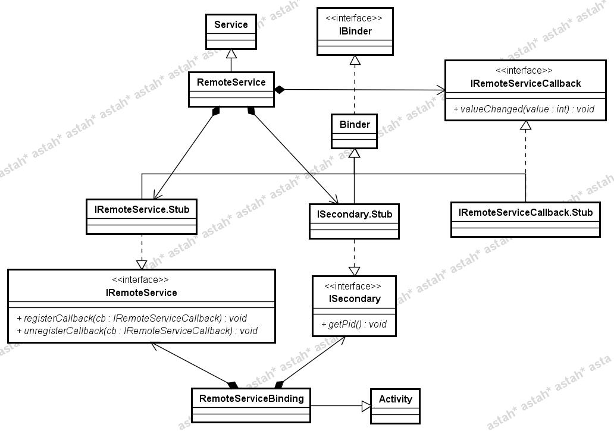

# Android Service 之三(Bind Service,使用 AIDL)

    
前面寫了 Bind Service 的兩種實現方式，接下來轉一篇貼子來簡述一下最後一種實現方式 <strong>第三種：使用 AIDL</strong>

前面講的使用 Messenger 技術，其實是基於 AIDL架構的，但是 Messenger 使用一個隊列來處理所有的請求，這樣一來，就無法進行多線程的併發了。所以，如果你想同時接受並處理多個 client 的請求，那麼請使用 AIDL 來實現，但這樣的話，你需要小心地進行同步處理了哦~ 默認情況下，一個應用不管有多少個 Activity、Service 或其他組件，它們都是運行在一個進程上，但是我們可以安排 Service 運行一個新的進程上，但是不同進程之間應該如何通信呢？當需要在不同的進程之間傳遞對象時，應該怎麼做呢？AIDL(Android Interface Definition Language) 便是解決這一問題的鑰匙。 使用 AIDL 並不是難事，但是比較繁瑣，並且一不小心容易出錯。好在 Android Dev Guide 的 "AIDL" 章節（在 "Dev Guide " 左側列表的最下面）對這個問題講解非常詳細，再結合 Android APIDemo 中的 Remote Service Binding 給出了的示例，這都給了開發者提供了非常到位的幫助。以下內容就是我結合二者，整理出來的筆記，力求真理，但能力有限，差錯難免，請讀者堅持自己的判斷力，本文只供參考，且不可盡信。 

一、使用 AIDL 實現 IPC 面對問題，應統攬全局，歸納階段，劃定步驟，共得出四大步，分列如下： ① 創建.aidl 文件 &nbsp;&nbsp;&nbsp; 在這個文件裡定義 method 和 field ② 把 .aidl 文件加入到 makefile 中去 &nbsp;&nbsp;&nbsp; 如果使用 Eclipse 則 ADT 會幫你管理 ③ 實現接口方法 &nbsp;&nbsp;&nbsp; AIDL 編譯器會根據接口生成一個用 Java 語言編寫的interface，這個 interface 有一個抽象的內部類，名字為 Stub，你必須創建一個類，繼承於它，並且實現 .adil 文件中所聲明的方法 ④ 公開接口給客戶端 &nbsp;&nbsp;&nbsp; 如果創建的是 service，則應該繼承自 Service，並且重載 Service.onBind() 返回實現接口的類的實例

這四個步驟在 Remote Service Binding 中均有所呈現，以下分開闡述。Remote Service Binding 共包含有兩個 .java 文件，三個 .aidl 文件，物理結構比較簡單，但是邏輯結構就不那麼簡單，以下用 Class Diagram 來展示其中的關係。

  &nbsp;

1、創建.aidl 文件 AIDL 語法簡單，用來聲明接口，其中的方法接收參數和返回值，但是參數和返回值的類型是有約束的，且有些類型是需要 import，另外一些則無需這樣做。 AIDL 支持的數據類型劃分為四類，第一類是 Java 編程語言中的基本類型，第二類包括 String、List、Map 和 CharSequence，第三類是其他 AIDL 生成的 interface，第四類是實現了 Parcelable 接口的自定義類。 其中，除了第一類外，其他三類在使用時均需要特別小心。 使用第二類時，首先需要明白這些類不需要 import，是內嵌的。其次注意在使用 List 和 Map 此二者容器類時，需注意其元素必須得是 AIDL 支持的數據類型，List 可支持泛型，但是 Map 不支持，同時另外一端負責接收的具體的類裡則必須是 ArrayList 和 HashMap。 使用第三、四類時，需要留意它們都是需要 import 的，但是前者傳遞時，傳遞的是 reference，而後者則是 value。

在創建 .aidl 文件的過程中，應該注意一旦 method 有參數，則需注意在前面加上 in, out 或 inout，它們被稱為 directional tag，但是對於基本類型的參數，默認就是 in，並且不能為其他值。

Remote Service Binding 共包括了三個 .aidl 文件，分別是IRemoteService.aidl、IRemoteServiceCallback.aidl、ISecondary.aidl，通過它們可以看到如何使用第一類和第三類的數據類型，稀罕的是，看不到第二類、第四類數據類型的使用，也沒有看到 directional tag。

&nbsp;

2、實現 Interface AIDL 為你生成一個 interface 文件，文件名稱和 .aidl 文件相同。如果使用 Eclipse 插件，則 AIDL 會在構建過程中自動運行，如果不使用插件，則需要先使用 AIDL。 生成的 interface 會包含一個抽象內部類 Stub，它聲明瞭在 .aidl 文件裡的所有方法。要想實現你在 .aidl 文件裡定義的接口，就必須實現這個Stub類，如下：

Java代碼 <embed wmode="transparent" src="/javascripts/syntaxhighlighter/clipboard_new.swf" width="14" height="15" flashvars="clipboard=%2F**%0A%20*%20This%20implementation%20is%20used%20to%20receive%20callbacks%20from%20the%20remote%0A%20*%20service.%0A%20*%2F%0Aprivate%20IRemoteServiceCallback%20mCallback%20%3D%20new%20IRemoteServiceCallback.Stub()%20%7B%0A%09%2F**%0A%09%20*%20This%20is%20called%20by%20the%20remote%20service%20regularly%20to%20tell%20us%20about%0A%09%20*%20new%20values.%20%20Note%20that%20IPC%20calls%20are%20dispatched%20through%20a%20thread%0A%09%20*%20pool%20running%20in%20each%20process%2C%20so%20the%20code%20executing%20here%20will%0A%09%20*%20NOT%20be%20running%20in%20our%20main%20thread%20like%20most%20other%20things%20--%20so%2C%0A%09%20*%20to%20update%20the%20UI%2C%20we%20need%20to%20use%20a%20Handler%20to%20hop%20over%20there.%0A%09%20*%2F%0A%09public%20void%20valueChanged(int%20value)%20%7B%0A%09%09mHandler.sendMessage(mHandler.obtainMessage(BUMP_MSG%2C%20value%2C%200))%3B%0A%09%7D%0A%7D%3B" quality="high" allowscriptaccess="always" type="application/x-shockwave-flash" pluginspage="http://www.macromedia.com/go/getflashplayer">&nbsp;

<ol start="1" class="dp-j"><li>/**&nbsp;</li><li>&nbsp;*&nbsp;This&nbsp;implementation&nbsp;is&nbsp;used&nbsp;to&nbsp;receive&nbsp;callbacks&nbsp;from&nbsp;the&nbsp;remote&nbsp;</li><li>&nbsp;*&nbsp;service.&nbsp;</li><li>&nbsp;*/&nbsp;&nbsp;</li><li>private&nbsp;IRemoteServiceCallback&nbsp;mCallback&nbsp;=&nbsp;new&nbsp;IRemoteServiceCallback.Stub()&nbsp;{&nbsp;&nbsp;</li><li>&nbsp;&nbsp;&nbsp;&nbsp;/**&nbsp;</li><li>&nbsp;&nbsp;&nbsp;&nbsp;&nbsp;*&nbsp;This&nbsp;is&nbsp;called&nbsp;by&nbsp;the&nbsp;remote&nbsp;service&nbsp;regularly&nbsp;to&nbsp;tell&nbsp;us&nbsp;about&nbsp;</li><li>&nbsp;&nbsp;&nbsp;&nbsp;&nbsp;*&nbsp;new&nbsp;values.&nbsp;&nbsp;Note&nbsp;that&nbsp;IPC&nbsp;calls&nbsp;are&nbsp;dispatched&nbsp;through&nbsp;a&nbsp;thread&nbsp;</li><li>&nbsp;&nbsp;&nbsp;&nbsp;&nbsp;*&nbsp;pool&nbsp;running&nbsp;in&nbsp;each&nbsp;process,&nbsp;so&nbsp;the&nbsp;code&nbsp;executing&nbsp;here&nbsp;will&nbsp;</li><li>&nbsp;&nbsp;&nbsp;&nbsp;&nbsp;*&nbsp;NOT&nbsp;be&nbsp;running&nbsp;in&nbsp;our&nbsp;main&nbsp;thread&nbsp;like&nbsp;most&nbsp;other&nbsp;things&nbsp;--&nbsp;so,&nbsp;</li><li>&nbsp;&nbsp;&nbsp;&nbsp;&nbsp;*&nbsp;to&nbsp;update&nbsp;the&nbsp;UI,&nbsp;we&nbsp;need&nbsp;to&nbsp;use&nbsp;a&nbsp;Handler&nbsp;to&nbsp;hop&nbsp;over&nbsp;there.&nbsp;</li><li>&nbsp;&nbsp;&nbsp;&nbsp;&nbsp;*/&nbsp;&nbsp;</li><li>&nbsp;&nbsp;&nbsp;&nbsp;public&nbsp;void&nbsp;valueChanged(int&nbsp;value)&nbsp;{&nbsp;&nbsp;</li><li>&nbsp;&nbsp;&nbsp;&nbsp;&nbsp;&nbsp;&nbsp;&nbsp;mHandler.sendMessage(mHandler.obtainMessage(BUMP_MSG,&nbsp;value,&nbsp;0));&nbsp;&nbsp;</li><li>&nbsp;&nbsp;&nbsp;&nbsp;}&nbsp;&nbsp;</li><li>};&nbsp;&nbsp;</li></ol>
<pre class="java" name="code" codeable_id="" codeable_type="BlogComment" source_url="http://rainbow702.iteye.com/blog/1149790#" pre_index="0" title="Android Service 之三(Bind Service,使用 AIDL)" style="display: none;">/**
 * This implementation is used to receive callbacks from the remote
 * service.
 */
private IRemoteServiceCallback mCallback = new IRemoteServiceCallback.Stub() {
	/**
	 * This is called by the remote service regularly to tell us about
	 * new values.  Note that IPC calls are dispatched through a thread
	 * pool running in each process, so the code executing here will
	 * NOT be running in our main thread like most other things -- so,
	 * to update the UI, we need to use a Handler to hop over there.
	 */
	public void valueChanged(int value) {
		mHandler.sendMessage(mHandler.obtainMessage(BUMP_MSG, value, 0));
	}
};</pre>

&nbsp;

Stub 也定義了一些幫助方法，比較常用的有 asInterface()，其接收一個 IBinder 作為參數，並且返回一個 interface 的實例用來調用IPC方法。

Java代碼 <embed wmode="transparent" src="/javascripts/syntaxhighlighter/clipboard_new.swf" width="14" height="15" flashvars="clipboard=private%20static%20INotificationManager%20sService%3B%0A%20%0Astatic%20private%20INotificationManager%20getService()%0A%7B%0A%09if%20(sService%20!%3D%20null)%20%7B%0A%09%09return%20sService%3B%0A%09%7D%0A%09sService%20%3D%20INotificationManager.Stub.asInterface(ServiceManager.getService(%22notification%22))%3B%0A%09return%20sService%3B%0A%7D" quality="high" allowscriptaccess="always" type="application/x-shockwave-flash" pluginspage="http://www.macromedia.com/go/getflashplayer">&nbsp;

<ol start="1" class="dp-j"><li>private&nbsp;static&nbsp;INotificationManager&nbsp;sService;&nbsp;&nbsp;</li><li>&nbsp;&nbsp;&nbsp;</li><li>static&nbsp;private&nbsp;INotificationManager&nbsp;getService()&nbsp;&nbsp;</li><li>{&nbsp;&nbsp;</li><li>&nbsp;&nbsp;&nbsp;&nbsp;if&nbsp;(sService&nbsp;!=&nbsp;null)&nbsp;{&nbsp;&nbsp;</li><li>&nbsp;&nbsp;&nbsp;&nbsp;&nbsp;&nbsp;&nbsp;&nbsp;return&nbsp;sService;&nbsp;&nbsp;</li><li>&nbsp;&nbsp;&nbsp;&nbsp;}&nbsp;&nbsp;</li><li>&nbsp;&nbsp;&nbsp;&nbsp;sService&nbsp;=&nbsp;INotificationManager.Stub.asInterface(ServiceManager.getService("notification"));&nbsp;&nbsp;</li><li>&nbsp;&nbsp;&nbsp;&nbsp;return&nbsp;sService;&nbsp;&nbsp;</li><li>}&nbsp;&nbsp;</li></ol>
<pre class="java" name="code" codeable_id="" codeable_type="BlogComment" source_url="http://rainbow702.iteye.com/blog/1149790#" pre_index="1" title="Android Service 之三(Bind Service,使用 AIDL)" style="display: none;">private static INotificationManager sService;
 
static private INotificationManager getService()
{
	if (sService != null) {
		return sService;
	}
	sService = INotificationManager.Stub.asInterface(ServiceManager.getService("notification"));
	return sService;
}</pre>

&nbsp;

&nbsp;要實現 interface，需要繼承 Stub，實現其方法，這在 RemoteService 和 RemoteServiceBinding 都可以找到相關代碼。

這個環節是重中之重，需要特別小心的有兩點，其一是拋出的所有異常均不會發給調用者；其二是IPC調用是同步的，這意味IPC服務一旦花費較長時間完成的話，就會引起ANR，應該將這樣的操作放在單獨的線程裡。

&nbsp;

3、向客戶端公開 Interface 獨樂樂不如眾樂樂，需要將服務公開出去，要達成這個目的，須得創建一個 Service 的子類，並且實現 Service.onBind(Intent)，通過這個方法將實現了接口的類的實例返回回來。通過查看 RemoteService 一目瞭然。

&nbsp;

Java代碼 <embed wmode="transparent" src="/javascripts/syntaxhighlighter/clipboard_new.swf" width="14" height="15" flashvars="clipboard=%40Override%0Apublic%20IBinder%20onBind(Intent%20intent)%20%7B%0A%09%2F%2F%20Select%20the%20interface%20to%20return.%20%20If%20your%20service%20only%20implements%0A%09%2F%2F%20a%20single%20interface%2C%20you%20can%20just%20return%20it%20here%20without%20checking%0A%09%2F%2F%20the%20Intent.%0A%09if%20(IRemoteService.class.getName().equals(intent.getAction()))%20%7B%0A%09%09return%20mBinder%3B%0A%09%7D%0A%09if%20(ISecondary.class.getName().equals(intent.getAction()))%20%7B%0A%09%09return%20mSecondaryBinder%3B%0A%09%7D%0A%09return%20null%3B%0A%7D" quality="high" allowscriptaccess="always" type="application/x-shockwave-flash" pluginspage="http://www.macromedia.com/go/getflashplayer">&nbsp;

<ol start="1" class="dp-j"><li>@Override&nbsp;&nbsp;</li><li>public&nbsp;IBinder&nbsp;onBind(Intent&nbsp;intent)&nbsp;{&nbsp;&nbsp;</li><li>&nbsp;&nbsp;&nbsp;&nbsp;//&nbsp;Select&nbsp;the&nbsp;interface&nbsp;to&nbsp;return.&nbsp;&nbsp;If&nbsp;your&nbsp;service&nbsp;only&nbsp;implements&nbsp;&nbsp;</li><li>&nbsp;&nbsp;&nbsp;&nbsp;//&nbsp;a&nbsp;single&nbsp;interface,&nbsp;you&nbsp;can&nbsp;just&nbsp;return&nbsp;it&nbsp;here&nbsp;without&nbsp;checking&nbsp;&nbsp;</li><li>&nbsp;&nbsp;&nbsp;&nbsp;//&nbsp;the&nbsp;Intent.&nbsp;&nbsp;</li><li>&nbsp;&nbsp;&nbsp;&nbsp;if&nbsp;(IRemoteService.class.getName().equals(intent.getAction()))&nbsp;{&nbsp;&nbsp;</li><li>&nbsp;&nbsp;&nbsp;&nbsp;&nbsp;&nbsp;&nbsp;&nbsp;return&nbsp;mBinder;&nbsp;&nbsp;</li><li>&nbsp;&nbsp;&nbsp;&nbsp;}&nbsp;&nbsp;</li><li>&nbsp;&nbsp;&nbsp;&nbsp;if&nbsp;(ISecondary.class.getName().equals(intent.getAction()))&nbsp;{&nbsp;&nbsp;</li><li>&nbsp;&nbsp;&nbsp;&nbsp;&nbsp;&nbsp;&nbsp;&nbsp;return&nbsp;mSecondaryBinder;&nbsp;&nbsp;</li><li>&nbsp;&nbsp;&nbsp;&nbsp;}&nbsp;&nbsp;</li><li>&nbsp;&nbsp;&nbsp;&nbsp;return&nbsp;null;&nbsp;&nbsp;</li><li>}&nbsp;&nbsp;</li></ol>
<pre class="java" name="code" codeable_id="" codeable_type="BlogComment" source_url="http://rainbow702.iteye.com/blog/1149790#" pre_index="2" title="Android Service 之三(Bind Service,使用 AIDL)" style="display: none;">@Override
public IBinder onBind(Intent intent) {
	// Select the interface to return.  If your service only implements
	// a single interface, you can just return it here without checking
	// the Intent.
	if (IRemoteService.class.getName().equals(intent.getAction())) {
		return mBinder;
	}
	if (ISecondary.class.getName().equals(intent.getAction())) {
		return mSecondaryBinder;
	}
	return null;
}</pre>

&nbsp;

其中的 mBinder 和 mSecondaryBinder 分別是實現了 IRemoteService 和 ISecondary 接口的類的實例。

4、使用Parcelables傳值 前文中提到 Remote Servcie Binding 沒有使用第四類數據類型作為參數，這是示例的不足，要想讓一個類變成第四類，需要遵照以下步驟：

① 引入 Parcelable 接口 ② 實現 writeToParcel(Parcel out) ③ 增加一個靜態的field，其實現 Parcelable.Creator 接口 ④ 創建一個 .aidl 文件，用以聲明你的 parcelables 類 在 "AIDL" 中，類 Rect 是一個不錯的示例，彌補了 Remote Service Binding 的不足。

&nbsp;

二、調用 IPC 方法 萬事俱備，只欠東風，IPC 備妥，只待調用。在 Remote Service Binding 中，RemoteServiceBinding 正是 IPC 的調用者，既然要使用接口，那就先聲明 interface 類型的變量

Java代碼 <embed wmode="transparent" src="/javascripts/syntaxhighlighter/clipboard_new.swf" width="14" height="15" flashvars="clipboard=%2F%2F%20The%20primary%20interface%20we%20will%20be%20calling%20on%20the%20service.%20%0AIRemoteService%20mService%20%3D%20null%3B%20%0A%2F%2F%20Another%20interface%20we%20use%20on%20the%20service.%20%0AISecondary%20mSecondaryService%20%3D%20null%3B%20" quality="high" allowscriptaccess="always" type="application/x-shockwave-flash" pluginspage="http://www.macromedia.com/go/getflashplayer">&nbsp;

<ol start="1" class="dp-j"><li>//&nbsp;The&nbsp;primary&nbsp;interface&nbsp;we&nbsp;will&nbsp;be&nbsp;calling&nbsp;on&nbsp;the&nbsp;service.&nbsp;&nbsp;&nbsp;</li><li>IRemoteService&nbsp;mService&nbsp;=&nbsp;null;&nbsp;&nbsp;&nbsp;</li><li>//&nbsp;Another&nbsp;interface&nbsp;we&nbsp;use&nbsp;on&nbsp;the&nbsp;service.&nbsp;&nbsp;&nbsp;</li><li>ISecondary&nbsp;mSecondaryService&nbsp;=&nbsp;null;&nbsp;&nbsp;&nbsp;</li></ol>
<pre class="java" name="code" codeable_id="" codeable_type="BlogComment" source_url="http://rainbow702.iteye.com/blog/1149790#" pre_index="3" title="Android Service 之三(Bind Service,使用 AIDL)" style="display: none;">// The primary interface we will be calling on the service. 
IRemoteService mService = null; 
// Another interface we use on the service. 
ISecondary mSecondaryService = null; </pre>

&nbsp;

實現 ServiceConnection，在 onServiceConnected(ComponentName className, IBinder service) 中完成對 mService 和 mSecondaryService 的賦值。

&nbsp;

Java代碼 <embed wmode="transparent" src="/javascripts/syntaxhighlighter/clipboard_new.swf" width="14" height="15" flashvars="clipboard=private%20ServiceConnection%20mConnection%20%3D%20new%20ServiceConnection()%20%7B%0A%09public%20void%20onServiceConnected(ComponentName%20className%2C%0A%09%09%09IBinder%20service)%20%7B%0A%09%09mService%20%3D%20IRemoteService.Stub.asInterface(service)%3B%0A%09%09%2F%2F%20...%20%E4%BB%A5%E4%B8%8B%E7%9C%81%E7%95%A5%0A%09%7D%0A%7D" quality="high" allowscriptaccess="always" type="application/x-shockwave-flash" pluginspage="http://www.macromedia.com/go/getflashplayer">&nbsp;

<ol start="1" class="dp-j"><li>private&nbsp;ServiceConnection&nbsp;mConnection&nbsp;=&nbsp;new&nbsp;ServiceConnection()&nbsp;{&nbsp;&nbsp;</li><li>&nbsp;&nbsp;&nbsp;&nbsp;public&nbsp;void&nbsp;onServiceConnected(ComponentName&nbsp;className,&nbsp;&nbsp;</li><li>&nbsp;&nbsp;&nbsp;&nbsp;&nbsp;&nbsp;&nbsp;&nbsp;&nbsp;&nbsp;&nbsp;&nbsp;IBinder&nbsp;service)&nbsp;{&nbsp;&nbsp;</li><li>&nbsp;&nbsp;&nbsp;&nbsp;&nbsp;&nbsp;&nbsp;&nbsp;mService&nbsp;=&nbsp;IRemoteService.Stub.asInterface(service);&nbsp;&nbsp;</li><li>&nbsp;&nbsp;&nbsp;&nbsp;&nbsp;&nbsp;&nbsp;&nbsp;//&nbsp;...&nbsp;以下省略&nbsp;&nbsp;</li><li>&nbsp;&nbsp;&nbsp;&nbsp;}&nbsp;&nbsp;</li><li>}&nbsp;&nbsp;</li></ol>
<pre class="java" name="code" codeable_id="" codeable_type="BlogComment" source_url="http://rainbow702.iteye.com/blog/1149790#" pre_index="4" title="Android Service 之三(Bind Service,使用 AIDL)" style="display: none;">private ServiceConnection mConnection = new ServiceConnection() {
	public void onServiceConnected(ComponentName className,
			IBinder service) {
		mService = IRemoteService.Stub.asInterface(service);
		// ... 以下省略
	}
}</pre>

&nbsp;

接著別忘了調用 Context.bindService()，完成任務以後，調用 Context.unbindService()。如果在 connection 中斷的情況下，調用 IPC 方法，你會遇到 DeadObjectException，這是 remote method 能拋出的唯一異常。

&nbsp;

原文地址： <a href="http://www.poemcode.net/2010/05/aidl-ipc/">http://www.poemcode.net/2010/05/aidl-ipc/</a>

  
