# Android Service 之三(Bind Service,使用 Messenger)

    
上次講了第一種 Bind Service 的實現方式，今天講

<strong>第二種：</strong><strong>使用 Messenger</strong>

這種情況適用於你想實現進程間通信的場合，它分以下幾個步驟：

①&nbsp;service 內部需要有一個 Handler 的實現，它被用來處理從每一個 client 發送過的來請求

② 通過這個 Handler ，來生成一個 Messenger

③ 在 service 的onBind() 方法中，需要向 client 返回由該 Messenger 生成的一個 IBinder 實例

④&nbsp;client 使用從 service 返回的 IBinder 實例來初始化一個 Messenger， 然後使用該&nbsp;Messenger 與 service 進行通信

⑤ service 通過它自身內部的 Handler 實現(Handler 人 handleMessage() 方法中)來處理從 client 發送過來的請求

&nbsp;

下面給出一實例進行說明，該實現由兩個工程組成：

① BindServiceDemo_Client： 該工程中只包含一個Activity，用來綁定另一個工程中的 Service

② BindServiceDemo_Service：該工程中只包含一個Service

在實例中， Client 與 Service 中都有一個Messenger ，所以可以進行兩者的互相請求與應答。話不多說，貼上部分源碼：

① BindServiceDemoClient 中：&nbsp;

Java代碼 <embed wmode="transparent" src="/javascripts/syntaxhighlighter/clipboard_new.swf" width="14" height="15" flashvars="clipboard=%2F%2F%20client%20%E7%AB%AF%20Handler%20%E7%9A%84%E5%AE%9E%E7%8E%B0%0Aprivate%20class%20IncomingHandler%20extends%20Handler%20%7B%0A%09%09%2F*%0A%09%09%20*%20%E5%A4%84%E7%90%86%E4%BB%8EService%E5%8F%91%E9%80%81%E8%87%B3%E8%AF%A5Activity%E7%9A%84%E6%B6%88%E6%81%AF%0A%09%09%20*%20(non-Javadoc)%0A%09%09%20*%20%40see%20android.os.Handler%23handleMessage(android.os.Message)%0A%09%09%20*%2F%0A%09%09%40Override%0A%09%09public%20void%20handleMessage(Message%20msg)%20%7B%0A%09%09%09switch%20(msg.what)%20%7B%0A%09%09%09%09case%20MSG_SET_VALUE%3A%0A%09%09%09%09%09Toast.makeText(BindServiceDemoClient.this%2C%0A%09%09%09%09%09%09%09%22set%20value%20as%3A%20%22%20%2B%20msg.arg1%2C%20Toast.LENGTH_SHORT)%0A%09%09%09%09%09%09%09.show()%3B%0A%09%09%09%09%09break%3B%0A%09%09%09%09default%3A%0A%09%09%09%09%09super.handleMessage(msg)%3B%0A%09%09%09%7D%0A%09%09%7D%0A%09%7D" quality="high" allowscriptaccess="always" type="application/x-shockwave-flash" pluginspage="http://www.macromedia.com/go/getflashplayer">&nbsp;

<ol start="1" class="dp-j"><li>//&nbsp;client&nbsp;端&nbsp;Handler&nbsp;的實現&nbsp;&nbsp;</li><li>private&nbsp;class&nbsp;IncomingHandler&nbsp;extends&nbsp;Handler&nbsp;{&nbsp;&nbsp;</li><li>&nbsp;&nbsp;&nbsp;&nbsp;&nbsp;&nbsp;&nbsp;&nbsp;/*&nbsp;</li><li>&nbsp;&nbsp;&nbsp;&nbsp;&nbsp;&nbsp;&nbsp;&nbsp;&nbsp;*&nbsp;處理從Service發送至該Activity的消息&nbsp;</li><li>&nbsp;&nbsp;&nbsp;&nbsp;&nbsp;&nbsp;&nbsp;&nbsp;&nbsp;*&nbsp;(non-Javadoc)&nbsp;</li><li>&nbsp;&nbsp;&nbsp;&nbsp;&nbsp;&nbsp;&nbsp;&nbsp;&nbsp;*&nbsp;@see&nbsp;android.os.Handler#handleMessage(android.os.Message)&nbsp;</li><li>&nbsp;&nbsp;&nbsp;&nbsp;&nbsp;&nbsp;&nbsp;&nbsp;&nbsp;*/&nbsp;&nbsp;</li><li>&nbsp;&nbsp;&nbsp;&nbsp;&nbsp;&nbsp;&nbsp;&nbsp;@Override&nbsp;&nbsp;</li><li>&nbsp;&nbsp;&nbsp;&nbsp;&nbsp;&nbsp;&nbsp;&nbsp;public&nbsp;void&nbsp;handleMessage(Message&nbsp;msg)&nbsp;{&nbsp;&nbsp;</li><li>&nbsp;&nbsp;&nbsp;&nbsp;&nbsp;&nbsp;&nbsp;&nbsp;&nbsp;&nbsp;&nbsp;&nbsp;switch&nbsp;(msg.what)&nbsp;{&nbsp;&nbsp;</li><li>&nbsp;&nbsp;&nbsp;&nbsp;&nbsp;&nbsp;&nbsp;&nbsp;&nbsp;&nbsp;&nbsp;&nbsp;&nbsp;&nbsp;&nbsp;&nbsp;case&nbsp;MSG_SET_VALUE:&nbsp;&nbsp;</li><li>&nbsp;&nbsp;&nbsp;&nbsp;&nbsp;&nbsp;&nbsp;&nbsp;&nbsp;&nbsp;&nbsp;&nbsp;&nbsp;&nbsp;&nbsp;&nbsp;&nbsp;&nbsp;&nbsp;&nbsp;Toast.makeText(BindServiceDemoClient.this,&nbsp;&nbsp;</li><li>&nbsp;&nbsp;&nbsp;&nbsp;&nbsp;&nbsp;&nbsp;&nbsp;&nbsp;&nbsp;&nbsp;&nbsp;&nbsp;&nbsp;&nbsp;&nbsp;&nbsp;&nbsp;&nbsp;&nbsp;&nbsp;&nbsp;&nbsp;&nbsp;&nbsp;&nbsp;&nbsp;&nbsp;"set&nbsp;value&nbsp;as:&nbsp;"&nbsp;+&nbsp;msg.arg1,&nbsp;Toast.LENGTH_SHORT)&nbsp;&nbsp;</li><li>&nbsp;&nbsp;&nbsp;&nbsp;&nbsp;&nbsp;&nbsp;&nbsp;&nbsp;&nbsp;&nbsp;&nbsp;&nbsp;&nbsp;&nbsp;&nbsp;&nbsp;&nbsp;&nbsp;&nbsp;&nbsp;&nbsp;&nbsp;&nbsp;&nbsp;&nbsp;&nbsp;&nbsp;.show();&nbsp;&nbsp;</li><li>&nbsp;&nbsp;&nbsp;&nbsp;&nbsp;&nbsp;&nbsp;&nbsp;&nbsp;&nbsp;&nbsp;&nbsp;&nbsp;&nbsp;&nbsp;&nbsp;&nbsp;&nbsp;&nbsp;&nbsp;break;&nbsp;&nbsp;</li><li>&nbsp;&nbsp;&nbsp;&nbsp;&nbsp;&nbsp;&nbsp;&nbsp;&nbsp;&nbsp;&nbsp;&nbsp;&nbsp;&nbsp;&nbsp;&nbsp;default:&nbsp;&nbsp;</li><li>&nbsp;&nbsp;&nbsp;&nbsp;&nbsp;&nbsp;&nbsp;&nbsp;&nbsp;&nbsp;&nbsp;&nbsp;&nbsp;&nbsp;&nbsp;&nbsp;&nbsp;&nbsp;&nbsp;&nbsp;super.handleMessage(msg);&nbsp;&nbsp;</li><li>&nbsp;&nbsp;&nbsp;&nbsp;&nbsp;&nbsp;&nbsp;&nbsp;&nbsp;&nbsp;&nbsp;&nbsp;}&nbsp;&nbsp;</li><li>&nbsp;&nbsp;&nbsp;&nbsp;&nbsp;&nbsp;&nbsp;&nbsp;}&nbsp;&nbsp;</li><li>&nbsp;&nbsp;&nbsp;&nbsp;}&nbsp;&nbsp;</li></ol>
<pre class="java" name="code" codeable_id="" codeable_type="BlogComment" source_url="http://rainbow702.iteye.com/blog/1149756#" pre_index="0" title="Android Service 之三(Bind Service,使用 Messenger)" style="display: none;">// client 端 Handler 的實現
private class IncomingHandler extends Handler {
		/*
		 * 處理從Service發送至該Activity的消息
		 * (non-Javadoc)
		 * @see android.os.Handler#handleMessage(android.os.Message)
		 */
		@Override
		public void handleMessage(Message msg) {
			switch (msg.what) {
				case MSG_SET_VALUE:
					Toast.makeText(BindServiceDemoClient.this,
							"set value as: " + msg.arg1, Toast.LENGTH_SHORT)
							.show();
					break;
				default:
					super.handleMessage(msg);
			}
		}
	}</pre>

&nbsp;

Java代碼 <embed wmode="transparent" src="/javascripts/syntaxhighlighter/clipboard_new.swf" width="14" height="15" flashvars="clipboard=%2F%2F%20client%20%E7%AB%AF%20ServiceConnection%20%E7%9A%84%E5%AE%9E%E7%8E%B0%0Aprivate%20ServiceConnection%20myRemoteServiceConnection%20%3D%20new%20ServiceConnection()%20%7B%0A%09%09public%20void%20onServiceConnected(android.content.ComponentName%20name%2C%0A%09%09%09%09android.os.IBinder%20service)%20%7B%0A%09%09%09updateLog(%22myServiceConnection.onServiceConnected%22)%3B%0A%09%09%09%2F%2F%20%E5%AE%A2%E6%88%B7%E7%AB%AF%20%E4%B8%8E%20%E6%9C%8D%E5%8A%A1%20%E4%B8%8D%E5%9C%A8%E5%90%8C%E4%B8%80%E4%B8%AA%E8%BF%9B%E7%A8%8B%E4%B8%AD%E7%9A%84%E8%AF%9D%EF%BC%8C%E6%89%80%E4%BB%A5%E4%B8%8D%E5%8F%AF%E4%BB%A5%E8%BF%9B%E8%A1%8C%E6%98%BE%E7%A4%BA%E5%BC%BA%E5%88%B6%E7%B1%BB%E5%9E%8B%E8%BD%AC%E6%8D%A2%E7%9A%84%EF%BC%8C%0A%09%09%09%2F%2F%20%E5%9B%A0%E4%B8%BA%EF%BC%8C%E9%80%9A%E8%BF%87Debug%EF%BC%8C%E5%8F%AF%E4%BB%A5%E5%8F%91%E7%8E%B0%E6%AD%A4%E6%97%B6%E4%BC%A0%E8%BF%9B%E6%9D%A5%E7%9A%84%20Service%20%E7%9A%84%E7%B1%BB%E5%9E%8B%E6%98%AF%20BinderProxy%0A%09%09%09isBound%20%3D%20true%3B%0A%09%09%09%2F%2F%20%E4%BD%BF%E7%94%A8%E4%BB%8EService%E8%BF%94%E5%9B%9E%E7%9A%84IBinder%E6%9D%A5%E7%94%9F%E6%88%90%E4%B8%80%E4%B8%AAMessenger%0A%09%09%09Messenger%20serviceMessenger%20%3D%20new%20Messenger(service)%3B%0A%09%09%09%2F%2F%20%E7%94%9F%E6%88%90%E4%B8%80%E4%B8%AAMessage%0A%09%09%09Message%20msg%20%3D%20Message.obtain()%3B%0A%09%09%09msg.what%20%3D%20MSG_REGISTER_CLIENT%3B%0A%09%09%09msg.replyTo%20%3D%20messenger%3B%0A%09%09%09try%20%7B%0A%09%09%09%09%2F%2F%20%E5%90%91Service%20%E5%8F%91%E9%80%81Message%0A%09%09%09%09serviceMessenger.send(msg)%3B%0A%09%09%09%7D%20catch%20(RemoteException%20e)%20%7B%0A%09%09%09%09e.printStackTrace()%3B%0A%09%09%09%7D%0A%0A%09%09%09msg%20%3D%20Message.obtain()%3B%0A%09%09%09msg.what%20%3D%20MSG_SET_VALUE%3B%0A%09%09%09msg.replyTo%20%3D%20messenger%3B%0A%09%09%09msg.arg1%20%3D%2010%3B%0A%09%09%09try%20%7B%0A%09%09%09%09serviceMessenger.send(msg)%3B%0A%09%09%09%7D%20catch%20(RemoteException%20e)%20%7B%0A%09%09%09%09e.printStackTrace()%3B%0A%09%09%09%7D%0A%09%09%7D%3B%0A" quality="high" allowscriptaccess="always" type="application/x-shockwave-flash" pluginspage="http://www.macromedia.com/go/getflashplayer">&nbsp;

<ol start="1" class="dp-j"><li>//&nbsp;client&nbsp;端&nbsp;ServiceConnection&nbsp;的實現&nbsp;&nbsp;</li><li>private&nbsp;ServiceConnection&nbsp;myRemoteServiceConnection&nbsp;=&nbsp;new&nbsp;ServiceConnection()&nbsp;{&nbsp;&nbsp;</li><li>&nbsp;&nbsp;&nbsp;&nbsp;&nbsp;&nbsp;&nbsp;&nbsp;public&nbsp;void&nbsp;onServiceConnected(android.content.ComponentName&nbsp;name,&nbsp;&nbsp;</li><li>&nbsp;&nbsp;&nbsp;&nbsp;&nbsp;&nbsp;&nbsp;&nbsp;&nbsp;&nbsp;&nbsp;&nbsp;&nbsp;&nbsp;&nbsp;&nbsp;android.os.IBinder&nbsp;service)&nbsp;{&nbsp;&nbsp;</li><li>&nbsp;&nbsp;&nbsp;&nbsp;&nbsp;&nbsp;&nbsp;&nbsp;&nbsp;&nbsp;&nbsp;&nbsp;updateLog("myServiceConnection.onServiceConnected");&nbsp;&nbsp;</li><li>&nbsp;&nbsp;&nbsp;&nbsp;&nbsp;&nbsp;&nbsp;&nbsp;&nbsp;&nbsp;&nbsp;&nbsp;//&nbsp;客戶端&nbsp;與&nbsp;服務&nbsp;不在同一個進程中的話，所以不可以進行顯示強制類型轉換的，&nbsp;&nbsp;</li><li>&nbsp;&nbsp;&nbsp;&nbsp;&nbsp;&nbsp;&nbsp;&nbsp;&nbsp;&nbsp;&nbsp;&nbsp;//&nbsp;因為，通過Debug，可以發現此時傳進來的&nbsp;Service&nbsp;的類型是&nbsp;BinderProxy&nbsp;&nbsp;</li><li>&nbsp;&nbsp;&nbsp;&nbsp;&nbsp;&nbsp;&nbsp;&nbsp;&nbsp;&nbsp;&nbsp;&nbsp;isBound&nbsp;=&nbsp;true;&nbsp;&nbsp;</li><li>&nbsp;&nbsp;&nbsp;&nbsp;&nbsp;&nbsp;&nbsp;&nbsp;&nbsp;&nbsp;&nbsp;&nbsp;//&nbsp;使用從Service返回的IBinder來生成一個Messenger&nbsp;&nbsp;</li><li>&nbsp;&nbsp;&nbsp;&nbsp;&nbsp;&nbsp;&nbsp;&nbsp;&nbsp;&nbsp;&nbsp;&nbsp;Messenger&nbsp;serviceMessenger&nbsp;=&nbsp;new&nbsp;Messenger(service);&nbsp;&nbsp;</li><li>&nbsp;&nbsp;&nbsp;&nbsp;&nbsp;&nbsp;&nbsp;&nbsp;&nbsp;&nbsp;&nbsp;&nbsp;//&nbsp;生成一個Message&nbsp;&nbsp;</li><li>&nbsp;&nbsp;&nbsp;&nbsp;&nbsp;&nbsp;&nbsp;&nbsp;&nbsp;&nbsp;&nbsp;&nbsp;Message&nbsp;msg&nbsp;=&nbsp;Message.obtain();&nbsp;&nbsp;</li><li>&nbsp;&nbsp;&nbsp;&nbsp;&nbsp;&nbsp;&nbsp;&nbsp;&nbsp;&nbsp;&nbsp;&nbsp;msg.what&nbsp;=&nbsp;MSG_REGISTER_CLIENT;&nbsp;&nbsp;</li><li>&nbsp;&nbsp;&nbsp;&nbsp;&nbsp;&nbsp;&nbsp;&nbsp;&nbsp;&nbsp;&nbsp;&nbsp;msg.replyTo&nbsp;=&nbsp;messenger;&nbsp;&nbsp;</li><li>&nbsp;&nbsp;&nbsp;&nbsp;&nbsp;&nbsp;&nbsp;&nbsp;&nbsp;&nbsp;&nbsp;&nbsp;try&nbsp;{&nbsp;&nbsp;</li><li>&nbsp;&nbsp;&nbsp;&nbsp;&nbsp;&nbsp;&nbsp;&nbsp;&nbsp;&nbsp;&nbsp;&nbsp;&nbsp;&nbsp;&nbsp;&nbsp;//&nbsp;向Service&nbsp;發送Message&nbsp;&nbsp;</li><li>&nbsp;&nbsp;&nbsp;&nbsp;&nbsp;&nbsp;&nbsp;&nbsp;&nbsp;&nbsp;&nbsp;&nbsp;&nbsp;&nbsp;&nbsp;&nbsp;serviceMessenger.send(msg);&nbsp;&nbsp;</li><li>&nbsp;&nbsp;&nbsp;&nbsp;&nbsp;&nbsp;&nbsp;&nbsp;&nbsp;&nbsp;&nbsp;&nbsp;}&nbsp;catch&nbsp;(RemoteException&nbsp;e)&nbsp;{&nbsp;&nbsp;</li><li>&nbsp;&nbsp;&nbsp;&nbsp;&nbsp;&nbsp;&nbsp;&nbsp;&nbsp;&nbsp;&nbsp;&nbsp;&nbsp;&nbsp;&nbsp;&nbsp;e.printStackTrace();&nbsp;&nbsp;</li><li>&nbsp;&nbsp;&nbsp;&nbsp;&nbsp;&nbsp;&nbsp;&nbsp;&nbsp;&nbsp;&nbsp;&nbsp;}&nbsp;&nbsp;</li><li>&nbsp;&nbsp;</li><li>&nbsp;&nbsp;&nbsp;&nbsp;&nbsp;&nbsp;&nbsp;&nbsp;&nbsp;&nbsp;&nbsp;&nbsp;msg&nbsp;=&nbsp;Message.obtain();&nbsp;&nbsp;</li><li>&nbsp;&nbsp;&nbsp;&nbsp;&nbsp;&nbsp;&nbsp;&nbsp;&nbsp;&nbsp;&nbsp;&nbsp;msg.what&nbsp;=&nbsp;MSG_SET_VALUE;&nbsp;&nbsp;</li><li>&nbsp;&nbsp;&nbsp;&nbsp;&nbsp;&nbsp;&nbsp;&nbsp;&nbsp;&nbsp;&nbsp;&nbsp;msg.replyTo&nbsp;=&nbsp;messenger;&nbsp;&nbsp;</li><li>&nbsp;&nbsp;&nbsp;&nbsp;&nbsp;&nbsp;&nbsp;&nbsp;&nbsp;&nbsp;&nbsp;&nbsp;msg.arg1&nbsp;=&nbsp;10;&nbsp;&nbsp;</li><li>&nbsp;&nbsp;&nbsp;&nbsp;&nbsp;&nbsp;&nbsp;&nbsp;&nbsp;&nbsp;&nbsp;&nbsp;try&nbsp;{&nbsp;&nbsp;</li><li>&nbsp;&nbsp;&nbsp;&nbsp;&nbsp;&nbsp;&nbsp;&nbsp;&nbsp;&nbsp;&nbsp;&nbsp;&nbsp;&nbsp;&nbsp;&nbsp;serviceMessenger.send(msg);&nbsp;&nbsp;</li><li>&nbsp;&nbsp;&nbsp;&nbsp;&nbsp;&nbsp;&nbsp;&nbsp;&nbsp;&nbsp;&nbsp;&nbsp;}&nbsp;catch&nbsp;(RemoteException&nbsp;e)&nbsp;{&nbsp;&nbsp;</li><li>&nbsp;&nbsp;&nbsp;&nbsp;&nbsp;&nbsp;&nbsp;&nbsp;&nbsp;&nbsp;&nbsp;&nbsp;&nbsp;&nbsp;&nbsp;&nbsp;e.printStackTrace();&nbsp;&nbsp;</li><li>&nbsp;&nbsp;&nbsp;&nbsp;&nbsp;&nbsp;&nbsp;&nbsp;&nbsp;&nbsp;&nbsp;&nbsp;}&nbsp;&nbsp;</li><li>&nbsp;&nbsp;&nbsp;&nbsp;&nbsp;&nbsp;&nbsp;&nbsp;};&nbsp;&nbsp;</li></ol>
<pre class="java" name="code" codeable_id="" codeable_type="BlogComment" source_url="http://rainbow702.iteye.com/blog/1149756#" pre_index="1" title="Android Service 之三(Bind Service,使用 Messenger)" style="display: none;">// client 端 ServiceConnection 的實現
private ServiceConnection myRemoteServiceConnection = new ServiceConnection() {
		public void onServiceConnected(android.content.ComponentName name,
				android.os.IBinder service) {
			updateLog("myServiceConnection.onServiceConnected");
			// 客戶端 與 服務 不在同一個進程中的話，所以不可以進行顯示強制類型轉換的，
			// 因為，通過Debug，可以發現此時傳進來的 Service 的類型是 BinderProxy
			isBound = true;
			// 使用從Service返回的IBinder來生成一個Messenger
			Messenger serviceMessenger = new Messenger(service);
			// 生成一個Message
			Message msg = Message.obtain();
			msg.what = MSG_REGISTER_CLIENT;
			msg.replyTo = messenger;
			try {
				// 向Service 發送Message
				serviceMessenger.send(msg);
			} catch (RemoteException e) {
				e.printStackTrace();
			}

			msg = Message.obtain();
			msg.what = MSG_SET_VALUE;
			msg.replyTo = messenger;
			msg.arg1 = 10;
			try {
				serviceMessenger.send(msg);
			} catch (RemoteException e) {
				e.printStackTrace();
			}
		};
</pre>

&nbsp;&nbsp;

② BindServiceDemoService 中：

Java代碼  

Java代碼 <embed wmode="transparent" src="/javascripts/syntaxhighlighter/clipboard_new.swf" width="14" height="15" flashvars="clipboard=%2F%2F%20service%20%E7%AB%AF%E7%9A%84%20Handler%20%E7%9A%84%E5%AE%9E%E7%8E%B0%0Aprivate%20class%20IncomingHandler%20extends%20Handler%20%7B%0A%0A%09%09%40Override%0A%09%09public%20void%20handleMessage(Message%20msg)%20%7B%0A%09%09%09switch%20(msg.what)%20%7B%0A%09%09%09%09case%20MSG_REGISTER_CLIENT%3A%0A%09%09%09%09%09allClients.add(msg.replyTo)%3B%0A%09%09%09%09%09break%3B%0A%09%09%09%09case%20MSG_UNREGISTER_CLIENT%3A%0A%09%09%09%09%09allClients.remove(msg.replyTo)%3B%0A%09%09%09%09%09break%3B%0A%09%09%09%09case%20MSG_SET_VALUE%3A%0A%09%09%09%09%09int%20value%20%3D%20msg.arg1%3B%0A%09%09%09%09%09for%20(int%20i%20%3D%200%3B%20i%20%3C%20allClients.size()%3B%20i%2B%2B)%20%7B%0A%09%09%09%09%09%09try%20%7B%0A%09%09%09%09%09%09%09allClients.get(i).send(%0A%09%09%09%09%09%09%09%09%09Message.obtain(null%2C%20MSG_SET_VALUE%2C%20value%2C%0A%09%09%09%09%09%09%09%09%09%09%090))%3B%0A%09%09%09%09%09%09%7D%20catch%20(RemoteException%20e)%20%7B%0A%09%09%09%09%09%09%09allClients.remove(i)%3B%0A%09%09%09%09%09%09%7D%0A%09%09%09%09%09%7D%0A%09%09%09%09%09break%3B%0A%09%09%09%09default%3A%0A%09%09%09%09%09super.handleMessage(msg)%3B%0A%09%09%09%7D%0A%09%09%7D%0A%0A%09%7D" quality="high" allowscriptaccess="always" type="application/x-shockwave-flash" pluginspage="http://www.macromedia.com/go/getflashplayer">&nbsp;

<ol start="1" class="dp-j"><li>//&nbsp;service&nbsp;端的&nbsp;Handler&nbsp;的實現&nbsp;&nbsp;</li><li>private&nbsp;class&nbsp;IncomingHandler&nbsp;extends&nbsp;Handler&nbsp;{&nbsp;&nbsp;</li><li>&nbsp;&nbsp;</li><li>&nbsp;&nbsp;&nbsp;&nbsp;&nbsp;&nbsp;&nbsp;&nbsp;@Override&nbsp;&nbsp;</li><li>&nbsp;&nbsp;&nbsp;&nbsp;&nbsp;&nbsp;&nbsp;&nbsp;public&nbsp;void&nbsp;handleMessage(Message&nbsp;msg)&nbsp;{&nbsp;&nbsp;</li><li>&nbsp;&nbsp;&nbsp;&nbsp;&nbsp;&nbsp;&nbsp;&nbsp;&nbsp;&nbsp;&nbsp;&nbsp;switch&nbsp;(msg.what)&nbsp;{&nbsp;&nbsp;</li><li>&nbsp;&nbsp;&nbsp;&nbsp;&nbsp;&nbsp;&nbsp;&nbsp;&nbsp;&nbsp;&nbsp;&nbsp;&nbsp;&nbsp;&nbsp;&nbsp;case&nbsp;MSG_REGISTER_CLIENT:&nbsp;&nbsp;</li><li>&nbsp;&nbsp;&nbsp;&nbsp;&nbsp;&nbsp;&nbsp;&nbsp;&nbsp;&nbsp;&nbsp;&nbsp;&nbsp;&nbsp;&nbsp;&nbsp;&nbsp;&nbsp;&nbsp;&nbsp;allClients.add(msg.replyTo);&nbsp;&nbsp;</li><li>&nbsp;&nbsp;&nbsp;&nbsp;&nbsp;&nbsp;&nbsp;&nbsp;&nbsp;&nbsp;&nbsp;&nbsp;&nbsp;&nbsp;&nbsp;&nbsp;&nbsp;&nbsp;&nbsp;&nbsp;break;&nbsp;&nbsp;</li><li>&nbsp;&nbsp;&nbsp;&nbsp;&nbsp;&nbsp;&nbsp;&nbsp;&nbsp;&nbsp;&nbsp;&nbsp;&nbsp;&nbsp;&nbsp;&nbsp;case&nbsp;MSG_UNREGISTER_CLIENT:&nbsp;&nbsp;</li><li>&nbsp;&nbsp;&nbsp;&nbsp;&nbsp;&nbsp;&nbsp;&nbsp;&nbsp;&nbsp;&nbsp;&nbsp;&nbsp;&nbsp;&nbsp;&nbsp;&nbsp;&nbsp;&nbsp;&nbsp;allClients.remove(msg.replyTo);&nbsp;&nbsp;</li><li>&nbsp;&nbsp;&nbsp;&nbsp;&nbsp;&nbsp;&nbsp;&nbsp;&nbsp;&nbsp;&nbsp;&nbsp;&nbsp;&nbsp;&nbsp;&nbsp;&nbsp;&nbsp;&nbsp;&nbsp;break;&nbsp;&nbsp;</li><li>&nbsp;&nbsp;&nbsp;&nbsp;&nbsp;&nbsp;&nbsp;&nbsp;&nbsp;&nbsp;&nbsp;&nbsp;&nbsp;&nbsp;&nbsp;&nbsp;case&nbsp;MSG_SET_VALUE:&nbsp;&nbsp;</li><li>&nbsp;&nbsp;&nbsp;&nbsp;&nbsp;&nbsp;&nbsp;&nbsp;&nbsp;&nbsp;&nbsp;&nbsp;&nbsp;&nbsp;&nbsp;&nbsp;&nbsp;&nbsp;&nbsp;&nbsp;int&nbsp;value&nbsp;=&nbsp;msg.arg1;&nbsp;&nbsp;</li><li>&nbsp;&nbsp;&nbsp;&nbsp;&nbsp;&nbsp;&nbsp;&nbsp;&nbsp;&nbsp;&nbsp;&nbsp;&nbsp;&nbsp;&nbsp;&nbsp;&nbsp;&nbsp;&nbsp;&nbsp;for&nbsp;(int&nbsp;i&nbsp;=&nbsp;0;&nbsp;i&nbsp;&lt;&nbsp;allClients.size();&nbsp;i++)&nbsp;{&nbsp;&nbsp;</li><li>&nbsp;&nbsp;&nbsp;&nbsp;&nbsp;&nbsp;&nbsp;&nbsp;&nbsp;&nbsp;&nbsp;&nbsp;&nbsp;&nbsp;&nbsp;&nbsp;&nbsp;&nbsp;&nbsp;&nbsp;&nbsp;&nbsp;&nbsp;&nbsp;try&nbsp;{&nbsp;&nbsp;</li><li>&nbsp;&nbsp;&nbsp;&nbsp;&nbsp;&nbsp;&nbsp;&nbsp;&nbsp;&nbsp;&nbsp;&nbsp;&nbsp;&nbsp;&nbsp;&nbsp;&nbsp;&nbsp;&nbsp;&nbsp;&nbsp;&nbsp;&nbsp;&nbsp;&nbsp;&nbsp;&nbsp;&nbsp;allClients.get(i).send(&nbsp;&nbsp;</li><li>&nbsp;&nbsp;&nbsp;&nbsp;&nbsp;&nbsp;&nbsp;&nbsp;&nbsp;&nbsp;&nbsp;&nbsp;&nbsp;&nbsp;&nbsp;&nbsp;&nbsp;&nbsp;&nbsp;&nbsp;&nbsp;&nbsp;&nbsp;&nbsp;&nbsp;&nbsp;&nbsp;&nbsp;&nbsp;&nbsp;&nbsp;&nbsp;&nbsp;&nbsp;&nbsp;&nbsp;Message.obtain(null,&nbsp;MSG_SET_VALUE,&nbsp;value,&nbsp;&nbsp;</li><li>&nbsp;&nbsp;&nbsp;&nbsp;&nbsp;&nbsp;&nbsp;&nbsp;&nbsp;&nbsp;&nbsp;&nbsp;&nbsp;&nbsp;&nbsp;&nbsp;&nbsp;&nbsp;&nbsp;&nbsp;&nbsp;&nbsp;&nbsp;&nbsp;&nbsp;&nbsp;&nbsp;&nbsp;&nbsp;&nbsp;&nbsp;&nbsp;&nbsp;&nbsp;&nbsp;&nbsp;&nbsp;&nbsp;&nbsp;&nbsp;&nbsp;&nbsp;&nbsp;&nbsp;0));&nbsp;&nbsp;</li><li>&nbsp;&nbsp;&nbsp;&nbsp;&nbsp;&nbsp;&nbsp;&nbsp;&nbsp;&nbsp;&nbsp;&nbsp;&nbsp;&nbsp;&nbsp;&nbsp;&nbsp;&nbsp;&nbsp;&nbsp;&nbsp;&nbsp;&nbsp;&nbsp;}&nbsp;catch&nbsp;(RemoteException&nbsp;e)&nbsp;{&nbsp;&nbsp;</li><li>&nbsp;&nbsp;&nbsp;&nbsp;&nbsp;&nbsp;&nbsp;&nbsp;&nbsp;&nbsp;&nbsp;&nbsp;&nbsp;&nbsp;&nbsp;&nbsp;&nbsp;&nbsp;&nbsp;&nbsp;&nbsp;&nbsp;&nbsp;&nbsp;&nbsp;&nbsp;&nbsp;&nbsp;allClients.remove(i);&nbsp;&nbsp;</li><li>&nbsp;&nbsp;&nbsp;&nbsp;&nbsp;&nbsp;&nbsp;&nbsp;&nbsp;&nbsp;&nbsp;&nbsp;&nbsp;&nbsp;&nbsp;&nbsp;&nbsp;&nbsp;&nbsp;&nbsp;&nbsp;&nbsp;&nbsp;&nbsp;}&nbsp;&nbsp;</li><li>&nbsp;&nbsp;&nbsp;&nbsp;&nbsp;&nbsp;&nbsp;&nbsp;&nbsp;&nbsp;&nbsp;&nbsp;&nbsp;&nbsp;&nbsp;&nbsp;&nbsp;&nbsp;&nbsp;&nbsp;}&nbsp;&nbsp;</li><li>&nbsp;&nbsp;&nbsp;&nbsp;&nbsp;&nbsp;&nbsp;&nbsp;&nbsp;&nbsp;&nbsp;&nbsp;&nbsp;&nbsp;&nbsp;&nbsp;&nbsp;&nbsp;&nbsp;&nbsp;break;&nbsp;&nbsp;</li><li>&nbsp;&nbsp;&nbsp;&nbsp;&nbsp;&nbsp;&nbsp;&nbsp;&nbsp;&nbsp;&nbsp;&nbsp;&nbsp;&nbsp;&nbsp;&nbsp;default:&nbsp;&nbsp;</li><li>&nbsp;&nbsp;&nbsp;&nbsp;&nbsp;&nbsp;&nbsp;&nbsp;&nbsp;&nbsp;&nbsp;&nbsp;&nbsp;&nbsp;&nbsp;&nbsp;&nbsp;&nbsp;&nbsp;&nbsp;super.handleMessage(msg);&nbsp;&nbsp;</li><li>&nbsp;&nbsp;&nbsp;&nbsp;&nbsp;&nbsp;&nbsp;&nbsp;&nbsp;&nbsp;&nbsp;&nbsp;}&nbsp;&nbsp;</li><li>&nbsp;&nbsp;&nbsp;&nbsp;&nbsp;&nbsp;&nbsp;&nbsp;}&nbsp;&nbsp;</li><li>&nbsp;&nbsp;</li><li>&nbsp;&nbsp;&nbsp;&nbsp;}&nbsp;&nbsp;</li></ol>
<pre class="java" name="code" codeable_id="" codeable_type="BlogComment" source_url="http://rainbow702.iteye.com/blog/1149756#" pre_index="2" title="Android Service 之三(Bind Service,使用 Messenger)" style="display: none;">// service 端的 Handler 的實現
private class IncomingHandler extends Handler {

		@Override
		public void handleMessage(Message msg) {
			switch (msg.what) {
				case MSG_REGISTER_CLIENT:
					allClients.add(msg.replyTo);
					break;
				case MSG_UNREGISTER_CLIENT:
					allClients.remove(msg.replyTo);
					break;
				case MSG_SET_VALUE:
					int value = msg.arg1;
					for (int i = 0; i &lt; allClients.size(); i++) {
						try {
							allClients.get(i).send(
									Message.obtain(null, MSG_SET_VALUE, value,
											0));
						} catch (RemoteException e) {
							allClients.remove(i);
						}
					}
					break;
				default:
					super.handleMessage(msg);
			}
		}

	}</pre>

&nbsp;

Java代碼  

Java代碼 <embed wmode="transparent" src="/javascripts/syntaxhighlighter/clipboard_new.swf" width="14" height="15" flashvars="clipboard=%40Override%0Apublic%20IBinder%20onBind(Intent%20intent)%20%7B%0A%20%20%20%20return%20messenger.getBinder()%3B%0A%7D" quality="high" allowscriptaccess="always" type="application/x-shockwave-flash" pluginspage="http://www.macromedia.com/go/getflashplayer">&nbsp;

<ol start="1" class="dp-j"><li>@Override&nbsp;&nbsp;</li><li>public&nbsp;IBinder&nbsp;onBind(Intent&nbsp;intent)&nbsp;{&nbsp;&nbsp;</li><li>&nbsp;&nbsp;&nbsp;&nbsp;return&nbsp;messenger.getBinder();&nbsp;&nbsp;</li><li>}&nbsp;&nbsp;</li></ol>
<pre class="java" name="code" codeable_id="" codeable_type="BlogComment" source_url="http://rainbow702.iteye.com/blog/1149756#" pre_index="3" title="Android Service 之三(Bind Service,使用 Messenger)" style="display: none;">@Override
public IBinder onBind(Intent intent) {
    return messenger.getBinder();
}</pre>

&nbsp;

&nbsp;下面來看運行效果圖（Debug模式）：

首先，啟動 BindServiceDemoClient

 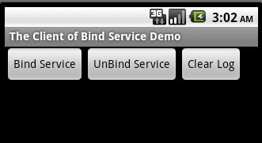 &nbsp;此時，所有的進程如下：

 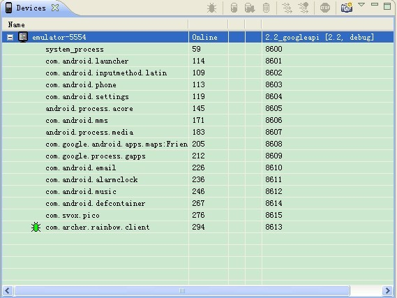 &nbsp;最下面的那個進程即為 BindServiceDemoClient 工程對應的進程，而且還沒有 BindServiceDemoService 工程的進程。下面，點擊 "Bind Service" 的按鈕，當執行下圖中的斷點時，請注意右上角 service 的類型(BindProxy)，這也從一個方面說明瞭為什麼在 IPC 的時候不可以使用 IBinder 來實現。

&nbsp; 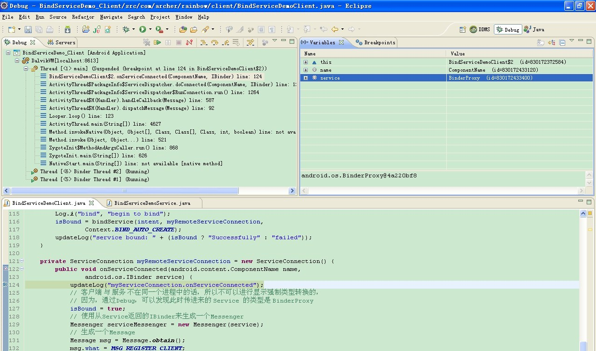 按F8繼續執行，會得到如下截圖：

 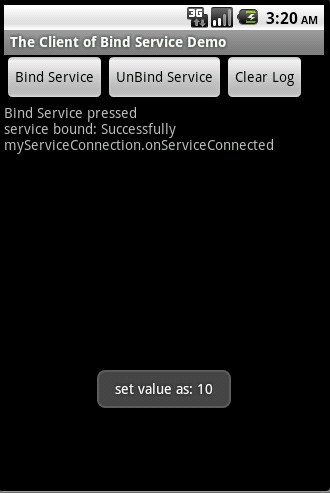 &nbsp;&nbsp;

此時，再來看一下系統中的進程情況：

 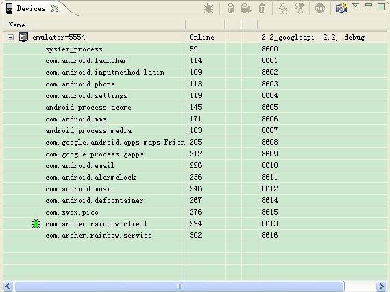 &nbsp;會發現，在最下面多了一個 BindServiceDemoService 工程的進程，這就說明瞭 client 與 service 是在不同的進程內的，這也正是本例子的意圖：使用 Messenger 在不同進程間進行通信。

&nbsp;

現在通過 DDMS 控制檯，直接將 com.archer.rainbow.service 進程殺掉，來模擬系統資源少而急需回收系統資源的情況，如下：

 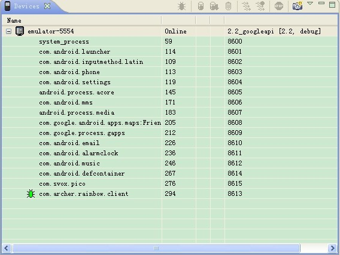 &nbsp;系統會輸出如下日誌：

  &nbsp;之後，當系統資源充足的時候，會自己重新啟動該進程，如下圖：

 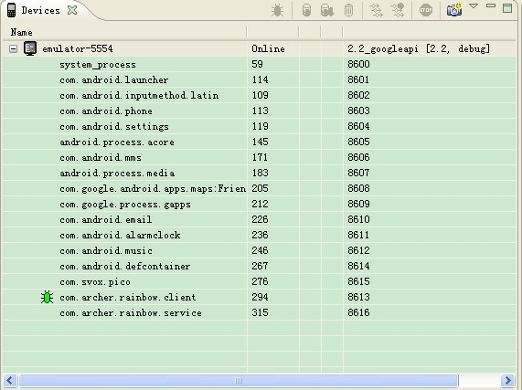 &nbsp;同時，系統輸出的日誌為：

 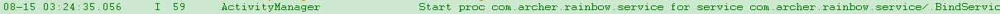

另外，需要注意的是，當我們通過界面點擊 "Unbind Service" 的時候，雖然服務被解綁了，但是系統並沒有立即將 com.archer.rainbow.service 這一進程給殺掉：

&nbsp; 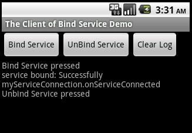 &nbsp; 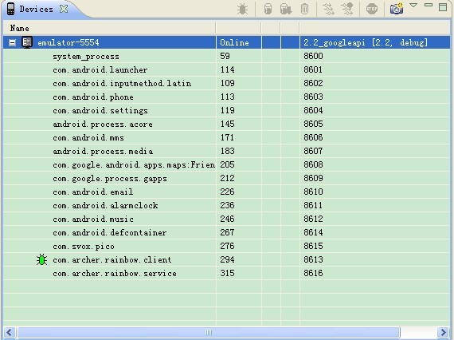 &nbsp;但若此時，通過 DDMS 控制檯，直接將該進程殺掉的話，系統也不會重新啟動該進程

 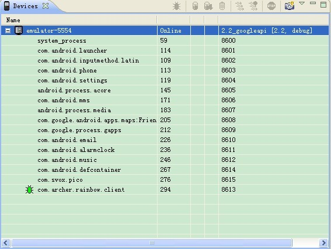 &nbsp;

  &nbsp;注意與上面對應的日誌進行比對，你會發現它少了 "Scheduling restart........" 的這條日誌。

&nbsp;

PS：若想將 service 在另一個進程中啟動，你也可以在聲明 Service 的時候，使用 "android:process=":remote"" 這種方式來實現。

  
