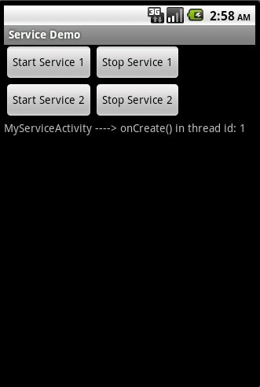
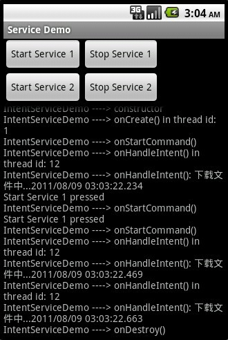

# android service 之二(IntentService)

    
不管是何种Service，它默认都是在应用程序的主线程（亦即UI线程）中运行的。所以，如果你的Service将要运行非常耗时或者可能被阻塞的操作时，你的应用程序将会被挂起，甚至会出现ANR错误。为了避免这一问题，你应该在Service中重新启动一个新的线程来进行这些操作。现有两种方法共大家参考：

① 直接在Service的onStartCommand()方法中重启一个线程来执行，如：

Java代码 <embed wmode="transparent" src="/javascripts/syntaxhighlighter/clipboard_new.swf" width="14" height="15" flashvars="clipboard=%40Override%0A%09public%20int%20onStartCommand(Intent%20intent%2C%20int%20flags%2C%20int%20startId)%20%7B%0A%09%09MyServiceActivity.updateLog(TAG%20%2B%20%22%20----%3E%20onStartCommand()%22)%3B%0A%09%09new%20Thread(new%20Runnable()%20%7B%0A%09%09%09%40Override%0A%09%09%09public%20void%20run()%20%7B%0A%09%09%09%09%2F%2F%20%E6%AD%A4%E5%A4%84%E8%BF%9B%E8%A1%8C%E8%80%97%E6%97%B6%E7%9A%84%E6%93%8D%E4%BD%9C%EF%BC%8C%E8%BF%99%E9%87%8C%E5%8F%AA%E6%98%AF%E7%AE%80%E5%8D%95%E5%9C%B0%E8%AE%A9%E7%BA%BF%E7%A8%8B%E7%9D%A1%E7%9C%A0%E4%BA%861s%0A%09%09%09%09try%20%7B%0A%09%09%09%09%09Thread.sleep(1000)%3B%0A%09%09%09%09%7D%20catch%20(Exception%20e)%20%7B%0A%09%09%09%09%09e.printStackTrace()%3B%0A%09%09%09%09%7D%0A%09%09%09%7D%0A%09%09%7D).start()%3B%0A%09%09return%20START_STICKY%3B%0A%09%7D" quality="high" allowscriptaccess="always" type="application/x-shockwave-flash" pluginspage="http://www.macromedia.com/go/getflashplayer">&nbsp;

<ol start="1" class="dp-j"><li>@Override&nbsp;&nbsp;</li><li>&nbsp;&nbsp;&nbsp;&nbsp;public&nbsp;int&nbsp;onStartCommand(Intent&nbsp;intent,&nbsp;int&nbsp;flags,&nbsp;int&nbsp;startId)&nbsp;{&nbsp;&nbsp;</li><li>&nbsp;&nbsp;&nbsp;&nbsp;&nbsp;&nbsp;&nbsp;&nbsp;MyServiceActivity.updateLog(TAG&nbsp;+&nbsp;"&nbsp;----&gt;&nbsp;onStartCommand()");&nbsp;&nbsp;</li><li>&nbsp;&nbsp;&nbsp;&nbsp;&nbsp;&nbsp;&nbsp;&nbsp;new&nbsp;Thread(new&nbsp;Runnable()&nbsp;{&nbsp;&nbsp;</li><li>&nbsp;&nbsp;&nbsp;&nbsp;&nbsp;&nbsp;&nbsp;&nbsp;&nbsp;&nbsp;&nbsp;&nbsp;@Override&nbsp;&nbsp;</li><li>&nbsp;&nbsp;&nbsp;&nbsp;&nbsp;&nbsp;&nbsp;&nbsp;&nbsp;&nbsp;&nbsp;&nbsp;public&nbsp;void&nbsp;run()&nbsp;{&nbsp;&nbsp;</li><li>&nbsp;&nbsp;&nbsp;&nbsp;&nbsp;&nbsp;&nbsp;&nbsp;&nbsp;&nbsp;&nbsp;&nbsp;&nbsp;&nbsp;&nbsp;&nbsp;//&nbsp;此处进行耗时的操作，这里只是简单地让线程睡眠了1s&nbsp;&nbsp;</li><li>&nbsp;&nbsp;&nbsp;&nbsp;&nbsp;&nbsp;&nbsp;&nbsp;&nbsp;&nbsp;&nbsp;&nbsp;&nbsp;&nbsp;&nbsp;&nbsp;try&nbsp;{&nbsp;&nbsp;</li><li>&nbsp;&nbsp;&nbsp;&nbsp;&nbsp;&nbsp;&nbsp;&nbsp;&nbsp;&nbsp;&nbsp;&nbsp;&nbsp;&nbsp;&nbsp;&nbsp;&nbsp;&nbsp;&nbsp;&nbsp;Thread.sleep(1000);&nbsp;&nbsp;</li><li>&nbsp;&nbsp;&nbsp;&nbsp;&nbsp;&nbsp;&nbsp;&nbsp;&nbsp;&nbsp;&nbsp;&nbsp;&nbsp;&nbsp;&nbsp;&nbsp;}&nbsp;catch&nbsp;(Exception&nbsp;e)&nbsp;{&nbsp;&nbsp;</li><li>&nbsp;&nbsp;&nbsp;&nbsp;&nbsp;&nbsp;&nbsp;&nbsp;&nbsp;&nbsp;&nbsp;&nbsp;&nbsp;&nbsp;&nbsp;&nbsp;&nbsp;&nbsp;&nbsp;&nbsp;e.printStackTrace();&nbsp;&nbsp;</li><li>&nbsp;&nbsp;&nbsp;&nbsp;&nbsp;&nbsp;&nbsp;&nbsp;&nbsp;&nbsp;&nbsp;&nbsp;&nbsp;&nbsp;&nbsp;&nbsp;}&nbsp;&nbsp;</li><li>&nbsp;&nbsp;&nbsp;&nbsp;&nbsp;&nbsp;&nbsp;&nbsp;&nbsp;&nbsp;&nbsp;&nbsp;}&nbsp;&nbsp;</li><li>&nbsp;&nbsp;&nbsp;&nbsp;&nbsp;&nbsp;&nbsp;&nbsp;}).start();&nbsp;&nbsp;</li><li>&nbsp;&nbsp;&nbsp;&nbsp;&nbsp;&nbsp;&nbsp;&nbsp;return&nbsp;START_STICKY;&nbsp;&nbsp;</li><li>&nbsp;&nbsp;&nbsp;&nbsp;}&nbsp;&nbsp;</li></ol>
<pre name="code" class="java" codeable_id="" codeable_type="BlogComment" source_url="http://rainbow702.iteye.com/blog/1143286#" pre_index="0" title="android service 之二(IntentService)" style="display: none;">@Override
	public int onStartCommand(Intent intent, int flags, int startId) {
		MyServiceActivity.updateLog(TAG + " ----&gt; onStartCommand()");
		new Thread(new Runnable() {
			@Override
			public void run() {
				// 此处进行耗时的操作，这里只是简单地让线程睡眠了1s
				try {
					Thread.sleep(1000);
				} catch (Exception e) {
					e.printStackTrace();
				}
			}
		}).start();
		return START_STICKY;
	}</pre>

&nbsp;② Android SDK 中为我们提供了一个现成的Service类来实现这个功能，它就是IntentService，它主要负责以下几个方面：

&nbsp;&nbsp;&nbsp; 

<li>Creates a default worker thread that executes all intents delivered to <code><a href="/reference/android/app/Service.html#onStartCommand(android.content.Intent,%20int,%20int)">onStartCommand()</a></code> separate from your application's main thread.</li>

&nbsp;&nbsp;&nbsp; 生成一个默认的且与主线程互相独立的工作者线程来执行所有传送至 onStartCommand() 方法的Intetnt

<li>Creates a work queue that passes one intent at a time to your <code><a href="/reference/android/app/IntentService.html#onHandleIntent(android.content.Intent)">onHandleIntent()</a></code> implementation, so you never have to worry about multi-threading.</li>

&nbsp;&nbsp;&nbsp; 生成一个工作队列来传送Intent对象给你的onHandleIntent()方法，同一时刻只传送一个Intent对象，这样一来，你就不必担心多线程的问题。

<li>Stops the service after all start requests have been handled, so you never have to call <code><a href="/reference/android/app/Service.html#stopSelf()">stopSelf()</a></code>.</li>

&nbsp;&nbsp;&nbsp; 在所有的请求(Intent)都被执行完以后会自动停止服务，所以，你不需要自己去调用stopSelf()方法来停止该服务

<li>Provides default implementation of <code><a href="/reference/android/app/IntentService.html#onBind(android.content.Intent)">onBind()</a></code> that returns null.</li>

&nbsp;&nbsp;&nbsp; 提供了一个onBind()方法的默认实现，它返回null

<li>Provides a default implementation of <code><a href="/reference/android/app/IntentService.html#onStartCommand(android.content.Intent,%20int,%20int)">onStartCommand()</a></code> that sends the intent to the work queue and then to your <code><a href="/reference/android/app/IntentService.html#onHandleIntent(android.content.Intent)">onHandleIntent()</a></code> implementation</li>

&nbsp;&nbsp;&nbsp; 提供了一个onStartCommand()方法的默认实现，它将Intent先传送至工作队列，然后从工作队列中每次取出一个传送至onHandleIntent()方法，在该方法中对Intent对相应的处理

&nbsp;

以上，英文来自官方SDK，中文为我所译。

&nbsp;

从以上看来，你所需要做的就是实现 onHandleIntent() 方法，在该方法内实现你想进行的操作。另外，继承IntentService时，你必须提供一个无参构造函数，且在该构造函数内，你需要调用父类的构造函数，如下：

Java代码 <embed wmode="transparent" src="/javascripts/syntaxhighlighter/clipboard_new.swf" width="14" height="15" flashvars="clipboard=public%20HelloIntentService()%20%7B%20%20%20%20%20%20%0A%20%20%20%20super(%22HelloIntentService%22)%3B%20%20%0A%7D%0A" quality="high" allowscriptaccess="always" type="application/x-shockwave-flash" pluginspage="http://www.macromedia.com/go/getflashplayer">&nbsp;

<ol start="1" class="dp-j"><li>public&nbsp;HelloIntentService()&nbsp;{&nbsp;&nbsp;&nbsp;&nbsp;&nbsp;&nbsp;&nbsp;&nbsp;</li><li>&nbsp;&nbsp;&nbsp;&nbsp;super("HelloIntentService");&nbsp;&nbsp;&nbsp;&nbsp;</li><li>}&nbsp;&nbsp;</li></ol>
<pre name="code" class="java" codeable_id="" codeable_type="BlogComment" source_url="http://rainbow702.iteye.com/blog/1143286#" pre_index="1" title="android service 之二(IntentService)" style="display: none;">public HelloIntentService() {      
    super("HelloIntentService");  
}
</pre>

&nbsp;&nbsp;

下面给出一例，来解释一下：

Java代码 <embed wmode="transparent" src="/javascripts/syntaxhighlighter/clipboard_new.swf" width="14" height="15" flashvars="clipboard=%2F%2F%20activity%20%E7%9A%84onCreate()%0A%40Override%0A%09public%20void%20onCreate(Bundle%20savedInstanceState)%20%7B%0A%09%09super.onCreate(savedInstanceState)%3B%0A%09%09setContentView(R.layout.main)%3B%0A%0A%09%09startSer1%20%3D%20(Button)%20findViewById(R.id.startSer1)%3B%0A%09%09stopSer1%20%3D%20(Button)%20findViewById(R.id.stopSer1)%3B%0A%0A%09%09startSer2%20%3D%20(Button)%20findViewById(R.id.startSer2)%3B%0A%09%09stopSer2%20%3D%20(Button)%20findViewById(R.id.stopSer2)%3B%0A%0A%09%09log%20%3D%20(TextView)%20findViewById(R.id.log)%3B%0A%0A%09%09logView%20%3D%20(ScrollView)%20findViewById(R.id.logView)%3B%0A%0A%09%09startSer1.setOnClickListener(btnListener)%3B%0A%09%09stopSer1.setOnClickListener(btnListener)%3B%0A%0A%09%09startSer2.setOnClickListener(btnListener)%3B%0A%09%09stopSer2.setOnClickListener(btnListener)%3B%0A%0A%09%09intent%20%3D%20new%20Intent(MyServiceActivity.this%2C%20IntentServiceDemo.class)%3B%0A%0A%09%09%2F%2F%20%E6%89%93%E5%8D%B0%E5%87%BA%E4%B8%BB%E7%BA%BF%E7%A8%8B%E7%9A%84ID%0A%09%09long%20id%20%3D%20Thread.currentThread().getId()%3B%0A%09%09updateLog(TAG%20%2B%20%22%20----%3E%20onCreate()%20in%20thread%20id%3A%20%22%20%2B%20id)%3B%0A%09%7D" quality="high" allowscriptaccess="always" type="application/x-shockwave-flash" pluginspage="http://www.macromedia.com/go/getflashplayer">&nbsp;

<ol start="1" class="dp-j"><li>//&nbsp;activity&nbsp;的onCreate()&nbsp;&nbsp;</li><li>@Override&nbsp;&nbsp;</li><li>&nbsp;&nbsp;&nbsp;&nbsp;public&nbsp;void&nbsp;onCreate(Bundle&nbsp;savedInstanceState)&nbsp;{&nbsp;&nbsp;</li><li>&nbsp;&nbsp;&nbsp;&nbsp;&nbsp;&nbsp;&nbsp;&nbsp;super.onCreate(savedInstanceState);&nbsp;&nbsp;</li><li>&nbsp;&nbsp;&nbsp;&nbsp;&nbsp;&nbsp;&nbsp;&nbsp;setContentView(R.layout.main);&nbsp;&nbsp;</li><li>&nbsp;&nbsp;</li><li>&nbsp;&nbsp;&nbsp;&nbsp;&nbsp;&nbsp;&nbsp;&nbsp;startSer1&nbsp;=&nbsp;(Button)&nbsp;findViewById(R.id.startSer1);&nbsp;&nbsp;</li><li>&nbsp;&nbsp;&nbsp;&nbsp;&nbsp;&nbsp;&nbsp;&nbsp;stopSer1&nbsp;=&nbsp;(Button)&nbsp;findViewById(R.id.stopSer1);&nbsp;&nbsp;</li><li>&nbsp;&nbsp;</li><li>&nbsp;&nbsp;&nbsp;&nbsp;&nbsp;&nbsp;&nbsp;&nbsp;startSer2&nbsp;=&nbsp;(Button)&nbsp;findViewById(R.id.startSer2);&nbsp;&nbsp;</li><li>&nbsp;&nbsp;&nbsp;&nbsp;&nbsp;&nbsp;&nbsp;&nbsp;stopSer2&nbsp;=&nbsp;(Button)&nbsp;findViewById(R.id.stopSer2);&nbsp;&nbsp;</li><li>&nbsp;&nbsp;</li><li>&nbsp;&nbsp;&nbsp;&nbsp;&nbsp;&nbsp;&nbsp;&nbsp;log&nbsp;=&nbsp;(TextView)&nbsp;findViewById(R.id.log);&nbsp;&nbsp;</li><li>&nbsp;&nbsp;</li><li>&nbsp;&nbsp;&nbsp;&nbsp;&nbsp;&nbsp;&nbsp;&nbsp;logView&nbsp;=&nbsp;(ScrollView)&nbsp;findViewById(R.id.logView);&nbsp;&nbsp;</li><li>&nbsp;&nbsp;</li><li>&nbsp;&nbsp;&nbsp;&nbsp;&nbsp;&nbsp;&nbsp;&nbsp;startSer1.setOnClickListener(btnListener);&nbsp;&nbsp;</li><li>&nbsp;&nbsp;&nbsp;&nbsp;&nbsp;&nbsp;&nbsp;&nbsp;stopSer1.setOnClickListener(btnListener);&nbsp;&nbsp;</li><li>&nbsp;&nbsp;</li><li>&nbsp;&nbsp;&nbsp;&nbsp;&nbsp;&nbsp;&nbsp;&nbsp;startSer2.setOnClickListener(btnListener);&nbsp;&nbsp;</li><li>&nbsp;&nbsp;&nbsp;&nbsp;&nbsp;&nbsp;&nbsp;&nbsp;stopSer2.setOnClickListener(btnListener);&nbsp;&nbsp;</li><li>&nbsp;&nbsp;</li><li>&nbsp;&nbsp;&nbsp;&nbsp;&nbsp;&nbsp;&nbsp;&nbsp;intent&nbsp;=&nbsp;new&nbsp;Intent(MyServiceActivity.this,&nbsp;IntentServiceDemo.class);&nbsp;&nbsp;</li><li>&nbsp;&nbsp;</li><li>&nbsp;&nbsp;&nbsp;&nbsp;&nbsp;&nbsp;&nbsp;&nbsp;//&nbsp;打印出主线程的ID&nbsp;&nbsp;</li><li>&nbsp;&nbsp;&nbsp;&nbsp;&nbsp;&nbsp;&nbsp;&nbsp;long&nbsp;id&nbsp;=&nbsp;Thread.currentThread().getId();&nbsp;&nbsp;</li><li>&nbsp;&nbsp;&nbsp;&nbsp;&nbsp;&nbsp;&nbsp;&nbsp;updateLog(TAG&nbsp;+&nbsp;"&nbsp;----&gt;&nbsp;onCreate()&nbsp;in&nbsp;thread&nbsp;id:&nbsp;"&nbsp;+&nbsp;id);&nbsp;&nbsp;</li><li>&nbsp;&nbsp;&nbsp;&nbsp;}&nbsp;&nbsp;</li></ol>
<pre name="code" class="java" codeable_id="" codeable_type="BlogComment" source_url="http://rainbow702.iteye.com/blog/1143286#" pre_index="2" title="android service 之二(IntentService)" style="display: none;">// activity 的onCreate()
@Override
	public void onCreate(Bundle savedInstanceState) {
		super.onCreate(savedInstanceState);
		setContentView(R.layout.main);

		startSer1 = (Button) findViewById(R.id.startSer1);
		stopSer1 = (Button) findViewById(R.id.stopSer1);

		startSer2 = (Button) findViewById(R.id.startSer2);
		stopSer2 = (Button) findViewById(R.id.stopSer2);

		log = (TextView) findViewById(R.id.log);

		logView = (ScrollView) findViewById(R.id.logView);

		startSer1.setOnClickListener(btnListener);
		stopSer1.setOnClickListener(btnListener);

		startSer2.setOnClickListener(btnListener);
		stopSer2.setOnClickListener(btnListener);

		intent = new Intent(MyServiceActivity.this, IntentServiceDemo.class);

		// 打印出主线程的ID
		long id = Thread.currentThread().getId();
		updateLog(TAG + " ----&gt; onCreate() in thread id: " + id);
	}</pre>

&nbsp;

Java代码 <embed wmode="transparent" src="/javascripts/syntaxhighlighter/clipboard_new.swf" width="14" height="15" flashvars="clipboard=%2F%2F%20service%20%E4%BB%A3%E7%A0%81%0Apackage%20com.archer.rainbow%3B%0A%0Aimport%20java.text.SimpleDateFormat%3B%0Aimport%20java.util.Date%3B%0A%0Aimport%20android.app.IntentService%3B%0Aimport%20android.content.Intent%3B%0A%0Apublic%20class%20IntentServiceDemo%20extends%20IntentService%20%7B%0A%09private%20static%20final%20String%20TAG%20%3D%20%22IntentServiceDemo%22%3B%0A%09private%20static%20final%20SimpleDateFormat%20SDF_DATE_FORMAT%20%3D%20new%20SimpleDateFormat(%22yyyy%2FMM%2Fdd%20hh%3Amm%3Ass.SSS%22)%3B%0A%0A%09public%20IntentServiceDemo()%20%7B%0A%09%09super(TAG)%3B%0A%09%09MyServiceActivity.updateLog(TAG%20%2B%20%22%20----%3E%20constructor%22)%3B%0A%09%7D%0A%0A%09%40Override%0A%09public%20void%20onCreate()%20%7B%0A%09%09super.onCreate()%3B%0A%0A%09%09%2F%2F%20%E6%89%93%E5%8D%B0%E5%87%BA%E8%AF%A5Service%E6%89%80%E5%9C%A8%E7%BA%BF%E7%A8%8B%E7%9A%84ID%0A%09%09long%20id%20%3D%20Thread.currentThread().getId()%3B%0A%09%09MyServiceActivity.updateLog(TAG%20%2B%20%22%20----%3E%20onCreate()%20in%20thread%20id%3A%20%22%0A%09%09%09%09%2B%20id)%3B%0A%09%7D%0A%0A%09%40Override%0A%09public%20void%20onDestroy()%20%7B%0A%09%09super.onDestroy()%3B%0A%09%09MyServiceActivity.updateLog(TAG%20%2B%20%22%20----%3E%20onDestroy()%22)%3B%0A%09%7D%0A%0A%09%40Override%0A%09public%20int%20onStartCommand(Intent%20intent%2C%20int%20flags%2C%20int%20startId)%20%7B%0A%09%09MyServiceActivity.updateLog(TAG%20%2B%20%22%20----%3E%20onStartCommand()%22)%3B%0A%09%09%2F%2F%20%E8%AE%B0%E5%BD%95%E5%8F%91%E9%80%81%E6%AD%A4%E8%AF%B7%E6%B1%82%E7%9A%84%E6%97%B6%E9%97%B4%0A%09%09intent.putExtra(%22time%22%2C%20System.currentTimeMillis())%3B%0A%09%09return%20super.onStartCommand(intent%2C%20flags%2C%20startId)%3B%0A%09%7D%0A%0A%09%40Override%0A%09public%20void%20setIntentRedelivery(boolean%20enabled)%20%7B%0A%09%09MyServiceActivity.updateLog(TAG%20%2B%20%22%20----%3E%20setIntentRedelivery()%22)%3B%0A%09%09super.setIntentRedelivery(enabled)%3B%0A%09%7D%0A%0A%09%40Override%0A%09protected%20void%20onHandleIntent(Intent%20intent)%20%7B%0A%09%09%2F%2F%20%E6%89%93%E5%8D%B0%E5%87%BA%E5%A4%84%E7%90%86intent%E6%89%80%E7%94%A8%E7%9A%84%E7%BA%BF%E7%A8%8B%E7%9A%84ID%0A%09%09long%20id%20%3D%20Thread.currentThread().getId()%3B%0A%09%09MyServiceActivity.updateLog(TAG%0A%09%09%09%09%2B%20%22%20----%3E%20onHandleIntent()%20in%20thread%20id%3A%20%22%20%2B%20id)%3B%0A%09%09long%20time%20%3D%20intent.getLongExtra(%22time%22%2C%200)%3B%0A%09%09Date%20date%20%3D%20new%20Date(time)%3B%0A%09%09try%20%7B%0A%09%09%09%2F%2F%20%E6%89%93%E5%8D%B0%E5%87%BA%E6%AF%8F%E4%B8%AA%E8%AF%B7%E6%B1%82%E5%AF%B9%E5%BA%94%E7%9A%84%E8%A7%A6%E5%8F%91%E6%97%B6%E9%97%B4%0A%09%09%09MyServiceActivity.updateLog(TAG%0A%09%09%09%09%09%2B%20%22%20----%3E%20onHandleIntent()%3A%20%E4%B8%8B%E8%BD%BD%E6%96%87%E4%BB%B6%E4%B8%AD...%22%20%2B%20SDF_DATE_FORMAT.format(date))%3B%0A%09%09%09Thread.sleep(3000)%3B%0A%09%09%7D%20catch%20(InterruptedException%20e)%20%7B%0A%09%09%09e.printStackTrace()%3B%0A%09%09%7D%0A%09%7D%0A%0A%7D" quality="high" allowscriptaccess="always" type="application/x-shockwave-flash" pluginspage="http://www.macromedia.com/go/getflashplayer">&nbsp;

<ol start="1" class="dp-j"><li>//&nbsp;service&nbsp;代码&nbsp;&nbsp;</li><li>package&nbsp;com.archer.rainbow;&nbsp;&nbsp;</li><li>&nbsp;&nbsp;</li><li>import&nbsp;java.text.SimpleDateFormat;&nbsp;&nbsp;</li><li>import&nbsp;java.util.Date;&nbsp;&nbsp;</li><li>&nbsp;&nbsp;</li><li>import&nbsp;android.app.IntentService;&nbsp;&nbsp;</li><li>import&nbsp;android.content.Intent;&nbsp;&nbsp;</li><li>&nbsp;&nbsp;</li><li>public&nbsp;class&nbsp;IntentServiceDemo&nbsp;extends&nbsp;IntentService&nbsp;{&nbsp;&nbsp;</li><li>&nbsp;&nbsp;&nbsp;&nbsp;private&nbsp;static&nbsp;final&nbsp;String&nbsp;TAG&nbsp;=&nbsp;"IntentServiceDemo";&nbsp;&nbsp;</li><li>&nbsp;&nbsp;&nbsp;&nbsp;private&nbsp;static&nbsp;final&nbsp;SimpleDateFormat&nbsp;SDF_DATE_FORMAT&nbsp;=&nbsp;new&nbsp;SimpleDateFormat("yyyy/MM/dd&nbsp;hh:mm:ss.SSS");&nbsp;&nbsp;</li><li>&nbsp;&nbsp;</li><li>&nbsp;&nbsp;&nbsp;&nbsp;public&nbsp;IntentServiceDemo()&nbsp;{&nbsp;&nbsp;</li><li>&nbsp;&nbsp;&nbsp;&nbsp;&nbsp;&nbsp;&nbsp;&nbsp;super(TAG);&nbsp;&nbsp;</li><li>&nbsp;&nbsp;&nbsp;&nbsp;&nbsp;&nbsp;&nbsp;&nbsp;MyServiceActivity.updateLog(TAG&nbsp;+&nbsp;"&nbsp;----&gt;&nbsp;constructor");&nbsp;&nbsp;</li><li>&nbsp;&nbsp;&nbsp;&nbsp;}&nbsp;&nbsp;</li><li>&nbsp;&nbsp;</li><li>&nbsp;&nbsp;&nbsp;&nbsp;@Override&nbsp;&nbsp;</li><li>&nbsp;&nbsp;&nbsp;&nbsp;public&nbsp;void&nbsp;onCreate()&nbsp;{&nbsp;&nbsp;</li><li>&nbsp;&nbsp;&nbsp;&nbsp;&nbsp;&nbsp;&nbsp;&nbsp;super.onCreate();&nbsp;&nbsp;</li><li>&nbsp;&nbsp;</li><li>&nbsp;&nbsp;&nbsp;&nbsp;&nbsp;&nbsp;&nbsp;&nbsp;//&nbsp;打印出该Service所在线程的ID&nbsp;&nbsp;</li><li>&nbsp;&nbsp;&nbsp;&nbsp;&nbsp;&nbsp;&nbsp;&nbsp;long&nbsp;id&nbsp;=&nbsp;Thread.currentThread().getId();&nbsp;&nbsp;</li><li>&nbsp;&nbsp;&nbsp;&nbsp;&nbsp;&nbsp;&nbsp;&nbsp;MyServiceActivity.updateLog(TAG&nbsp;+&nbsp;"&nbsp;----&gt;&nbsp;onCreate()&nbsp;in&nbsp;thread&nbsp;id:&nbsp;"&nbsp;&nbsp;</li><li>&nbsp;&nbsp;&nbsp;&nbsp;&nbsp;&nbsp;&nbsp;&nbsp;&nbsp;&nbsp;&nbsp;&nbsp;&nbsp;&nbsp;&nbsp;&nbsp;+&nbsp;id);&nbsp;&nbsp;</li><li>&nbsp;&nbsp;&nbsp;&nbsp;}&nbsp;&nbsp;</li><li>&nbsp;&nbsp;</li><li>&nbsp;&nbsp;&nbsp;&nbsp;@Override&nbsp;&nbsp;</li><li>&nbsp;&nbsp;&nbsp;&nbsp;public&nbsp;void&nbsp;onDestroy()&nbsp;{&nbsp;&nbsp;</li><li>&nbsp;&nbsp;&nbsp;&nbsp;&nbsp;&nbsp;&nbsp;&nbsp;super.onDestroy();&nbsp;&nbsp;</li><li>&nbsp;&nbsp;&nbsp;&nbsp;&nbsp;&nbsp;&nbsp;&nbsp;MyServiceActivity.updateLog(TAG&nbsp;+&nbsp;"&nbsp;----&gt;&nbsp;onDestroy()");&nbsp;&nbsp;</li><li>&nbsp;&nbsp;&nbsp;&nbsp;}&nbsp;&nbsp;</li><li>&nbsp;&nbsp;</li><li>&nbsp;&nbsp;&nbsp;&nbsp;@Override&nbsp;&nbsp;</li><li>&nbsp;&nbsp;&nbsp;&nbsp;public&nbsp;int&nbsp;onStartCommand(Intent&nbsp;intent,&nbsp;int&nbsp;flags,&nbsp;int&nbsp;startId)&nbsp;{&nbsp;&nbsp;</li><li>&nbsp;&nbsp;&nbsp;&nbsp;&nbsp;&nbsp;&nbsp;&nbsp;MyServiceActivity.updateLog(TAG&nbsp;+&nbsp;"&nbsp;----&gt;&nbsp;onStartCommand()");&nbsp;&nbsp;</li><li>&nbsp;&nbsp;&nbsp;&nbsp;&nbsp;&nbsp;&nbsp;&nbsp;//&nbsp;记录发送此请求的时间&nbsp;&nbsp;</li><li>&nbsp;&nbsp;&nbsp;&nbsp;&nbsp;&nbsp;&nbsp;&nbsp;intent.putExtra("time",&nbsp;System.currentTimeMillis());&nbsp;&nbsp;</li><li>&nbsp;&nbsp;&nbsp;&nbsp;&nbsp;&nbsp;&nbsp;&nbsp;return&nbsp;super.onStartCommand(intent,&nbsp;flags,&nbsp;startId);&nbsp;&nbsp;</li><li>&nbsp;&nbsp;&nbsp;&nbsp;}&nbsp;&nbsp;</li><li>&nbsp;&nbsp;</li><li>&nbsp;&nbsp;&nbsp;&nbsp;@Override&nbsp;&nbsp;</li><li>&nbsp;&nbsp;&nbsp;&nbsp;public&nbsp;void&nbsp;setIntentRedelivery(boolean&nbsp;enabled)&nbsp;{&nbsp;&nbsp;</li><li>&nbsp;&nbsp;&nbsp;&nbsp;&nbsp;&nbsp;&nbsp;&nbsp;MyServiceActivity.updateLog(TAG&nbsp;+&nbsp;"&nbsp;----&gt;&nbsp;setIntentRedelivery()");&nbsp;&nbsp;</li><li>&nbsp;&nbsp;&nbsp;&nbsp;&nbsp;&nbsp;&nbsp;&nbsp;super.setIntentRedelivery(enabled);&nbsp;&nbsp;</li><li>&nbsp;&nbsp;&nbsp;&nbsp;}&nbsp;&nbsp;</li><li>&nbsp;&nbsp;</li><li>&nbsp;&nbsp;&nbsp;&nbsp;@Override&nbsp;&nbsp;</li><li>&nbsp;&nbsp;&nbsp;&nbsp;protected&nbsp;void&nbsp;onHandleIntent(Intent&nbsp;intent)&nbsp;{&nbsp;&nbsp;</li><li>&nbsp;&nbsp;&nbsp;&nbsp;&nbsp;&nbsp;&nbsp;&nbsp;//&nbsp;打印出处理intent所用的线程的ID&nbsp;&nbsp;</li><li>&nbsp;&nbsp;&nbsp;&nbsp;&nbsp;&nbsp;&nbsp;&nbsp;long&nbsp;id&nbsp;=&nbsp;Thread.currentThread().getId();&nbsp;&nbsp;</li><li>&nbsp;&nbsp;&nbsp;&nbsp;&nbsp;&nbsp;&nbsp;&nbsp;MyServiceActivity.updateLog(TAG&nbsp;&nbsp;</li><li>&nbsp;&nbsp;&nbsp;&nbsp;&nbsp;&nbsp;&nbsp;&nbsp;&nbsp;&nbsp;&nbsp;&nbsp;&nbsp;&nbsp;&nbsp;&nbsp;+&nbsp;"&nbsp;----&gt;&nbsp;onHandleIntent()&nbsp;in&nbsp;thread&nbsp;id:&nbsp;"&nbsp;+&nbsp;id);&nbsp;&nbsp;</li><li>&nbsp;&nbsp;&nbsp;&nbsp;&nbsp;&nbsp;&nbsp;&nbsp;long&nbsp;time&nbsp;=&nbsp;intent.getLongExtra("time",&nbsp;0);&nbsp;&nbsp;</li><li>&nbsp;&nbsp;&nbsp;&nbsp;&nbsp;&nbsp;&nbsp;&nbsp;Date&nbsp;date&nbsp;=&nbsp;new&nbsp;Date(time);&nbsp;&nbsp;</li><li>&nbsp;&nbsp;&nbsp;&nbsp;&nbsp;&nbsp;&nbsp;&nbsp;try&nbsp;{&nbsp;&nbsp;</li><li>&nbsp;&nbsp;&nbsp;&nbsp;&nbsp;&nbsp;&nbsp;&nbsp;&nbsp;&nbsp;&nbsp;&nbsp;//&nbsp;打印出每个请求对应的触发时间&nbsp;&nbsp;</li><li>&nbsp;&nbsp;&nbsp;&nbsp;&nbsp;&nbsp;&nbsp;&nbsp;&nbsp;&nbsp;&nbsp;&nbsp;MyServiceActivity.updateLog(TAG&nbsp;&nbsp;</li><li>&nbsp;&nbsp;&nbsp;&nbsp;&nbsp;&nbsp;&nbsp;&nbsp;&nbsp;&nbsp;&nbsp;&nbsp;&nbsp;&nbsp;&nbsp;&nbsp;&nbsp;&nbsp;&nbsp;&nbsp;+&nbsp;"&nbsp;----&gt;&nbsp;onHandleIntent():&nbsp;下载文件中..."&nbsp;+&nbsp;SDF_DATE_FORMAT.format(date));&nbsp;&nbsp;</li><li>&nbsp;&nbsp;&nbsp;&nbsp;&nbsp;&nbsp;&nbsp;&nbsp;&nbsp;&nbsp;&nbsp;&nbsp;Thread.sleep(3000);&nbsp;&nbsp;</li><li>&nbsp;&nbsp;&nbsp;&nbsp;&nbsp;&nbsp;&nbsp;&nbsp;}&nbsp;catch&nbsp;(InterruptedException&nbsp;e)&nbsp;{&nbsp;&nbsp;</li><li>&nbsp;&nbsp;&nbsp;&nbsp;&nbsp;&nbsp;&nbsp;&nbsp;&nbsp;&nbsp;&nbsp;&nbsp;e.printStackTrace();&nbsp;&nbsp;</li><li>&nbsp;&nbsp;&nbsp;&nbsp;&nbsp;&nbsp;&nbsp;&nbsp;}&nbsp;&nbsp;</li><li>&nbsp;&nbsp;&nbsp;&nbsp;}&nbsp;&nbsp;</li><li>&nbsp;&nbsp;</li><li>}&nbsp;&nbsp;</li></ol>
<pre name="code" class="java" codeable_id="" codeable_type="BlogComment" source_url="http://rainbow702.iteye.com/blog/1143286#" pre_index="3" title="android service 之二(IntentService)" style="display: none;">// service 代码
package com.archer.rainbow;

import java.text.SimpleDateFormat;
import java.util.Date;

import android.app.IntentService;
import android.content.Intent;

public class IntentServiceDemo extends IntentService {
	private static final String TAG = "IntentServiceDemo";
	private static final SimpleDateFormat SDF_DATE_FORMAT = new SimpleDateFormat("yyyy/MM/dd hh:mm:ss.SSS");

	public IntentServiceDemo() {
		super(TAG);
		MyServiceActivity.updateLog(TAG + " ----&gt; constructor");
	}

	@Override
	public void onCreate() {
		super.onCreate();

		// 打印出该Service所在线程的ID
		long id = Thread.currentThread().getId();
		MyServiceActivity.updateLog(TAG + " ----&gt; onCreate() in thread id: "
				+ id);
	}

	@Override
	public void onDestroy() {
		super.onDestroy();
		MyServiceActivity.updateLog(TAG + " ----&gt; onDestroy()");
	}

	@Override
	public int onStartCommand(Intent intent, int flags, int startId) {
		MyServiceActivity.updateLog(TAG + " ----&gt; onStartCommand()");
		// 记录发送此请求的时间
		intent.putExtra("time", System.currentTimeMillis());
		return super.onStartCommand(intent, flags, startId);
	}

	@Override
	public void setIntentRedelivery(boolean enabled) {
		MyServiceActivity.updateLog(TAG + " ----&gt; setIntentRedelivery()");
		super.setIntentRedelivery(enabled);
	}

	@Override
	protected void onHandleIntent(Intent intent) {
		// 打印出处理intent所用的线程的ID
		long id = Thread.currentThread().getId();
		MyServiceActivity.updateLog(TAG
				+ " ----&gt; onHandleIntent() in thread id: " + id);
		long time = intent.getLongExtra("time", 0);
		Date date = new Date(time);
		try {
			// 打印出每个请求对应的触发时间
			MyServiceActivity.updateLog(TAG
					+ " ----&gt; onHandleIntent(): 下载文件中..." + SDF_DATE_FORMAT.format(date));
			Thread.sleep(3000);
		} catch (InterruptedException e) {
			e.printStackTrace();
		}
	}

}</pre>

&nbsp;应用启动时，界面如下：

   &nbsp;从此图可以看出，主线程（UI线程）的ID是1。接，连续点击三次Start Service 1 按钮，得如下画面：

  &nbsp;  &nbsp;从此图中可以看出，IntentServiceDemo的onCreate()所处的线程ID仍为1，说明它是在主线程中被执行的，且只被执行一次。然后，我每点击一次按钮，它都会触发一下onStartCommand()方法。仔细看第二次与第三次的onCommand()方法以及onHandleIntent()打印出来的语句，你会发现，第二、三两次点击按钮与第一次点击按钮的时间是没有超过3秒钟的，它们是连续被执行的，这说明了什么呢？说明，在第一个intent被处理时(即onHandleIntent()处于运行中)，该Service仍然可以接受新的请求，但接受到新的请求后并没有立即执行，而是将它们放入了工作队列中，等待被执行。

&nbsp;

这就是 IntentService 的简单用法。但你若是想在Service中让多个线程并发的话，就得另想法子喽。比如，使用第一种方法，在Service内部起多个线程，但是这样的话，你可要处理好线程的同步哦~~~&nbsp;

&nbsp;

  
