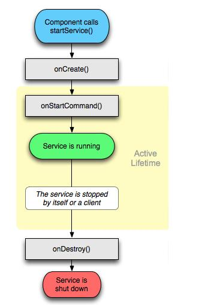
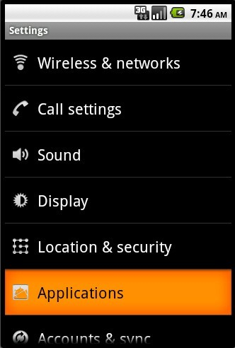
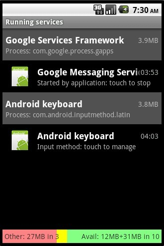
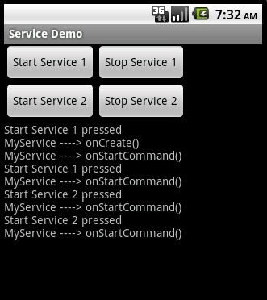
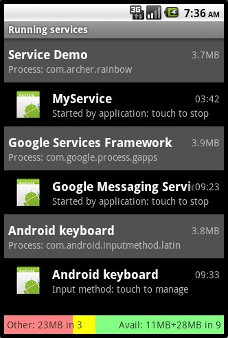
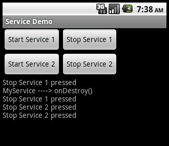
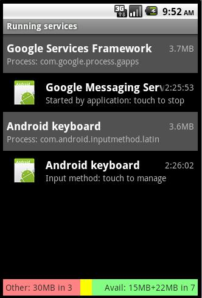

# android service 之一 (start service)

    
&nbsp;我們有兩種方式（start與bind）啟動一個Service,每一種方式啟動的Service生命週期是不一樣的，這篇貼子主要寫的是 start service。

它的生命週期中只有三個階段：onCreate, onStartCommand(取代原來的onStart方法), onDestroy。如下圖：

  &nbsp;

需要注意的有：

①&nbsp;如果是 調用者 直接退出而沒有調用 stopService 的話，那麼被啟動的 Service 會一直在後臺運行，直至其stopService 方法被調用，或者它自己調用stopSelf 方法。

② 在服務未被創建時，系統會先調用服務的onCreate()方法，接著調用onStartCommand()方法。如果調用startService()方法前服務已經被創建，那麼會直接調用onStartCommand()方法。也就是說，多次調用startService()方法並不會導致多次創建服務。另外，不管被 start 多少次，只需一次 stop 便可將相應的service關閉。 ③ 具體的操作應該放在 onStartCommand()&nbsp;裡面 以下通過截圖來看：

  上圖的中的四個按鈕均是針對於同一個Service進行的操作，此時去 application ，可以查看到 "Running Service" 的列表如下：

  &nbsp;

  &nbsp;

這個，我們去點擊上面的按鈕（分別點擊startservice 1 和 2 各兩次），結果如下：

  &nbsp;從圖中，我們可以看出， onCreate() 方法只在第一次創建服務的時候被調用了。

現在，通過“返回鍵”來退回至主界面，然後再去 application 的 running service中去查看，可得下面的截圖：

  &nbsp;從此圖中，我們可以看出，雖然Activity被finish掉了，但是由它啟動的service仍然在後臺運行著。

此時，重新打開該應用，然後直接點擊 stop service 1 和 2 按鈕各兩次（不需再新點擊 start service按鈕），可以如下截圖：

  &nbsp;從此圖中我們可以看出，只有第一次停止服務的時候，才會調用 onDestroy() 方法。

此時，再去 application 的 running service中去查看，可得下面的截圖，發現服務確實已經被停止了：

  &nbsp;

下面附上部分源碼（具體地請參見附件）：

Java代碼 <embed wmode="transparent" src="/javascripts/syntaxhighlighter/clipboard_new.swf" width="14" height="15" flashvars="clipboard=%2F%2F%20%E5%9B%9B%E4%B8%AA%E6%8C%89%E9%92%AE%E7%9A%84%E5%93%8D%E5%BA%94%E4%BA%8B%E4%BB%B6%0A%0Aprivate%20OnClickListener%20btnListener%20%3D%20new%20OnClickListener()%20%7B%0A%09%09%40Override%0A%09%09public%20void%20onClick(View%20v)%20%7B%0A%09%09%09switch%20(v.getId())%20%7B%0A%09%09%09%09case%20R.id.startSer1%3A%0A%09%09%09%09%09updateLog(%22Start%20Service%201%20pressed%22)%3B%0A%20%20%20%20%20%20%20%20%20%20%20%20%20%20%20%20%20%20%20%20%20%2F%2F%20%E5%90%AF%E5%8A%A8%E6%9C%8D%E5%8A%A1(%E5%A6%82%E6%9E%9C%E6%83%B3%E4%BC%A0%E9%80%92%E6%95%B0%E6%8D%AE%EF%BC%8C%E4%B9%9F%E5%8F%AF%E4%BB%A5%E5%B0%86%E5%85%B6%E5%B0%81%E8%A3%85%E8%BF%9B%E8%AF%A5intent)%0A%09%09%09%09%09startService(intent)%3B%0A%09%09%09%09%09break%3B%0A%09%09%09%09case%20R.id.startSer2%3A%0A%09%09%09%09%09updateLog(%22Start%20Service%202%20pressed%22)%3B%0A%09%09%09%09%09startService(intent)%3B%0A%09%09%09%09%09break%3B%0A%09%09%09%09case%20R.id.stopSer1%3A%0A%09%09%09%09%09updateLog(%22Stop%20Service%201%20pressed%22)%3B%0A%20%20%20%20%20%20%20%20%20%20%20%20%20%20%20%20%20%20%20%20%2F%2F%20%E5%81%9C%E6%AD%A2%E6%9C%8D%E5%8A%A1%0A%09%09%09%09%09stopService(intent)%3B%0A%09%09%09%09%09break%3B%0A%09%09%09%09case%20R.id.stopSer2%3A%0A%09%09%09%09%09updateLog(%22Stop%20Service%202%20pressed%22)%3B%0A%09%09%09%09%09stopService(intent)%3B%0A%09%09%09%09%09break%3B%0A%09%09%09%09default%3A%0A%09%09%09%09%09break%3B%0A%09%09%09%7D%0A%09%09%7D%0A%09%7D%3B%0A" quality="high" allowscriptaccess="always" type="application/x-shockwave-flash" pluginspage="http://www.macromedia.com/go/getflashplayer">&nbsp;

<ol start="1" class="dp-j"><li>//&nbsp;四個按鈕的響應事件&nbsp;&nbsp;</li><li>&nbsp;&nbsp;</li><li>private&nbsp;OnClickListener&nbsp;btnListener&nbsp;=&nbsp;new&nbsp;OnClickListener()&nbsp;{&nbsp;&nbsp;</li><li>&nbsp;&nbsp;&nbsp;&nbsp;&nbsp;&nbsp;&nbsp;&nbsp;@Override&nbsp;&nbsp;</li><li>&nbsp;&nbsp;&nbsp;&nbsp;&nbsp;&nbsp;&nbsp;&nbsp;public&nbsp;void&nbsp;onClick(View&nbsp;v)&nbsp;{&nbsp;&nbsp;</li><li>&nbsp;&nbsp;&nbsp;&nbsp;&nbsp;&nbsp;&nbsp;&nbsp;&nbsp;&nbsp;&nbsp;&nbsp;switch&nbsp;(v.getId())&nbsp;{&nbsp;&nbsp;</li><li>&nbsp;&nbsp;&nbsp;&nbsp;&nbsp;&nbsp;&nbsp;&nbsp;&nbsp;&nbsp;&nbsp;&nbsp;&nbsp;&nbsp;&nbsp;&nbsp;case&nbsp;R.id.startSer1:&nbsp;&nbsp;</li><li>&nbsp;&nbsp;&nbsp;&nbsp;&nbsp;&nbsp;&nbsp;&nbsp;&nbsp;&nbsp;&nbsp;&nbsp;&nbsp;&nbsp;&nbsp;&nbsp;&nbsp;&nbsp;&nbsp;&nbsp;updateLog("Start&nbsp;Service&nbsp;1&nbsp;pressed");&nbsp;&nbsp;</li><li>&nbsp;&nbsp;&nbsp;&nbsp;&nbsp;&nbsp;&nbsp;&nbsp;&nbsp;&nbsp;&nbsp;&nbsp;&nbsp;&nbsp;&nbsp;&nbsp;&nbsp;&nbsp;&nbsp;&nbsp;&nbsp;//&nbsp;啟動服務(如果想傳遞數據，也可以將其封裝進該intent)&nbsp;&nbsp;</li><li>&nbsp;&nbsp;&nbsp;&nbsp;&nbsp;&nbsp;&nbsp;&nbsp;&nbsp;&nbsp;&nbsp;&nbsp;&nbsp;&nbsp;&nbsp;&nbsp;&nbsp;&nbsp;&nbsp;&nbsp;startService(intent);&nbsp;&nbsp;</li><li>&nbsp;&nbsp;&nbsp;&nbsp;&nbsp;&nbsp;&nbsp;&nbsp;&nbsp;&nbsp;&nbsp;&nbsp;&nbsp;&nbsp;&nbsp;&nbsp;&nbsp;&nbsp;&nbsp;&nbsp;break;&nbsp;&nbsp;</li><li>&nbsp;&nbsp;&nbsp;&nbsp;&nbsp;&nbsp;&nbsp;&nbsp;&nbsp;&nbsp;&nbsp;&nbsp;&nbsp;&nbsp;&nbsp;&nbsp;case&nbsp;R.id.startSer2:&nbsp;&nbsp;</li><li>&nbsp;&nbsp;&nbsp;&nbsp;&nbsp;&nbsp;&nbsp;&nbsp;&nbsp;&nbsp;&nbsp;&nbsp;&nbsp;&nbsp;&nbsp;&nbsp;&nbsp;&nbsp;&nbsp;&nbsp;updateLog("Start&nbsp;Service&nbsp;2&nbsp;pressed");&nbsp;&nbsp;</li><li>&nbsp;&nbsp;&nbsp;&nbsp;&nbsp;&nbsp;&nbsp;&nbsp;&nbsp;&nbsp;&nbsp;&nbsp;&nbsp;&nbsp;&nbsp;&nbsp;&nbsp;&nbsp;&nbsp;&nbsp;startService(intent);&nbsp;&nbsp;</li><li>&nbsp;&nbsp;&nbsp;&nbsp;&nbsp;&nbsp;&nbsp;&nbsp;&nbsp;&nbsp;&nbsp;&nbsp;&nbsp;&nbsp;&nbsp;&nbsp;&nbsp;&nbsp;&nbsp;&nbsp;break;&nbsp;&nbsp;</li><li>&nbsp;&nbsp;&nbsp;&nbsp;&nbsp;&nbsp;&nbsp;&nbsp;&nbsp;&nbsp;&nbsp;&nbsp;&nbsp;&nbsp;&nbsp;&nbsp;case&nbsp;R.id.stopSer1:&nbsp;&nbsp;</li><li>&nbsp;&nbsp;&nbsp;&nbsp;&nbsp;&nbsp;&nbsp;&nbsp;&nbsp;&nbsp;&nbsp;&nbsp;&nbsp;&nbsp;&nbsp;&nbsp;&nbsp;&nbsp;&nbsp;&nbsp;updateLog("Stop&nbsp;Service&nbsp;1&nbsp;pressed");&nbsp;&nbsp;</li><li>&nbsp;&nbsp;&nbsp;&nbsp;&nbsp;&nbsp;&nbsp;&nbsp;&nbsp;&nbsp;&nbsp;&nbsp;&nbsp;&nbsp;&nbsp;&nbsp;&nbsp;&nbsp;&nbsp;&nbsp;//&nbsp;停止服務&nbsp;&nbsp;</li><li>&nbsp;&nbsp;&nbsp;&nbsp;&nbsp;&nbsp;&nbsp;&nbsp;&nbsp;&nbsp;&nbsp;&nbsp;&nbsp;&nbsp;&nbsp;&nbsp;&nbsp;&nbsp;&nbsp;&nbsp;stopService(intent);&nbsp;&nbsp;</li><li>&nbsp;&nbsp;&nbsp;&nbsp;&nbsp;&nbsp;&nbsp;&nbsp;&nbsp;&nbsp;&nbsp;&nbsp;&nbsp;&nbsp;&nbsp;&nbsp;&nbsp;&nbsp;&nbsp;&nbsp;break;&nbsp;&nbsp;</li><li>&nbsp;&nbsp;&nbsp;&nbsp;&nbsp;&nbsp;&nbsp;&nbsp;&nbsp;&nbsp;&nbsp;&nbsp;&nbsp;&nbsp;&nbsp;&nbsp;case&nbsp;R.id.stopSer2:&nbsp;&nbsp;</li><li>&nbsp;&nbsp;&nbsp;&nbsp;&nbsp;&nbsp;&nbsp;&nbsp;&nbsp;&nbsp;&nbsp;&nbsp;&nbsp;&nbsp;&nbsp;&nbsp;&nbsp;&nbsp;&nbsp;&nbsp;updateLog("Stop&nbsp;Service&nbsp;2&nbsp;pressed");&nbsp;&nbsp;</li><li>&nbsp;&nbsp;&nbsp;&nbsp;&nbsp;&nbsp;&nbsp;&nbsp;&nbsp;&nbsp;&nbsp;&nbsp;&nbsp;&nbsp;&nbsp;&nbsp;&nbsp;&nbsp;&nbsp;&nbsp;stopService(intent);&nbsp;&nbsp;</li><li>&nbsp;&nbsp;&nbsp;&nbsp;&nbsp;&nbsp;&nbsp;&nbsp;&nbsp;&nbsp;&nbsp;&nbsp;&nbsp;&nbsp;&nbsp;&nbsp;&nbsp;&nbsp;&nbsp;&nbsp;break;&nbsp;&nbsp;</li><li>&nbsp;&nbsp;&nbsp;&nbsp;&nbsp;&nbsp;&nbsp;&nbsp;&nbsp;&nbsp;&nbsp;&nbsp;&nbsp;&nbsp;&nbsp;&nbsp;default:&nbsp;&nbsp;</li><li>&nbsp;&nbsp;&nbsp;&nbsp;&nbsp;&nbsp;&nbsp;&nbsp;&nbsp;&nbsp;&nbsp;&nbsp;&nbsp;&nbsp;&nbsp;&nbsp;&nbsp;&nbsp;&nbsp;&nbsp;break;&nbsp;&nbsp;</li><li>&nbsp;&nbsp;&nbsp;&nbsp;&nbsp;&nbsp;&nbsp;&nbsp;&nbsp;&nbsp;&nbsp;&nbsp;}&nbsp;&nbsp;</li><li>&nbsp;&nbsp;&nbsp;&nbsp;&nbsp;&nbsp;&nbsp;&nbsp;}&nbsp;&nbsp;</li><li>&nbsp;&nbsp;&nbsp;&nbsp;};&nbsp;&nbsp;</li></ol>
<pre name="code" class="java" codeable_id="" codeable_type="BlogComment" source_url="http://rainbow702.iteye.com/blog/1142685#" pre_index="0" title="android service 之一 (start service)" style="display: none;">// 四個按鈕的響應事件

private OnClickListener btnListener = new OnClickListener() {
		@Override
		public void onClick(View v) {
			switch (v.getId()) {
				case R.id.startSer1:
					updateLog("Start Service 1 pressed");
                     // 啟動服務(如果想傳遞數據，也可以將其封裝進該intent)
					startService(intent);
					break;
				case R.id.startSer2:
					updateLog("Start Service 2 pressed");
					startService(intent);
					break;
				case R.id.stopSer1:
					updateLog("Stop Service 1 pressed");
                    // 停止服務
					stopService(intent);
					break;
				case R.id.stopSer2:
					updateLog("Stop Service 2 pressed");
					stopService(intent);
					break;
				default:
					break;
			}
		}
	};
</pre>

&nbsp;

Java代碼 <embed wmode="transparent" src="/javascripts/syntaxhighlighter/clipboard_new.swf" width="14" height="15" flashvars="clipboard=%2F%2F%20service%20%E7%9A%84%E5%AE%9E%E7%8E%B0%0Apublic%20class%20MyService%20extends%20Service%20%7B%0A%09private%20static%20final%20String%20TAG%20%3D%20%22MyService%22%3B%0A%0A%09%40Override%0A%09public%20void%20onCreate()%20%7B%0A%09%09super.onCreate()%3B%0A%09%09MyServiceActivity.updateLog(TAG%20%2B%20%22%20----%3E%20onCreate()%22)%3B%0A%09%7D%0A%0A%09%40Override%0A%09public%20int%20onStartCommand(Intent%20intent%2C%20int%20flags%2C%20int%20startId)%20%7B%0A%09%09MyServiceActivity.updateLog(TAG%20%2B%20%22%20----%3E%20onStartCommand()%22)%3B%0A%09%09return%20START_STICKY%3B%0A%09%7D%0A%0A%09%40Override%0A%09public%20IBinder%20onBind(Intent%20intent)%20%7B%0A%09%09MyServiceActivity.updateLog(TAG%20%2B%20%22%20----%3E%20onBind()%22)%3B%0A%09%09return%20null%3B%0A%09%7D%0A%0A%09%40Override%0A%09public%20void%20onDestroy()%20%7B%0A%09%09super.onDestroy()%3B%0A%09%09MyServiceActivity.updateLog(TAG%20%2B%20%22%20----%3E%20onDestroy()%22)%3B%0A%09%7D%0A%7D" quality="high" allowscriptaccess="always" type="application/x-shockwave-flash" pluginspage="http://www.macromedia.com/go/getflashplayer">&nbsp;

<ol start="1" class="dp-j"><li>//&nbsp;service&nbsp;的實現&nbsp;&nbsp;</li><li>public&nbsp;class&nbsp;MyService&nbsp;extends&nbsp;Service&nbsp;{&nbsp;&nbsp;</li><li>&nbsp;&nbsp;&nbsp;&nbsp;private&nbsp;static&nbsp;final&nbsp;String&nbsp;TAG&nbsp;=&nbsp;"MyService";&nbsp;&nbsp;</li><li>&nbsp;&nbsp;</li><li>&nbsp;&nbsp;&nbsp;&nbsp;@Override&nbsp;&nbsp;</li><li>&nbsp;&nbsp;&nbsp;&nbsp;public&nbsp;void&nbsp;onCreate()&nbsp;{&nbsp;&nbsp;</li><li>&nbsp;&nbsp;&nbsp;&nbsp;&nbsp;&nbsp;&nbsp;&nbsp;super.onCreate();&nbsp;&nbsp;</li><li>&nbsp;&nbsp;&nbsp;&nbsp;&nbsp;&nbsp;&nbsp;&nbsp;MyServiceActivity.updateLog(TAG&nbsp;+&nbsp;"&nbsp;----&gt;&nbsp;onCreate()");&nbsp;&nbsp;</li><li>&nbsp;&nbsp;&nbsp;&nbsp;}&nbsp;&nbsp;</li><li>&nbsp;&nbsp;</li><li>&nbsp;&nbsp;&nbsp;&nbsp;@Override&nbsp;&nbsp;</li><li>&nbsp;&nbsp;&nbsp;&nbsp;public&nbsp;int&nbsp;onStartCommand(Intent&nbsp;intent,&nbsp;int&nbsp;flags,&nbsp;int&nbsp;startId)&nbsp;{&nbsp;&nbsp;</li><li>&nbsp;&nbsp;&nbsp;&nbsp;&nbsp;&nbsp;&nbsp;&nbsp;MyServiceActivity.updateLog(TAG&nbsp;+&nbsp;"&nbsp;----&gt;&nbsp;onStartCommand()");&nbsp;&nbsp;</li><li>&nbsp;&nbsp;&nbsp;&nbsp;&nbsp;&nbsp;&nbsp;&nbsp;return&nbsp;START_STICKY;&nbsp;&nbsp;</li><li>&nbsp;&nbsp;&nbsp;&nbsp;}&nbsp;&nbsp;</li><li>&nbsp;&nbsp;</li><li>&nbsp;&nbsp;&nbsp;&nbsp;@Override&nbsp;&nbsp;</li><li>&nbsp;&nbsp;&nbsp;&nbsp;public&nbsp;IBinder&nbsp;onBind(Intent&nbsp;intent)&nbsp;{&nbsp;&nbsp;</li><li>&nbsp;&nbsp;&nbsp;&nbsp;&nbsp;&nbsp;&nbsp;&nbsp;MyServiceActivity.updateLog(TAG&nbsp;+&nbsp;"&nbsp;----&gt;&nbsp;onBind()");&nbsp;&nbsp;</li><li>&nbsp;&nbsp;&nbsp;&nbsp;&nbsp;&nbsp;&nbsp;&nbsp;return&nbsp;null;&nbsp;&nbsp;</li><li>&nbsp;&nbsp;&nbsp;&nbsp;}&nbsp;&nbsp;</li><li>&nbsp;&nbsp;</li><li>&nbsp;&nbsp;&nbsp;&nbsp;@Override&nbsp;&nbsp;</li><li>&nbsp;&nbsp;&nbsp;&nbsp;public&nbsp;void&nbsp;onDestroy()&nbsp;{&nbsp;&nbsp;</li><li>&nbsp;&nbsp;&nbsp;&nbsp;&nbsp;&nbsp;&nbsp;&nbsp;super.onDestroy();&nbsp;&nbsp;</li><li>&nbsp;&nbsp;&nbsp;&nbsp;&nbsp;&nbsp;&nbsp;&nbsp;MyServiceActivity.updateLog(TAG&nbsp;+&nbsp;"&nbsp;----&gt;&nbsp;onDestroy()");&nbsp;&nbsp;</li><li>&nbsp;&nbsp;&nbsp;&nbsp;}&nbsp;&nbsp;</li><li>}&nbsp;&nbsp;</li></ol>
<pre name="code" class="java" codeable_id="" codeable_type="BlogComment" source_url="http://rainbow702.iteye.com/blog/1142685#" pre_index="1" title="android service 之一 (start service)" style="display: none;">// service 的實現
public class MyService extends Service {
	private static final String TAG = "MyService";

	@Override
	public void onCreate() {
		super.onCreate();
		MyServiceActivity.updateLog(TAG + " ----&gt; onCreate()");
	}

	@Override
	public int onStartCommand(Intent intent, int flags, int startId) {
		MyServiceActivity.updateLog(TAG + " ----&gt; onStartCommand()");
		return START_STICKY;
	}

	@Override
	public IBinder onBind(Intent intent) {
		MyServiceActivity.updateLog(TAG + " ----&gt; onBind()");
		return null;
	}

	@Override
	public void onDestroy() {
		super.onDestroy();
		MyServiceActivity.updateLog(TAG + " ----&gt; onDestroy()");
	}
}</pre>

&nbsp;&nbsp;&nbsp;

  
