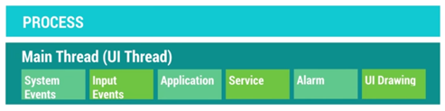
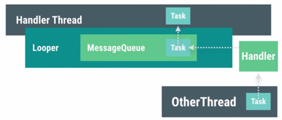
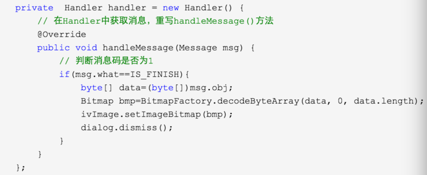
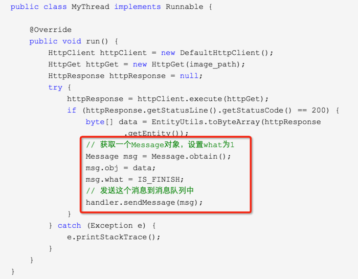
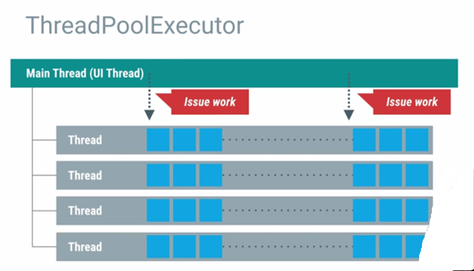

# Android多線程的四種方式


當我們啟動一個App的時候，Android系統會啟動一個`Linux Process，該Process包含一個Thread，稱為UI Thread或Main Thread。`通常一個應用的所有組件都運行在這一個Process中，當然，你可以通過修改四大組件在Manifest.xml中的代碼塊`(<activity><service><provider><receiver>)`中的android:process屬性指定其運行在不同的process中。當一個組件在啟動的時候，如果該process已經存在了，那麼該組件就直接通過這個process被啟動起來，並且運行在這個process的UI Thread中。

UI Thread中運行著許多重要的邏輯，如系統事件處理，用戶輸入事件處理，UI繪製，Service，Alarm等，如下圖：



而我們編寫的代碼則是穿插在這些邏輯中間，比如對用戶觸摸事件的檢測和響應，對用戶輸入的處理，自定義View的繪製等。如果我們插入的代碼比價耗時，如網絡請求或數據庫讀取，就會阻塞UI線程其他邏輯的執行，從而導致界面卡頓。如果卡頓時間超過5秒，系統就會報ANR錯誤。所以，如果要執行耗時的操作，我們需要另起線程執行。

在新線程執行完耗時的邏輯後，往往需要將結果反饋給界面，進行UI更新。Android的UI toolkit不是線程安全的，不能在非UI線程進行UI的更新，所有對界面的更新必須在UI線程進行。

Android提供了四種常用的操作多線程的方式，分別是：

```sh
1. Handler+Thread
2. AsyncTask
3. ThreadPoolExecutor
4. IntentService
```

下面分佈對四種方式進行介紹。

##Handler+Thread
Android主線程包含一個消息隊列(MessageQueue)，該消息隊列裡面可以存入一系列的Message或Runnable對象。通過一個Handler你可以往這個消息隊列發送Message或者Runnable對象，並且處理這些對象。每次你新創建一個Handle對象，它會綁定於創建它的線程(也就是UI線程)以及該線程的消息隊列，從這時起，這個handler就會開始把Message或Runnable對象傳遞到消息隊列中，並在它們出隊列的時候執行它們。




Handler可以把一個Message對象或者Runnable對象壓入到消息隊列中，進而在UI線程中獲取Message或者執行Runnable對象，Handler把壓入消息隊列有兩類方式，Post和sendMessage：

Post方式：
Post允許把一個Runnable對象入隊到消息隊列中。它的方法有：
post(Runnable)/postAtTime(Runnable,long)/postDelayed(Runnable,long)

對於Handler的Post方式來說，它會傳遞一個Runnable對象到消息隊列中，在這個Runnable對象中，重寫run()方法。一般在這個run()方法中寫入需要在UI線程上的操作。


##sendMessage：
sendMessage允許把一個包含消息數據的Message對象壓入到消息隊列中。它的方法有：sendEmptyMessage(int)/sendMessage(Message)/sendMessageAtTime(Message,long)/sendMessageDelayed(Message,long)

Handler如果使用sendMessage的方式把消息入隊到消息隊列中，需要傳遞一個Message對象，而在Handler中，需要重寫handleMessage()方法，用於獲取工作線程傳遞過來的消息，此方法運行在UI線程上。Message是一個final類，所以不可被繼承。






##優缺點

```sh
1. Handler用法簡單明瞭，可以將多個異步任務更新UI的代碼放在一起，清晰明瞭
2. 處理單個異步任務代碼略顯多
```

##適用範圍

```sh
1. 多個異步任務的更新UI
```

##AsyncTask

AsyncTask是android提供的輕量級的異步類,可以直接繼承AsyncTask，在類中實現異步操作，並提供接口反饋當前異步執行的程度(可以通過接口實現UI進度更新)，最後反饋執行的結果給UI主線程。

AsyncTask通過一個阻塞隊列BlockingQuery<Runnable>存儲待執行的任務，利用靜態線程池THREAD_POOL_EXECUTOR提供一定數量的線程，默認128個。在Android 3.0以前，默認採取的是並行任務執行器，3.0以後改成了默認採用串行任務執行器，通過靜態串行任務執行器SERIAL_EXECUTOR控制任務串行執行，循環取出任務交給THREAD_POOL_EXECUTOR中的線程執行，執行完一個，再執行下一個。

用法舉例：


```java
class DownloadTask extends AsyncTask<Integer, Integer, String> {
    // AsyncTask<Params, Progress, Result>
    //後面尖括號內分別是參數（例子裡是線程休息時間），進度(publishProgress用到)，返回值類型
    @Override
    protected void onPreExecute() {
        //第一個執行方法
        super.onPreExecute();
    }
    @Override
    protected String doInBackground(Integer... params) {
        //第二個執行方法,onPreExecute()執行完後執行
        for(int i=0; i<=100; i++) {
            publishProgress(i);
            try {
                Thread.sleep(params[0]);
            } catch (InterruptedException e) {
                e.printStackTrace();
            }
        }
        return "執行完畢";
    }
    @Override
    protected void onProgressUpdate(Integer... progress) {
        //這個函數在doInBackground調用publishProgress時觸發，雖然調用時只有一個參數
        //但是這裡取到的是一個數組,所以要用progesss[0]來取值
        //第n個參數就用progress[n]來取值
        tv.setText(progress[0]+"%");
        super.onProgressUpdate(progress);
    }
    @Override
    protected void onPostExecute(String result) {
        //doInBackground返回時觸發，換句話說，就是doInBackground執行完後觸發
        //這裡的result就是上面doInBackground執行後的返回值，所以這裡是"執行完畢"
        setTitle(result);
        super.onPostExecute(result);
    }
}
```

###優缺點
```sh
1. 處理單個異步任務簡單，可以獲取到異步任務的進度
2. 可以通過cancel方法取消還沒執行完的AsyncTask
3. 處理多個異步任務代碼顯得較多
```

###適用範圍
```sh
1. 單個異步任務的處理
```
##ThreadPoolExecutor

ThreadPoolExecutor提供了一組線程池，可以管理多個線程並行執行。這樣一方面減少了每個並行任務獨自建立線程的開銷，另一方面可以管理多個併發線程的公共資源，從而提高了多線程的效率。所以ThreadPoolExecutor比較適合一組任務的執行。Executors利用工廠模式對ThreadPoolExecutor進行了封裝，使用起來更加方便。



Executors提供了四種創建ExecutorService的方法，他們的使用場景如下：

```sh
1. Executors.newFixedThreadPool()
   創建一個定長的線程池，每提交一個任務就創建一個線程，直到達到池的最大長度，這時線程池會保持長度不再變化
2. Executors.newCachedThreadPool()
   創建一個可緩存的線程池，如果當前線程池的長度超過了處理的需要時，它可以靈活的回收空閒的線程，當需要增加時，
    它可以靈活的添加新的線程，而不會對池的長度作任何限制
3. Executors.newScheduledThreadPool()
   創建一個定長的線程池，而且支持定時的以及週期性的任務執行，類似於Timer
4. Executors.newSingleThreadExecutor()
   創建一個單線程化的executor，它只創建唯一的worker線程來執行任務
```

##適用範圍
```sh
1. 批處理任務
```

## IntentService
IntentService繼承自Service，是一個經過包裝的輕量級的Service，用來接收並處理通過Intent傳遞的異步請求。客戶端通過調用startService(Intent)啟動一個IntentService，利用一個work線程依次處理順序過來的請求，處理完成後自動結束Service。

##特點
```sh
1. 一個可以處理異步任務的簡單Service
```