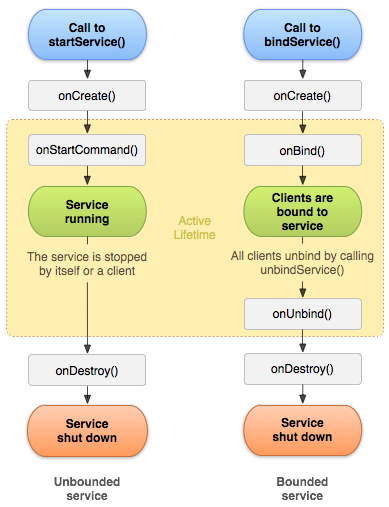

# Android之Service总结

          <h3>1. 简介</h3>

与前一篇<a href="http://www.jianshu.com/p/c2c2ee4eb48a" target="_blank">Android之Activity总结</a>是同一系列的文章，是自己在学习和研发过程中，对Service的一些知识点的总结，汇总得到这篇文章。

这篇文章会从Service的一些小知识点，延伸到Android中几种常用进程间通信方法。

<h3>2. 进程</h3>

Service是一种不提供用户交互页面但是可以在后台长时间运行的组件，可以通过在AndroidManifest.xml设置Service的<code>android:process=":remote"</code>属性，让Service运行另一个进程中，也就是说，虽然你是在当前应用启动的这个Service，但是这个Service和这个应用并不是同一个进程。

<strong>四大组件都支持<code>android:process=":remote"</code>这个属性。</strong>

因为Service可以运行在不同的进程，这里说一下Android中几种进程的优先级，当系统内存不足时候，系统会从优先级低的进程开始回收，下面根据优先级由高到低列出Android中几种进程。

<ul>
<li>

<strong>前台进程</strong>，当前用户操作所需要的进程

<ul>
<li>用户正在交互的Activity（Activity执行了onResume方法）</li>
<li>与正在交互的Activity绑定的Service</li>
<li>设置为前台权限的Service（Service调用startForeground()方法）</li>
<li>正在执行某些生命周期回调的Service，onCreate()、onStart()、onDestroy()</li>
<li>

正在执行onReceive()的BroadcastReceiver

这种进程基本不会被回收，只有当内存不足以支持前台进程同时运行时候，系统才回回收它们，主要关注前三个。

</li>
</ul>
</li>
<li>

<strong>可见进程</strong>，没有与用户交互所必须的组件，但是在屏幕上仍然可见其内容的进程

<ul>
<li>调用了onPause()方法但仍对用户可见的Activity</li>
<li>与上面这种Activity绑定的Service</li>
</ul>
</li>
<li>

<strong>服务进程</strong>，使用startService()启动的Service且不属于上面两种类别进程的进程，虽然这个进程与用户交互没有直接关系，但是一般会在后台执行一些耗时操作，所以，只有当内存不足以维持所有前台进程和可见进程同时运行，系统才回回收这个类别的进程。

</li>
<li>

<strong>后台进程</strong>，对用户不可见的Activity进程，已调用了onStop()方法的Activity

</li>
<li>
<strong>空进程</strong>，不包含任何活动应用组件的进程，保留这种进程唯一目的是作为缓存，缩短引用组件下次启动时间。通常系统会最优先回收这类进程。</li>
</ul>

此外，一个进程的级别可能会因为其他进程对它的依赖而有所提高，即进程A服务于进程B（B依赖A），那么A的进程级别至少是和B一样高的。

<h3>3. Service配置</h3>

和其他组件(Activity/ContentProvider/BroadcastReceiver)一样，Service需要在Androidmanifest.xml中声明。

<pre class="hljs xml"><code class="xml">&lt;manifest ... &gt;
  ...
  &lt;application ... &gt;
      &lt;service android:name=".DemoService" /&gt;
      ...
  &lt;/application&gt;
&lt;/manifest&gt;</code></pre>

Service是运行在主线程中的，如果有什么耗时的操作，建议新建子线程去处理，避免阻塞主线程，降低ANR的风险。

在另外一篇文章中<a href="http://www.jianshu.com/p/a7535c3f33df" target="_blank">Intent以及IntentFilter详解</a>提到过，为了确保应用的安全，不要为Service设置intent-filter，因为如果使用隐式Intent去启动Service时候，手机里面那么多应用，并不能确定哪一个Service响应了这个Intent，所以在项目中尽量使用显式Intent去启动Service。在Android 5.0(API LEVEL 21)版本后的，如果传入隐式Intent去调用<code>bindService()</code>方法，系统会抛出异常。

可以通过设置<code>android:exported=false</code>来确保这个Service仅能在本应用中使用。

<h3>4. 服务启动方式</h3>

服务可以由其他组件启动，而且如果用户切换到其他应用，这个服务可能会继续在后台执行。到目前为止，Android中Service总共有三种启动方式。

<ul>
<li>Scheduled，可定时执行的Service，是Android 5.0（API LEVEL 21）版本中新添加的一个Service，名为JobService，继承Service类，使用JobScheduler类调度它并且设置JobService运行的一些配置。具体文档可以参考<a href="https://developer.android.com/reference/android/app/job/JobScheduler.html" target="_blank">JobScheduler</a>，如果你的应用最低支持版本是21，官方建议使用JobService。</li>
<li>Started，通过<code>startService()</code>启动的Service。通过这种方式启动的Service会独立的运行在后台，即使启动它的组件已经销毁了。例如Activity A使用startService()启动了Service B，过了会儿，Activity A执行onDestroy()被销毁了，如果Service B任务没有执行完毕，它仍然会在后台执行。这种启动方式启动的Service需要主动调用<code>StopService()</code>停止服务。</li>
<li>Bound，通过<code>bindService()</code>启动的Service。通过这种方式启动Service时候，会返回一个客户端交互接口，用户可以通过这个接口与服务进行交互，如果这个服务是在另一个进程中，那么就实现了进程间通信，也就是Messenger和AIDL，这个会是下篇文章的重点。多个组件可以同时绑定同一个Service，如果所有的组件都调用<code>unbindService()</code>解绑后，Service会被销毁。</li>
</ul>

<strong>startService和bindService可以同时使用</strong>

<h3>5. 主要方法</h3>

Service是一个抽象类，使用需要我们去实现它的抽象方法<code>onBind()</code>，Service有且仅有这一个抽象方法，还有一些其他的生命周期回调方法需要复写帮助我们实现具体的功能。

<ul>
<li>onCreate()，在创建服务时候，可以在这个方法中执行一些的初始化操作，它在<code>onStartCommand()</code>和<code>onBind()</code>之前被调用。如果服务已经存在，调用<code>startService()</code>启动服务时候这个方法不会调用，只会调用<code>onStartCommand()</code>方法。</li>
<li>onStartCommand()，其他组件通过<code>startService()</code>启动服务时候会回调这个方法，这个方法执行后，服务会启动被在后台运行，需要调用<code>stopSelf()</code>或者<code>stopService()</code>停止服务。</li>
<li>onBind()，其他组件通过<code>bindService()</code>绑定服务时候会回调的方法，这是Service的一个抽象方法，如果客户端需要与服务交互，需要在这个方法中返回一个<code>IBinder</code>实现类实例化对象，如果不想其他客户端与服务绑定，直接返回null。</li>
<li>onDestroy()，当服务不在还是用且即将被销毁时，会回调这个方法，可以在这个方法中做一些释放资源操作，这是服务生命周期的最后一个回调。</li>
</ul>

如果组件仅通过<code>startService()</code>启动服务，不论服务是否已经启动，都会回调<code>onStartCommand()</code>方法，而且服务会一直运行，需要调用<code>stopSelf</code>和<code>stopService</code>方法关闭服务。

如果组件仅通过<code>bindService()</code>绑定服务，则服务只有在与组件绑定时候运行，一旦所有的客户端全部取消绑定<code>unbindService</code>，系统才会销毁该服务。

多次启动同一个服务，只有在服务初次启动时候会回调<code>onCreate</code>方法，但是每次都会回调<code>onStartCommand</code>，可以利用这个向服务传递一些信息。

<strong>onStartCommand()的回调是在UI主线程，如果有什么耗时的操作，建议新启线程去处理。</strong>

<h3>6. 启动和关闭服务</h3>

启动服务：

<ul>
<li><code>JobScheduler.schedule()</code></li>
<li><code>startService(Intent)</code></li>
<li><code>bindService(Intent service, ServiceConnection conn, int flags)</code></li>
</ul>

关闭服务：

<ul>
<li>
<code>JobScheduler.cancel()</code>或者<code>JobScheduler.cancelAll()</code>，对应<code>JobScheduler.schedule()</code>
</li>
<li>Service自身的<code>stopSelf()</code>方法，组件的<code>stopService(Intent)</code>方法，对应<code>startService</code>启动方法</li>
<li>
<code>unbindService(ServiceConnection conn)</code>，对应<code>bindService</code>
</li>
</ul>

示例：

<pre class="hljs pony"><code class="pony">// 启动服务
Intent intent = new Intent(this, DemoService.class);
startService(intent);

// 停止服务
stopService(intent)

// 绑定服务
ServiceConnection mConnection = ServiceConnection() { ... };
Intent intent = new Intent(this, DemoService.class);
bindService(intent, mConnection, Context.BIND_AUTO_CREATE);

// 解除绑定
unbindService(mConnection);</code></pre>

绑定服务<code>bindService()</code>第三个参数数值：

<ul>
<li>0，如果不想设置任何值，就设置成0</li>
<li>
<code>Context.BIND_AUTO_CREATE</code>，绑定服务时候，如果服务尚未创建，服务会自动创建，在API LEVEL 14以前的版本不支持这个标志，使用<code>Context.BIND_WAIVE_PRIORITY</code>可以达到同样效果</li>
<li>
<code>Context.BIND_DEBUG_UNBIND</code>，通常用于Debug，在<code>unbindService</code>时候，会将服务信息保存并打印出来，这个标记很容易造成内存泄漏。</li>
<li>
<code>Context.BIND_NOT_FOREGROUND</code>，不会将被绑定的服务提升到前台优先级，但是这个服务也至少会和客户端在内存中优先级是相同的。</li>
<li>
<code>Context.BIND_ABOVE_CLIENT</code>，设置服务的进程优先级高于客户端的优先级，只有当需要服务晚于客户端被销毁这种情况才这样设置。</li>
<li>
<code>Context.BIND_ALLOW_OOM_MANAGEMENT</code>，保持服务受默认的服务管理器管理，当内存不足时候，会销毁服务</li>
<li>
<code>Context.BIND_WAIVE_PRIORITY</code>，不会影响服务的进程优先级，像通用的应用进程一样将服务放在一个LRU表中</li>
<li>
<code>Context.BIND_IMPORTANT</code>，标识服务对客户端是非常重要的，会将服务提升至前台进程优先级，通常情况下，即时客户端是前台优先级，服务最多也只能被提升至可见进程优先级，</li>
<li>
<code>BIND_ADJUST_WITH_ACTIVITY</code>，如果客户端是Activity，服务优先级的提高取决于Activity的进程优先级，使用这个标识后，会无视其他标识。</li>
</ul>
<h3>7. onStartCommand()返回值</h3>

<code>onStartCommand()</code>方法有一个int的返回值，这个返回值标识服务关闭后系统的后续操作。

返回值有以下几种：

<ul>
<li>
<code>Service.START_STICKY</code>，启动后的服务被杀死，系统会自动重建服务并调用<code>on onStartCommand()</code>，但是不会传入最后一个Intent(Service可能多次执行onStartCommand)，会传入一个空的Intent，使用这个标记要注意对Intent的判空处理。这个标记适用于太依靠外界数据Intent，在特定的时间，有明确的启动和关闭的服务，例如后台运行的音乐播放。</li>
<li>
<code>Service.START_NOT_STICKY</code>，启动后的服务被杀死，系统不会自动重新创建服务。这个标记是最安全的，适用于依赖外界数据Intent的服务，需要完全执行的服务。</li>
<li>
<code>Service.START_REDELIVER_INTENT</code>，启动后的服务被杀死，系统会重新创建服务并调用<code>onStartCommand()</code>，同时会传入最后一个Intent。这个标记适用于可恢复继续执行的任务，比如说下载文件。</li>
<li>
<code>Service.START_STICKY_COMPATIBILITY</code>，启动后的服务被杀死，不能保证系统一定会重新创建Service。</li>
</ul>
<h3>8. Service生命周期</h3>

Service生命周期（从创建到销毁）跟它被启动的方式有关系，这里只介绍<code>startService</code>和<code>bindService</code>两种启动方法时候Service的生命周期。

<ul>
<li>
<code>startService</code>启动方式，其他组件用这种方式启动服务，服务会在后台一直运行，只有服务调用本身的<code>stopSelf()</code>方法或者其他组件调用<code>stopService()</code>才能停止服务。</li>
<li>
<code>bindService</code>启动方式，其他组件用这种方法绑定服务，服务通过IBinder与客户端通信，客户端通过<code>unbindService</code>接触对服务的绑定，当没有客户端绑定到服务，服务会被系统销毁。</li>
</ul>

这两种生命周期不是独立的，组件可以同时用<code>startService</code>启动服务同时用<code>bindService</code>绑定服务，例如跨页面的音乐播放器，就可以在多个页面同时绑定同一个服务，这种情况下需要调用<code>stopService()</code>或者服务本身的<code>stopSelf()</code>并且没有客户端绑定到服务，服务才会被销毁。

 
Service生命周期图

左图是使用<code>startService()</code>所创建的服务的生命周期，右图是使用<code>bindService()</code>所创建的服务的生命周期。

<h3>9. 在前台运行服务</h3>

服务可以通过startForeground来使服务变成前台优先级。

<pre class="hljs aspectj"><code class="aspectj">public final void startForeground(int id, Notification notification) {
    try {
        mActivityManager.setServiceForeground(
                new ComponentName(this, mClassName), mToken, id,
                notification, true);
    } catch (RemoteException ex) {
    }
}</code></pre>

第一个参数用于标识你<strong>应用中唯一的通知标识id</strong>，不能设为0，最终会传入<code>NotificationManager.notify(int id, Notification notification)</code>取消通知需要用到，第二个参数是通知具体内容。

前台服务需要在状态栏中添加通知，例如，将音乐播放器的服务设置为前台服务，状态栏通知显示正在播放的歌曲，并允许其他组件与其交互。

<pre class="hljs cpp"><code class="cpp">// 设置Notification属性
Notification notification = new Notification(R.drawable.icon, getText(R.string.ticker_text),System.currentTimeMillis());
Intent notificationIntent = new Intent(this, ExampleActivity.class);
PendingIntent pendingIntent = PendingIntent.getActivity(this, 0, notificationIntent, 0);
notification.setLatestEventInfo(this, getText(R.string.notification_title), getText(R.string.notification_message), pendingIntent);
startForeground(ONGOING_NOTIFICATION_ID, notification);</code></pre>

要将服务从前台移除，需要调用stopForeground(boolean removeNotification)，参数是一个布尔值，用来标识服务从前台服务移除时候，是否需要移除状态栏的通知。如果服务在前台运行时候被停止，也会移除状态栏的通知。

<h3>10. 与服务通信</h3>
<h4>10.1 广播</h4>

不多说，万能的通信。

<h4>10.2 内存共享</h4>

不多说，万能的通信

<h4>10.3 本地数据共享</h4>

不多说，万能的通信，例如ContentProvider/SharePreference等等。

<h4>10.4 startService()</h4>

使用这个方法启动的服务，再次调用<code>startService()</code>传入Intent即可与服务通信，因为这种方式启动的服务在完整的生命周期内<code>onCreate()</code>只会执行一次，而<code>onStartCommand()</code>会执行多次，我们再次调用<code>startService()</code>时候，可以在<code>oonStartCommand()</code>去处理。

<h4>10.5 bindService()</h4>

使用这种方法启动的服务，组件有三种与服务通信的方式。 

<ul>
<li>Service中实现IBinder</li>
<li>Messenger(AIDL的简化版)</li>
<li>AIDL</li>
</ul>

下一篇文章具体介绍Messenger、AIDL，因为它们是属于Android进程间通信。

如果一个服务Service只需要在本应用的进程中使用，不提供给其他进程，推荐使用第一种方法。

使用示例：

Service：

<pre class="hljs scala"><code class="scala">/**
 * 本地服务
 * &lt;br/&gt;
 * 和启动应用属于同一进程
 */
public class LocalService extends Service {
    /**
     * 自定的IBinder
     */
    private final IBinder mBinder = new LocalBinder();

    @Override
    public IBinder onBind(Intent intent) {
        return mBinder;
    }

    /**
     * 提供给客户端的方法
     *
     * @return
     */
    public String getServiceInfo() {
        return this.getPackageName() + " " + this.getClass().getSimpleName();
    }

    /**
     * 自定义的IBinder
     */
    public class LocalBinder extends Binder {
        public LocalService getService() {
            return LocalService.this;
        }
    }
}</code></pre>

Activity：

<pre class="hljs java"><code class="java">/**
 * 绑定本地服务的组件
 *
 * Created by KyoWang.
 */
public class BindLocalServiceActivity extends AppCompatActivity implements View.OnClickListener {

    private Button mShowServiceNameBtn;

    private LocalService mService;

    private boolean mBound = false;

    public ServiceConnection mConnection = new ServiceConnection() {
        @Override
        public void onServiceConnected(ComponentName name, IBinder service) {
            LocalService.LocalBinder binder = (LocalService.LocalBinder) service;
            mService = binder.getService();
            mBound = true;
        }

        @Override
        public void onServiceDisconnected(ComponentName name) {
            mBound = false;
        }
    };

    @Override
    protected void onCreate(@Nullable Bundle savedInstanceState) {
        super.onCreate(savedInstanceState);
        setContentView(R.layout.a_bind_local_service);
        mShowServiceNameBtn = (Button) findViewById(R.id.bind_local_service_btn);
        mShowServiceNameBtn.setOnClickListener(this);
    }

    @Override
    protected void onStart() {
        super.onStart();
        Intent intent = new Intent(this, LocalService.class);
        bindService(intent, mConnection, Context.BIND_AUTO_CREATE);
    }

    @Override
    protected void onStop() {
        super.onStop();
        if(mBound) {
            unbindService(mConnection);
            mBound = false;
        }
    }

    @Override
    public void onClick(View v) {
        int id = v.getId();
        if(id == R.id.bind_local_service_btn) {
            if(mBound) {
                String info = mService.getServiceInfo();
                Toast.makeText(BindLocalServiceActivity.this, info, Toast.LENGTH_SHORT).show();
            }
        }
    }
}</code></pre>
<h3>11. 服务长存后台</h3>

关于<strong>网上通用</strong>的提升服务优先级以保证服务长存后台，即保证服务不轻易被系统杀死的方法有以下几种。

<ul>
<li>

设置<code>android:persistent="true"</code>，这是application的一个属性，官方都不建议使用。

<pre class="hljs applescript"><code class="applescript">  Whether or not the application should remain running at all times，
  "true" if it should, and "false" if not. 
  The default value is "false". 
  Applications should not normally set this flag; 
  persistence mode is intended only for certain system applications.</code></pre>
</li>
<li>

设置<code>android:priority</code>优先级，这个并不是Service的属性。这个属性是在<code>intent-filter</code>中设置的。<a href="https://developer.android.com/guide/topics/manifest/intent-filter-element.html" target="_blank">官方解释</a>，这个属性只对活动和广播有用，而且这个是接受Intent的优先级，并不是在内存中的优先级，呵呵。

<pre class="hljs livecodeserver"><code class="livecodeserver">  android:priority
  The priority that should be given to the parent component with regard to 
  handling intents of the type described by the filter. 
  This attribute has meaning for both activities and broadcast receivers。</code></pre>
</li>
<li>

在Service的<code>onDestroy</code>中发送广播，然后重启服务，就目前我知道的，会出现Service的<code>onDestroy</code>不调用的情况。

</li>
<li>

<code>startForeground</code>，这个上面提到过，是通过<code>Notification</code>提升优先级。

</li>
<li>设置<code>onStartCommand()</code>返回值，让服务被杀死后，系统重新创建服务，上面提到过。</li>
</ul>

五个里面就两个能稍微有点用，所以啊，网络谣传害死人。

<h3>12. IntentService</h3>

敲黑板时间，重点来了，官方强力推荐。

前面提到两点。

<ul>
<li>因为Service中几个方法的回调都是在主线程中，如果使用Service执行特别耗时的操作，建议单独新建线程去操作，避免阻塞主线程（UI线程）</li>
<li>启动服务和停止服务是成对出现的，需要手动停止服务</li>
</ul>

IntentService完美的帮我们解决了这个问题，在内部帮我们新建的线程，不需要我们手动新建，执行完毕任务后会自动关闭。IntentService也是一个抽象类，里面有一个<code>onHandleIntent(Intent intent)</code>抽象方法，这个方法是在非UI线程调用的，在这里执行耗时的操作。

IntentService使用非UI线程逐一处理所有的启动需求，它在内部使用Handler，将所有的请求放入队列中，依次处理，关于Handler可以看<a href="http://www.jianshu.com/p/e72aba99012a" target="_blank">这篇文章</a>，也就是说IntentService不能同时处理多个请求，如果不要求服务同时处理多个请求，可以考虑使用IntentService。

IntentService在内部使用<code>HandlerThread</code>配合<code>Handler</code>来处理耗时操作。

<pre class="hljs java"><code class="java">private final class ServiceHandler extends Handler {
    public ServiceHandler(Looper looper) {
        super(looper);
    }

    @Override
    public void handleMessage(Message msg) {
        onHandleIntent((Intent)msg.obj);
        stopSelf(msg.arg1);
    }
}

public int onStartCommand(Intent intent, int flags, int startId) {
    onStart(intent, startId);
    return mRedelivery ? START_REDELIVER_INTENT : START_NOT_STICKY;
}

public void onStart(Intent intent, int startId) {
    Message msg = mServiceHandler.obtainMessage();
    msg.arg1 = startId;
    msg.obj = intent;
    mServiceHandler.sendMessage(msg);
}</code></pre>

注意<code>msg.arg1</code>它是请求的唯一标识，每发送一个请求，会生成一个唯一标识，然后将请求放入<code>Handler</code>处理队列中，从源代码里面可以看见，在执行完毕<code>onHandleIntent</code>方法后，会执行<code>stopSelf</code>来关闭本身，同时IntentService中<code>onBind()</code>方法默认返回<code>null</code>，这说明<strong>启动IntetService的方式最好是用<code>startService</code>方法</strong>，这样在服务执行完毕后才会自动停止；如果使用<code>bindService</code>来启动服务，还是需要调用<code>unbindService</code>来解绑服务的，也需要复写<code>onBind()</code>方法。

<blockquote>
小盆宇：在<code>onHandleIntent</code>中，执行<code>onHandleIntent</code>后紧接着执行stopSelf(int startId)，把服务就给停止了，那第一个请求执行完毕服务就停止了，后续的请求怎么会执行？
</blockquote>

注意stopSelf(int startID)方法作用是在其参数startId跟最后启动该service时生成的id相等时才会执行停止服务，当有多个请求时候，如果发现当前请求的startId不是最后一个请求的id，那么不会停止服务，所以只有当最后一个请求执行完毕后，才回停止服务。

<h3>13. 总结</h3>

在年前写了出来，比Activity中的坑少了太多，希望对大家有帮助。下一篇是关于Android中进程通信Messenger/AIDL的，是本篇的补充，但是也属于单独的知识点。

        
