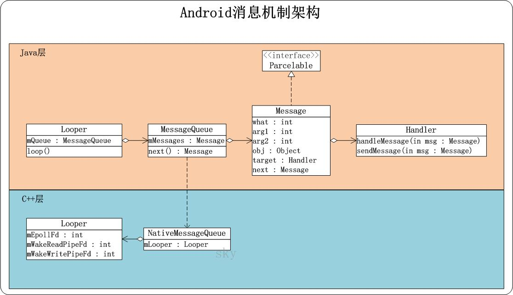
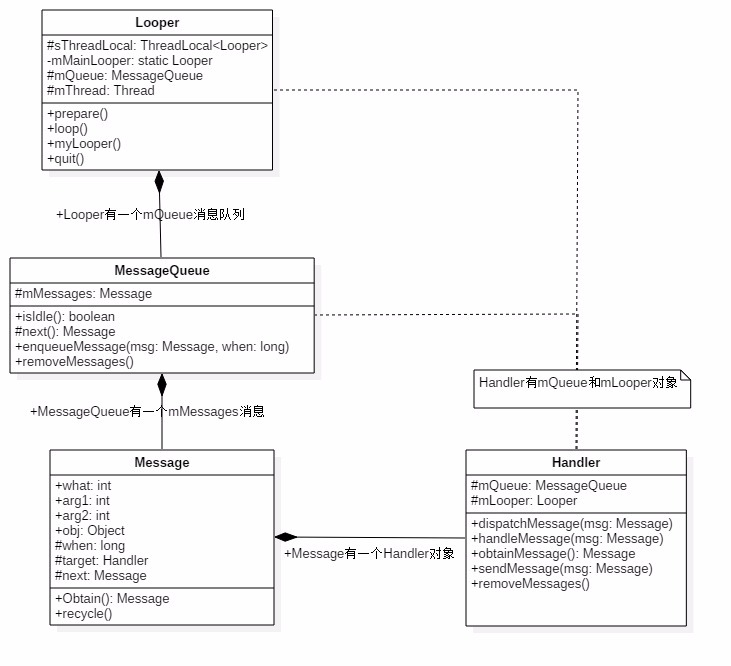

# 概述設計架構

          
本系列文章將分N篇介紹Android中的消息機制。

<ol>
<li>概述和設計架構</li>
<li>Message和MessageQueue</li>
<li>Looper</li>
<li>Handler</li>
<li>Handler使用實戰</li>
<li>Handler引起的內存溢出</li>
<li>ThreadLocal</li>
</ol>

Android的應用程序和Windows應用程序一樣，都是由消息驅動的。在Android操作系統中，谷歌也實現了消息循環處理機制。

<h2>相關概念</h2>

學習Android的消息機制，有幾個設計概念我們必須瞭解：

<ol>
<li>
<strong>消息：Message</strong> 消息（Message）代表一個行為（what）或者一串動作（Runnable）,每一個消息在加入消息隊列時，都有明確的目標（Handler）。</li>
<li>
<strong>消息隊列：MessageQueue</strong> 以隊列的形式對外提供插入和刪除的工作，其內部結構是以鏈表的形式存儲消息的。</li>
<li>
<strong>Looper</strong> Looper是循環的意思，它負責從消息隊列中循環的取出消息然後把消息交給目標(Handler)處理。</li>
<li>
<strong>Handler</strong> 消息的真正處理者，具備獲取消息、發送消息、處理消息、移除消息等功能。</li>
<li>線程 線程，CPU調度資源的基本單位。Android中的消息機制也是基於線程中的概念。</li>
<li>ThreadLocal 可以理解為<code>ThreadLocalData</code>,ThreadLocal的作用是提供線程內的局部變量（TLS），這種變量在線程的生命週期內起作用，每一個線程有他自己所屬的值（線程隔離）。<blockquote>
5、6為牽涉到的概念，不是本文重點。會另起文章討論
</blockquote>
</li>
</ol>

平時我們最常使用的就是Message與Handler了，如果使用過HandlerThread或者自己實現類似HandlerThread的東西可能還會接觸到Looper，而MessageQueue是Looper內部使用的，對於標準的SDK，我們是無法實例化並使用的（構造函數是包可見性）。

我們平時接觸到的Looper、Message、Handler都是用JAVA實現的，Android是一個基於Linux的系統，底層用C、C++實現的，而且還有NDK的存在，Android消息驅動的模型為了消息的及時性、高效性，在Native層也設計了Java層對應的類如Looper、MessageQueue等。

 
handle機制.jpg

<h2>他們如何協作</h2>

 
Handler、MessageQueue、Looper如何協作

<strong>一句話總結為：Looper不斷從MessageQueue中取出一個Message，然後交給其對應的Handler處理。</strong>

他們之間的類圖如下： 

 
Handler、Looper、Message、MessageQueue類圖

 從上文兩張圖中我們可以得到以下結論：

<ol>
<li>Looper依賴於MessageQueue和Thread，每個Thread只對應一個Looper，每個Looper只對應一個MessageQueue（一對一）。</li>
<li>MessageQueue依賴於Message，每個MessageQueue中有N個待處理消息（一對N）。</li>
<li>Message依賴於Handler來進行處理，每個Message有且僅有一個對應的Handler。（一對一）</li>
<li>Handler中持有Looper和MessageQueue的引用，可直接對其進行操作。</li>
</ol>

還有一點要說明的是：普通的線程是沒有looper的，如果需要looper對象，那麼必須要先調用Looper.prepare()方法，而且一個線程只能有一個looper。調用完以後，此線程就成為了所謂的LooperThread,若在當前LooperThread中創建Handler對象，那麼此Handler會自動關聯到當前線程的looper對象，也就是擁有looper的引用。 下面是官方給出的LooperThread最標準的用法。

<pre class="hljs java"><code class="java">class LooperThread extends Thread {
public Handler mHandler;

public void run() {
Looper.prepare();

mHandler = new Handler() {
public void handleMessage(Message msg) {
// process incoming messages here
}
};

Looper.loop();
}</code></pre>
<h2>為什麼我們需要這樣的消息處理機制</h2>
<ol>
<li>不阻塞主線程 Android應用程序啟動時，系統會創建一個主線程，負責與UI組件（widget、view）進行交互，比如控制UI界面界面顯示、更新等；分發事件給UI界面處理，比如按鍵事件、觸摸事件、屏幕繪圖事件等，因此，Android主線程也稱為UI線程。 由此可知，UI線程只能處理一些簡單的、短暫的操作，如果要執行繁重的任務或者耗時很長的操作，比如訪問網絡、數據庫、下載等，這種單線程模型會導致線程運行性能大大降低，甚至阻塞UI線程，如果被阻塞超過5秒，系統會提示應用程序無相應對話框，縮寫為ANR，導致退出整個應用程序或者短暫殺死應用程序。
<em><strong>Android系統將大部分耗時、繁重任務交給子線程完成，不會在主線程中完成。</strong></em>
</li>
<li>併發程序設計的<strong>有序性</strong> 單線程模型的UI主線程也是不安全的，會造成不可確定的結果。 線程不安全簡單理解為：多線程訪問資源時，有可能出現多個線程先後更改數據造成數據不一致。比如，A工作線程（也稱為子線程）訪問某個公共UI資源，B工作線程在某個時候也訪問了該公共資源，當B線程正訪問時，公共資源的屬性已經被A改變了，這樣B得到的結果不是所需要的的，造成了數據不一致的混亂情況。 線程安全簡單理解為：當一個線程訪問功能資源時，對該資源進程了保護，比如加了鎖機制，當前線程在沒有訪問結束釋放鎖之前，其他線程只能等待直到釋放鎖才能訪問，這樣的線程就是安全的。
<em><strong>Android只允許主線程更新UI界面，子線程處理後的結果無法和主線程交互，即無法直接訪問主線程，這就要用到Handler機制來解決此問題。基於Handler機制，在子線程先獲得Handler對象，該對象將數據發送到主線程消息隊列，主線程通過Loop循環獲取消息交給Handler處理。</strong></em>
</li>
</ol>
<h1>是如何完成跨線程通信的</h1>

Handler發送消息後添加消息到消息隊列，然後消息在恰當時候出列，都是由Handler來執行，那麼是如何完成跨線程通信的？ 這裡就牽涉到了Linux系統的跨線程通信的知識，Android中採用的是Linux中的管道通信。  Looper是通過管道(pipe)實現的。 關於管道，簡單來說，管道就是一個文件。 在管道的兩端，分別是兩個打開文件文件描述符，這兩個打開文件描述符都是對應同一個文件，其中一個是用來讀的，別一個是用來寫的。 一般的使用方式就是，一個線程通過讀文件描述符中來讀管道的內容，當管道沒有內容時，這個線程就會進入等待狀態，而另外一個線程通過寫文件描述符來向管道中寫入內容，寫入內容的時候，如果另一端正有線程正在等待管道中的內容，那麼這個線程就會被喚醒。這個等待和喚醒的操作是如何進行的呢，這就要藉助Linux系統中的epoll機制了。 Linux系統中的epoll機制為處理大批量句柄而作了改進的poll，是Linux下多路複用IO接口select/poll的增強版本，它能顯著減少程序在大量併發連接中只有少量活躍的情況下的系統CPU利用率。

(01) pipe(wakeFds)，該函數創建了兩個管道句柄。 (02) mWakeReadPipeFd=wakeFds[0]，是讀管道的句柄。 (03) mWakeWritePipeFd=wakeFds<a href="http://7xkrut.com1.z1.glb.clouddn.com/Handler.png" target="_blank">1</a>，是寫管道的句柄。 (04) epoll_create(EPOLL_SIZE_HINT)是創建epoll句柄。 (05) epoll_ctl(mEpollFd, EPOLL_CTL_ADD, mWakeReadPipeFd, &amp; eventItem)，它的作用是告訴mEpollFd，它要監控mWakeReadPipeFd文件描述符的EPOLLIN事件，即當管道中有內容可讀時，就喚醒當前正在等待管道中的內容的線程。

這樣一個線程（比如UI線程）消息隊列和Looper就準備就緒了。

<blockquote>
消息隊列創建時，會調用JNI函數，初始化NativeMessageQueue對象。NativeMessageQueue則會初始化Looper對象。Looper的作用就是，當Java層的消息隊列中沒有消息時，就使Android應用程序主線程進入等待狀態，而當Java層的消息隊列中來了新的消息後，就喚醒Android應用程序的主線程來處理這個消息。
</blockquote>

由於鄙人C++荒廢，在此不做過多探討。 關於C++層邏輯可參考文章： <a href="http://blog.csdn.net/luoshengyang/article/details/6817933" target="_blank">Android應用程序消息處理機制（Looper、Handler）分析</a> <a href="http://gityuan.com/2015/12/27/handler-message-native/" target="_blank">Android消息機制-Handler(native篇)</a> <a href="http://www.cnblogs.com/angeldevil/p/3340644.html" target="_blank">Android消息處理機制(Handler、Looper、MessageQueue與Message)</a> <a href="http://wangkuiwu.github.io/2014/08/26/MessageQueue/" target="_blank">Android消息機制架構和源碼解析</a>

本系列文章參考的資料還有： <a href="http://item.jd.com/11452539.html" target="_blank">書籍：深入理解Android內核設計思想</a> <a href="http://blog.csdn.net/singwhatiwanna/article/details/17361775" target="_blank">Android源碼分析-消息隊列和Looper</a> <a href="http://mouxuejie.com/blog/2016-03-31/message-looper-mechanism/" target="_blank">Android消息循環機制源碼分析</a> <a href="http://www.cloudchou.com/android/post-388.html" target="_blank">Handler Looper MessageQueue 詳解</a>

        
