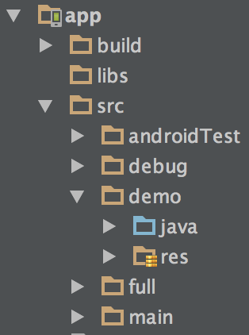

# Gradle的一些總結


##簡介

Android Studio默認使用Gradle作為構建工具，不像Ant那樣基於XML，取而代之的是採用基於Groovy的DSL（Domain Specific Language）。

Gradle構建工具是任務驅動型的構建工具，並且可以通過各種Plugin擴展功能以適應各種構建任務。

採用約定優於配置的原則，最簡單方式是使用一個默認的目錄結構。當然目錄結構是可以自己修改的。

##Gradle Build Files

新建一個Android Studio項目時，會默認生成以下Gradle相關文件。

Project級別的build.gradle文件


```sh
buildscript {
 
//編譯Gradle腳本過程中需要的依賴關係.//
 
    repositories {
 
        jcenter()
    }
 
//選擇JCenter repository.//
 
    dependencies {
 
        classpath 'com.android.tools.build:gradle:1.2.3'
 
//腳本依賴Android plugin for Gradle 1.2.3// 
 
    }
}
 
allprojects {
 
//你應用的依賴關係.//
 
    repositories {
        jcenter()
    }
}
 
//應用依賴jCenter repository.//
```

## Module級別的build.gradle文件

```sh
apply plugin: 'com.android.application'
 
//引入Android App插件.//
 
android {
 
//下面的部分配置Android App相關的信息.//
 
    compileSdkVersion 21
 
//編譯的SDK版本.// 
 
    buildToolsVersion "21.1.1"
 
//Build Tools版本，最好選擇版本號大於或等於compileSdkVersion的.//
 
    defaultConfig {
 
        applicationId "com.example.jessica.myapplication"
 
//application’s ID. 舊版本是 ‘packageName’.//
 
        minSdkVersion 16
 
//需要的最小API版本.//
 
        targetSdkVersion 21
 
//應用運行的API版本.//
         
        versionCode 1
 
        versionName "1.0"
    }
 
    buildTypes {
        release {
 
//‘BuildTypes’ 控制你App如何編譯打包. 如果你想創建你自己的 build variants, 添加到這裡.//
 
            minifyEnabled true
 
//是否進行混淆.//
 
            proguardFiles getDefaultProguardFile('proguard-android.txt'), 'proguard-rules.pro'
 
//混淆配置.// 
 
        }
    }
}
 
dependencies {
 
//當然Module需要的依賴關係.//
 
   compile fileTree(dir: 'libs', include: ['*.jar'])
 
//依賴編譯app/libs.// 
 
   compile 'com.android.support:appcompat-v7:21.0.3'
 
//依賴編譯遠端庫.//
 
}
```

## Other Gradle Files

gradle-wrapper.properties (Gradle Version)

wrapper相關配置文件：當其他人編譯你的項目時，即使他們沒有安裝gradle，使用./gradlew相關命令時，這個文件會檢查正確版本的gradle是否被安裝，如有必要會幫你下載正確的版本。下面會詳細講wrapper。


```sh
distributionBase=GRADLE_USER_HOME
 
//決定解壓後的Gradle包是存儲到工程目錄下, 還是存儲到Gradle user home directory. 
//(對於Unix machines, Gradle user home directory默認在 ~/.gradle/wrapper.)
//如果是PROJECT則zip會解壓到該工程目錄下
 
distributionPath=wrapper/dists
 
//解壓後的Gradle包存放的具體路徑.//
 
zipStoreBase=GRADLE_USER_HOME
 
zipStorePath=wrapper/dists

//下載的Gradle zip包所放置的目錄//
 
distributionUrl=https\://services.gradle.org/distributions/gradle-2.2.1-all.zip
 
//Gradle的下載地址.//
```

- settings.gradle

該文件組合你所有想構建的module。

```sh
include ':app', ':ActionBar-PullToRefresh'
```

- gradle.properties (Project Properties)

這個文件包含整個project的配置信息。默認是空文件，你可以添加各種屬性值到這個文件，build.gradle中可以引用之。

- local.properties (SDK Location)

這個文件告訴Android Gradle plugin你的Android SDK安裝在哪：

```sh
sdk.dir=/Users/jessica/Library/Android/sdk
```

由於這是你本地的SDK路徑，所以這個文件不應該加入版本控制中。

## The Gradle Wrapper

Android Studio新建項目時都建議使用Gradle Wrapper來構建，這不是必須的，直接指定你本地的安裝的Gradle也行。

用wrapper的好處是當別人參與到該項目時，無須事先本地安裝Gradle或者Android Studio，當運行./gradlew相關的命令時，wrapper會檢查本地相應目錄下是否已經有對應版本的Gradle，如果沒有會幫你下載正確的版本。還有對於一些持續集成的測試服務器，不一定是安裝了Gradle的，這時候使用wrapper就能避免重新配置服務器。

如果你想將Gradle項目轉換成基於Gradle Wrapper的，只需要簡單的跑一下gradle wrapper即可，也可以加上--gradle-version 2.4選項來指定一個gradle的版本，--gradle-distribution-url選項指定了從哪兒下載gradle，如果沒有任何選項，則會從Gradle repository下載你運行wrappertask的gradle版本。你也可以將wrapper這個task寫入你的build.gradle文件：

```sh
task wrapper(type: Wrapper) {
    gradleVersion = '2.4'
}
```

wrappertask會在你的項目根目錄下生成如下文件：

```sh
sample/
  gradlew
  gradlew.bat
  gradle/wrapper/
    gradle-wrapper.jar
    gradle-wrapper.properties
```

這些文件是都應該加入到版本控制中的。

如果你想更改Gradle版本，可以直接修改gradle-wrapper.properties文件：

```sh
distributionUrl=https\://services.gradle.org/distributions/gradle-2.4-all.zip
```

或者再跑一下wrappertask重新生成這些文件，因為wrapper腳本可能會有更新。

使用wrapper的話會忽略你本機已經安裝的gradle。


## 關於Build variants

Build variants是product flavors和build types的組合。


```sh
buildTypes {
    debug {
        debuggable true
    }
    release {
        minifyEnabled true
        proguardFiles getDefaultProguardFile('proguard-android.txt'), 'proguard-rules.pro'
    }
}
productFlavors {
    demo {
        applicationId "me.zircon.test.demo"
        versionName "1.0-demo"
    }
    full {
        applicationId "me.zircon.test.full"
        versionName "1.0-full"
    }
}
```
上面的片段會組合成4種variants：demoDebug，demoRelease，fullDebug，fullRelease。

Android Studio正常左下角有一個Build Variants的面板，裡面可以選擇你最終想編譯的版本，當選擇run一個模塊時，就是編譯的這裡選擇的版本。也可以通過命令行./gradlew assemble<flavor><buildtype>來編譯，編譯出的apk可以在app/build/outputs/apk裡找到，格式是app-<flavor>-<buildtype>.apk。 也有利用productFlavors來打渠道包的例子。可見這篇文章。

##Source Sets

我們可以在src下建立多個source set：



每一個set代表一個flavor或者build type，main set所有variants都會用到。在編譯某個variants時會選擇相應set中的src和res。比如assembleDemoDebug，會組合main，demo和debug set。對於res和manifest文件，內容會合並，如果有重名字段的，其合併優先級從低到高是：libraries/dependencies -> main src -> productFlavor -> buildType。對於src，組合成variants的set中不能存在重名文件，即demo和Debug中不能同時存在一個A.java，但是Debug和Release中可以同時有。 當然我們也可以通過腳本中的sourceSets{ }配置目錄結構。 特別對於非約定目錄結構的工程（比如Eclipse工程），通過sourceSets{ }加以配置以便Gradle識別：


```sh
sourceSets {
        main {
            manifest.srcFile 'AndroidManifest.xml'
            java.srcDirs = ['src']
            aidl.srcDirs = ['src']
            renderscript.srcDirs = ['src']
            res.srcDirs = ['res']
            assets.srcDirs = ['assets']
        }
        demo {
        		 ...
        }
        instrumentTest.setRoot('tests')
}
```

##關於dependencies

dependencies一般有三種形式：

- Module Dependencies

```sh
compile project(":lib")
```
- Local Dependencies

```sh
compile fileTree(dir: 'libs', include: ['*.jar'])
```

- Remote Dependencies

```sh
compile 'com.android.support:appcompat-v7:19.0.1'
```

##jcenter 和 Maven Central

Gradle會自動從repositories{…}幫你下載編譯Remote Dependencies。

舊版本的Android Studio默認生成的repositories{ }是Maven Central，而新版本已經變成jcenter。這兩者都是相互獨立的lib倉庫，由不同的廠商託管，相較之下，jcenter有以下優勢：


對於Remote Dependencies，書寫的格式一般是group:name:version，這個網址可以幫你在Maven Central搜索lib並生成dependencies。

- jcenter對開發者是友好的，上傳自己的lib到jcenter很方便
- jcenter利用CDN加速，所以下載lib更快
- jcenter類庫更全，可以認為是Maven Central的超類


並不是所有類庫都host在jcenter或者Maven Central上，有些是host在自己的Maven倉庫中，比如我們項目中所使用的twitter的crashlytics庫，它host在twitter自己的倉庫中：

```sh
repositories {
    maven { url 'https://maven.fabric.io/public' }
}
```
關於如何將自己的類庫上傳到jcenter可以參考這篇文章。

##Gradle的一些概念

我們回過頭來看看Gradle的一些概念。

Gradle腳本基於Groovy。每一個Gradle腳本執行時都會配置一種類型的對象。比如執行build.gradle會建立並配置一個Project類型的對象，而settings.gradle則配置Settings對象。相應的這個類型中的屬性和方法可以直接用在腳本中，如：file(...)返回路徑的File對象；println name則打印該project的name。

腳本里可以使用任何Groovy/Java的語法。比如解析AndroidManifest文件取得VersionName：

```sh
def manifestVersionName() {
    def manifestFile = file(project.projectDir.absolutePath + '/src/main/AndroidManifest.xml')
    def ns = new groovy.xml.Namespace("http://schemas.android.com/apk/res/android", "android")
    def xml = new XmlParser().parse(manifestFile)
    return xml.attributes()[ns.versionName].toString()
}
```

##Project
Gradle裡面的Project的概念可以理解成Android Studio中的Module的概念，Project是指我們的構建產物（比如Jar包）或實施產物（將應用程序部署到生產環境）。一個項目可以包含一個或多個任務。

##Task

Project由一個或多個Task組成，每一個Task代表了一連串原子性的操作。在Android Studio右邊的Gradle面板或者輸入命令./gradlew tasks都能查看當前項目所有的Task。 我們也可以用多種方式來新建一個task：

```sh
task myTask
task myTask { configure closure }
task myType << { task action }
task myTask(type: SomeType)
task myTask(type: SomeType) { configure closure }
```

##Plugin

在Gradle中，所有有用的特性都是由Plugin來提供的。添加Plugin到Gradle中其實就是添加了一些新的task，域對象(如SourceSet)，約定(如Java source默認放在src/main/java下)，同時也會擴展一些已經存在的類型。 Plugin分兩種：腳本插件apply from: 'other.gradle'和二進制插件apply plugin: 'java'。

##Refs

https://docs.gradle.org/current/userguide/userguide.html<br>
http://tools.android.com/tech-docs/new-build-system<br>
http://developer.android.com/sdk/installing/studio-build.html

