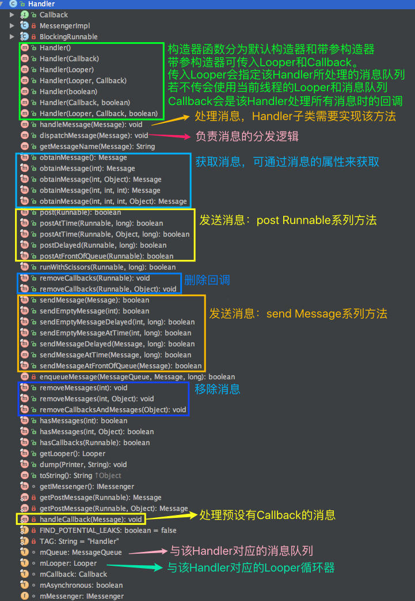
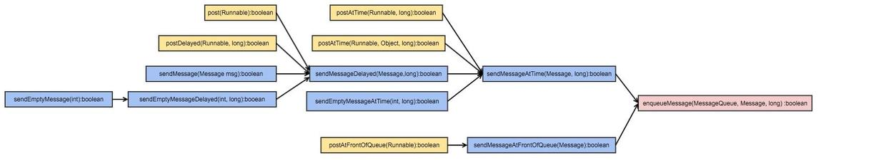
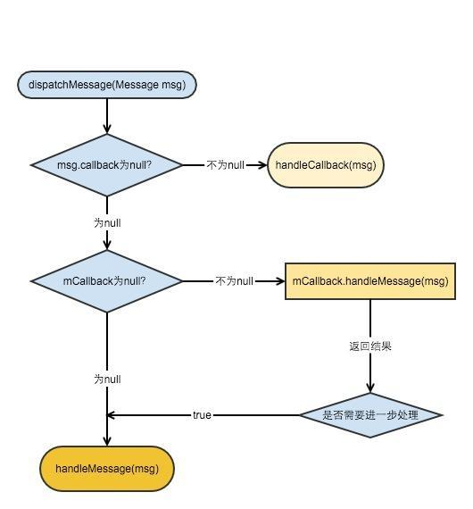

# Handler

          
Handler是我們在開發中接觸到最多的類了。 他可謂是Android消息機制中的總調度員。他幾乎無所不能：創建消息可以是他，發消息是他，處理消息是他，移除消息還是他。所以，很多開發者對Handler很熟悉，對其背後底層默默工作的MessageQueue和Looper反而比較陌生。

我們先看一下Handler的類結構： 

 
Handler類結構.jpg

 從圖中我們可以看出，其包含了文章開頭所講的所有功能函數。 Handler的主要功能有：

<ol>
<li>構造函數</li>
<li>獲取消息</li>
<li>發送消息（消息入隊）</li>
<li>處理消息（消息的真正處理邏輯）</li>
<li>移除消息（消息出列）</li>
</ol>
<h2>構造函數</h2>

Handler的構造函數最終目的就是設置Handler中的幾個重要的成員變量：<code>mLooper</code>,<code>mQueue</code>,<code>mCallback</code>,<code>mAsynchronous</code>。

<table>
<thead>
<tr>
<th>filed</th>
<th>含義</th>
<th>說明</th>
</tr>
</thead>
<tbody>
<tr>
<td>mLooper</td>
<td>消息循環器Looper</td>
<td>該Handler所對應的Looper</td>
</tr>
<tr>
<td>mQueue</td>
<td>消息隊列MessageQueue</td>
<td>該Handler所處理消息所在的消息隊列</td>
</tr>
<tr>
<td>mCallback</td>
<td>Handler級別回調</td>
<td>Handler處理所有send Message系列消息時的統一回調。(下文會細述)</td>
</tr>
<tr>
<td>mAsynchronous</td>
<td>是不是異步處理方式</td>
<td>其實只有一個作用，就是在設置Barrier時仍可以不受Barrier的影響被正常處理，如果沒有設置 Barrier，異步消息就與同步消息沒有區別</td>
</tr>
</tbody>
</table>

代碼如下：

<pre class="hljs java"><code class="java">    public Handler(Callback callback, boolean async) {
        //這個會判斷一個警告，意思是說Handler class應該是一個靜態類，否則可能導致內存洩漏，
        // 至於為什麼可以參考鏈接http://stackoverflow.com/questions/11407943/this-handler-class-should-be-static-or-leaks-might-occur-incominghandler
        if (FIND_POTENTIAL_LEAKS) {
            final Class&lt;? extends Handler&gt; klass = getClass();
            if ((klass.isAnonymousClass() || klass.isMemberClass() || klass.isLocalClass()) &amp;&amp;
                    (klass.getModifiers() &amp; Modifier.STATIC) == 0) {
                Log.w(TAG, "The following Handler class should be static or leaks might occur: " +
                    klass.getCanonicalName());
            }
        }
        //必須先執行Looper.prepare()，才能獲取Looper對象，否則為null.
        mLooper = Looper.myLooper();
        if (mLooper == null) {
            throw new RuntimeException(
                "Can't create handler inside thread that has not called Looper.prepare()");
        }
        mQueue = mLooper.mQueue;//消息隊列，來自Looper對象
        mCallback = callback;//回調方法
        mAsynchronous = async; //設置消息是否為異步處理方式
    }</code></pre>

代碼比較簡單，過程為：

<ol>
<li>首先判斷下是不是有可能內存洩漏（該問題我會有單獨的文章闡述），</li>
<li>然後得到當前線程的Looper賦值給<code>mLooper</code>，如果mLooper為空，說明當前線程並不是一個可接受消息的線程，需要在線程開啟時用Looper.prepare()和Looper.loop()來初始化才可以繼續。</li>
<li>為mQueue和mCallback、mAsynchronous等成員函數賦值。</li>
</ol>
<blockquote>
Handler也是在這裡和Looper、MessageQueue聯繫起來的。
</blockquote>
<h2>獲取消息</h2>

Handler中通過一系列的obtainMessage()方法，封裝了Message從消息池中取到符合要求的消息的方法。

<pre class="hljs java"><code class="java">public final Message obtainMessage()
public final Message obtainMessage(int what)
public final Message obtainMessage(int what, Object obj)
public final Message obtainMessage(int what, int arg1, int arg2)
public final Message obtainMessage(int what, int arg1, int arg2, Object obj)</code></pre>
<blockquote>
這些方法都會將該Handler設置為該消息的<code>target</code>。
</blockquote>
<h2>發送消息</h2>

Handler發送消息主要有兩種方法：post系列方法和send系列方法。

<ol>
<li>

post runnable 系列

<pre class="hljs java"><code class="java">final boolean post(Runnable r)
final boolean postAtTime(Runnable r, long uptimeMillis)
final boolean postAtTime(Runnable r, Object token, long uptimeMillis)
final boolean postDelayed(Runnable r, long delayMillis)
final boolean postAtFrontOfQueue(Runnable r)</code></pre>
</li>
<li>

send Message 系列

<pre class="hljs java"><code class="java">final boolean sendEmptyMessage(int what)
final boolean sendEmptyMessageDelayed(int what, long delayMillis)
final boolean sendEmptyMessageAtTime(int what, long uptimeMillis)
final boolean sendMessageDelayed(Message msg, long delayMillis)
boolean sendMessageAtTime(Message msg, long uptimeMillis)
final boolean sendMessageAtFrontOfQueue(Message msg)</code></pre>
</li>
</ol>

他們之間的調用關係如圖： 

 
Handler發送消息調用過程

 他們最終都是將某個消息壓入到MessageQueue中，等待處理。區別在於：

<ol>
<li>發送機制不同。 post runnable系列處理的參數是封裝了需執行動作的runnable，首先將runnable封裝成一個Message，然後再調用對應的send系列函數把最終它壓入到MessageQueue中。 send message系列處理的參數直接是Message，經過一些賦值後，直接壓入到MessageQueue中。</li>
<li>最終處理機制不同。 post runnable系列方法在被封裝成Message時，設置了其Callback為該runnable，最終在Handler的dispatchMessage裡面會交由handlerCallback方法處理，執行其runnable的run()方法。 send message系列方法最終會受到Handler的Callback影響，或交由Handler的handleMessage()方法處理。</li>
<li>兩者本質沒有區別，區別在於是否post runnable系列方法可以在不繼承Handler並重寫handleMessage()方法的前提下對一些不可預知的消息類型做相應處理。比較常見的例子如SDK中的這些方法：<pre class="hljs java"><code class="java">Activity.runOnUiThread(Runnable)
View.post(Runnable)
View.postDelayed(Runnable, long)</code></pre>
這也是post系列方法存在的意義。</li>
</ol>
<h2>處理消息</h2>

從上一篇文章中我們可以知道，Looper循環過程中，取出一條消息後，是通過調用該消息對應的Handler的dispatchMessage(Message msg)對消息進行處理。

code in Looper.loop():

<pre class="hljs java"><code class="java">msg.target.dispatchMessage(msg); //msg.target就是與此線程關聯的Handler對象，調用它的dispatchMessage處理消息</code></pre>

Handler處理消息的源碼如下：

<pre class="hljs java"><code class="java">    /**
     * 在這裡處理系統消息
     * Handle system messages here.
     */
    public void dispatchMessage(Message msg) {
        if (msg.callback != null) {//post系列方法走這裡
            handleCallback(msg);
        } else {//sendMessage系列方法走這裡
            if (mCallback != null) {//Handler構造函數中定義了Callback的這裡處理
                if (mCallback.handleMessage(msg)) {
                    return;
                }
            }
            handleMessage(msg);
        }
    }</code></pre>

其處理邏輯流程如圖： 

 
Handler處理消息.jpg

 其實邏輯很簡單。

<ol>
<li>首先看是否這條消息是否有已被預設了callback，如果有，直接調用handlerCallback(msg)處理預設好的callback。至此，滿足該條件的的消息處理流程結束。</li>
<li>其次，如果不符合<code>1.</code>中的情況，看該Handler在被創建時，是否有設定Handler級別的Callback，如果有，處理之。這裡和<code>1.</code>中所描述情況的區別是，Handler級別的Callback是有返回值的，處理完後會根據返回值看是否需要進一步處理。</li>
<li>如果Message沒有被預設Callback，也沒有Handler級別的Callback（或者有但需要進一步處理），必須在 由子類重寫的<code>handleMessage(Message msg)</code>中做最後處理。大多數情況下的消息都在這裡處理。</li>
</ol>
<blockquote>
根據Handler中的發送消息的方法源碼可知，Post系列方法的都會調用getPostMessage(Runnable r)函數將一個Runnable對象封裝成一條Message，封裝時，會將該runnable參數作為消息的callback。所以，我們可以得出結論：<strong><code>post runnable系列方法消息的最終都在handleCallback(msg)中處理。</code></strong>
</blockquote>
<h2>移除消息</h2>

根據消息入列的區別，移除消息也分為<code>removeMessages</code>和<code>removeCallbacks</code>兩系列。和發送消息類似， Handler的移除消息最終還是對其對應的MessageQueue的操作，從中移除符合條件的消息。

<blockquote>
使用Handler的過程中，為避免Activity調用onDestroy後，Handler的MessageQueue中仍存在Message，一般會在onDestroy中調用removeCallbacksAndMessages()方法。
</blockquote>
<h2>幾個問題</h2>
<ol>
<li>為什麼Handler的構造函數需要一個Callback 從Handler的消息處理邏輯可以看出,一旦一個Handler在構造時，Handler級別的Callback 被初始化。是所有沒有單獨預設Callback的Message(post系列方法發送的消息除外的消息)都會被該Callback處理。 <strong>我們可以在Handler級別的Callback中加入由該Handler處理的所有類型消息的共同邏輯。</strong>
</li>
<li>Handler是如何與Looper和MessageQueue聯繫起來的。 是通過構造函數中聯繫起來的，Handler的一堆構造函數，其實最終目的就是設置Handler中的幾個重要的成員變量：<code>mLooper</code>,<code>mQueue</code>,<code>mCallback</code>,<code>mAsynchronous</code>。首先設置好mLooper，mLooper中有一個和其一一對應的變量：mQueue。 所以，<strong>Hander是通過其對應的mLooper，進而和線程中的消息隊列mQueue聯繫起來的</strong>。</li>
<li>post系列方法傳入的Runnable中若持有Context的引用，會造成內存洩漏嗎？ 顯然是會的。Runnable會被封裝成Message加入到消息隊列中，只要該消息不被處理或者移除，消息隊列就會間接持有Context的強引用，造成內存溢出，所以，如果該Handler是針對一個Activity的操作，在Activity的 onDestory()回調函數中中一定要調用removeCallbacksAndMessages()來防止內存洩漏。</li>
</ol>

        
