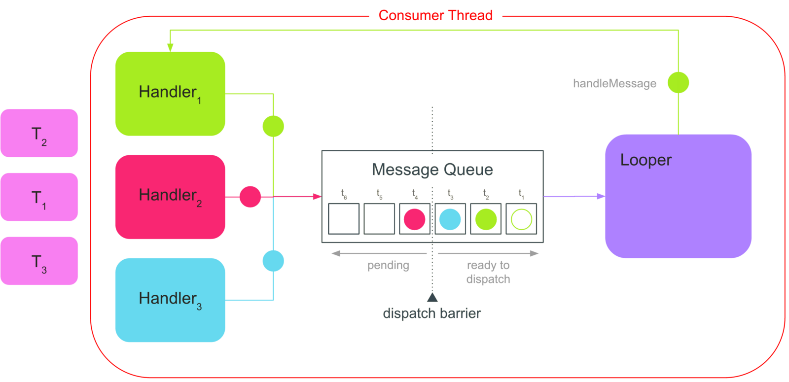
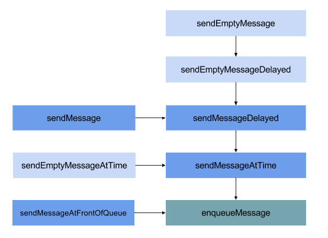
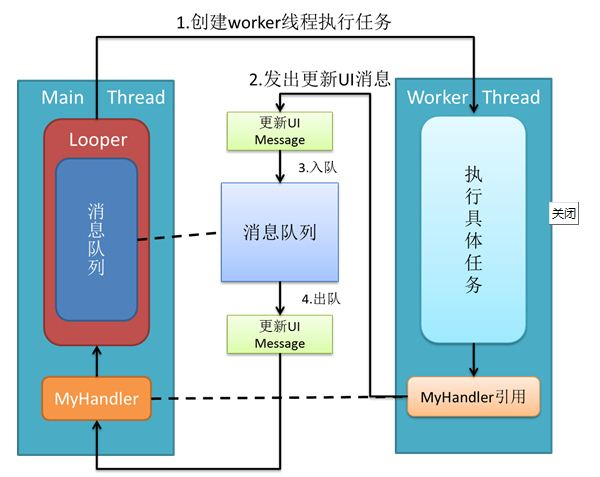
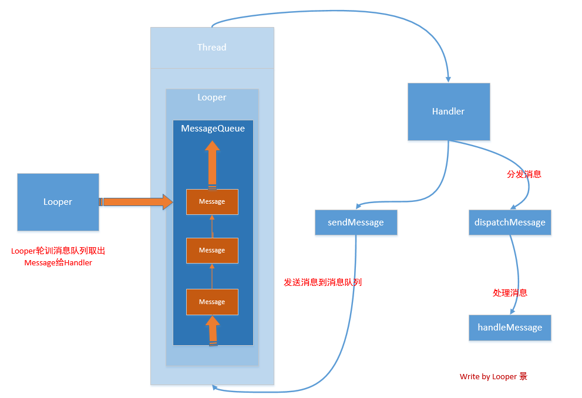
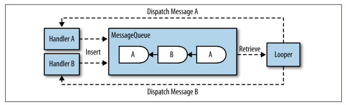

# Handler消息機制再梳理





##前言
多線程的消息傳遞處理，從初學Android時的Handler，懵懵懂懂地照貓畫虎，到後來一頭霧水的疑惑它為什麼這麼複雜，再到熟悉之後的歎為觀止，一步步地都是自己踩過的足跡，都是成長啊哈哈哈。雖然離出神入化的境界還遠十萬八千里呢，但Android中的Handler多線程消息傳遞機制，的確是研發技術學習中不可多得的一個寶藏。本來我以為自己之前的學習以及比較瞭解 Handler，在印象中 Android 消息機制無非就是：

- Handler 給 MessageQueue 添加消息
- 然後 Looper 無限循環讀取消息
- 再調用 Handler 處理消息

但是只知道整體流程，細節還不是特別透徹。最近不甚忙碌，回頭看到這塊又有些許收穫，我們來記錄一下吧。

在整個Android的源碼世界裡，有兩大利劍，其一是`Binder IPC機制`，另一個便是`消息機制`。Android有大量的消息驅動方式來進行交互，比如Android的四劍客Activity, Service, Broadcast, ContentProvider的啟動過程的交互，都離不開消息機制，Android某種意義上也可以說成是一個以消息驅動的系統。而Android 消息機制主要涉及 4 個類：

- Handler
- Message
- MessageQueue
- Looper

我們依次結合源碼分析一下。


##初學Handler
每個初學Android開發的都繞不開Handler這個“坎”，為什麼說是個坎呢，首先這是Android架構的精髓之一，其次大部分人都是知其然卻不知其所以然。所以決定再去翻翻源代碼梳理一下Handler的實現機制。

##異步更新UI
我們都知道Android中主線程就是UI線程。`在主線程不能做耗時操作，而子線程不能更新UI`。主線程如果耗時操作太久（超過5秒）會引起ANR。子線程更新UI，會導致線程不安全，界面的刷新不能同步，可能不起作用甚至是崩潰。詳細的分析可以看這篇文章Android子線程真的不能更新UI麼？


上面這個規定應該是初學必知的，那要怎麼來解決這個問題呢，這時候Handler就出現在我們面前了，我們也可以利用AsyncTask或者IntentService進行異步的操作。這兩者又是怎麼做到的呢？其實，在AsyncTask和IntentService的內部亦使用了Handler實現其主要功能。拋開這兩者不談，當我們打開Android源碼的時候也隨處可見Handler的身影。所以，Handler是Android異步操作的核心和精髓，它在眾多領域發揮著極其重要甚至是不可替代的作用。我們先來一段經典常用代碼（這裡忽略內存洩露問題，我們後面再說）：

首先在Activity中新建一個handler:

```java
private Handler mHandler = new Handler()
{
    @Override
    public void handleMessage(Message msg) {
        super.handleMessage(msg);

        switch (msg.what) {
        case 0:
            mTestTV.setText("This is handleMessage");   //更新UI
            break;
        }
    }
};
```

然後在子線程裡發送消息：

```java
new Thread(new Runnable()
{
    @Override
    public void run() {
        try {
            Thread.sleep(1000); //在子線程有一段耗時操作,比如請求網絡
            mHandler.sendEmptyMessage(0);
        } catch (InterruptedException e) {
            e.printStackTrace();
        }
    }
}).start();

```

我們可以看到，子線程拿著主線程的mHandler對象調用了它的sendEmptyMessage(0)方法發送了一個空Message。然後主線程就更新了mTestTV這個TextView的內容。下面，我們就根據這段代碼逐步跟蹤分析一下Handler源碼，梳理一下Android的這個消息機制。


## Handler源碼跟蹤

根據上面的Handler使用例子，我們從Handler的sendEmptyMessage()方法這裡開始，翻看Handler的源碼：


```java
public final boolean sendEmptyMessage(int what)
{
    return sendEmptyMessageDelayed(what, 0);
}

public final boolean sendEmptyMessageDelayed(int what, long delayMillis)
{
    Message msg = Message.obtain();
    msg.what = what;
    return sendMessageDelayed(msg, delayMillis);
}

public final boolean sendMessageDelayed(Message msg, long delayMillis)
{
    if (delayMillis < 0) {
        delayMillis = 0;
    }

    return sendMessageAtTime(msg, SystemClock.uptimeMillis() + delayMillis);
}
```

我們可以看到，最後調用了sendMessageAtTime()方法，我們接著看這個方法：


```java
public boolean sendMessageAtTime(Message msg, long uptimeMillis)
{
    MessageQueue queue = mQueue;    //拿到MessageQueue隊列對象

    if (queue == null) {
        RuntimeException e = new RuntimeException(
            this + " sendMessageAtTime() called with no mQueue");
        Log.w("Looper", e.getMessage(), e);
        return false;
    }

    //把msg對象入隊
    return enqueueMessage(queue, msg, uptimeMillis);
}
```

也就是說，目前我們看到的Handler的sendEmptyMessage()方法調用邏輯如下圖：





最後這個sendMessageAtTime()方法我們看到兩個亮點：

- 第一步，`首先拿到消息隊列MessageQueue類型的mQueue對象`。
- 第二步，`把消息Message類型的實例msg對象入隊`。

接下來，我們就沿著這兩個問題分別往下跟蹤。


## MessageQueue對象從哪裡來

我們先來看mQueue這個MessageQueue對象哪來的呢？我們找到了賦值的地方，原來在Handler的構造函數裡：

```java
public Handler(Callback callback, boolean async)
{
    if (FIND_POTENTIAL_LEAKS) {
        final Class <? extends Handler > klass = getClass();

        if ((klass.isAnonymousClass() || klass.isMemberClass() ||
             klass.isLocalClass()) &&
            (klass.getModifiers() & Modifier.STATIC) == 0) {
            Log.w(TAG, "The following Handler class should be static or leaks might occur: "
                  +
                  klass.getCanonicalName());
        }
    }

    mLooper = Looper.myLooper();    //使用Looper.myLooper()取到了mLooper對象

    if (mLooper == null) {
        throw new RuntimeException(
            "Can't create handler inside thread that has not called Looper.prepare()");
    }

    mQueue = mLooper.mQueue;    //原來消息隊列來自mLooper對象裡的mQueue
    mCallback = callback;
    mAsynchronous = async;
}
```


原來mQueue這個對象是從Looper這個對象中獲取的，同時我們看到是通過Looper.myLooper()獲取到Looper對象的。也就是說每個Looper擁有一個消息隊列MessageQueue對象。我們在Looper的構造函數裡看到是它new了一個MessageQueue：

```java
final MessageQueue mQueue;

private Looper(boolean quitAllowed)
{
    mQueue = new MessageQueue(quitAllowed); //初始化MessageQueue對象
    mThread = Thread.currentThread();
}
```

我們緊接著再進入Looper類中的myLooper()方法看看如何得到Looper實例對象的：


```java
/**
 * Return the Looper object associated with the current thread.  Returns
 * null if the calling thread is not associated with a Looper.
 */
public static Looper myLooper()
{
    return sThreadLocal.get();
}

// sThreadLocal.get() will return null unless you've called prepare().
static final ThreadLocal<Looper> sThreadLocal = new ThreadLocal<Looper>();
```

原來這個looper對象是從一個ThreadLocal線程本地存儲TLS對象中取到的，而且這個實例聲明上面我們可以看到一行註釋：`如果不提前調用prepare()方法的話sThreadLocal.get()可能返回null`。

我們來看看這個prepare()方法到底幹了什麼：

```java
private static void prepare(boolean quitAllowed)
{
    //每個線程只允許執行一次該方法，第二次執行時線程的TLS已有數據，則會拋出異常。
    if (sThreadLocal.get() != null) {
        throw new RuntimeException("Only one Looper may be created per thread");
    }

    //創建Looper對象，並保存到當前線程的TLS區域
    sThreadLocal.set(new Looper(quitAllowed));
}
```

原來是給ThreadLocal線程本地存儲TLS對象set了一個新的Looper對象。換句話說，就是new了一個Looper對象然後保存在了線程本地存儲區裡了。而這個ThreadLocal線程本地存儲對象就是每個線程專有的變量，可以理解成線程的自有變量保存區。我們這裡不作深入介紹，只用理解每個線程可以通過Looper.prepare()方法new一個Looper對象保存起來，然後就可以擁有一個Looper了。這也就是我們在非UI線程中使用Handler之前必須首先調用Looper.prepare()方法的根本原因。


插播：ThreadLocal類實現一個線程本地的存儲，也就是說，每個線程都有自己的局部變量。所有線程都共享一個ThreadLocal對象，但是每個線程在訪問這些變量的時候能得到不同的值，每個線程可以更改這些變量並且不會影響其他的線程，並且支持null值。詳細介紹可以看看這裡：Android線程管理之ThreadLocal理解及應用場景


比如我們在Activity的onCreate()方法中寫一段這樣的代碼：


```java
@Override
protected void onCreate(Bundle savedInstanceState)
{
    super.onCreate(savedInstanceState);
    setContentView(R.layout.activity_main);

    Handler h1 = new Handler();

    new Thread(new Runnable() {
        @Override public void run() {
            Handler h2 = new Handler();     //直接在子線程中new一個Handler
        }
    }).start();
}
```

運行之後h1正常創建，但是創建h2的時候crash了：


```java
——— beginning of crash
E/AndroidRuntime: FATAL EXCEPTION: Thread-263
Process: com.example.stone.sfsandroidclient, PID: 32286
java.lang.RuntimeException: Can’t create handler inside thread that has not called Looper.prepare()
at android.os.Handler.(Handler.java:200)
at android.os.Handler.(Handler.java:114)
at com.example.stone.sfsandroidclient.MainActivity$1.run(MainActivity.java:71)
at java.lang.Thread.run(Thread.java:818)
```

很明顯，出錯日誌提示`不能在一個沒有調用過Looper.prepare()的Thread裡邊new Handler()。`

看到了這裡有一個疑惑，那就是我們在文章開頭的示例代碼中新建mHandler的時候並沒有調用Looper.prepare()方法，那Looper的創建以及方法調用在哪裡呢？其實這些東西Android本身已經幫我們做了，在程序入口ActivityThread的main方法裡面我們可以找到：


```java
public static void main(String[] args)
{
    ...
    Looper.prepareMainLooper();     //這裡等同於Looper.prepare()
    ...
    Looper.loop();
    ...
}
```


##Message對象如何入隊

我們明白了MessageQueue消息隊列對象是來自於ThreadLocal線程本地存儲區存儲的那個唯一的Looper對象。我們接著看Handler在發送消息的最後調用的enqueueMessage()方法，看名字應該是把消息加入隊列的意思，點進去看下：

```java
private boolean enqueueMessage(MessageQueue queue, Message msg, long uptimeMillis)
{
    msg.target =
        this;      //注意此處Handler把自己this賦值給了Message的target變量

    if (mAsynchronous) {
        msg.setAsynchronous(true);
    }

    return queue.enqueueMessage(msg, uptimeMillis);
}
```

我們看到msg的target的賦值是Handler自己，也就是說這個msg實例對象現在持有了主線程中mHandler這個對象。注意這裡，我們稍後會講到msg持有這個mHandler對象的用途。最後調用了MessageQueue類的enqueueMessage()方法加入到了消息隊列。

看來真正的入隊方法交給了MessageQueue，這個enqueueMessage()方法較長，我們現在繼續進入看看：

```java
boolean enqueueMessage(Message msg, long when)
{
    if (msg.target == null) {    //這裡要求消息必須跟 Handler 關聯
        throw new IllegalArgumentException("Message must have a target.");
    }

    if (msg.isInUse()) {
        throw new IllegalStateException(msg + " This message is already in use.");
    }

    synchronized(this) {
        if (mQuitting) {    //如果消息隊列已經退出，還入隊就報錯
            IllegalStateException e = new IllegalStateException(
                msg.target + " sending message to a Handler on a dead thread");
            Log.w(TAG, e.getMessage(), e);
            msg.recycle();
            return false;
        }

        msg.markInUse();    //消息入隊後就標記為 在被使用
        msg.when = when;
        Message p = mMessages;
        boolean needWake;

        //添加消息到鏈表中
        if (p == null || when == 0 || when < p.when) {
            //之前是空鏈表的時候讀取消息會阻塞，新添加消息後喚醒
            msg.next = p;
            mMessages = msg;
            needWake = mBlocked;
        } else {
            //插入消息到隊列時，只有在隊列頭部有個屏障並且當前消息是異步的時才需要喚醒隊列
            needWake = mBlocked && p.target == null && msg.isAsynchronous();
            Message prev;

            for (;;) {
                prev = p;
                p = p.next;

                if (p == null || when < p.when) {
                    break;
                }

                if (needWake && p.isAsynchronous()) {
                    needWake = false;
                }
            }

            msg.next = p; // invariant: p == prev.next
            prev.next = msg;
        }

        // We can assume mPtr != 0 because mQuitting is false.
        if (needWake) {
            nativeWake(mPtr);
        }
    }
    return true;
}
```

可以看到一個無限循環將消息加入到消息隊列中（鏈表的形式），但是有放就有拿，這個消息怎樣把它取出來呢？

翻看MessageQueue的方法，我們找到了next()方法，也就是出隊方法。這個方法代碼太長，可以不用細看我們知道它是用來把消息取出來的就行了。


```java
Message next()
{
    //如果消息的 looper 退出，就退出這個方法
    final long ptr = mPtr;

    if (ptr == 0) {
        return null;
    }

    int pendingIdleHandlerCount = -1; // -1 only during first iteration
    int nextPollTimeoutMillis = 0;

    //也是一個循環，有合適的消息就返回，沒有就阻塞
    for (;;) {
        if (nextPollTimeoutMillis !=
            0) {    //如果有需要過段時間再處理的消息，先調用 Binder 的這個方法
            Binder.flushPendingCommands();
        }

        nativePollOnce(ptr, nextPollTimeoutMillis);

        synchronized(this) {
            //獲取下一個消息
            final long now = SystemClock.uptimeMillis();
            Message prevMsg = null;
            Message msg = mMessages;    //當前鏈表的頭結點

            if (msg != null && msg.target == null) {
                //如果消息沒有 target，那它就是一個屏障，需要一直往後遍歷找到第一個異步的消息
                do {
                    prevMsg = msg;
                    msg = msg.next;
                } while (msg != null && !msg.isAsynchronous());
            }

            if (msg != null) {
                if (now < msg.when) {    //如果這個消息還沒到處理時間，就設置個時間過段時間再處理
                    nextPollTimeoutMillis = (int) Math.min(msg.when - now, Integer.MAX_VALUE);
                } else {
                    // 消息是正常的、可以立即處理的
                    mBlocked = false;

                    //取出當前消息，鏈表頭結點後移一位
                    if (prevMsg != null) {
                        prevMsg.next = msg.next;
                    } else {
                        mMessages = msg.next;
                    }

                    msg.next = null;

                    if (DEBUG) {
                        Log.v(TAG, "Returning message: " + msg);
                    }

                    msg.markInUse();    //標記這個消息在被使用
                    return msg;
                }
            } else {
                // 消息鏈表裡沒有消息了
                nextPollTimeoutMillis = -1;
            }

            //如果收到退出的消息，並且所有等待處理的消息都處理完時，調用 Native 方法銷毀隊列
            if (mQuitting) {
                dispose();
                return null;
            }

            //有消息等待過段時間執行時，pendingIdleHandlerCount 增加
            if (pendingIdleHandlerCount < 0
                && (mMessages == null || now < mMessages.when)) {
                pendingIdleHandlerCount = mIdleHandlers.size();
            }

            if (pendingIdleHandlerCount <= 0) {
                mBlocked = true;
                continue;
            }

            if (mPendingIdleHandlers == null) {
                mPendingIdleHandlers = new IdleHandler[Math.max(pendingIdleHandlerCount, 4)];
            }

            mPendingIdleHandlers = mIdleHandlers.toArray(mPendingIdleHandlers);
        }

        for (int i = 0; i < pendingIdleHandlerCount; i++) {
            final IdleHandler idler = mPendingIdleHandlers[i];
            mPendingIdleHandlers[i] = null; // release the reference to the handler

            boolean keep = false;

            try {
                keep = idler.queueIdle();
            } catch (Throwable t) {
                Log.wtf(TAG, "IdleHandler threw exception", t);
            }

            if (!keep) {
                synchronized(this) {
                    mIdleHandlers.remove(idler);
                }
            }
        }

        // Reset the idle handler count to 0 so we do not run them again.
        pendingIdleHandlerCount = 0;

        // While calling an idle handler, a new message could have been delivered
        // so go back and look again for a pending message without waiting.
        nextPollTimeoutMillis = 0;
    }
}
```

可以看到，MessageQueue.next() 方法裡有一個循環，在這個循環中遍歷消息鏈表，找到下一個可以處理的、target 不為空的消息並且執行時間不在未來的消息，就返回，否則就繼續往後找。

如果有阻塞（沒有消息了或者只有 Delay 的消息），會把 mBlocked這個變量標記為 true，在下一個 Message 進隊時會判斷這個message 的位置，如果在隊首就會調用nativeWake() 方法喚醒線程！

不過MessageQueue.next() 這個方法是在什麼地方調用的呢，不是在Handler中，我們找到了Looper這個關鍵人物，專門負責從消息隊列中拿消息。


##Looper如何處理Message
我們又來到了Looper的陣地，他在調用MessageQueue的next()方法，來從消息隊列中拿Message對象，關鍵代碼如下：

```java
/**
 * Run the message queue in this thread. Be sure to call
 * {@link #quit()} to end the loop.
 */
public static void loop()
{
    final Looper me = myLooper();

    if (me == null) {    //當前線程必須創建 Looper 才可以執行
        throw new RuntimeException("No Looper; Looper.prepare() wasn't called on this thread.");
    }

    final MessageQueue queue = me.mQueue;

    //底層對 IPC 標識的處理，不用關心
    Binder.clearCallingIdentity();
    final long ident = Binder.clearCallingIdentity();

    for (;;) {    //無限循環模式
        Message msg = queue.next(); //從消息隊列中讀取消息，可能會阻塞

        if (msg ==
            null) {    //當消息隊列中沒有消息時就會返回，不過這只發生在 queue 退出的時候
            return;
        }

        //...
        try {
            msg.target.dispatchMessage(msg);    //調用消息關聯的 Handler 處理消息
        }

        finally {
            if (traceTag != 0)
            {
                Trace.traceEnd(traceTag);
            }
        }
        //...
        msg.recycleUnchecked();    //標記這個消息被回收
    }
}
```

可以看到，Looper.loop() 也很簡單，就是調用消息隊列 MessageQueue.next() 方法取消息，如果沒有消息的話會阻塞，直到有新的消息進入或者消息隊列退出。也就是不斷重複下面的操作，直到沒有消息時退出循環

- 讀取MessageQueue的下一條Message；
- 把Message分發給相應的target；
- 再把分發後的Message回收到消息池，以便重複利用。

拿到消息後調用msg.target的dispatchMessage(msg)方法，而這個msg.target是什麼呢？就是前面Handler發送消息sendMessageAtTime()時把自己賦值給msg.target的主線程的mHandler對象。也就是說，最後還是 Handler 負責處理消息。可以看到，Looper 並沒有執行消息，真正執行消息的還是添加消息到隊列中的那個 Handler。




所以我們來看Handler中的dispatchMessage(msg)方法：


```java
/**
 * Handle system messages here.
 */
public void dispatchMessage(Message msg)
{
    if (msg.callback != null) {
        handleCallback(msg);
    } else {
        if (mCallback != null) {
            if (mCallback.handleMessage(msg)) {
                return;
            }
        }

        handleMessage(msg);
    }
}

private static void handleCallback(Message message)
{
    message.callback.run();
}

public void handleMessage(Message msg)
{
}
```


可以看到，Handler 在處理消息時，會有三種情況：

###msg.callback 不為空
- 這在使用 Handler.postXXX(Runnable) 發送消息的時候會發生
- 這就直接調用 Runnable 的 run() 方法

###mCallback 不為空
- 這在我們使用前面介紹的 Handler.Callback 為參數構造 Handler 時會發生
- 那就調用構造函數裡傳入的 handleMessage() 方法
- 如果返回 true，那就不往下走了

###最後就調用Handler.handleMessage() 方法
- 這是一個空實現，需要我們在 Handler 子類裡重寫

而我們開頭的例子，使用的就是第3種方法，大家可以回顧一下。




到這裡，我們的疑問基本上就解決了，雖然沒有再深入到jni層看native底層實現，但是java層的機制我們大概明白了。最後我們對上面的源碼跟蹤分析做一個宏觀上的總結。

##整體運行機制
###四大主角


與Windows系統一樣，Android也是消息驅動型的系統。引用一下消息驅動機制的四要素：

- 接收消息的“消息隊列”
- 阻塞式地從消息隊列中接收消息並進行處理的“線程”
- 可發送的“消息的格式”
- “消息發送函數”

與之對應，Android中的實現對應了

接收消息的“消息隊列” ——【MessageQueue】
阻塞式地從消息隊列中接收消息並進行處理的“線程” ——【Thread+Looper】
可發送的“消息的格式” ——【Message】
“消息發送函數”——【Handler的post和sendMessage】

也就是說，消息機制主要包含以下四個主角：

- Message：消息分為硬件產生的消息（如按鈕、觸摸）和軟件生成的消息；
- MessageQueue：消息隊列的主要功能向消息池投遞消息（MessageQueue.enqueueMessage()）和- 取走消息池的消息（MessageQueue.next()）；
- Handler：消息輔助類，主要功能向消息池發送各種消息事件（Handler.sendMessage()）和處理相應消息事件（Handler.handleMessage()）；
- Looper：不斷循環執行（Looper.loop()），按分發機制將消息分發給目標處理者。
他們之間的關係如下：

- Thread：一個線程有唯一一個對應的Looper；
- Looper：有一個MessageQueue消息隊列；
- MessageQueue：有一組待處理的Message；
- Message中有一個用於處理消息的Handler；
- Handler中有Looper和MessageQueue。

##流程圖



一個Looper類似一個消息泵。它本身是一個死循環，不斷地從MessageQueue中提取Message或者Runnable。而Handler可以看做是一個Looper的暴露接口，向外部暴露一些事件，並暴露sendMessage()和post()函數。

在安卓中，除了UI線程/主線程以外，普通的線程(先不提HandlerThread)是不自帶Looper的。想要通過UI線程與子線程通信需要在子線程內自己實現一個Looper。開啟Looper分`三步走`：

- 判定是否已有Looper並Looper.prepare()
- 做一些準備工作(如暴露handler等)
- 調用Looper.loop()，線程進入阻塞態

由於每一個線程內最多只可以有一個Looper，所以一定要在Looper.prepare()之前做好判定，否則會拋出java.lang.RuntimeException: Only one Looper may be created per thread。為了獲取Looper的信息可以使用兩個方法：

- Looper.myLooper()
- Looper.getMainLooper()

Looper.myLooper()獲取當前線程綁定的Looper，如果沒有返回null。Looper.getMainLooper()返回主線程的Looper,這樣就可以方便的與主線程通信。

## 總結
- Looper調用prepare()進行初始化，創建了一個與當前線程對應的Looper對象（通過ThreadLocal實現），並且初始化了一個與當前Looper對應的MessageQueue對象。
- Looper調用靜態方法loop()開始消息循環，通過MessageQueue.next()方法獲取Message對象。
- 當獲取到一個Message對象時，讓Message的發送者（target）去處理它。
- Message對象包括數據，發送者（Handler），可執行代碼段（Runnable）三個部分組成。
- Handler可以在一個已經Looper.prepare()的線程中初始化，如果線程沒有初始化Looper，創建Handler對象會失敗
- 一個線程的執行流中可以構造多個Handler對象，它們都往同一個MQ中發消息，消息也只會分發給對應的Handler處理。
- Handler將消息發送到MQ中，Message的target域會引用自己的發送者，Looper從MQ中取出來後，再交給發送這個Message的Handler去處理。
- Message可以直接添加一個Runnable對象，當這條消息被處理的時候，直接執行Runnable.run()方法。

### Handler的內存洩露問題

再來看看我們的新建Handler的代碼：


```java
private Handler mHandler = new Handler()
{
    @Override
    public void handleMessage(Message msg) {
        ...
    }
};

```

`當使用內部類（包括匿名類）來創建Handler的時候，Handler對象會隱式地持有Activity的引用。`

而Handler通常會伴隨著一個耗時的後台線程一起出現，這個後台線程在任務執行完畢後發送消息去更新UI。然而，如果用戶在網絡請求過程中關閉了Activity，正常情況下，Activity不再被使用，它就有可能在GC檢查時被回收掉，但由於這時線程尚未執行完，而該線程持有Handler的引用（不然它怎麼發消息給Handler？），這個Handler又持有Activity的引用，就導致該Activity無法被回收（即內存洩露），直到網絡請求結束。

另外，如果執行了Handler的postDelayed()方法，那麼在設定的delay到達之前，會有一條MessageQueue -> Message -> Handler -> Activity的鏈，導致你的Activity被持有引用而無法被回收。

解決方法之一，使用弱引用：


```java
static class MyHandler extends Handler
{
    WeakReference<Activity > mActivityReference;
    MyHandler(Activity activity)
    {
        mActivityReference = new WeakReference<Activity>(activity);
    }
    @Override
    public void handleMessage(Message msg)
    {
        final Activity activity = mActivityReference.get();

        if (activity != null) {
            mImageView.setImageBitmap(mBitmap);
        }
    }
}
```

從JDK1.2開始，Java把對象的引用分為四種級別，這四種級別由高到低依次為：強引用、軟引用、弱引用和虛引用。

- 強引用：我們一般使用的就是強引用，垃圾回收器一般都不會對其進行回收操作。當內存空間不足時Java虛擬機寧願拋出OutOfMemoryError錯誤使程序異常終止，也不會回收具有強引用的對象。

- 軟引用(SoftReference)：如果一個對象具有軟引用(SoftReference)，在內存空間足夠的時候GC不會回收它，如果內存空間不足了GC就會回收這些對象的內存空間。

- 弱引用(WeakReference) ：如果一個對象具有弱引用(WeakReference)，那麼當GC線程掃瞄的過程中一旦發現某個對象只具有弱引用而不存在強引用時不管當前內存空間足夠與否GC都會回收它的內存。由於垃圾回收器是一個優先級較低的線程，所以不一定會很快發現那些只具有弱引用的對象。為了防止內存溢出，在處理一些佔用內存大而且生命週期較長的對象時候，可以儘量使用軟引用和弱引用。

- 虛引用(PhantomReference) ：虛引用(PhantomReference)與其他三種引用都不同，它並不會決定對象的生命週期。如果一個對象僅持有虛引用，那麼它就和沒有任何引用一樣，在任何時候都可能被垃圾回收器回收。所以，虛引用主要用來跟蹤對象被垃圾回收器回收的活動，在一般的開發中並不會使用它。

##進程、線程間通信方式


文章最後，我們來整理一下進程、線程間通信方式，參考線程通信與進程通信的區別。看看Handler消息傳遞機制屬於哪種？

### 一、進程間的通信方式
- 管道( pipe )：管道是一種半雙工的通信方式，數據只能單向流動，而且只能在具有親緣關係的進程間使用。進程的親緣關係通常是指父子進程關係。
- 有名管道 (namedpipe) ： 有名管道也是半雙工的通信方式，但是它允許無親緣關係進程間的通信。
- 信號量(semophore ) ： 信號量是一個計數器，可以用來控制多個進程對共享資源的訪問。它常作為一種鎖機制，防止某進程正在訪問共享資源時，其他進程也訪問該資源。因此，主要作為進程間以及同一進程內不同線程之間的同步手段。
- 消息隊列( messagequeue ) ： 消息隊列是由消息的鏈表，存放在內核中並由消息隊列標識符標識。消息隊列克服了信號傳遞信息少、管道只能承載無格式字節流以及緩衝區大小受限等缺點。
- 信號 (sinal ) ： 信號是一種比較複雜的通信方式，用於通知接收進程某個事件已經發生。
- 共享內存(shared memory ) ：共享內存就是映射一段能被其他進程所訪問的內存，這段共享內存由一個進程創建，但多個進程都可以訪問。共享內存是最快的 IPC 方式，它是針對其他進程間通信方式運行效率低而專門設計的。它往往與其他通信機制，如信號兩，配合使用，來實現進程間的同步和通信。
- 套接字(socket ) ： 套解口也是一種進程間通信機制，與其他通信機制不同的是，它可用於不同及其間的進程通信。


<table>
<thead>
<tr>
<th><strong>IPC</strong></th>
<th><strong>數據拷貝次數</strong></th>
</tr>
</thead>
<tbody>
<tr>
<td>共享內存</td>
<td>0</td>
</tr>
<tr>
<td>Android Binder</td>
<td>1</td>
</tr>
<tr>
<td>Socket/管道/消息隊列</td>
<td>2</td>
</tr>
</tbody>
</table>

###二、線程間的通信方式
- 鎖機制：包括互斥鎖、條件變量、讀寫鎖
    - 互斥鎖提供了以排他方式防止數據結構被併發修改的方法。
    - 讀寫鎖允許多個線程同時讀共享數據，而對寫操作是互斥的。
    - 條件變量可以以原子的方式阻塞進程，直到某個特定條件為真為止。對條件的測試是在互斥鎖的保護下進行的。條件變量始終與互斥鎖一起使用。
- 信號量機制(Semaphore)：包括無名線程信號量和命名線程信號量
- 信號機制(Signal)：類似進程間的信號處理

線程間的通信目的主要是用於線程同步，所以線程沒有像進程通信中的用於數據交換的通信機制。


很明顯，Android的Handler消息機制使用消息隊列( MessageQueue )實現的線程間通信方式。而Binder是Android建立額一套新的IPC機制來滿足系統對通信方式，傳輸性能和安全性的要求`。Binder基於Client-Server通信模式，傳輸過程只需一次拷貝，為發送方添加UID/PID身份，既支持實名Binder也支持匿名Binder，安全性高`。此處就不對Binder作更多介紹了。