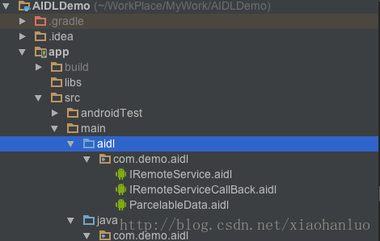
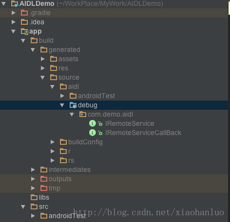

# 進程通信之Messenger&AIDL使用詳解

          <h2>1. 前言</h2>

提到的進程間通信（IPC：Inter-Process Communication），在Android系統中，一個進程是不能直接訪問另一個進程的內存的，需要提供一些機制在不同的進程之間進行通信，Android官方推出了AIDL(Android Interface Definition Language)，它是基於Binder機制的，至於官方為什麼要採用Binder，查看<a href="https://www.zhihu.com/question/39440766" target="_blank">為什麼Android要採用Binder作為IPC機制</a>，分析很全面。

上篇<a href="http://www.jianshu.com/p/a1d3d9693e91" target="_blank">Android之Service總結
</a>提到組件在與Service通信方法有三種。

<ul>
<li>實現IBinder</li>
<li>Messenger</li>
<li>AIDL</li>
</ul>

後面兩種可以跨進程通信，是基於Binder機制的通信方式。

<h2>2. 使用時機</h2>

在確定使用什麼機制之前，首先了解應用場景。Android系統中，如果組件與服務通信是在同一進程，就使用第一種方式；如果是跨進程通信，使用第二種和第三種，兩者不同在於，Messenger不能處理多線程併發請求。

<h2>3. AIDL使用</h2>

AIDL是可以處理多線程訪問的請求的，所以實現AIDL首先要保證線程安全。

<ul>
<li>創建.aidl文件，定義接口</li>
<li>在代碼中實現接口，Android SDK會根據aidl文件，生成接口，接口內部有一個名為Stub內部抽象類，這個類用於繼承了Binder類並實現aidl文件中定義的接口，我們需要拓展Stub類並實現裡面的抽象方法</li>
<li>複寫Service的<code>onBind()</code>，返回Stub類的實現</li>
</ul>
<h3>3.1 創建.aidl文件</h3>

在Android Studio中工程目錄下，反鍵<code>new -&gt; AIDL -&gt; AIDL FIle</code>，可以新建aidl文件，編譯器會自動在<code>app(殼工程)/src/main/</code>目錄下新建aidl文件，同時也會新建文件夾，默認以工程包名作為aidl文件所在的目錄。

目錄結構如下：

 
圖-1 aidl文件目錄結構

也可以手動創建，aidl接口定義的包名也可以和工程包名不同，aidl文件語法和Java語法相似，aidl定義的接口名必須和文件名一致，而且支持傳遞自定義的數據類型，需要實現parcelable接口。

IRemoteService.aidl

<pre class="hljs cs"><code class="cs">package com.demo.aidl;

import com.demo.aidl.ParcelableData;

interface IRemoteService {
    /**
     * 獲取當前進程的pid
     */
    int getPid();
    /**
     * 獲取當前服務名稱
     */
    String getServiceName();
    /**
     * 處理客戶端傳過來的數據
     */
    void handleData(in ParcelableData data);
}</code></pre>

ParcelableData.aidl

<pre class="hljs css"><code class="css">package com.demo.aidl;

/**
 * 聲明支持傳遞的類
 */
parcelable ParcelableData;</code></pre>

IRemoteServiceCallBack.aidl

<pre class="hljs cs"><code class="cs">package com.demo.aidl;

oneway interface IRemoteServiceCallBack {
    void valueChanged(int value);
}</code></pre>

aidl文件定義的接口支持的數據類型如下：

<ul>
<li>Java的八種基本數據類型（byte，int，short，long，float，double，char，boolean）</li>
<li>String</li>
<li>CharSequence</li>
<li>List，List中所有的元素必須是aidl文件支持的數據類型，例如，List&lt; String &gt;</li>
<li>Map，Map中所有的元素必須是aidl文件支持的數據類型，</li>
<li>其他aidl定義的接口，要手動添加import</li>
<li>其他aidl文件中申明的類，要手動添加import</li>
</ul>

aidl文件中定義的方法接受的參數，除了Java的基本數據類型和aidl定義的接口之外，其他參數都需要標記數據的走向，in/out/inout，基本數據類型和aidl定義的接口作為參數，默認是in。

<ul>
<li>in表示輸入參數，客戶端把參數傳遞給服務端使用。</li>
<li>out表示輸出參數，客戶端將參數傳遞給服務端填充，然後自己使用處理。</li>
<li>inout標書輸入輸出參數，傳送相應的值並接收返回。</li>
</ul>

關鍵字<code>oneway</code>表示用戶請求相應功能時不需要等待響應可直接調用返回，非阻塞效果，該關鍵字可以用來聲明接口或者聲明方法，如果接口聲明中用到了oneway關鍵字，則該接口聲明的所有方法都採用oneway方式

新建完畢aidl文件後，rebuild工程或者使用gradle assembleDebug(或gradle assembleRelease)指令編譯工程，生成具體的java代碼，在<code>殼工程/build/generated/aidl/</code>目錄下的<code>debug</code>或者<code>release</code>文件夾下，根據build的類型而定，如圖：

 
圖-2 adil生成代碼目錄圖

<strong>AIDL接口首次公佈後對其的任何修改都必須保持向後兼容性，避免中斷客戶端對服務的使用，因為需要將.aidl文件複製給其他應用，才能使其他應用能夠訪問服務，所以必須保持對原始接口的支持。</strong>

<h3>3.2 實現接口</h3>

Android SDK會根據.aidl文件生成同名.java文件，生成的接口中有一個Stub的抽象子類，這個類實現（implements）aidl定義的接口，同時繼承了<code>Binder</code>。

具體代碼如下：

<pre class="hljs aspectj"><code class="aspectj">private final IRemoteService.Stub mBinder = new IRemoteService.Stub() {
    @Override
    public int getPid() throws RemoteException {
        return Process.myPid();
    }

    @Override
    public String getServiceName() throws RemoteException {
        return RemoteService.this.getClass().getSimpleName();
    }

    @Override
    public void handleData(ParcelableData data) throws RemoteException {
        Toast.makeText(RemoteService.this, "num is " + data.num, Toast.LENGTH_SHORT).show();
    }

    @Override
    public void registerCallback(IRemoteServiceCallBack cb) throws RemoteException {
        if(cb != null) {
            mCallBacks.register(cb);
        }
    }

    @Override
    public void unregisterCallback(IRemoteServiceCallBack cb) throws RemoteException {
        if(cb != null) {
            mCallBacks.unregister(cb);
        }
    }
};</code></pre>

現在mBinder是Stub類的一個實例，同時也是一個Binder，用於服務定義的RPC服務，作為<code>onBind()</code>方法的返回對象實例。

實現AIDL接口注意事項：

<ul>
<li>因為AIDL可以處理多線程併發，在實現過程中要保證線程安全</li>
<li>默認情況下，RPC調用是同步的，但是服務端可能有耗時操作，客戶端最好不要在主線程調用服務</li>
<li>在服務端人工拋出的任何異常不會返回給客戶端</li>
</ul>
<h3>3.3 向客戶端暴露接口</h3>

實現接口後，需要向客戶端將接口暴露出來，以便客戶端使用。將Stub的實例化對象作為Service中<code>onBind()</code>方法的返回對象。

<pre class="hljs aspectj"><code class="aspectj">public class RemoteService extends Service {
    /**
     * 回調容器
     */
    private final RemoteCallbackList&lt;IRemoteServiceCallBack&gt; mCallBacks = new RemoteCallbackList&lt;&gt;();
    /**
     * aidl接口具體實現
     */
    private final IRemoteService.Stub mBinder = new IRemoteService.Stub() {
        @Override
        public int getPid() throws RemoteException {
            return Process.myPid();
        }

        @Override
        public String getServiceName() throws RemoteException {
            return RemoteService.this.getClass().getSimpleName();
        }

        @Override
        public void handleData(ParcelableData data) throws RemoteException {
            Toast.makeText(RemoteService.this, "num is " + data.num, Toast.LENGTH_SHORT).show();
        }

        @Override
        public void registerCallback(IRemoteServiceCallBack cb) throws RemoteException {
            if(cb != null) {
                mCallBacks.register(cb);
            }
        }

        @Override
        public void unregisterCallback(IRemoteServiceCallBack cb) throws RemoteException {
            if(cb != null) {
                mCallBacks.unregister(cb);
            }
        }
    };

    @Nullable
    @Override
    public IBinder onBind(Intent intent) {
        return mBinder;
    }

    @Override
    public void onDestroy() {
        // 註銷所有回調
        mCallBacks.kill();
    }
}</code></pre>
<h3>3.4 客戶端調用</h3>

服務提供給第三方應用使用，其他應用就必須要有接口類，在客戶端創建相同的aidl文件（可以直接拷貝過去）。

核心連接遠端服務的代碼：

<pre class="hljs cs"><code class="cs">/**
 * 遠端服務
 */
private IRemoteService mService;

private ServiceConnection mConnection = new ServiceConnection() {
    /**
     * 連接服務器成功回調
     * 
     * @param className
     * @param service
     */
    public void onServiceConnected(ComponentName className, IBinder service) {
        mService = IRemoteService.Stub.asInterface(service);
    }

    /**
     * 服務器因為一場情況斷開連接時候回調
     * 
     * @param className
     */
    public void onServiceDisconnected(ComponentName className) {
        mService = null;
    }
};

/**
 * 綁定服務
 */
private void doBindService() {
    isBound = true;
    Intent intent = new Intent(BindRemoteServiceActivity.this, RemoteService.class);
    bindService(intent, mConnection, Context.BIND_AUTO_CREATE);
}

/**
 * 解除綁定
 */
private void doUnbindService() {
    if(isBound &amp;&amp; mService != null) {
        isBound = false;
        try {
            mService.unregisterCallback(mCallback);
        } catch (RemoteException e) {
            e.printStackTrace();
        }

        unbindService(mConnection);
    }
}

/**
 * 向服務端發送信息
 */
private void doSendMsg() {
    if(!isBound || mService == null) {
        return;
    }
    ParcelableData data = new ParcelableData(1);
    try {
        mService.handleData(data);
    } catch (RemoteException e) {
        e.printStackTrace();
    }
}

/**
 * 調用服務端方法獲取信息
 */
private void doGetServiceInfo() {
    if(!isBound || mService == null) {
        return;
    }
    try {
        String info = mService.getServiceName();

        mInfoTv.setText("Service info :" + info);
    } catch (RemoteException e) {
        e.printStackTrace();
    }
}</code></pre>

詳情代碼貼上來比較長，貼上工程地址，<a href="https://github.com/Kyogirante/AIDLDemo" target="_blank">點我呀！！！</a>

<h2>4. Messenger的使用</h2>

Messenger的使用相對於AIDL方便好多，因為Messenger是Android系統中自帶的類，服務端和客戶端都不用創建AIDL文件。

Messenger會持有一個Handler，這個Handler用於處理接受到的信息，在服務端和乘客通過Messenger實現雙方通信。

<h3>4.1 服務端</h3>

代碼實例：

<pre class="hljs aspectj"><code class="aspectj">public class MessengerService extends Service {

    public static final int MSG_REGISTER_CLIENT = 0X001;
    public static final int MSG_UNREGISTER_CLIENT = 0X010;
    public static final int MSG_HANDLE = 0X100;

    private ArrayList&lt;Messenger&gt; mClients = new ArrayList&lt;&gt;();

    private final Messenger mMessenger = new Messenger(new IncomingHandler());

    @Nullable
    @Override
    public IBinder onBind(Intent intent) {
        return mMessenger.getBinder();
    }

    @Override
    public void onDestroy() {
        Toast.makeText(this, "Remote Service Destroy", Toast.LENGTH_SHORT).show();
    }

    private class IncomingHandler extends Handler {
        @Override
        public void handleMessage(Message msg) {
            switch (msg.what) {
                case MSG_REGISTER_CLIENT:
                    mClients.add(msg.replyTo);
                    break;
                case MSG_UNREGISTER_CLIENT:
                    mClients.remove(msg.replyTo);
                    break;
                case MSG_HANDLE:
                    for (Messenger mClient : mClients) {
                        try {
                            mClient.send(Message.obtain(null, MSG_HANDLE, msg.arg1, 0));
                        } catch (RemoteException e) {
                            e.printStackTrace();
                            mClients.remove(mClient);
                        }
                    }
                    break;
                default:
                    super.handleMessage(msg);
            }
        }
    };
}</code></pre>
<h3>4.2 客戶端</h3>

核心代碼：

<pre class="hljs cs"><code class="cs">/**
 * 關聯遠端服務的messenger
 */
private Messenger mServiceWrapper;
/**
 * 用於處理服務端發送的信息
 */
final Messenger mMessenger = new Messenger(new IncomingHandler());

private ServiceConnection mConnection = new ServiceConnection() {
    @Override
    public void onServiceConnected(ComponentName name, IBinder service) {
        mServiceWrapper = new Messenger(service);

        mInfoTv.setText("Connected Service");

        try {
            // 添加監聽註冊
            Message msg = Message.obtain(null, MessengerService.MSG_REGISTER_CLIENT);
            msg.replyTo = mMessenger;
            mServiceWrapper.send(msg);
        } catch (RemoteException e) {
            e.printStackTrace();
        }
    }

    @Override
    public void onServiceDisconnected(ComponentName name) {
        mServiceWrapper = null;
        mInfoTv.setText("Disconnected");
    }
};

/**
 * 綁定服務
 */
private void doBindService() {
    if(!isBound) {
        bindService(new Intent(this, MessengerService.class), mConnection, Context.BIND_AUTO_CREATE);

        isBound = true;

        mInfoTv.setText("Binding...");
    }
}

/**
 * 移除監聽並解綁服務
 */
private void doUnbindService() {
    if(isBound) {
        if(mServiceWrapper != null) {
            try {
                Message msg = Message.obtain(null, MessengerService.MSG_UNREGISTER_CLIENT);
                msg.replyTo = mMessenger;
                mServiceWrapper.send(msg);
            } catch (RemoteException e) {
                e.printStackTrace();
            }
        }

        unbindService(mConnection);
        isBound = false;
        mInfoTv.setText("Unbinding...");
    }
}

/**
 * 向服務端發送信息
 */
private void doSendMsg() {
    if(mServiceWrapper != null) {
        try {
            Message msg = Message.obtain(null,
                    MessengerService.MSG_HANDLE, this.hashCode(), 0);
            mServiceWrapper.send(msg);
        } catch (RemoteException e) {
            e.printStackTrace();
        }
    }
}</code></pre>
<h3>4.3 客戶端發送信息</h3>

使用Messenger向服務端發送信息，使用的是<code>Messenger.send(Message)</code>方法，這個方法具體實現如下：

<pre class="hljs aspectj"><code class="aspectj">public void send(Message message) throws RemoteException {
    mTarget.send(message);
}</code></pre>

方法內部調用<code>mTarget.send(Message)</code>方法，在Messenger中，<code>mTarget</code>是在構造方法裡面被賦值的，有兩個構造函數。

<pre class="hljs aspectj"><code class="aspectj">public Messenger(Handler target) {
    mTarget = target.getIMessenger();
}

public Messenger(IBinder target) {
    mTarget = IMessenger.Stub.asInterface(target);
}</code></pre>

第一個構造函數好理解，<code>mTarget.send(Message)</code>實際上是將<code>Message</code>加入了構造函數傳入的Handler的消息隊列，Demo工程中服務端向乘客端發送信息就是使用的這種方法

第二個構造函數是不是很眼熟，這不就是獲取AIDL定義的接口嘛！！！轉了一圈回到了上面的AIDL，客戶端向服務端發送信息實際上還是通過AIDL，只不過Android系統幫我們做了一層封裝。

<h2>5. 總結</h2>

到此，從<a href="http://www.jianshu.com/p/a1d3d9693e91" target="_blank">Android之Service總結</a>到Android中常用的進程通信都已經總結完畢，算是2016的一個完結，撒花！！

最後附上Demo工程地址：<a href="https://github.com/Kyogirante/AIDLDemo" target="_blank">https://github.com/Kyogirante/AIDLDemo</a>

        
