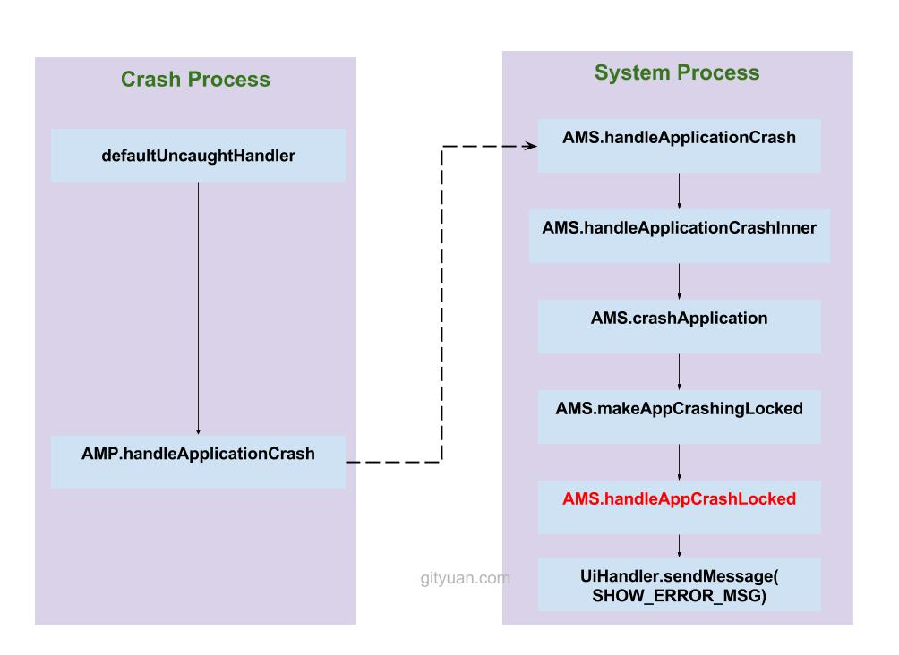
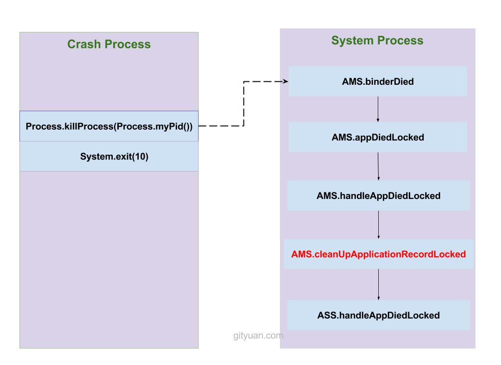

# 理解Android Crash處理流程

								<blockquote>
  
基於Android 6.0的源碼剖析， 分析Android應用Crash是如何處理的。

</blockquote>

<pre class="highlight"><code class="hljs cs">/frameworks/base/core/java/com/android/internal/os/RuntimeInit.java
/frameworks/base/core/java/android/app/ActivityManagerNative.java (含內部類AMP)
/frameworks/base/core/java/android/app/ApplicationErrorReport.java

/frameworks/base/services/core/java/com/android/server/
    - am/ActivityManagerService.java
    - am/ProcessRecord.java
    - am/ActivityRecord.java
    - am/ActivityStackSupervisor.java
    - am/ActivityStack.java
    - am/ActivityRecord.java
    - am/BroadcastQueue.java
    - wm/WindowManagerService.java

/libcore/libart/src/main/java/java/lang/Thread.java
</code></pre>

<h2 id="一概述">一、概述</h2>

App crash(全稱Application crash), 對於Crash可分為native crash和framework crash(包含app crash在內)，對於crash相信很多app開發者都會遇到，那麼上層什麼時候會出現crash呢，系統又是如何處理crash的呢。例如，在app大家經常使用<code class="highlighter-rouge">try...catch</code>語句，那麼如果沒有有效catch exception，就是導致應用crash，發生沒有catch exception，系統便會來進行捕獲，並進入crash流程。如果你是從事Android系統開發或者架構相關工作，或者遇到需要解系統性的疑難雜症，那麼很有必要了解系統Crash處理流程，知其然還需知其所以然；如果你僅僅是App初級開發，可能本文並非很適合閱讀，整個系統流程錯綜複雜。

在Android系統啟動系列文章，已講述過上層應用都是由Zygote fork孵化而來，分為system_server系統進程和各種應用進程，在這些進程創建之初會設置未捕獲異常的處理器，當系統拋出未捕獲的異常時，最終都交給異常處理器。

<ul>
  <li>對於system_server進程：文章<a href="http://gityuan.com/2016/02/14/android-system-server/#commonInit">Android系統啟動-SystemServer上篇</a>，system_server啟動過程中由RuntimeInit.java的<code class="highlighter-rouge">commonInit</code>方法設置UncaughtHandler，用於處理未捕獲異常；</li>
  <li>對於普通應用進程：文章<a href="http://gityuan.com/2016/03/26/app-process-create/#commoninit">理解Android進程創建流程</a> ，進程創建過程中，同樣會調用RuntimeInit.java的<code class="highlighter-rouge">commonInit</code>方法設置UncaughtHandler。</li>
</ul>

<h3 id="11-crash調用鏈">1.1 crash調用鏈</h3>

crash流程的方法調用關係來結尾：

<pre class="highlight"><code class="hljs css">AMP.handleApplicationCrash
    AMS.handleApplicationCrash
        AMS.findAppProcess
        AMS.handleApplicationCrashInner
            AMS.addErrorToDropBox
            AMS.crashApplication
                AMS.makeAppCrashingLocked
                    AMS.startAppProblemLocked
                    ProcessRecord.stopFreezingAllLocked
                        ActivityRecord.stopFreezingScreenLocked
                            WMS.stopFreezingScreenLocked
                                WMS.stopFreezingDisplayLocked
                    AMS.handleAppCrashLocked
                mUiHandler.sendMessage(SHOW_ERROR_MSG)

Process.killProcess(Process.myPid());
System.exit(10);
</code></pre>

接下來說說這個過程。

<h2 id="二crash處理流程">二、Crash處理流程</h2>

那麼接下來以commonInit()方法為起點來展開說明。

<h3 id="1-runtimeinitcommoninit">1. RuntimeInit.commonInit</h3>

<pre class="highlight"><code class="hljs java">public class RuntimeInit {
    ...
    private static final void commonInit() {
        //設置默認的未捕獲異常處理器，UncaughtHandler實例化過程【見小節2】
        Thread.setDefaultUncaughtExceptionHandler(new UncaughtHandler());
        ...
    }
}
</code></pre>

setDefaultUncaughtExceptionHandler()只是將異常處理器handler對象賦給Thread成員變量,即<code class="highlighter-rouge">Thread.defaultUncaughtHandler = new UncaughtHandler()</code>。接下來看看UncaughtHandler對象實例化過程。

<h3 id="2-uncaughthandler">2. UncaughtHandler</h3>

[–&gt;RuntimeInit.java]

<pre class="highlight"><code class="hljs java">private static class UncaughtHandler implements Thread.UncaughtExceptionHandler {
    //覆寫接口方法
    public void uncaughtException(Thread t, Throwable e) {
        try {
            //保證crash處理過程不會重入
            if (mCrashing) return;
            mCrashing = true;

            if (mApplicationObject == null) {
                //system_server進程
                Clog_e(TAG, "*** FATAL EXCEPTION IN SYSTEM PROCESS: " + t.getName(), e);
            } else {
                //普通應用進程
                StringBuilder message = new StringBuilder();
                message.append("FATAL EXCEPTION: ").append(t.getName()).append("\n");
                final String processName = ActivityThread.currentProcessName();
                if (processName != null) {
                    message.append("Process: ").append(processName).append(", ");
                }
                message.append("PID: ").append(Process.myPid());
                Clog_e(TAG, message.toString(), e);
            }

            //啟動crash對話框，等待處理完成 【見小節2.1和3】
            ActivityManagerNative.getDefault().handleApplicationCrash(
                    mApplicationObject, new ApplicationErrorReport.CrashInfo(e));
        } catch (Throwable t2) {
            ...
        } finally {
            //確保當前進程徹底殺掉【見小節11】
            Process.killProcess(Process.myPid());
            System.exit(10);
        }
    }
}
</code></pre>

<ol>
  <li>當system進程crash的信息：
    <ul>
      <li>開頭<code class="highlighter-rouge">*** FATAL EXCEPTION IN SYSTEM PROCESS [線程名]</code>；</li>
      <li>接著輸出發生crash時的調用棧信息；</li>
    </ul>
  </li>
  <li>當app進程crash時的信息：
    <ul>
      <li>開頭<code class="highlighter-rouge">FATAL EXCEPTION: [線程名]</code>；</li>
      <li>緊接著 <code class="highlighter-rouge">Process: [進程名], PID: [進程id]</code>；</li>
      <li>最後輸出發生crash時的調用棧信息。</li>
    </ul>
  </li>
</ol>

看到這裡，你就會發現要從log中搜索crash信息，只需要搜索關鍵詞<code class="highlighter-rouge">FATAL EXCEPTION</code>；如果需要進一步篩選只搜索系統crash信息，則可以搜索的關鍵詞可以有多樣，比如<code class="highlighter-rouge">*** FATAL EXCEPTION</code>。

當輸出完crash信息到logcat裡面，這只是crash流程的剛開始階段，接下來彈出<code class="highlighter-rouge">crash對話框</code>，ActivityManagerNative.getDefault()返回的是ActivityManagerProxy（簡稱<code class="highlighter-rouge">AMP</code>），<code class="highlighter-rouge">AMP</code>經過binder調用最終交給ActivityManagerService(簡稱<code class="highlighter-rouge">AMS</code>)中相應的方法去處理，故接下來調用的是AMS.handleApplicationCrash()。

<strong>注意</strong>: mApplicationObject等於null,一定不是普通的app進程. 但是除了system進程, 也有可能是shell進程, 即通過app_process + 命令參數 的方式創建的進程.

<h4 id="21-crashinfo">2.1 CrashInfo</h4>

[-&gt; ApplicationErrorReport.java]

<pre class="highlight"><code class="hljs java">public class ApplicationErrorReport implements Parcelable {
    ...
    public static class CrashInfo {
        public CrashInfo(Throwable tr) {
            StringWriter sw = new StringWriter();
            PrintWriter pw = new FastPrintWriter(sw, false, 256);
            tr.printStackTrace(pw); //輸出棧trace
            pw.flush();
            stackTrace = sw.toString();
            exceptionMessage = tr.getMessage();

            Throwable rootTr = tr;
            while (tr.getCause() != null) {
                tr = tr.getCause();
                if (tr.getStackTrace() != null &amp;&amp; tr.getStackTrace().length &gt; 0) {
                    rootTr = tr;
                }
                String msg = tr.getMessage();
                if (msg != null &amp;&amp; msg.length() &gt; 0) {
                    exceptionMessage = msg;
                }
            }

            exceptionClassName = rootTr.getClass().getName();
            if (rootTr.getStackTrace().length &gt; 0) {
                StackTraceElement trace = rootTr.getStackTrace()[0];
                throwFileName = trace.getFileName();
                throwClassName = trace.getClassName();
                throwMethodName = trace.getMethodName();
                throwLineNumber = trace.getLineNumber();
            } else {
                throwFileName = "unknown";
                throwClassName = "unknown";
                throwMethodName = "unknown";
                throwLineNumber = 0;
            }
        }
        ...
    }
}
</code></pre>

將crash信息<code class="highlighter-rouge">文件名</code>，<code class="highlighter-rouge">類名</code>，<code class="highlighter-rouge">方法名</code>，<code class="highlighter-rouge">對應行號</code>以及<code class="highlighter-rouge">異常信息</code>都封裝到CrashInfo對象。

<h3 id="3-handleapplicationcrash">3. handleApplicationCrash</h3>

[–&gt;ActivityManagerService.java]

<pre class="highlight"><code class="hljs java">public void handleApplicationCrash(IBinder app, ApplicationErrorReport.CrashInfo crashInfo) {
    //獲取進程record對象【見小節3.1】
    ProcessRecord r = findAppProcess(app, "Crash");
    final String processName = app == null ? "system_server"
            : (r == null ? "unknown" : r.processName);
    //【見小節4】
    handleApplicationCrashInner("crash", r, processName, crashInfo);
}
</code></pre>

關於進程名(processName)：

<ol>
  <li>當遠程IBinder對象為空時，則進程名為<code class="highlighter-rouge">system_server</code>；</li>
  <li>當遠程IBinder對象不為空，且ProcessRecord為空時，則進程名為<code class="highlighter-rouge">unknown</code>;</li>
  <li>當遠程IBinder對象不為空，且ProcessRecord不為空時，則進程名為ProcessRecord對象中相應進程名。</li>
</ol>

<h4 id="31-findappprocess">3.1 findAppProcess</h4>

[–&gt;ActivityManagerService.java]

<pre class="highlight"><code class="hljs java">private ProcessRecord findAppProcess(IBinder app, String reason) {
    if (app == null) {
        return null;
    }

    synchronized (this) {
        final int NP = mProcessNames.getMap().size();
        for (int ip=0; ip&lt;NP; ip++) {
            SparseArray&lt;ProcessRecord&gt; apps = mProcessNames.getMap().valueAt(ip);
            final int NA = apps.size();
            for (int ia=0; ia&lt;NA; ia++) {
                ProcessRecord p = apps.valueAt(ia);
                //當找到目標進程則返回
                if (p.thread != null &amp;&amp; p.thread.asBinder() == app) {
                    return p;
                }
            }
        }
        //如果代碼執行到這裡，表明無法找到應用所在的進程
        return null;
    }
}
</code></pre>

其中 <code class="highlighter-rouge">mProcessNames = new ProcessMap&lt;ProcessRecord&gt;();</code>對於代碼<code class="highlighter-rouge">mProcessNames.getMap()</code>返回的是<code class="highlighter-rouge">mMap</code>，而<code class="highlighter-rouge">mMap= new ArrayMap&lt;String, SparseArray&lt;ProcessRecord&gt;&gt;()</code>;

<strong>知識延伸：</strong><code class="highlighter-rouge">SparseArray</code>和<code class="highlighter-rouge">ArrayMap</code>是Android專門針對內存優化而設計的取代Java API中的<code class="highlighter-rouge">HashMap</code>的數據結構。對於key是int類型則使用<code class="highlighter-rouge">SparseArray</code>，可避免自動裝箱過程；對於key為其他類型則使用<code class="highlighter-rouge">ArrayMap</code>。<code class="highlighter-rouge">HashMap</code>的查找和插入時間複雜度為O(1)的代價是犧牲大量的內存來實現的，而<code class="highlighter-rouge">SparseArray</code>和<code class="highlighter-rouge">ArrayMap</code>性能略遜於<code class="highlighter-rouge">HashMap</code>，但更節省內存。

再回到<code class="highlighter-rouge">mMap</code>，這是以進程name為key，再以(uid為key，以ProcessRecord為Value的)結構體作為value。下面看看其get()和put()方法

<pre class="highlight"><code class="hljs cs">//獲取mMap中(name,uid)所對應的ProcessRecord
public ProcessRecord get(String name, int uid) {}；
//將(name,uid, value)添加到mMap
public ProcessRecord put(String name, int uid, ProcessRecord value) {}；
</code></pre>

findAppProcess()根據app(IBinder類型)來查詢相應的目標對象ProcessRecord。

有了進程記錄對象ProcessRecord和進程名processName，則進入執行Crash處理方法，繼續往下看。

<h3 id="4-handleapplicationcrashinner">4. handleApplicationCrashInner</h3>

[–&gt;ActivityManagerService.java]

<pre class="highlight"><code class="hljs javascript">void handleApplicationCrashInner(String eventType, ProcessRecord r, String processName,
        ApplicationErrorReport.CrashInfo crashInfo) {
    //將Crash信息寫入到Event log
    EventLog.writeEvent(EventLogTags.AM_CRASH,...);
    //將錯誤信息添加到DropBox
    addErrorToDropBox(eventType, r, processName, null, null, null, null, null, crashInfo);
    //【見小節5】
    crashApplication(r, crashInfo);
}
</code></pre>

其中<a href="http://gityuan.com/2016/06/12/DropBoxManagerService/#amsadderrortodropbox">addErrorToDropBox</a>是將crash的信息輸出到目錄<code class="highlighter-rouge">/data/system/dropbox</code>。例如system_server的dropbox文件名為system_server_crash@xxx.txt (xxx代表的是時間戳)

<h3 id="5-crashapplication">5. crashApplication</h3>

[–&gt;ActivityManagerService.java]

<pre class="highlight"><code class="hljs java">private void crashApplication(ProcessRecord r, ApplicationErrorReport.CrashInfo crashInfo) {
    long timeMillis = System.currentTimeMillis();
    String shortMsg = crashInfo.exceptionClassName;
    String longMsg = crashInfo.exceptionMessage;
    String stackTrace = crashInfo.stackTrace;
    if (shortMsg != null &amp;&amp; longMsg != null) {
        longMsg = shortMsg + ": " + longMsg;
    } else if (shortMsg != null) {
        longMsg = shortMsg;
    }

    AppErrorResult result = new AppErrorResult();
    synchronized (this) {
        // 當存在ActivityController的情況,比如monkey
        if (mController != null) {
            try {
                String name = r != null ? r.processName : null;
                int pid = r != null ? r.pid : Binder.getCallingPid();
                int uid = r != null ? r.info.uid : Binder.getCallingUid();
                //調用monkey的appCrashed
                if (!mController.appCrashed(name, pid,
                        shortMsg, longMsg, timeMillis, crashInfo.stackTrace)) {
                    if ("1".equals(SystemProperties.get(SYSTEM_DEBUGGABLE, "0"))
                            &amp;&amp; "Native crash".equals(crashInfo.exceptionClassName)) {
                        Slog.w(TAG, "Skip killing native crashed app " + name
                                + "(" + pid + ") during testing");
                    } else {
                        Slog.w(TAG, "Force-killing crashed app " + name
                                + " at watcher's request");
                        if (r != null) {
                            r.kill("crash", true);
                        } else {
                            Process.killProcess(pid);
                            killProcessGroup(uid, pid);
                        }
                    }
                    return;
                }
            } catch (RemoteException e) {
                mController = null;
                Watchdog.getInstance().setActivityController(null);
            }
        }
        
        //清除遠程調用者uid和pid信息，並保存到origId
        final long origId = Binder.clearCallingIdentity();
        ...

        //【見小節6】
        if (r == null || !makeAppCrashingLocked(r, shortMsg, longMsg, stackTrace)) {
            Binder.restoreCallingIdentity(origId);
            return;
        }

        Message msg = Message.obtain();
        msg.what = SHOW_ERROR_MSG;
        HashMap data = new HashMap();
        data.put("result", result);
        data.put("app", r);
        msg.obj = data;
        //發送消息SHOW_ERROR_MSG，彈出提示crash的對話框，等待用戶選擇【見小節10】
        mUiHandler.sendMessage(msg);
        //恢復遠程調用者uid和pid
        Binder.restoreCallingIdentity(origId);
    }

    //進入阻塞等待，直到用戶選擇crash對話框"退出"或者"退出並報告"
    int res = result.get();

    Intent appErrorIntent = null;
    synchronized (this) {
        if (r != null &amp;&amp; !r.isolated) {
            // 將崩潰的進程信息保存到mProcessCrashTimes
            mProcessCrashTimes.put(r.info.processName, r.uid,
                    SystemClock.uptimeMillis());
        }
        if (res == AppErrorDialog.FORCE_QUIT_AND_REPORT) {
            //創建action="android.intent.action.APP_ERROR"，組件為r.errorReportReceiver的Intent
            appErrorIntent = createAppErrorIntentLocked(r, timeMillis, crashInfo);
        }
    }

    if (appErrorIntent != null) {
        try {
            //啟動Intent為appErrorIntent的Activity
            mContext.startActivityAsUser(appErrorIntent, new UserHandle(r.userId));
        } catch (ActivityNotFoundException e) {
            Slog.w(TAG, "bug report receiver dissappeared", e);
        }
    }
}
</code></pre>

該方法主要做的兩件事：

<ul>
  <li>調用<code class="highlighter-rouge">makeAppCrashingLocked</code>，繼續處理crash流程；</li>
  <li>發送消息SHOW_ERROR_MSG，彈出提示crash的對話框，等待用戶選擇；</li>
</ul>

<h3 id="6-makeappcrashinglocked">6. makeAppCrashingLocked</h3>

[–&gt;ActivityManagerService.java]

<pre class="highlight"><code class="hljs java">private boolean makeAppCrashingLocked(ProcessRecord app,
        String shortMsg, String longMsg, String stackTrace) {
    app.crashing = true;
    //封裝crash信息到crashingReport對象
    app.crashingReport = generateProcessError(app,
            ActivityManager.ProcessErrorStateInfo.CRASHED, null, shortMsg, longMsg, stackTrace);
    //【見小節7】
    startAppProblemLocked(app);
    //停止屏幕凍結【見小節8】
    app.stopFreezingAllLocked();
    //【見小節9】
    return handleAppCrashLocked(app, "force-crash", shortMsg, longMsg, stackTrace);
}
</code></pre>

<h3 id="7-startappproblemlocked">7. startAppProblemLocked</h3>

[–&gt;ActivityManagerService.java]

<pre class="highlight"><code class="hljs java">void startAppProblemLocked(ProcessRecord app) {
    app.errorReportReceiver = null;

    for (int userId : mCurrentProfileIds) {
        if (app.userId == userId) {
            //獲取當前用戶下的crash應用的error receiver【見小節7.1】
            app.errorReportReceiver = ApplicationErrorReport.getErrorReportReceiver(
                    mContext, app.info.packageName, app.info.flags);
        }
    }
    //忽略當前app的廣播接收【見小節7.2】
    skipCurrentReceiverLocked(app);
}
</code></pre>

該方法主要功能：

<ul>
  <li>獲取當前用戶下的crash應用的error receiver；</li>
  <li>忽略當前app的廣播接收；</li>
</ul>

<h4 id="71-geterrorreportreceiver">7.1 getErrorReportReceiver</h4>

[-&gt; ApplicationErrorReport.java]

<pre class="highlight"><code class="hljs cs">public static ComponentName getErrorReportReceiver(Context context,
        String packageName, int appFlags) {
    //檢查Settings中的"send_action_app_error"是否使能錯誤報告的功能
    int enabled = Settings.Global.getInt(context.getContentResolver(),
            Settings.Global.SEND_ACTION_APP_ERROR, 0);
    if (enabled == 0) {
        //1.當未使能時，則直接返回
        return null;
    }

    PackageManager pm = context.getPackageManager();

    String candidate = null;
    ComponentName result = null;
    try {
        //獲取該crash應用的安裝器的包名
        candidate = pm.getInstallerPackageName(packageName);
    } catch (IllegalArgumentException e) {
    }

    if (candidate != null) {
        result = getErrorReportReceiver(pm, packageName, candidate);//【見下文】
        if (result != null) {
            //2.當找到該crash應用的安裝器，則返回；
            return result;
        }
    }

    if ((appFlags&amp;ApplicationInfo.FLAG_SYSTEM) != 0) {
        //該系統屬性名為"ro.error.receiver.system.apps"
        candidate = SystemProperties.get(SYSTEM_APPS_ERROR_RECEIVER_PROPERTY);
        result = getErrorReportReceiver(pm, packageName, candidate);//【見下文】
        if (result != null) {
            //3.當crash應用是系統應用時，且系統屬性指定error receiver時，則返回；
            return result;
        }
    }

    //該默認屬性名為"ro.error.receiver.default"
    candidate = SystemProperties.get(DEFAULT_ERROR_RECEIVER_PROPERTY);
    //4.當默認屬性值指定error receiver時，則返回；
    return getErrorReportReceiver(pm, packageName, candidate); //【見下文】
}
</code></pre>

<strong>getErrorReportReceiver</strong>：這是同名不同輸入參數的另一個方法：

<pre class="highlight"><code class="hljs javascript">static ComponentName getErrorReportReceiver(PackageManager pm, String errorPackage,
        String receiverPackage) {
    if (receiverPackage == null || receiverPackage.length() == 0) {
        return null;
    }

    //當安裝應用程序的安裝器Crash，則直接返回
    if (receiverPackage.equals(errorPackage)) {
        return null;
    }

    //ACTION_APP_ERROR值為"android.intent.action.APP_ERROR"
    Intent intent = new Intent(Intent.ACTION_APP_ERROR);
    intent.setPackage(receiverPackage);
    ResolveInfo info = pm.resolveActivity(intent, 0);
    if (info == null || info.activityInfo == null) {
        return null;
    }
    //創建包名為receiverPackage的組件
    return new ComponentName(receiverPackage, info.activityInfo.name);
}
</code></pre>

<h4 id="72-skipcurrentreceiverlocked">7.2 skipCurrentReceiverLocked</h4>

[–&gt;ActivityManagerService.java]

<pre class="highlight"><code class="hljs cpp">void skipCurrentReceiverLocked(ProcessRecord app) {
    for (BroadcastQueue queue : mBroadcastQueues) {
        queue.skipCurrentReceiverLocked(app);  //【見小節7.2.1】
    }
}
</code></pre>

<h5 id="721--skipcurrentreceiverlocked">7.2.1  skipCurrentReceiverLocked</h5>

[-&gt; BroadcastQueue.java]

<pre class="highlight"><code class="hljs cs">public void skipCurrentReceiverLocked(ProcessRecord app) {
    BroadcastRecord r = null;
    //查看app進程中的廣播
    if (mOrderedBroadcasts.size() &gt; 0) {
        BroadcastRecord br = mOrderedBroadcasts.get(0);
        if (br.curApp == app) {
            r = br;
        }
    }
    if (r == null &amp;&amp; mPendingBroadcast != null &amp;&amp; mPendingBroadcast.curApp == app) {
        r = mPendingBroadcast;
    }

    if (r != null) {
        //結束app進程的廣播結束
        finishReceiverLocked(r, r.resultCode, r.resultData,
                r.resultExtras, r.resultAbort, false);
        //廣播調度
        scheduleBroadcastsLocked();
    }
}
</code></pre>

<h3 id="8-prstopfreezingalllocked">8. PR.stopFreezingAllLocked</h3>

[-&gt; ProcessRecord.java]

<pre class="highlight"><code class="hljs cs">public void stopFreezingAllLocked() {
    int i = activities.size();
    while (i &gt; 0) {
        i--;
        activities.get(i).stopFreezingScreenLocked(true); //【見小節8.1】
    }
}
</code></pre>

其中activities類型為ArrayList<code class="highlighter-rouge">&lt;ActivityRecord</code>&gt;，停止進程裡所有的Activity

<h4 id="81-arstopfreezingscreenlocked">8.1. AR.stopFreezingScreenLocked</h4>

[-&gt; ActivityRecord.java]

<pre class="highlight"><code class="hljs java">public void stopFreezingScreenLocked(boolean force) {
    if (force || frozenBeforeDestroy) {
        frozenBeforeDestroy = false;
        //mWindowManager類型為WMS //【見小節8.1.1】
        service.mWindowManager.stopAppFreezingScreen(appToken, force);
    }
}
</code></pre>

其中appToken是IApplication.Stub類型，即WindowManager的token。

<h5 id="811-wmsstopfreezingscreenlocked">8.1.1 WMS.stopFreezingScreenLocked</h5>

[-&gt; WindowManagerService.java]

<pre class="highlight"><code class="hljs java">@Override
public void stopFreezingScreen() {
    //權限檢查
    if (!checkCallingPermission(android.Manifest.permission.FREEZE_SCREEN,
            "stopFreezingScreen()")) {
        throw new SecurityException("Requires FREEZE_SCREEN permission");
    }

    synchronized(mWindowMap) {
        if (mClientFreezingScreen) {
            mClientFreezingScreen = false;
            mLastFinishedFreezeSource = "client";
            final long origId = Binder.clearCallingIdentity();
            try {
                stopFreezingDisplayLocked(); //【見流程8.1.1.1】
            } finally {
                Binder.restoreCallingIdentity(origId);
            }
        }
    }
}
</code></pre>

<h6 id="8111-wmsstopfreezingdisplaylocked">8.1.1.1 WMS.stopFreezingDisplayLocked</h6>

[-&gt; WindowManagerService.java]

<pre class="highlight"><code class="hljs java">private void stopFreezingDisplayLocked() {
    if (!mDisplayFrozen) {
        return; //顯示沒有凍結，則直接返回
    }

    //往往跟屏幕旋轉相關
    ...

    mDisplayFrozen = false;
    //從上次凍屏到現在的總時長
    mLastDisplayFreezeDuration = (int)(SystemClock.elapsedRealtime() - mDisplayFreezeTime);

    //移除凍屏的超時消息
    mH.removeMessages(H.APP_FREEZE_TIMEOUT);
    mH.removeMessages(H.CLIENT_FREEZE_TIMEOUT);

    boolean updateRotation = false;
    //獲取默認的DisplayContent
    final DisplayContent displayContent = getDefaultDisplayContentLocked();
    final int displayId = displayContent.getDisplayId();
    ScreenRotationAnimation screenRotationAnimation =
            mAnimator.getScreenRotationAnimationLocked(displayId);

    //屏幕旋轉動畫的相關操作
    if (CUSTOM_SCREEN_ROTATION &amp;&amp; screenRotationAnimation != null
            &amp;&amp; screenRotationAnimation.hasScreenshot()) {
        DisplayInfo displayInfo = displayContent.getDisplayInfo();
        boolean isDimming = displayContent.isDimming();
        if (!mPolicy.validateRotationAnimationLw(mExitAnimId, mEnterAnimId, isDimming)) {
            mExitAnimId = mEnterAnimId = 0;
        }
        //加載動畫最大時長為10s
        if (screenRotationAnimation.dismiss(mFxSession, MAX_ANIMATION_DURATION,
                getTransitionAnimationScaleLocked(), displayInfo.logicalWidth,
                    displayInfo.logicalHeight, mExitAnimId, mEnterAnimId)) {
            scheduleAnimationLocked();
        } else {
            screenRotationAnimation.kill();
            mAnimator.setScreenRotationAnimationLocked(displayId, null);
            updateRotation = true;
        }
    } else {
        if (screenRotationAnimation != null) {
            screenRotationAnimation.kill();
            mAnimator.setScreenRotationAnimationLocked(displayId, null);
        }
        updateRotation = true;
    }
    //經過層層調用到InputManagerService服務，IMS服務使能輸入事件分發功能
    mInputMonitor.thawInputDispatchingLw();

    boolean configChanged;
    //當display被凍結時不再計算屏幕方向，以避免不連續的狀態。
    configChanged = updateOrientationFromAppTokensLocked(false);

    //display凍結時，執行gc操作
    mH.removeMessages(H.FORCE_GC);
    mH.sendEmptyMessageDelayed(H.FORCE_GC, 2000);

    //mScreenFrozenLock的類型為PowerManager.WakeLock，即釋放屏幕凍結的鎖
    mScreenFrozenLock.release();

    if (updateRotation) {
        //更新當前的屏幕方向
        configChanged |= updateRotationUncheckedLocked(false);
    }

    if (configChanged) {
        //向mH發送configuraion改變的消息
        mH.sendEmptyMessage(H.SEND_NEW_CONFIGURATION);
    }
}
</code></pre>

該方法主要功能：

<ol>
  <li>處理屏幕旋轉相關邏輯；</li>
  <li>移除凍屏的超時消息；</li>
  <li>屏幕旋轉動畫的相關操作;</li>
  <li>使能輸入事件分發功能；</li>
  <li>display凍結時，執行gc操作；</li>
  <li>更新當前的屏幕方向；</li>
  <li>向mH發送configuraion改變的消息。</li>
</ol>

<h3 id="9amshandleappcrashlocked">9.AMS.handleAppCrashLocked</h3>

[-&gt; ActivityManagerService.java]

<pre class="highlight"><code class="hljs java">private boolean handleAppCrashLocked(ProcessRecord app, String reason,
        String shortMsg, String longMsg, String stackTrace) {
    long now = SystemClock.uptimeMillis();

    Long crashTime;
    if (!app.isolated) {
        crashTime = mProcessCrashTimes.get(app.info.processName, app.uid);
    } else {
        crashTime = null;
    }
    //當同一個進程，連續兩次crash的時間間隔小於1分鐘時，則認為crash太過於頻繁
    if (crashTime != null &amp;&amp; now &lt; crashTime+ProcessList.MIN_CRASH_INTERVAL) {
        EventLog.writeEvent(EventLogTags.AM_PROCESS_CRASHED_TOO_MUCH,
                app.userId, app.info.processName, app.uid);
        //【見小節9.1】
        mStackSupervisor.handleAppCrashLocked(app);
        if (!app.persistent) {
            //不再重啟非persistent進程，除非用戶顯式地調用
            EventLog.writeEvent(EventLogTags.AM_PROC_BAD, app.userId, app.uid,
                    app.info.processName);
            if (!app.isolated) {
                //將當前app加入到mBadProcesses
                mBadProcesses.put(app.info.processName, app.uid,
                        new BadProcessInfo(now, shortMsg, longMsg, stackTrace));
                mProcessCrashTimes.remove(app.info.processName, app.uid);
            }
            app.bad = true;
            app.removed = true;
            //移除進程的所有服務，保證不再重啟【見小節9.2】
            removeProcessLocked(app, false, false, "crash");
            //恢復最頂部的Activity【見小節9.3】
            mStackSupervisor.resumeTopActivitiesLocked();
            return false;
        }
        mStackSupervisor.resumeTopActivitiesLocked();
    } else {
        //此處reason="force-crash"【見小節9.4】
        mStackSupervisor.finishTopRunningActivityLocked(app, reason);
    }

    //運行在當前進程中的所有服務的crash次數執行加1操作
    for (int i=app.services.size()-1; i&gt;=0; i--) {
        ServiceRecord sr = app.services.valueAt(i);
        sr.crashCount++;
    }

    //當桌面應用crash，並且被三方app所取代，那麼需要清空桌面應用的偏愛選項。
    final ArrayList&lt;ActivityRecord&gt; activities = app.activities;
    if (app == mHomeProcess &amp;&amp; activities.size() &gt; 0
                &amp;&amp; (mHomeProcess.info.flags &amp; ApplicationInfo.FLAG_SYSTEM) == 0) {
        for (int activityNdx = activities.size() - 1; activityNdx &gt;= 0; --activityNdx) {
            final ActivityRecord r = activities.get(activityNdx);
            if (r.isHomeActivity()) {
                //清空偏愛應用
                ActivityThread.getPackageManager()
                        .clearPackagePreferredActivities(r.packageName);
            }
        }
    }

    if (!app.isolated) {
        //無法記錄孤立進程的crash時間點，由於他們並沒有一個固定身份
        mProcessCrashTimes.put(app.info.processName, app.uid, now);
    }
    //當app存在crash的handler，那麼交給其處理
    if (app.crashHandler != null) mHandler.post(app.crashHandler);
    return true;
}
</code></pre>

<ol>
  <li>當同一進程在時間間隔小於1分鐘時連續兩次crash，則執行的情況下：
    <ul>
      <li>對於非persistent進程：
        <ul>
          <li>[9.1] mStackSupervisor.handleAppCrashLocked(app);</li>
          <li>[9.2] removeProcessLocked(app, false, false, “crash”);</li>
          <li>[9.3] mStackSupervisor.resumeTopActivitiesLocked();</li>
        </ul>
      </li>
      <li>對於persistent進程，則只執行
        <ul>
          <li>[9.3] mStackSupervisor.resumeTopActivitiesLocked();</li>
        </ul>
      </li>
    </ul>
  </li>
  <li>否則執行
    <ul>
      <li>[9.4] mStackSupervisor.finishTopRunningActivityLocked(app, reason);</li>
    </ul>
  </li>
</ol>

<h4 id="91-asshandleappcrashlocked">9.1 ASS.handleAppCrashLocked</h4>

[-&gt; ActivityStackSupervisor.java]

<pre class="highlight"><code class="hljs java">void handleAppCrashLocked(ProcessRecord app) {
    for (int displayNdx = mActivityDisplays.size() - 1; displayNdx &gt;= 0; --displayNdx) {
        final ArrayList&lt;ActivityStack&gt; stacks = mActivityDisplays.valueAt(displayNdx).mStacks;
        int stackNdx = stacks.size() - 1;
        while (stackNdx &gt;= 0) {
            //調用ActivityStack【見小節9.1.1】
            stacks.get(stackNdx).handleAppCrashLocked(app);
            stackNdx--;
        }
    }
}
</code></pre>

<h5 id="911-ashandleappcrashlocked">9.1.1 AS.handleAppCrashLocked</h5>

[-&gt; ActivityStack.java]

<pre class="highlight"><code class="hljs java">void handleAppCrashLocked(ProcessRecord app) {
    for (int taskNdx = mTaskHistory.size() - 1; taskNdx &gt;= 0; --taskNdx) {
        final ArrayList&lt;ActivityRecord&gt; activities = mTaskHistory.get(taskNdx).mActivities;
        for (int activityNdx = activities.size() - 1; activityNdx &gt;= 0; --activityNdx) {
            final ActivityRecord r = activities.get(activityNdx);
            if (r.app == app) {
                r.app = null;
                //結束當前activity
                finishCurrentActivityLocked(r, FINISH_IMMEDIATELY, false);
            }
        }
    }
}
</code></pre>

這裡的<code class="highlighter-rouge">mTaskHistory</code>數據類型為ArrayList<taskrecord>，記錄著所有先前的後臺activities。遍歷所有activities，找到位於該ProcessRecord的所有ActivityRecord，並結束該Acitivity。</taskrecord>

<h4 id="92-amsremoveprocesslocked">9.2 AMS.removeProcessLocked</h4>

[-&gt; ActivityManagerService.java]

<pre class="highlight"><code class="hljs java">private final boolean removeProcessLocked(ProcessRecord app,
        boolean callerWillRestart, boolean allowRestart, String reason) {
    final String name = app.processName;
    final int uid = app.uid;
    //從mProcessNames移除該進程
    removeProcessNameLocked(name, uid);
    ...
    if (app.pid &gt; 0 &amp;&amp; app.pid != MY_PID) {
        int pid = app.pid;
        synchronized (mPidsSelfLocked) {
            mPidsSelfLocked.remove(pid); //移除該pid
            mHandler.removeMessages(PROC_START_TIMEOUT_MSG, app);
        }
        ...
        boolean willRestart = false;
        //對於非孤立的persistent進程設置成可重啟flags
        if (app.persistent &amp;&amp; !app.isolated) {
            if (!callerWillRestart) {
                willRestart = true;
            } else {
                needRestart = true;
            }
        }
        // 殺進程【9.2.1】
        app.kill(reason, true);
         //移除進程並清空該進程相關聯的activity/service等組件 【9.2.2】
        handleAppDiedLocked(app, willRestart, allowRestart);

        if (willRestart) {
            //此處willRestart=false，不進入該分支
            removeLruProcessLocked(app);
            addAppLocked(app.info, false, null /* ABI override */);
        }
    } else {
        mRemovedProcesses.add(app);
    }
    return needRestart;
}
</code></pre>

<ul>
  <li><code class="highlighter-rouge">mProcessNames</code>數據類型為ProcessMap<processrecord>，這是以進程名為key，記錄著所有的ProcessRecord信息</processrecord></li>
  <li><code class="highlighter-rouge">mPidsSelfLocked</code>數據類型為SparseArray<processrecord>,這是以pid為key，記錄著所有的ProcessRecord信息。該對象的同步保護是通過自身鎖，而非全局ActivityManager鎖。</processrecord></li>
</ul>

<h5 id="921-appkill">9.2.1 app.kill</h5>

[-&gt; ProcessRecord.java]

<pre class="highlight"><code class="hljs java">void kill(String reason, boolean noisy) {
    if (!killedByAm) {
        Trace.traceBegin(Trace.TRACE_TAG_ACTIVITY_MANAGER, "kill");
        if (noisy) {
            Slog.i(TAG, "Killing " + toShortString() + " (adj " + setAdj + "): " + reason);
        }
        EventLog.writeEvent(EventLogTags.AM_KILL, userId, pid, processName, setAdj, reason);
        Process.killProcessQuiet(pid); //殺進程
        Process.killProcessGroup(info.uid, pid); //殺進程組，包括native進程
        if (!persistent) {
            killed = true;
            killedByAm = true;
        }
        Trace.traceEnd(Trace.TRACE_TAG_ACTIVITY_MANAGER);
    }
}
</code></pre>

此處reason為“crash”，關於殺進程的過程見我的另一篇文章<a href="http://gityuan.com/2016/04/16/kill-signal/">理解殺進程的實現原理</a>.

<h5 id="922-handleappdiedlocked">9.2.2 handleAppDiedLocked</h5>

[-&gt; ActivityManagerService.java]

<pre class="highlight"><code class="hljs java">private final void handleAppDiedLocked(ProcessRecord app,
        boolean restarting, boolean allowRestart) {
    int pid = app.pid;
    //清除應用中service/receiver/ContentProvider信息
    boolean kept = cleanUpApplicationRecordLocked(app, restarting, allowRestart, -1);
    if (!kept &amp;&amp; !restarting) {
        removeLruProcessLocked(app);
        if (pid &gt; 0) {
            ProcessList.remove(pid);
        }
    }

    if (mProfileProc == app) {
        clearProfilerLocked();
    }

    //清除應用中activity相關信息
    boolean hasVisibleActivities = mStackSupervisor.handleAppDiedLocked(app);

    app.activities.clear();
    ...
    if (!restarting &amp;&amp; hasVisibleActivities &amp;&amp; !mStackSupervisor.resumeTopActivitiesLocked()) {
        mStackSupervisor.ensureActivitiesVisibleLocked(null, 0);
    }
}
</code></pre>

<h4 id="93-assresumetopactivitieslocked">9.3 ASS.resumeTopActivitiesLocked</h4>

[-&gt; ActivityStackSupervisor.java]

<pre class="highlight"><code class="hljs java">boolean resumeTopActivitiesLocked() {
    return resumeTopActivitiesLocked(null, null, null);
}

boolean resumeTopActivitiesLocked(ActivityStack targetStack, ActivityRecord target,
        Bundle targetOptions) {
    if (targetStack == null) {
        targetStack = mFocusedStack;
    }
    boolean result = false;
    if (isFrontStack(targetStack)) {
        //【見小節9.3.1】
        result = targetStack.resumeTopActivityLocked(target, targetOptions);
    }

    for (int displayNdx = mActivityDisplays.size() - 1; displayNdx &gt;= 0; --displayNdx) {
        final ArrayList&lt;ActivityStack&gt; stacks = mActivityDisplays.valueAt(displayNdx).mStacks;
        for (int stackNdx = stacks.size() - 1; stackNdx &gt;= 0; --stackNdx) {
            final ActivityStack stack = stacks.get(stackNdx);
            if (stack == targetStack) {
                continue; //已經啟動
            }
            if (isFrontStack(stack)) {
                stack.resumeTopActivityLocked(null);
            }
        }
    }
    return result;
}
</code></pre>

此處<code class="highlighter-rouge">mFocusedStack</code>是當前正在等待接收input事件或者正在啟動下一個activity的<code class="highlighter-rouge">ActivityStack</code>。

<h5 id="931-asresumetopactivitylocked">9.3.1 AS.resumeTopActivityLocked</h5>

[-&gt; ActivityStack.java]

<pre class="highlight"><code class="hljs java">final boolean .resumeTopActivityLocked(ActivityRecord prev, Bundle options) {
    ...
    result = resumeTopActivityInnerLocked(prev, options);//【見小節9.3.2】
    return result;
}
</code></pre>

<h5 id="932-asresumetopactivityinnerlocked">9.3.2 AS.resumeTopActivityInnerLocked</h5>

[-&gt; ActivityStack.java]

<pre class="highlight"><code class="hljs java">private boolean resumeTopActivityInnerLocked(ActivityRecord prev, Bundle options) {
    //找到mTaskHistory棧中第一個未處於finishing狀態的Activity
    final ActivityRecord next = topRunningActivityLocked(null);

    if (mResumedActivity == next &amp;&amp; next.state == ActivityState.RESUMED &amp;&amp;
                        mStackSupervisor.allResumedActivitiesComplete()) {
        //當top activity已經處於resume，則無需操作；
        return false;
    }

    if (mService.isSleepingOrShuttingDown()
            &amp;&amp; mLastPausedActivity == next
            &amp;&amp; mStackSupervisor.allPausedActivitiesComplete()) {
        //當正處於sleeping狀態，top activity處於paused，則無需操作
        return false;
    }

    //正在啟動app的activity，確保app不會被設置為stopped
    AppGlobals.getPackageManager().setPackageStoppedState(
                next.packageName, false, next.userId);
    //回調應用onResume方法
    next.app.thread.scheduleResumeActivity(next.appToken, next.app.repProcState,
                            mService.isNextTransitionForward(), resumeAnimOptions);
    ...
}
</code></pre>

該方法代碼比較長，這裡就簡單列舉幾條比較重要的代碼。執行完該方法，應用也便完成了activity的resume過程。

<h4 id="94-finishtoprunningactivitylocked">9.4 finishTopRunningActivityLocked</h4>

<h5 id="941-assfinishtoprunningactivitylocked">9.4.1 ASS.finishTopRunningActivityLocked</h5>

[-&gt; ActivityStackSupervisor.java]

<pre class="highlight"><code class="hljs java">void finishTopRunningActivityLocked(ProcessRecord app, String reason) {
    for (int displayNdx = mActivityDisplays.size() - 1; displayNdx &gt;= 0; --displayNdx) {
        final ArrayList&lt;ActivityStack&gt; stacks = mActivityDisplays.valueAt(displayNdx).mStacks;
        final int numStacks = stacks.size();
        for (int stackNdx = 0; stackNdx &lt; numStacks; ++stackNdx) {
            final ActivityStack stack = stacks.get(stackNdx);
            //此處reason= "force-crash"【見小節9.4.2】
            stack.finishTopRunningActivityLocked(app, reason);
        }
    }
}
</code></pre>

<h5 id="942-asfinishtoprunningactivitylocked">9.4.2 AS.finishTopRunningActivityLocked</h5>

<pre class="highlight"><code class="hljs cs">final void finishTopRunningActivityLocked(ProcessRecord app, String reason) {
    //找到棧頂第一個不處於finishing狀態的activity
    ActivityRecord r = topRunningActivityLocked(null);
    if (r != null &amp;&amp; r.app == app) {
        int taskNdx = mTaskHistory.indexOf(r.task);
        int activityNdx = r.task.mActivities.indexOf(r);
        //【見小節9.4.3】
        finishActivityLocked(r, Activity.RESULT_CANCELED, null, reason, false);
        --activityNdx;
        if (activityNdx &lt; 0) {
            do {
                --taskNdx;
                if (taskNdx &lt; 0) {
                    break;
                }
                activityNdx = mTaskHistory.get(taskNdx).mActivities.size() - 1;
            } while (activityNdx &lt; 0);
        }
        if (activityNdx &gt;= 0) {
            r = mTaskHistory.get(taskNdx).mActivities.get(activityNdx);
            if (r.state == ActivityState.RESUMED
                    || r.state == ActivityState.PAUSING
                    || r.state == ActivityState.PAUSED) {
                if (!r.isHomeActivity() || mService.mHomeProcess != r.app) {
                    //【見小節9.4.3】
                    finishActivityLocked(r, Activity.RESULT_CANCELED, null, reason, false);
                }
            }
        }
    }
}
</code></pre>

<h5 id="943-asfinishactivitylocked">9.4.3 AS.finishActivityLocked</h5>

<pre class="highlight"><code class="hljs java">final boolean finishActivityLocked(ActivityRecord r, int resultCode, Intent resultData,
           String reason, boolean oomAdj) {
    if (r.finishing) {
        return false; //正在finishing則返回
    }
    //設置finish狀態的activity不可見
    r.makeFinishingLocked();
    //暫停key的分發事件
    r.pauseKeyDispatchingLocked();

    mWindowManager.prepareAppTransition(endTask
            ? AppTransition.TRANSIT_TASK_CLOSE
            : AppTransition.TRANSIT_ACTIVITY_CLOSE, false);

    mWindowManager.setAppVisibility(r.appToken, false);
    //回調activity的onPause方法
    startPausingLocked(false, false, false, false);
    ...
}
</code></pre>

該方法最終會回調到activity的pause方法。

執行到這，我們還回過來看小節<code class="highlighter-rouge">5.crashApplication</code>中，處理完makeAppCrashingLocked，則會再發送消息SHOW_ERROR_MSG，彈出提示crash的對話框，接下來再看看該過程。

<h3 id="10-uihandler">10. UiHandler</h3>

通過mUiHandler發送message，且消息的msg.waht=SHOW_ERROR_MSG，接下來進入UiHandler來看看handleMessage的處理過程。

[-&gt; ActivityManagerService.java]

<pre class="highlight"><code class="hljs java">final class UiHandler extends Handler {
    public void handleMessage(Message msg) {
        switch (msg.what) {
        case SHOW_ERROR_MSG: {
           HashMap&lt;String, Object&gt; data = (HashMap&lt;String, Object&gt;) msg.obj;
           synchronized (ActivityManagerService.this) {
               ProcessRecord proc = (ProcessRecord)data.get("app");
               AppErrorResult res = (AppErrorResult) data.get("result");
              、
               boolean isBackground = (UserHandle.getAppId(proc.uid)
                       &gt;= Process.FIRST_APPLICATION_UID
                       &amp;&amp; proc.pid != MY_PID);
                ...

               if (mShowDialogs &amp;&amp; !mSleeping &amp;&amp; !mShuttingDown) {
                   //創建提示crash對話框，等待用戶選擇，5分鐘操作等待。
                   Dialog d = new AppErrorDialog(mContext,
                           ActivityManagerService.this, res, proc);
                   d.show();
                   proc.crashDialog = d;
               } else {
                   //當處於sleep狀態，則默認選擇退出。
                   if (res != null) {
                       res.set(0);
                   }
               }
           }
        } break;
        ...
    }
}
</code></pre>

在發生crash時，默認系統會彈出提示crash的對話框，並阻塞等待用戶選擇是“退出”或 “退出並報告”，當用戶不做任何選擇時5min超時後，默認選擇“退出”，當手機休眠時也默認選擇“退出”。到這裡也並沒有真正結束，在小節<code class="highlighter-rouge">2.uncaughtException</code>中在<code class="highlighter-rouge">finnally</code>語句塊還有一個殺進程的動作。

<h3 id="11-killprocess">11. killProcess</h3>

<pre class="highlight"><code class="hljs css">Process.killProcess(Process.myPid());
System.exit(10);
</code></pre>

通過finnally語句塊保證能執行並徹底殺掉Crash進程，關於殺進程的過程見我的另一篇文章<a href="http://gityuan.com/2016/04/16/kill-signal/">理解殺進程的實現原理</a>.。當Crash進程被殺後，並沒有完全結束，還有Binder死亡通知的流程還沒有處理完成。

<h3 id="12-小結">12. 小結</h3>

當進程拋出未捕獲異常時，則系統會處理該異常並進入crash處理流程。

其中最為核心的工作圖中紅色部分<code class="highlighter-rouge">AMS.handleAppCrashLocked</code>的主要功能：

<ol>
  <li>當同一進程1分鐘之內連續兩次crash，則執行的情況下：
    <ul>
      <li>對於非persistent進程：
        <ul>
          <li>ASS.handleAppCrashLocked, 直接結束該應用所有activity</li>
          <li>AMS.removeProcessLocked，殺死該進程以及同一個進程組下的所有進</li>
          <li>ASS.resumeTopActivitiesLocked，恢復棧頂第一個非finishing狀態的activity</li>
        </ul>
      </li>
      <li>對於persistent進程，則只執行
        <ul>
          <li>ASS.resumeTopActivitiesLocked，恢復棧頂第一個非finishing狀態的activity</li>
        </ul>
      </li>
    </ul>
  </li>
  <li>否則，當進程沒連續頻繁crash
    <ul>
      <li>ASS.finishTopRunningActivityLocked，執行結束棧頂正在運行activity</li>
    </ul>
  </li>
</ol>

另外，<code class="highlighter-rouge">AMS.handleAppCrashLocked</code>，該方法內部主要調用鏈，如下：

<pre class="highlight"><code class="hljs css">AMS.handleAppCrashLocked
   ASS.handleAppCrashLocked
       AS.handleAppCrashLocked
           AS.finishCurrentActivityLocked
   AMS.removeProcessLocked
       ProcessRecord.kill
       AMS.handleAppDiedLocked
           ASS.handleAppDiedLocked
               AMS.cleanUpApplicationRecordLocked
               AS.handleAppDiedLocked
                   AS.removeHistoryRecordsForAppLocked

   ASS.resumeTopActivitiesLocked
       AS.resumeTopActivityLocked
           AS.resumeTopActivityInnerLocked
   ASS.finishTopRunningActivityLocked
       AS.finishTopRunningActivityLocked
           AS.finishActivityLocked
</code></pre>

<h2 id="三binder死亡通知">三、Binder死亡通知</h2>

進程被殺，如果還記得Binder的死亡回調機制，在應用進程創建的過程中有一個<code class="highlighter-rouge">attachApplicationLocked</code>方法的過程中便會創建死亡通知。

[-&gt; ActivityManagerService.java]

<pre class="highlight"><code class="hljs java">private final boolean attachApplicationLocked(IApplicationThread thread,
            int pid) {
    try {
        //創建binder死亡通知
        AppDeathRecipient adr = new AppDeathRecipient(
                app, pid, thread);
        thread.asBinder().linkToDeath(adr, 0);
        app.deathRecipient = adr;
    } catch (RemoteException e) {
        app.resetPackageList(mProcessStats);
        startProcessLocked(app, "link fail", processName);
        return false;
    }
    ...
}
</code></pre>

當binder服務端掛了之後，便會通過binder的DeathRecipient來通知AMS進行相應的清理收尾工作。前面已經降到crash的進程會被kill掉，那麼當該進程會殺，則會回調到binderDied()方法。

<h3 id="1-binderdied">1. binderDied</h3>

[-&gt; ActivityManagerService.java]

<pre class="highlight"><code class="hljs java">private final class AppDeathRecipient implements IBinder.DeathRecipient {
    public void binderDied() {
        synchronized(ActivityManagerService.this) {
            appDiedLocked(mApp, mPid, mAppThread, true);//【見小節2】
        }
    }
}
</code></pre>

<h3 id="2-appdiedlocked">2. appDiedLocked</h3>

<pre class="highlight"><code class="hljs java">final void appDiedLocked(ProcessRecord app, int pid, IApplicationThread thread,
        boolean fromBinderDied) {
    ...
    if (!app.killed) {
        if (!fromBinderDied) {
            Process.killProcessQuiet(pid);
        }
        killProcessGroup(app.info.uid, pid);
        app.killed = true;
    }

    // Clean up already done if the process has been re-started.
    if (app.pid == pid &amp;&amp; app.thread != null &amp;&amp;
            app.thread.asBinder() == thread.asBinder()) {
        boolean doLowMem = app.instrumentationClass == null;
        boolean doOomAdj = doLowMem;
        if (!app.killedByAm) {
            mAllowLowerMemLevel = true;
        } else {
            mAllowLowerMemLevel = false;
            doLowMem = false;
        }
        //【見小節3】
        handleAppDiedLocked(app, false, true);

        if (doOomAdj) {
            updateOomAdjLocked();
        }
        if (doLowMem) {
            doLowMemReportIfNeededLocked(app);
        }
    }
    ...
}
</code></pre>

<h3 id="3-handleappdiedlocked">3 handleAppDiedLocked</h3>

[-&gt; ActivityManagerService.java]

<pre class="highlight"><code class="hljs java">private final void handleAppDiedLocked(ProcessRecord app,
        boolean restarting, boolean allowRestart) {
    int pid = app.pid;
    //清理應用程序service, BroadcastReceiver, ContentProvider相關信息【見小節4】
    boolean kept = cleanUpApplicationRecordLocked(app, restarting, allowRestart, -1);

    if (!kept &amp;&amp; !restarting) {
        removeLruProcessLocked(app);
        if (pid &gt; 0) {
            ProcessList.remove(pid);
        }
    }

    //清理activity相關信息
    boolean hasVisibleActivities = mStackSupervisor.handleAppDiedLocked(app);
    app.activities.clear();
    ...
    //恢復棧頂第一個非finish的activity
    if (!restarting &amp;&amp; hasVisibleActivities &amp;&amp; !mStackSupervisor.resumeTopActivitiesLocked()) {
       mStackSupervisor.ensureActivitiesVisibleLocked(null, 0);
   }
}
</code></pre>

<h3 id="4-cleanupapplicationrecordlocked">4 cleanUpApplicationRecordLocked</h3>

該方法清理應用程序service, BroadcastReceiver, ContentProvider，process相關信息，為了便於說明將該方法劃分為4個部分講解

<h4 id="41-清理service">4.1 清理service</h4>

參數restarting = false,  allowRestart =true,  index =-1

<pre class="highlight"><code class="hljs java">private final boolean cleanUpApplicationRecordLocked(ProcessRecord app,
        boolean restarting, boolean allowRestart, int index) {
    ...
    mProcessesToGc.remove(app);
    mPendingPssProcesses.remove(app);

    //如果存在，則清除crash/anr/wait對話框
    if (app.crashDialog != null &amp;&amp; !app.forceCrashReport) {
        app.crashDialog.dismiss();
        app.crashDialog = null;
    }
    if (app.anrDialog != null) {
        app.anrDialog.dismiss();
        app.anrDialog = null;
    }
    if (app.waitDialog != null) {
        app.waitDialog.dismiss();
        app.waitDialog = null;
    }

    app.crashing = false;
    app.notResponding = false;

    app.resetPackageList(mProcessStats);
    app.unlinkDeathRecipient(); //解除app的死亡通告
    app.makeInactive(mProcessStats);
    app.waitingToKill = null;
    app.forcingToForeground = null;
    //將app移除前臺進程
    updateProcessForegroundLocked(app, false, false);
    app.foregroundActivities = false;
    app.hasShownUi = false;
    app.treatLikeActivity = false;
    app.hasAboveClient = false;
    app.hasClientActivities = false;
    //清理service信息，這個過程也比較複雜，後續再展開
    mServices.killServicesLocked(app, allowRestart);
    boolean restart = false;
}
</code></pre>

<ul>
  <li>mProcessesToGc：記錄著需要儘快執行gc的進程列表</li>
  <li>mPendingPssProcesses：記錄著需要收集內存信息的進程列表</li>
</ul>

<h4 id="42-清理contentprovider">4.2 清理ContentProvider</h4>

<pre class="highlight"><code class="hljs java">private final boolean cleanUpApplicationRecordLocked(...) {
    ...
    for (int i = app.pubProviders.size() - 1; i &gt;= 0; i--) {
        //獲取該進程已發表的ContentProvider
        ContentProviderRecord cpr = app.pubProviders.valueAt(i);
        final boolean always = app.bad || !allowRestart;
        //ContentProvider服務端被殺，則client端進程也會被殺
        boolean inLaunching = removeDyingProviderLocked(app, cpr, always);
        if ((inLaunching || always) &amp;&amp; cpr.hasConnectionOrHandle()) {
            restart = true; //需要重啟
        }

        cpr.provider = null;
        cpr.proc = null;
    }
    app.pubProviders.clear();

    //處理正在啟動並且是有client端正在等待的ContentProvider
    if (cleanupAppInLaunchingProvidersLocked(app, false)) {
        restart = true;
    }

    //取消已連接的ContentProvider的註冊
    if (!app.conProviders.isEmpty()) {
        for (int i = app.conProviders.size() - 1; i &gt;= 0; i--) {
            ContentProviderConnection conn = app.conProviders.get(i);
            conn.provider.connections.remove(conn);

            stopAssociationLocked(app.uid, app.processName, conn.provider.uid,
                    conn.provider.name);
        }
        app.conProviders.clear();
    }
</code></pre>

<h4 id="43-清理broadcastreceiver">4.3 清理BroadcastReceiver</h4>

<pre class="highlight"><code class="hljs java">private final boolean cleanUpApplicationRecordLocked(...) {
    ...
    skipCurrentReceiverLocked(app);

    // 取消註冊的廣播接收者
    for (int i = app.receivers.size() - 1; i &gt;= 0; i--) {
        removeReceiverLocked(app.receivers.valueAt(i));
    }
    app.receivers.clear();
}
</code></pre>

<h4 id="44-清理process">4.4 清理Process</h4>

<pre class="highlight"><code class="hljs java">private final boolean cleanUpApplicationRecordLocked(...) {
    ...
    //當app正在備份時的處理方式
    if (mBackupTarget != null &amp;&amp; app.pid == mBackupTarget.app.pid) {
        ...
        IBackupManager bm = IBackupManager.Stub.asInterface(
                ServiceManager.getService(Context.BACKUP_SERVICE));
        bm.agentDisconnected(app.info.packageName);
    }

    for (int i = mPendingProcessChanges.size() - 1; i &gt;= 0; i--) {
        ProcessChangeItem item = mPendingProcessChanges.get(i);
        if (item.pid == app.pid) {
            mPendingProcessChanges.remove(i);
            mAvailProcessChanges.add(item);
        }
    }
    mUiHandler.obtainMessage(DISPATCH_PROCESS_DIED, app.pid, app.info.uid, null).sendToTarget();

    if (!app.persistent || app.isolated) {
        removeProcessNameLocked(app.processName, app.uid);
        if (mHeavyWeightProcess == app) {
            mHandler.sendMessage(mHandler.obtainMessage(CANCEL_HEAVY_NOTIFICATION_MSG,
                    mHeavyWeightProcess.userId, 0));
            mHeavyWeightProcess = null;
        }
    } else if (!app.removed) {
        //對於persistent應用，則需要重啟
        if (mPersistentStartingProcesses.indexOf(app) &lt; 0) {
            mPersistentStartingProcesses.add(app);
            restart = true;
        }
    }

    //mProcessesOnHold：記錄著試圖在系統ready之前就啟動的進程。
    //在那時並不啟動這些進程，先記錄下來,等系統啟動完成則啟動這些進程。
    mProcessesOnHold.remove(app);

    if (app == mHomeProcess) {
        mHomeProcess = null;
    }
    if (app == mPreviousProcess) {
        mPreviousProcess = null;
    }

    if (restart &amp;&amp; !app.isolated) {
        //仍有組件需要運行在該進程中，因此重啟該進程
        if (index &lt; 0) {
            ProcessList.remove(app.pid);
        }
        addProcessNameLocked(app);
        startProcessLocked(app, "restart", app.processName);
        return true;
    } else if (app.pid &gt; 0 &amp;&amp; app.pid != MY_PID) {
        //移除該進程相關信息
        boolean removed;
        synchronized (mPidsSelfLocked) {
            mPidsSelfLocked.remove(app.pid);
            mHandler.removeMessages(PROC_START_TIMEOUT_MSG, app);
        }
        app.setPid(0);
    }
    return false;
}
</code></pre>

對於需要重啟進程的情形有：

<ul>
  <li><code class="highlighter-rouge">mLaunchingProviders</code>：記錄著存在client端等待的ContentProvider。應用當前正在啟動中，當ContentProvider一旦發佈則將該ContentProvider將從該list去除。當進程包含這樣的ContentProvider，則需要重啟進程。</li>
  <li><code class="highlighter-rouge">mPersistentStartingProcesses</code>：記錄著試圖在系統ready之前就啟動的進程。在那時並不啟動這些進程，先記錄下來,等系統啟動完成則啟動這些進程。當進程屬於這種類型也需要重啟。</li>
</ul>

<h3 id="5-小結">5. 小結</h3>

當crash進程執行kill操作後，進程被殺。此時需要掌握binder 死亡通知原理，由於Crash進程中擁有一個Binder服務端<code class="highlighter-rouge">ApplicationThread</code>，而應用進程在創建過程調用attachApplicationLocked()，從而attach到system_server進程，在system_server進程內有一個<code class="highlighter-rouge">ApplicationThreadProxy</code>，這是相對應的Binder客戶端。當Binder服務端<code class="highlighter-rouge">ApplicationThread</code>所在進程(即Crash進程)掛掉後，則Binder客戶端能收到相應的死亡通知，從而進入binderDied流程。更多關於bInder原理，這裡就不細說，博客中有關於binder系列的專題。

<h2 id="四-總結">四、 總結</h2>

本文主要以源碼的視角，詳細介紹了到應用crash後系統的處理流程：

<ol>
  <li>首先發生crash所在進程，在創建之初便準備好了defaultUncaughtHandler，用來來處理Uncaught Exception，並輸出當前crash基本信息；</li>
  <li>調用當前進程中的AMP.handleApplicationCrash；經過binder ipc機制，傳遞到system_server進程；</li>
  <li>接下來，進入system_server進程，調用binder服務端執行AMS.handleApplicationCrash；</li>
  <li>從<code class="highlighter-rouge">mProcessNames</code>查找到目標進程的ProcessRecord對象；並將進程crash信息輸出到目錄<code class="highlighter-rouge">/data/system/dropbox</code>；</li>
  <li>執行makeAppCrashingLocked
    <ul>
      <li>創建當前用戶下的crash應用的error receiver，並忽略當前應用的廣播；</li>
      <li>停止當前進程中所有activity中的WMS的凍結屏幕消息，並執行相關一些屏幕相關操作；</li>
    </ul>
  </li>
  <li>再執行handleAppCrashLocked方法，
    <ul>
      <li>當1分鐘內同一進程<code class="highlighter-rouge">連續crash兩次</code>時，且<code class="highlighter-rouge">非persistent</code>進程，則直接結束該應用所有activity，並殺死該進程以及同一個進程組下的所有進程。然後再恢復棧頂第一個非finishing狀態的activity;</li>
      <li>當1分鐘內同一進程<code class="highlighter-rouge">連續crash兩次</code>時，且<code class="highlighter-rouge">persistent</code>進程，，則只執行恢復棧頂第一個非finishing狀態的activity;</li>
      <li>當1分鐘內同一進程<code class="highlighter-rouge">未發生連續crash兩次</code>時，則執行結束棧頂正在運行activity的流程。</li>
    </ul>
  </li>
  <li>通過mUiHandler發送消息<code class="highlighter-rouge">SHOW_ERROR_MSG</code>，彈出crash對話框；</li>
  <li>到此，system_server進程執行完成。回到crash進程開始執行殺掉當前進程的操作；</li>
  <li>當crash進程被殺，通過binder死亡通知，告知system_server進程來執行appDiedLocked()；</li>
  <li>最後，執行清理應用相關的activity/service/ContentProvider/receiver組件信息。</li>
</ol>

這基本就是整個應用Crash後系統的執行過程。 最後，再說說對於同一個app連續crash的情況：

<ul>
  <li>當60s內連續crash兩次的非persistent進程時，被認定為bad進程：那麼如果第3次從後臺啟動該進程(Intent.getFlags來判斷)，則會拒絕創建進程；</li>
  <li>當crash次數達到兩次的非persistent進程時，則再次殺該進程，即便允許自啟的service也會在被殺後拒絕再次啟動。</li>
</ul>
