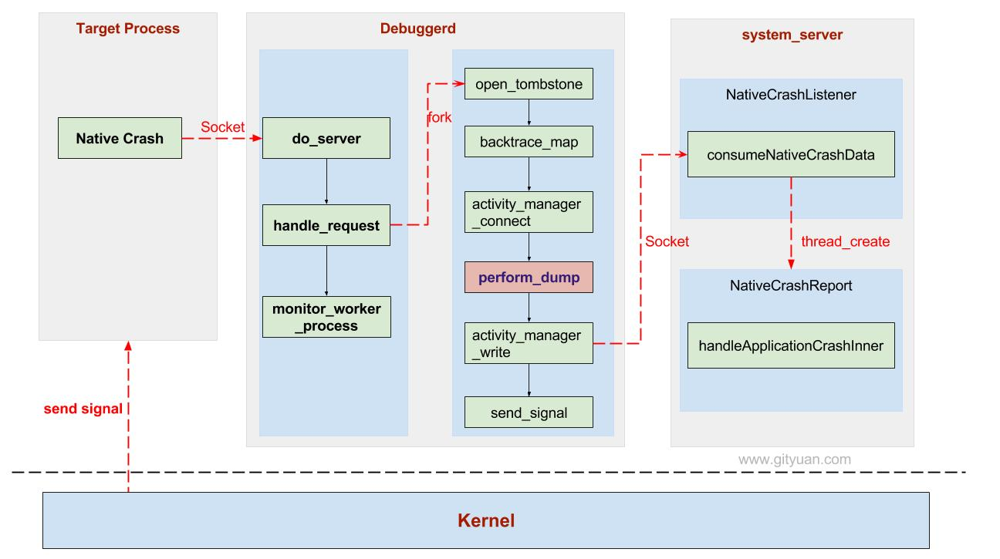

# 理解Native Crash处理流程

    <!-- Post Container -->
            

								<blockquote>
  
本文是基于Android 7.0源码，来分析Native Crash流程。

</blockquote>

<h2 id="一native-crash">一、Native Crash</h2>

从系统全局来说，Crash分为Framework/App Crash， Native Crash，以及Kernel Crash。

<ul>
  <li>对于framework层或者app层的Crash(即Java层面Crash)，那么往往是通过抛出未捕获异常而导致的Crash，这个内容在本文的姊妹篇<a href="http://gityuan.com/2016/06/24/app-crash/">理解Android Crash处理流程</a>已详细介绍过。</li>
  <li>至于Kernel Crash，很多情况是发生Kernel panic，对于内核崩溃往往是驱动或者硬件出现故障。</li>
  <li>Native Crash，即C/C++层面的Crash，这是介于系统framework层与Linux层之间的一层，这是本文接下来要讲解的内容。</li>
</ul>

如果你是从事Android系统开发或者架构相关工作，或者遇到需要解系统性的疑难杂症，再或者需要写JNI代码，则就有可能遇到Native Crash，了解系统Native Crash处理流程就很有必要。

接下来介绍介绍<code class="highlighter-rouge">Android N</code>的Native Crash处理流程，你没有看错，本文就是针对最新Android Nouget来分析的。Native crash的工作核心是由debuggerd守护进程来完成，在文章<a href="http://gityuan.com/2016/06/15/android-debuggerd/">调试系列4：debuggerd源码篇)</a>，已经介绍过Debuggerdd的工作原理。

要了解Native Crash，首先从应用程序入口位于<code class="highlighter-rouge">begin.S</code>中的<code class="highlighter-rouge">__linker_init</code>入手。

<h3 id="11-begins">1.1 begin.S</h3>

[-&gt; arch/arm/begin.S]

<pre class="highlight"><code class="hljs objectivec">ENTRY(_start)
  mov r0, sp
  //入口地址 【见小节1.2】
  bl __linker_init
  /* linker init returns the _entry address in the main image */
  mov pc, r0
END(_start)
</code></pre>

<h3 id="12--__linker_init">1.2  __linker_init</h3>

[-&gt; linker.cpp]

<pre class="highlight"><code class="hljs cs">extern "C" ElfW(Addr) __linker_init(void* raw_args) {
  KernelArgumentBlock args(raw_args);
  ElfW(Addr) linker_addr = args.getauxval(AT_BASE);
  ...
  //【见小节1.3】
  ElfW(Addr) start_address = __linker_init_post_relocation(args, linker_addr);
  return start_address;
}
</code></pre>

<h3 id="13-__linker_init_post_relocation">1.3 __linker_init_post_relocation</h3>

[-&gt; linker.cpp]

<pre class="highlight"><code class="hljs java">static ElfW(Addr) __linker_init_post_relocation(KernelArgumentBlock&amp; args, ElfW(Addr) linker_base) {
  ...
  // Sanitize the environment.
  __libc_init_AT_SECURE(args);
  // Initialize system properties
  __system_properties_init();
  //【见小节1.4】
  debuggerd_init();
  ...
}
</code></pre>

<h3 id="14-debuggerd_init">1.4 debuggerd_init</h3>

[-&gt; linker/debugger.cpp]

<pre class="highlight"><code class="hljs cpp">__LIBC_HIDDEN__ void debuggerd_init() {
  struct sigaction action;
  memset(&amp;action, 0, sizeof(action));
  sigemptyset(&amp;action.sa_mask);
  //【见小节1.5】
  action.sa_sigaction = debuggerd_signal_handler;
  //SA_RESTART代表中断某个syscall，则会自动重新调用该syscall
  //SA_SIGINFO代表信号附带参数siginfo_t结构体可传送到signal_handler函数
  action.sa_flags = SA_RESTART | SA_SIGINFO;
  //使用备用signal栈(如果可用)，以便我们能捕获栈溢出
  action.sa_flags |= SA_ONSTACK;
  sigaction(SIGABRT, &amp;action, nullptr);
  sigaction(SIGBUS, &amp;action, nullptr);
  sigaction(SIGFPE, &amp;action, nullptr);
  sigaction(SIGILL, &amp;action, nullptr);
  sigaction(SIGPIPE, &amp;action, nullptr);
  sigaction(SIGSEGV, &amp;action, nullptr);
#if defined(SIGSTKFLT)
  sigaction(SIGSTKFLT, &amp;action, nullptr);
#endif
  sigaction(SIGTRAP, &amp;action, nullptr);
}
</code></pre>

<h3 id="15-debuggerd_signal_handler">1.5 debuggerd_signal_handler</h3>

连接到bionic上的native程序(C/C++)出现异常时，kernel会发送相应的signal；
当进程捕获致命的signal，通知debuggerd调用ptrace来获取有价值的信息(发生crash之前)。

[-&gt; linker/debugger.cpp]

<pre class="highlight"><code class="hljs cpp">static void debuggerd_signal_handler(int signal_number, siginfo_t* info, void*) {
  if (!have_siginfo(signal_number)) {
    info = nullptr; //SA_SIGINFO标识被意外清空，则info未定义
  }
  //防止debuggerd无法链接时，仍可以输出一些简要signal信息
  log_signal_summary(signal_number, info);
  //建立于debuggerd的socket通信连接 【见小节1.6】
  send_debuggerd_packet(info);
  //重置信号处理函数为SIG_DFL(默认操作)
  signal(signal_number, SIG_DFL);

  switch (signal_number) {
    case SIGABRT:
    case SIGFPE:
    case SIGPIPE:
#if defined(SIGSTKFLT)
    case SIGSTKFLT:
#endif
    case SIGTRAP:
      tgkill(getpid(), gettid(), signal_number);
      break;
    default:    // SIGILL, SIGBUS, SIGSEGV
      break;
  }
}
</code></pre>

<h3 id="16-send_debuggerd_packet">1.6 send_debuggerd_packet</h3>

[-&gt; linker/debugger.cpp]

<pre class="highlight"><code class="hljs cpp">static void send_debuggerd_packet(siginfo_t* info) {
  // Mutex防止多个crashing线程同一时间来来尝试跟debuggerd进行通信
  static pthread_mutex_t crash_mutex = PTHREAD_MUTEX_INITIALIZER;
  int ret = pthread_mutex_trylock(&amp;crash_mutex);
  if (ret != 0) {
    if (ret == EBUSY) {
      __libc_format_log(ANDROID_LOG_INFO, "libc",
          "Another thread contacted debuggerd first; not contacting debuggerd.");
      //等待其他线程释放该锁，从而获取该锁
      pthread_mutex_lock(&amp;crash_mutex);
    }
    return;
  }
  //建立与debuggerd的socket通道
  int s = socket_abstract_client(DEBUGGER_SOCKET_NAME, SOCK_STREAM | SOCK_CLOEXEC);
  ...
  debugger_msg_t msg;
  msg.action = DEBUGGER_ACTION_CRASH;
  msg.tid = gettid();
  msg.abort_msg_address = reinterpret_cast&lt;uintptr_t&gt;(g_abort_message);
  msg.original_si_code = (info != nullptr) ? info-&gt;si_code : 0;
  //将DEBUGGER_ACTION_CRASH消息发送给debuggerd服务端
  ret = TEMP_FAILURE_RETRY(write(s, &amp;msg, sizeof(msg)));
  if (ret == sizeof(msg)) {
    char debuggerd_ack;
    //阻塞等待debuggerd服务端的回应数据
    ret = TEMP_FAILURE_RETRY(read(s, &amp;debuggerd_ack, 1));
    int saved_errno = errno;
    notify_gdb_of_libraries();
    errno = saved_errno;
  }
  close(s);
}
</code></pre>

该方法的主要功能：

<ul>
  <li>调用socket_abstract_client，建立于debuggerd的socket通道；</li>
  <li>将<code class="highlighter-rouge">action = DEBUGGER_ACTION_CRASH</code>的消息发送给debuggerd服务端；</li>
  <li>阻塞等待debuggerd服务端的回应数据。</li>
</ul>

接下来，看看debuggerd服务端接收到<code class="highlighter-rouge">DEBUGGER_ACTION_CRASH</code>的处理流程

<h2 id="二debuggerd服务端">二、debuggerd服务端</h2>

debuggerd 守护进程启动后，一直在等待socket client的连接。当native crash发送后便会向debuggerd发送<code class="highlighter-rouge">action = DEBUGGER_ACTION_CRASH</code>的消息。

<h3 id="21-do_server">2.1 do_server</h3>

[-&gt; /debuggerd/debuggerd.cpp]

<pre class="highlight"><code class="hljs cpp">static int do_server() {
  ...
  for (;;) {
    sockaddr_storage ss;
    sockaddr* addrp = reinterpret_cast&lt;sockaddr*&gt;(&amp;ss);
    socklen_t alen = sizeof(ss);
    //等待客户端连接
    int fd = accept4(s, addrp, &amp;alen, SOCK_CLOEXEC);
    if (fd == -1) {
      continue; //accept失败
    }
    //处理native crash发送过来的请求【见小节2.2】
    handle_request(fd);
  }
  return 0;
}
</code></pre>

<h3 id="22-handle_request">2.2 handle_request</h3>

[-&gt; /debuggerd/debuggerd.cpp]

<pre class="highlight"><code class="hljs cpp">static void handle_request(int fd) {
  android::base::unique_fd closer(fd);
  debugger_request_t request;
  memset(&amp;request, 0, sizeof(request));
  //读取client发送过来的请求【见小节2.3】
  int status = read_request(fd, &amp;request);
  ...

  //fork子进程来处理其余请求命令
  pid_t fork_pid = fork();
  if (fork_pid == -1) {
    ALOGE("debuggerd: failed to fork: %s\n", strerror(errno));
  } else if (fork_pid == 0) {
     //子进程执行【见小节2.4】
    worker_process(fd, request);
  } else {
    //父进程执行【见小节2.5】
    monitor_worker_process(fork_pid, request);
  }
}
</code></pre>

<h3 id="23-read_request">2.3 read_request</h3>

[-&gt; /debuggerd/debuggerd.cpp]

<pre class="highlight"><code class="hljs cpp">static int read_request(int fd, debugger_request_t* out_request) {
  ucred cr;
  socklen_t len = sizeof(cr);
  //从fd获取client进程的pid,uid,gid
  int status = getsockopt(fd, SOL_SOCKET, SO_PEERCRED, &amp;cr, &amp;len);
  ...
  fcntl(fd, F_SETFL, O_NONBLOCK);

  pollfd pollfds[1];
  pollfds[0].fd = fd;
  pollfds[0].events = POLLIN;
  pollfds[0].revents = 0;
  //读取tid
  status = TEMP_FAILURE_RETRY(poll(pollfds, 1, 3000));
  debugger_msg_t msg;
  memset(&amp;msg, 0, sizeof(msg));
  //从fd读取数据并保存到结构体msg
  status = TEMP_FAILURE_RETRY(read(fd, &amp;msg, sizeof(msg)));
  ...

  out_request-&gt;action = static_cast&lt;debugger_action_t&gt;(msg.action);
  out_request-&gt;tid = msg.tid;
  out_request-&gt;pid = cr.pid;
  out_request-&gt;uid = cr.uid;
  out_request-&gt;gid = cr.gid;
  out_request-&gt;abort_msg_address = msg.abort_msg_address;
  out_request-&gt;original_si_code = msg.original_si_code;

  if (msg.action == DEBUGGER_ACTION_CRASH) {
    // native crash时发送过来的请求
    char buf[64];
    struct stat s;
    snprintf(buf, sizeof buf, "/proc/%d/task/%d", out_request-&gt;pid, out_request-&gt;tid);
    if (stat(buf, &amp;s)) {
      return -1;  //tid不存在，忽略该显式dump请求
    }
  } else if (cr.uid == 0
            || (cr.uid == AID_SYSTEM &amp;&amp; msg.action == DEBUGGER_ACTION_DUMP_BACKTRACE)) {
    ...
  } else {
    return -1;
  }
  return 0;
}
</code></pre>

read_request执行完成后，则从socket通道中读取到out_request。

<h3 id="24-worker_process">2.4 worker_process</h3>

处于client发送过来的请求，server端通过子进程来处理

[-&gt; /debuggerd/debuggerd.cpp]

<pre class="highlight"><code class="hljs cpp">static void worker_process(int fd, debugger_request_t&amp; request) {
  std::string tombstone_path;
  int tombstone_fd = -1;
  switch (request.action) {
    case DEBUGGER_ACTION_CRASH:
      //打开tombstone文件
      tombstone_fd = open_tombstone(&amp;tombstone_path);
      if (tombstone_fd == -1) {
        exit(1); //无法打开tombstone文件，则退出该进程
      }
      break;
    ...
  }

  // Attach到目标进程
  if (ptrace(PTRACE_ATTACH, request.tid, 0, 0) != 0) {
    exit(1); //attach失败则退出该进程
  }
  ...
  //生成backtrace
  std::unique_ptr&lt;BacktraceMap&gt; backtrace_map(BacktraceMap::Create(request.pid));

  int amfd = -1;
  std::unique_ptr&lt;std::string&gt; amfd_data;
  if (request.action == DEBUGGER_ACTION_CRASH) {
    //当发生native crash，则连接到AMS【见小节2.4.1】
    amfd = activity_manager_connect();
    amfd_data.reset(new std::string);
  }

  bool succeeded = false;

  //取消特权模式
  if (!drop_privileges()) {
    _exit(1); //操作失败则退出
  }

  int crash_signal = SIGKILL;
  //执行dump操作，【见小节2.4.2】
  succeeded = perform_dump(request, fd, tombstone_fd, backtrace_map.get(), siblings,
                           &amp;crash_signal, amfd_data.get());

  if (!attach_gdb) {
    //将进程crash情况告知AMS【见小节2.4.3】
    activity_manager_write(request.pid, crash_signal, amfd, *amfd_data.get());
  }
  //detach目标进程
  ptrace(PTRACE_DETACH, request.tid, 0, 0);

  for (pid_t sibling : siblings) {
    ptrace(PTRACE_DETACH, sibling, 0, 0);
  }

  if (!attach_gdb &amp;&amp; request.action == DEBUGGER_ACTION_CRASH) {
    //发送信号SIGKILL给目标进程[【见小节2.4.4】
    if (!send_signal(request.pid, request.tid, crash_signal)) {
      ALOGE("debuggerd: failed to kill process %d: %s", request.pid, strerror(errno));
    }
  }
  ...
}
</code></pre>

整个过程比较复杂，下面只介绍attach_gdb=false的执行流程：

<ol>
  <li>当DEBUGGER_ACTION_CRASH ，则调用open_tombstone并继续执行；</li>
  <li>调用ptrace方法attach到目标进程;</li>
  <li>调用BacktraceMap::Create来生成backtrace;</li>
  <li>当DEBUGGER_ACTION_CRASH，则执行activity_manager_connect；</li>
  <li>调用drop_privileges来取消特权模式；</li>
  <li>通过perform_dump执行dump操作；
    <ul>
      <li>SIGBUS等致命信号，则调用<code class="highlighter-rouge">engrave_tombstone</code>()，这是核心方法</li>
    </ul>
  </li>
  <li>调用activity_manager_write，将进程crash情况告知AMS；</li>
  <li>调用ptrace方法detach到目标进程;</li>
  <li>当DEBUGGER_ACTION_CRASH，发送信号SIGKILL给目标进程tid</li>
</ol>

<h4 id="241-activity_manager_connect">2.4.1 activity_manager_connect</h4>

[-&gt; debuggerd.cpp]

<pre class="highlight"><code class="hljs objectivec">static int activity_manager_connect() {
  android::base::unique_fd amfd(socket(PF_UNIX, SOCK_STREAM, 0));
  if (amfd.get() &lt; -1) {
    return -1; ///无法连接到ActivityManager(socket失败)
  }

  struct sockaddr_un address;
  memset(&amp;address, 0, sizeof(address));
  address.sun_family = AF_UNIX;
  //该路径必须匹配NativeCrashListener.java中的定义
  strncpy(address.sun_path, "/data/system/ndebugsocket", sizeof(address.sun_path));
  if (TEMP_FAILURE_RETRY(connect(amfd.get(), reinterpret_cast&lt;struct sockaddr*&gt;(&amp;address),
                                 sizeof(address))) == -1) {
    return -1;  //无法连接到ActivityManager(connect失败)
  }

  struct timeval tv;
  memset(&amp;tv, 0, sizeof(tv));
  tv.tv_sec = 1;
  if (setsockopt(amfd.get(), SOL_SOCKET, SO_SNDTIMEO, &amp;tv, sizeof(tv)) == -1) {
    return -1; //无法连接到ActivityManager(setsockopt SO_SNDTIMEO失败)
  }

  tv.tv_sec = 3;
  if (setsockopt(amfd.get(), SOL_SOCKET, SO_RCVTIMEO, &amp;tv, sizeof(tv)) == -1) {
    return -1; //无法连接到ActivityManager(setsockopt SO_RCVTIMEO失败)
  }

  return amfd.release();
}
</code></pre>

该方法的功能是建立跟上层<code class="highlighter-rouge">ActivityManager</code>的socket连接。对于”/data/system/ndebugsocket”的服务端是在，NativeCrashListener.java方法中创建并启动的。

<h4 id="242-perform_dump">2.4.2 perform_dump</h4>

根据接收到不同的signal采取相应的操作

[-&gt; debuggerd.cpp]

<pre class="highlight"><code class="hljs cpp">static bool perform_dump(const debugger_request_t&amp; request, int fd, int tombstone_fd,
                         BacktraceMap* backtrace_map, const std::set&lt;pid_t&gt;&amp; siblings,
                         int* crash_signal, std::string* amfd_data) {
  if (TEMP_FAILURE_RETRY(write(fd, "\0", 1)) != 1) {
    return false; //无法响应client端请求
  }

  int total_sleep_time_usec = 0;
  while (true) {
    //等待信号到来
    int signal = wait_for_signal(request.tid, &amp;total_sleep_time_usec);
    switch (signal) {
      ...

      case SIGABRT:
      case SIGBUS:
      case SIGFPE:
      case SIGILL:
      case SIGSEGV:
#ifdef SIGSTKFLT
      case SIGSTKFLT:
#endif
      case SIGTRAP:
        ALOGV("stopped -- fatal signal\n");

        *crash_signal = signal;
        //这是输出tombstone信息最为核心的方法
        engrave_tombstone(tombstone_fd, backtrace_map, request.pid, request.tid, siblings, signal,
                          request.original_si_code, request.abort_msg_address, amfd_data);
        break;

      default:
        ALOGE("debuggerd: process stopped due to unexpected signal %d\n", signal);
        break;
    }
    break;
  }

  return true;
}
</code></pre>

对于以下信号都是致命的信号:

<ul>
  <li>SIGABRT：abort退出异常</li>
  <li>SIGBUS：硬件访问异常</li>
  <li>SIGFPE：浮点运算异常</li>
  <li>SIGILL：非法指令异常</li>
  <li>SIGSEGV：内存访问异常</li>
  <li>SIGSTKFLT：协处理器栈异常</li>
  <li>SIGTRAP：陷阱异常</li>
</ul>

另外，上篇文章已介绍过<a href="http://gityuan.com/2016/06/15/android-debuggerd/#tombstone">engrave_tombstone</a>的功能内容，这里就不再累赘了。

<h4 id="243-activity_manager_write">2.4.3 activity_manager_write</h4>

[-&gt; debuggerd.cpp]

<pre class="highlight"><code class="hljs php">static void activity_manager_write(int pid, int signal, int amfd, const std::string&amp; amfd_data) {
  if (amfd == -1) {
    return;
  }

  //写入pid和signal，以及原始dump信息，最后添加0以标记结束
  uint32_t datum = htonl(pid);
  if (!android::base::WriteFully(amfd, &amp;datum, 4)) {
    return; //AM pid写入失败
  }
  datum = htonl(signal);
  if (!android::base::WriteFully(amfd, &amp;datum, 4)) {
    return;//AM signal写入失败
  }

  if (!android::base::WriteFully(amfd, amfd_data.c_str(), amfd_data.size())) {
    return;//AM data写入失败
  }

  uint8_t eodMarker = 0;
  if (!android::base::WriteFully(amfd, &amp;eodMarker, 1)) {
    return; //AM eod 写入失败
  }
  //读取应答消息，如果3s超时未收到则读取失败
  android::base::ReadFully(amfd, &amp;eodMarker, 1);
}
</code></pre>

debuggerd与AMS的NativeCrashListener建立socket连接后，再通过该方法发送数据，数据项包括pid、signal、dump信息。

<h4 id="244-send_signal">2.4.4 send_signal</h4>

此处只是向目标进程发送SIGKILL信号，用于杀掉目标进程，文章<a href="http://gityuan.com/2016/04/16/kill-signal/#sendsignal">理解杀进程的实现原理</a>已详细讲述过发送SIGKILL信号的处理流程。

<h3 id="25-monitor_worker_process">2.5 monitor_worker_process</h3>

<pre class="highlight"><code class="hljs bash">static void monitor_worker_process(int child_pid, const debugger_request_t&amp; request) {
  struct timespec timeout = {.tv_sec = 10, .tv_nsec = 0 };
  if (should_attach_gdb(request)) {
    //如果使能wait_for_gdb，则将timeout设置为非常大
    timeout.tv_sec = INT_MAX;
  }
  sigset_t signal_set;
  sigemptyset(&amp;signal_set);
  sigaddset(&amp;signal_set, SIGCHLD);
  bool kill_worker = false;
  bool kill_target = false;
  bool kill_self = false;
  int status;
  siginfo_t siginfo;
  int signal = TEMP_FAILURE_RETRY(sigtimedwait(&amp;signal_set, &amp;siginfo, &amp;timeout));
  if (signal == SIGCHLD) {
    pid_t rc = waitpid(-1, &amp;status, WNOHANG | WUNTRACED);
    if (rc != child_pid) {
      ALOGE("debuggerd: waitpid returned unexpected pid (%d), committing murder-suicide", rc);
      if (WIFEXITED(status)) {
        ALOGW("debuggerd: pid %d exited with status %d", rc, WEXITSTATUS(status));
      } else if (WIFSIGNALED(status)) {
        ALOGW("debuggerd: pid %d received signal %d", rc, WTERMSIG(status));
      } else if (WIFSTOPPED(status)) {
        ALOGW("debuggerd: pid %d stopped by signal %d", rc, WSTOPSIG(status));
      } else if (WIFCONTINUED(status)) {
        ALOGW("debuggerd: pid %d continued", rc);
      }
      kill_worker = true;
      kill_target = true;
      kill_self = true;
    } else if (WIFSIGNALED(status)) {
      ALOGE("debuggerd: worker process %d terminated due to signal %d", child_pid, WTERMSIG(status));
      kill_worker = false;
      kill_target = true;
    } else if (WIFSTOPPED(status)) {
      ALOGE("debuggerd: worker process %d stopped due to signal %d", child_pid, WSTOPSIG(status));
      kill_worker = true;
      kill_target = true;
    }
  } else {
    ALOGE("debuggerd: worker process %d timed out", child_pid);
    kill_worker = true;
    kill_target = true;
  }
</code></pre>

该方法是运行在debuggerd父进程，用于监控子进程的执行情况。

<h3 id="26-小结">2.6 小结</h3>

debuggerd服务端调用链：

<pre class="highlight"><code class="hljs css">do_server
    handle_request
        read_request
        worker_process(子进程执行)
            open_tombstone
            ptrace(PTRACE_ATTACH, request.tid, 0, 0)
            backtrace_map
            activity_manager_connect
            perform_dump
            activity_manager_write
            ptrace(PTRACE_DETACH, request.tid, 0, 0);
            send_signal
        monitor_worker_process(父进程执行)
</code></pre>

handle_request方法中通过fork机制，创建子进程来执行worker_process，由于fork返回两次，返回到父进程则执行monitor_worker_process。

<h2 id="三nativecrashlistener">三、NativeCrashListener</h2>

<h3 id="31-startotherservices">3.1 startOtherServices</h3>

[-&gt; SystemServer.java]

<pre class="highlight"><code class="hljs java">private void startOtherServices() {
    ...
    mActivityManagerService.systemReady(new Runnable() {
       @Override
       public void run() {
           mSystemServiceManager.startBootPhase(
                   SystemService.PHASE_ACTIVITY_MANAGER_READY);
           try {
               //【见小节3.2】
               mActivityManagerService.startObservingNativeCrashes();
           } catch (Throwable e) {
               reportWtf("observing native crashes", e);
           }
        }
    }
}
</code></pre>

当开机过程中启动服务启动到阶段<code class="highlighter-rouge">PHASE_ACTIVITY_MANAGER_READY</code>(550)，即服务可以广播自己的Intents，然后启动native crash的监听进程。

<h3 id="32-startobservingnativecrashes">3.2 startObservingNativeCrashes</h3>

[-&gt; ActivityManagerService.java]

<pre class="highlight"><code class="hljs java">public void startObservingNativeCrashes() {
    //【见小节3.3】
    final NativeCrashListener ncl = new NativeCrashListener(this);
    ncl.start();
}
</code></pre>

NativeCrashListener继承于<code class="highlighter-rouge">Thread</code>，可见这是线程，通过调用start方法来启动线程开始工作。

<h3 id="33-nativecrashlistener">3.3 NativeCrashListener</h3>

[-&gt; NativeCrashListener.java]

<pre class="highlight"><code class="hljs java">public void run() {
    final byte[] ackSignal = new byte[1];
    {
        //此处DEBUGGERD_SOCKET_PATH= "/data/system/ndebugsocket"
        File socketFile = new File(DEBUGGERD_SOCKET_PATH);
        if (socketFile.exists()) {
            socketFile.delete();
        }
    }

    try {
        FileDescriptor serverFd = Os.socket(AF_UNIX, SOCK_STREAM, 0);
        //创建socket服务端
        final UnixSocketAddress sockAddr = UnixSocketAddress.createFileSystem(
                DEBUGGERD_SOCKET_PATH);
        Os.bind(serverFd, sockAddr);
        Os.listen(serverFd, 1);

        while (true) {
            FileDescriptor peerFd = null;
            try {
                //等待debuggerd建立连接
                peerFd = Os.accept(serverFd, null /* peerAddress */);
                //获取debuggerd的socket文件描述符
                if (peerFd != null) {
                    //只有超级用户才被允许通过该socket进行通信
                    StructUcred credentials =
                            Os.getsockoptUcred(peerFd, SOL_SOCKET, SO_PEERCRED);
                    if (credentials.uid == 0) {
                        //【见小节3.4】处理native crash信息
                        consumeNativeCrashData(peerFd);
                    }
                }
            } catch (Exception e) {
                Slog.w(TAG, "Error handling connection", e);
            } finally {
                //应答debuggerd已经建立连接
                if (peerFd != null) {
                    Os.write(peerFd, ackSignal, 0, 1);//写入应答消息
                    Os.close(peerFd);//关闭socket
                    ...
                }
            }
        }
    } catch (Exception e) {
        Slog.e(TAG, "Unable to init native debug socket!", e);
    }
}
</code></pre>

该方法主要功能：

<ol>
  <li>创建socket服务端：”/data/system/ndebugsocket”文件权限700，owned为system:system，debuggerd是以root权限运行，因此可以与该socket建立连接，但对于第三方App则没有权限；</li>
  <li>等待socket客户端(即debuggerd)来建立连接；</li>
  <li>调用consumeNativeCrashData来处理native crash信息；</li>
  <li>应答debuggerd已经建立连接，并写入应答消息告知debuggerd进程。</li>
</ol>

<h3 id="34-consumenativecrashdata">3.4 consumeNativeCrashData</h3>

[-&gt; NativeCrashListener.java]

<pre class="highlight"><code class="hljs java">void consumeNativeCrashData(FileDescriptor fd) {
    //进入该方法，标识着debuggerd已经与AMS建立连接
    final byte[] buf = new byte[4096];
    final ByteArrayOutputStream os = new ByteArrayOutputStream(4096);

    try {
        //此处SOCKET_TIMEOUT_MILLIS=2s
        StructTimeval timeout = StructTimeval.fromMillis(SOCKET_TIMEOUT_MILLIS);
        Os.setsockoptTimeval(fd, SOL_SOCKET, SO_RCVTIMEO, timeout);
        Os.setsockoptTimeval(fd, SOL_SOCKET, SO_SNDTIMEO, timeout);

        //1.读取pid和signal number
        int headerBytes = readExactly(fd, buf, 0, 8);
        if (headerBytes != 8) {
            return; //读取失败
        }

        int pid = unpackInt(buf, 0);
        int signal = unpackInt(buf, 4);

        //2.读取dump内容
        if (pid &gt; 0) {
            final ProcessRecord pr;
            synchronized (mAm.mPidsSelfLocked) {
                pr = mAm.mPidsSelfLocked.get(pid);
            }
            if (pr != null) {
                //persistent应用，直接忽略
                if (pr.persistent) {
                    return;
                }

                int bytes;
                do {
                    //获取数据
                    bytes = Os.read(fd, buf, 0, buf.length);
                    if (bytes &gt; 0) {
                        if (buf[bytes-1] == 0) {
                            //到达文件EOD, 忽略该字节
                            os.write(buf, 0, bytes-1);
                            break;
                        }
                        os.write(buf, 0, bytes);
                    }
                } while (bytes &gt; 0);

                synchronized (mAm) {
                    pr.crashing = true;
                    pr.forceCrashReport = true;
                }

                final String reportString = new String(os.toByteArray(), "UTF-8");
                //异常处理native crash报告【见小节3.5】
                (new NativeCrashReporter(pr, signal, reportString)).start();
            }
        }
    } catch (Exception e) {
        Slog.e(TAG, "Exception dealing with report", e);
    }
}
</code></pre>

读取debuggerd那端发送过来的数据，再通过NativeCrashReporter来把native crash事件报告给framework层。

<h3 id="35-nativecrashreporter">3.5 NativeCrashReporter</h3>

[-&gt; NativeCrashListener.java]

<pre class="highlight"><code class="hljs java">class NativeCrashReporter extends Thread {
    public void run() {
        try {
            CrashInfo ci = new CrashInfo();
            ci.exceptionClassName = "Native crash";
            ci.exceptionMessage = Os.strsignal(mSignal);
            ci.throwFileName = "unknown";
            ci.throwClassName = "unknown";
            ci.throwMethodName = "unknown";
            ci.stackTrace = mCrashReport;
            //AMS真正处理crash的过程
            mAm.handleApplicationCrashInner("native_crash", mApp, mApp.processName, ci);
        } catch (Exception e) {
            Slog.e(TAG, "Unable to report native crash", e);
        }
    }
}
</code></pre>

不论是Native crash还是framework crash最终都会调用到<code class="highlighter-rouge">handleApplicationCrashInner()</code>，该方法见文章<a href="http://gityuan.com/2016/06/24/app-crash/#handleApplicationCrashInner">理解Android Crash处理流程</a>。

<h3 id="36-小结">3.6 小结</h3>

system_server进程启动过程中，调用<code class="highlighter-rouge">startOtherServices</code>来启动各种其他系统Service时，也正是这个时机会创建一个用于监听native crash事件的NativeCrashListener对象(继承于线程)，通过socket机制来监听，等待即debuggerd与该线程创建连接，并处理相应事件。紧接着调用<code class="highlighter-rouge">handleApplicationCrashInner</code>来处理crash流程。

NativeCrashListener的主要工作：

<ol>
  <li>创建socket服务端”/data/system/ndebugsocket”</li>
  <li>等待socket客户端(即debuggerd)来建立连接；</li>
  <li>调用consumeNativeCrashData来处理native crash信息；</li>
  <li>应答debuggerd已经建立连接，并写入应答消息告知debuggerd进程。</li>
</ol>

<h2 id="四总结">四、总结</h2>

点击查看<a href="http://gityuan.com/images/stability/native_crash.jpg">大图</a>

Native程序通过link连接后，当发生Native Crash时，则kernel会发送相应的<code class="highlighter-rouge">signal</code>，当进程捕获致命的<code class="highlighter-rouge">signal</code>，通知<code class="highlighter-rouge">debuggerd</code>调用<code class="highlighter-rouge">ptrace</code>来获取有价值的信息(这是发生在crash前)。

<ol>
  <li>kernel 发送signal给target进程(包含native代码)；</li>
  <li>target进程通过debuggerd_signal_handler，捕获signal；
    <ul>
      <li>建立于debuggerd进程的socket通道；</li>
      <li>将action = DEBUGGER_ACTION_CRASH的消息发送给debuggerd服务端；</li>
      <li>阻塞等待debuggerd服务端的回应数据。</li>
    </ul>
  </li>
  <li>debuggerd作为守护进程，一直在等待socket client的连接，此时收到action = DEBUGGER_ACTION_CRASH的消息；</li>
  <li>执行到handle_request时，通过fork创建子进程来执行各种dump相关操作；</li>
  <li>新创建的进程，通过socket与system_server进程中的NativeCrashListener线程建立socket通道，并向其发送native crash信息；</li>
  <li>NativeCrashListener线程通过创建新的名为“NativeCrashReport”的子线程来执行AMS的handleApplicationCrashInner方法。</li>
</ol>

这个流程图只是从整体来概要介绍native crash流程，其中有两个部分是核心方法：

<ul>
  <li>其一是图中红色块<code class="highlighter-rouge">perform_dump</code>是整个debuggerd的核心工作，该方法内部调用<code class="highlighter-rouge">engrave_tombstone</code>，该方法的具体工作见文章<a href="http://gityuan.com/2016/06/15/android-debuggerd/#tombstone">ebuggerd守护进程</a>的功能内容，这个过程还需要与target进程通信来获取target进程更多信息。</li>
  <li>其二是AMS的handleApplicationCrashInner，该方法的工作见姊妹篇<a href="http://gityuan.com/2016/06/24/app-crash/#handleApplicationCrashInner">理解Android Crash处理流程</a>。</li>
</ul>

   