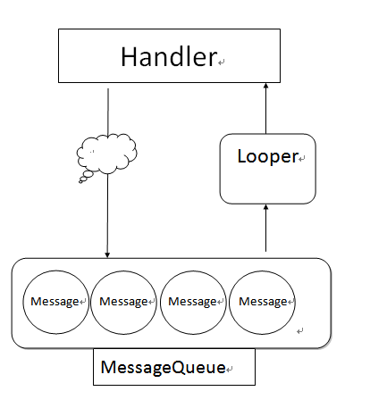

# 如何使用Handler

在Android使用執行緒要非常的小心,
使用者在進行操作時, 執行緒也在進行大量運算,
會造成使用者畫面卡死不動, 這樣的使用者體驗是不好的。

Android將Main Thread用來處理UI,
因此需要使用Thread讓大量運算在背景跑, 卻不影響使用者操作的畫面,
而如果需要畫面更新, 則會透過Handler機制去更新。

執行緒處理訊息機制(Handler、Looper、Message and MessageQueue)

```java
/*
* 一個Thread只能有一個Looper。
* 當Message處理完畢後, 會將Message發送給Handler。
*/
android.os.Looper

/*
* 一個Thread可以有多個Handler。
* 負責將Message送往MessageQueue, 並且接收Looper丟出來的Message。
*/
android.os.Handler

/*
* 一個Thread只能有一個MessageQueue。
* 負責裝載Message的佇列, 對Message進行管理, 是一個無限制的鏈結串列。
*/
android.os.MessageQueue

//執行緒上要處理的訊息。
```

如上圖, Handler負責派送訊息, 交給MessageQueue進行排隊, 
再透過Looper將每一個Message Object丟給Handler處理。

也許上面這些東西會有點陌生, 是因為Android Main Thread 一開始就先幫你綁定好了,
你不需要自訂初始化Looper並且綁定Handler，
下面的做法都是開啟Thread運算完後, 去呼叫Main Thread進行畫面更新。




```java
new Thread(new Runnable() {
    public void run() {
        //這邊是背景thread在運作, 這邊可以處理比較長時間或大量的運算

        ((Activity) mContext).runOnUiThread(new Runnable() {
            public void run() {
                //這邊是呼叫main thread handler幫我們處理UI部分                

            }
        });
    }
}).start();
//或者


view.post(new Runnable(){
    public void run(){
        //更新畫面

    }
});

//又或者另外一種寫法

private Handler mHandler = new Handler(){
    @Override
    public void handleMessage(Message msg) {
        switch(msg.what){
            case 1:
                //處理少量資訊或UI

            break;
        }
    }
};

new Thread(new Runnable(){
    public void run(){
        Message msg = new Message();
        msg.what = 1;
        mHandler.sendMessage(msg);
    }
});
```

第一種寫法是實作Runnable介面讓Main Thread的Handler進行callback(請參考android的消息处理机制)
一般是用來處理大量數據或者長時間運算,
最後再利用Activity內建的方法runOnUiThread呼叫main thread handler幫忙處理UI部分。
第二種寫法是自己定義一個Message物件透過Hanlder去進行處理。

你也可以拿Main Thread的Handler來處理比較少量資料。


```java
new Handler(mContext.getMainLooper()).post(new Runnable(){
   public void run(){
       //處理少量資訊或UI

   }
});
```

甚至你可以使用Delay的方法來延後Thread處理。

```java
 new Handler().postDelayed(new Runnable(){
   public void run(){
       //處理少量資訊或UI

   }
}, 3000);
```
上面是在3秒後處理少量資訊。

以上都是利用MainThread上面的Looper進行處理, 
實際上你也可以自己定義自己的Looper。

```java
new Thread(new Runnable() {
    public void run() {
        Log.e(TAG, "!!<A");
        Looper.prepare();
        new Handler().post(new Runnable(){

            @Override
            public void run() {
                Log.e(TAG, "B1");
            }
        });
        new Handler().post(new Runnable(){

            @Override
            public void run() {
                Log.e(TAG, "B2");
                Looper.myLooper().quit();
            }
        });

        Looper.loop();
                
        Log.e(TAG, "C");
        ((Activity) mContext).runOnUiThread(new Runnable() {
            public void run() {
                Log.e(TAG, "D");
            }
        });
    }
}).start();
```

輸出為A、B1、B2、C、D
由上面的程式碼可以看到我們自己定義的Looper,
對於Thread內的Handler會變成跟自己定義的Looper進行綁定,
也就是說這邊是屬於Background Thread部分, 不行拿來更新UI,
而直到呼叫Looper內的quit, 則會將該Looper以及MessageQueue移除, Thread才會繼續往下執行,
注意: 假設這邊如果還有Message正在處理, 則會將該Message處理完畢, 
再將後面未處理的Message全部移除。
如果要更新UI則會再透過Main Thread的handler去處理UI部分。
當然你也可以使用HandlerThread

講了那麼多訊息，訊息究竟是一個怎樣的物件?

```java
android.os.Message
```

只要是透過Handler派送的訊息最後都會被包成Message, 
送進MessageQueue屠宰等待派送,
每一個Message都會認得把自己送進來的Handler(記仇)。

```java
Message m = Message.obtain(handler, runnable);
m.sendToTarget();
```

##Message有幾種參數

```java
參數名稱    型別         用途
what       int         標記識別符號
obj        Object      物件, 必須Parcelable
data       Bundle      Bundle物件
callback   Runnable    實作Runnable的callback
```

以上是比較常用的, 還有一些請參考官網

##參考:
Android 中的 MessageQueue 機制
android的消息处理机制

