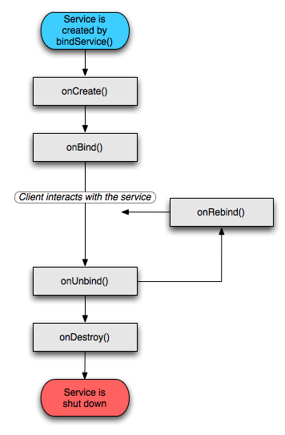

# startService及bindService的區別

service無法自己運行，需要通過`Context.startService()或Context.bindService()方法啟動`。這兩個方法都可以啟動Service，但是他們使用的場合有所不同。

## startService:

`使用者跟服務本身沒什麼關連，即使使用者本身退出了，服務依然會繼續運行。`

在服務未被創建時，系統會先呼叫onCreate()方法，接著使用onStart()方法。如果調用startService()方法前服務已經被創建，多次調用startService()方法並不會
導致多次創建服務，但會onStart()方法會被多次呼叫。只能使用Context.stopService()方法結束服務，服務結束時會使用onDestroy()方法。

生命週期

 

##bindService:

`使用者與服務綁定在了一起，使用者一旦退出，服務也就終止，大有「不求同時生，必須同時死」的特點。`

在服務未被創建時，系統會先調用服務的 onCreate()方法，接著調用onBind()方法。這個時候調用者和服務綁定在一起，調用者退出了，系統就會先調用服務的onUnbind()方法，接著調用onDestroy()方法。如果調用bindService()方法前服務已經被綁定，多次調用bindService()方法並不會導致多次創建服務及綁定(也就是說onCreate()和onBind()方法並不會被多次調用)。
如果調用者希望與正在綁定的服務解除綁定，可以調用 unbindService()方法，調用該方法也會導致系統調用服務的onUnbind()-->onDestroy()方法。
生命週期

