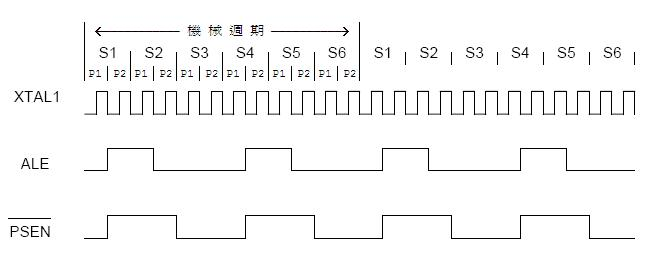

# 8051 clock

- 一個機械週期 (Machine Cycle) 是由 6 個狀態週期 (State) S1-S6 組成。而每一個狀態週期包含 2 個振盪週期分別稱為 Pl 與 P2 。

- ALE (位址栓鎖致能)則是每 6 個振盪週期出現一次。

- 當震盪器頻率 (crystal frequency) 為 12Mhz 時，表示一秒鐘能震盪 12000000 次，所以`每震盪一次時間 (1 clock time) 為 1/12000000，而一個 machine cycyle 的時間需要 12 個振盪週期則為 12*1/12000000=1/1000000`。

- 當震盪器頻率 (crystal frequency) 為 40Mhz 時，表示一秒鐘能震盪 40000000 次，所以`每震盪一次時間 (1 clock time) 為 1/40000000，而一個 machine cycyle 的時間需要 12 個振盪週期則為 12*1/40000000=3/10000000`。

- 一般每個指令需要二到三個 machine cycle 不等，每個 machine cycle 費時 12 個 clock，因此如果接上 12Mhz 的震盪器，則有 1 MIPS 的運算量。`1T 或 4T，代表可在 1 個 clock 或 4 個 clock 完成一個 machine cycle`。

- 另一種說法，8051 的計數器是一個機器週期為一個 count，而一個機器週期費時 12 個 clock，所以說 counting at the rate of 1/12 of the clock speed，表示每秒只能計數 12000000/12 次；如果是 4T's 8051 則為 1/4 of the clock speed，表示每秒可以計數 12000000/4 次，比一般的 8051 快了三倍速度。

- MIPS 即 Million Instructions Per Second 的簡稱，衡量計算機性能的指標之一。它表示單字長定點指令的平均執行速度。