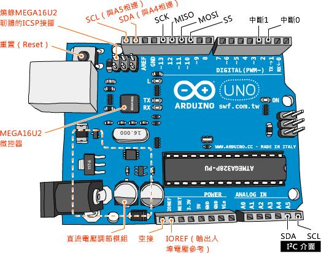

# Arduino UNO控制板簡介

##認識Arduino UNO控制板

Uno是義大利文”1”的意思，代表Arduino開發工具迎向1.0版的里程碑（註：於2011.11.30發表，在此之前，開發工具軟體的版本是0019, 0023之類的編號）。

同時，Arduino UNO控制板的插槽設計，也稱為「1.0腳位（1.0 Pinout）」。比起之前的板子，多了SDA和SCL（位於AREF插孔左側）以及IOREF（位在RESET插孔左側）。

Arduino微控器的許多接腳身兼兩種用途，像類比A4和A5腳，也是I2C介面的SDA和SCL腳位（詳閱第十一章「認識Wii左手把的通訊介面I2C」一節）。

新增的SCL和SDA插孔，分別和類比腳位A5與A4相連，新增這兩個插孔的好處是，做實驗時從板子的標示（註：標示在板子背後），能立即分辨SCL和SDA。

IOREF（輸出入埠電壓參考）插孔和5V（電源輸出）插孔相連，它可以讓擴充板（Shield）得知此Arduino板的運作電壓（註：大部分的擴充板都沒有使用到這項功能）。

IOREF左邊插孔是空接，所以沒有任何作用，未來的控制板也許會用到此插孔。
