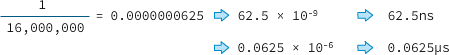
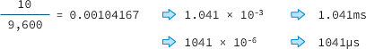
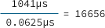

# 時脈算換

若序列埠緩衝區滿了，緩衝區將發生`“overflow”（溢位）`，後續傳入的資料將遺失。

不過，即使是大量的資料，電腦也不是一口氣推擠給Arduino。就像在看YouTube視訊時，影片資料宛如擠牙膏一般，每次傳輸一點。Arduino採用的ATmega (AVR) 系列處理器，其多數機械指令（instruction，此即微處理所能理解最基本指令）都能在一個時脈週期內執行完畢（請參閱Atmel AVR instruction set）。有一個衡量電腦運算速度的單位，叫做MIPS（Million Instructions Per Second，每秒百萬指令），Arduino處理器的運作時脈是16MHz，也就是每秒16百萬時脈週期，換算下來，`Arduino控制器的處理效能約16MIPS`。

在Arduino上，執行一道機械指令所需的時間約62.5ns（奈秒）或者說0.0625µs（微秒）：




執行一道機械指令所需的時間換算

假設序列埠的傳輸鮑率是9,600bps，傳遞一個字元（註：以8位元資料加上起始位元和結束位元，共10位元計算）所需時間約：



傳輸一個字元所需的時間換算

因此，接收或傳遞一個序列字元的時間內，AVR微處理器可執行16656道機械指令：



執行機械指令的數量換算

雖然Arduino C語言的一個指令往往由好幾個甚至數十個機械指令構成，但除非微處理器忙著解決複雜的「中斷」程式，導致來不及處理序列資料，緩衝區不太會發生溢位情況。


---


一般每個指令需要二到三個machine cycle不等，

每個machinecycle費時12個clock，因此如果接上12Mhz的震盪器，則也1Mips的運算量。

1T或4T，代表可在1個clock或4個clock完成一個machine cycle。
所以如果要計算運算速度，要先知道`Xtal 的震盪頻率`跟`Machine cycle所消耗clock數`。


---

以傳統的標準8051來舉例

clock time:
由外部晶體震盪或IC內部RC震盪產生的clock
010101....週而復始
常用頻率為1M~24M(可更高)

machine cycle(機械週期):8051一個動作所需要的的時間
通常為clock time*12


instruction  cycle(指令週期):
8051一個指令所需要多少機械週期
每個指令大多為1~2機械週期 除法指令較複雜需要4個機械週期(DIV、MUL)
instruction  cycle可以藉由查表來得知
http://elearning.stut.edu.tw/mechelec/ch3.htm


假設我們使用以下元件:
MCU:AT89S51 相容性(8051)
外部石英震盪器頻率:12M HZ

clock time= 1/12M sec

machine cycle = clock time * 12 = 1us

```c
mov a,rn    ;(Cycle=1) 這個指令要花1us
mul AB      ;(Cycle=4) 這個指令要花4us
ajmp 00h    ;(Cycle=2)             2us
```


---

