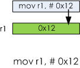
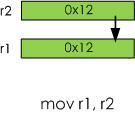
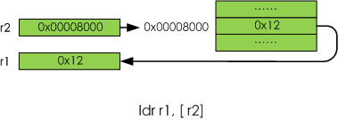
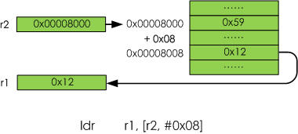
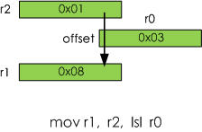
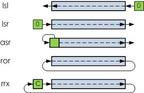
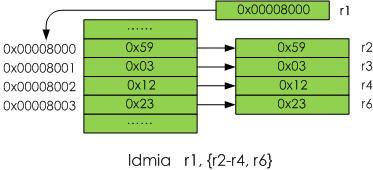

# ARM寻址方式

##3. ARM寻址方式

寻址方式是根据指令中给出的地址码字段来实现寻找真实操作数地址的方式。ARM处理器具有9种基本寻址方式。

- 1.立即数寻址
- 2.寄存器寻址
- 3.寄存器间接寻址
- 4.基址寻址
- 5.寄存器移位寻址
- 6.堆栈寻址
- 7.多寄存器寻址
- 8.块拷贝寻址
- 9.相对寻址

###3.1. 立即数寻址

###图 5. 立即数寻址示例




立即数寻址指令中的操作码字段后面的第一个操作数分即是操作数本身，也就是说，数据就包含在指令当中，取出指令也就取出了可以立即使用的操作数(这样的数称为立即数)。立即寻址指令举例如下：
```c
mov  r1, #0x12  @将立即数0x12装入r1寄存器
subs r1, r1, #1 @r1减1，结果放入r1，并且影响标志位
```

注意:立即数要以”#”号为前缀。表示进制的前缀如下：

表 5. 进制前缀
<table summary="进制前缀" border="1"><colgroup><col><col></colgroup><thead><tr><th>进制类型</th><th>支持的前缀</th></tr></thead><tbody><tr><td>十进制</td><td>无</td></tr><tr><td>十六进制</td><td>0x/0X</td></tr><tr><td>八进制</td><td>0</td></tr><tr><td>二进制</td><td>0b/0B</td></tr></tbody></table>


##3.2. 寄存器寻址

###图 6. 寄存器寻址示例



操作数的值在寄存器中，指令中的地址码字段指出的是寄存器编号，指令执行时直接取出寄存器值来操作。寄存器寻址指令举例如下：
```c
mov r1, r2      @将r2的值存入r1
sub r0, r1, r2  @将r1的值减去r2的值，结果保存到r0
```
##3.3. 寄存器间接寻址

###图 7. 寄存器间接寻址示例


寄存器间接寻址指令中的地址码给出的是一个通用寄存器的编号，所需的操作数保存在寄存器指定地址的存储单元中，即寄存器为操作数的地址指针。寄存器间接寻址指令举例如下：
```c
ldr	r1,[r2]	@将r2指向的存储单元的数据读出保存在r1中
str r1,[r2] @将r1的内容保存到r2指向的存储单
```

##3.4. 基址寻址

###图 8. 基址寻址示例



基址寻址是对寄存器间接寻址的扩展，它将基址寄存器的内容与指令中给出的偏移量相加，形成操作数的有效地址。基址寻址用于访问基址附近的存储单元，常用于查表、数组操作、功能部件寄存器访问等。基址寻址指令举例如下：

```c
ldr	r1,[r2, #0x08]	  @读取r2+0x08地址上的存储单元的内容，放入r1。
```

```c
/* 前索引寻址 */
ldr	r1,[r2, #0x08]	  @r1 <- [r2 + 0x08]
ldr	r1,[r2, #0x08]!	  @r1 <- [r2 + 0x08], r2 <- r2 + 0x08
```

```c
/* 后索引寻址 */
ldr r1, [r2], #0x08    @r1 <- r2, r2 <- r2 + 0x08
```

基址寻址根据数据传送和基地址的变动顺序又分为两类：

- 前索引寻址是将基址与偏移量相加作为传送数据的地址，传送数据后自动将数据的地址传送给基址寄存器。
- 后索引寻址是将基址作为传送数据的地址，传送数据后自动将基址的内容与偏移量相加传送给基址寄存器。
##3.5. 寄存器移位寻址

###图 9. 寄存器移位寻址示例



寄存器移位寻址是ARM指令集特有的寻址方式。当第2个操作数是寄存器移位方式时，第2个寄存器操作数在与第1个操作数结合之前，选择进行移位操作。寄存器移位寻址指令举例如下：
```c
mov	 r1, r2, lsl #r0   ;r2的值左移r0位，结果放入r1，即是r1 = r2 * 8
mov	 r1, r2, lsl #4    ;这里的r2的值左移4位，结果放入r1
```
实际编译过程中被转化为移位指令：
```c
lsl	r1, r2, r0
lsl	r1, r2, #4
```
与上对应，不同的移位指令将对应不同的寄存器移位寻址方式：

- lsl逻辑左移操作：可完成对通用寄存器中的内容进行逻辑左移操作，按操作数所指定的数量向左移位，低位用零来填充。其中，操作数可以是通用寄存器，也可以是立即数。
- lsr逻辑右移操作：可完成对通用寄存器中的内容进行右移操作，按操作数所指定的数量向右移位，左端用零来填充。其中，操作数可以是通用寄存器，也可以是立即数
- asr算术右移操作：可完成对通用寄存器中的内容进行右移操作，按操作数所指定的数量向右移位，左端用第31位的值来填充。其中，操作数可以是通用寄存器，也可以是立即数。
- ror循环右移操作：可完成对通用寄存器中的内容进行循环右移操作，按操作数所指定的数量向右循环移位，左端用右端移出的位来填充。其中，操作数可以是通用寄存器，也可以是立即数。
- rrx带扩展的循环右移操作：可完成对通用寄存器中的内容进行带扩展的循环右移操作，向右循环移1位，左端用进位标志位C来填充。

目前ARM支持的移位指令和它们的区别如下图：

###图 10. ARM移位运算

ARM移位运算


##3.6. 堆栈寻址

在2.3. 数据栈的使用中介绍了四种堆栈类型：

- 满递增：堆栈向上增长，堆栈指针指向内含有效数据项的最高地址。指令如ldmfa，stmfa等；
- 空递增：堆栈向上增长，堆栈指针指向堆栈上的第一个空位置。指令如ldmea、stmea等；
- 满递减：堆栈向下增长，堆栈指针指向内含有效数据项的最低地址。指令如ldmfd、stmfd等；
- 空递减：堆栈向下增长，堆栈指针指向堆栈下的第一个空位置。指令如ldmed、stmed等。

```
stmfd sp!, {r1-r7, lr} @将r1-r7， lr入栈, 满递减堆栈
ldmfd sp! ,{r1-r7, pc} @数据出栈，放入r1-r7，pc寄存器，满递减堆栈
```
sp即约定的r13寄存器，它总是指向栈顶地址，或者栈顶的下一地址。!号使数据出入栈后，sp自动调整到栈顶。

##3.7. 多寄存器寻址

多寄存器寻址一次可传送几个寄存器值，允许一条指令传送16个寄存器的任何子集或所有寄存器。多寄存器寻址指令举例如下：
```
ldmia	r1, {r2-r4, r6}   @将r1指向的单元中的数据读出到r2-r4、r6中
```

注意寄存器的编号连续和不连续的情况。类似的指令还有ldmib，ldmda和ldmdb。
###图 11. ldmia指令示例




ldmia指令示例

##3.8. 块拷贝寻址

块拷贝是将寄存器内容复制到基址寄存器的地址所指示的存储器中,需要注意的是在存储第一个值之后或之前存储器地址是增加还是减少.增值类型如下:

- IA：每次传送后,地址加4
- IB：每次传送前,地址加4
- DA：每次传送后,地址减4
- DB：每次传送前,地址减4

其中I指Increment；A指After；D指Decrement；B指Before。
```c
stmia	r0!, {r1-r7}  @将r1～r7的数据保存到存储器中,存储指针在保存第一个值之后增加，增长方向为向上增长。
stmib	r0!, {r1-r7}  @将r1～r7的数据保存到存储器中,存储指针在保存第一个值之前增加，增长方向为向上增长。
stmda	r0!, {r1-r7}  @将R1～R7的数据保存到存储器中,存储指针在保存第一个值之后增加, 增长方向为向下增长。
stmdb	r0!, {r1-r7}  @将r1～r7的数据保存到存储器中,存储指针在保存第一个值之前增加，增长方向为向下增长。
```
##3.9. 相对寻址

相对寻址是基址寻址的一种变通。由程序计数器pc提供基准地址，指令中的地址码字段作为偏移量，两者相加后得到的地址即为操作数的有效地址。通常的adr伪指令中的操作数就是相对于当前pc的值。相对寻址指令举例如下：
```
.section .data
msg: .asciz "hello"

.section .text
.align 2
.global _start
_start:
    mov r0, #10
    ......
    adr r0, msg
```
adr r0, msg对应的反汇编结果为sub r0, pc, #8。

总结：寄存器间接寻址和基址寻址通常用在ldr/str指令中，用来实现内存和寄存器间的数据搬移。堆栈寻址中的ldmfd/ldmed/stmfd/stm ed指令实现寄存器和数据栈的数据交互。多寄存器寻址实际上就是块拷贝寻址的反操作。
