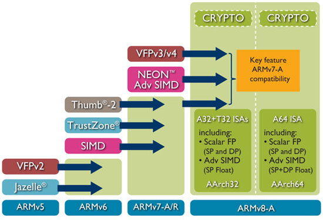
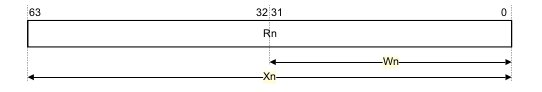

# Introduction to ARMv8 64-bit Architecture

##Introduction

The ARM architecture is a Reduced Instruction Set Computer (RISC) architecture, indeed its originally stood for “Acorn RISC Machine” but now stood for “Advanced RISC Machines”.
In the last years, ARM processors, with the diffusion of smartphones and tablets, are beginning very popular: mostly this is due to reduced costs, and a more power efficiency compared to other architectures as CISC:

RISC architectures (ARM, Mips, …) peculiarity:

- The load/store architecture only allows memory to be accessed by load and store operations, and all values for an operation need to be loaded from memory and be present in registers, so operations as “add reg,[address]” are not permitted!

- Another difference with CISC architectures: when a Branch and Link is called (in Intel arch. is the “call” operation) the return address is stored in a special register and not in the stack.

A lack into ARM architecture is the absence of multi-threading support, which is present in many others architectures as: Intel and Mips.
Cause of AArch32 (32bit) is most documented: Arm on wiki, Cambridge University – Operation System Development I decided to talk only about AArch64 (64bit).

## Processors:

A short ARM processors list:

- Classic or Cortext-A: with DSP, Floating Point, TrustZone e Jazelle extensions. ARMv5 e ARM6 (2001)
- Cortex-M: ARM Thumb®-2 technology which provides excellent code density. With Thumb-2 technology, the Cortex-M processors support a fundamental base of 16-bit Thumb instructions, extended to include more powerful 32-bit instructions. First Multi-core. (2004)
- Cortex-R: ARMv7 Deeply pipelined micro-architecture,Flexible Multi-Processor Core (MPCore) configurations:Symmetric Multi-Processing (SMP) & Asymmetric Multi-Processing (AMP), LPAE extension.
- Cortex-A50: ARMv8-A 64bit with load-acquire and store-release features , which are an excellent match for the C++11, C11 and Java memory models. (2011)

##Extensions

With every new version of ARM, there’re new extensions provided, the v8 architecture has these:

- Jazelle is a Java hardware/software accelerator: “ARM Jazelle DBX (Direct Bytecode eXecution) technology for direct bytecode execution of Java”. On Sofware side: Jazelle MobileVM is a complete JVM which is Multi-tasking, engineered to provide high performance multi-tasking in a very small memory footprint

- Floating Point: for floating point operations

- NEON: the ARM SIMD 128 bit (Single instruction, multiple data) engine and DSP the SIMD 32bit engine useful to make linear algebra operations

- Cryptographic Extension is an extension of the SIMD support and operates on the vector register file. It provides instructions for the acceleration of encryption and decryption to support the following: AES, SHA1, SHA2-256.

- TrustZone: is a system-wide approach to security for a wide array of client and server computing platforms include payment protection technology, digital rights management, BYOD, and a host of secured enterprise solutions

- Virtualization Extensions with the Large Physical Address Extension (LPAE) enable the efficient implementation of virtual machine hypervisors for ARM architecture compliant processors.
    - The visualization extensions provide the basis for ARM architecture compliant processors to address the needs of both client and server devices for the partitioning and management of complex software environments into virtual machines.
    - The Large Physical Address extension provides the means for each of the software environments to utilize efficiently the available physical memory when handling large amounts of data
    

##Architectures

- AArch64 the ARMv8-A 64-bit execution state, that uses 31 64-bit general purpose registers (R0-R30), and a 64-bit program counter (PC), stack pointer (SP), and exception link registers(ELR). Provides 32 128-bit registers for SIMD vector and scalar floating-point support (V0-V31).

- A64 instructions have a fixed length of 32 bits and are always little-endian.
AArch32 is the ARMv8-A 32-bit execution state, that uses 13 32-bit general purpose registers (R0-R12), a 32-bit program counter (PC), stack pointer (SP), and link register (LR). Provides 32 64-bit registers for Advanced SIMD vector and scalar floating-point support.
AArch32 execution state provides a choice of two instruction sets, A32 (ARM) and T32 (Thumb2). Operation in AArch32 state is compatible with ARMv7-A operation.

- T32: 16-bit instructions are decompressed transparently to full 32-bit ARM instructions in real time without performance loss.Thumb-2 technology made Thumb a mixed (32- and 16-bit) length instruction set

##Data types

- Data types are simply these:
- Byte: 8 bits.
- Halfword: 16 bits.
- Word: 32 bits.
- Doubleword: 64 bits.
- Quadword: 128 bits.

The architecture also supports the following floating-point data types:

- Half-precision floating-point formats.
- Single-precision floating-point format.
- Double-precision floating-point format.

In this short guide, I don’t talk about floating point assembly instructions to don’t make it too long, if you want know more about, you can see the ARM Architecture Reference Manual.

## Exception levels

UIC Academy

Search UIC...
Community
Downloads
Library
About Us
You are in: UIC > Development > Introduction to ARMv8 64-bit Architecture
Introduction to ARMv8 64-bit Architecture
april 9, 2014 by pnuic
Introduction

The ARM architecture is a Reduced Instruction Set Computer (RISC) architecture, indeed its originally stood for “Acorn RISC Machine” but now stood for “Advanced RISC Machines”.
In the last years, ARM processors, with the diffusion of smartphones and tablets, are beginning very popular: mostly this is due to reduced costs, and a more power efficiency compared to other architectures as CISC:

Complex Instruction Set Computer (CISC) processors, like the x86, have a rich instruction set capable of doing complex things with a single instruction. Such processors often have significant amounts of internal logic that decode machine instructions to sequences of internal operations (microcode).RISC architectures, in contrast, have a smaller number of more general purpose instructions, that might be executed with significantly fewer transistors, making the silicon cheaper and more power efficient. Like other RISC architectures, ARM cores have a large number of general-purpose registers and many instructions execute in a single cycle. It has simple addressing modes, where all load/store addresses can be determined from register contents and instruction fields.

RISC architectures (ARM, Mips, …) peculiarity:

The load/store architecture only allows memory to be accessed by load and store operations, and all values for an operation need to be loaded from memory and be present in registers, so operations as “add reg,[address]” are not permitted!
Another difference with CISC architectures: when a Branch and Link is called (in Intel arch. is the “call” operation) the return address is stored in a special register and not in the stack.
A lack into ARM architecture is the absence of multi-threading support, which is present in many others architectures as: Intel and Mips.
Cause of AArch32 (32bit) is most documented: Arm on wiki, Cambridge University – Operation System Development I decided to talk only about AArch64 (64bit).

Processors:

A short ARM processors list:

Classic or Cortext-A: with DSP, Floating Point, TrustZone e Jazelle extensions. ARMv5 e ARM6 (2001)
Cortex-M: ARM Thumb®-2 technology which provides excellent code density. With Thumb-2 technology, the Cortex-M processors support a fundamental base of 16-bit Thumb instructions, extended to include more powerful 32-bit instructions. First Multi-core. (2004)
Cortex-R: ARMv7 Deeply pipelined micro-architecture,Flexible Multi-Processor Core (MPCore) configurations:Symmetric Multi-Processing (SMP) & Asymmetric Multi-Processing (AMP), LPAE extension.
Cortex-A50: ARMv8-A 64bit with load-acquire and store-release features , which are an excellent match for the C++11, C11 and Java memory models. (2011)
Extensions

With every new version of ARM, there’re new extensions provided, the v8 architecture has these:

Jazelle is a Java hardware/software accelerator: “ARM Jazelle DBX (Direct Bytecode eXecution) technology for direct bytecode execution of Java”. On Sofware side: Jazelle MobileVM is a complete JVM which is Multi-tasking, engineered to provide high performance multi-tasking in a very small memory footprint
Floating Point: for floating point operations
NEON: the ARM SIMD 128 bit (Single instruction, multiple data) engine and DSP the SIMD 32bit engine useful to make linear algebra operations
Cryptographic Extension is an extension of the SIMD support and operates on the vector register file. It provides instructions for the acceleration of encryption and decryption to support the following: AES, SHA1, SHA2-256.
TrustZone: is a system-wide approach to security for a wide array of client and server computing platforms include payment protection technology, digital rights management, BYOD, and a host of secured enterprise solutions
Virtualization Extensions with the Large Physical Address Extension (LPAE) enable the efficient implementation of virtual machine hypervisors for ARM architecture compliant processors.
The visualization extensions provide the basis for ARM architecture compliant processors to address the needs of both client and server devices for the partitioning and management of complex software environments into virtual machines.
The Large Physical Address extension provides the means for each of the software environments to utilize efficiently the available physical memory when handling large amounts of data
V5_to_V8_Architecture

Architectures

AArch64 the ARMv8-A 64-bit execution state, that uses 31 64-bit general purpose registers (R0-R30), and a 64-bit program counter (PC), stack pointer (SP), and exception link registers(ELR). Provides 32 128-bit registers for SIMD vector and scalar floating-point support (V0-V31).
A64 instructions have a fixed length of 32 bits and are always little-endian.
AArch32 is the ARMv8-A 32-bit execution state, that uses 13 32-bit general purpose registers (R0-R12), a 32-bit program counter (PC), stack pointer (SP), and link register (LR). Provides 32 64-bit registers for Advanced SIMD vector and scalar floating-point support.
AArch32 execution state provides a choice of two instruction sets, A32 (ARM) and T32 (Thumb2). Operation in AArch32 state is compatible with ARMv7-A operation.
T32: 16-bit instructions are decompressed transparently to full 32-bit ARM instructions in real time without performance loss.Thumb-2 technology made Thumb a mixed (32- and 16-bit) length instruction set
Data types

Data types are simply these:

Byte: 8 bits.
Halfword: 16 bits.
Word: 32 bits.
Doubleword: 64 bits.
Quadword: 128 bits.
The architecture also supports the following floating-point data types:

Half-precision floating-point formats.
Single-precision floating-point format.
Double-precision floating-point format.
In this short guide, I don’t talk about floating point assembly instructions to don’t make it too long, if you want know more about, you can see the ARM Architecture Reference Manual.

Exception levels

There’re four exception levels, which replaces the 8 different processor modes, they work as the ring in Intel architectures, they are a form of privilege hierarchy:

- EL0 is the least privileged level, indeed it is called unprivileged execution. Apps are runned here.

- EL1: here can be runned OS kernel

- EL2: provides support for virtualization of Non-secure operation. Hypervisor can runned here.

- EL3 provides support for switching between two Security states, Secure state and Non-secure state. Secure monitor can be runned here.

When executing in AArch64 state, execution can move between Exception levels only on taking an exception or on returning from an exception.
Each of the 4 privilege levels has 3 private banked registers: the Exception Link Register, Stack Pointer and Saved PSR.

##Interprocessing: AArch64 <=> AArch32

Interprocessing is the term used to describe moving between the AArch64 and AArch32 Execution states.
The Execution state can change only on a change of Exception level. This means that the Execution state can change only on taking an exception to a higher Exception level, or returning from an exception to a lower Exception level.
On taking an exception to a higher Exception level, the Execution state either:

- Remains unchanged.
- Changes from AArch32 state to AArch64 state.

On returning from an exception to a lower Exception level, the Execution state either:

- Remains unchanged.
- Changes from AArch64 state to AArch32 state.

##The A64 Register

A64 has 31 general-purpose registers (integer) more the zero register and the current stack pointer register, here all the registers:

<table border="1">
<tbody>
<tr>
<td><strong>W<em>n</em></strong></td>
<td>32 bits</td>
<td>General-purpose register: n can be 0-30</td>
</tr>
<tr>
<td><strong>X<em>n</em></strong></td>
<td>64 bits</td>
<td>General-purpose register: n can be 0-30</td>
</tr>
<tr>
<td><strong>WZR</strong></td>
<td>32 bits</td>
<td>Zero register</td>
</tr>
<tr>
<td><strong>XZR</strong></td>
<td>64 bits</td>
<td>Zero register</td>
</tr>
<tr>
<td><strong>WSP</strong></td>
<td>32 bits</td>
<td>Current stack pointer</td>
</tr>
<tr>
<td><strong>SP</strong></td>
<td>64 bits</td>
<td>Current stack pointer</td>
</tr>
</tbody>
</table>

How registers should be using by compilers and programmers:

- r30 (LR): The Link Register, is used as the subroutine link register (LR) and stores the return address when Branch with Link operations are performed.
- r29 (FP): The Frame Pointer
- r19…r28: Callee-saved registers
- r18: The Platform Register, if needed; otherwise a temporary register.
- r17 (IP1): The second intra-procedure-call temporary register (can be used by call veneers and PLT code); at other times may be used as a temporary register.
- r16 (IP0): The first intra-procedure-call scratch register (can be used by call veneers and PLT code); at other times may be used as a temporary register.
- r9…r15: Temporary registers
- r8: Indirect result location register
- r0…r7: Parameter/result registers

The PC (program counter) has a limited access, only few instructions, as BL and ADL, can modify it.

## The use of Stack

The stack implementation is full-descending: in a push the stack pointer is decremented, i.e the stack grows towards lower address.
Another features is that stack must be quad-word aligned: SP mod 16 = 0.

A64 instructions can use the stack pointer only in a limited number of cases:

- Load/Store instructions use the current stack pointer as the base address: When stack alignment checking is enabled by system software and the base register is SP, the current stack pointer must be initially quadword aligned, That is, it must be aligned to 16 bytes. Misalignment generates a Stack Alignment fault.

- Add and subtract data processing instructions in their immediate and extended register forms, use the current stack pointer as a source register or the destination register or both.

- Logical data processing instructions in their immediate form use the current stack pointer as the destination register.

## Process State

PSTATE (process state, CPSR on AArch32) holds process state related information, his flags will be change with compare instructions, for example, so it is used by processor to see if make a branch (jump in Intel terminology) or not.

<table border="1">
<tbody>
<tr>
<td><em><strong>N,</strong></em> 
<em><strong> Z,</strong></em> 
<em><strong> C,</strong></em> 
<em><strong> V,</strong></em> 
<em><strong> D,</strong></em> 
<em><strong> A,</strong></em> 
<em><strong> I,</strong></em> 
<em><strong> F,</strong></em> 
<em><strong> SS,</strong></em> 
<em><strong> IL,</strong></em> 
<em><strong> EL,</strong></em> 
<em><strong> nRW,</strong></em> 
<em><strong> SP,</strong></em> 
<em><strong> Q,</strong></em> 
<em><strong> GE,</strong></em> 
<em><strong> IT,</strong></em> 
<em><strong> J,</strong></em> 
<em><strong> T,</strong></em> 
<em><strong> E,</strong></em> 
<em><strong> M</strong></em></td>
<td>Negative condition flag 
Zero condition flag 
Carry condition flag 
oVerflow condition flag 
Debug mask bit <em>[AArch64 only]</em> 
Asynchronous abort mask bit 
IRQ mask bit 
FIQ mask bit 
Software step bit 
Illegal execution state bit 
Exception Level (see above) 
not Register Width: 0=64, 1=32 
Stack pointer select: 0=SP0, 1=SPx<em> [AArch32 only]</em> 
Cumulative saturation flag<em> [AArch32 only]</em> 
Greater than or Equal flags<em> [AArch32 only]</em> 
If-then execution state bits <em>[AArch32 only]</em> 
J execution state bit <em>[AArch32 only]</em> 
T32 execution state bit<em> [AArch632 only]</em> 
Endian execution state bit <em>[AArch32 only]</em> 
Mode field (see above)<em> [AArch32 only]</em></td>
</tr>
</tbody>
</table>

The first four flags are the Condition flags `(NZCV)`, and they are the mostly used by processors:

- N: Negative condition flag. If the result is regarded as a two’s complement signed integer, then the PE sets N to 1 if the result is negative, and sets N to 0 if it is positive or zero.

- Z: Zero condition flag. Set to 1 if the result of the instruction is zero, and to 0 otherwise. A result of zero often indicates an equal result from a comparison.

- C: Carry condition flag. Set to 1 if the instruction results in a carry condition, for example an unsigned overflow that is the result of an addition.

- V: Overflow condition flag. Set to 1 if the instruction results in an overflow condition, for example a signed overflow that is the result of an addition

##Condition code suffixes

This suffixes are used by the Branch conditionally instruction, here a table useful to understand what they mean:

<table summary="Condition code suffixes" border="1">
<colgroup>
<col>
<col>
<col> </colgroup>
<thead>
<tr>
<th>Suffix</th>
<th>Flags</th>
<th>Meaning</th>
</tr>
</thead>
<tbody>
<tr>
<td><code>EQ</code></td>
<td><code>Z</code> set</td>
<td>Equal</td>
</tr>
<tr>
<td><code>NE</code></td>
<td><code>Z</code> clear</td>
<td>Not equal</td>
</tr>
<tr>
<td><code>CS or HS</code></td>
<td><code>C</code> set</td>
<td>Higher or same (unsigned &gt;= )</td>
</tr>
<tr>
<td><code>CC or LO</code></td>
<td><code>C</code> clear</td>
<td>Lower (unsigned &lt; )</td>
</tr>
<tr>
<td><code>MI</code></td>
<td><code>N</code> set</td>
<td>Negative</td>
</tr>
<tr>
<td><code>PL</code></td>
<td><code>N</code> clear</td>
<td>Positive or zero</td>
</tr>
<tr>
<td><code>VS</code></td>
<td><code>V</code> set</td>
<td>Overflow</td>
</tr>
<tr>
<td><code>VC</code></td>
<td><code>V</code> clear</td>
<td>No overflow</td>
</tr>
<tr>
<td><code>HI</code></td>
<td><code>C</code> set and <code>Z</code> clear</td>
<td>Higher (unsigned &gt;)</td>
</tr>
<tr>
<td><code>LS</code></td>
<td><code>C</code> clear or <code>Z</code> set</td>
<td>Lower or same (unsigned &lt;=)</td>
</tr>
<tr>
<td><code>GE</code></td>
<td><code>N</code> and <code>V</code> the same</td>
<td>Signed &gt;=</td>
</tr>
<tr>
<td><code>LT</code></td>
<td><code>N</code> and <code>V</code> differ</td>
<td>Signed &lt;</td>
</tr>
<tr>
<td><code>GT</code></td>
<td><code>Z</code> clear, <code>N</code> and <code>V</code> the same</td>
<td>Signed &gt;</td>
</tr>
<tr>
<td><code>LE</code></td>
<td><code>Z</code> set, <code>N</code> and <code>V</code> differ</td>
<td>Signed &lt;=</td>
</tr>
<tr>
<td><code>AL</code></td>
<td>Any</td>
<td>Always. This suffix is normally omitted.</td>
</tr>
</tbody>
</table>

when you see` <cond>` near an assembly instruction you can use one of these suffixes.

##Istruction Set

The A64 encoding structure breaks down into the following functional
groups:

- A miscellaneous group of branch instructions, exception generating instructions, and system instructions.
- Data processing instructions associated with general-purpose registers. These instructions are supported by two functional groups, depending on whether the operands:
    - Are all held in registers.
    - Include an operand with a constant immediate value.
- Load and store instructions associated with the general-purpose register file and the SIMD and floating-point register file.
- SIMD and scalar floating-point data processing instructions that operate on the SIMD and floating-point registers. (I don’t debate)

##What instructions are not present compared to AArch32:

- Conditional execution operations, cause of:
    - The A64 instruction set does not include the concept of predicated or conditional execution. Benchmarking shows that modern branch predictors work well enough that predicated execution of instructions does not offer sufficient benefit to justify its significant use of opcode space, and its implementation cost in advanced implementations. [source]

- Load Multiple.  instructions load from memory a subset, or possibly all, of the general-purpose registers and the PC, so there aren’t: push, pop, ldmia, ecc… : these are be replace by load/store pair.
- Coprocessor instructions

##Branches & Exception

Conditional branch
Conditional branches change the flow of execution depending on the current state of the condition flags or the value in a general-purpose register.

<table border="1">
<tbody>
<tr>
<td><strong>B&lt;cond&gt;</strong></td>
<td>Branch conditionally</td>
<td>B.&lt;cond&gt; &lt;label&gt;</td>
</tr>
<tr>
<td><strong>CBNZ</strong></td>
<td>Compare and branch if nonzero</td>
<td>CBNZ &lt;Wt|Xt&gt;, &lt;label&gt;</td>
</tr>
<tr>
<td><strong>CBZ</strong></td>
<td>Compare and branch if zero</td>
<td>CBZ &lt;Xt&gt;, &lt;label&gt;</td>
</tr>
</tbody>
</table>

##Unconditional branch

<table border="1">
<tbody>
<tr>
<td><strong>B</strong></td>
<td>Branch unconditionally</td>
<td>B &lt;label&gt;</td>
</tr>
<tr>
<td><strong>BL</strong></td>
<td>Branch with link</td>
<td>BL &lt;label&gt;</td>
</tr>
</tbody>
</table>

The BL instruction(s) writes the address of the sequentially following instruction, for the return (see RET), to general-purpose register, X30.

## Unconditional branch (register)

<table border="1">
<tbody>
<tr>
<td><strong>BLR</strong></td>
<td>Branch with link to register</td>
<td>BLR &lt;Xn&gt;</td>
</tr>
<tr>
<td><strong>BR</strong></td>
<td>Branch to register</td>
<td>BR &lt;Xn&gt;</td>
</tr>
<tr>
<td><strong>RET</strong></td>
<td>Return from subroutine:</td>
<td>RET {&lt;Xn&gt;};&nbsp; where Xn register holding the address to be branched to. Defaults to X30 if absent.</td>
</tr>
</tbody>
</table>

## Exception generating

- HVC Generate exception targeting Exception level 2
- SMC Generate exception targeting Exception level 3
- SVC Instruction Generate exception targeting Exception level 1

## Others instrunctions

- NOP: No OPeration
- WFE Wait for event
- WFI Wait for interrupt
- SEV Send event
- SEVL Send event local

## Load/Store register

There’re many instructions in this class to move many data size: byte, halfword and word, but I show only four, just to make you understand them : two for move single register and two for move a pair of registers; but first I have to describe how we can access to memory.

## Load/Store addressing modes

This part is very important to understand different ARM addressing modes; the most used are three:

- [base{, #imm}]: Base plus offset  addressing means that the address is the value in the 64-bit base register plus an offset.
    - Example: ldrsw    x0, [x29,76]   #load signed word in x0
- [base, #imm]! : Pre-indexed addressing means that the address is the sum of the value in the 64-bit base register and an offset, and the address is then writtenback to the base register.
    - Example: stp    x29, x30, [sp, -80]!  #store x9 e x30 into stack from sp-80
- [base], #imm : Post-indexed addressing means that the address is the value in the 64-bit base register, and the sum of the  address and the offset is then written back to the base register.
    - Example: ldp    x29, x30, [sp], 80 #load values from stack

now I can describe load/store instructions, don’t care addressing mode, I show you only few example.

##Single Register
Save a register into a memory

UIC Academy

Search UIC...
Community
Downloads
Library
About Us
You are in: UIC > Development > Introduction to ARMv8 64-bit Architecture
Introduction to ARMv8 64-bit Architecture
april 9, 2014 by pnuic
Introduction

The ARM architecture is a Reduced Instruction Set Computer (RISC) architecture, indeed its originally stood for “Acorn RISC Machine” but now stood for “Advanced RISC Machines”.
In the last years, ARM processors, with the diffusion of smartphones and tablets, are beginning very popular: mostly this is due to reduced costs, and a more power efficiency compared to other architectures as CISC:

Complex Instruction Set Computer (CISC) processors, like the x86, have a rich instruction set capable of doing complex things with a single instruction. Such processors often have significant amounts of internal logic that decode machine instructions to sequences of internal operations (microcode).RISC architectures, in contrast, have a smaller number of more general purpose instructions, that might be executed with significantly fewer transistors, making the silicon cheaper and more power efficient. Like other RISC architectures, ARM cores have a large number of general-purpose registers and many instructions execute in a single cycle. It has simple addressing modes, where all load/store addresses can be determined from register contents and instruction fields.

RISC architectures (ARM, Mips, …) peculiarity:

The load/store architecture only allows memory to be accessed by load and store operations, and all values for an operation need to be loaded from memory and be present in registers, so operations as “add reg,[address]” are not permitted!
Another difference with CISC architectures: when a Branch and Link is called (in Intel arch. is the “call” operation) the return address is stored in a special register and not in the stack.
A lack into ARM architecture is the absence of multi-threading support, which is present in many others architectures as: Intel and Mips.
Cause of AArch32 (32bit) is most documented: Arm on wiki, Cambridge University – Operation System Development I decided to talk only about AArch64 (64bit).

Processors:

A short ARM processors list:

Classic or Cortext-A: with DSP, Floating Point, TrustZone e Jazelle extensions. ARMv5 e ARM6 (2001)
Cortex-M: ARM Thumb®-2 technology which provides excellent code density. With Thumb-2 technology, the Cortex-M processors support a fundamental base of 16-bit Thumb instructions, extended to include more powerful 32-bit instructions. First Multi-core. (2004)
Cortex-R: ARMv7 Deeply pipelined micro-architecture,Flexible Multi-Processor Core (MPCore) configurations:Symmetric Multi-Processing (SMP) & Asymmetric Multi-Processing (AMP), LPAE extension.
Cortex-A50: ARMv8-A 64bit with load-acquire and store-release features , which are an excellent match for the C++11, C11 and Java memory models. (2011)
Extensions

With every new version of ARM, there’re new extensions provided, the v8 architecture has these:

Jazelle is a Java hardware/software accelerator: “ARM Jazelle DBX (Direct Bytecode eXecution) technology for direct bytecode execution of Java”. On Sofware side: Jazelle MobileVM is a complete JVM which is Multi-tasking, engineered to provide high performance multi-tasking in a very small memory footprint
Floating Point: for floating point operations
NEON: the ARM SIMD 128 bit (Single instruction, multiple data) engine and DSP the SIMD 32bit engine useful to make linear algebra operations
Cryptographic Extension is an extension of the SIMD support and operates on the vector register file. It provides instructions for the acceleration of encryption and decryption to support the following: AES, SHA1, SHA2-256.
TrustZone: is a system-wide approach to security for a wide array of client and server computing platforms include payment protection technology, digital rights management, BYOD, and a host of secured enterprise solutions
Virtualization Extensions with the Large Physical Address Extension (LPAE) enable the efficient implementation of virtual machine hypervisors for ARM architecture compliant processors.
The visualization extensions provide the basis for ARM architecture compliant processors to address the needs of both client and server devices for the partitioning and management of complex software environments into virtual machines.
The Large Physical Address extension provides the means for each of the software environments to utilize efficiently the available physical memory when handling large amounts of data
V5_to_V8_Architecture

Architectures

AArch64 the ARMv8-A 64-bit execution state, that uses 31 64-bit general purpose registers (R0-R30), and a 64-bit program counter (PC), stack pointer (SP), and exception link registers(ELR). Provides 32 128-bit registers for SIMD vector and scalar floating-point support (V0-V31).
A64 instructions have a fixed length of 32 bits and are always little-endian.
AArch32 is the ARMv8-A 32-bit execution state, that uses 13 32-bit general purpose registers (R0-R12), a 32-bit program counter (PC), stack pointer (SP), and link register (LR). Provides 32 64-bit registers for Advanced SIMD vector and scalar floating-point support.
AArch32 execution state provides a choice of two instruction sets, A32 (ARM) and T32 (Thumb2). Operation in AArch32 state is compatible with ARMv7-A operation.
T32: 16-bit instructions are decompressed transparently to full 32-bit ARM instructions in real time without performance loss.Thumb-2 technology made Thumb a mixed (32- and 16-bit) length instruction set
Data types

Data types are simply these:

Byte: 8 bits.
Halfword: 16 bits.
Word: 32 bits.
Doubleword: 64 bits.
Quadword: 128 bits.
The architecture also supports the following floating-point data types:

Half-precision floating-point formats.
Single-precision floating-point format.
Double-precision floating-point format.
In this short guide, I don’t talk about floating point assembly instructions to don’t make it too long, if you want know more about, you can see the ARM Architecture Reference Manual.

Exception levels

There’re four exception levels, which replaces the 8 different processor modes, they work as the ring in Intel architectures, they are a form of privilege hierarchy:

EL0 is the least privileged level, indeed it is called unprivileged execution. Apps are runned here.
EL1: here can be runned OS kernel
EL2: provides support for virtualization of Non-secure operation. Hypervisor can runned here.
EL3 provides support for switching between two Security states, Secure state and Non-secure state. Secure monitor can be runned here.
When executing in AArch64 state, execution can move between Exception levels only on taking an exception or on returning from an exception.
Each of the 4 privilege levels has 3 private banked registers: the Exception Link Register, Stack Pointer and Saved PSR.

Interprocessing: AArch64 <=> AArch32

Interprocessing is the term used to describe moving between the AArch64 and AArch32 Execution states.
The Execution state can change only on a change of Exception level. This means that the Execution state can change only on taking an exception to a higher Exception level, or returning from an exception to a lower Exception level.
On taking an exception to a higher Exception level, the Execution state either:

Remains unchanged.
Changes from AArch32 state to AArch64 state.
On returning from an exception to a lower Exception level, the Execution state either:

Remains unchanged.
Changes from AArch64 state to AArch32 state.
The A64 Register

A64 has 31 general-purpose registers (integer) more the zero register and the current stack pointer register, here all the registers:

Wn	32 bits	General-purpose register: n can be 0-30
Xn	64 bits	General-purpose register: n can be 0-30
WZR	32 bits	Zero register
XZR	64 bits	Zero register
WSP	32 bits	Current stack pointer
SP	64 bits	Current stack pointer
reg

How registers should be using by compilers and programmers:

r30 (LR): The Link Register, is used as the subroutine link register (LR) and stores the return address when Branch with Link operations are performed.
r29 (FP): The Frame Pointer
r19…r28: Callee-saved registers
r18: The Platform Register, if needed; otherwise a temporary register.
r17 (IP1): The second intra-procedure-call temporary register (can be used by call veneers and PLT code); at other times may be used as a temporary register.
r16 (IP0): The first intra-procedure-call scratch register (can be used by call veneers and PLT code); at other times may be used as a temporary register.
r9…r15: Temporary registers
r8: Indirect result location register
r0…r7: Parameter/result registers
The PC (program counter) has a limited access, only few instructions, as BL and ADL, can modify it.

The use of Stack

The stack implementation is full-descending: in a push the stack pointer is decremented, i.e the stack grows towards lower address.
Another features is that stack must be quad-word aligned: SP mod 16 = 0.

A64 instructions can use the stack pointer only in a limited number of cases:

Load/Store instructions use the current stack pointer as the base address: When stack alignment checking is enabled by system software and the base register is SP, the current stack pointer must be initially quadword aligned, That is, it must be aligned to 16 bytes. Misalignment generates a Stack Alignment fault.
Add and subtract data processing instructions in their immediate and extended register forms, use the current stack pointer as a source register or the destination register or both.
Logical data processing instructions in their immediate form use the current stack pointer as the destination register.
Process State

PSTATE (process state, CPSR on AArch32) holds process state related information, his flags will be change with compare instructions, for example, so it is used by processor to see if make a branch (jump in Intel terminology) or not.

N,
Z,
C,
V,
D,
A,
I,
F,
SS,
IL,
EL,
nRW,
SP,
Q,
GE,
IT,
J,
T,
E,
M	Negative condition flag
Zero condition flag
Carry condition flag
oVerflow condition flag
Debug mask bit [AArch64 only]
Asynchronous abort mask bit
IRQ mask bit
FIQ mask bit
Software step bit
Illegal execution state bit
Exception Level (see above)
not Register Width: 0=64, 1=32
Stack pointer select: 0=SP0, 1=SPx [AArch32 only]
Cumulative saturation flag [AArch32 only]
Greater than or Equal flags [AArch32 only]
If-then execution state bits [AArch32 only]
J execution state bit [AArch32 only]
T32 execution state bit [AArch632 only]
Endian execution state bit [AArch32 only]
Mode field (see above) [AArch32 only]
The first four flags are the Condition flags (NZCV), and they are the mostly used by processors:

N: Negative condition flag. If the result is regarded as a two’s complement signed integer, then the PE sets N to 1 if the result is negative, and sets N to 0 if it is positive or zero.
Z: Zero condition flag. Set to 1 if the result of the instruction is zero, and to 0 otherwise. A result of zero often indicates an equal result from a comparison.
C: Carry condition flag. Set to 1 if the instruction results in a carry condition, for example an unsigned overflow that is the result of an addition.
V: Overflow condition flag. Set to 1 if the instruction results in an overflow condition, for example a signed overflow that is the result of an addition
Condition code suffixes

This suffixes are used by the Branch conditionally instruction, here a table useful to understand what they mean:

Suffix	Flags	Meaning
EQ	Z set	Equal
NE	Z clear	Not equal
CS or HS	C set	Higher or same (unsigned >= )
CC or LO	C clear	Lower (unsigned < )
MI	N set	Negative
PL	N clear	Positive or zero
VS	V set	Overflow
VC	V clear	No overflow
HI	C set and Z clear	Higher (unsigned >)
LS	C clear or Z set	Lower or same (unsigned <=)
GE	N and V the same	Signed >=
LT	N and V differ	Signed <
GT	Z clear, N and V the same	Signed >
LE	Z set, N and V differ	Signed <=
AL	Any	Always. This suffix is normally omitted.
when you see <cond> near an assembly instruction you can use one of these suffixes.

Istruction Set

The A64 encoding structure breaks down into the following functional
groups:

A miscellaneous group of branch instructions, exception generating instructions, and system instructions.
Data processing instructions associated with general-purpose registers. These instructions are supported by two functional groups, depending on whether the operands:
Are all held in registers.
Include an operand with a constant immediate value.
Load and store instructions associated with the general-purpose register file and the SIMD and floating-point register file.
SIMD and scalar floating-point data processing instructions that operate on the SIMD and floating-point registers. (I don’t debate)
What instructions are not present compared to AArch32:

Conditional execution operations, cause of:
The A64 instruction set does not include the concept of predicated or conditional execution. Benchmarking shows that modern branch predictors work well enough that predicated execution of instructions does not offer sufficient benefit to justify its significant use of opcode space, and its implementation cost in advanced implementations. [source]

Load Multiple.  instructions load from memory a subset, or possibly all, of the general-purpose registers and the PC, so there aren’t: push, pop, ldmia, ecc… : these are be replace by load/store pair.
Coprocessor instructions
Branches & Exception

Conditional branch
Conditional branches change the flow of execution depending on the current state of the condition flags or the value in a general-purpose register.

B<cond>	Branch conditionally	B.<cond> <label>
CBNZ	Compare and branch if nonzero	CBNZ <Wt|Xt>, <label>
CBZ	Compare and branch if zero	CBZ <Xt>, <label>
 

Unconditional branch

B	Branch unconditionally	B <label>
BL	Branch with link	BL <label>
The BL instruction(s) writes the address of the sequentially following instruction, for the return (see RET), to general-purpose register, X30.

Unconditional branch (register)

BLR	Branch with link to register	BLR <Xn>
BR	Branch to register	BR <Xn>
RET	Return from subroutine:	RET {<Xn>};  where Xn register holding the address to be branched to. Defaults to X30 if absent.
 

Exception generating

HVC Generate exception targeting Exception level 2
SMC Generate exception targeting Exception level 3
SVC Instruction Generate exception targeting Exception level 1
Others instrunctions

NOP: No OPeration
WFE Wait for event
WFI Wait for interrupt
SEV Send event
SEVL Send event local
Load/Store register

There’re many instructions in this class to move many data size: byte, halfword and word, but I show only four, just to make you understand them : two for move single register and two for move a pair of registers; but first I have to describe how we can access to memory.

Load/Store addressing modes

This part is very important to understand different ARM addressing modes; the most used are three:

[base{, #imm}]: Base plus offset  addressing means that the address is the value in the 64-bit base register plus an offset.
Example: ldrsw    x0, [x29,76]   #load signed word in x0
[base, #imm]! : Pre-indexed addressing means that the address is the sum of the value in the 64-bit base register and an offset, and the address is then writtenback to the base register.
Example: stp    x29, x30, [sp, -80]!  #store x9 e x30 into stack from sp-80
[base], #imm : Post-indexed addressing means that the address is the value in the 64-bit base register, and the sum of the  address and the offset is then written back to the base register.
Example: ldp    x29, x30, [sp], 80 #load values from stack
now I can describe load/store instructions, don’t care addressing mode, I show you only few example.

Single Register
Save a register into a memory

ldr: Load register works with:
Register offset:  LDR <Xt>, [<Xn|SP>, <R><m>{, <extend> {<amount>}}]
Immediate offset: LDR <Xt>, [<Xn|SP>], #<simm>
PC-relative literal: LDR <Xt>, <label
str: Store register:
register offset: STR <Xt>, [<Xn|SP>, <R><m>{, <extend> {<amount>}}]
immediate offset: STR <Xt>, [<Xn|SP>], #<simm>
<simm> is signed immediate byte offset, in the range -256 to 255
