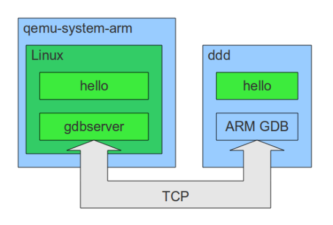

# Debugging ARM programs inside QEMU

Recently I wanted to debug a Linux program running inside an ARM system emulated with QEMU. I went into some troubles, so I’m going to write here the procedure that worked for me. I wanted to use gdbserver to run a program inside QEMU, and then connect to it from a GDB instance running on my PC, using a TCP link. gdbserver is a piece of software that implements some of the GDB functionalities (the debugging stubs) and then offers the possibility to connect to a full GDB instance through the network (or through a serial port). What I wanted to obtain is illustrated in the following figure.




The color blue indicates software compiled to run on my Ubuntu PC (32-bit x86) while the color green indicates software compiled to run on ARM. qemu-system-arm is the software that emulates a VersatilePB platform; I tried to use the one that can be installed through Ubuntu repositories (the package is qemu-kvm-extras) but it froze running the last version of Linux (2.6.35). For this reason I decided to compile the upstream version and use that one. The GDB server and “client” come from the CodeSourcery compiler collection for ARM, as well as the compiler used to cross-compile the software for ARM. The program I’ll debug in this example is the simple GNU Hello, that doesn’t do very much beyond printing “Hello World”, but is a nice example of cross-compilation with GNU Autotools.

#Prerequisites

In order to follow this procedure, I installed:

- CodeSourcery GNU/Linux toolchain for ARM
- The native x86 toolchain (build-essentials package in Ubuntu) to compile QEMU
- DDD as a graphic interface to the debugger
- cpio, an utility to create the Linux filesystem image.
- the package libncurses5-dev to run the menu configurations of both Linux kernel and - Busybox
- libsdl-dev and zlib1g-dev to compile QEMU

```sh
$ sudo apt-get install build-essential ddd cpio libncurses5-dev libsdl-dev zlib1g-dev
$ wget http://www.codesourcery.com/sgpp/lite/arm/portal/package6490/public/arm-none-linux-gnueabi/arm-2010q1-202-arm-none-linux-gnueabi.bin
$ chmod +x arm-2010q1-202-arm-none-linux-gnueabi.bin
$ ./arm-2010q1-202-arm-none-linux-gnueabi.bin
```
I installed the toolchain in the default directory “~/CodeSourcery”. The gdbserver executable in my case can be found at the path “/home/francesco/CodeSourcery/Sourcery_G++_Lite/arm-none-linux-gnueabi/libc/usr/bin/gdbserver”.


Note that the following procedure is run in a dedicated folder, and no root access is required from now on. At the end of the procedure about 1 Gigabyte of hard disk space was used.


#Linux Kernel
First of all, I took the new kernel version from the official repositories.

```sh
$ wget http://www.kernel.org/pub/linux/kernel/v2.6/linux-2.6.35.tar.bz2
$ tar xjf linux-2.6.35.tar.bz2
$ cd linux-2.6.35/
$ make ARCH=arm versatile_defconfig
$ make ARCH=arm menuconfig
```

When the menu appears, I go into the “Kernel Features” section and enable EABI support; then I exit (saving the configuration) and compile:

```sh
$ make ARCH=arm CROSS_COMPILE=arm-none-linux-gnueabi- all
$ cd ..
```

#Busybox

Next, I take the latest version of Busybox; in a previous tutorial I compiled it statically, but this time I will not, because gdbserver (that I plan to use) needs shared libraries anyway.

```sh
$ wget http://busybox.net/downloads/busybox-1.17.1.tar.bz2
$ tar xjf busybox-1.17.1.tar.bz2
$ cd busybox-1.17.1
$ make ARCH=arm CROSS_COMPILE=arm-none-linux-gnueabi- defconfig
$ make ARCH=arm CROSS_COMPILE=arm-none-linux-gnueabi- install
$ cd ..
```

The result is the folder “busybox-1.17.1/_install”, containing a minimal root filesystem that lacks shared libraries.


#QEMU
I recompiled from source only the QEMU binaries needed to emulate an ARM system.
```sh
$ wget http://download.savannah.gnu.org/releases/qemu/qemu-0.12.5.tar.gz
$ tar xzf qemu-0.12.5.tar.gz
$ cd qemu-0.12.5
$ ./configure --enable-sdl --disable-kvm --enable-debug --target-list=arm-softmmu
$ ./make
$ cd ..
```
The relevant result is the program “./qemu-0.12.5/arm-softmmu/qemu-system-arm” that will be used to emulate the VersatilePB platform.

#GNU Hello
This package needs to be configured for cross-compilation; turns out it’s very easy to do: it needs just the prefix of the cross-compiler.
```sh
$ wget http://ftp.gnu.org/gnu/hello/hello-2.6.tar.gz
$ tar xzf hello-2.6.tar.gz
$ cd hello-2.6
$ ./configure --host=arm-none-linux-gnueabi
$ make
$ cd ..
```


The result is the ARM-executable “hello-2.6/src/hello”.
#Complete the filesystem

All the ARM binaries involved (busybox, gdbserver, hello) need shared libraries. The Codesourcery toolchain offers these libraries in a subfolder of its installation. In my case it’s “/home/francesco/CodeSourcery/Sourcery_G++_Lite/arm-none-linux-gnueabi/libc/lib/”. In order to discover what are the needed libraries I used the readelf tool distributed in the CodeSourcery toolchain. In particular, I ran:

```sh
$ arm-none-linux-gnueabi-readelf hello-2.6/src/hello -a |grep lib
 [Requesting program interpreter: /lib/ld-linux.so.3]
 0x00000001 (NEEDED)                     Shared library: [libgcc_s.so.1]
 0x00000001 (NEEDED)                     Shared library: [libc.so.6]
00010694  00000216 R_ARM_JUMP_SLOT   0000835c   __libc_start_main
 2: 0000835c     0 FUNC    GLOBAL DEFAULT  UND __libc_start_main@GLIBC_2.4 (2)
 89: 0000844c     4 FUNC    GLOBAL DEFAULT   12 __libc_csu_fini
 91: 0000835c     0 FUNC    GLOBAL DEFAULT  UND __libc_start_main@@GLIBC_
 101: 00008450   204 FUNC    GLOBAL DEFAULT   12 __libc_csu_init
 000000: Version: 1  File: libgcc_s.so.1  Cnt: 1
 0x0020: Version: 1  File: libc.so.6  Cnt: 1```


The hello binary requires three shared libraries: “ld-linux.so.3″, “libgcc_s.so.1″ and “libc.so.6″. I executed this command for all three binaries, and I copied the required libraries into the Busybox filesystem, together with the gdbserver executable and the hello executable.

```sh
$ cd busybox-1.17.1/_install
$ mkdir -p lib
$ cp /home/francesco/CodeSourcery/Sourcery_G++_Lite/arm-none-linux-gnueabi/libc/lib/ld-linux.so.3 lib/
$ cp /home/francesco/CodeSourcery/Sourcery_G++_Lite/arm-none-linux-gnueabi/libc/lib/libgcc_s.so.1 lib/
$ cp /home/francesco/CodeSourcery/Sourcery_G++_Lite/arm-none-linux-gnueabi/libc/lib/libm.so.6 lib/
$ cp /home/francesco/CodeSourcery/Sourcery_G++_Lite/arm-none-linux-gnueabi/libc/lib/libc.so.6 lib/
$ cp /home/francesco/CodeSourcery/Sourcery_G++_Lite/arm-none-linux-gnueabi/libc/lib/libdl.so.2 lib/
$ cp /home/francesco/CodeSourcery/Sourcery_G++_Lite/arm-none-linux-gnueabi/libc/usr/bin/gdbserver usr/bin/
$ cp ../../hello-2.6/src/hello usr/bin/
$ cd ../../```

For my experiment I need a working network from the guest ARM system side, so I prepared an initialization script to enable it. Extending from my previous tutorial, here is the script “rcS” that i used.
```sh
#!/bin/sh
mount -t proc none /proc
mount -t sysfs none /sys
/sbin/mdev -s
ifconfig lo up
ifconfig eth0 10.0.2.15 netmask 255.255.255.0
route add default gw 10.0.2.1```


Next, I copy rcS it inside the “etc/init.d” directory of the Busybox filesystem and create a compressed filesystem image:
```sh
$ cd busybox-1.17.1/_install
$ mkdir -p proc sys dev etc etc/init.d
$ cp ../../rcS etc/init.d
$ chmod +x etc/init.d/rcS
$ find . | cpio -o --format=newc | gzip > ../../rootfs.img.gz
$ cd ../../
```


#Running and debugging
- Now I have put everything in place:
    - A compressed kernel image
    - QEMU
    - A compressed filesystem image containing:
        - Busybox
        - rcS initialization script
        - GNU Hello binary compiled for ARM
        - gdbserver for ARM
        - Required shared libraries

To run the plaform the command line is:
```
$ ./qemu-0.12.5/arm-softmmu/qemu-system-arm -M versatilepb -m 128M -kernel
./linux-2.6.35/arch/arm/boot/zImage -initrd ./rootfs.img.gz -append "root=/dev/ram
rdinit=/sbin/init" -redir tcp:1234::1234
```
The “redir” option will redirect any TCP communication from port 1234 of my Ubuntu PC to port 1234 of the guest ARM system. The system will boot,  and a console can be opened with root access. Inside the bash prompt, I run the debugging server:

```
# gdbserver --multi 10.0.2.15:1234
```
This command will launch a server that waits for a GDB connection from port 1234. On my PC I open the debugger:

```
$ ddd --debugger arm-none-linux-gnueabi-gdb
```

It is also possible to run the arm-none-linux-gnueabi-gdb command alone or connected to another front-end. In order to debug the remote program, I need to tell GDB to consider the ARM shared libraries instead of the local ones (that are for 32-bit x86); otherwise on execution the debugger will complain that the libraries don’t match.

```
set solib-absolute-prefix nonexistantpath
set solib-search-path /home/francesco/CodeSourcery/Sourcery_G++_Lite/arm-none-linux-gnueabi/libc/lib/
file ./hello-2.6/src/hello
target extended-remote localhost:1234
set remote exec-file /usr/bin/hello
break main
run
```

At this point the debugging goes on as usual.

