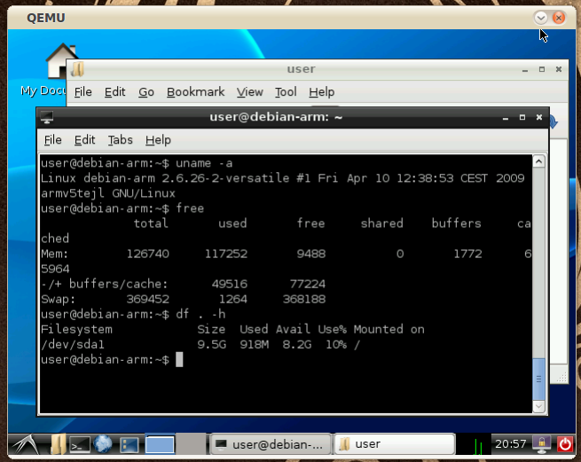

# Trying Debian for ARM on QEMU

Many Linux developers in these years are working on porting Linux software on ARM architectures. Debian in particular offers the full distribution to be installed on supported devices, and I wanted to try it out. There are already images prepared for the Versatile platform (thanks to Aurélien Jarno), and with them it is possible to try Debian for ARM without owning an ARM platform, using QEMU.

The “qemu-system-arm” program must be installed. In Debian it is under the “qemu” package, in Ubuntu it is under the “qemu-kvm-extras” package.
I ran the following commands to download the ARM images and run the simulator:

```
$ wget http://people.debian.org/~aurel32/qemu/arm/debian_lenny_arm_small.qcow2
$ wget http://people.debian.org/~aurel32/qemu/arm/initrd.img-2.6.26-2-versatile
$ wget http://people.debian.org/~aurel32/qemu/arm/vmlinuz-2.6.26-2-versatile


$ qemu-system-arm -m 128M -M versatilepb -kernel vmlinuz-2.6.26-2-versatile -initrd
initrd.img-2.6.26-2-versatile -hda debian_lenny_arm_small.qcow2 -append "root=/dev/sda1"
```
The system slowly boots inside QEMU, and then a prompt appears; the root password is simply “root“. The system is already configured to be connected to the net, so it is really easy to install packages. I wanted to see a full blown graphical environment running, and LXDE is a good compromise between lightweight and functionality. I ran the following commands, and they worked for about an hour:

```
# aptitude update
# aptitude safe-upgrade
# aptitude install lxde```

LXDE depends on X server, but the X environment is not configured to run immediately. I found here a solution that involves simply editing “/etc/X11/xorg.conf“, using an editor such as “vim” or “nano” that are already installed on the basic system. The X server must be told to use the framebuffer device, so a line must be added in the “Device” section:

```
...
Section "Device"
...
Driver "fbdev"
EndSection
...```

Then to start the graphic environment the ARM system can be rebooted, or simply the following command can be run:

```
# invoke-rc.d gdm start```

The graphical login appears. The downloaded image already comes with an active user (username: “user“, password: “user“) that can log in and use the desktop. Once the environment is up, running the “free” command shows that around 100MiB are used, and the “df” command reports around 900MB of used disk space.




