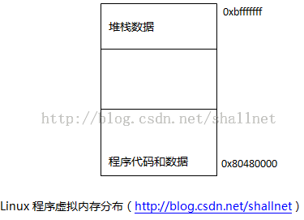
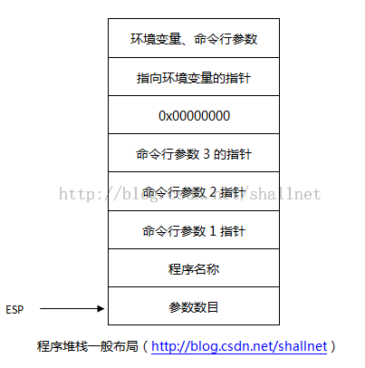

# 使用命令行参数

在高级语言中，程序在命令行上启动时常常带一个或多个参数，在汇编语言中也可以实现这一特性。在实现这一特性之前，我们先了解一下linux如何从命令行执行程序。

每一个应用程序开始执行时，系统都会为该程序分配一块内存区域，并且每个程序都分配相同的虚拟内存地址。虚拟内存地址由操作系统映射到物理内存地址。在Linux中，程序的虚拟内存地址是从0x80480000开始，到地址0xbfffffff结束。linux操作系统按照专门的格式把程序放在虚拟内存地址中。如下图：



内存区域第一块区域包含汇编程序的bss段和data段。第二块区域是程序堆栈，之前讲过，堆栈从内存区域的最后向下增长。程序每次启动时，堆栈指针并非设置为0xbfffffff，在加载程序之前，linux会把命令行参数等一些内容放在这里。程序启动时，linux会把4种信息存放到程序堆栈中：命令行参数的数目、程序的名称、命令行包含的命令行参数、程序启动时所有当前linux环境变量。程序启动时，堆栈的一般布局如下图：



既然已经了解了命令行参数位于堆栈中什么位置，现在来编写简单的程序访问它们。下面示例在调试中运行可以查看所有的命令行参数值，所有的命令行参数在堆栈中存储为字符串值。
```
# arg.s
.section .text
.globl _start
_start:
    nop
    movl $1, %eax
    movl $0, %ebx
    int $0x80
```
在调试器中运行该程序如下：
```
(gdb) r 100 101 102            #运行时带入三个参数
Starting program: /home/allen/as/i_arg/arg 100 101 102

Breakpoint 1, _start () at arg.s:5
5    nop
(gdb) s
6    movl $1, %eax
(gdb) print $esp    #打印堆栈栈顶地址
$1 = (void *) 0xbffff3d0
(gdb) x/20x 0xbffff3d0 #查看堆栈向上20个地址的数据，其中第一个数据为命令行参数的个数，后
紧接着	0xbffff566 0xbffff57f 0xbffff583 0xbffff587为命令行参数的参数的地址(gdb) r 100 101 102
0xbffff3d0: 0x00000004 0xbffff566 0xbffff57f 0xbffff583
0xbffff3e0: 0xbffff587 0x00000000 0xbffff58b 0xbffff5ac
0xbffff3f0: 0xbffff5cb 0xbffff5ec 0xbffff5fc 0xbffff607
0xbffff400: 0xbffff615 0xbffff666 0xbffff6a0 0xbffff6b2
0xbffff410: 0xbffff6c8 0xbffff6e6 0xbffff6fd 0xbffff708
(gdb) x/d ($esp)
0xbffff3d0: 4
(gdb) x/s 0xbffff566    # 参数为程序名称
0xbffff566: "/home/allen/as/i_arg/arg"
(gdb) x/s 0xbffff57f    #查看第一个参数内存地址内的内容
0xbffff57f: "100"
(gdb) x/s 0xbffff583         #查看第二个参数内存地址内的内容
0xbffff583: "101"
(gdb) x/s 0xbffff587         #查看第三个参数内存地址内的内容
0xbffff587: "102"
(gdb)
```

要注意参数永远都不会为0，因为程序名称也算一个参数。在命令行参数之后，4字节的空值被存放到堆栈中，其用来将参数指针和指向环境变量的指针分隔开来。
