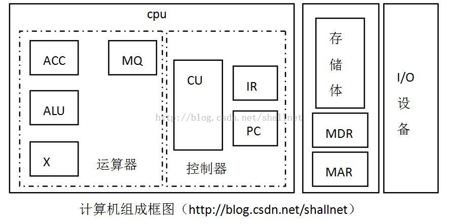

# 现代计算机结构组成与工作过程

【版权声明：尊重原创，转载请保留出处：blog.csdn.net/shallnet，文章仅供学习交流，请勿用于商业用途】
        现代计算机计算过程通常是把用户书写并送入计算机内的高级语言程序翻译成机器能识别的语言程序，再通过机器自动运行该语言程序计算出结果并输出。
        但在早期没有高级语言的时候，用户是直接编写机器语言，直接在机器执行。向编写这种只由0、1构成的二进制代码，对程序员的要求非常高，需要熟悉其所使用计算机的硬件机器和指令系统，这样编写程序难度很大，并且操作过程复杂易出错。
        到了20世纪50年代出现了符号式的程序语言，也就是汇编语言，汇编语言不再使用繁杂易出错的二进制0、1来编写程序，而是而是使用如ADD、SUB、MUL、DIV等分别表示加减乘除的操作，并且指令或储存地址也使用符号表示。使用汇编语言在机器上运行时还是需要先将其翻译成机器语言，机器只能识别机器语言，除机器语言以外的语言都不能识别，将汇编语言翻译成机器语言是由机器系统软件中的程序来完成。尽管汇编语言使用户编程变得方便了，但使用汇编语言编程仍然需要程序猿对机器的指令系统是否熟悉，并且每种机器都是一种汇编语言与其对应，不同种类的机器汇编语言不一样，这样使得程序员需要掌握不同机器的指令系统，不便于计算机的广泛应用。
        到了60年代以后出现了高级语言，高级语言具有很高的通用性，程序员只需要掌握高级语言的语法就可以编程了，不需要掌握机器的种类类型，组成或指令系统。计算机仍然不能直接识别高级语言，高级语言程序在运行之前需要先转换成汇编语言，汇编语言再转化成机器语言，之后机器才能识别并运行程序。

计算机体系结构
        一台计算机有一种体系结构，体系结构确定计算机硬件和软件的之间的衔接，着重于中央处理器内部的运行动作与存储器的访问。以常见的冯·诺伊曼计算机的设计为例，体系结构设计包括了：
指令集架构(Instruction set architecture；简称 ISA)：被视为一种机器语言，包含了许多相关的指令集(存储器寻址、处理器控制，暂存器控制等等...)。
微体系结构/微架构(Microarchitecture)或称计算机组织(Computer organization)：是更详细的叙述系统内部各元素如何进行合作与沟通。
数据表示，即硬件能直接识别和处理的数据类型和数据格式；
寻址方式，包括最小寻址单位和地址运算等；
寄存器定义，包括操作数寄存器、变址寄存器、控制寄存器等的定义、数量和使用方式；
指令系统，包括机器指令的操作类型和格式、指令间的排序和控制机制等；
异常机制，包括中断、NMI和内部异常等；
机器工作状态的定义和切换，如管态和目态等；
输入输出结构，包括处理机、存储器与输入输出设备之间的连接方式、数据传送方式、数据流量、以及数据交换过程的控制等；
现代计算机的组成
        现代计算机由运算器、存储器、控制器、I/O设备组成。运算器用来完成算术运算和逻辑运算，并将运算中间结果，暂存在运算器内；存储器用来存放数据和程序；控制器用来控制、指挥程序和数据的输入、运行以及处理运算结果；I/O设备分别用来实现程序数据的输入和计算结果的输出。
        运算器和控制器在逻辑关系和电路结构上联系十分紧密，这两个部件往往集成在同一芯片上，通常将它们合起来统称为中央处理器，即CPU。所以现代计算机通常有三部分构成：CPU、存储器、I/O设备。

主存的工作方式是按照存储单元地址号来对各存储位进行读、写。这种存取方式称为按地址访问存储器。存储器这种工作性质对计算机组成和操作十分有利，人民只需要事先将编好的程序按顺序存入主存各单元，当运行程序时，先给出程序在主存首地址，然后采用程序计数加一的方法，自动形成下一条指令所在存储单元地址，机器便可自动完成这个程序操作。主存中需要配置两个寄存器MAR和MDR，MAR用来存放将要访问存储单元地址，MDR是存储器数据寄存器，用来存放从某个存储器单元中取出的数据和将要写入某个存储单元的数据，具体的取出读写动作还需要CPU增加控制信号。
        运算器至少包括3个寄存器和一个算术逻辑单元（ALU）。ACC为累加寄存器，MQ为乘商寄存器，X为操作数寄存器。
        控制器是计算机的神经中枢，由他指挥各个部件自动、协调地工作。控制器由程序计数器（PC）、指令寄存器（IR）以及控制单元组成。PC存放当前欲执行的指令地址，它与主存的MAR之间有一条直接通路，且具有自动加一的功能，即可自动形成下一条指令的地址。IR用来存放当前当前指令，IR内容来自主存MDR。IR中的操作码送至CU，用来分析指令，其地址码作为操作数送至存储器的MAR，控制单元CU用来分析当前指令所需完成的操作，迸发出各种为操作命令序列，用以控制所有被控对象。完成一条指令操作需要三个阶段：控制器首先要命令存储器读出一条命令，称为取指阶段。然后对这条指令进行分析，指出该命令要完成什么样的操作，并按寻址特征指明操作数的地址，称为分析阶段。最后根据操作数所在地址以及指令的操作码完成某种操作，称为执行阶段。
        I/O子系统包括各种I/O设备及其相应接口，每种IO设备接受CU发出的各种控制命令，被完成相应操作。

下面来理解计算机的工作全过程：

首先通过键盘将N条指令数据输入到主存第0-N号单元中，PC初始值置0（程序首地址）。启动机器后，计算机自动按存储器中所放指令顺序逐条完成取指、分析指令、执行指令，直到执行最后一条指令为止。

第一条指令执行：启动机器后，控制器立即将PC的内容送至主存MAR（PC—> MAR），并命令存储器做读操作，此刻主存0号单元内容便送入MDR内，然后又MDR送至控制器IR（MDR—>IR），完成了一条指令的取指过程。 经过CU分析（OP(IR)—>CU），得出操作码，如果为取数指令，于是CU将IR中地址码送至MAR（Ad(IP)—>MAR），并命令存储器做读操作，将该地址单元中的操作数送至MDR中，再由MDR送至运算器的ACC（MDR—>ACC），完成此命令的执行过程，第一条取数命令的全过程。同时PC完成自动加一操作，形成下一条操作指令的地址，即1号地址。
第二条指令：同第一条指令，PC将第二条指令地址送至MAR，命令存储器做读操作，将1号单元内容送至MDR，又有MDR送至IR，接着CU分析操作码，如果为乘法指令，CU向存储器发读命令，取出IR中对应地址单元中的操作数，经MDR送至运算器MQ，CU再向运算器发送乘法操作命令，完成乘法运算，并把结果存放在ACC中。同时PC又完成一次PC加一的操作。
第三、四......条指令：以此类推，逐条取指分析执行，直至最后得出结果。
