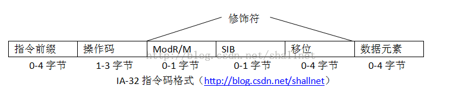
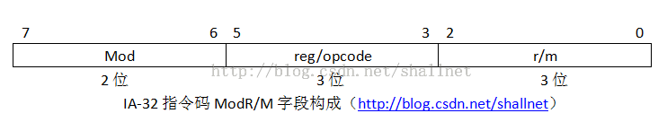
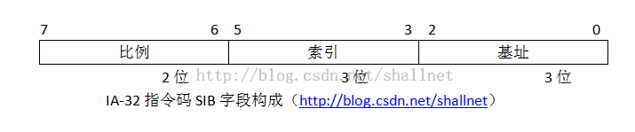
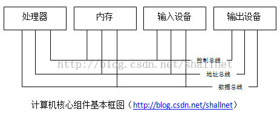

# 處理器指令碼及IA-32平臺瞭解

版權聲明：尊重原創，轉載請保留出處：blog.csdn.net/shallnet，文章僅供學習交流，請勿用於商業用途】
        在計算機操作的最底層，所有計算機處理器都按照製造廠商在處理器內部定義的二進制代碼來操作數據，這些代碼定義了處理器應該利用程序員提供的數據完成相應的功能，這些預置的代碼被稱為指令碼。不同類型的處理器的指令碼是不一樣的，但處理指令碼的方式是類似的。

當計算機處理器芯片運行時，他會讀取存儲在內存中的指令碼，每個指令碼包含不同長度字節的信息，這些信息指示處理器完成特定任務。每條指令碼都是從內存讀取，指令所需的操作數據也是從內存讀取。

每條指令都必須包含至少一個字節的操作碼，操作碼定義處理器應該完成什麼樣的操作。每個處理器都有自己定義好的操作碼。

Intel IA-32系列微處理器使用專門格式的指令碼，瞭解一下這些指令格式對彙編語言程序設計會有所幫助。IA-32指令碼格式有四個主要部分構成：
- 可選指令前綴
- 操作碼
- 可選修飾符
- 可選數據元素
下圖為IA-32指令碼格式的佈局。

如上圖所示，IA-32指令格式中唯一必須的部分是操作碼。每個指令碼都必須包含操作碼，其定義了指令執行的基本任務。

指令前綴可以包含0-4個修改操作碼行為的1字節前綴。按照前綴功能，這些前綴被分成四個組，修改操作碼時，每個組的前綴一次只能使用一個（最多4個）。四個前綴如下：
鎖定前綴和重複前綴
段覆蓋前綴和分支提示前綴
操作數長度覆蓋前綴
地址長度覆蓋前綴

一些操作碼需要另外的修飾符來定義執行功能中涉及到的寄存器和內存地址。修飾符包含三部分：
（ModR/M）尋址方式字節
SIB（比例索引基址）字節
1、2或4個地址移位字節
ModR/M字節由三個字段的信息構成。如下圖：

mod字段和r/m字段一起使用，用於定義指令使用的寄存器或尋址模式。
reg/opcode用於允許使用更多的三位進一步定義操作碼功能，或用於定義寄存器的值。
SIB字段也由3個字段的信息構成。如下圖

比例字段指定操作的比例因素，索引字段指定內存訪問中用作索引寄存器的寄存器，基址字段指定用作內存訪問的基址寄存器的寄存器。

地址移位字節用來指定對於ModR/M和SIB字節中定義的內存位置位置的偏移量。
數據元素在指令碼的最後部分，一些指令碼從內存位置或處理器寄存器讀取數據，而一些指令碼在其指令本身之內就有包含數據。

可以看到，使用處理器的指令碼進行程序設計是十分困難的，所以才有了後面的高級語言。但處理器根本不知道如何處理高級語言，必須通過某種機制把高級語言代碼轉換為處理器能夠處理的指令碼才能處理。

使用匯編語言程序設計必須要先了解處理器環境，不同類型的處理器的指令碼是不一樣的。我們將以AI-32平臺為例來講述彙編語言。

雖然不同處理器系列結合了不同的指令集合和功能，但大多數處理器都使用了相同的核心組件集合。計算機一般包含如下四個組件：

處理器包含控制計算機操作的硬件和指令碼，其通過3個單獨的總線：控制總線、地址總線、數據總線，處理器被連接到計算機的其他元素（內存存儲單元、輸入設備和輸出設備）。處理器由很多組件構成，在處理器處理數據的過程中，每個組件都有其作用，彙編語言程序有訪問和控制所有這些組件的能力，所以瞭解這些組件很重要。處理器主要組件如下：

- 控制單元
- 執行單元
- 寄存器
- 標誌

控制單元是處理器的中心，控制單元的主要作用時控制處理器在何時做何種操作。控制單元實現4個基本功能：
- 從內存獲得指令。
- 對指令進行分析以便進行操作。
- 從內存獲得所需結果。
- 有必要則存儲結果。

執行單元負責執行處理器指令。執行單元由一個或多個算術邏輯單元構成（ALU）。
寄存器用於解決處理器從內存讀取數據時需要等待的問題。在處理器訪問數據元素時，請求被髮送到處理器外部，通過控制總線進入存儲單元，執行該過程時處理器處於等待狀態。而寄存器能夠存儲要處理的數據元素，而無需訪問內存單元。但是處理器芯片中內置的寄存器數量是有限的。IA-32平臺具有不同長度的多組寄存器。通用寄存器用於臨時存儲數據；段寄存器用於引用內存位置；指令指針寄存器，又稱為程序計數器（PC），跟蹤要執行的下一條指令碼；控制寄存器用於確定處理器的操作模式。

通用寄存器及其用處描述如下表：

<ul style="margin-top:0px; margin-bottom:0px; background-color:inherit">
<li style="background-color:inherit">控制單元</li><li style="background-color:inherit">執行單元</li><li style="background-color:inherit">寄存器</li><li style="background-color:inherit">標誌</li></ul>

&nbsp; &nbsp; &nbsp; &nbsp; 控制單元是處理器的中心，控制單元的主要作用時控制處理器在何時做何種操作。控制單元實現4個基本功能：

<ol style="margin-top:0px; margin-bottom:0px; background-color:inherit">
<li style="background-color:inherit">從內存獲得指令。</li><li style="background-color:inherit">對指令進行分析以便進行操作。</li><li style="background-color:inherit">從內存獲得所需結果。</li><li style="background-color:inherit">有必要則存儲結果。</li></ol>

&nbsp; &nbsp; &nbsp; &nbsp; 執行單元負責執行處理器指令。執行單元由一個或多個算術邏輯單元構成（ALU）。

&nbsp; &nbsp; &nbsp; &nbsp; 寄存器用於解決處理器從內存讀取數據時需要等待的問題。在處理器訪問數據元素時，請求被髮送到處理器外部，通過控制總線進入存儲單元，執行該過程時處理器處於等待狀態。而寄存器能夠存儲要處理的數據元素，而無需訪問內存單元。但是處理器芯片中內置的寄存器數量是有限的。IA-32平臺具有不同長度的多組寄存器。通用寄存器用於臨時存儲數據；段寄存器用於引用內存位置；指令指針寄存器，又稱為程序計數器（PC），跟蹤要執行的下一條指令碼；控制寄存器用於確定處理器的操作模式。

&nbsp; &nbsp; &nbsp; &nbsp; 通用寄存器及其用處描述如下表：

<table border="1" cellpadding="2" cellspacing="0" style="border-collapse:collapse; margin-top:10px; margin-bottom:10px; display:table; background-color:inherit">
<tbody style="background-color:inherit">
<tr style="background-color:inherit">
<td valign="top" style="word-break:break-all; border:1px solid rgb(153,153,153); padding:5px 16px 5px 12px; min-height:25px; min-width:25px; height:25px; background-color:inherit; width:279px">

EAX

</td>
<td valign="top" style="word-break:break-all; border:1px solid rgb(153,153,153); padding:5px 16px 5px 12px; min-height:25px; min-width:25px; height:25px; background-color:inherit; width:279px">

用於操作數和結果數據的累加器

</td>
</tr>
<tr style="background-color:inherit">
<td valign="top" style="word-break:break-all; border:1px solid rgb(153,153,153); padding:5px 16px 5px 12px; min-height:25px; min-width:25px; height:25px; background-color:inherit; width:279px">

EBX

</td>
<td valign="top" style="word-break:break-all; border:1px solid rgb(153,153,153); padding:5px 16px 5px 12px; min-height:25px; min-width:25px; height:25px; background-color:inherit; width:279px">

指向數據內存段中的數據指針

</td>
</tr>
<tr style="background-color:inherit">
<td valign="top" style="word-break:break-all; border:1px solid rgb(153,153,153); padding:5px 16px 5px 12px; min-height:25px; min-width:25px; height:25px; background-color:inherit; width:279px">

ECX

</td>
<td valign="top" style="word-break:break-all; border:1px solid rgb(153,153,153); padding:5px 16px 5px 12px; min-height:25px; min-width:25px; height:25px; background-color:inherit; width:279px">

字符串和循環操作的計數器

</td>
</tr>
<tr style="background-color:inherit">
<td valign="top" style="word-break:break-all; border:1px solid rgb(153,153,153); padding:5px 16px 5px 12px; min-height:25px; min-width:25px; height:28px; background-color:inherit; width:279px">

EDX

</td>
<td valign="top" style="word-break:break-all; border:1px solid rgb(153,153,153); padding:5px 16px 5px 12px; min-height:25px; min-width:25px; height:28px; background-color:inherit; width:279px">

I/O指針

</td>
</tr>
<tr style="background-color:inherit">
<td valign="top" style="word-break:break-all; border:1px solid rgb(153,153,153); padding:5px 16px 5px 12px; min-height:25px; min-width:25px; height:25px; background-color:inherit; width:279px">

EDI

</td>
<td valign="top" style="word-break:break-all; border:1px solid rgb(153,153,153); padding:5px 16px 5px 12px; min-height:25px; min-width:25px; height:25px; background-color:inherit; width:279px">

用於字符串操作的目標的數據指針

</td>
</tr>
<tr style="background-color:inherit">
<td valign="top" style="word-break:break-all; border:1px solid rgb(153,153,153); padding:5px 16px 5px 12px; min-height:25px; min-width:25px; height:25px; background-color:inherit; width:279px">

ESI

</td>
<td valign="top" style="word-break:break-all; border:1px solid rgb(153,153,153); padding:5px 16px 5px 12px; min-height:25px; min-width:25px; height:25px; background-color:inherit; width:279px">

用於字符串操作的源的數據指針

</td>
</tr>
<tr style="background-color:inherit">
<td valign="top" style="word-break:break-all; border:1px solid rgb(153,153,153); padding:5px 16px 5px 12px; min-height:25px; min-width:25px; height:25px; background-color:inherit; width:279px">
ESP</td>
<td valign="top" style="word-break:break-all; border:1px solid rgb(153,153,153); padding:5px 16px 5px 12px; min-height:25px; min-width:25px; height:25px; background-color:inherit; width:279px">

堆棧指針

</td>
</tr>
<tr style="background-color:inherit">
<td valign="top" style="word-break:break-all; border:1px solid rgb(153,153,153); padding:5px 16px 5px 12px; min-height:25px; min-width:25px; height:25px; background-color:inherit; width:279px">

EBP

</td>
<td valign="top" style="word-break:break-all; border:1px solid rgb(153,153,153); padding:5px 16px 5px 12px; min-height:25px; min-width:25px; height:25px; background-color:inherit; width:279px">

堆棧數據指針

</td>
</tr>
</tbody>
</table>
段寄存器及其描述：

<table border="1" cellpadding="2" cellspacing="0" style="font-size:undefined; border-collapse:collapse; margin-top:10px; margin-bottom:10px; display:table; background-color:inherit">
<tbody style="background-color:inherit">
<tr style="background-color:inherit">
<td valign="top" style="word-break:break-all; border:1px solid rgb(153,153,153); padding:5px 16px 5px 12px; min-height:25px; min-width:25px; height:25px; background-color:inherit; width:279px">

CS

</td>
<td valign="top" style="word-break:break-all; border:1px solid rgb(153,153,153); padding:5px 16px 5px 12px; min-height:25px; min-width:25px; height:25px; background-color:inherit; width:279px">

代碼段

</td>
</tr>
<tr style="background-color:inherit">
<td valign="top" style="word-break:break-all; border:1px solid rgb(153,153,153); padding:5px 16px 5px 12px; min-height:25px; min-width:25px; height:25px; background-color:inherit; width:279px">

DS

</td>
<td valign="top" style="word-break:break-all; border:1px solid rgb(153,153,153); padding:5px 16px 5px 12px; min-height:25px; min-width:25px; height:25px; background-color:inherit; width:279px">

數據段

</td>
</tr>
<tr style="background-color:inherit">
<td valign="top" style="word-break:break-all; border:1px solid rgb(153,153,153); padding:5px 16px 5px 12px; min-height:25px; min-width:25px; height:25px; background-color:inherit; width:279px">

SS

</td>
<td valign="top" style="word-break:break-all; border:1px solid rgb(153,153,153); padding:5px 16px 5px 12px; min-height:25px; min-width:25px; height:25px; background-color:inherit; width:279px">

堆棧段

</td>
</tr>
<tr style="background-color:inherit">
<td valign="top" style="word-break:break-all; border:1px solid rgb(153,153,153); padding:5px 16px 5px 12px; min-height:25px; min-width:25px; height:25px; background-color:inherit; width:279px">

ES

</td>
<td valign="top" style="word-break:break-all; border:1px solid rgb(153,153,153); padding:5px 16px 5px 12px; min-height:25px; min-width:25px; height:25px; background-color:inherit; width:279px">

附加段指針

</td>
</tr>
<tr style="background-color:inherit">
<td valign="top" style="word-break:break-all; border:1px solid rgb(153,153,153); padding:5px 16px 5px 12px; min-height:25px; min-width:25px; height:25px; background-color:inherit; width:279px">

FS

</td>
<td valign="top" style="word-break:break-all; border:1px solid rgb(153,153,153); padding:5px 16px 5px 12px; min-height:25px; min-width:25px; height:25px; background-color:inherit; width:279px">

附加段指針

</td>
</tr>
<tr style="background-color:inherit">
<td valign="top" style="word-break:break-all; border:1px solid rgb(153,153,153); padding:5px 16px 5px 12px; min-height:25px; min-width:25px; height:25px; background-color:inherit; width:279px">

GS

</td>
<td valign="top" style="word-break:break-all; border:1px solid rgb(153,153,153); padding:5px 16px 5px 12px; min-height:25px; min-width:25px; height:25px; background-color:inherit; width:279px">

附加段指針

</td>
</tr>
</tbody>
</table>

&nbsp; &nbsp; &nbsp; &nbsp; 處理器標誌確定處理器實現的每個操作是否成功。

