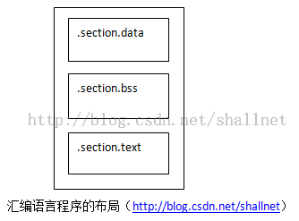

# 1614

【版權聲明：尊重原創，轉載請保留出處：blog.csdn.net/shallnet，文章僅供學習交流，請勿用於商業用途】

彙編語言程序由定義好的段構成，每個段有各自的目的。三個最常用的的段如下：數據段、bss段、文本段。文本段是可執行程序內聲明指令碼的地方，所有彙編程序都必須有文本段，數據段和bss段是可選的，但是在程序中經常使用。數據段聲明帶有初始值的變量，bss段聲明使用0值初始化的數據元素，這些元素常用作彙編程序的緩衝區。下圖為彙編語言程序的佈局。




GNU彙編器使用.section命令語句聲明段。.section語句只有一個參數——段類型。上圖的佈局是彙編程序安排段的一般方式。bss段總是在文本段之前，數據段可以在文本段之後，但將其放在前面更容易閱讀和理解。

如其它高級語言一樣，彙編語言程序在鏈接為可執行程序時，鏈接器必須要知道程序中的起點是什麼，就像c語言中的main函數一樣。GNU彙編器使用一個默認標籤_start作為應用程序的入口點，如果鏈接器找不到這個標籤就會生成錯誤消息。如果編寫被外部彙編語言或C語言程序使用的一組工具，需要使用.globl命令聲明每個函數段標籤，.globl命令是聲明外部程序可以訪問的程序標籤。所以，一般編寫彙編語言的基礎模板是這樣的：

```
.section.data
    <此處為初始化變量>
.section.bss
    <此處為未初始化的變量>
.section.text
.globl _start
_start:
    <此處為指令碼>

```
有了模板之後就可以開始創建彙編語言程序，我們也像學習高級語言一樣，從最簡單的程序開始。

編寫彙編語言主要工作在編寫.text部分，該部分主要編寫要實現應用程序的指令碼。彙編語言允許程序員使用助記符表示指令碼，助記符使程序員可以使用英語樣式的詞表示各個指令碼，彙編器可以很容易地把彙編語言助記符轉換為原始指令碼。這樣使得彙編程序員不必瞭解指令碼每個字節表示什麼，子需要使用更加容易記憶的助記符（如push、mov、sub、call）來表示指令碼。比如下面這個指令碼例子：

```
55
89 E5
83 EC 08
C7 45 FC 01 00 00 00
83 EC 0C
6A 00
E8 D1 FE FF FF
```
可以寫為如下的彙編代碼:
```
push %ebp
mov  %esp, %ebp
sub  $0x8, %esp
movl $0x1, -4(%ebp)
sub  $0xc, %esp
push $0x0
call 8048348
```

- 數據段
    - 和高級語言一樣，編寫彙編語言程序都需要管理某種類型的變量，在彙編語言中數據段和bss段都提供了定義變量的方法。數據段是最常見的定義變量的位置。
        在數據段中定義變量需要兩個語句：一個符號、一個命令。
        符號類似於C語言程序中變量的名稱，它只是彙編器試圖訪問內存位置時用作引用指針的一個位置。


命令實現為符號引用的數據元素保留多少字節，類似於高級語言指定數據類型。彙編語言使用如下的命令：.ascii、.asciz、.byte、.double、.float、.int、.long、.octa、.quad、.short、.single。例如定義變量如下：

```
.section .data
msg:
    .ascii “This is a test message”
```


數據段主要用於定義變量數據，不過也可以使用命令.equ定義靜態數據符號，類似於高級語言的定義常量。例如：
```
.equ var 3
```
引用靜態數據時，需要在變量名稱前加$符號，比如把var的值傳送到EAX寄存器：
```
movl $var， %eax
```
- bss段
    - 在bss段中定義數據元素和在數據段中定義有些不同，不需要指定特定數據類型。

GNU彙編器使用兩個命令聲明緩衝區，.comm命令聲明未初始化的數據的通用內存區域；.lcomm命令聲明未初始化的數據本地通用內存區域，該區域不允許從本地彙編代碼之外進行訪問。其使用格式為：
```
.comm symbol, length
```
symbol是賦給內存區域的符號，length是內存區域中包含的字節數量。

在bss段中聲明數據的一個好處是數據不包含在可執行程序中，在數據段中定義數據必須包含在可執行程序中。

下面來看看彙編語言的hello world 程序：

```
#hello.s sample program to print hello world information
.section .data    #數據段聲明
msg:
    .ascii "hello world!\n"    #要輸出的字符串
    len=.-msg                        #字符串長度

.section .text    #代碼段聲明
# .global main
# main:
.global _start     #指定入口函數

_start:                                 #函數在屏幕上輸出hello world!
movl $len, %edx               #第三個參數： 字符串長度
movl $msg, %ecx             #第二個參數： hello world!字符串
movl $1, %ebx                  #第一個參數： 輸出文件描述符
movl $4, %eax                  #系統調用號sys_write
int $0x80                            #調用內核功能

#下面為退出程序代碼
movl $0, %ebx                #第一個參數： 退出返回碼
movl $1, %eax                #系統調用sys_exit
int $0x80                        #調用內核功能
```

編譯執行結果如下：
```
$ as -o hello.o hello.s
$ ld -o hello hello.o
$ ./hello hello world!$
```

Linux 下的系統調用是通過中斷（int 0x80）來實現的。在執行 int 0X80 指令時，寄存器 eax 中存放的是系統調用號，而傳給系統調用的參數則必須按順序放到寄存器 ebx，ecx，edx，esi，edi 中，當系統調用完成之後，返回值可以在寄存器 eax 中獲得。系統調用號4對應的函數調用是
sys_write，在應用上其函數定義如下：
ssize_t write(int fd, const void *buf, size_t count);
參數 fd、buf 和 count 分別存在寄存器 ebx、ecx 和 edx 中，而系統調用號 SYS_write 則放在寄存器 eax 中，當 int 0x80 指令執行完畢後，返回值可以從寄存器 eax 中獲得。

注意，如果使用gcc編譯的話有一個問題，gcc查找main標籤而不是_start標籤，所以把程序中的_start改為main直接使用gcc編譯鏈接就沒有問題了。

