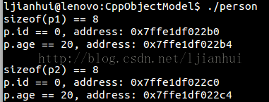
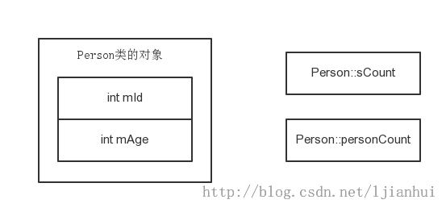
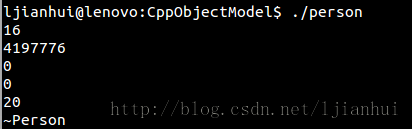
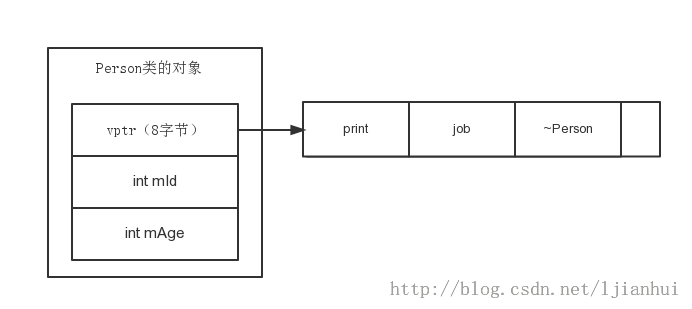
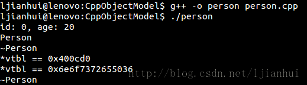
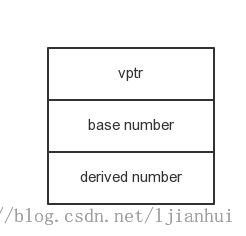
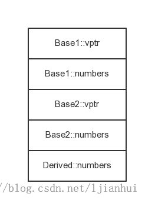
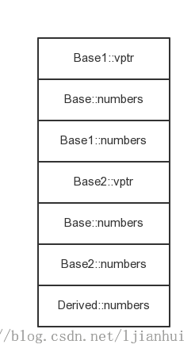
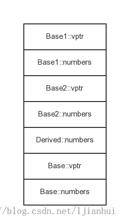

#  C++對象模型之簡述C++對象的內存佈局

http://blog.csdn.net/ljianhui/article/details/45903939

在C++中，有兩種類的成員變量：static和非static，有三種成員函數：static、非static和virtual。那麼，它們如何影響C++的對象在內存中的分佈呢？ 當存在繼承的情況下，其內存分佈又是如何呢？

下面就一個非常簡單的類，通過逐漸向其中加入各種成員，來逐一分析上述兩種成員變量及三種成員函數對類的對象的內存分佈的影響。

注：以下的代碼的測試結果均是基於Ubuntu 14.04 64位系統下的G++ 4.8.2，若在其他的系統上或使用其他的編譯器，可能會運行出不同的結果。

### 1、含有static成員變量及成員函數的類的對象的內存分佈
類Persion的定義如下：
```cpp
class Person
{
    public:
        Person():mId(0), mAge(20){}
        void print()
        {
            cout << "id: " << mId
                 << ", age: " << mAge << endl;
        }
    private:
        int mId;
        int mAge;
};
```
Person類包含兩個非static的int型的成員變量，一個構造函數和一個非static成員函數。為弄清楚該類的對象的內存分佈，對該類的對象進行一些操作如下：
```cpp
int main()
{
    Person p1;
    cout << "sizeof(p1) == " << sizeof(p1) << endl;
    int *p = (int*)&p1;
    cout << "p.id == " << *p << ", address: "  << p << endl;
    ++p;
    cout << "p.age == " << *p << ", address: " << p << endl;
    cout << endl;

    Person p2;
    cout << "sizeof(p2) == " << sizeof(p1) << endl;
    p = (int*)&p2;
    cout << "p.id == " << *p << ", address: " << p << endl;
    ++p;
    cout << "p.age == " << *p << ", address: " << p << endl;
    return 0;
}
```

其運行結果如下：


從上圖可以看到類的對象的佔用的內存均為8字節，使用普通的int＊指針可以遍歷輸出對象內的非static成員變量的值，且兩個對象中的相同的非static成員變量的地址各不相同。

據此，可以得出結論，在C++中，非static成員變量被放置於每一個類對象中，非static成員函數放在類的對象之外，且非static成員變量在內存中的存放順序與其在類內的聲明順序一致。即person對象的內存分佈如下圖所示：



### 2、含有static和非static成員變量和成員函數的類的對象的內存分佈

向Person類中加入一個static成員變量和一個static成員函數，如下：
```cpp
class Person
{
     public:
         Person():mId(0), mAge(20){ ++sCount; }
         ~Person(){ --sCount; }
         void print()
         {
             cout << "id: " << mId
                  << ", age: " << mAge << endl;
         }
         static int personCount()
         {
             return sCount;
         }
     private:
         static int sCount;
         int mId;
         int mAge;
};
```

測試代碼不變，與第1節中的代碼相同。其運行結果不變，與第1節中的運行結果相同。

據此，可以得出：static成員變量存放在類的對象之外，static成員函數也放在類的對象之外。

其內存分佈如下圖所示：


###3、加入virtual成員函數的類的對象的內存分佈

在Person類中加入一個virtual函數，並把前面的print函數修改為函數，如下：
```cpp
class Person
{
    public:
        Person():mId(0), mAge(20){ ++sCount; }
        static int personCount()
        {
            return sCount;
        }

        virtual void print()
        {
            cout << "id: " << mId
                 << ", age: " << mAge << endl;
        }
        virtual void job()
        {
            cout << "Person" << endl;
        }
        virtual ~Person()
        {
            --sCount;
            cout << "~Person" << endl;
        }

    protected:
        static int sCount;
        int mId;
        int mAge;
};
```
為了查看類的對象的內存分佈，對類的對象執行如下的操作代碼，如下：
```cpp
int main()
{
    Person person;
    cout << sizeof(person) << endl;
    int *p = (int*)&person;
    for (int i = 0; i < sizeof(person) / sizeof(int); ++i, ++p)
    {
        cout << *p << endl;
    }
    return 0;
}
```

其運行結果如下：




從上圖可以看出，加virtual成員函數後，類的對象的大小為16字節，增加了8。通過int＊指針遍歷該對象的內存，可以看到，最後兩行顯示的是成員數據的值。

C++中的虛函數是通過虛函數表（vtbl）來實現，每一個類為每一個virtual函數產生一個指針，放在表格中，這個表格就是虛函數表。每一個類對象會被安插一個指針（vptr），指向該類的虛函數表。vptr的設定和重置都由每一個類的構造函數、析構函數和複製賦值運算符自動完成。

由於本人的系統是64位的系統，一個指針的大小為8字節，所以可以推出，在本人的環境中，類的對象的安插的vptr放在該對象所佔內存的最前面。其內存分佈圖如下：
注：虛函數的順序是按虛函數定義順序定義的，但是它還包含其他的一些字段，本人還未明白它是什麼，在下一節會詳細說明虛函數表的內容。



4、虛函數表（vtbl）的內容及函數指針存放順序
在第3節中，我們可以知道了指向虛函數表的指針（vptr）在類中的位置了，而函數表中的數據都是函數指針，於是便可利用這點來遍歷虛函數表，並測試出虛函數表中的內容。

測試代碼如下：
```cpp
typedef void (*FuncPtr)();
int main()
{
    Person person;
    int **vtbl = (int**)*(int**)&person;
    for (int i = 0; i < 3 && *vtbl != NULL; ++i)
    {
        FuncPtr func = (FuncPtr)*vtbl;
        func();
        ++vtbl;
    }

    while (*vtbl)
    {
        cout << "*vtbl == " << *vtbl << endl;
        ++vtbl;
    }
    return 0;
}
```
代碼解釋：
由於虛函數表位於對象的首位置上，且虛函數表保存的是函數的指針，若把虛函數表當作一個數組，則要指向該數組需要一個雙指針。我們可以通過如下方式獲取Person類的對象的地址，並轉化成int**指針：
```cpp
Person person;
int **p = (int**)&person;
```
再通過如下的表達式，獲取虛函數表的地址：
```cpp
int **vtbl = (int**)*p;
```
然後，通過如下語句獲得虛函數表中函數的地址，並調用函數。
```cpp
FuncPtr func = (FuncPtr)*vtbl;
func();
```
最後，通過++vtbl可以得到函數表中下一項地址，從而遍歷整個虛函數表。

其運行結果如下圖所示：



從上圖可以看出，遍歷虛函數表，並根據虛函數表中的函數地址調用函數，它先調用print函數，再調用job函數，最後調用析構函數。函數的調用順序與Person類中的虛函數的定義順序一致，其內存分佈與第3節中的對象內存分佈圖相一致。從代碼和運行結果，可以看出，虛函數表以NULL標誌表的結束。但是虛函數表中還含有其他的數據，本人還沒有清楚其作用。

###5、繼承對於類的對象的內存分佈的影響
本文並不打算詳細地介紹繼承對對象的內存分佈的影響，也不介紹虛函數的實現機制。這裡主要給出一個經過本人測試的大概的對象內存模型，由於代碼較多，不一一貼出。假設所有的類都有非static的成員變量和成員函數、static的成員變量及成員函數和virtual函數。
### 1）單繼承（只有一個父類）
類的繼承關係為：class Derived : public Base




Derived類的對象的內存佈局為：虛函數表指針、Base類的非static成員變量、Derived類的非static成員變量。

###2）多重繼承（多個父類）
類的繼承關係如下：class Derived : public Base1, public Base2



Derived類的對象的內存佈局為：基類Base1子對象和基類Base2子對象及Derived類的非static成員變量組成。基類子對象包括其虛函數表指針和其非static的成員變量。

###3）重複繼承（繼承的多個父類中其父類有相同的超類）
類的繼承關係如下：
class Base1 : public Base
class Base2:  public Base
class Derived : public Base1, public Base2



Derived類的對象的內存佈局與多繼承相似，但是可以看到基類Base的子對象在Derived類的對象的內存中存在一份拷貝。這樣直接使用Derived中基類Base的相關成員時，就會引發歧義，可使用多重虛擬繼承消除之。

###4）多重虛擬繼承（使用virtual方式繼承，為了保證繼承後父類的內存佈局只會存在一份）
類的繼承關係如下：
class Base1 : virtual public Base
class Base2:  virtual public Base
class Derived : public Base1, public Base2



Derived類的對象的內存佈局與重複繼承的類的對象的內存分佈類似，但是基類Base的子對象沒有拷貝一份，在對象的內存中僅存在在一個Base類的子對象。但是它的非static成員變量放置在對象的末尾處。

關於繼承對對象的內存佈局的影響以及虛函數的實現機制的詳細介紹，請參閱——**C++對象模型之詳述C++對象的內存佈局**
