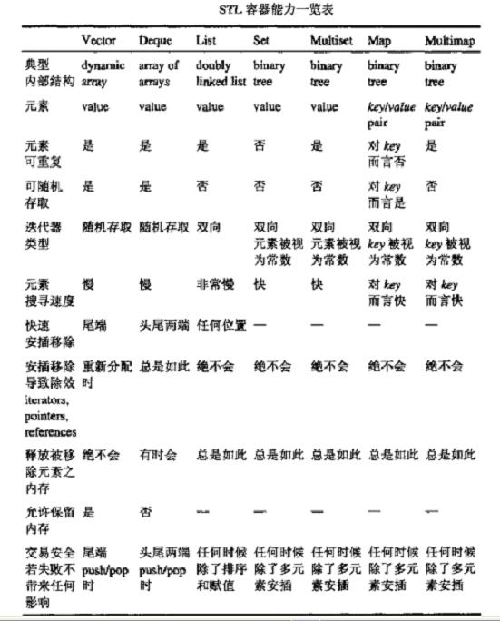

# C++ STL 學習總結(全面)


STL就是Standard Template
Library，標準模板庫。這可能是一個歷史上最令人興奮的工具的最無聊的術語。從根本上說，STL是一些「容器」的集合，這些「容器」有list, vector,set,map等，STL也是算法和其它一些組件的集合。這裡的「容器」和算法的集合指的是世界上很多聰明人很多年的傑作。是C＋＋標準庫的一個重要組成部分，它由Stepanov and Lee等人最先開發，它是與C＋＋幾乎同時開始開發的；一開始STL選擇了Ada作為實現語言，但Ada有點不爭氣，最後他們選擇了C＋＋，C＋＋中已經有了模板。STL又被添加進了C＋＋庫。1996年，惠普公司又免費公開了STL，為STL的推廣做了很大的貢獻。STL提供了類型安全、高效而易用特性的STL無疑是最值得C++程序員驕傲的部分。每一個C＋＋程序員都應該好好學習STL。大體上包括container（容器）、algorithm（算法）和iterator（迭代器），容器和算法通過迭代器可以進行無縫連接。

## 一、基礎知識

### 1、泛型技術


泛型技術的實現方法有多種，比如模板，多態等。模板是編譯時決定，多態是運行時決定，其他的比如RTTI也是運行時確定。多態是依靠虛表在運行時查表實現的。比如一個類擁有虛方法，那麼這個類的實例的內存起始地址就是虛表地址，可以把內存起始地址強制轉換成int*，取得虛表，然後(int*)*(int*)取得虛表裡的第一個函數的內存地址，然後強制轉換成函數類型，即可調用來驗證虛表機制。

泛型編程（generic programming，以下直接以GP稱呼）是一種全新的程序設計思想，和OO，OB，PO這些為人所熟知的程序設計想法不同的是GP抽象度更高，基於GP設計的組件之間偶合度底，沒有繼承關係，所以其組件間的互交性和擴展性都非常高。我們都知道，任何算法都是作用在一種特定的數據結構上的，最簡單的例子就是快速排序算法最根本的實現條件就是所排序的對象是存貯在數組裡面，因為快速排序就是因為要用到數組的隨機存儲特性，即可以在單位時間內交換遠距離的對象，而不只是相臨的兩個對象，而如果用聯表去存儲對象，由於在聯表中取得對象的時間是線性的即O[n]，這樣將使快速排序失去其快速的特點。也就是說，我們在設計一種算法的時候，我們總是先要考慮其應用的數據結構，比如數組查找，聯表查找，樹查找，圖查找其核心都是查找，但因為作用的數據結構不同將有多種不同的表現形式。數據結構和算法之間這樣密切的關係一直是我們以前的認識。泛型設計的根本思想就是想把算法和其作用的數據結構分離，也就是說，我們設計算法的時候並不去考慮我們設計的算法將作用於何種數據結構之上。泛型設計的理想狀態是一個查找算法將可以作用於數組，聯表，樹，圖等各種數據結構之上，變成一個通用的，泛型的算法。

### 2、四種類型轉換操作符

`static_cast` 將一個值以符合邏輯的方式轉換。應用到類的指針上，意思是說它允許子類類型的指針轉換為父類類型的指針（這是一個有效的隱式轉換），同時，也能夠執行相反動作：轉換父類為它的子類。
例如：

```cpp
float x;
Count<(x);//把x作為整型值輸出
```

`dynamic_cast`            將多態類型向下轉換為其實際靜態類型。只用於對象的指針和引用。當用於多態類型時，它允許任意的隱式類型轉換以及相反過程。dynamic_cast會檢查操作是否有效。也就是說，它會檢查轉換是否會返回一個被請求的有效的完整對象。檢測在運行時進行。如果被轉換的指針不是一個被請求的有效完整的對象指針，返回值為NULL.     
例如：

```cpp
class Car;
class Cabriolet: public Car
{
    …
};
class Limousline: public Car
{
    …
};
void f(Car* cp)
{
    Cabriolet* p = dynamic_cast< Cabriolet > cp;
}
```
 
`reinterpret_cast`   轉換一個指針為其它類型的指針。它也允許從一個指針轉換為整數類型。反之亦然。這個操作符能夠在非相關的類型之間轉換。操作結果只是簡單的從一個指針到別的指針的值的二進制拷貝。在類型之間指向的內容不做任何類型的檢查和轉換。
例如：

```cpp
class A {}; 
class B {}; 
A *a = new A; 
B *b = reinterpret_cast(a);
```

`const_cast`一般用於強制消除對象的常量性。
例如：

```cpp
class C {}; 
const C *a = new C; 
C *b = const_cast(a); 
```

其它三種操作符是不能修改一個對象的常量性的。
 
###3、explicit修飾的構造函數不能擔任轉換函數。

在很多情況下，隱式轉換是有意的，並且是正當的。但有時我們不希望進行這種自動的轉換。
例如：為了避免這樣的隱式轉換，應該像下面這樣顯式聲明該帶單一參數的構造函數：

```cpp
class String
{
    int size;
    char* p;
public:        // 不要隱式轉換
    explicit String(int sz);
    String(const char* s, int size n = 0);  // 隱式轉換
};

void f()
{
    String s(10);
    s = 100; // 現在編譯時出錯；需要顯式轉換：
    s = String(100); // 好；顯式轉換
    s = "st";        // 好；此時允許隱式轉換
}
```

 
###4、命名空間namespace
   解決在使用不同模塊和程序庫時，出現名稱衝突問題。
   
###5、C++標準程序庫中的通用工具。

```sh
由類和函數構成。這些工具包括：
數種通用類型
一些重要的C函數
數值極值
```

##二、STL六大組件<br>
容器（Container）<br>
算法（Algorithm）<br>
迭代器（Iterator）<br>
仿函數（Function object）<br>
適配器（Adaptor）<br>
空間配置器（allocator）<br>

###1、容器

作為STL的最主要組成部分－－容器，分為向量（vector），雙端隊列(deque)，表(list)，隊列（queue），堆棧(stack)，集合(set)，多重集合(multiset)，映射(map)，多重映射(multimap)。

<table border="1" cellspacing="0" cellpadding="0" style="color:#333333;font-family:Arial;font-size:14px;line-height:26px;background-color:#FFFFFF;">
	<tbody>
		<tr>
			<td valign="top">
				<p>
					容器
				</p>
			</td>
			<td valign="top">
				<p>
					特性
				</p>
			</td>
			<td valign="top">
				<p>
					所在頭文件
				</p>
			</td>
		</tr>
		<tr>
			<td valign="top">
				<p>
					向量vector
				</p>
			</td>
			<td valign="top">
				<p>
					可以用常數時間訪問和修改任意元素，在序列尾部進行插入和刪除時，具有常數時間複雜度，對任意項的插入和刪除就有的時間複雜度與到末尾的距離成正比，尤其對向量頭的添加和刪除的代價是驚人的高的
				</p>
			</td>
			<td valign="top">
				<p>
					<vector>
				</vector></p>
			</td>
		</tr>
		<tr>
			<td valign="top">
				<p>
					雙端隊列deque
				</p>
			</td>
			<td valign="top">
				<p>
					基本上與向量相同，唯一的不同是，其在序列頭部插入和刪除操作也具有常量時間複雜度
				</p>
			</td>
			<td valign="top">
				<p>
					<deque>
				</deque></p>
			</td>
		</tr>
		<tr>
			<td valign="top">
				<p>
					表list
				</p>
			</td>
			<td valign="top">
				<p>
					對任意元素的訪問與對兩端的距離成正比，但對某個位置上插入和刪除一個項的花費為常數時間。
				</p>
			</td>
			<td valign="top">
				<p>
					<list>
				</list></p>
			</td>
		</tr>
		<tr>
			<td valign="top">
				<p>
					隊列queue
				</p>
			</td>
			<td valign="top">
				<p>
					插入只可以在尾部進行，刪除、檢索和修改只允許從頭部進行。按照先進先出的原則。
				</p>
			</td>
			<td valign="top">
				<p>
					<queue>
				</queue></p>
			</td>
		</tr>
		<tr>
			<td valign="top">
				<p>
					堆棧stack
				</p>
			</td>
			<td valign="top">
				<p>
					堆棧是項的有限序列，並滿足序列中被刪除、檢索和修改的項只能是最近插入序列的項。即按照後進先出的原則
				</p>
			</td>
			<td valign="top">
				<p>
					<stack>
				</stack></p>
			</td>
		</tr>
		<tr>
			<td valign="top">
				<p>
					集合set
				</p>
			</td>
			<td valign="top">
				<p>
					由節點組成的紅黑樹，每個節點都包含著一個元素，節點之間以某種作用於元素對的謂詞排列，沒有兩個不同的元素能夠擁有相同的次序，具有快速查找的功能。但是它是以犧牲插入刪除操作的效率為代價的
				</p>
			</td>
			<td valign="top">
				<p>
					<set>
				</set></p>
			</td>
		</tr>
		<tr>
			<td valign="top">
				<p>
					多重集合multiset
				</p>
			</td>
			<td valign="top">
				<p>
					和集合基本相同，但可以支持重複元素具有快速查找能力
				</p>
			</td>
			<td valign="top">
				<p>
					<set>
				</set></p>
			</td>
		</tr>
		<tr>
			<td valign="top">
				<p>
					映射map
				</p>
			</td>
			<td valign="top">
				<p>
					由{鍵，值}對組成的集合，以某種作用於鍵對上的謂詞排列。具有快速查找能力
				</p>
			</td>
			<td valign="top">
				<p>
					<map>
				</map></p>
			</td>
		</tr>
		<tr>
			<td valign="top">
				<p>
					多重集合multimap
				</p>
			</td>
			<td valign="top">
				<p>
					比起映射，一個鍵可以對應多了值。具有快速查找能力
				</p>
			</td>
			<td valign="top">
				<p>
					<map>
				</map></p>
			</td>
		</tr>
	</tbody>
</table>

STL容器能力表：





###2、算法
算法部分主要由頭文件，和組成。< algorithm>是所有STL頭文件中最大的一個，它是由一大堆模版函數組成的，可以認為每個函數在很大程度上都是獨立的，其中常用到的功能范 圍涉及到比較、交換、查找、遍歷操作、複製、修改、移除、反轉、排序、合併等等。體積很小，只包括幾個在序列上面進行簡單數學運算的模板函數，包括加法和乘法在序列上的一些操作。中則定義了一些模板類，用以聲明函數對象。

STL的算法也是非常優秀的，它們大部分都是類屬的，基本上都用到了C＋＋的模板來實現，這樣，很多相似的函數就不用自己寫了，只要用函數模板就可以了。
我們使用算法的時候，要針對不同的容器，比如：對集合的查找，最好不要用通用函數find（），它對集合使用的時候，性能非常的差，最好用集合自帶的find（）函數，它針對了集合進行了優化，性能非常的高。
 
###3、迭代器
它的具體實現在中，我們完全可以不管迭代器類是怎麼實現的，大多數的時候，把它理解為指針是沒有問題的（指針是迭代器的一個特例，它也屬於迭代器），但是，決不能完全這麼做。


<table border="1" cellspacing="0" cellpadding="0" style="color:#333333;font-family:Arial;font-size:14px;line-height:26px;background-color:#FFFFFF;">
	<tbody>
		<tr>
			<td valign="top" colspan="3">
				<p align="center">
					迭代器功能
				</p>
			</td>
		</tr>
		<tr>
			<td valign="top">
				<p>
					輸入迭代器
				</p>
				<p>
					Input iterator
				</p>
			</td>
			<td valign="top">
				<p>
					向前讀
				</p>
				<p>
					Reads forward
				</p>
			</td>
			<td valign="top">
				<p>
					istream
				</p>
			</td>
		</tr>
		<tr>
			<td valign="top">
				<p>
					輸出迭代器
				</p>
				<p>
					Output iterator
				</p>
			</td>
			<td valign="top">
				<p>
					向前寫
				</p>
				<p>
					Writes forward
				</p>
			</td>
			<td valign="top">
				<p>
					ostream,inserter
				</p>
			</td>
		</tr>
		<tr>
			<td valign="top">
				<p>
					前向迭代器
				</p>
				<p>
					Forward iterator
				</p>
			</td>
			<td valign="top">
				<p>
					向前讀寫
				</p>
				<p>
					Read and Writes forward
				</p>
			</td>
			<td valign="top">
				<p>
					&nbsp;
				</p>
			</td>
		</tr>
		<tr>
			<td valign="top">
				<p>
					雙向迭代器
				</p>
				<p>
					Bidirectional iterator
				</p>
			</td>
			<td valign="top">
				<p>
					向前向後讀寫
				</p>
				<p>
					Read and Writes forward and
				</p>
				<p>
					backward
				</p>
			</td>
			<td valign="top">
				<p>
					list,set,multiset,map,mul
				</p>
				<p>
					timap
				</p>
			</td>
		</tr>
		<tr>
			<td valign="top">
				<p>
					隨機迭代器
				</p>
				<p>
					Random access iterator
				</p>
			</td>
			<td valign="top">
				<p>
					隨機讀寫
				</p>
				<p>
					Read and Write with random
				</p>
				<p>
					access
				</p>
			</td>
			<td valign="top">
				<p>
					vector,deque,array,string
				</p>
			</td>
		</tr>
	</tbody>
</table>


###4、仿函數
仿函數，又或叫做函數對象，是STL六大組件之一；仿函數雖然小，但卻極大的拓展了算法的功能，幾乎所有的算法都有仿函數版本。例如，查找算法find_if就是對find算法的擴展，標準的查找是兩個元素相等就找到了，但是什麼是相等在不同情況下卻需要不同的定義，如地址相等，地址和郵編都相等，雖然這些相等的定義在變，但算法本身卻不需要改變，這都多虧了仿函數。仿函數(functor)又稱之為函數對象（function object），其實就是重載了()操作符的struct，沒有什麼特別的地方。
如以下代碼定義了一個二元判斷式functor：

```cpp
struct IntLess {
    bool operator()(int left, int right) const
    {
        return (left < right);
    };
};
```

####為什麼要使用仿函數呢？
```
1).仿函數比一般的函數靈活。
2).仿函數有類型識別，可以作為模板參數。
3).執行速度上仿函數比函數和指針要更快的。
```

####怎麼使用仿函數？
除了在STL裡，別的地方你很少會看到仿函數的身影。而在STL裡仿函數最常用的就是作為函數的參數，或者模板的參數。
在STL裡有自己預定義的仿函數，比如所有的運算符，=，-，*，、比如'<'號的仿函數是less

```cpp
template<class _Ty>
struct less   : public binary_function<_Ty, _Ty, bool> {
    // functor for operator<
    bool operator()(
        const _Ty& _Left,
        const _Ty& _Right
    ) const
    {
        // apply operator< to operands
        return (_Left < _Right);
    }
};
```
从上面的定义可以看出，less从binary_function<...>继承来的，那么binary_function又是什么的？

```cpp
template<class _Arg1, class _Arg2, class _Result> struct
    binary_function { // base class for binary functions
    typedef _Arg1 first_argument_type;
    typedef _Arg2 second_argument_type;
    typedef _Result result_type;
};
```

其實binary_function只是做一些類型聲明而已，別的什麼也沒做，但是在STL裡為什麼要做這些呢？如果你要閱讀過STL的源碼，你就會發現，這樣的用法很多，其實沒有別的目的，就是為了方便，安全，可復用性等。但是既然STL裡面內定如此了，所以作為程序員你必須要遵循這個規則,否則就別想安全的使用STL。
比如我們自己定一個仿函數。

可以這樣：


```cpp
template <typename type1, typename type2> class func_equal : public binary_function<type1, type2, bool>
{
    inline bool operator()(
        type1 t1,
        type2 t2) const //这里的const不能少
    {
        return t1 == t2;//当然这里要overload==
    }
}
```


我们看这一行： inline bool operator()(type1 t1,type2 t2) const`//这里的const不能少` inline是声明为内联函数，我想这里应该不用多说什么什么了，关键是为什么要声明为const的？要想找到原因还是看源码，加入如果我们这里写一行代码，find_if(s.begin(),s.end(),bind2nd(func_equal(),temp)),在bind2nd函数里面的参数是const类型的，`const类型的对象，只能访问cosnt修饰的函数！`


与binary_function(二元函数)相对的是unary_function(一元函数),其用法同binary_function

struct unary_function { typedef _A argument_type; typedef _R result_type; };

注：仿函数就是重载()的class，并且重载函数要为const的，如果要自定义仿函数，并且用于STL接配器，那么一定要从binary_function或者，unary_function继承。


###5、适配器
适配器是用来修改其他组件接口的STL组件，是带有一个参数的类模板（这个参数是操作的值的数据类型）。STL定义了3种形式的适配器：容器适配器，迭代器适配器，函数适配器。

容器适配器：包括栈（stack）、队列(queue)、优先(priority_queue)。使用容器适配器，stack就可以被实现为基本容器类型（vector,dequeue,list）的适配。可以把stack看作是某种特殊的vctor,deque或者list容器，只是其操作仍然受到stack本身属性的限制。queue和priority_queue与之类似。容器适配器的接口更为简单，只是受限比一般容器要多。

迭代器适配器：修改为某些基本容器定义的迭代器的接口的一种STL组件。反向迭代器和插入迭代器都属于迭代器适配器，迭代器适配器扩展了迭代器的功能。

函数适配器：通过转换或者修改其他函数对象使其功能得到扩展。这一类适配器有否定器（相当于"非"操作）、绑定器、函数指针适配器。函数对象适配器的作用就是使函数转化为函数对象，或是将多参数的函数对象转化为少参数的函数对象。

例如：

在STL程序里，有的算法需要一个一元函数作参数，就可以用一个适配器把一个二元函数和一个数值，绑在一起作为一个一元函数传给算法。 例如： find_if(coll.begin(), coll.end(), bind2nd(greater <int>(), 42)); 这句话就是找coll中第一个大于42的元素。 greater <int>()，其实就是">"号，是一个2元函数 bind2nd的两个参数，要求一个是2元函数，一个是数值，结果是一个1元函数。 bind2nd就是个函数适配器。


###6、空间配置器

`STL的内存配置器在我们的实际应用中几乎不用涉及，但它却在STL的各种容器背后默默做了大量的工作，STL内存配置器为容器分配并管理内存。统一的内存管理使得STL库的可用性、可移植行、以及效率都有了很大的提升。`

SGI-STL的空间配置器有2种，一种仅仅对c语言的malloc和free进行了简单的封装，而另一个设计到小块内存的管理等，运用了内存池技术等。在SGI-STL中默认的空间配置器是第二级的配置器。

SGI使用时std::alloc作为默认的配置器。

A）．alloc把内存配置和对象构造的操作分开，分别由alloc::allocate()和::construct()负责，同样内存释放和对象析够操作也被分开分别由alloc::deallocate()和::destroy()负责。这样可以保证高效，因为对于内存分配释放和构造析够可以根据具体类型(type traits)进行优化。比如一些类型可以直接使用高效的memset来初始化或者忽略一些析构函数。对于内存分配alloc也提供了2级分配器来应对不同情况的内存分配。

B）．第一级配置器直接使用malloc()和free()来分配和释放内存。第二级视情况采用不同的策略：当需求内存超过128bytes的时候，视为足够大，便调用第一级配置器；当需求内存小于等于128bytes的时候便采用比较复杂的memeory pool的方式管理内存。

C）．无论allocal被定义为第一级配置器还是第二级，SGI还为它包装一个接口，使得配置的接口能够符合标准即把配置单位从bytes转到了元素的大小：

```cpp
template<classT, classAlloc>
class simple_alloc
{
public:
    static T* allocate(size_tn)
    {
        return 0 == n ? 0 : (T*)Alloc::allocate(n * sizeof(T));
    }

    static T* allocate(void)
    {
        return (T*)Alloc::allocate(sizeof(T));
    }

    static voiddeallocate(T* p, size_tn)
    {
        if (0 != n) {
            Alloc::deallocate(p, n * sizeof(T));
        }
    }

    static voiddeallocate(T* p)
    {
        Alloc::deallocate(p, sizeof(T));
    }
}
```

d）．内存的基本处理工具，它们均具有commt or rollback能力。

template<classInputIterator,classForwardIterator>
ForwardIterator
uninitialized_copy(InputIteratorfirst,InputIteratorlast,ForwardIteratorresult);


template<classForwardIterator,classT>
void uninitialized_fill(ForwardIteratorfirst,ForwardIteratorlast,constT& x);


template<classForwardIterator,classSize,class T>
ForwardIterator
uninitialized_fill_n(ForwardIteratorfirst,ForwardIteratorlast,constT& x)


##三、具体容器、算法
####1、所有容器都提供了一个默认的构造函数，一个拷贝构造函数。
例如：

```cpp
list<int> l;
vector<int> ivector(l.begin(),l.end());
int array[]={1,2,3,4};
set<int> iset(array,array+sizeof(array)/sizeof(array[0]));
```

####2、与大小相关的函数
size(),empty(),max_size()

####3、返回迭代器的函数
begin(),end(),rbegin(),rend()

####4、比较操作
==,!=,<,>,>=....

 


###Vector详解：
```cpp
capacity(),返回vector能够容纳的元素个数。
size(),返回vector内现有元素的个数。
```
####赋值操作：

```cpp
c1=c2; 把c2的全部元素指派给c1
c.assign(n,elem);复制n个elem，指派给c
c.assign(beg,end);将区间beg，end内的元素指派给c
c1.swap(c2);将c1,c2元素互换
swap(c1,c2);同上
```

####元素存取
```cpp
c.at(index);
c[index];
c.front();返回第一个元素
c.back();
```
 
####插入和删除：
```cpp
c.insert(pos.elem);
c.insert(pos,n.elem); 插入n个elem
c.insert(pos,beg,end); 在pos出插入beg，end区间内的所有元素。
c.push_back(elem);
c.pop_back();
c.erase(pos); 删除pos上的元素，返回下一个元素
c.erase(beg,end);
c.resize(num);将元素数量改为num，如果size变大了，多出来的新元素都要一default方式构建。
c.resize(num,elem);将元素数量改为num，如果size变大了，多出来的新元素是elem的副本。
c.clear();删除所有。
```

####vector的reserve和resize

reserve只分配空间，而不创建对象，size()不变。而resize分配空间而且用空对象填充.

reserve是容器预留空间，但并不真正创建元素对象，在创建对象之前，不能引用容器内的元素，因此当加入新的元素时，需要用push_back()/insert()函数。

resize是改变容器的大小，并且创建对象，因此，调用这个函数之后，就可以引用容器内的对象了，因此当加入新的元素时，用operator[]操作符，或者用迭代器来引用元素对象。

再者，两个函数的形式是有区别的，reserve函数之后一个参数，即需要预留的容器的空间；resize函数可以有两个参数，第一个参数是容器新的大小，第二个参数是要加入容器中的新元素，如果这个参数被省略，那么就调用元素对象的默认构造函数。

vector有而deque无的：capacity(), reserve();

deque有而vector无的：push_front(elem), pop_front(); push_back(elem), pop_back();

STL提供的另两种容器`queue、stack`，其实都只不过是一种adaptor，它们简单地修饰deque的界面而成为另外的容器类型

 

###List详解：

```cpp
for_each  (.begin(), .end(), “函数”);

count (.begin(), .end(), 100, jishuqi);

返回对象等于100的个数jishuqi值。

count_if() 带一个函数对象的参数(上面“100”的这个参数)。函数对象是一个至少带有一个operator()方法的类。这个类可以更复杂。

find(*.begin().*end(),“要找的东西”)；

如果没有找到指出的对象，就会返回*.end()的值，要是找到了就返回一个指着找到的对象的iterator

fine_if()；与count_if()类似，是find的更强大版本。

STL通用算法search()用来搜索一个容器，但是是搜索一个元素串，不象find()和find_if() 只搜索单个的元素。

search算法在一个序列中找另一个序列的第一次出现的位置。

search(A.begin(), A.end(), B.begin(), B.end());

在A中找B这个序列的第一次出现。

要排序一个list，我们要用list的成员函数sort()，而不是通用算法sort()。

list容器有它自己的sort算法，这是因为通用算法仅能为那些提供随机存取里面元素 的容器排序。

list的成员函数push_front()和push_back()分别把元素加入到list的前面和后面。你可以使用insert() 把对象插入到list中的任何地方。

insert()可以加入一个对象，一个对象的若干份拷贝，或者一个范围以内的对象。

list成员函数pop_front()删掉list中的第一个元素，pop_back()删掉最后一个元素。函数erase()删掉由一个iterator指出的元素。还有另一个erase()函数可以删掉一个范围的元素。

list的成员函数remove()用来从list中删除元素。

*.remove("要删除的对象");

通用算法remove()使用和list的成员函数不同的方式工作。一般情况下不改变容器的大小。

remove(*.begin(),*.end(),"要删除的对象");

使用STL通用算法stable_partition()和list成员函数splice()来划分一个list。

stable_partition()是一个有趣的函数。它重新排列元素，使得满足指定条件的元素排在不满足条件的元素前面。它维持着两组元素的顺序关系。

splice 把另一个list中的元素结合到一个list中。它从源list中删除元素。
```
 

###Set Map详解：

STL map和set的使用虽不复杂，但也有一些不易理解的地方，如：

为何map和set的插入删除效率比用其他序列容器高？

为何每次insert之后，以前保存的iterator不会失效？

为何map和set不能像vector一样有个reserve函数来预分配数据？

当数据元素增多时（10000到20000个比较），map和set的插入和搜索速度变化如何？

C++ STL中标准关联容器set, multiset, map, multimap内部采用的就是一种非常高效的平衡检索二叉树：红黑树，也成为RB树(Red-Black Tree)。RB树的统计性能要好于一般的平衡二叉树(AVL-树).

为何map和set的插入删除效率比用其他序列容器高？

大部分人说，很简单，因为对于关联容器来说，不需要做内存拷贝和内存移动。说对了，确实如此。map和set容器内所有元素都是以节点的方式来存储，其节点结构和链表差不多，指向父节点和子节点。这里的一切操作就是指针换来换去，和内存移动没有关系。

为何每次insert之后，以前保存的iterator不会失效？(同解)

为何map和set不能像vector一样有个reserve函数来预分配数据？

究其原理来说时，引起它的原因在于在map和set内部存储的已经不是元素本身了，而是包含元素的节点。

其实你就记住一点，在map和set内面的分配器已经发生了变化，reserve方法你就不要奢望了。

当数据元素增多时（10000和20000个比较），map和set的插入和搜索速度变化如何？

如果你知道log2的关系你应该就彻底了解这个答案。在map和set中查找是使用二分查找，也就是说，如果有16个元素，最多需要比较4次就能找到结果，有32个元素，最多比较5次。那么有10000个呢？最多比较的次数为log10000，最多为14次，如果是20000个元素呢？最多不过15次。

 

###泛型算法：

所有算法的前两个参数都是一对iterators：[first，last)，用来指出容器内一个范围内的元素。

每个算法的声明中，都表现出它所需要的最低层次的iterator类型。


常用算法：
```cpp
accumulate() 元素累加

adjacent_difference() 相邻元素的差额

adjacent_find() 搜寻相邻的重复元素

binary_search() 二元搜寻

copy() 复制

copy_backward() 逆向复制

count() 计数

count_if() 在特定条件下计数

equal() 判断相等与否

equal_range() 判断相等与否（传回一个上下限区间范围）

fill() 改填元素值

fill_n() 改填元素值，n 次

find() 搜寻

find_if() 在特定条件下搜寻

find_end() 搜寻某个子序列的最后一次出现地点

find_first_of() 搜寻某些元素的首次出现地点

for_each() 对范围内的每一个元素施行某动作

generate() 以指定动作的运算结果充填特定范围内的元素

generate_n() 以指定动作的运算结果充填 n 个元素内容

includes() 涵盖於

inner_product() 内积

inplace_merge() 合并并取代（覆写）

iter_swap() 元素互换

lexicographical_compare() 以字典排列方式做比较

lower_bound() 下限

max() 最大值

max_element() 最大值所在位置

min() 最小值

min_element() 最小值所在位置

merge() 合并两个序列

mismatch() 找出不吻合点

next_permutation() 获得下一个排列组合

泛型演算法（Generic Algorithms）与 Function Obje4 cts

nth_element() 重新安排序列中第n个元素的左右两端

partial_sort() 局部排序

partial_sort_copy() 局部排序并复制到它处

partial_sum() 局部总和

partition() 切割

prev_permutation() 获得前一个排列组合

random_shuffle() 随机重排

remove() 移除某种元素（但不删除）

remove_copy() 移除某种元素并将结果复制到另一个 container

remove_if() 有条件地移除某种元素

remove_copy_if() 有条件地移除某种元素并将结果复制到另一个 container

replace() 取代某种元素

replace_copy() 取代某种元素，并将结果复制到另一个 container

replace_if() 有条件地取代

replace_copy_if() 有条件地取代，并将结果复制到另一个 container

reverse() 颠倒元素次序

reverse_copy() 颠倒元素次序并将结果复制到另一个 container

rotate() 旋转

rotate_copy() 旋转，并将结果复制到另一个 container

search() 搜寻某个子序列

search_n() 搜寻「连续发生 n 次」的子序列

set_difference() 差集

set_intersection() 交集

set_symmetric_difference() 对称差集

set_union() 联集

sort() 排序

stable_partition() 切割并保持元素相对次序

stable_sort() 排序并保持等值元素的相对次序

swap() 置换（对调）

swap_range() 置换（指定范围）

transform() 以两个序列为基础，交互作用产生第三个序列

unique() 将重复的元素摺叠缩编，使成唯一

unique_copy() 将重复的元素摺叠缩编，使成唯一，并复制到他处

upper_bound() 上限
```
 

 

###四、注意细节：

```cpp
1、auto_ptr 不能用new[]所生成的array作为初值，因为释放内存时用的是delete，而不是delete[]

2、就搜寻速度而言，hash table通常比二叉树还要快5~10倍。hash table不是C++标准程序库的一员。

迭代器使用过程中优先选用前置式递增操作符（++iter）而不是选择后置式递增操作符（iter++）。

3、迭代器三个辅助函数：advance(),distance(),iter_swap()。

advance()可令迭代器前进
distance()可处理迭代器之间的距离。
iter_swap()可交换两个迭代器所指内容。

4、hasp函数 makeheap()、push_heap()、pop_heap()、sort_heap()

5、’/0’在string之中并不具有特殊意义，但是在一般C形式的string中却用来标记字符串结束。在string中，字符 ‘/0’和其他字符的地位完全相同。string中有三个函数可以将字符串内容转换成字符数组或C形式的string。

data()     以字符数组的形式返回字符串内容。但末未追加’/0’字符，返回类型并非有效的C形式string。

c_str()    以C形式返回字符串内容（在末尾端添加’/0’字符）。

copy()    将字符串内容复制到“调用者提供的字符数组”中，不添加’/0’字符。

6、容器中用empty来代替检查size是否为0；当使用new得到指针的容器时，切记在容器销毁前delete那些指针；千万不要把auto_ptr放入容器中。

7、尽量使用vector和string来代替动态申请的数组；避免使用vector<bool>，vector<bool>有两个问题．第一，它不是一个真正STL容器，第二，它并不保存bool类型。

8、迭代器使用过程中，尽量使用iterator代替const_iterator，reverse_iterator和const_reverse_iterator；使用distance和advance把const_iterators转化成iterators。

typedef deque<int> IntDeque;  // 和以前一样

typedef IntDeque::iterator Iter;

typedef IntDeque::const_iterator ConstIter;

IntDeque  d;

ConstIter ci;

...     // 让ci指向d

Iter i(d.begin());    // 初始化i为d.begin()

advance(i, distance(i, ci));  // 调整i，指向ci位置

9、避免对set和multiset的键值进行修改。

10、永远让比较函数对相同元素返回false。

11、排序选择：

1）如果你需要在vector、string、deque或数组上进行完全排序，你可以使用sort或stable_sort。

2）如果你有一个vector、string、deque或数组，你只需要排序前n个元素，应该用partial_sort。

3）如果你有一个vector、string、deque或数组，你需要鉴别出第n个元素或你需要鉴别出最前的n个元素，而不用知道它们的顺序，nth_element是你应该注意和调用的。

4）如果你需要把标准序列容器的元素或数组分隔为满足和不满足某个标准，你大概就要找partition或stable_partition。

5）如果你的数据是在list中，你可以直接使用partition和stable_partition，你可以使用list的sort来代替sort和stable_sort。如果你需要partial_sort或nth_element提供的效果，你就必须间接完成这个任务。12、如果你真的想删除东西的话就在类似remove的算法后接上erase。remove从一个容器中remove元素不会改变容器中元素的个数，erase是真正删除东西。 13、提防在指针的容器上使用类似remove的算法，在调用类似remove的算法前手动删除和废弃指针。14、尽量用成员函数代替同名的算法，有些容器拥有和STL算法同名的成员函数。关联容器提供了count、find、lower_bound、upper_bound和equal_range，而list提供了remove、remove_if、unique、sort、merge和reverse。大多数情况下，你应该用成员函数代替算法。这样做有两个理由。首先，成员函数更快。其次，比起算法来，它们与容器结合得更好（尤其是关联容器）。那是因为同名的算法和成员函数通常并不是是一样的。 15、容器中使用自定义的结构体时，如果用到拷贝与赋值，结构体需要重载operator=符号；比较容器分成相等与不等，相等时重载operator==符号，不等时重载operator<符号。比如set、map、multiset、multimap、priority_queue等容器类要求重载operator<符号。 16、Map/Multimap，Sets/Multisets都不能用push_back,push_front,因为它是自动排序的。

Set内的相同数值的元素只能出现一次，Multisets内可包含多个数值相同的元素。

Map内的相同数值的元素只能出现一次，Multimap内可包含多个数值相同的元素。内部由二叉树实现，便于查找。

17、string 与 数字之间的转换，转换的方法有很多种，一般使用stringstream来实现转换。比如：

```
```cpp
#include  <iostream>
#include  <sstream>
#include  <string>
using namespace std;

int main()
{
    int   i = 0;
    string   temp;
    stringstream   s;

    //string转换为数字
    temp = "1234";
    s << temp;
    s >> i;
    cout << i << endl;

    //数字转换为string
    i = 256;
    s << i;
    temp = s.str();
    cout << temp << end;

    return   0;
}
```

18、对于自定义的结构体，放入容器中，最好不要对容器进行内存初始化（不要调用memset,zeromemory函数），否则如果结构体中有指针类型的变量时，就会出现问题。

19、Vector的函数泄漏问题

定义了一个
```cpp
struct temp
{
    char name[256];
    int i;
}

Vector<temp> vect;
```

当对这个vect执行pushback一些temp的结构体后，执行clear这样是否会内存泄露？可以释放掉temp结构体中的name内存吗？

解决方法：

`不行，clear只是把那些元素全部删除掉，并不是释放内存。再者，你这样的定义容器是不需要释放内存的，如果你这样定义，`

```cpp
std::vector <temp> *pVec 就需要了。
先pVec->clear()
再
pVec->swap( (std::vector <temp>)(*pVec) )。
```

就能实现内存的释放。

 

20、stl之map erase方法的正确使用

STL的map表里有一个erase方法用来从一个map中删除掉指令的一个节点，不存在任何问题。 如果删除多一个节点时，需要使用正确的调用方法。比如下面的方法是有问题： 

```cpp
for (ITER iter = mapTest.begin(); iter != mapTest.end(); ++iter)
{
    cout << iter->first << ":" << iter->second << endl;
    mapTest.erase(iter);
}
```

这是一种`错误`的写法,会导致程序行为不可知.究其原因是map 是关联容器,对于关联容器来说，如果某一个元素已经被删除，那么其对应的迭代器就失效了，不应该再被使用；否则会导致程序无定义的行为。

正确的使用方法： 1).使用删除之前的迭代器定位下一个元素。STL建议的使用方式 

```cpp
for (ITER iter = mapTest.begin(); iter != mapTest.end();)
{
    cout << iter->first << ":" << iter->second << endl;
    mapTest.erase(iter++);
}
```

或者 

```cpp
for (ITER iter = mapTest.begin(); iter != mapTest.end();)
{
    ITER iterTmp = iter;
    iter++;
    cout << iterTmp->first << ":" << iterTmp->second << endl;
    mapTest.erase(iterTmp);
}
```

2). erase() 成员函数返回下一个元素的迭代器 

```cpp
for (ITER iter = mapTest.begin(); iter != mapTest.end();)
{
    cout << iter->first << ":" << iter->second << endl;
    iter = mapTest.erase(iter);
}
```

##推荐书籍：

《C++标准程序库》
本书将焦点放在标准模板库（Standard Template Library）身上，检验其中的容器（containers）、迭代器（iterators）、仿函数（functors）和算法（algorithms）。你还可以找到特殊容器、字符串（strings）、数值类别、国际化议题、IOStream。每一个组件都有深刻的呈现，包括其介绍、设计、运用实例、细部解说、陷阱、意想不到的危险，以及相关类别和函数的确切标记（signature）和定义。一份见解深刻的基础概念介绍和一个程序库综合鸟瞰，会对新手带来快速的提升。

《泛型编程与STL》

阐述了泛型程序设计的中心观念:concepts,modeling, refinement,并为你展示这些观念如何导出 STL的基础概念:iterators, containers, function objects.循此路线,你可以把 STL想象为一个由 concepts(而非明确之functions或 classes)组成的 library.你将学习其正式结构并因此获得其潜在威力之完整优势.

《Effective STL》

阐述了如何有效地使用STL（Standard Template Library,标准模板库）进行编程。书中讲述了如何将STL组件组合在一起，从而利用库的设计。这些内容会帮助你针对简单的问题开发出简单、直接的解决方案，并且针对复杂的问题开发出精致的解决方案。书中还描述了常见的STL使用错误，并告诉你如何避免这些错误。

《STL源码剖析》

了解源码，看到vector的实现、list的实现、heap的实现、deque的实现、RB-tree的实现、hash-table的实现、set/map的实现；你将看到各种算法（排序、搜寻、排列组合、数据移动与复制…）的实现；你甚至将看到底层的memory pool和高阶抽象的traits机制的实现。
