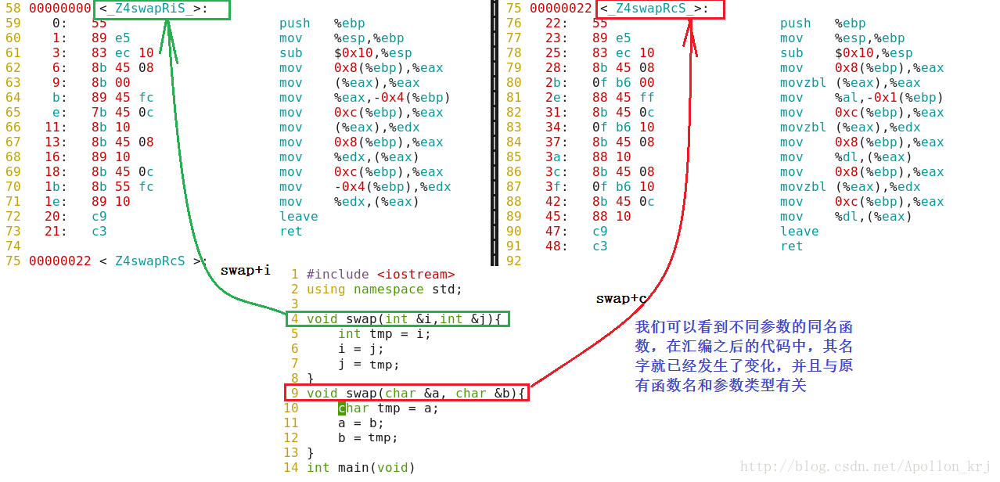
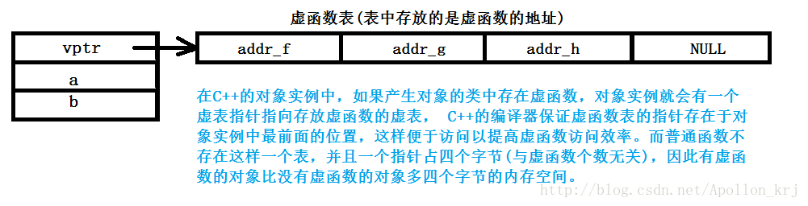
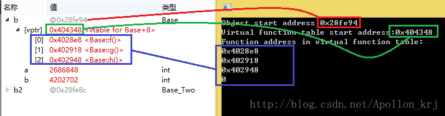
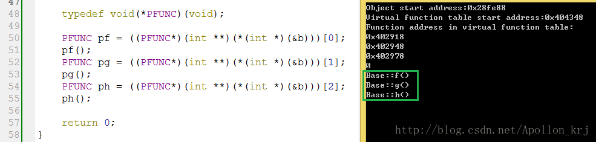
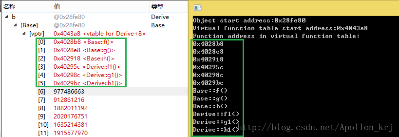
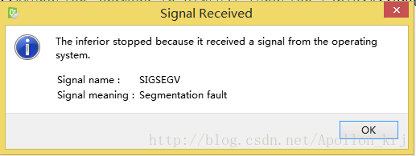
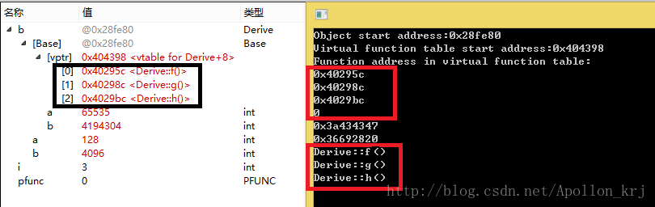
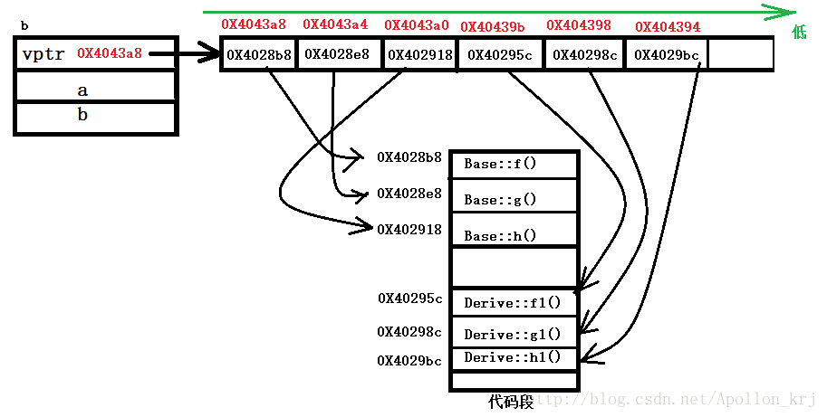
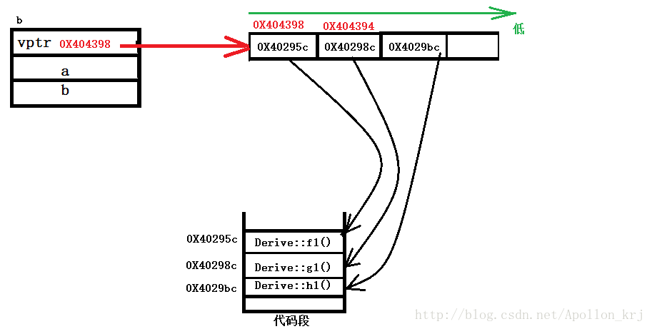

# C++動多態實現之虛函數與虛表指針


近在學習C++的動多態時，瞭解到關於虛函數表與虛表指針的知識點，感覺很有意思，因此總結記錄下來（依據個人理解而寫，歡迎批評指正）。

##1、靜多態與命名傾軋，動多態與虛函數：
###（1）概述： 
我們知道，`C++的多態有靜多態（Static polymorphism）與動多態（Dynamic polymorphism）`之分，靜多態是依靠函數重載（function overloading）實現的，而且這種依靠函數重載的多態的實現是採用命名傾軋（關於命名傾軋可參考：C++函數重載與重載原理：命名傾軋 ）的方式，是在編譯階段就已經完成了的；而動多態（動態聯編、動態關聯）是在運行階段才會確定的，是依靠虛函數來實現的，並且動多態是在有父子類才會產生的多態（虛函數脫離類是毫無意義的），而靜多態則不必需要有類的繼承。實現函數的動態聯編其本質核心則是虛表指針與虛函數表。

###（2）靜多態： 
關於靜多態的命名傾軋，我們再用一個簡單的例子驗證： 
該例為swap()函數的重載測試（圖中簡單做以說明）： 




###（3）動多態： 
那麼對於動多態我們首先總結一下有關其實現前提條件：

`實現前提： 賦值兼容 `

賦值兼容是動多態能夠產生的前提。所謂賦值兼容顧名思義：不同類型的變量之間互相賦值的兼容現象。就像隱式類型轉換一樣，而對於父子類對象之間的賦值兼容是由嚴格規定的，只有在以下幾種情況下才能賦值兼容：

- ①派生類的對象可以賦值給基類對象。 
- ②派生類的對象可以初始化基類的引用。 
- ③派生類對象的地址可以賦給指向基類的指針

但是由於基類對象與基類引用的侷限性，我們一般採用基類指針進行派生類對象的函數調用。

實現條件：

- ①父類中有虛函數。 
- ②子類 override(覆寫/覆蓋)父類中的虛函數。 
- ③通過己被子類對象賦值的父類指針或引用，調用共用接口。

virtual type func（參數列表） = 0;為純虛函數的聲明方式，純虛函數所在基類我們稱為抽象基類，抽象基類不能實例化對象，只能為子類對象提供接口（並非只有純虛函數才能實現動多態，但是一般我們不在純虛函數所在的類中對虛函數具體化其功能。而僅設為純虛以提供接口）我們所說的抽象基類提供接口，就是指特定子類對象通過抽象基類的純虛函數接口，去匹配本對象對應的子類覆寫的抽象基類的虛函數（子類中覆寫的父類函數也是虛函數，只不過可以不寫virtual修飾）。一般要將抽象基類中的析構函數也聲明為虛基類，以解決對象析構時的析構不徹底問題（在 delete 父類指針的時候，會調用子類的析構函數，實現完整析構）。

##2、虛函數表與虛表指針剖析：
我們之前說多態條件中：派生類中與抽象基類同名的成員函數會覆寫（override）其父類的虛函數，那麼覆寫是如何實現的呢？我們得先來看看虛函數表（Virtual function table）與虛表指針（Virtual pointer，vptr）的問題：

一個類在產生對象時，會根據類中成員來為對象分配一定的空間，無論是棧空間還是堆空間，其必定遵循一定的規律，就是什麼樣的成員需要分配空間，什麼樣的成員應該在什麼樣的位置。就這句話，我們來做個小實驗：

```cpp
#include <iostream>
using namespace std;

class Base /*該類中函數均為虛函數*/
{
public:
    virtual void f()
    {
        cout << "Base::f()" << endl;
    }
    virtual void g()
    {
        cout << "Base::g()" << endl;
    }
    virtual void h()
    {
        cout << "Base::h()" << endl;
    }
private:
    int a;
    int b;
};
class Base_Two /*該類中函數均為非虛函數*/
{
public:
    void f()
    {
        cout << "Base::f()" << endl;
    }
    void g()
    {
        cout << "Base::g()" << endl;
    }
    void h()
    {
        cout << "Base::h()" << endl;
    }
private:
    int a;
    int b;
};
int main()
{
    Base b;
    cout << "Virtual function:" << sizeof(Base) << endl;
    cout << "Virtual function:" << sizeof(b) << endl;

    Base_Two b2;
    cout << "Ordinary function:" << sizeof(Base_Two) << endl;
    cout << "Ordinary function:" << sizeof(b2) << endl;

    return 0;
}
```


並且在我們將Base類中的三個虛函數改為兩個或者一個時，其結果仍然是12，而若是三個虛函數均改為普通函數，則大小就與Base_Two類完全相同，這是為什麼呢？函數不是應該不佔用堆內存/棧內存嗎？如果不是虛函數佔用的，那麼多出來的四個字節是提供給誰的？我們畫張圖來說明：




既然如上圖所說，那麼我們豈不是可以根據對象b的地址來訪問vptr的值，進而訪問三個虛函數的地址？答案是當然可以，測試代碼如下：

```cpp
#include <iostream>
using namespace std;

class Base /*該類中函數均為虛函數*/
{
public:
    virtual void f()
    {
        cout << "Base::f()" << endl;
    }
    virtual void g()
    {
        cout << "Base::g()" << endl;
    }
    virtual void h()
    {
        cout << "Base::h()" << endl;
    }
private:
    int a;
    int b;
};
class Base_Two /*該類中函數均為非虛函數*/
{
public:
    void f()
    {
        cout << "Base::f()" << endl;
    }
    void g()
    {
        cout << "Base::g()" << endl;
    }
    void h()
    {
        cout << "Base::h()" << endl;
    }
private:
    int a;
    int b;
};

int main()
{
    Base b;

    cout << "Object start address:" << &b << endl; //對象起始地址
    cout << "Virtual function table start address:"; //V-Table起始地址
    cout << (long**)(*(long*)(&b)) << endl;

    cout << "Function address in virtual function table:" << endl;

    cout << ((long**)(*(long*)&b))[0] << endl;
    cout << ((long**)(*(long*)&b))[1] << endl;
    cout << ((long**)(*(long*)&b))[2] << endl;
    cout << ((long**)(*(long*)&b))[3] << endl;
    /****************************
    * 表達式分析：
    * (int *)&b：取對象b地址的前四個字節，即vptr的地址
    * *(int *)&b：取vptr的存儲的地址值
    * (int **)(*(int *)&b)：將該地址值轉換成二級指針，即存放虛函數地址(一級指針）的虛表數組地址
    * ((int **)(*(int *)&b))[i]:根據該虛表地址進行下標運算取具體的(第i個)虛函數地址
    *******************************/
    return 0;
}
```

我們在程序return 0；之前設置一個斷點，調試並與運行結果進行對比：




發現程序打印的結果與調試中的變量地址是一致的，並且我們可以在調試框中看到[vptr]這一標誌，其三個成員對應的函數名與其所屬類一清二楚，由於虛函數表中最後一個存儲值為NULL，打印就是0。當然我們也可以根據函數指針以及獲取到的地址對其進行函數調用：


```cpp
#include <iostream>
using namespace std;

class Base /*該類中函數均為虛函數*/
{
public:
    virtual void f()
    {
        cout << "Base::f()" << endl;
    }
    virtual void g()
    {
        cout << "Base::g()" << endl;
    }
    virtual void h()
    {
        cout << "Base::h()" << endl;
    }
private:
    int a;
    int b;
};
class Base_Two /*該類中函數均為非虛函數*/
{
public:
    void f()
    {
        cout << "Base::f()" << endl;
    }
    void g()
    {
        cout << "Base::g()" << endl;
    }
    void h()
    {
        cout << "Base::h()" << endl;
    }
private:
    int a;
    int b;
};

int main()
{
    Base b;
    typedef void(*PFUNC)(void);

    PFUNC pf = ((PFUNC*)(long**)(*(long*)(&b)))[0];
    pf();
    PFUNC pg = ((PFUNC*)(long**)(*(long*)(&b)))[1];
    pg();
    PFUNC ph = ((PFUNC*)(long**)(*(long*)(&b)))[2];
    ph();

    return 0;
}
```
我們在程序return 0；之前設置一個斷點，調試並與運行結果進行對比：



##3、虛函數表與動多態的實現：
根據以上分析，我們知道了虛函數的地址是放在虛函數表中的，而對象可以根據其所擁有的虛表指針以及相應的偏移量進行虛函數的訪問調用。那麼對於基於虛函數的動多態的實現又是怎樣的？我們繼續往下分析：

我們先將上面的程序稍作修改，讓 Derive繼承有虛函數的Base，此時的 Derive中並沒有覆寫父類的虛函數。

```cpp
#include <iostream>

using namespace std;
typedef void(*PFUNC)(void);

class Base
{
public:
    virtual void f()
    {
        cout << "Base::f()" << endl;
    }
    virtual void g()
    {
        cout << "Base::g()" << endl;
    }
    virtual void h()
    {
        cout << "Base::h()" << endl;
    }
private:
    int a;
    int b;
};

class Derive: public Base
{
public:
    virtual void f1()
    {
        cout << "Derive::f1()" << endl;
    }
    virtual void g1()
    {
        cout << "Derive::g1()" << endl;
    }
    virtual void h1()
    {
        cout << "Derive::h1()" << endl;
    }
private:
    int a;
    int b;
};

int main()
{
    Derive b;

    cout << "Object start address:" << &b << endl; //對象起始地址
    cout << "Virtual function table start address:"; //V-Table起始地址
    cout << (int**)(*(int*)(&b)) <<
         endl; //int **：二級指針，表示虛表指針為函數指針數組

    cout << "Function address in virtual function table:" << endl;

    for (int i = 0; i < 6; i++) {
        cout << ((long**)(*(long*)(&b)))[i] << endl;
    }

    PFUNC pfunc;

    for (int i = 0; i < 6; i++) {
        pfunc = ((PFUNC*)(long**)(*(long*)(&b)))[i];
        pfunc();
    }

    return 0;
}
```

對於沒有覆寫父類虛函數的這段例子，我們依然設置斷點調試，結果如下：



在修改Derive::f1()、Derive::g1()、Derive::h1()三個函數名為Derive::f()、Derive::g()、Derive::h()及其輸出內容之後，我們再進行測試，發現結果產生段錯誤：段錯誤的提示信息是由於此時覆寫之後，虛表中只存在三個有效指針，我們循環時的條件未進行修改越界訪問而導致的。本來想將循環條件值修改後測試截圖，但是覺得這個段錯誤包含了覆寫時的虛表大小改變的情況，就留了下來，我們不予理睬即可（段錯誤截圖如下，收到SIGSEGV信號）：




我們只分析調試信息與輸出信息： 





可以看到，父類的Base::f()、Base::g()、Base::h()函數已經不存在了，而被子類的同名函數Derive::f()、Derive::g()、Derive::h()給覆寫了。

對上面的輸出結果,根據其打印的地址，我們再畫兩張圖來分析： 
下圖為未覆寫的內存圖： 



下圖為覆寫後的內存圖（注意：兩次編譯運行後打印的地址雖然相近但是無必然聯繫）： 




由這兩張圖，我們可以很好地看清，原來覆寫時，vptr的地址由Base::f()的地址變成了Derive::f()的地址，因此在通過vptr指針與偏移量向低地址尋址的過程中，就不能再找到Base的函數了，不同子類其對象中在運行時修改vptr的值（也就是虛函數表的起始地址），也就實現了覆寫與多態。 
##注意：
虛函數表的創建在抽象基類的構造函數之後才完成，虛函數表在子類的析構函數執行以後就已經不再有效。因此，在子類創建與銷燬對象時，如果在抽象基類的構造函數與析構函數中，去調用虛函數，打印的信息是抽象基類的成員虛函數信息，而在抽象基類中的其他成員函數中調用虛函數打印的是調用方（子類中對象）覆寫的虛函數信息。（即子類覆寫的抽象基類虛函數作用域不包括抽象基類的構造器與析構器）