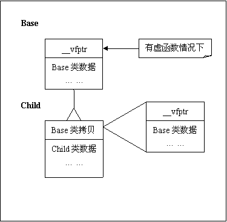
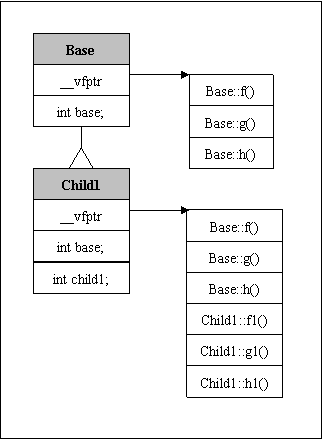
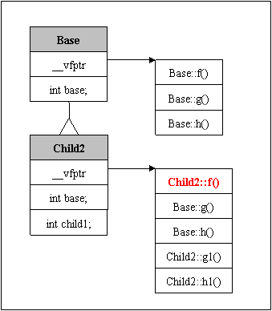
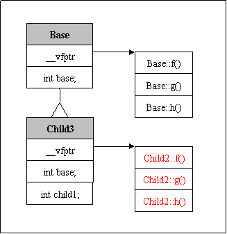
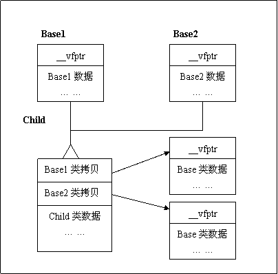
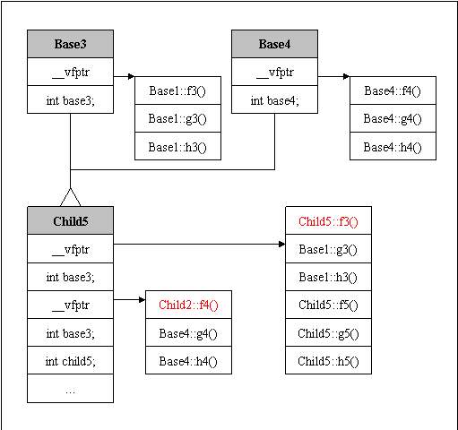
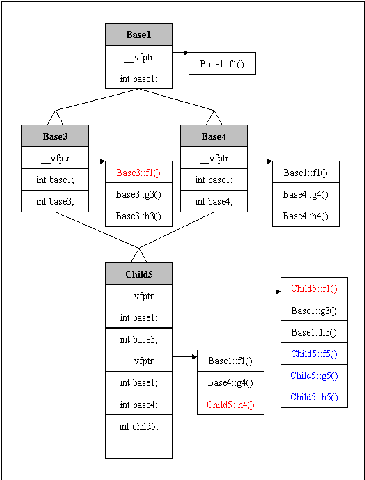
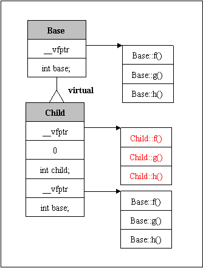
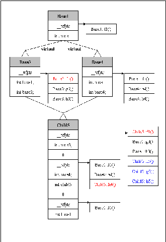

# C++類對象內存結構


 首先介紹一下C++中有繼承關係的類對象內存的佈局： 
在C++中，如果類中有虛函數，那麼它就會有一個虛函數表的指針__vfptr，在類對象最開始的內存數據中。之後是類中的成員變量的內存數據。 

對於子類，最開始的內存數據記錄著父類對象的拷貝`（包括父類虛函數表指針和成員變量）`。 之後是子類自己的成員變量數據。 

對於子類的子類，也是同樣的原理。但是無論繼承了多少個子類，對象中始終`只有一個`虛函數表指針。 




為了探討C++類對象的內存佈局，先來寫幾個類和函數 
首先寫一個基類： 

```cpp
class Base
{
public:
    virtual void f()
    {
        cout << "Base::f" << endl;
    }
    virtual void g()
    {
        cout << "Base::g" << endl;
    }
    virtual void h()
    {
        cout << "Base::h" << endl;
    }
    int base;
protected:
private:
};
```


然後，我們多種不同的繼承情況來研究子類的內存對象結構。 
###1. 無虛函數集繼承 
 
//子類1，無虛函數重載 

```cpp
class Child1 : public Base
{
public:
    virtual void f1()
    {
        cout << "Child1::f1" << endl;
    }
    virtual void g1()
    {
        cout << "Child1::g1" << endl;
    }
    virtual void h1()
    {
        cout << "Child1::h1" << endl;
    }
    int child1;
protected:
private:
};

```

這個子類Child1沒有繼承任何一個基類的虛函數，因此它的虛函數表如下圖： 




我們可以看出，子類的虛函數表中，先存放基類的虛函數，在存放子類自己的虛函數。 
 
###2. 有一個虛函數繼承 
//子類2，有1個虛函數重載 


```cpp
class Child2 : public Base
{
public:
    virtual void f()
    {
        cout << "Child2::f" << endl;
    }
    virtual void g2()
    {
        cout << "Child2::g2" << endl;
    }
    virtual void h2()
    {
        cout << "Child2::h2" << endl;
    }
    int child2;
protected:
private:
};

```



當子類重載了父類的虛函數，則編譯器會將子類虛函數表中對應的父類的虛函數替換成子類的函數。 
### 3. 全部虛函數都繼承 
//子類3，全部虛函數重載 

```cpp
class Child3 : public Base
{
public:
    virtual void f()
    {
        cout << "Child3::f" << endl;
    }
    virtual void g()
    {
        cout << "Child3::g" << endl;
    }
    virtual void h()
    {
        cout << "Child3::h" << endl;
    }
protected:
    int x;
private:
};
```



###4. 多重繼承 

多重繼承，即類有多個父類，這種情況下的子類的內存結構和單一繼承有所不同。 



我們可以看到，當子類繼承了多個父類，那麼子類的內存結構是這樣的： 
子類的內存中，順序 




### 5. 菱形繼承 



### 6. 單一虛擬繼承 



虛擬繼承的子類的內存結構，和普通繼承完全不同。虛擬繼承的子類，有單獨的虛函數表， 另外也單獨保存一份父類的虛函數表，兩部分之間用一個四個字節的0x00000000來作為分界。

子類的內存中，首先是自己的虛函數表，然後是子類的數據成員，然後是0x0，之後就是父類的虛函數表，之後是父類的數據成員。 

如果子類沒有自己的虛函數，那麼子類就不會有虛函數表，但是子類數據和父類數據之間，還是需要0x0來間隔。 

因此，在虛擬繼承中，子類和父類的數據，是完全間隔的，先存放子類自己的虛函數表和數據，中間以0x分界，最後保存父類的虛函數和數據。

如果子類重載了父類的虛函數，那麼則將子類內存中父類虛函數表的相應函數替換。 


### 7. 菱形虛擬繼承 




## 結論： 
```sh
(1) 對於基類，如果有虛函數，那麼先存放虛函數表指針，然後存放自己的數據成員；如果沒有虛函數，那麼直接存放數據成員。 
(2) 對於單一繼承的類對象，先存放父類的數據拷貝(包括虛函數表指針)，然後是本類的數據。 
(3) 虛函數表中，先存放父類的虛函數，再存放子類的虛函數 
(4) 如果重載了父類的某些虛函數，那麼新的虛函數將虛函數表中父類的這些虛函數覆蓋。 
(5) 對於多重繼承，先存放第一個父類的數據拷貝，在存放第二個父類的數據拷貝，一次類推，最後存放自己的數據成員。其中每一個父類拷貝都包含一個虛函數表指針。如果子類重載了某個父類的某個虛函數，那麼該將該父類虛函數表的函數覆蓋。另外，子類自己的虛函數，存儲於第一個父類的虛函數表後邊部分。 
(6) 當對象的虛函數被調用是，編譯器去查詢對象的虛函數表，找到該函數，然後調用
```
