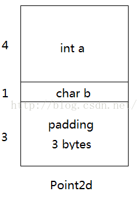
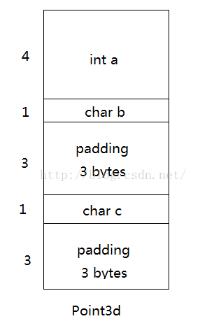
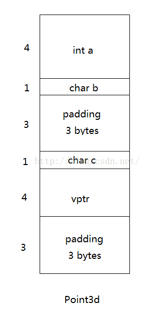
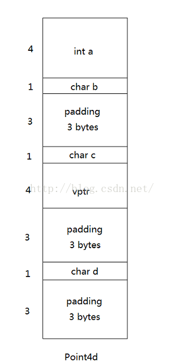
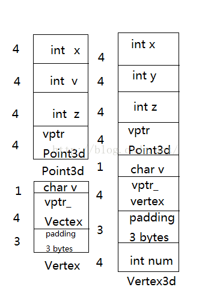
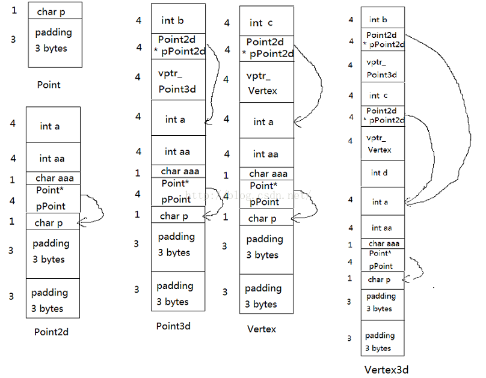

# C++四种继承关系中内存分布


###1、单一继承不含虚函数

在这种情况下，对象会保持基类的原样性，并且一个class derived class object表现出来的东西，是其自己的members加上其base classes members的总和。


```cpp
class Point2d  
{  
    int a;  
    char b;  
};  
  
class Point3d : public Point2d  
{  
    char c;  
};  
```

对于上述类，其模型如下：




###2、单一继承含虚函数

与单一继承不含虚函数唯一不同的是，在含有虚函数时，vptr放置的位置。如果vptr放置在起始位置处，则会表现出非自然多态。如果在在尾处，则可以自然多态。下面是一个构造的具有虚函数的继承类。

```cpp
class Point2d
{
    int a;
    char b;
};

class Point3d : public Point2d
{
    char c;
public:
    virtual void print()
    {
        std::cout << "this is the Point2d" << std::endl;
    }
};
class Point4d : public Point3d
{
    char d;
public:
    void print() override
    {
        std::cout << "this is the Point4d" << std::endl;
    }
};
```
 对于上述类，其模型如下：
 





###3、多重继承

多重继承的问题主要发生于derived class objects和其第二或后继的base class之间的转换。他的内存分布其实各个部分相加再加上自己的部分。

```cpp
class Point3d
{
private:
    int _x, _y, _z;
public:
    virtual void print()
    {
        std::cout << "this is the point3d" << std::endl;
    }

};

class Vertex
{
private:
    char v;
public:
    virtual void print()
    {
        std::cout << "this is the vertex" << std::endl;
    }
};

class Vertex3d : public Point3d, public Vertex
{
    int num;
};
```
对于这个类，它们的模型是：




在这个模型中，类型转换是如何发生的呢？


```cpp
Point3d* ptrP3d1;
Vertex* ptrVtx1;
Vertex3d* ptrVtx3d1;
Vertex3d vtx3d1;
ptrP3d1 = &vtx3d1;//自然多态，不需要编译器参与
ptrVtx1 = &vtx3d1;//非自然多态，需要编译器参数 ptrVtx1 = (Vertex*)((char*)(&vtx3d1)+sizeof(Point3d));
ptrVtx3d1 = &vtx3d1;
ptrVtx1 = ptrVtx3d1;//非自然多态，需要编译器 ptrVtx1 =ptrVtx3d1？(Vertex*)((char*)(ptrVtx3d1)+sizeof(Point3d))：0
```
###4、虚拟继承

Class如果内含一个或多个virtual base class subobjects，将被分割成两部分：一个不变区域和一个共享区域。

共享区域指的是virtual base class subobject这一部分，其位置会因为每次的派生操作而有变化。


下面我将分析一组虚拟派生继承，以及它在vs中的内存分布。代码如下：

```cpp
class Point
{
    char p;
};

class Point2d : public virtual Point
{
    int a;
    int aa;
    char aaa;
};

class Point3d : public virtual Point2d
{
    int b;
public:
    virtual void print()
    {
        std::cout << "this is the Point3d" << std::endl;
    }
};

class Vertex : public virtual Point2d
{
    int c;

public:
    virtual void print()
    {
        std::cout << "this is the Vertex" << std::endl;
    }
};

class Vertex3d : public Point3d, public Vertex
{
    int d;
};
```

在这段代码中，其所构造的模型如下：


