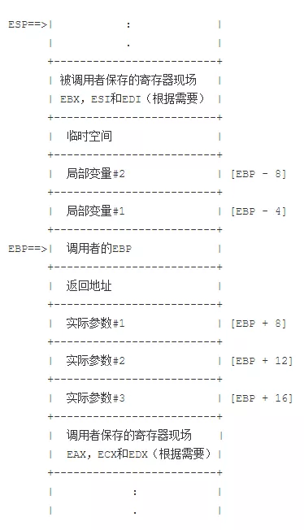
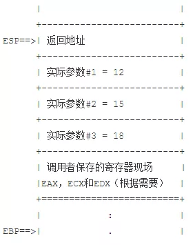
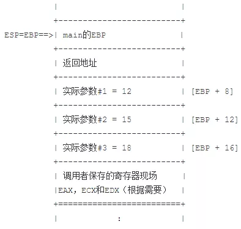
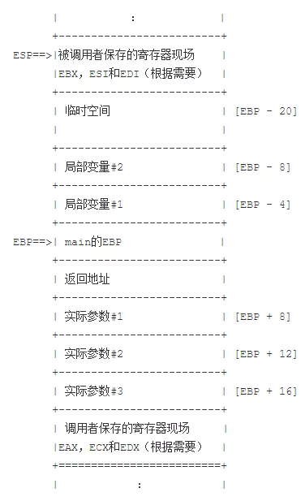
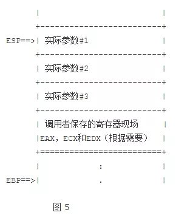
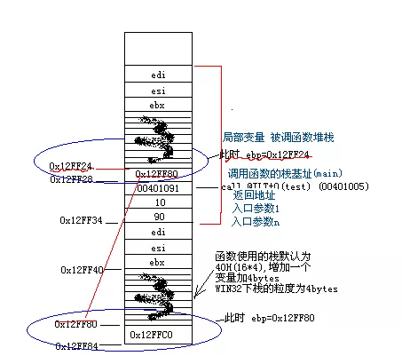

## 你一定要搞明白的C函数调用方式与栈原理

**写在前面的话**

**这绝对不是标题党。而是C/C++开发中你必须要掌握的基础知识，也是高级技术岗位面试中高频题。我真的真的真的希望无论是学生还是广大C/C++开发者，都该掌握此文中介绍的知识。**


**正文**

这篇blog试图讲明当一个c函数被调用时，一个**栈帧(stack frame)**是如何被建立，又如何被消除的。这些细节跟操作系统平台及编译器的实现有关，下面的描述是针对运行在Intel奔腾芯片上Linux的gcc编译器而言。c语言的标准并没有描述实现的方式，所以，不同的编译器，处理器，操作系统都可能有自己的建立栈帧的方式。


### 一个典型的栈帧



图1是一个典型的栈帧，图中，栈顶在上，地址空间往下增长。
这是如下一个函数调用时的栈的内容：

```
int foo(int arg1, int arg2, int arg3); 
```

并且，foo有两个局部的int变量（4个字节）。在这个简化的场景中，main调用foo，而程序的控制仍在foo中。这里，main是调用者（caller），foo是被调用者（callee）。
**ESP被foo使用来指示栈顶。EBP相当于一个“基准指针”**。从main传递到foo的参数以及foo本身的局部变量都可以通过这个基准指针为参考，加上偏移量找到。
由于被调用者允许使用EAX，ECX和EDX寄存器，所以如果调用者希望保存这些寄存器的值，就必须在调用子函数之前显式地把他们保存在栈中。另一方面，如果除了上面提到的几个寄存器，被调用者还想使用别的寄存器，比如EBX，ESI和EDI，那么，被调用者就必须在栈中保存这些被额外使用的寄存器，并在调用返回前回复他们。也就是说，如果被调用者只使用约定的EAX，ECX和EDX寄存器，他们由调用者负责保存并回复，但如果被调用这还额外使用了别的寄存器，则必须有他们自己保存并回复这些寄存器的值。
传递给foo的参数被压到栈中，最后一个参数先进栈，所以第一个参数是位于栈顶的。foo中声明的局部变量以及函数执行过程中需要用到的一些临时变量也都存在栈中。
**小于等于4个字节的返回值会被保存到****EAX****中**，如果大于4字节，小于8字节，那么EDX也会被用来保存返回值。如果返回值占用的空间还要大，那么调用者会向被调用者传递一个额外的参数，这个额外的参数指向将要保存返回值的地址。用C语言来说，就是函数调用：

```
x = foo(a, b, c);
```

被转化为：

```
foo(&x, a, b, c);
```

注意，这仅仅在返回值占用大于**8个字节**时才发生。有的编译器不用EDX保存返回值，所以当返回值大于4个字节时，就用这种转换。
当然，并不是所有函数调用都直接赋值给一个变量，还可能是直接参与到某个表达式的计算中，如：

```
m = foo(a, b, c) + foo(d, e, f);
```

有或者作为另外的函数的参数， 如：

```
fooo(foo(a, b, c), 3);
```

这些情况下，foo的返回值会被保存在一个临时变量中参加后续的运算，所以，foo(a, b, c)还是可以被转化成**foo(&tmp, a, b, c)**。

让我们一步步地看一下在c函数调用过程中，一个栈帧是如何建立及消除的。


### 函数调用前调用者的动作

在我们的例子中，调用者是main，它准备调用函数foo。在函数调用前，main正在用ESP和EBP寄存器指示它自己的栈帧。

首先，main把EAX，ECX和EDX压栈。这是一个可选的步骤，只在这三个寄存器内容需要保留的时候执行此步骤。
接着，main把传递给foo的参数一一进栈，最后的参数最先进栈。例如，我们的函数调用是：

```
a = foo(12, 15, 18);
```

相应的汇编语言指令是：

```
push dword 18
push dword 15
push dword 12
```

最后，main用call指令调用子函数：

```
call foo
```

**当call指令执行的时候，EIP指令指针寄存器的内容被压入栈中**。因为EIP寄存器是指向main中的下一条指令，所以现在返回地址就在栈顶了。在call指令执行完之后，下一个执行周期将从名为foo的标记处开始。
图2展示了call指令完成后栈的内容。图2及后续图中的**粗线**指示了函数调用前栈顶的位置。我们将会看到，当整个函数调用过程结束后，栈顶又回到了这个位置。




### 被调用者在函数调用后的动作


当函数foo，也就是被调用者取得程序的控制权，它**必须做3件事**：建立它自己的栈帧，为局部变量分配空间，最后，如果需要，保存寄存器EBX，ESI和EDI的值。
首先foo必须建立它自己的栈帧。EBP寄存器现在正指向main的栈帧中的某个位置，这个值必须被保留，因此，EBP进栈。然后ESP的内容赋值给了EBP。这使得函数的参数可以通过对EBP附加一个偏移量得到，而栈寄存器ESP便可以空出来做其他事情。如此一来，几乎所有的c函数都由如下两个指令开始：

```
push ebp
mov ebp, esp
```

此时的栈入图3所示。在这个场景中，第一个参数的地址是EBP加8，因为main的EBP和返回地址各在栈中占了4个字节。



​       

下一步，foo必须为它的局部变量分配空间，同时，也必须为它可能用到的一些临时变量分配空间。比如，foo中的一些C语句可能包括复杂的表达式，其子表达式的中间值就必须得有地方存放。这些存放中间值的地方同城被称为临时的，因为他们可以为下一个复杂表达式所复用。为说明方便，我们假设我们的foo中有两个int类型（每个4字节）的局部变量，需要额外的12字节的临时存储空间。简单地把栈指针减去20便为这20个字节分配了空间：

```
sub esp, 20
```

现在，局部变量和临时存储都可以通过基准指针EBP加偏移量找到了。
最后，如果foo用到EBX，ESI和EDI寄存器，则它f必须在栈里保存它们。结果，现在的栈如图4所示。 



​    

foo的函数体现在可以执行了。这其中也许有进栈、出栈的动作，栈指针ESP也会上下移动，但EBP是保持不变的。这意味着我们可以一直用[EBP+8]找到第一个参数，而不管在函数中有多少进出栈的动作。
函数foo的执行也许还会调用别的函数，甚至递归地调用foo本身。然而，只要EBP寄存器在这些子调用返回时被恢复，就可以继续用EBP加上偏移量的方式访问实际参数，局部变量和临时存储。


### 被调用者返回前的动作 

在把程序控制权返还给调用者前，被调用者foo必须先把返回值保存在**EAX**寄存器中。我们前面已经讨论过，当返回值占用多于4个或8个字节时，接收返回值的变量地址会作为一个额外的指针参数被传到函数中，而函数本身就不需要返回值了。这种情况下，被调用者直接通过内存拷贝把返回值直接拷贝到接收地址，从而省去了一次通过栈的中转拷贝。
其次，foo必须恢复EBX，ESI和EDI寄存器的值。如果这些寄存器被修改，正如我们前面所说，我们会在foo执行开始时把它们的**原始值压入栈中**。如果ESP寄存器指向如图4所示的正确位置，寄存器的原始值就可以出栈并恢复。可见，在foo函数的执行过程中正确地跟踪ESP是多么的重要————也就是说，进栈和出栈操作的次数必须保持平衡。
这两步之后，我们不再需要foo的局部变量和临时存储了，我们可以通过下面的指令消除栈帧：

```
mov esp, ebp
pop ebp
```

其结果就是现在栈里的内容跟图2中所示的栈完全一样。现在可以执行返回指令了。从栈里弹出返回地址，赋值给EIP寄存器。栈如图5所示：

 

i386指令集有一条**“leave”**指令，它与上面提到的mov和pop指令所作的动作完全相同。所以，C函数通常以这样的指令结束：

```
leave
ret
```


### 调用者在返回后的动作 

在程序控制权返回到调用者（也就是我们例子中的main）后，栈如图5所示。这时，传递给foo的参数通常已经不需要了。我们可以把3个参数一起弹出栈，这可以通过把栈指针加12（=3个4字节）实现：

```
add esp, 12
```

如果在函数调用前，EAX，ECX和EDX寄存器的值被保存在栈中，调用者main函数现在可以把它们弹出。这个动作之后，栈顶就回到了我们开始整个函数调用过程前的位置，也就是图5中粗线的位置。

看个具体的实例：

这段代码反汇编后，代码是什么呢？

```
#include <stdio.h>
long test(int a, int b)
{
	a = a + 3;
	b = b + 5;
	return a + b;
}
 
int main(int argc, char* argv[])
{
	printf("%d", test(10,90));
	return 0;
}
```

先来看一个概貌：

```
9:   int main(int argc, char* argv[])
10:   {
00401070   push        ebp
00401071   mov         ebp,esp
00401073   sub         esp,40h
00401076   push        ebx
00401077   push        esi
00401078   push        edi
00401079   lea         edi,[ebp-40h]
0040107C   mov         ecx,10h
00401081   mov         eax,0CCCCCCCCh
00401086   rep stos    dword ptr [edi]
11:        printf("%d",test(10,90));
00401088   push        5Ah
0040108A   push        0Ah
0040108C   call        @ILT+0(test) (00401005)
00401091   add         esp,8
00401094   push        eax
00401095   push        offset string "%d" (0042201c)
0040109A   call        printf (004010d0)
0040109F   add         esp,8
12:        return 0;
004010A2   xor         eax,eax
13:   }
```

下面来解释一下，


开始进入Main函数 esp=0x12FF84  ebp=0x12FFC0
完成椭圆形框起来的部分：

```
00401070   push        ebp
```

**ebp的值入栈，保存现场(调用现场**，从test函数看，如红线所示，即保存的0x12FF80用于从test函数堆栈返回到main函数)：

```
00401071    mov        ebp,esp 
```

此时ebp＝0x12FF80 **此时ebp就是“当前函数堆栈”的基址 以便访问堆栈中的信息；还有就是从当前函数栈顶返回到栈底：**

```
00401073     sub        esp,40h   
```

函数使用的堆栈，默认64个字节，堆栈上就是16个横条（密集线部分）此时esp=0x12FF40。
在上图中，上面密集线是test函数堆栈空间，下面是Main的堆栈空间(补充，其实这个就叫做 **Stack Frame**)：

```
00401076   push        ebx
00401077   push        esi
00401078   push        edi    入栈 
00401079   lea         edi,[ebp-40h]
0040107C   mov         ecx,10h
00401081   mov         eax,0CCCCCCCCh
00401086   rep stos    dword ptr [edi]      
```

初始化用于该函数的栈空间为0XCCCCCCCC，即从0x12FF40~0x12FF80所有的值均为0xCCCCCCCC：

```
11:        printf("%d",test(10,90));
00401088   push        5Ah    参数入栈 从右至左 先90  后10
0040108A   push        0Ah 
0040108C   call        @ILT+0(test) (00401005)    
```

函数调用，转向eip 00401005 。 
**注意，此时仍入栈，入栈的是call test 指令下一条指令的地址00401091下一条指令是add esp,8。**
@ILT+0(?test@@YAJHH@Z):

```
00401005   jmp       test (00401020)   
```

即转向被调函数test：

```
 2:    long test(int a,int b)
 3:    {
00401020   push        ebp
00401021   mov         ebp,esp           
00401023   sub         esp,40h
00401026   push        ebx
00401027   push        esi
00401028   push        edi
00401029   lea         edi,[ebp-40h]
0040102C   mov         ecx,10h
00401031   mov         eax,0CCCCCCCCh
00401036   rep stos    dword ptr [edi]       //这些和上面一样
4:        a = a + 3;                                    
00401038   mov         eax,dword ptr [ebp+8] //ebp=0x12FF24 加8 [0x12FF30]即取到了参数10
0040103B   add         eax,3
0040103E   mov         dword ptr [ebp+8],eax
5:        b = b + 5;
00401041   mov         ecx,dword ptr [ebp+0Ch]
00401044   add         ecx,5
00401047   mov         dword ptr [ebp+0Ch],ecx
6:        return a + b;
0040104A   mov         eax,dword ptr [ebp+8]
0040104D   add         eax,dword ptr [ebp+0Ch]  //最后的结果保存在eax, 结果得以返回
7:   }
00401050   pop         edi                 
00401051   pop         esi
00401052   pop         ebx
00401053   mov         esp,ebp    //esp指向0x12FF24, test函数的堆栈空间被放弃，从当前函数栈顶返回到栈底
00401055   pop         ebp        //此时ebp=0x12FF80, 恢复现场  esp=0x12FF28
00401056   ret                    //ret负责栈顶0x12FF28之值00401091弹出到指令寄存器中，esp=0x12FF30
```

因为win32汇编一般用eax返回结果 所以如果最终结果不是在eax里面的话 还要把它放到eax。

注意，从被调函数返回时，是弹出EBP,恢复堆栈到函数调用前的地址，弹出返回地址到EIP以继续执行程序。

从test函数返回，执行：

```
00401091   add         esp,8       
```

清栈，清除两个压栈的参数10 90 调用者main负责。
**(所谓__cdecl调用由调用者负责恢复栈，调用者负责清理的只是入栈的参数，test函数自己的堆栈空间自己返回时自己已经清除，靠！一直理解错)**

```
00401094   push        eax          //入栈，计算结果108入栈，即printf函数的参数之一入栈
00401095   push        offset string "%d" (0042201c)//入栈，参数 "%d"  当然其实是％d的地址
0040109A   call        printf (004010d0)//函数调用 printf("%d",108) 因为printf函数时
0040109F   add         esp,8       //清栈，清除参数 ("%d", 108)
19:        return 0;           
004010A2   xor         eax,eax     //eax清零
20:   }     
```

main函数执行完毕 此时esp=0x12FF34 ebp=0x12FF80：

```
004010A4   pop         edi
004010A5   pop         esi
004010A6   pop         ebx
004010A7   add         esp,40h    //为啥不用mov esp, ebp? 是为了下面的比较
004010AA   cmp         ebp,esp   //比较，若不同则调用chkesp抛出异常
004010AC   call        __chkesp (00401150)   
004010B1   mov         esp,ebp   
004010B3   pop         ebp          //ESP=0X12FF84  
```

EBP=0x12FFC0 尘归尘 土归土 一切都恢复最初的平静了 :)

```
004010B4   ret
```

另：

1. 如果函数调用方式是**__stdcall**不同之处在于main函数call 后面没有了add esp, 8；test函数最后一句是 ret 8  (由test函数清栈, ret 8意思是执行ret后，esp+8)。
2. 运行过程中0x12FF28 保存了指令地址 00401091是怎么保存的？栈每个空间保存4个字节（粒度4字节） 例如下一个栈空间0x12FF2C保存参数10，因此：

```
0x12FF28 0x12FF29 0x12FF2A 0x12FF2B   
   91       10       40       00       
```

little-endian 认为其读的第一个字节为最小的那位上的数。

3. char a[] = "abcde" 
    对局部字符数组变量（栈变量）赋值，是利用寄存器从全局数据内存区把字符串“abcde”拷贝到栈内存中的。
4. int szNum[5] = { 1, 2, 3, 4, 5 }; 栈中是如何分布的？

```
00401798   mov         dword ptr [ebp-14h],1
0040179F   mov         dword ptr [ebp-10h],2
004017A6   mov         dword ptr [ebp-0Ch],3
004017AD   mov         dword ptr [ebp-8],4
004017B4   mov         dword ptr [ebp-4],5
```

可以看出来是从右边开始入栈，所以是 5 4 3 2 1 入栈，

```
int *ptrA = (int*)(&szNum+1);
int *ptrB = (int*)((int)szNum + 1);
std::cout<< ptrA[-1] << *ptrB << std::endl;
```

结果如何？

```
28:       int *ptrA = (int*)(&szNum+1);
004017BB   lea         eax,[ebp]
004017BE   mov         dword ptr [ebp-18h],eax
```

&szNum是指向数组指针；加1是加一个数组宽度；&szNum+1指向移动5个int单位之后的那个地方， 就是把EBP的地址赋给指针；
ptrA[-1]是回退一个int*宽度，即ebp-4；

```
29:       int *ptrB = (int*)((int)szNum + 1);
004017C1   lea         ecx,[ebp-13h]
004017C4   mov         dword ptr [ebp-1Ch],ecx
```

如果上面是指针算术，那这里就是地址算术，只是首地址+1个字节的offset，即ebp-13h给指针。实际保存是这样的：

```
01 00 00 00 02 00 00 00
ebp-14h ebp-13h ebp-10h
```

注意，是int*类型的，最后获得的是 00 00 00 02，由于Little-endian, 实际上逻辑数是02000000，转换为十进制数就为33554432，最后输出533554432。
