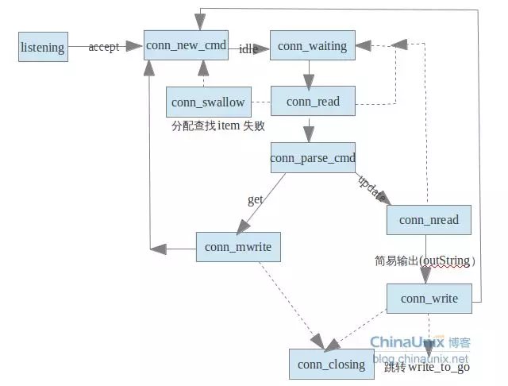

# Memcached源码阅读十七 状态机

按我们之前的描述，**Master线程**建立连接之后，分发给**Worker线程**，而Worker线程处理业务逻辑时，会进入状态机，状态机按不同的状态处理业务逻辑，我们在分析连接分发时，已经看到了Master线程进入状态机时在有新连接建立的时候，后续的状态都是业务逻辑的状态，其处理流程如下图所示：



共有10个状态（代码中的状态不止这些，有些没什么用，此处就没展现），状态`listenning`状态是Master建立连接的过程，我们已经分析过了，我们接下来分不同的文章分析其余的9中状态。

```
enum conn_states {
    conn_listening,  //监听状态
    conn_new_cmd,    //为新连接做一些准备
    conn_waiting,    //等待读取一个数据包
    conn_read,       //读取网络数据
    conn_parse_cmd,  //解析缓冲区的数据
    conn_write,      //简单的回复数据
    conn_nread,      //读取固定数据的网络数据
    conn_swallow,    //处理不需要的写缓冲区的数据
    conn_closing,    //关闭连接
    conn_mwrite,     //顺序的写多个item数据
    conn_max_state   //最大状态，做断言使用
};
```

这篇文件先分析`conn_new_cmd`和`conn_wating`状态，子线程最初进入的状态就是conn_new_cmd状态，这个状态主要是做一些清理。

```
case conn_new_cmd:
  //全局变量，记录每个libevent实例处理的事件，通过初始启动参数配置
     --nreqs;

     //还可以处理请求
     if (nreqs >= 0)
     {
         //整理缓冲区
         reset_cmd_handler(c);
     }
     //拒绝请求
     else
     {
         pthread_mutex_lock(&c->thread->stats.mutex);
         c->thread->stats.conn_yields++;//更新统计数据
         pthread_mutex_unlock(&c->thread->stats.mutex);
         //如果缓冲区有数据，则需要处理
         if (c->rbytes > 0)
         {
             //更新libevent状态
             if (!update_event(c, EV_WRITE | EV_PERSIST))
             {
                 if (settings.verbose > 0)
                      fprintf(stderr, "Couldn't update event\n");
                   conn_set_state(c, conn_closing);//关闭连接
             }
         }
         stop = true;
     }
     break;
```

```
//整理缓冲区
static void reset_cmd_handler(conn *c)
{
    c->cmd = -1;
    c->substate = bin_no_state;
    //还有item
    if (c->item != NULL)
    {
        //删除item，本篇不分析其实现，后续分析
        item_remove(c->item);
        c->item = NULL;
    }
    //整理缓冲区
    conn_shrink(c);
    //缓冲区还有数据
    if (c->rbytes > 0)
    {
        //更新状态
        conn_set_state(c, conn_parse_cmd);
    }
    //如果没有数据
    else
    {
        //进入等待状态，状态机没有数据要处理，就进入这个状态
        conn_set_state(c, conn_waiting);
    }
}

//缩小缓冲区
static void conn_shrink(conn *c)
{
    assert(c != NULL);

    //如果是UDP协议，不牵涉缓冲区管理
    if (IS_UDP(c->transport))
        return;
    //读缓冲区空间大小>READ_BUFFER_HIGHWAT && 已经读到的数据还没解析的数据小于 DATA_BUFFER_SIZE
    if (c->rsize > READ_BUFFER_HIGHWAT && c->rbytes < DATA_BUFFER_SIZE)
    {
        char *newbuf;

        if (c->rcurr != c->rbuf)
            //目前数据是从rcurr开始的，移动数据到rbuf中
            memmove(c->rbuf, c->rcurr, (size_t) c->rbytes);

        //按DATA_BUFFER_SIZE扩大缓冲区
        newbuf = (char *) realloc((void *) c->rbuf, DATA_BUFFER_SIZE);
        if (newbuf)
        {
            //更新读缓冲区
            c->rbuf = newbuf;
            //更新读缓冲区大小
            c->rsize = DATA_BUFFER_SIZE;
        }
        c->rcurr = c->rbuf;
    }

    //需要写出的item的个数，也就是要发送给客户端的item的个数
    if (c->isize > ITEM_LIST_HIGHWAT)
    {
        //增大存放item的空间
        item **newbuf = (item**) realloc((void *) c->ilist,ITEM_LIST_INITIAL * sizeof(c->ilist[0]));
        if (newbuf)
        {
            //更新信息
            c->ilist = newbuf;
            //更新信息
            c->isize = ITEM_LIST_INITIAL;
        }
    }

    //msghdr的个数，memcached发送消息是通过sendmsg批量发送的
    if (c->msgsize > MSG_LIST_HIGHWAT)
    {
        struct msghdr *newbuf = (struct msghdr *) realloc((void *) c->msglist,MSG_LIST_INITIAL * sizeof(c->msglist[0]));//增大空间
        if (newbuf)
        {
            //更新信息
            c->msglist = newbuf;
            //更新信息
            c->msgsize = MSG_LIST_INITIAL;
        }
    }

    //msghdr里面iov的数量
    if (c->iovsize > IOV_LIST_HIGHWAT)
    {
        //增大空间
        struct iovec *newbuf = (struct iovec *) realloc((void *) c->iov,IOV_LIST_INITIAL * sizeof(c->iov[0]));
        if (newbuf)
        {
            //更新信息
            c->iov = newbuf;
            //更新信息
            c->iovsize = IOV_LIST_INITIAL;
        }
    }
}
```

从`conn_new_cmd`状态会进入`conn_parse_cmd`状态（如果有数据）或者conn_waiting（如果没有数据）状态，下面看看conn_waiting状态。

```
case conn_waiting:
  //修改libevent状态，读取数据
  if (!update_event(c, EV_READ | EV_PERSIST))
     {
         if (settings.verbose > 0)
             fprintf(stderr, "Couldn't update event\n");
         conn_set_state(c, conn_closing);
         break;
     }
     //进入读数据状态
     conn_set_state(c, conn_read);
     stop = true;
     break;
//更新libevent状态，也就是删除libevent事件后，重新注册libevent事件
static bool update_event(conn *c, const int new_flags)
{
     assert(c != NULL);
     struct event_base *base = c->event.ev_base;

     if (c->ev_flags == new_flags)
        return true;
     //删除旧的事件
     if (event_del(&c->event) == -1)
        return false;

     //注册新事件
     event_set(&c->event, c->sfd, new_flags, event_handler, (void *) c);
     event_base_set(base, &c->event); 
     c->ev_flags = new_flags;

     if (event_add(&c->event, 0) == -1)
       return false;
     return true;
}
```

`conn_wating`状态是在等待读取数据，conn_wating通过修改libevent事件（修改为读事件）之后就进入了`conn_read`状态，该状态就是从**网络中读取数据**，下面我们详细分析`conn_read`状态。

```
case conn_read:
     res = IS_UDP(c->transport) ? try_read_udp(c) : try_read_network(c);//判断采用UDP协议还是TCP协议

     switch (res)
     {
     case READ_NO_DATA_RECEIVED://未读取到数据
         conn_set_state(c, conn_waiting);//继续等待
         break;
     case READ_DATA_RECEIVED://读取数据
         conn_set_state(c, conn_parse_cmd);//开始解析数据
         break;
     case READ_ERROR://读取发生错误
         conn_set_state(c, conn_closing);//关闭连接
         break;
     case READ_MEMORY_ERROR: //申请内存空间错误，继续尝试
         break;
     }
     break;
//采用TCP协议，从网络读取数据
static enum try_read_result try_read_network(conn *c)
{
    enum try_read_result gotdata = READ_NO_DATA_RECEIVED;
    int res;
    int num_allocs = 0;
    assert(c != NULL);

    //rcurr标记读缓冲区的开始位置，如果不在，通过memmove调整
    if (c->rcurr != c->rbuf)
    {
        if (c->rbytes != 0)
            memmove(c->rbuf, c->rcurr, c->rbytes);
        //rcurr指向读缓冲区起始位置
        c->rcurr = c->rbuf;
    }

    //循环读取
    while (1)
    {
        //已经读取到的数据大于读缓冲区的大小
        if (c->rbytes >= c->rsize)
        {
            if (num_allocs == 4)
            {
                return gotdata;
            }
            ++num_allocs;
            //按2倍扩容空间
            char *new_rbuf = realloc(c->rbuf, c->rsize * 2);

            //realloc发生错误，也就是申请内存失败
            if (!new_rbuf)
            {
                if (settings.verbose > 0)
                    fprintf(stderr, "Couldn't realloc input buffer\n");
                //忽略已经读取到的数据
                c->rbytes = 0;
                out_string(c, "SERVER_ERROR out of memory reading request");
                //下一个状态就是conn_closing状态
                c->write_and_go = conn_closing;
                return READ_MEMORY_ERROR;
            }
            //读缓冲区指向新的缓冲区
            c->rcurr = c->rbuf = new_rbuf;
            //读缓冲区的大小扩大2倍
            c->rsize *= 2;
        }

        //读缓冲区剩余空间
        int avail = c->rsize - c->rbytes;
        //执行网络读取，这个是非阻塞的读
        res = read(c->sfd, c->rbuf + c->rbytes, avail);
        //如果读取到了数据
        if (res > 0)
        {
            pthread_mutex_lock(&c->thread->stats.mutex);
            //更新线程的统计数据
            c->thread->stats.bytes_read += res;
            pthread_mutex_unlock(&c->thread->stats.mutex);
            //返回读取到数据的状态
            gotdata = READ_DATA_RECEIVED;
            //读取到的数据个数增加res
            c->rbytes += res;

            //最多读取到avail个，如果已经读到了，则可以尝试继续读取
            if (res == avail)
            {
                continue;
            }
            //否则，小于avail,表示已经没数据了，退出循环。
            else
            {
                break;
            }
        }
        //表示已经断开网络连接了
        if (res == 0)
        {
            return READ_ERROR;
        }
        //因为是非阻塞的，所以会返回下面的两个错误码
        if (res == -1)
        {
            if (errno == EAGAIN || errno == EWOULDBLOCK)
            {
                break;
            }
            return READ_ERROR;
        }
    }
    return gotdata;
}
```

上面描述的是TCP的数据读取，下面我们分析下UDP的数据读取，UDP是数据报的形式，读取到一个，就是一个完整的数据报，所以其处理过程简单。

```
//UDP读取网络数据
static enum try_read_result try_read_udp(conn *c)
{
    int res;

    assert(c != NULL);

    c->request_addr_size = sizeof(c->request_addr);
    //执行UDP的网络读取
    res = recvfrom(c->sfd, c->rbuf, c->rsize, 0, &c->request_addr,
        &c->request_addr_size);

    //UDP数据包大小大于8，已经有可能是业务数据包
    if (res > 8)
    {
        unsigned char *buf = (unsigned char *)c->rbuf;
        pthread_mutex_lock(&c->thread->stats.mutex);
        //更新每个线程的统计数据
        c->thread->stats.bytes_read += res;
        pthread_mutex_unlock(&c->thread->stats.mutex);

        /* Beginning of UDP packet is the request ID; save it. */
        c->request_id = buf[0] * 256 + buf[1];

        //一些业务的特征信息判断                   
        if (buf[4] != 0 || buf[5] != 1)
        {
            out_string(c, "SERVER_ERROR multi-packet request not supported");
            return READ_NO_DATA_RECEIVED;
        }

        /* Don't care about any of the rest of the header. */
        res -= 8;
        //调整缓冲区
        memmove(c->rbuf, c->rbuf + 8, res);

        c->rbytes = res;//更新信息
        c->rcurr = c->rbuf;
        return READ_DATA_RECEIVED;
    }
    return READ_NO_DATA_RECEIVED;
}
```

从网络读取了数据之后，将会进入`conn_parse_cmd`状态，该状态是按协议来解析读取到的网络数据。

```
case conn_parse_cmd:
    //解析数据
    if (try_read_command(c) == 0)
    {
         //如果读取到的数据不够，我们继续等待，等读取到的数据够了，再进行解
         conn_set_state(c, conn_waiting);
    }

    break;
```

```
//memcached支持二进制协议和文本协议
static int try_read_command(conn *c)
{
    assert(c != NULL);
    assert(c->rcurr <= (c->rbuf + c->rsize));
    assert(c->rbytes > 0);

    if (c->protocol == negotiating_prot || c->transport == udp_transport)
    {
        //二进制协议有标志，按标志进行区分
        if ((unsigned char)c->rbuf[0] == (unsigned char)PROTOCOL_BINARY_REQ)
        {
            c->protocol = binary_prot;//二进制协议
        }
        else
        {
            c->protocol = ascii_prot;//文本协议
        }

        if (settings.verbose > 1)
        {
            fprintf(stderr, "%d: Client using the %s protocol\n", c->sfd,
                prot_text(c->protocol));
        }
    }

    //如果是二进制协议
    if (c->protocol == binary_prot)
    {
        //二进制协议读取到的数据小于二进制协议的头部长度
        if (c->rbytes < sizeof(c->binary_header))
        {
            //返回继续读数据
            return 0;
        }
        else
        {
#ifdef NEED_ALIGN
            //如果需要对齐，则按8字节对齐，对齐能提高CPU读取的效率
            if (((long)(c->rcurr)) % 8 != 0)
            {
                //调整缓冲区
                memmove(c->rbuf, c->rcurr, c->rbytes);
                c->rcurr = c->rbuf;
                if (settings.verbose > 1)
                {
                    fprintf(stderr, "%d: Realign input buffer\n", c->sfd);
                }
            }
#endif
            protocol_binary_request_header* req;//二进制协议头
            req = (protocol_binary_request_header*)c->rcurr;
            //调试信息
            if (settings.verbose > 1)
            {
                /* Dump the packet before we convert it to host order */
                int ii;
                fprintf(stderr, "<%d Read binary protocol data:", c->sfd);
                for (ii = 0; ii < sizeof(req->bytes); ++ii)
                {
                    if (ii % 4 == 0)
                    {
                        fprintf(stderr, "\n<%d   ", c->sfd);
                    }
                    fprintf(stderr, " 0x%02x", req->bytes[ii]);
                }
                fprintf(stderr, "\n");
            }

            c->binary_header = *req;
            c->binary_header.request.keylen = ntohs(req->request.keylen);
            c->binary_header.request.bodylen = ntohl(req->request.bodylen);
            c->binary_header.request.cas = ntohll(req->request.cas);
            //判断魔数是否合法，魔数用来防止TCP粘包
            if (c->binary_header.request.magic != PROTOCOL_BINARY_REQ)
            {
                if (settings.verbose)
                {
                    fprintf(stderr, "Invalid magic:  %x\n",
                        c->binary_header.request.magic);
                }
                conn_set_state(c, conn_closing);
                return -1;
            }

            c->msgcurr = 0;
            c->msgused = 0;
            c->iovused = 0;
            if (add_msghdr(c) != 0)
            {
                out_string(c, "SERVER_ERROR out of memory");
                return 0;
            }

            c->cmd = c->binary_header.request.opcode;
            c->keylen = c->binary_header.request.keylen;
            c->opaque = c->binary_header.request.opaque;
            //清除客户端传递的cas值
            c->cas = 0;

            dispatch_bin_command(c);//协议数据处理

            //更新已经读取到的字节数据
            c->rbytes -= sizeof(c->binary_header);
            //更新缓冲区的路标信息
            c->rcurr += sizeof(c->binary_header);
        }
    }
}
```

文本协议的过程和二进制协议的过程类似，此处不分析，另外`dispatch_bin_command`是处理具体的（比如get,set等）操作的，和是二进制协议具体相关的，解析完一些数据之后，会进入到conn_nread的流程，也就是读取指定数目数据的过程，这个过程主要是做具体的操作了，比如get，add，set操作。

```
case bin_read_set_value:
     complete_update_bin(c);//执行Update操作
     break;
case bin_reading_get_key:
     process_bin_get(c);//执行get操作
     break;
```

状态机的整个处理过程就介绍到这里，其他的状态我们就不介绍了，了解了这些之后，其实其他状态就相对容易很多。
