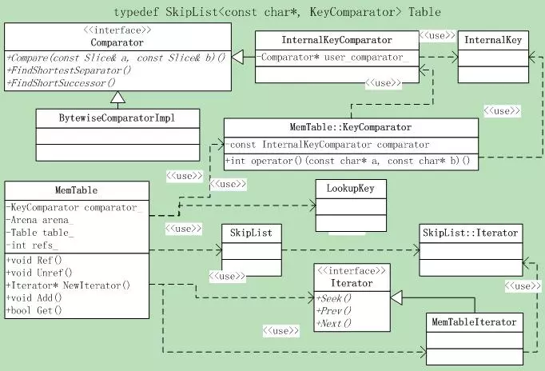

# leveldb源码分析3

本系列《leveldb源码分析》共有22篇文章，这是第三篇。

## 4. Memtable之一

Memtable是leveldb很重要的一块，leveldb的核心之一。我们肯定**关注KV数据在Memtable中是如何组织的，秘密在Skip list中。**

### 4.1 用途

在Leveldb中，所有内存中的KV数据都存储在Memtable中，物理disk则存储在SSTable中。在系统运行过程中，如果Memtable中的数据占用内存到达指定值(Options.write_buffer_size)，则Leveldb就自动将Memtable转换为Memtable，并自动生成新的Memtable，也就是**Copy-On-Write机制**了。

Immutable Memtable则被新的线程Dump到磁盘中，Dump结束则该Immutable Memtable就可以释放了。因名知意，**Immutable Memtable是只读的**。

**所以可见，最新的数据都是存储在Memtable中的，Immutable Memtable和物理SSTable则是某个时点的数据。**

为了防止系统down机导致内存数据Memtable或者Immutable Memtable丢失，leveldb自然也**依赖于log机制来保证可靠性**了。

Memtable提供了写入KV记录，删除以及读取KV记录的接口，但是事实上**Memtable并不执行真正的删除操作,**删除某个Key的Value在Memtable内是作为插入一条记录实施的，但是会打上一个Key的删除标记，**真正的删除操作在后面的 Compaction过程中，lazy delete。**

### 4.2 核心是Skip list

另外，Memtable中的**KV对是根据Key排序的**，leveldb在插入等操作时保证key的有序性。想想，前面看到的Skip list不正是合适的人选吗，**因此Memtable的核心数据结构是一个Skip list，Memtable只是一个接口类**。当然随之而来的一个问题就是Skip list是如何组织KV数据对的，在后面分析Memtable的插入、查询接口时我们将会看到答案。

### 4.3 接口说明

先来看看Memtable的接口：

```
void Ref() { ++refs_; }

void Unref();

Iterator* NewIterator();

void Add(SequenceNumber seq,
          ValueType type,
          const Slice& key,
          const Slice& value);

bool Get(const LookupKey& key, std::string* value, Status* s);
```

首先Memtable是基于引用计数的机制，如果引用计数为0，则在Unref中删除自己，**Ref和Unref**就是干这个的。

- **NewIterator**是返回一个迭代器，可以遍历访问table的内部数据，很好的设计思想，这种方式隐藏了table的内部实现。外部调用者必须保证使用Iterator访问Memtable的时候该Memtable是live的。
- **Add和Get**是添加和获取记录的接口，没有Delete，还记得前面说过，memtable的delete实际上是插入一条type为kTypeDeletion的记录。

### 4.4 类图

先来看看Memtable相关的**整体类层次**吧，并不复杂，还是相当清晰的。见图4.4-1。




### 4.5 Key结构

Memtable是一个KV存储结构，那么这个**key肯定是个重点**了，在分析接口实现之前，有必要仔细分析一下Memtable对key的使用。

这里面有5个key的概念，可能会让人混淆，下面就来一个一个的分析。

#### 4.5.1 InternalKey & ParsedInternalKey & User Key

**InternalKey**是一个复合概念，是有几个部分组合成的一个key，**ParsedInternalKey**就是对InternalKey分拆后的结果，先来看看ParsedInternalKey的成员，这是一个struct：

```
Slice user_key;

SequenceNumber sequence;

ValueType type;
```

也就是说InternalKey是由User key + SequenceNumber + ValueType组合而成的，顺便先分析下几个Key相关的函数，它们是了解Internal Key和User Key的关键。

首先是**InternalKey和ParsedInternalKey**相互转换的两个函数，如下。

```
bool ParseInternalKey (const Slice& internal_key,
                       ParsedInternalKey* result);

void AppendInternalKey (std::string* result,
                        const ParsedInternalKey& key);
```

函数实现很简单，就是字符串的拼接与把字符串按字节拆分，代码略过。根据实现，容易得到**InternalKey的格式**为：

```
| User key (string) | sequence number (7 bytes) | value type (1 byte) |
```

由此还可知道sequence number大小是7 bytes，**sequence number是所有基于op log系统的关键数据**，它唯一指定了不同操作的时间顺序。

把**user key放到前面****的原因**是，这样对同一个user key的操作就可以按照sequence number顺序连续存放了，不同的user key是互不相干的，因此把它们的操作放在一起也没有什么意义。

另外用户可以为user key定制比较函数，系统默认是字母序的。

下面的两个函数是分别从InternalKey中拆分出**User Key和Value Type**的，非常直观，代码也附上吧。

```
inline Slice ExtractUserKey(const Slice& internal_key)
{
    assert(internal_key.size() >= 8);
    return Slice(internal_key.data(), internal_key.size() - 8);
}

inline ValueType ExtractValueType(const Slice& internal_key)
{
    assert(internal_key.size() >= 8);
    const size_t n = internal_key.size();
    uint64_t num = DecodeFixed64(internal_key.data() + n - 8);
    unsigned char c = num & 0xff;
    return static_cast<ValueType>(c);
}
```

#### 4.5.2 LookupKey & Memtable Key

Memtable的**查询接口传入的是LookupKey**，它也是由User Key和Sequence Number组合而成的，从其构造函数：

```
LookupKey(const Slice& user_key, SequenceNumber s)
```

中分析出LookupKey的格式为：

```
| Size (int32变长)| User key (string) | sequence number (7 bytes) | value type (1 byte) |
```

两点：

- 这里的Size是user key长度+8，也就是整个字符串长度了；
- value type是kValueTypeForSeek，它等于kTypeValue。

由于LookupKey的size是变长存储的，因此它使用kstart_记录了user key string的起始地址，否则将不能正确的获取size和user key；

LookupKey导出了三个函数，可以分别从LookupKey得到**Internal Key，Memtable Key和User Key**，如下：

```
// Return a key suitable for lookup in a MemTable.
Slice memtable_key() const { return Slice(start_, end_ - start_); }

// Return an internal key (suitable for passing to an internal iterator)
Slice internal_key() const { return Slice(kstart_, end_ - kstart_); }

// Return the user key
Slice user_key() const { return Slice(kstart_, end_ - kstart_ - 8); }
```

其中**start_**是LookupKey字符串的开始，**end_**是结束，**kstart_**是start_+4，也就是user key字符串的起始地址。
