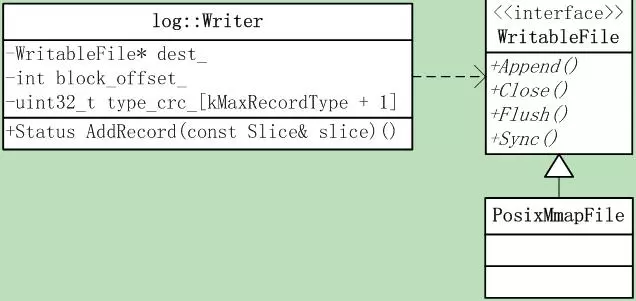

# leveldb源码分析5

本系列《leveldb源码分析》共有22篇文章，这是第五篇。

## 5.操作Log 1 

分析完KV在内存中的存储，接下来就是**操作日志**。所有的写操作都必须先成功的**append**到操作日志中，然后再更新内存**memtable**。这样做有**两点**：

1. **可以将随机的写IO变成append，极大的提高写磁盘速度；**
2. **防止在节点down机导致内存数据丢失，造成数据丢失，这对系统来说是个灾难。**

在各种高效的存储系统中，这已经是口水技术了。

###  5.1 格式

在源码下的文档**doc/log_format.txt**中，作者详细描述了**log格式**：

```
The log file contents are a sequence of 32KB blocks. 
The only exception is that the tail of thefile may contain a partial block.
Each block consists of a sequence of records:
block:= record* trailer?
record :=
checksum: uint32     // crc32c of type and data[] ; little-endian
length: uint16       // little-endian
type: uint8          // One of FULL,FIRST, MIDDLE, LAST
data: uint8[length]
```

> A record never starts within the last six bytes of a block (since it won'tfit).  Any leftover bytes here form thetrailer, which must consist entirely of zero bytes and must be skipped byreaders.

翻译过来就是：
Leveldb把日志文件切分成了大小为32KB的连续block块，block由连续的log record组成，log record的格式为：
**注意：CRC32, Length都是little-endian的。**

**Log Type**有4种：FULL = 1、FIRST = 2、MIDDLE = 3、LAST = 4。FULL类型表明该log record包含了完整的user record；而user record可能内容很多，超过了block的可用大小，就需要分成几条log record，第一条类型为FIRST，中间的为MIDDLE，最后一条为LAST。也就是：

1. FULL，说明该log record包含一个完整的user record；
2. FIRST，说明是user record的第一条log record
3. MIDDLE，说明是user record中间的log record
4. LAST，说明是user record最后的一条log record

翻一下文档上的例子，考虑到如下序列的**user records**：
 A: length 1000
 B: length 97270
 C: length 8000

- A作为FULL类型的record存储在第一个block中；
- B将被拆分成3条log record，分别存储在第1、2、3个block中，这时block3还剩6byte，将被填充为0；
- C将作为FULL类型的record存储在block 4中。

由于**一条logrecord长度最短为7**，如果一个block的剩余空间<=6byte，那么将**被填充为\**空字\******符串**，另外长度为7的log record是**不包括任何用户数据的**。

###  5.2 写日志

写比读简单，而且写入决定了读，所以从写开始分析。有意思的是在写文件时，Leveldb使用了内存映射文件，内存映射文件的读写效率比普通文件要高，关于内存映射文件为何更高效，这篇文章写的不错：
http://blog.csdn.net/mg0832058/article/details/5890688

其中涉及到的类层次比较简单，如图5.2-1：



注意Write类的成员**type_crc_数组**，这里存放的为Record Type预先计算的CRC32值，因为Record Type是固定的几种，为了效率。Writer类只有一个接口，就是**AddRecord()**，传入**Slice参数**，下面来看函数实现。首先取出slice的字**符串指针和长度**，初始化begin=true，表明是**第一条log record**。

```
const char* ptr = slice.data();
size_t left = slice.size();
bool begin = true;
```

然后进入一个**do{}while循环**，直到写入出错，或者成功写入全部数据，如下：

1

##### S1 首先查看当前block是否<7，如果<7则补位，并重置block偏移

```
dest_->Append(Slice("\x00\x00\x00\x00\x00\x00",leftover));
block_offset_ = 0;
```

##### S2 计算block剩余大小，以及本次log record可写入数据长度

```
const size_t avail =kBlockSize - block_offset_ - kHeaderSize;
const size_t fragment_length = (left <avail) ? left : avail
```

##### S3 根据两个值，判断log type

```
RecordType type;
const bool end = (left ==fragment_length); // 两者相等，表明写
if (begin && end)   type = kFullType;
else if (begin)     type = kFirstType;
else if (end)       type = kLastType;
else                type = kMiddleType;
```

##### S4 调用EmitPhysicalRecord函数，append日志；并更新指针、剩余长度和begin标记

```
s = EmitPhysicalRecord(type, ptr,fragment_length);
ptr += fragment_length;
left -= fragment_length;
begin = false;
```

2

接下来看看**EmitPhysicalRecord函数**，这是实际写入的地方，涉及到log的存储格式。函数声明为：

StatusWriter::EmitPhysicalRecord(RecordType t, const char* ptr, size_t n)
参数ptr为用户record数据，参数n为record长度，不包含log header。

##### S1 计算header，并Append到log文件，共7byte格式为：

```
| CRC32 (4 byte) | payload length lower + high (2 byte) |   type (1byte)|
char buf[kHeaderSize];
buf[4] = static_cast<char>(n& 0xff);
buf[5] =static_cast<char>(n >> 8);
buf[6] =static_cast<char>(t);   // 计算record type和payload的CRC校验值
uint32_t crc = crc32c::Extend(type_crc_[t], ptr, n);
crc = crc32c::Mask(crc);        // 空间调整
EncodeFixed32(buf, crc);
dest_->Append(Slice(buf,kHeaderSize));
```

##### S2 写入payload，并Flush，更新block的当前偏移

```
s =dest_->Append(Slice(ptr, n));
s = dest_->Flush();
block_offset_ += kHeaderSize +n;
```

以上就是写日志的逻辑，很直观。
