# 服务器开发中网络数据分析与故障排查经验漫谈


​      

一、 操作系统提供的网络接口

为了能更好的排查网络通信问题，我们需要熟悉操作系统提供的以下网络接口函数，列表如下：

| 接口函数名称 | 接口函数描述       | 接口函数签名                                                 |
| ------------ | ------------------ | ------------------------------------------------------------ |
| socket       | 创建套接字         | int socket(int domain, int type, int  protocol);             |
| connect      | 连接一个服务器地址 | int connect(int sockfd, const struct  sockaddr *addr,          socklen_t addrlen); |
| send         | 发送数据           | ssize_t send(int sockfd, const void *buf,  size_t len, int flags); |
| recv         | 收取数据           | ssize_t recv(int sockfd, void *buf,  size_t len, int flags); |
| accept       | 接收连接           | int accept4(int sockfd, struct sockaddr  *addr,          socklen_t *addrlen, int  flags); |
| shutdown     | 关闭收发链路       | int shutdown(int sockfd, int how);                           |
| close        | 关闭套接字         | int close(int fd);                                           |
| setsockopt   | 设置套接字选项     | int setsockopt(int sockfd, int level, int  optname,           const void *optval,  socklen_t optlen); |

注意：这里以bekeley提供的标准为例，不包括特定操作系统上特有的接口函数（如Windows平台的WSASend，linux的accept4），也不包括实际与网络数据来往不相关的函数（如select、linux的epoll），这里只讨论与tcp相关的接口函数，像与udp相关的函数sendto/recvfrom等函数与此类似。

下面讨论一下以上函数的一些使用注意事项：

1 以上函数如果调用出错后，返回值均为-1；但是返回值是-1，不一定代表出错，这还得根据对应的套接字模式（阻塞与非阻塞模式）。

2 默认使用的socket函数创建的套接字是阻塞模式的，可以调用相关接口函数将其设置为非阻塞模式（Windows平台可以使用ioctlsocket函数，linux平台可以使用fcntl函数，具体设置方法可以参考[这里](http://mp.weixin.qq.com/s?__biz=MzU2MTQ1MzI3NQ==&mid=2247483953&idx=1&sn=290847bffc273bbeb33ae1d71a53ab00&chksm=fc79c385cb0e4a93d9a4f2d85184c10e8ac498aea6a87a7afe3641d8ed0d1b0e043c062560e8&scene=21#wechat_redirect)。）。阻塞模式和非阻塞模式的套接字，对服务器的连接服务器和网络数据的收发行为影响很大。详情如下：

**阻塞模式**下，connect函数如果不能立刻连上服务器，会导致执行流阻塞在那里一会儿，直到connect连接成功或失败或网络超时；而非阻塞模式下，无论是否连接成功connect将立即返回，此时如果未连接成功，返回值将是-1，错误码是EINPROGRESS，表示连接操作仍然在进行中。Linux平台后续可以通过使用select/poll等函数检测该socket是否可写来判断连接是否成功。

**阻塞套接字模式**下，send函数如果由于对端tcp窗口太小，不足以将全部数据发送出去，将阻塞执行流，直到出错或超时或者全部发送出去为止；同理recv函数如果当前协议栈系统缓冲区中无数据可读，也会阻塞执行流，直到出错或者超时或者读取到数据。send和recv函数的超时时间可以参考下文关于常用socket选项的介绍。

**非阻塞套接字模式**下，如果由于对端tcp窗口太小，不足以将数据发出去，它将立刻返回，不会阻塞执行流，此时返回值为-1，错误码是EAGAIN或EWOULDBLOCK，表示当前数据发不出去，希望你下次再试。但是返回值如果是-1，也可能是真正的出错了，也可能得到错误码EINTR，表示被linux信号中断了，这点需要注意一下。recv函数与send函数情形一样。

3 send函数虽然名称叫“send”，但是其并不是将数据发送到网络上去，只是将数据从应用层缓冲区中拷贝到协议栈内核缓冲区中，具体什么时候发送到网络上去，与协议栈本身行为有关系（socket选项nagle算法与这个有关系，下文介绍常见套接字选项时会介绍），这点需要特别注意，所以即使send函数返回一个大于0的值n，也不能表明已经有n个字节发送到网络上去了。同样的道理，recv函数也不是从网络上收取数据，只是从协议栈内核缓冲区拷贝数据至应用层缓冲区，并不是真正地从网络上收数据，所以，调用recv时，操作系统的协议栈已经将数据从网络上收到自己的内核缓冲区中了，recv仅仅是一次数据拷贝操作而已。

4 由于套接字实现是收发全双工的，收和发通道相互独立，不会相互影响，shutdown函数是用来选择关闭socket收发通道中某一路（当然，也可以两路都关闭），其how参数取值一般有三个：SHUT_RD/SHUT_WR/SHUT_RDWR，SHUT_RD表示关闭收消息链路，即该套接字不能再收取数据，同理SHUT_WR表示关闭套接字发消息链路，但是这里有个问题，有时候我们需要等待缓冲区中数据发送完后再关闭连接怎么办？这里就要用到套接字选项LINGER，关于这个选项请参考下文常见的套接字选项介绍。最后，SHUT_RDWR同时关闭收消息链路和发消息链路。通过上面的分析，我们得出结论，shutdown函数并不会要求操作系统底层回收套接字等资源，真正会回收资源是close函数，这个函数会要求操作系统回收相关套接字资源，并释放对ip地址与端口号二元组的占用，但是由于tcp四次挥手最后一个阶段有个TIME_WAIT状态（关于这个状态下文介绍tcp三次握手和四次回收时会详细介绍），导致与该socket相关的端口号资源不会被立即释放，有时候为了达到释放端口用来复用，我们会设置套接字选项SOL_REUSEPORT（关于这个选项，下文会介绍）。综合起来，我们关闭一个套接字，一般会先调用shutdown函数再调用close函数，这就是所谓的优雅关闭：


5 常见的套接字选项

严格意义上说套接字选项是有不同层级的（level），如socket级别、TCP级别、IP级别，这里我们不区分具体的级别。

- **SO_SNDTIMEO与SO_RCVTIMEO**

这两个选项用于设置阻塞模式下套接字，SO_SNDTIMEO用于在send数据由于对端tcp窗口太小，发不出去而最大的阻塞时长；SO_RCVTIMEO用于recv函数因接受缓冲区无数据而阻塞的最大阻塞时长。如果你需要获取它们的默认值，请使用getsockopt函数。

- **TCP_NODELAY**

操作系统底层协议栈默认有这样一个机制，为了减少网络通信次数，会将send等函数提交给tcp协议栈的多个小的数据包合并成一个大的数据包，最后再一次性发出去，也就是说，如果你调用send函数往内核协议栈缓冲区拷贝了一个数据，这个数据也许不会马上发到网络上去，而是要等到协议栈缓冲区积累到一定量的数据后才会一次性发出去，我们把这种机制叫做nagle算法。默认打开了这个机制，有时候我们希望关闭这种机制，让send的数据能够立刻发出去，我们可以选择关闭这个算法，这就可以通过设置套接字选项TCP_NODELAY，即关闭nagle算法。

- **SO_LINGER**

linger这个单词本身的意思，是“暂停、逗留”。这个选项的用处是用于解决，当需要关闭套接字时，协议栈发送缓冲区中尚有未发送出去的数据，等待这些数据发完的最长等待时间。

- **SO_REUSEADDR/SO_REUSEPORT**

一个端口，尤其是作为服务器端端口在四次挥手的最后一步，有一个为TIME_WAIT的状态，这个状态一般持续2MSL（MSL，maximum segment life， 最大生存周期，RFC上建议是2分钟）。这个状态存在原因如下：1. 保证发出去的ack能被送达（超时会重发ack）2. 让迟来的报文有足够的时间被丢弃，反过来说，如果不存在这个状态，那么可以立刻复用这个地址和端口号，那么可能会收到老的连接迟来的数据，这显然是不好的。为了立即回收复用端口号，我们可以通过开启套接字SO_REUSEADDR/SO_REUSEPORT。

- **SO_KEEPALIVE**

默认情况下，当一个连接长时间没有数据来往，会被系统防火墙之类的服务关闭。为了避免这种现象，尤其是一些需要长连接的应用场景下，我们需要使用心跳包机制，即定时从两端定时发一点数据，这种行为叫做“保活”。而tcp协议栈本身也提供了这种机制，那就是设置套接字SO_KEEPALIVE选项，开启这个选项后，tcp协议栈会定时发送心跳包探针，但是这个默认时间比较长（2个小时），我们可以继续通过相关选项改变这个默认值。


​      

## 二、常用的网络故障排查工具

**1.ping**

ping命令可用于测试网络是否连通。

**2.telnet**

命令使用格式：

```
telnet  ip或域名 port
```

例如：

```
telnet 120.55.94.78 8888

telnet www.baidu.com 80
```

结合ping和telnet命令我们就可以判断一个服务器地址上的某个端口号是否可以对外提供服务。

由于我们使用的开发机器以windows居多，默认情况下，windows系统的telnet命令是没有打开的，我们可以在【控制面板】- 【程序】- 【程序和功能】- 【打开或关闭Windows功能】中打开telnet功能。

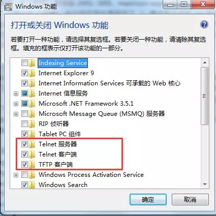


**3.host命令**

host 命令可以解析域名得到对应的ip地址。例如，我们要得到www.baidu.com这个域名的ip地址，可以输入：


 得到www.google.com的ip地址可以输入：


**4 .netstat命令**

常见的选项有：

-a (all)显示所有选项，netstat默认不显示LISTEN相关

-t (tcp)仅显示tcp相关选项

-u (udp)仅显示udp相关选项

-n 拒绝显示别名，能显示数字的全部转化成数字。(重要)

-l 仅列出有在 Listen (监听) 的服務状态

-p 显示建立相关链接的程序名(macOS中表示协议 -p protocol)

-r 显示路由信息，路由表

-e 显示扩展信息，例如uid等

-s 按各个协议进行统计 (重要)

-c 每隔一个固定时间，执行该netstat命令。


**5. lsof命令**

lsof，即list opened filedescriptor，即列出当前操作系统中打开的所有文件描述符，socket也是一种file descriptor，常见的选项是:

-i 列出系统打开的socket fd

-P 不要显示端口号别名

-n 不要显示ip地址别名（如localhost会用127.0.0.1来代替）

+c w 程序列名称最大可以显示到w个字符。

常见的选项组合为lsof –i –Pn：


可以看到列出了当前侦听的socket，和连接socket的tcp状态。


**6.pstack**

严格意义上来说，这个不算网络排查故障和调试命令，但是我们可以利用这个命令来查看某个进程的线程数量和线程调用堆栈是否运行正常。指令使用格式：

```
pstack pid
```

即，pstack 进程号，如：

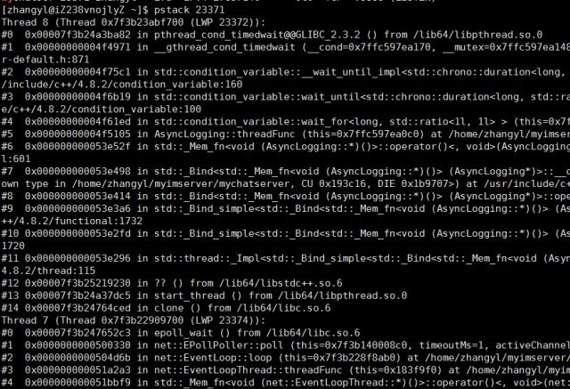


**7.nc命令**

即netcat命令，这个工具在排查网络故障时非常有用，因而被业绩称为网络界的“瑞士军刀”。常见的用法如下：

- 模拟服务器端在指定ip地址和端口号上侦听

```
nc –l 0.0.0.0 8888
```

- 模拟客户端连接到指定ip地址和端口号

```
nc 0.0.0.0 8888
```

我们知道客户端连接服务器一般都是操作系统随机分配一个可用的端口号连接到服务器上去，这个指令甚至可以指定使用哪个端口号连接，如：

```
nc –p 12345 127.0.0.1 8888
```

客户端使用端口12345去连接服务器127.0.0.1::8888。

- 使用nc命令发消息和发文件

客户端


服务器

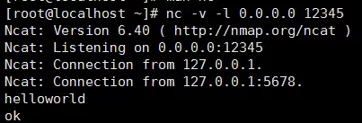


8 .tcpdump

这个是linux系统自带的抓包工具，功能非常强大，默认需要开启root权限才能使用。


其常见的选项有：

-i 指定网卡

-X –XX 打印十六进制的网络数据包

-n –nn 不显示ip地址和端口的别名

-S 以绝对值显示包的ISN号（包序列号）

 

常用的过滤条件有如下形式：

```
tcpdump –i any ‘port 8888’
tcpdump –i any ‘tcp port 8888’
tcpdump –i any ‘tcp src port 8888’
tcpdump –i any ‘tcp src port 8888 and udp dst port 9999’
tcpdump -i any 'src host 127.0.0.1 and tcp src port 12345' -XX -nn -vv
```

关于tcpdump命令接下来将会以对tcp三次握手和四次挥手的包数据进行抓包来分析。


## 三、 tcp三次握手和四次挥手过程解析

熟练地掌握tcp三次握手和四次挥手过程的每一个细节是我们排查网络问题的基础。

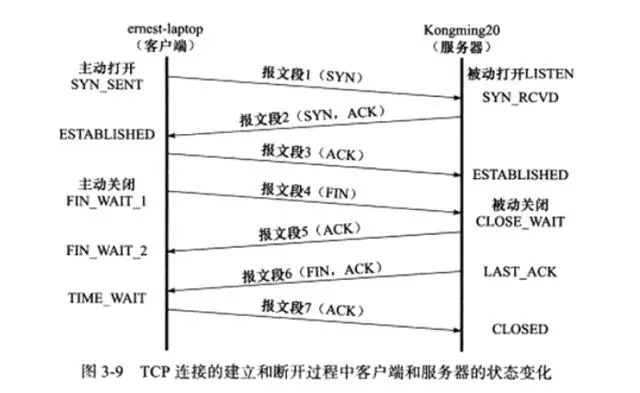

下面我们来通过tcpdump抓包能实战一下三次握手的过程，假设我的服务器端的地址是 127.0.0.0.1 : 12345，使用nc命令创建一个服务器程序并在这个地址上进行侦听：

```
nc –v -l 127.0.0.0.112345
```


然后在客户端机器上开启tcpdump工具：


然后在客户端使用nc命令创建一个客户端去连接服务器：


我们抓到的包如下：


图片看不清，可以放大来看。上面我们需要注意的是：

三次握手过程是客户端先给服务器发送一个SYN，然后服务器应答一个SYN+ACK，应答的序列号是递增1的，表示应答哪个请求，即从4004096087递增到4004096088，接着客户端再应答一个ACK。这个时候，我们发现发包序列号和应答序列号都变成1了，这是tcpdump使用相对序号，我们加上-S选项后就变成绝对序列号了。

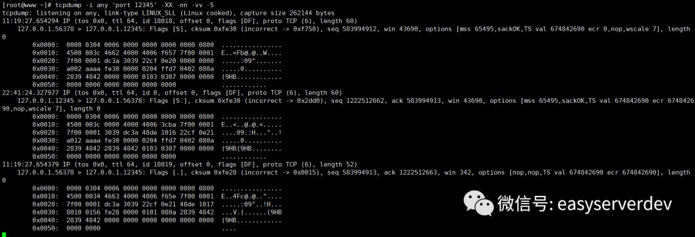

 这是正常的tcp三次握手，假如我们连接的服务器ip地址存在，但监听端口号并不存在，我们看下tcpdump抓包结果：


这个时候客户端发送SYN，服务器应答ACK+RST：


 这个应答包会导致客户端的connect连接失败。

 

还有一种情况就是客户端访问一个很遥远的ip，或者网络繁忙，服务器对客户端发送的网络SYN报文没有应答，会出现什么情况呢？


我们先将防火墙的已有规则都清理掉: iptables -F

然后给防火墙的INPUT链上增加一个规则，丢弃本地网卡lo（也就是127.0.0.1这个回环地址）上的所有SYN包。

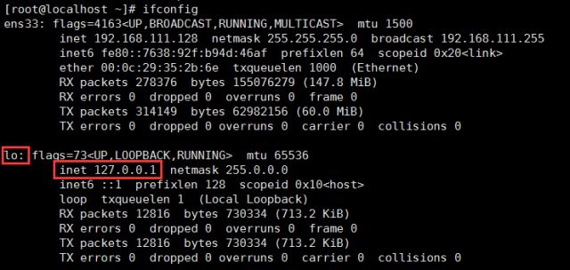


 接着，我们看到tcpdump抓到的数据包如下：

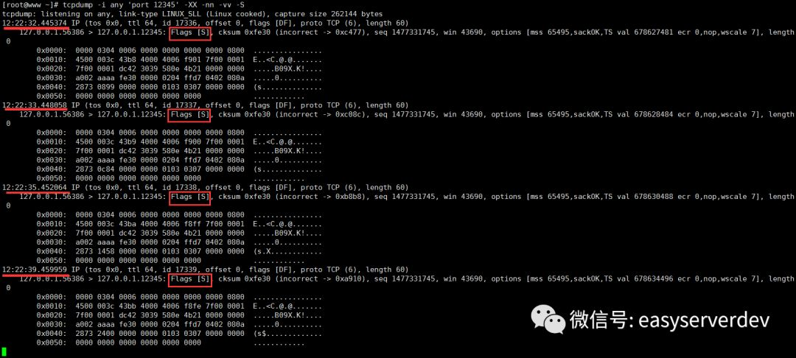


 连接不上，一共重试了5次，重试的时间间隔是1秒，2秒，4秒，8秒，16秒，最后返回失败。这个重试次数在/proc/sys/net/ipv4/tcp_syn_retries 内核参数中设置，默认为6。

 

四次挥手与三次握手基本上类似，这里就不贴出tcpdump抓包的详情了。实际的网络开发中，尤其是高QPS的服务器程序，可能在在服务器程序所在的系统上留下大量非ESTABLISHED的中间状态，如CLOSE_WAIT/TIME_WAIT，我们可以使用以下指令来统计这些状态信息：

**netstat -n | awk '/^tcp/ {++S[$NF]} END {for(a in S) print a, S[a]}'** 

得到结果可能类似：

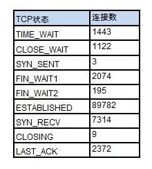


让我们再贴一张tcp三次握手和四次挥手更清晰的图吧。


 下面看下一般比较关心的三种TCP状态

- **SYN_RECV**

服务端收到建立连接的SYN没有收到ACK包的时候处在SYN_RECV状态。有两个相关系统配置：

1 net.ipv4.tcp_synack_retries，整形，默认值是5

对于远端的连接请求SYN，内核会发送SYN ＋ ACK数据报，以确认收到上一个 SYN连接请求包。这是三次握手机制的第二个步骤。这里决定内核在放弃连接之前所送出的 SYN+ACK 数目。不应该大于255，默认值是5，对应于180秒左右时间。通常我们不对这个值进行修改，因为我们希望TCP连接不要因为偶尔的丢包而无法建立。

2 net.ipv4.tcp_syncookies

一般服务器都会设置net.ipv4.tcp_syncookies=1来防止SYN Flood攻击。假设一个用户向服务器发送了SYN报文后突然死机或掉线，那么服务器在发出SYN+ACK应答报文后是无法收到客户端的ACK报文的（第三次握手无法完成），这种情况下服务器端一般会重试（再次发送SYN+ACK给客户端）并等待一段时间后丢弃这个未完成的连接，这段时间的长度我们称为SYN Timeout，一般来说这个时间是分钟的数量级（大约为30秒-2分钟）。这些处在SYNC_RECV的TCP连接称为半连接，并存储在内核的半连接队列中，在内核收到对端发送的ack包时会查找半连接队列，并将符合的requst_sock信息存储到完成三次握手的连接的队列中，然后删除此半连接。大量SYNC_RECV的TCP连接会导致半连接队列溢出，这样后续的连接建立请求会被内核直接丢弃，这就是SYN Flood攻击。能够有效防范SYN Flood攻击的手段之一，就是SYN Cookie。SYN Cookie原理由D. J. Bernstain和 Eric Schenk发明。SYN Cookie是对TCP服务器端的三次握手协议作一些修改，专门用来防范SYN Flood攻击的一种手段。它的原理是，在TCP服务器收到SYN包并返回SYN+ACK包时，不分配一个专门的数据区，而是根据这个SYN包计算出一个cookie值。在收到ACK包时，TCP服务器在根据那个cookie值检查这个TCP ACK包的合法性。如果合法，再分配专门的数据区进行处理未来的TCP连接。观测服务上SYN_RECV连接个数为：7314，对于一个高并发连接的通讯服务器，这个数字比较正常。

- **CLOSE_WAIT**

发起TCP连接关闭的一方称为client，被动关闭的一方称为server。被动关闭的server收到FIN后，但未发出ACK的TCP状态是CLOSE_WAIT。出现这种状况一般都是由于server端代码的问题，如果你的服务器上出现大量CLOSE_WAIT，应该要考虑检查代码。

 

- **TIME_WAIT**

根据三次握手断开连接规定，发起socket主动关闭的一方 socket将进入TIME_WAIT状态。TIME_WAIT状态将持续2MSL。TIME_WAIT状态下的socket不能被回收使用。 具体现象是对于一个处理大量短连接的服务器，如果是由服务器主动关闭客户端的连接，将导致服务器端存在大量的处于TIME_WAIT状态的socket， 甚至比处于Established状态下的socket多的多，严重影响服务器的处理能力，甚至耗尽可用的socket，停止服务。TIME_WAIT是TCP协议用以保证被重新分配的socket不会受到之前残留的延迟重发报文影响的机制,是必要的逻辑保证。和TIME_WAIT状态有关的系统参数有一般由3个，本机设置如下：

```
net.ipv4.tcp_tw_recycle = 1

net.ipv4.tcp_tw_reuse = 1

net.ipv4.tcp_fin_timeout = 30

net.ipv4.tcp_fin_timeout，默认60s，减小fin_timeout，减少TIME_WAIT连接数量。

net.ipv4.tcp_tw_reuse = 1表示开启重用。允许将TIME-WAIT sockets重新用于新的TCP连接，默认为0，表示关闭；

net.ipv4.tcp_tw_recycle = 1表示开启TCP连接中TIME-WAIT sockets的快速回收，默认为0，表示关闭。
```

我们这里总结一下这些与tcp状态的选项：

* net.ipv4.tcp_syncookies=1 表示开启SYN Cookies。当出现SYN等待队列溢出时，启用cookie来处理，可防范少量的SYN攻击。默认为0，表示关闭。

* net.ipv4.tcp_tw_reuse=1 表示开启重用。允许将TIME-WAIT套接字重新用于新的TCP连接。默认为0，表示关闭。

* net.ipv4.tcp_tw_recycle=1 表示开启TCP连接中TIME-WAIT套接字的快速回收。默认为0，表示关闭。**

* net.ipv4.tcp_fin_timeout=30 表示如果套接字由本端要求关闭，这个参数决定了它保持在FIN-WAIT-2状态的时间。

* net.ipv4.tcp_keepalive_time=1200 表示当keepalive启用时，TCP发送keepalive消息的频度。默认是2小时，这里改为20分钟。

* net.ipv4.ip_local_port_range=1024 65000 表示向外连接的端口范围。默认值很小：32768～61000，改为1024～65000。

* net.ipv4.tcp_max_syn_backlog=8192 表示SYN队列的长度，默认为1024，加大队列长度为8192，可以容纳更多等待连接的网络连接数。

* net.ipv4.tcp_max_tw_buckets=5000 表示系统同时保持TIME_WAIT套接字的最大数量，如果超过这个数 字，TIME_WAIT套接字将立刻被清除并打印警告信息。默认为180000，改为5000。

注意

上文中用红色字体标识出来的两个参数：

```
net.ipv4.tcp_tw_recycle

net.ipv4.tcp_tw_reuse
```


在实际linux内核参数调优时并不建议开启。至于原因，我会单独用一篇文章来介绍。


## 四、 关于跨系统与跨语言之间的网络通信连通问题


如何在Java语言中去解析C++的网络数据包，如何在C++中解析Java的网络数据包，对于很多人来说是一件很困难的事情，所以只能变着法子使用第三方的库。其实使用tcpdump工具可以很容易解决与分析。

首先，我们需要明确字节序列这样一个概念，即我们说的大端编码(big endian)和小端编码(little endian)，x86和x64系列的cpu使用小端编码，而数据在网络上传输，以及Java语言中，使用的是大端编码。那么这是什么意思呢？

我们举个例子，看一个x64机器上的32位数值在内存中的存储方式：

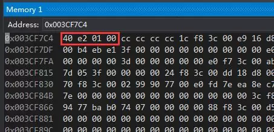


i 在内存中的地址序列是0x003CF7C4~ 0x003CF7C8，值为40 e2 01 00。

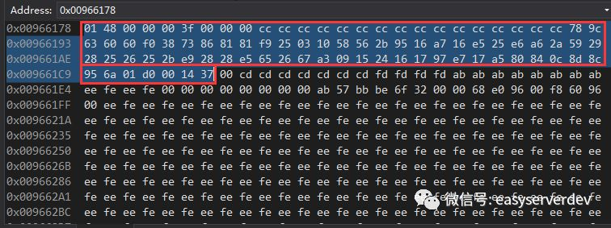


 十六进制0001e240正好等于10进制123456，也就是说小端编码中权重高的的字节值存储在内存地址高（地址值较大）的位置，权重值低的字节值存储在内存地址低（地址值较小）的位置，也就是所谓的高高低低。

相反，大端编码的规则应该是高低低高，也就是说权值高字节存储在内存地址低的位置，权值低的字节存储在内存地址高的位置。

所以，如果我们一个C++程序的int32值123456不作转换地传给Java程序，那么Java按照大端编码的形式读出来的值是：十六进制40E20100 = 十进制1088553216。

所以，我们要么在发送方将数据转换成网络字节序（大端编码），要么在接收端再进行转换。

 

下面看一下如果C++端传送一个如下数据结构，Java端该如何解析（由于Java中是没有指针的，也无法操作内存地址，导致很多人无从下手），下面利用tcpdump来解决这个问题的思路。

我们客户端发送的数据包：


其结构体定义如下：

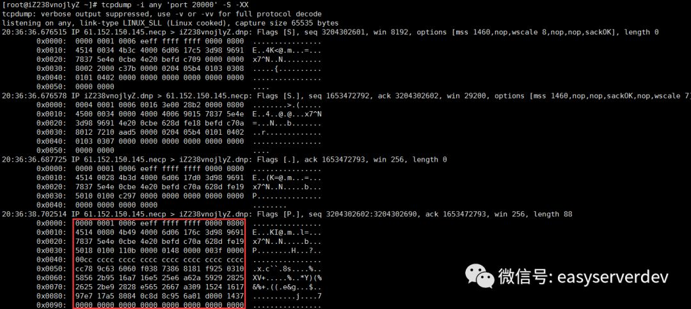


 利用tcpdump抓到的包如下：


放大一点：


 我们白色标识出来就是我们收到的数据包。这里我想说明两点：

- 如果我们知道发送端发送的字节流，再比照接收端收到的字节流，我们就能检测数据包的完整性，或者利用这个来排查一些问题；
-  对于Java程序只要按照这个顺序，先利用java.net.Socket的输出流java.io.DataOutputStream对象readByte、readInt32、readInt32、readBytes、readBytes方法依次读出一个char、int32、int32、16个字节的字节数组、63个字节数组即可，为了还原像int32这样的整形值，我们需要做一些小端编码向大端编码的转换。


参考资料：

- 《TCP/IP详解卷一：协议》
- 《TCP/IP详解卷二：实现》
- 游双《Linux高性能服务器编程》
- https://man.cx/?page=iptables(8)
- https://vincent.bernat.im/en/blog/2014-tcp-time-wait-state-linux
- https://blog.csdn.net/chinalinuxzend/article/details/1792184
- https://www.zhihu.com/question/29212769
- https://blog.csdn.net/launch_225/article/details/9211731
- https://www.cnblogs.com/splenday/articles/7668589.html
- http://man.linuxde.net/ss
- http://www.cnxct.com/coping-with-the-tcp-time_wait-state-on-busy-linux-servers-in-chinese-and-dont-enable-tcp_tw_recycle/
- https://www.cnblogs.com/xkus/p/7463135.html