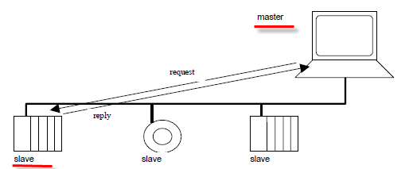
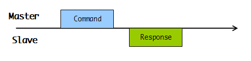
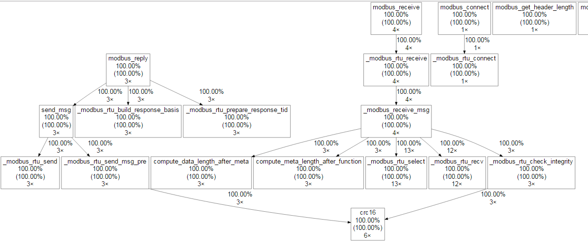
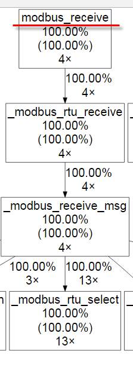
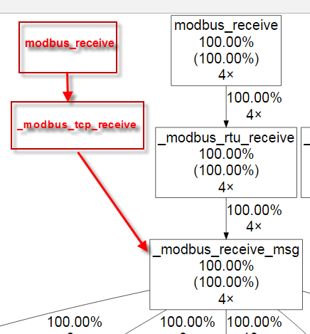
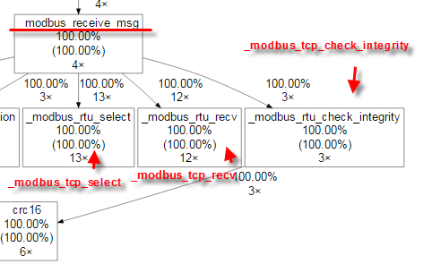
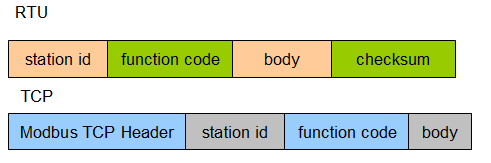

# 實例研討: 從 C++ 學習 C 高級技巧

很多人聲稱：

- function pointer 是 C 高級技巧
- 學習 C++ 讓我變成更好的 C 程式員。

這中間的因果關係，有沒有一個實際案例可以說明？筆者最近研究 libmodbus 發現這是一個極佳案例，很適合用來解釋上面這兩句話。專案規模不大，易於說明，無論你是 C or C++ fans 相信都能從中獲益。

##libmodbus

libmodbus 是處理 Modbus protocol 的一個開源 C 程式庫，Modbus protocol 之前小弟已經寫過很多文章解釋過了，這邊就快速帶過。一言以蔽之，無論是走 serial line (Modbus RTU/ASCII) 或是 TCP (Modbus TCP)，通訊方式都是採取一問一答的形式，差別只在於編碼方式，所以相較於 http 這種大部頭協議，Modbus 大概是 10 分鐘就可以講完的東西：






如上圖所示，Master 發命令給 Slave，然後等待 Slave 回應，就這麼一站一站問下去 (Command 與 Response 都帶有站號)，沒什麼特別的吧?(相較於 http 還有一堆長連接與 proxy 之類的鬼東西)。本篇文章將聚焦在 Slave 的行為上。

##編譯 libmodbus

還記得小弟之前寫過的文章嗎？不要傻傻的直接從 main() 開始追起，讓程式展現自我吧！

```sh
./configure
make CFLAGS='-pg -g -O0 -Wall' LDLIBS+='-pg' LDFLAGS+='-static -ldl'
```

這裡你必須先對 unit-test-server.c 動點手腳以免 process 被殺掉後一無所獲，這在另一篇文章中也分享過了，這邊不再重複。


##執行 unit-test-server

進入到 test/ 目錄，執行 ./unit-test-server rtu，如果你沒有 USB to Serial 的裝置，可以改下 ./unit-test-server tcp，接著用 modscan or modpoll 試著對 unit-test-server 通訊一下，然後用 kill -SIGUSR1 PID 殺掉 unit-test-server process。

##觀察 call graph

透過 gprof + graphviz，我們得到下面這張圖:




Slave 接收 Command 的地方在 modbus_receive():




modbus_receive() 原始碼如下:


```cpp
/* Receive the request from a modbus master */
int modbus_receive(modbus_t *ctx, uint8_t *req)
{
    if (ctx == NULL) {
        errno = EINVAL;
        return -1;
    }
 
    return ctx->backend->receive(ctx, req);
}
```

疑？可是我們上圖看到的是 _modbus_rtu_receive()，搜尋 _modbus_rtu_receive()，我們找到一段跟 backend & _modbus_rtu_receive() 有關的程式碼:


```cpp
const modbus_backend_t _modbus_rtu_backend = {
    _MODBUS_BACKEND_TYPE_RTU,
    _MODBUS_RTU_HEADER_LENGTH,
    _MODBUS_RTU_CHECKSUM_LENGTH,
    MODBUS_RTU_MAX_ADU_LENGTH,
    _modbus_set_slave,
    _modbus_rtu_build_request_basis,
    _modbus_rtu_build_response_basis,
    _modbus_rtu_prepare_response_tid,
    _modbus_rtu_send_msg_pre,
    _modbus_rtu_send,
    _modbus_rtu_receive, //<------
    _modbus_rtu_recv,
    _modbus_rtu_check_integrity,
    _modbus_rtu_pre_check_confirmation,
    _modbus_rtu_connect,
    _modbus_rtu_close,
    _modbus_rtu_flush,
    _modbus_rtu_select,
    _modbus_rtu_free
};
```

接著如果您 ./unit-test-server rtu 與 ./unit-test-server tcp 都試過，你會發現進入點都是 modbus_receive()，也都呼叫了 _modbus_receive_msg()： 




搜尋 _modbus_tcp_receive，同樣會找到 modbus_backend_t 變數定義 : 


```cpp
const modbus_backend_t _modbus_tcp_backend = {
    _MODBUS_BACKEND_TYPE_TCP,
    _MODBUS_TCP_HEADER_LENGTH,
    _MODBUS_TCP_CHECKSUM_LENGTH,
    MODBUS_TCP_MAX_ADU_LENGTH,
    _modbus_set_slave,
    _modbus_tcp_build_request_basis,
    _modbus_tcp_build_response_basis,
    _modbus_tcp_prepare_response_tid,
    _modbus_tcp_send_msg_pre,
    _modbus_tcp_send,
    _modbus_tcp_receive, //<------
    _modbus_tcp_recv,
    _modbus_tcp_check_integrity,
    _modbus_tcp_pre_check_confirmation,
    _modbus_tcp_connect,
    _modbus_tcp_close,
    _modbus_tcp_flush,
    _modbus_tcp_select,
    _modbus_tcp_free
};
```

看來 modbus_backend_t 扮演了關鍵角色，我們接著往下看。 

##物件導向 C 語言

先來看看 modbus_backend_t  本尊長相：

```cpp
typedef struct _modbus_backend {
    unsigned int backend_type;
    unsigned int header_length;
    unsigned int checksum_length;
    unsigned int max_adu_length;
    int (*set_slave) (modbus_t *ctx, int slave);
    int (*build_request_basis) (modbus_t *ctx, int function, int addr,
                                int nb, uint8_t *req);
    int (*build_response_basis) (sft_t *sft, uint8_t *rsp);
    int (*prepare_response_tid) (const uint8_t *req, int *req_length);
    int (*send_msg_pre) (uint8_t *req, int req_length);
    ssize_t (*send) (modbus_t *ctx, const uint8_t *req, int req_length);
    int (*receive) (modbus_t *ctx, uint8_t *req);
    ssize_t (*recv) (modbus_t *ctx, uint8_t *rsp, int rsp_length);
    int (*check_integrity) (modbus_t *ctx, uint8_t *msg,
                            const int msg_length);
    int (*pre_check_confirmation) (modbus_t *ctx, const uint8_t *req,
                                   const uint8_t *rsp, int rsp_length);
    int (*connect) (modbus_t *ctx);
    void (*close) (modbus_t *ctx);
    int (*flush) (modbus_t *ctx);
    int (*select) (modbus_t *ctx, fd_set *rset, struct timeval *tv, int msg_length);
    void (*free) (modbus_t *ctx);
} modbus_backend_t;
```

有沒有發現？這其實就是 C++ 中的 abstract base class，甚至可以直接翻譯成 C++ 而不會有任何違和感(精確一點的說法，下面的 class modbus_backend_t 稱為 interface class)： 


```cpp
class modbus_backend_t
{
public:
    virtual ~modbus_backend_t();
    virtual int backend_type()=0;
    virtual int header_length()=0;
    virtual int checksum_length()=0;
    virtual int max_adu_length()=0;
    virtual int set_slave(modbus_t *ctx, int slave)=0;
    virtual int build_request_basis(modbus_t *ctx, int function, int addr,
                                int nb, uint8_t *req)=0;
    //..........
    virtual int flush(modbus_t *ctx)=0;
    virtual int select(modbus_t *ctx, fd_set *rset, struct timeval *tv, int msg_length)=0;
    virtual void free(modbus_t *ctx)=0;
};
 
class _modbus_tcp_backend : public modbus_backend_t
{
public:
    _modbus_tcp_backend();
    ~_modbus_tcp_backend();
    virtual int backend_type(){ return _MODBUS_BACKEND_TYPE_TCP; }
    virtual int header_length(){ return _MODBUS_TCP_HEADER_LENGTH; }
    virtual int checksum_length(){ return _MODBUS_TCP_CHECKSUM_LENGTH; }
    //...
}
```

所以 libmodbus 透過 backend 這個界面，就不需要知道需要呼叫 _modbus_rtu_receive() 還是 _modbus_tcp_receive()，此種實作手法在其他開源專案中也很常見，例如 libevent。 

##Template method pattern in C

還記得前面提到 _modbus_rtu_receive() 與 _modbus_tcp_receive() 都呼叫了 _modbus_receive_msg() 了嗎?這個 function 並未被嵌入到 backend 裡，這隻共用的 function 則會依據選擇的 backend(RTU/TCP) 呼叫對應的 backend function:




如果打開 _modbus_receive_msg() 瞧瞧:

```cpp
int _modbus_receive_msg(modbus_t *ctx, uint8_t *msg, msg_type_t msg_type)
{
    int rc;
    fd_set rset;
    struct timeval tv;
    struct timeval *p_tv;
    int length_to_read;
    int msg_length = 0;
    _step_t step;
 
    if (ctx->debug) {
        if (msg_type == MSG_INDICATION) {
            printf("Waiting for a indication...\n");
        } else {
            printf("Waiting for a confirmation...\n");
        }
    }
 
    /* Add a file descriptor to the set */
    FD_ZERO(&rset);
    FD_SET(ctx->s, &rset);
 
    /* We need to analyse the message step by step.  At the first step, we want
     * to reach the function code because all packets contain this
     * information. */
    step = _STEP_FUNCTION;
    length_to_read = ctx->backend->header_length + 1;
 
    if (msg_type == MSG_INDICATION) {
        /* Wait for a message, we don't know when the message will be
         * received */
        p_tv = NULL;
    } else {
        tv.tv_sec = ctx->response_timeout.tv_sec;
        tv.tv_usec = ctx->response_timeout.tv_usec;
        p_tv = &tv;
    }
 
    while (length_to_read != 0) {
        rc = ctx->backend->select(ctx, &rset, p_tv, length_to_read);
        if (rc == -1) {
            _error_print(ctx, "select");
            if (ctx->error_recovery & MODBUS_ERROR_RECOVERY_LINK) {
                int saved_errno = errno;
 
                if (errno == ETIMEDOUT) {
                    _sleep_response_timeout(ctx);
                    modbus_flush(ctx);
                } else if (errno == EBADF) {
                    modbus_close(ctx);
                    modbus_connect(ctx);
                }
                errno = saved_errno;
            }
            return -1;
        }
 
        rc = ctx->backend->recv(ctx, msg + msg_length, length_to_read);
        if (rc == 0) {
            errno = ECONNRESET;
            rc = -1;
        }
 
        if (rc == -1) {
            _error_print(ctx, "read");
            if ((ctx->error_recovery & MODBUS_ERROR_RECOVERY_LINK) &&
                (errno == ECONNRESET || errno == ECONNREFUSED ||
                 errno == EBADF)) {
                int saved_errno = errno;
                modbus_close(ctx);
                modbus_connect(ctx);
                /* Could be removed by previous calls */
                errno = saved_errno;
            }
            return -1;
        }
 
        /* Display the hex code of each character received */
        if (ctx->debug) {
            int i;
            for (i=0; i < rc; i++)
                printf("<%.2X>", msg[msg_length + i]);
        }
 
        /* Sums bytes received */
        msg_length += rc;
        /* Computes remaining bytes */
        length_to_read -= rc;
 
        if (length_to_read == 0) {
            switch (step) {
            case _STEP_FUNCTION:
                /* Function code position */
                length_to_read = compute_meta_length_after_function(
                    msg[ctx->backend->header_length],
                    msg_type);
                if (length_to_read != 0) {
                    step = _STEP_META;
                    break;
                } /* else switches straight to the next step */
            case _STEP_META:
                length_to_read = compute_data_length_after_meta(
                    ctx, msg, msg_type);
                if ((msg_length + length_to_read) > (int)ctx->backend->max_adu_length) {
                    errno = EMBBADDATA;
                    _error_print(ctx, "too many data");
                    return -1;
                }
                step = _STEP_DATA;
                break;
            default:
                break;
            }
        }
 
        if (length_to_read > 0 &&
            (ctx->byte_timeout.tv_sec > 0 || ctx->byte_timeout.tv_usec > 0)) {
            /* If there is no character in the buffer, the allowed timeout
               interval between two consecutive bytes is defined by
               byte_timeout */
            tv.tv_sec = ctx->byte_timeout.tv_sec;
            tv.tv_usec = ctx->byte_timeout.tv_usec;
            p_tv = &tv;
        }
        /* else timeout isn't set again, the full response must be read before
           expiration of response timeout (for CONFIRMATION only) */
    }
 
    if (ctx->debug)
        printf("\n");
 
    return ctx->backend->check_integrity(ctx, msg, msg_length);
}
```

顯然 _modbus_receive_msg() 正在進行一個解封包的動作，而 Modbus TCP/RTU 封包結構其實很相近: 





差別只在於 Modbus TCP Header 多了一個 header 拿掉 checksum 而已，所以 libmodbus 作者的高明之處就是 Modbus Slave 他用同一個 SOP 處理 Modbus RTU/TCP，而沒有寫出兩份 code。例如 RTU 有 checksum，但 TCP 不用，那作者怎麼處理的呢？


```cpp
static int _modbus_tcp_check_integrity(modbus_t *ctx, uint8_t *msg, const int msg_length)
{
    return msg_length;
}
```

bypass 直接返回 packet length，而 _modbus_rtu_check_integrity 則是進行 CRC 檢查: 

```cpp
/* The check_crc16 function shall return 0 is the message is ignored and the
   message length if the CRC is valid. Otherwise it shall return -1 and set
   errno to EMBADCRC. */
static int _modbus_rtu_check_integrity(modbus_t *ctx, uint8_t *msg,
                                       const int msg_length)
{
    uint16_t crc_calculated;
    uint16_t crc_received;
    int slave = msg[0];
    //........................
}
```

在 C++ 裡這種手法稱為 Template method，虛擬碼如下: 

```cpp
class modbus_backend_t
{
     
protected:
    virtual int select(modbus_t *ctx, 
                        fd_set *rset, 
                        struct timeval *tv, 
                        int msg_length)=0;
    virtual ssize_t recv(modbus_t *ctx, uint8_t *rsp, int rsp_length)=0;
    virtual int check_integrity(modbus_t *ctx, uint8_t *msg,
                        const int msg_length)=0;
     
public:
    virtual ~modbus_backend_t();
    //...
    //call select, recv, check_integrity of _modbus_rtu(tcp)_backend
    int _modbus_receive_msg(modbus_t *ctx, uint8_t *msg, msg_type_t msg_type)
    //...
};
 
 
class _modbus_rtu_backend : public modbus_backend_t
{
protected:    
    virtual int select(modbus_t *ctx, 
                        fd_set *rset, 
                        struct timeval *tv, 
                        int msg_length)=0;
    virtual ssize_t recv(modbus_t *ctx, uint8_t *rsp, int rsp_length)=0;
    virtual int check_integrity(modbus_t *ctx, uint8_t *msg,
                        const int msg_length)=0;    
public:
    _modbus_tcp_backend();
    ~_modbus_tcp_backend();
}
```

由上述程式可以看到我們不公開 select, recv, check_integrity 三個 member function，而且是 pure virtual member function 留給 modbus_backend_t 後代去實作，而 _modbus_receive_msg() 則在 modbus_backend_t 就已經定義實作完畢(注意他不是 virtual function)，_modbus_receive_msg() 內部會呼叫 select, recv, check_integrity，這些細節則留到子代實作。細節可以參考 Effective C++。 

##尾聲

相信看到這裡，很多人跟小弟一樣恍然大悟原來真的可以用 C 實作物件導向，如果您所在的平台只有 C 可以用或者 C++ 不成熟或者您覺得 C++ 有太多陷阱，此種手法對您發展大型 C 程式一定相當有助益，歡迎留言討論 :)
