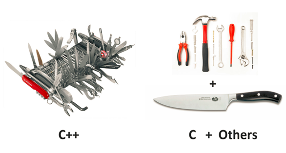
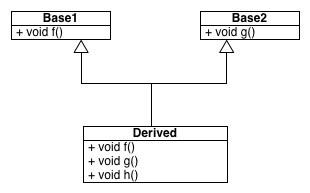
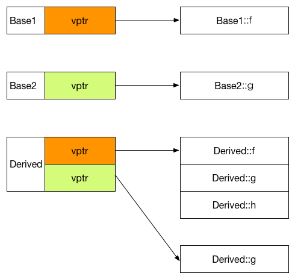
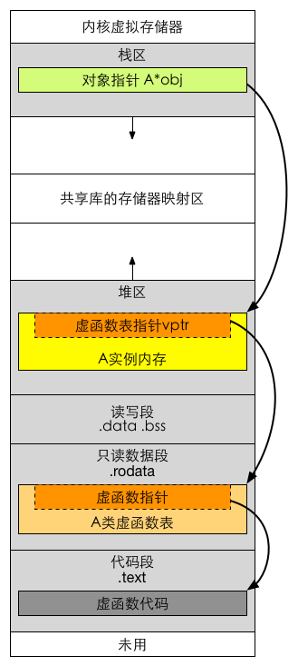

# 探索C++虚函数在g++中的实现


本文是我在追查一个诡异core问题的过程中收获的一点心得，把公司项目相关的背景和特定条件去掉后，仅取其中通用的C++虚函数实现部分知识记录于此。

在开始之前，原谅我先借用一张图黑一下C++：



如果你也在写C++，请一定小心…至少，你要先有所了解：当你在写虚函数的时候，g++在写什么？


##先写个例子

为了探索C++虚函数的实现，我们首先编写几个用来测试的类，代码如下：

```cpp
#include <iostream>
using namespace std;

class Base1
{
public:
    virtual void f()
    {
        cout << "Base1::f()" << endl;
    }
};

class Base2
{
public:
    virtual void g()
    {
        cout << "Base2::g()" << endl;
    }
};

class Derived : public Base1, public Base2
{
public:
    virtual void f()
    {
        cout << "Derived::f()" << endl;
    }

    virtual void g()
    {
        cout << "Derived::g()" << endl;
    }

    virtual void h()
    {
        cout << "Derived::h()" << endl;
    }
};

int main(int argc, char* argv[])
{
    Derived ins;
    Base1& b1 = ins;
    Base2& b2 = ins;
    Derived& d = ins;

    b1.f();
    b2.g();
    d.f();
    d.g();
    d.h();

    return 0;
}
```




代码的输出结果和预期的一致，C++实现了虚函数覆盖功能，代码输出如下：


```cpp
Derived::f()
Derived::g()
Derived::f()
Derived::g()
Derived::h()
```

##开始分析！

我写这篇文章的重点是尝试解释g++编译在底层是如何实现虚函数覆盖和动态绑定的，因此我假定你已经明白基本的虚函数概念以及虚函数表（vtbl）和虚函数表指针（vptr）的概念和在继承实现中所承担的作用，如果你还不清楚这些概念，建议你在继续阅读下面的分析前先补习一下相关知识，`陈皓的《C++虚函数表解析》系列`是一个不错的选择。

通过本文，我将尝试解答下面这三个问题：

- g++如何实现虚函数的动态绑定？
- vtbl在何时被创建？vptr又是在何时被初始化？
- 在Linux中运行的C++程序虚拟存储器中，vptr、vtbl存放在虚拟存储的什么位置？

###g++如何实现虚函数的动态绑定？

这个问题乍看简单，大家都知道是通过vptr和vtbl实现的，那就让我们刨根问底的看一看，g++是如何利用vptr和vtbl实现的。

第一步，使用 `-fdump-class-hierarchy` 参数导出g++生成的类内存结构：

```sh
Vtable for Base1
Base1::_ZTV5Base1: 3u entries
0     (int (*)(...))0
4     (int (*)(...))(& _ZTI5Base1)
8     Base1::f
 
Class Base1
   size=4 align=4
   base size=4 base align=4
Base1 (0xb6acb438) 0 nearly-empty
    vptr=((& Base1::_ZTV5Base1) + 8u)
 
Vtable for Base2
Base2::_ZTV5Base2: 3u entries
0     (int (*)(...))0
4     (int (*)(...))(& _ZTI5Base2)
8     Base2::g
 
Class Base2
   size=4 align=4
   base size=4 base align=4
Base2 (0xb6acb474) 0 nearly-empty
    vptr=((& Base2::_ZTV5Base2) + 8u)
 
Vtable for Derived
Derived::_ZTV7Derived: 8u entries
0     (int (*)(...))0
4     (int (*)(...))(& _ZTI7Derived)
8     Derived::f
12    Derived::g
16    Derived::h
20    (int (*)(...))-0x000000004
24    (int (*)(...))(& _ZTI7Derived)
28    Derived::_ZThn4_N7Derived1gEv
 
Class Derived
   size=8 align=4
   base size=8 base align=4
Derived (0xb6b12780) 0
    vptr=((& Derived::_ZTV7Derived) + 8u)
  Base1 (0xb6acb4b0) 0 nearly-empty
      primary-for Derived (0xb6b12780)
  Base2 (0xb6acb4ec) 4 nearly-empty
      vptr=((& Derived::_ZTV7Derived) + 28u)
```



其中有几点尤其值得注意：

- 我用来测试的机器是32位机，所有vptr占4个字节，每个vtbl中的函数指针也是4个字节

- 每个类的主要（primal）vptr放在类内存空间的起始位置（由于我没有声明任何成员变量，可能看不清楚）

- 在多继承中，对应各个基类的vptr按继承顺序依次放置在类内存空间中，且子类与第一个基类共用同一个vptr

- 子类中声明的虚函数除了覆盖各个基类对应函数的指针外，还额外添加一份到第一个基类的vptr中（体现了共用的意义）
有了内存布局后，接下来观察g++是如何在这样的内存布局上进行动态绑定的。

`g++对每个类的指针或引用对象，如果是其类声明中虚函数，使用位于其内存空间首地址上的vptr寻找找到vtbl进而得到函数地址。如果是父类声明而子类未覆盖的虚函数，使用对应父类的vptr进行寻址`。

先来验证一下，使用 objdump -S 得到 `b1.f()` 的汇编指令：

```sh
 b1.f();
 8048734:       8b 44 24 24             mov    0x24(%esp),%eax    # 得到Base1对象的地址
 8048738:       8b 00                   mov    (%eax),%eax        # 对对象首地址上的vptr进行解引用，得到vtbl地址
 804873a:       8b 10                   mov    (%eax),%edx        # 解引用vtbl上第一个虚函数的地址
 804873c:       8b 44 24 24             mov    0x24(%esp),%eax
 8048740:       89 04 24                mov    %eax,(%esp)
 8048743:       ff d2                   call   *%edx              # 调用函数
 ```
 
 其过程和我们的分析完全一致，聪明的你可能发现了，b2怎么办呢？Derived类的实例内存首地址上的vptr并不是Base2类的啊！答案实际上是因为g++在引用赋值语句 Base2 &b2 = ins 上动了手脚：
 
 ```sh
 Derived ins;
 804870d:       8d 44 24 1c             lea    0x1c(%esp),%eax
 8048711:       89 04 24                mov    %eax,(%esp)
 8048714:       e8 c3 01 00 00          call   80488dc <_ZN7DerivedC1Ev>
    Base1 &b1 = ins;
 8048719:       8d 44 24 1c             lea    0x1c(%esp),%eax
 804871d:       89 44 24 24             mov    %eax,0x24(%esp)
    Base2 &b2 = ins;
 8048721:       8d 44 24 1c             lea    0x1c(%esp),%eax   # 获得ins实例地址
 8048725:       83 c0 04                add    $0x4,%eax         # 添加一个指针的偏移量
 8048728:       89 44 24 28             mov    %eax,0x28(%esp)   # 初始化引用
    Derived &d = ins;
 804872c:       8d 44 24 1c             lea    0x1c(%esp),%eax
 8048730:       89 44 24 2c             mov    %eax,0x2c(%esp)
 ```


`虽然是指向同一个实例的引用，根据引用类型的不同，g++编译器会为不同的引用赋予不同的地址。`例如b2就获得一个指针的偏移量，因此才保证了vptr的正确性。

PS：我们顺便也证明了C++中的引用的真实身份就是指针…

接下来进入第二个问题：


###vtbl在何时被创建？vptr又是在何时被初始化？

既然我们已经知道了g++是如何通过vptr和vtbl来实现虚函数魔法的，那么vptr和vtbl又是在什么时候被创建的呢？

vptr是一个相对容易思考的问题，因为vptr明确的属于一个实例，所以vptr的赋值理应放在类的构造函数中。`g++为每个有虚函数的类在构造函数末尾中隐式的添加了为vptr赋值的操作`。

同样通过生成的汇编代码验证：


```sh
class Derived : public Base1, public Base2
{
 80488dc:       55                      push   %ebp
 80488dd:       89 e5                   mov    %esp,%ebp
 80488df:       83 ec 18                sub    $0x18,%esp
 80488e2:       8b 45 08                mov    0x8(%ebp),%eax
 80488e5:       89 04 24                mov    %eax,(%esp)
 80488e8:       e8 d3 ff ff ff          call   80488c0 <_ZN5Base1C1Ev>
 80488ed:       8b 45 08                mov    0x8(%ebp),%eax
 80488f0:       83 c0 04                add    $0x4,%eax
 80488f3:       89 04 24                mov    %eax,(%esp)
 80488f6:       e8 d3 ff ff ff          call   80488ce <_ZN5Base2C1Ev>
 80488fb:       8b 45 08                mov    0x8(%ebp),%eax
 80488fe:       c7 00 48 8a 04 08       movl   $0x8048a48,(%eax)
 8048904:       8b 45 08                mov    0x8(%ebp),%eax
 8048907:       c7 40 04 5c 8a 04 08    movl   $0x8048a5c,0x4(%eax)
 804890e:       c9                      leave
 804890f:       c3                      ret
 ```
 
 可以看到在代码中，Derived类的构造函数为实例的两个vptr赋初值，可是，这两个初值居然是立即数！立即数！立即数！`这说明了vtbl的生成并不是运行时的，而是在编译期就已经确定了存放在这两个地址上的！`

这个地址不出意料的属于.rodata（只读数据段），使用 `objdump -s -j .rodata`
提取出对应的内存观察：


```sh
80489e0 03000000 01000200 00000000 42617365  ............Base
 80489f0 313a3a66 28290042 61736532 3a3a6728  1::f().Base2::g(
 8048a00 29004465 72697665 643a3a66 28290044  ).Derived::f().D
 8048a10 65726976 65643a3a 67282900 44657269  erived::g().Deri
 8048a20 7665643a 3a682829 00000000 00000000  ved::h()........
 8048a30 00000000 00000000 00000000 00000000  ................
 8048a40 00000000 a08a0408 34880408 68880408  ........4...h...
 8048a50 94880408 fcffffff a08a0408 60880408  ............`...
 8048a60 00000000 c88a0408 08880408 00000000  ................
 8048a70 00000000 d88a0408 dc870408 37446572  ............7Der
 8048a80 69766564 00000000 00000000 00000000  ived............
 8048a90 00000000 00000000 00000000 00000000  ................
 8048aa0 889f0408 7c8a0408 00000000 02000000  ....|...........
 8048ab0 d88a0408 02000000 c88a0408 02040000  ................
 8048ac0 35426173 65320000 a89e0408 c08a0408  5Base2..........
 8048ad0 35426173 65310000 a89e0408 d08a0408  5Base1..........
 ```
 
 由于程序运行的机器是小端机，经过简单的转换就可以得到第一个vptr所指向的内存中的第一条数据为0x80488834，如果把这个数据解释为函数地址到汇编文件中查找，会得到：

```sh
08048834 <_ZN7Derived1fEv>:
};
 
class Derived : public Base1, public Base2
{
public:
    virtual void f() {
 8048834:       55                      push   %ebp
 8048835:       89 e5                   mov    %esp,%ebp
 8048837:       83 ec 18                sub    $0x18,%esp
 ```
 
 Bingo！`g++在编译期就为每个类确定了vtbl的内容，并且在构造函数中添加相应代码使vptr能够指向已经填好的vtbl的地址`。

这也同时为我们解答了第三个问题：

###在Linux中运行的C++程序虚拟存储器中，vptr、vtbl存放在虚拟存储的什么位置？

直接看图：





图中灰色部分应该是你已经熟悉的，彩色部分内容和相关联的箭头描述了虚函数调用的过程（图中展示的是通过new在堆区创建实例的情况，与示例代码有所区别，小失误，不要在意）：`当调用虚函数时，首先通过位于栈区的实例的指针找到位于堆区中的实例地址，然后通过实例内存开头处的vptr找到位于.rodata段的vtbl，再根据偏移量找到想要调用的函数地址，最后跳转到代码段中的函数地址执行目标函数。`


##总结

研究这些问题的起因是因为公司代码出现了非常奇葩的行为，经过追查定位到虚函数表出了问题，因此才有机会脚踏实地的对虚函数实现进行一番探索。

也许你会想，即使我不明白这些底层原理，也一样可以正常的使用虚函数，也一样可以写出很好的面相对象的代码啊？

这一点儿也没有错，但是，C++作为全宇宙最复杂的程序设计语言，它提供的功能异常强大，无异于武侠小说中锋利无比的屠龙宝刀。但武功不好的菜鸟如果胡乱舞弄宝刀，却很容易反被其所伤。只有了解了C++底层的原理和机制，才能让我们把C++这把屠龙宝刀使用的更加得心应手，变化出更加华丽的招式，成为真正的武林高手。