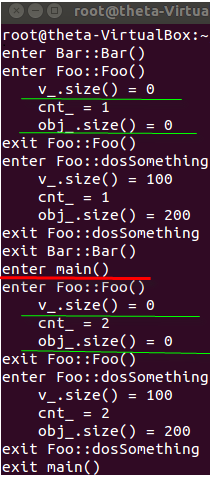
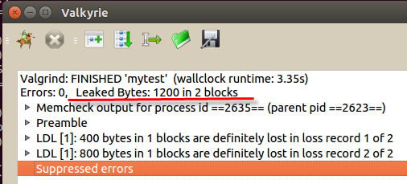
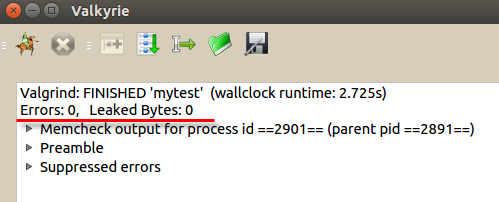

# 為何 Google 禁止工程師使用 C++ static object?

網路流傳的 Google C++ Style Guide 裡提到：Google 禁止旗下工程師使用 static object，僅允許使用 static Plain Old Data(ints, chars, floats, pointers)，或 POD array/struct。可惜的是文中缺少實際範例指出這樣做的危害，剛好小弟最近踩到這個地雷，來跟大家分享一下心得 :)

這個例子用到了三個自定 classes：
- class MyArray
- class Foo
- class Bar

這三個 classes 都極其平凡又短小，沒有用到任何進階技巧，就連初學者都看得懂。我們先對三個 classes 稍做解釋，然後再來看這三個 classes 混在一起時會產生何種化學變化。


class MyArray & Foo


```cpp
//foo.h
#ifndef FOO_H
#define FOO_H
 
#include <vector>
 
class MyArray
{
    int size_;
    int *ary_;
public:
    MyArray();
    ~MyArray();
    void resize(int n);
    int size();
};
 
 
class Foo
{
public:
    Foo();
    ~Foo();
    void doSomething();
     
private:
    typedef std::vector<int> IntVector;
    static int cnt_;
    static IntVector v_;
    static MyArray obj_;
};
 
#endif
```

```cpp
//foo.cpp
#include <stdio.h>
#include "foo.h"

Foo::IntVector Foo::v_;
int Foo::cnt_;
MyArray Foo::obj_;

MyArray::MyArray():
    size_(0),
    ary_(0)
{

}

MyArray::~MyArray()
{
    if (ary_) {
        delete[]ary_;
    }
}

void MyArray::resize(int n)
{
    if (ary_) {
        delete[]ary_;
    }

    ary_ = new int[n];
    size_ = n;
}

int MyArray::size()
{
    return size_;
}

Foo::Foo()
{
    printf("enter Foo::Foo()\n");
    printf("    v_.size() = %d\n", v_.size());
    printf("    cnt_ = %d\n", ++cnt_);
    printf("    obj_.size() = %d\n", obj_.size());

    if (v_.size() == 0) {
        v_.resize(100);
    }

    if (obj_.size() == 0) {
        obj_.resize(200);
    }

    printf("exit Foo::Foo()\n");
}

Foo::~Foo()
{

}

void Foo::doSomething()
{
    printf("enter Foo::dosSomething\n");
    printf("    v_.size() = %d\n", v_.size());
    printf("    cnt_ = %d\n", cnt_);
    printf("    obj_.size() = %d\n", obj_.size());
    printf("exit Foo::dosSomething\n");
}
```

##class MyArray
由上面程式可以很清楚的看到，MyArray object 剛建立時兩個 member data: size_, ary_ 都是 0 (foo.cpp:10-11)，直到呼叫 MyArray::resize() 才會動態產生 int array (foo.cpp:22-29)，MyArray 的用處只是用來比對 std::vector<int>，看看凶手是否與 template 有關。

##class Foo
三個 member data 皆為 static：

- cnt_: POD
- v_: std::vector<int>
- obj_: MyArray

重點在於 Foo constructor，他會對三個 static member data 分別進行 (foo.cpp:36-49)：

- cnt_: 每次呼叫 constructor 就 + 1
- v_: 如果 v_.size() == 0，則 resize(100)
- obj_: 如果 obj_.size() == 0，則 resize(200)

以大部分人對 static object 的瞭解，無論 Foo constructor 被呼叫多少次，v_, obj_ 應該只會 resize 一次(這裡可是 single thread 喔)，真的是這樣嗎？請各位先保持耐心繼續往下看。

## class Bar

```cpp
//bar.h
#ifndef BAR_H
#define BAR_H
 
class Bar
{
public:    
    Bar();
    ~Bar();    
};
 
#endif
```

```cpp
//bar.cpp
#include <stdio.h>
#include "bar.h"
#include "foo.h"
 
static Bar bar;
 
Bar::Bar()
{
    printf("enter Bar::Bar()\n");
    Foo().doSomething();
    printf("exit Bar::Bar()\n");
}
     
Bar::~Bar()
{
     
}
```

class Bar 更是平凡無奇，他只是在 bar.cpp 內建立了一個 static Bar object (bar.cpp:6)，在 Bar constructor 內建立了 Foo 臨時物件，並且呼叫了 Foo::doSomething() 列印 Foo static member data 資訊 (bar.cpp:11)。 

##見證奇蹟的時刻

我們建立一個 main.cpp，觀察進入 int main() 前跟後的行為...

```cpp
#include <stdio.h>
#include "foo.h"
 
int main()
{
    printf("enter main()\n");
    Foo().doSomething();
    printf("exit main()\n");
    return 0;
}
```

按照以下步驟編譯連結(測試環境為 Ubuntu 14.04)：

```sh
g++ -c foo.cpp
g++ -c bar.cpp
g++ -c main.cpp
g++ bar.o foo.o main.o -o mytest
./mytest 的執行結果：
```




從上圖中可以看到 static Bar bar 先被建立，Bar constructor 呼叫 Foo constructor，於是 Foo::cnt_ + 1，Foo::v_, Foo::obj_ 則是依照前述 resize()， 

`但怪異的是進入 main() 後再次呼叫 Foo constructor，居然 Foo::v_, Foo::obj_ 大小仍然為 0 !？What the fuck！？`

valgrind 也告訴你有 memory leak!!



先別急著回頭檢查程式，我們換個順序連結 object file 看看：

g++ foo.o bar.o main.o -o mytest

再用 valgrind 檢查一次：




天啊，這樣就不藥而癒了。

現在你知道為什麼 Google 說 static object 會造成難以發現的 bug 了吧？在大型專案中很難精細控制連結順序，C++ 也未保證 static object 的初始化順序。而我們也看到 POD(Foo::cnt_) 是無害的，他的變化一直在我們預料之中(Foo constructor 被呼叫幾次就遞增幾次)。

這個問題的解決辦法之一是改用 Single Instance Pattern:


```cpp
class Foo
{
public:
    Foo();
    ~Foo();
    void doSomething();
    static Foo* instance();
     
private:
    typedef std::vector<int> IntVector;
    int cnt_;
    IntVector v_;
    MyArray obj_;
    static Foo *inst_;
};
 
//...
 
Foo* Foo::inst_ = 0;
 
Foo* Foo::instance()
{
    if(!inst_)
        inst_ = new Foo;
}
```

不過這會帶來一個額外的問題：誰來負責刪除 Foo::instance() 產生在 heap 內的物件？如果你妄想使用 std::auto_ptr 或其他類似的 smart pointer，那就又會重回前面 static object 陷阱。

唯一的方式就是打造一個 Foo::clean()，Google 建議註冊 at_quick_exit() 來達成目的，但這個 C++ 11 的東西可不是每個人都有，最簡單的作法就是「以彼之道，還彼之身」，我們創造一個 class CleanUp，在 main() 內把需要在 main() 離開時需要清除的物件註冊進去：


```cpp
#ifndef CLEANUP__H
#define CLEANUP__H
 
#include <vector>
 
class CleanUp
{
     
public:
    typedef void (*Handler)(void *arg);
     
    CleanUp();
    ~CleanUp();
     
    void push(Handler h, void *arg);
     
private:
    struct HandlerArg
    {
        Handler handler_;
        void *arg_;
    };
     
    typedef std::vector<HandlerArg> HandlerArgVector;
    HandlerArgVector v_;
};
#endif
```

因為在離開 main() 時會解構堆疊內的 CleanUp object，CleanUp destructor 就順帶呼叫這些 clean handler(如前面提到的 Foo::clean())，就可以完美刪除這些 single instance，又不用依賴新函式庫了。

有位老兄曾經說他幾乎每種環境包含單晶片都是 C++ 給他用下去沒在怕的，但從這個例子我們可以看到，對於 C++ 我們最好還是乖乖學習 Google 遠離地雷區。之前有人說 C++ 是個「學深用淺」的電腦語言，我想現在大家包括小弟知道為什麼這樣解釋了，學深是為了避開陷阱，用淺是高深的用法往往會帶來反效果，正如同這個例子。